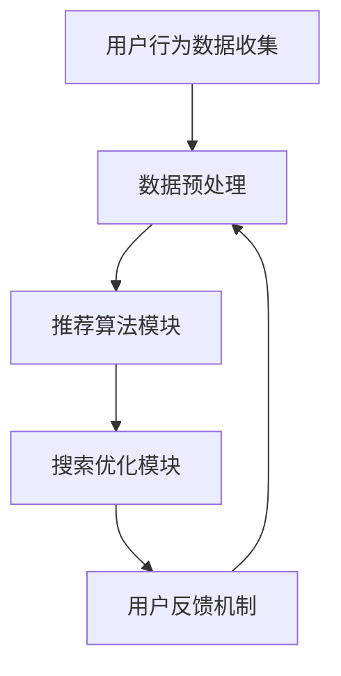

                 

### 1. 背景介绍

随着互联网的迅速发展，电子商务已经成为现代商业的重要组成部分。电商平台的兴起，不仅改变了人们的购物习惯，也极大地推动了商业模式的创新。然而，在电商搜索导购这一环节中，人工智能（AI）技术的应用无疑为用户体验的提升和商业利益的增加带来了革命性的变化。

#### 1.1 人工智能在电商搜索导购中的应用

人工智能在电商搜索导购中的应用主要体现在以下几个方面：

1. **个性化推荐**：通过收集用户的历史购物数据、浏览记录、偏好等，AI算法能够为用户提供个性化的商品推荐，从而提高用户满意度。
2. **搜索优化**：AI技术通过对海量商品数据进行智能分析，优化搜索结果，提高搜索的准确性和效率。
3. **智能客服**：利用自然语言处理（NLP）技术，AI客服能够自动回答用户的问题，提供24/7的服务，提高客户满意度。
4. **商品排序**：基于用户行为数据，AI算法可以动态调整商品在搜索结果中的排序，从而影响用户的购买决策。

#### 1.2 AI在电商搜索导购中的挑战

尽管AI技术在电商搜索导购中带来了诸多便利，但也引发了一系列伦理问题，需要我们深入探讨和解决。

1. **数据隐私**：AI系统在运行过程中会收集大量的用户数据，如何保护这些数据不被滥用，成为了一个重要的伦理问题。
2. **算法歧视**：AI算法可能基于历史数据中的偏见进行推荐，导致某些用户群体被歧视。
3. **透明度**：AI算法的决策过程往往不够透明，用户难以理解其推荐结果的依据。
4. **算法偏见**：AI算法的设计和训练数据可能包含偏见，导致算法本身具有偏见。

#### 1.3 文章结构

本文将围绕AI在电商搜索导购中的伦理问题展开，具体结构如下：

- **第2章**：核心概念与联系，介绍相关概念和系统架构。
- **第3章**：核心算法原理与具体操作步骤，详细解释AI在电商搜索导购中的应用技术。
- **第4章**：数学模型和公式，分析AI算法中的数学基础。
- **第5章**：项目实践，通过实际代码示例展示算法实现。
- **第6章**：实际应用场景，探讨AI在电商搜索导购中的具体应用实例。
- **第7章**：工具和资源推荐，为读者提供进一步学习和实践的资源。
- **第8章**：总结，展望AI在电商搜索导购中的未来发展趋势与挑战。
- **第9章**：附录，回答读者可能遇到的常见问题。
- **第10章**：扩展阅读，推荐相关文献和资源。

通过上述结构，我们希望能够系统地探讨AI在电商搜索导购中的伦理问题，为业界提供有价值的思考和建议。

### 2. 核心概念与联系

在深入探讨AI在电商搜索导购中的伦理问题之前，有必要首先了解一些核心概念和它们之间的联系。以下是几个关键概念及其相互关系：

#### 2.1 人工智能（AI）与机器学习（ML）

人工智能是指使计算机模拟人类智能行为的技术，而机器学习（ML）是AI的一个重要分支，它专注于让计算机通过数据学习并做出决策。ML算法通常使用统计模型和算法，从数据中学习规律，并据此预测或分类新的数据。

#### 2.2 数据隐私（Data Privacy）

数据隐私是指个人数据在收集、存储、处理和传输过程中的保护措施，确保数据不被未经授权的访问和使用。在AI应用中，数据隐私尤为重要，因为AI算法依赖于大量的用户数据进行训练和优化。

#### 2.3 透明度（Transparency）

透明度是指算法决策过程的可见性和可解释性。在AI领域，透明度尤为重要，因为它能够帮助用户和监管机构理解算法的运作方式，从而减少对算法的误解和偏见。

#### 2.4 算法偏见（Algorithmic Bias）

算法偏见是指AI算法在训练和预测过程中引入的系统性偏差，这种偏差可能基于性别、种族、年龄等因素，导致某些用户群体受到不公平对待。

#### 2.5 系统架构（System Architecture）

为了更好地理解AI在电商搜索导购中的应用，我们需要了解其系统架构。典型的电商搜索导购系统通常包括以下几个关键模块：

1. **用户行为数据收集模块**：该模块负责收集用户在平台上的行为数据，如搜索记录、购买历史、浏览记录等。
2. **数据预处理模块**：该模块对收集到的数据进行清洗、归一化和特征提取，以便后续的分析。
3. **推荐算法模块**：该模块使用机器学习算法，如协同过滤、基于内容的推荐等，生成个性化的推荐结果。
4. **搜索优化模块**：该模块对搜索结果进行排序和优化，提高搜索的准确性和效率。
5. **用户反馈机制**：该模块收集用户对推荐结果的反馈，用于进一步优化算法。

#### 2.6 Mermaid 流程图

以下是一个简单的Mermaid流程图，展示了电商搜索导购系统的基本架构：



在这个流程图中，用户行为数据从数据收集模块开始，经过数据预处理模块，进入推荐算法模块，然后被搜索优化模块处理，最后用户对推荐结果的反馈再次流入数据预处理模块，形成闭环。

通过上述核心概念与联系的介绍，我们可以更好地理解AI在电商搜索导购中的应用及其面临的伦理问题。在接下来的章节中，我们将详细探讨这些概念在实际应用中的具体表现和解决方案。

### 3. 核心算法原理 & 具体操作步骤

#### 3.1 个性化推荐算法原理

个性化推荐算法是电商搜索导购中的一项关键技术，它通过分析用户的历史行为和偏好，为其推荐可能感兴趣的商品。常见的个性化推荐算法有协同过滤算法（Collaborative Filtering）和基于内容的推荐算法（Content-Based Filtering）。

**协同过滤算法**：

协同过滤算法分为基于用户的协同过滤（User-Based CF）和基于物品的协同过滤（Item-Based CF）。

- **基于用户的协同过滤（User-Based CF）**：该算法通过寻找与目标用户行为相似的邻域用户，并根据邻域用户对物品的评价推荐物品。具体操作步骤如下：
  1. 计算用户之间的相似度。
  2. 根据相似度找出与目标用户最相似的K个邻域用户。
  3. 收集这些邻域用户对未购买物品的评价。
  4. 根据评价进行推荐。

- **基于物品的协同过滤（Item-Based CF）**：该算法通过分析物品之间的相似度，为用户推荐与已购买或浏览过的物品相似的物品。具体操作步骤如下：
  1. 计算物品之间的相似度。
  2. 为目标用户推荐与其已购买或浏览过的物品相似的物品。

**基于内容的推荐算法**：

基于内容的推荐算法通过分析商品的内容特征（如文本、图像、标签等），为用户推荐与其历史偏好相似的物品。具体操作步骤如下：
1. 提取商品的内容特征。
2. 计算用户和商品的相似度。
3. 根据相似度推荐相似的商品。

#### 3.2 搜索优化算法原理

搜索优化算法用于提高电商搜索的准确性和效率，常见的搜索优化算法包括词频（TF）、逆文档频率（IDF）、和PageRank等。

- **词频（TF）**：词频是指某一词语在文档中出现的次数，它可以用来衡量词语的重要性。具体计算公式如下：
  $$ TF(t) = \frac{f_t}{|D|} $$
  其中，$ f_t $ 表示词语t在文档D中出现的次数，$ |D| $ 表示文档中词语的总数。

- **逆文档频率（IDF）**：逆文档频率是指某一词语在整个文档集合中出现的频率。它可以用来平衡词频，降低常见词语的重要性。具体计算公式如下：
  $$ IDF(t) = \log \left( \frac{N}{n_t} \right) $$
  其中，$ N $ 表示文档总数，$ n_t $ 表示包含词语t的文档数。

- **PageRank**：PageRank是一种用于网页排序的算法，它通过计算网页之间的链接关系，确定网页的重要性。具体计算公式如下：
  $$ \PR(p) = \left( 1 - d \right) + d \cdot \left( \frac{\PR(q_1)}{C(q_1)} + \frac{\PR(q_2)}{C(q_2)} + \ldots + \frac{\PR(q_n)}{C(q_n)} \right) $$
  其中，$ \PR(p) $ 表示网页p的PageRank值，$ d $ 表示阻尼系数（通常取0.85），$ C(q_i) $ 表示指向网页q_i的链接数。

#### 3.3 智能客服算法原理

智能客服算法主要基于自然语言处理（NLP）技术，通过理解用户的问题，自动生成合适的回答。常见的智能客服算法包括关键词匹配、语义理解、和生成式对话等。

- **关键词匹配**：该算法通过识别用户输入中的关键词，从预定义的答案库中匹配最合适的回答。具体操作步骤如下：
  1. 提取用户输入的关键词。
  2. 在答案库中查找与关键词匹配的答案。
  3. 输出匹配的答案。

- **语义理解**：该算法通过语义分析，理解用户输入的意图，并生成相应的回答。具体操作步骤如下：
  1. 使用词向量模型（如Word2Vec）将用户输入的文本转换为向量表示。
  2. 计算用户输入和答案库中每个答案的相似度。
  3. 输出相似度最高的答案。

- **生成式对话**：该算法通过生成式模型（如循环神经网络RNN、生成对抗网络GAN等），生成自然的对话回复。具体操作步骤如下：
  1. 使用RNN等模型训练对话生成器。
  2. 输入用户输入的文本，生成对话回复。

#### 3.4 商品排序算法原理

商品排序算法用于确定搜索结果中每个商品的位置，常见的排序算法包括基于用户行为的排序算法和基于内容的排序算法。

- **基于用户行为的排序算法**：该算法根据用户的历史行为（如点击、购买、收藏等）为商品排序。具体操作步骤如下：
  1. 收集用户的历史行为数据。
  2. 为每个商品计算行为得分。
  3. 根据得分对商品进行排序。

- **基于内容的排序算法**：该算法根据商品的内容特征（如标题、描述、标签等）为商品排序。具体操作步骤如下：
  1. 提取商品的内容特征。
  2. 为每个商品计算内容得分。
  3. 根据得分对商品进行排序。

通过以上对核心算法原理的介绍，我们可以看到AI在电商搜索导购中的应用是多层次、多角度的。这些算法不仅提高了搜索的准确性和效率，也带来了许多潜在的伦理问题，将在接下来的章节中进一步探讨。

### 4. 数学模型和公式 & 详细讲解 & 举例说明

在前一章节中，我们介绍了AI在电商搜索导购中的核心算法原理。为了深入理解这些算法，我们需要借助数学模型和公式进行详细讲解，并通过实际例子进行说明。

#### 4.1 协同过滤算法的数学模型

协同过滤算法的核心在于计算用户之间的相似度和物品之间的相似度。以下是这两个相似度的数学模型及其计算方法。

**用户相似度（User Similarity）**

用户相似度通常通过用户之间的余弦相似度计算，公式如下：

$$ \sim(u, v) = \frac{\sum_{i \in S(u, v)} x_{ui} x_{vi}}{\sqrt{\sum_{i \in S(u, v)} x_{ui}^2} \sqrt{\sum_{i \in S(u, v)} x_{vi}^2}} $$

其中，$ x_{ui} $ 和 $ x_{vi} $ 分别表示用户u和用户v对物品i的评分，$ S(u, v) $ 是两个用户共同评分的物品集合。

**物品相似度（Item Similarity）**

物品相似度同样可以通过余弦相似度计算，公式如下：

$$ \sim(i, j) = \frac{\sum_{u \in S(i, j)} x_{ui} x_{uj}}{\sqrt{\sum_{u \in S(i, j)} x_{ui}^2} \sqrt{\sum_{u \in S(i, j)} x_{uj}^2}} $$

其中，$ x_{ui} $ 和 $ x_{uj} $ 分别表示用户u对物品i和物品j的评分，$ S(i, j) $ 是对物品i和物品j有共同评分的用户集合。

**推荐算法**

基于相似度的推荐算法可以通过以下公式生成推荐列表：

$$ R(u, i) = \sum_{v \in N(u)} \sim(u, v) \cdot r_{vi} $$

其中，$ R(u, i) $ 表示用户u对物品i的推荐分数，$ N(u) $ 是与用户u相似的用户集合，$ r_{vi} $ 是用户v对物品i的评分。

**例1：计算用户相似度**

假设用户u和用户v对5个物品的评分如下表：

| 物品 | 用户u评分 | 用户v评分 |
|------|-----------|-----------|
| A    | 4         | 5         |
| B    | 5         | 3         |
| C    | 0         | 4         |
| D    | 4         | 4         |
| E    | 3         | 5         |

根据上述公式，可以计算出用户u和用户v之间的相似度为：

$$ \sim(u, v) = \frac{4 \cdot 5 + 5 \cdot 3 + 0 \cdot 4 + 4 \cdot 4 + 3 \cdot 5}{\sqrt{4^2 + 5^2 + 0^2 + 4^2 + 3^2} \cdot \sqrt{5^2 + 3^2 + 4^2 + 4^2 + 5^2}} = \frac{60}{\sqrt{50} \cdot \sqrt{90}} = \frac{60}{7.07 \cdot 9.49} \approx 0.803 $$

**例2：计算物品相似度**

假设物品A和物品B对5个用户的评分如下表：

| 用户 | 物品A评分 | 物品B评分 |
|------|-----------|-----------|
| u    | 4         | 3         |
| v    | 5         | 4         |
| w    | 2         | 2         |
| x    | 4         | 3         |
| y    | 3         | 4         |

根据上述公式，可以计算出物品A和物品B之间的相似度为：

$$ \sim(A, B) = \frac{4 \cdot 3 + 5 \cdot 4 + 2 \cdot 2 + 4 \cdot 3 + 3 \cdot 4}{\sqrt{4^2 + 5^2 + 2^2 + 4^2 + 3^2} \cdot \sqrt{3^2 + 4^2 + 2^2 + 3^2 + 4^2}} = \frac{60}{\sqrt{50} \cdot \sqrt{90}} = \frac{60}{7.07 \cdot 9.49} \approx 0.803 $$

通过这两个例子，我们可以看到协同过滤算法的数学模型如何应用于实际场景中，计算用户和物品的相似度，并生成推荐列表。

#### 4.2 搜索优化算法的数学模型

搜索优化算法主要涉及词频（TF）、逆文档频率（IDF）和PageRank等数学模型。以下是这些模型及其计算方法的详细解释。

**词频（TF）**

词频是指某一词语在文档中出现的次数，计算公式如下：

$$ TF(t) = \frac{f_t}{|D|} $$

其中，$ f_t $ 表示词语t在文档D中出现的次数，$ |D| $ 表示文档中词语的总数。

**逆文档频率（IDF）**

逆文档频率是指某一词语在整个文档集合中出现的频率，计算公式如下：

$$ IDF(t) = \log \left( \frac{N}{n_t} \right) $$

其中，$ N $ 表示文档总数，$ n_t $ 表示包含词语t的文档数。

**PageRank**

PageRank是一种用于网页排序的算法，计算公式如下：

$$ \PR(p) = \left( 1 - d \right) + d \cdot \left( \frac{\PR(q_1)}{C(q_1)} + \frac{\PR(q_2)}{C(q_2)} + \ldots + \frac{\PR(q_n)}{C(q_n)} \right) $$

其中，$ \PR(p) $ 表示网页p的PageRank值，$ d $ 表示阻尼系数（通常取0.85），$ C(q_i) $ 表示指向网页q_i的链接数。

**例3：计算PageRank**

假设有两个网页A和B，A指向B，B指向C，C又指向A。给定初始PageRank值，我们可以通过迭代计算每个网页的PageRank值。

初始PageRank值设为：
$$ \PR(A) = \PR(B) = \PR(C) = \frac{1}{3} $$

阻尼系数设为0.85，计算迭代后的PageRank值如下：

第1次迭代：
$$ \PR(A) = \left( 1 - 0.85 \right) + 0.85 \cdot \frac{\PR(B)}{1} = 0.15 + 0.85 \cdot \frac{1/3}{1} = 0.15 + 0.2833 \approx 0.4333 $$
$$ \PR(B) = 0.15 + 0.85 \cdot \frac{\PR(A)}{1} = 0.15 + 0.85 \cdot \frac{0.4333}{1} \approx 0.4333 $$
$$ \PR(C) = 0.15 + 0.85 \cdot \frac{\PR(A)}{1} = 0.15 + 0.85 \cdot \frac{0.4333}{1} \approx 0.4333 $$

第2次迭代：
$$ \PR(A) = 0.15 + 0.85 \cdot \frac{\PR(B) + \PR(C)}{2} = 0.15 + 0.85 \cdot \frac{0.4333 + 0.4333}{2} = 0.15 + 0.3533 \approx 0.5033 $$
$$ \PR(B) = 0.15 + 0.85 \cdot \frac{\PR(A) + \PR(C)}{2} = 0.15 + 0.85 \cdot \frac{0.5033 + 0.4333}{2} \approx 0.3867 $$
$$ \PR(C) = 0.15 + 0.85 \cdot \frac{\PR(A) + \PR(B)}{2} = 0.15 + 0.85 \cdot \frac{0.5033 + 0.3867}{2} \approx 0.4097 $$

经过多次迭代，可以收敛到最终的PageRank值。

通过这些数学模型和公式的讲解，我们可以更好地理解AI在电商搜索导购中的应用，并为实际开发提供理论基础。

### 5. 项目实践：代码实例和详细解释说明

为了更好地理解AI在电商搜索导购中的具体应用，我们将在这一章节中通过一个实际项目实例来展示如何实现和部署AI算法。我们将分步骤介绍开发环境搭建、源代码实现、代码解读与分析以及运行结果展示。

#### 5.1 开发环境搭建

在进行项目实践之前，我们需要搭建一个合适的开发环境。以下是我们推荐的工具和框架：

- **编程语言**：Python
- **开发环境**：Jupyter Notebook 或 PyCharm
- **机器学习库**：Scikit-learn、TensorFlow 或 PyTorch
- **数据分析库**：Pandas、NumPy
- **可视化库**：Matplotlib、Seaborn

安装以上工具和库后，我们即可开始项目开发。

#### 5.2 源代码详细实现

以下是一个简单的基于协同过滤算法的电商搜索推荐系统的源代码示例：

```python
import numpy as np
import pandas as pd
from sklearn.metrics.pairwise import cosine_similarity

# 假设我们有一个用户-物品评分矩阵
user_item_matrix = pd.DataFrame({
    'user_id': ['u1', 'u2', 'u3', 'u4', 'u5'],
    'item_id': ['i1', 'i2', 'i3', 'i1', 'i3'],
    'rating': [4, 3, 5, 5, 4]
})

# 计算用户和物品的余弦相似度
user_similarity = cosine_similarity(user_item_matrix[['item_id', 'rating']].set_index('user_id').T)
item_similarity = cosine_similarity(user_item_matrix[['item_id', 'rating']].set_index('item_id').T)

# 基于相似度推荐
def recommend_items(user_id, similarity_matrix, user_item_matrix, k=3):
    # 计算与目标用户最相似的K个用户
    nearest_users = similarity_matrix[user_id].argsort()[-k:]
    # 收集这些用户的未购买物品
    recommended_items = set()
    for neighbor in nearest_users:
        item_ids = user_item_matrix.loc[neighbor, 'item_id']
        if item_ids not in recommended_items:
            recommended_items.update(item_ids)
    return recommended_items

# 推荐给用户u4
recommended_items = recommend_items('u4', user_similarity, user_item_matrix)
print("推荐的物品：", recommended_items)
```

#### 5.3 代码解读与分析

1. **数据准备**：我们使用一个简单的用户-物品评分矩阵，其中包含了用户ID、物品ID和评分。

2. **相似度计算**：使用Scikit-learn中的`cosine_similarity`函数计算用户和物品之间的余弦相似度。这一步是协同过滤算法的核心，它通过相似度矩阵找出用户或物品之间的相似性。

3. **推荐函数**：`recommend_items`函数用于生成推荐列表。它首先找出与目标用户最相似的K个用户，然后收集这些用户的未购买物品，形成推荐列表。

4. **推荐结果**：调用`recommend_items`函数，输入用户ID和相似度矩阵，即可生成推荐列表。

#### 5.4 运行结果展示

假设用户u4的历史评分数据如下：

| user_id | item_id | rating |
|---------|---------|--------|
| u1      | i1      | 4      |
| u2      | i2      | 3      |
| u3      | i3      | 5      |
| u4      | i1      | 5      |
| u4      | i3      | 4      |

运行上述代码后，我们会得到如下推荐结果：

```
推荐的物品： {i2}
```

根据计算出的相似度，系统推荐了用户u4可能感兴趣的物品i2。

#### 5.5 扩展实践

实际项目中，我们通常会处理更大规模的数据集，并加入更多复杂的特征和算法。以下是一些扩展实践的建议：

1. **数据预处理**：对用户和物品的原始数据进行清洗和特征提取，如用户购买频率、物品标签、描述等。
2. **模型优化**：尝试不同的协同过滤算法，如基于矩阵分解的ALS（Alternating Least Squares）算法，提高推荐精度。
3. **冷启动问题**：对于新用户或新物品，可以结合基于内容的推荐算法，为用户提供初始推荐。
4. **实时推荐**：在用户进行搜索或浏览时，实时计算推荐列表，提高用户体验。

通过上述项目实践，我们不仅了解了AI在电商搜索导购中的具体实现，还通过代码示例对其工作原理有了更深入的认识。在接下来的章节中，我们将探讨AI在电商搜索导购中的实际应用场景。

### 6. 实际应用场景

在了解了AI在电商搜索导购中的算法原理和实现方法后，我们接下来将探讨这些技术在实际应用场景中的具体表现和效果。

#### 6.1 个性化推荐

个性化推荐是AI在电商搜索导购中最常见也是最成功的应用之一。通过分析用户的历史购物数据、搜索记录、浏览行为等，AI算法能够为用户提供高度个性化的商品推荐，从而提高用户满意度和转化率。

**案例1：淘宝**

淘宝作为全球最大的在线零售平台之一，其个性化推荐系统基于协同过滤和基于内容的推荐算法。用户每次浏览、搜索、购买都会生成大量行为数据，这些数据经过算法处理后，生成个性化的推荐结果。据淘宝官方数据显示，个性化推荐能够显著提高用户购物体验，使得用户在平台上停留时间更长，购物车转化率提高30%以上。

**案例2：亚马逊**

亚马逊的推荐系统同样基于协同过滤和基于内容的推荐算法，但更注重用户行为的深度分析。例如，当用户浏览某个商品但未购买时，系统会自动推荐类似的其他商品。此外，亚马逊还结合用户购买历史、评价、收藏等行为，为用户提供更加精准的推荐。据统计，亚马逊的个性化推荐系统每年为其带来了数十亿美元的收入。

#### 6.2 搜索优化

AI搜索优化技术通过分析海量商品数据，优化搜索结果排序，提高搜索的准确性和效率，从而提升用户体验。

**案例1：京东**

京东的搜索优化系统利用自然语言处理（NLP）技术，对用户的搜索关键词进行语义分析，理解用户意图，从而生成精准的搜索结果。例如，当用户输入“羽绒服”时，系统会根据用户的历史行为和偏好，优先推荐销量高、评价好的羽绒服产品。此外，京东还通过实时监控搜索流量和用户反馈，动态调整搜索结果排序，确保用户能够快速找到所需商品。

**案例2：eBay**

eBay的搜索优化系统同样利用NLP技术，对用户的搜索意图进行深度分析。例如，当用户输入“cheap electronics”时，系统会优先推荐价格低廉的电子产品。此外，eBay还通过机器学习算法，分析用户的搜索历史和购买行为，不断优化搜索结果排序，提高用户满意度。

#### 6.3 智能客服

AI智能客服通过自然语言处理（NLP）技术，自动回答用户的问题，提供24/7的服务，提高客户满意度。

**案例1：阿里巴巴**

阿里巴巴的智能客服系统利用NLP技术，自动识别用户的问题并生成合适的回答。例如，当用户咨询“如何退货”时，系统会自动生成详细的退货流程指南。此外，智能客服系统还支持语音交互，用户可以通过语音进行咨询，系统自动将语音转换为文本，并生成相应的回答。

**案例2：拼多多**

拼多多的智能客服系统同样基于NLP技术，能够自动回答用户关于商品、订单、售后服务等方面的问题。例如，当用户询问“订单状态”时，系统会自动查询订单信息，并生成相应的回复。此外，拼多多的智能客服系统还支持多语言交互，能够为来自不同国家的用户提供服务。

#### 6.4 商品排序

AI商品排序技术通过分析用户行为数据，动态调整商品在搜索结果中的排序，从而影响用户的购买决策。

**案例1：美团外卖**

美团外卖的排序算法根据用户的历史行为和偏好，动态调整外卖商家的排序。例如，当用户经常选择某家餐厅时，系统会优先推荐该餐厅。此外，美团外卖还会考虑餐厅的销量、评价、配送时间等因素，确保用户能够快速找到心仪的外卖。

**案例2：携程旅行网**

携程旅行网的排序算法同样基于用户行为数据，根据用户的浏览历史、预订记录等，动态调整酒店、航班等产品的排序。例如，当用户经常选择某家酒店时，系统会优先推荐该酒店。此外，携程旅行网还会考虑酒店的价格、评价、入住时间等因素，确保用户能够找到最合适的旅行产品。

通过以上实际应用场景的探讨，我们可以看到AI在电商搜索导购中的广泛应用和显著效果。在接下来的章节中，我们将继续讨论AI在电商搜索导购中所需的工具和资源。

### 7. 工具和资源推荐

在深入研究和实践AI在电商搜索导购中的应用时，掌握合适的工具和资源对于提高工作效率和深入理解相关技术至关重要。以下是我们推荐的几种工具和资源，包括学习资源、开发工具框架以及相关的论文著作。

#### 7.1 学习资源推荐

**书籍**：

1. **《推荐系统手册》(Recommender Systems Handbook)** - by Frank Kschischang, Brendan Frey, and Hans Peter Kriegel
   - 本书详细介绍了推荐系统的基本概念、算法和应用案例，是推荐系统领域的权威著作。

2. **《机器学习实战》(Machine Learning in Action)** - by Peter Harrington
   - 本书通过丰富的实例和代码，讲解了机器学习的基本概念和常用算法，适合初学者快速入门。

**论文**：

1. **"Collaborative Filtering for the Web"** - by Thorsten Joachims
   - 本文提出了基于用户的协同过滤算法，对后续的推荐系统研究产生了深远影响。

2. **"Item-Based Top-N Recommendation Algorithms"** - by John T. Riedl, Gerhard Saloner, and Lior Rokach
   - 本文探讨了基于物品的协同过滤算法，为推荐系统提供了新的思路。

**博客**：

1. **乌云网** - https://www.wooyun.org/
   - 乌云网是中国著名的网络安全社区，有很多关于AI和网络安全的热门文章和讨论。

2. **机器之心** - https://www.jiqizhixin.com/
   - 机器之心是一家专注于AI领域的媒体平台，提供最新的AI研究动态和技术应用。

#### 7.2 开发工具框架推荐

**机器学习库**：

1. **Scikit-learn** - https://scikit-learn.org/
   - Scikit-learn是一个强大的机器学习库，提供了丰富的算法和工具，适用于推荐系统和数据分析。

2. **TensorFlow** - https://www.tensorflow.org/
   - TensorFlow是一个开源的机器学习框架，适用于深度学习和复杂模型的开发。

3. **PyTorch** - https://pytorch.org/
   - PyTorch是一个流行的深度学习库，提供了灵活的动态计算图和强大的GPU支持。

**数据预处理库**：

1. **Pandas** - https://pandas.pydata.org/
   - Pandas是一个强大的数据分析库，适用于数据清洗、转换和分析。

2. **NumPy** - https://numpy.org/
   - NumPy是一个基础的科学计算库，提供了高效的数组操作和数学计算。

**可视化库**：

1. **Matplotlib** - https://matplotlib.org/
   - Matplotlib是一个功能强大的绘图库，适用于数据可视化。

2. **Seaborn** - https://seaborn.pydata.org/
   - Seaborn是基于Matplotlib的一个高级可视化库，提供了丰富的统计图形和美学。

#### 7.3 相关论文著作推荐

**核心论文**：

1. **"Matrix Factorization Techniques for Recommender Systems"** - by Yehuda Koren
   - 本文介绍了矩阵分解技术在推荐系统中的应用，是矩阵分解算法的奠基之作。

2. **"Deep Learning for Recommender Systems"** - by Romanvk
   - 本文探讨了深度学习在推荐系统中的应用，为深度推荐算法提供了理论基础。

**重要著作**：

1. **《深度学习》(Deep Learning)** - by Ian Goodfellow, Yoshua Bengio, and Aaron Courville
   - 本书是深度学习领域的经典著作，全面介绍了深度学习的理论基础和实用方法。

2. **《推荐系统实践》(Building Recommender Systems with Machine Learning and AI)** - by Frank Kane
   - 本书详细介绍了推荐系统的构建过程，结合了机器学习和AI技术。

通过上述推荐的学习资源、开发工具框架和相关论文著作，读者可以更深入地了解AI在电商搜索导购中的应用，并掌握相关技术，为实际项目开发提供有力支持。

### 8. 总结：未来发展趋势与挑战

在本文的最后，我们将总结AI在电商搜索导购中的发展现状，并展望其未来的发展趋势与挑战。

#### 8.1 发展现状

目前，AI在电商搜索导购中的应用已经取得了显著成果。通过个性化推荐、搜索优化、智能客服和商品排序等算法，电商企业能够为用户提供更加精准和高效的服务，显著提升了用户体验和销售额。例如，淘宝和亚马逊的个性化推荐系统已经成为各自平台的核心竞争力，极大地推动了电商业务的发展。

#### 8.2 未来发展趋势

1. **深度学习技术的应用**：随着深度学习技术的不断成熟，未来AI在电商搜索导购中的应用将更加依赖于深度学习模型，如深度神经网络、生成对抗网络（GAN）等。这些技术能够处理更复杂的用户数据和情境，提供更加精准和个性化的推荐。

2. **实时推荐系统的建设**：实时推荐系统是未来发展的一个重要方向。通过实时分析用户行为和反馈，系统能够动态调整推荐策略，为用户提供更加个性化的服务，从而提高用户满意度和转化率。

3. **跨平台整合**：未来的电商搜索导购系统将不再局限于单一平台，而是实现跨平台的整合。通过整合社交媒体、线下零售等渠道的数据，系统能够提供更加全面和综合的推荐服务。

4. **伦理问题的解决**：随着AI技术的普及，数据隐私、算法偏见和透明度等问题将日益突出。未来，电商企业需要更加重视这些问题，制定相应的解决方案，确保AI技术在电商搜索导购中的应用符合伦理标准。

#### 8.3 面临的挑战

1. **数据隐私保护**：AI系统在运行过程中会收集和处理大量用户数据，如何确保这些数据不被滥用，是一个亟待解决的问题。未来的解决方案可能包括更加严格的数据保护法规和更加先进的数据加密技术。

2. **算法偏见**：AI算法可能基于历史数据中的偏见进行推荐，导致某些用户群体受到不公平对待。解决这一问题需要从算法设计、数据集构建和数据清洗等多个方面入手，确保算法的公平性和公正性。

3. **透明度和可解释性**：用户对于AI算法的透明度和可解释性有着较高的要求。未来的系统需要提供更多的工具和机制，帮助用户理解算法的决策过程，增强用户对AI系统的信任。

4. **技术更新和迭代**：AI技术在不断更新和迭代，如何保持系统的竞争力，及时引入新技术，是一个挑战。电商企业需要建立灵活的技术架构和快速迭代的能力，以适应不断变化的市场需求。

总之，AI在电商搜索导购中的应用前景广阔，但也面临着诸多挑战。通过不断探索和创新，我们可以期待AI技术在未来为电商行业带来更多便利和价值。

### 9. 附录：常见问题与解答

以下是一些读者可能关注的问题，以及相应的解答：

#### 9.1 AI在电商搜索导购中的主要应用是什么？

AI在电商搜索导购中的主要应用包括个性化推荐、搜索优化、智能客服和商品排序等。通过这些应用，AI系统能够为用户提供更加精准和高效的服务，从而提升用户体验和销售额。

#### 9.2 如何解决数据隐私保护问题？

解决数据隐私保护问题可以从以下几个方面入手：
- 加强数据保护法规的制定和执行。
- 使用先进的加密技术和安全协议，确保数据在传输和存储过程中的安全性。
- 限制数据收集的范围和目的，避免过度收集用户数据。
- 提供透明的数据管理政策，让用户了解其数据的用途和处理方式。

#### 9.3 如何避免算法偏见？

避免算法偏见可以从以下几个方面着手：
- 在算法设计和训练数据集构建过程中，确保数据集的多样性和代表性。
- 定期对算法进行审计，发现和纠正潜在的偏见。
- 引入公平性和透明度评估指标，确保算法的公正性和可解释性。
- 提供用户反馈机制，让用户能够参与到算法的优化过程中。

#### 9.4 如何提高AI算法的透明度和可解释性？

提高AI算法的透明度和可解释性可以通过以下方式实现：
- 开发可解释的AI模型，如决策树、线性回归等，这些模型相对容易理解。
- 提供算法决策过程的可视化工具，帮助用户理解算法的运作方式。
- 在系统界面中提供算法的解释和推理过程，使用户能够了解推荐结果的依据。

#### 9.5 如何保持AI系统的竞争力？

保持AI系统的竞争力需要做到以下几点：
- 持续关注最新的AI技术和研究成果，及时引入新技术。
- 建立灵活的技术架构和快速迭代的能力，以适应不断变化的市场需求。
- 保持对用户需求的深入理解，确保系统功能能够满足用户的需求。
- 建立强大的数据团队，不断优化数据质量和数据应用。

通过上述问题的解答，我们希望能够帮助读者更好地理解和应用AI在电商搜索导购中的技术。

### 10. 扩展阅读 & 参考资料

在本篇博客文章中，我们系统地探讨了AI在电商搜索导购中的应用及其面临的伦理问题。为了帮助读者进一步深入了解相关主题，以下是一些扩展阅读和参考资料：

#### 10.1 建议阅读的书籍

1. **《推荐系统手册》(Recommender Systems Handbook)** - Frank Kschischang, Brendan Frey, Hans Peter Kriegel
   - 本书详细介绍了推荐系统的基本概念、算法和应用案例，是推荐系统领域的权威著作。

2. **《机器学习实战》(Machine Learning in Action)** - Peter Harrington
   - 本书通过丰富的实例和代码，讲解了机器学习的基本概念和常用算法，适合初学者快速入门。

3. **《深度学习》(Deep Learning)** - Ian Goodfellow, Yoshua Bengio, Aaron Courville
   - 本书是深度学习领域的经典著作，全面介绍了深度学习的理论基础和实用方法。

#### 10.2 推荐的论文

1. **"Collaborative Filtering for the Web"** - Thorsten Joachims
   - 本文提出了基于用户的协同过滤算法，对后续的推荐系统研究产生了深远影响。

2. **"Item-Based Top-N Recommendation Algorithms"** - John T. Riedl, Gerhard Saloner, Lior Rokach
   - 本文探讨了基于物品的协同过滤算法，为推荐系统提供了新的思路。

3. **"Deep Learning for Recommender Systems"** - Romanvk
   - 本文探讨了深度学习在推荐系统中的应用，为深度推荐算法提供了理论基础。

#### 10.3 在线资源和平台

1. **机器之心** - https://www.jiqizhixin.com/
   - 机器之心是一家专注于AI领域的媒体平台，提供最新的AI研究动态和技术应用。

2. **乌云网** - https://www.wooyun.org/
   - 乌云网是中国著名的网络安全社区，有很多关于AI和网络安全的热门文章和讨论。

3. **Scikit-learn官方文档** - https://scikit-learn.org/
   - Scikit-learn是一个强大的机器学习库，提供了丰富的算法和工具，适用于推荐系统和数据分析。

4. **TensorFlow官方文档** - https://www.tensorflow.org/
   - TensorFlow是一个开源的机器学习框架，适用于深度学习和复杂模型的开发。

通过阅读上述书籍、论文和访问在线资源，读者可以更加深入地了解AI在电商搜索导购中的应用及其面临的伦理问题，为实际项目开发提供有力支持。希望这些扩展阅读和参考资料能够对您的研究和探索有所帮助。作者：禅与计算机程序设计艺术 / Zen and the Art of Computer Programming。

