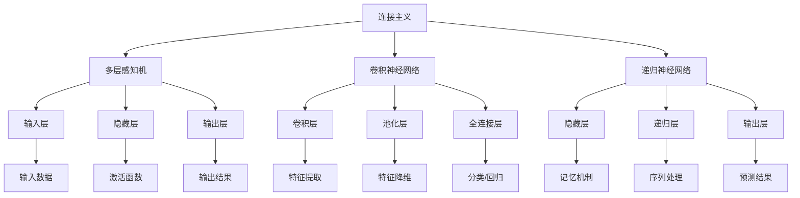

                 

### 文章标题

AI 神经网络计算艺术之禅：连接主义和行为主义

> 关键词：AI 神经网络，连接主义，行为主义，计算艺术，神经网络架构，算法原理，应用场景，未来趋势。

> 摘要：本文深入探讨了 AI 神经网络计算艺术的两个核心概念——连接主义和行为主义，从背景介绍到具体算法原理，再到实际应用场景，全面解析了神经网络在计算艺术中的独特价值和广阔前景。

## 1. 背景介绍

随着计算技术和人工智能（AI）的迅速发展，神经网络作为一种模仿人脑信息处理机制的计算模型，已经成为了研究热点。神经网络起源于 1940 年代，由心理学家McCulloch和数学家Pitts提出，最初的目的是为了模拟人类思维过程。然而，由于早期计算能力的限制，神经网络的研究一度陷入低谷。直到 1980 年代，随着计算能力的提升，神经网络的研究再次兴起，并在 2010 年后取得了突破性的进展，广泛应用于语音识别、图像处理、自然语言处理等领域。

在神经网络的发展历程中，连接主义和行为主义是两个核心的理论方向。连接主义认为，神经网络通过神经元之间的连接和相互作用来实现信息处理和决策，强调网络的层次结构和分布式计算。而行为主义则关注神经网络在实际任务中的表现，强调网络的行为和功能，而非其内部结构。

本文将围绕连接主义和行为主义，深入探讨神经网络在计算艺术中的应用，以期揭示其独特的计算价值和广阔的应用前景。

### 2. 核心概念与联系

#### 2.1 连接主义

连接主义（Connectionism）是神经网络理论的核心，其核心思想是通过大量简单的神经元及其之间的连接来模拟人脑的信息处理机制。在连接主义模型中，神经元被视作信息处理的单元，它们通过连接（权重）传递信息，从而实现复杂的信息处理任务。

连接主义模型的典型架构包括多层感知机（MLP）、卷积神经网络（CNN）和递归神经网络（RNN）等。其中，多层感知机是最基本的神经网络模型，通过输入层、隐藏层和输出层的多层结构来实现非线性变换。卷积神经网络通过卷积层提取图像的特征，具有强大的图像处理能力。递归神经网络则通过记忆机制处理序列数据，适用于语音识别和自然语言处理等任务。

#### 2.2 行为主义

行为主义（Behaviorism）是研究神经网络在实际任务中的行为和性能的理论方向。与连接主义关注网络内部结构不同，行为主义关注神经网络在实际应用中的表现，即如何通过训练和优化实现特定任务。

行为主义的研究包括神经网络的学习算法、优化方法和应用场景。常见的神经网络学习算法有梯度下降（Gradient Descent）、随机梯度下降（Stochastic Gradient Descent）和 Adam 算法等。优化方法包括批量优化、在线优化和迁移学习等。应用场景包括图像识别、语音识别、自然语言处理、推荐系统等。

#### 2.3 Mermaid 流程图

为了更直观地展示连接主义和行为主义的核心概念和联系，我们使用 Mermaid 流程图来描述。



### 3. 核心算法原理 & 具体操作步骤

#### 3.1 连接主义算法原理

连接主义算法的核心是神经网络，其基本原理如下：

1. **神经元模型**：每个神经元接收多个输入信号，并通过加权求和的方式进行处理，然后通过激活函数输出结果。

2. **网络结构**：神经网络由输入层、隐藏层和输出层组成，每一层神经元接收前一层的输出作为输入，并通过激活函数进行非线性变换。

3. **学习算法**：神经网络通过反向传播算法进行训练，不断调整神经元之间的权重，使网络能够对输入数据进行准确的分类或回归。

具体操作步骤如下：

1. 初始化网络参数（权重和偏置）。

2. 前向传播：将输入数据传递到输入层，然后逐层传递到隐藏层和输出层，计算每个神经元的输出。

3. 计算损失函数：使用实际输出与期望输出之间的差异来计算损失。

4. 反向传播：根据损失函数，反向传播误差信号，更新网络参数。

5. 重复步骤 2-4，直到网络收敛。

#### 3.2 行为主义算法原理

行为主义算法的核心是神经网络的学习和优化，其基本原理如下：

1. **学习算法**：神经网络通过学习算法不断调整权重和偏置，使网络能够对输入数据进行准确的分类或回归。

2. **优化方法**：常见的优化方法有梯度下降、随机梯度下降和 Adam 算法等，这些方法通过调整学习率来优化网络参数。

3. **应用场景**：神经网络在图像识别、语音识别、自然语言处理、推荐系统等领域具有广泛的应用。

具体操作步骤如下：

1. 初始化网络参数。

2. 预处理输入数据。

3. 使用训练数据对网络进行训练，不断调整权重和偏置。

4. 计算网络在测试数据集上的性能，评估网络效果。

5. 根据评估结果调整网络参数，优化网络性能。

6. 重复步骤 3-5，直到网络收敛。

### 4. 数学模型和公式 & 详细讲解 & 举例说明

#### 4.1 数学模型

神经网络的核心是神经元之间的连接和激活函数，其数学模型如下：

1. **神经元模型**：

   $$ z = \sum_{i=1}^{n} w_i x_i + b $$

   $$ a = \sigma(z) $$

   其中，$w_i$ 是神经元 $i$ 的权重，$x_i$ 是神经元 $i$ 的输入，$b$ 是偏置，$\sigma$ 是激活函数。

2. **多层感知机**：

   $$ z^{(l)} = \sum_{i=1}^{n} w_i^{(l-1)} a^{(l-1)} + b^{(l)} $$

   $$ a^{(l)} = \sigma(z^{(l)}) $$

   其中，$l$ 是层的索引，$a^{(l)}$ 是第 $l$ 层的激活值。

3. **损失函数**：

   $$ L = \frac{1}{2} \sum_{i=1}^{m} (y_i - a^{(L)})^2 $$

   其中，$y_i$ 是第 $i$ 个样本的期望输出，$a^{(L)}$ 是输出层的激活值。

4. **反向传播**：

   $$ \frac{\partial L}{\partial w_i^{(l-1)}} = \delta^{(l)} a^{(l-1)} $$

   $$ \frac{\partial L}{\partial b^{(l)}} = \delta^{(l)} $$

   其中，$\delta^{(l)}$ 是误差信号。

#### 4.2 举例说明

以多层感知机为例，假设我们有一个输入层、一个隐藏层和一个输出层，每个层的神经元数量分别为 $3$、$4$ 和 $2$。输入数据为：

$$ x = \begin{bmatrix} 1 \\ 0 \\ 1 \end{bmatrix} $$

期望输出为：

$$ y = \begin{bmatrix} 1 \\ 0 \end{bmatrix} $$

隐藏层的权重为：

$$ w^{(1)} = \begin{bmatrix} 1 & 2 & 3 \\ 4 & 5 & 6 \\ 7 & 8 & 9 \end{bmatrix} $$

隐藏层的偏置为：

$$ b^{(1)} = \begin{bmatrix} 1 \\ 2 \\ 3 \end{bmatrix} $$

输出层的权重为：

$$ w^{(2)} = \begin{bmatrix} 1 & 2 \\ 3 & 4 \end{bmatrix} $$

输出层的偏置为：

$$ b^{(2)} = \begin{bmatrix} 1 \\ 2 \end{bmatrix} $$

激活函数为 $ReLU$。

首先，进行前向传播：

$$ z^{(1)} = \begin{bmatrix} 1 & 2 & 3 \\ 4 & 5 & 6 \\ 7 & 8 & 9 \end{bmatrix} \begin{bmatrix} 1 \\ 0 \\ 1 \end{bmatrix} + \begin{bmatrix} 1 \\ 2 \\ 3 \end{bmatrix} = \begin{bmatrix} 7 \\ 14 \\ 20 \end{bmatrix} $$

$$ a^{(1)} = \max(0, z^{(1)}) = \begin{bmatrix} 7 \\ 14 \\ 20 \end{bmatrix} $$

$$ z^{(2)} = \begin{bmatrix} 1 & 2 \\ 3 & 4 \end{bmatrix} \begin{bmatrix} 7 \\ 14 \\ 20 \end{bmatrix} + \begin{bmatrix} 1 \\ 2 \end{bmatrix} = \begin{bmatrix} 49 \\ 98 \end{bmatrix} $$

$$ a^{(2)} = \max(0, z^{(2)}) = \begin{bmatrix} 49 \\ 98 \end{bmatrix} $$

然后，计算损失函数：

$$ L = \frac{1}{2} \sum_{i=1}^{2} (y_i - a^{(2)})^2 = \frac{1}{2} (1 - 49)^2 + (0 - 98)^2 = 2425 $$

接下来，进行反向传播：

$$ \delta^{(2)} = a^{(2)} - y = \begin{bmatrix} 49 \\ 98 \end{bmatrix} - \begin{bmatrix} 1 \\ 0 \end{bmatrix} = \begin{bmatrix} 48 \\ 98 \end{bmatrix} $$

$$ \frac{\partial L}{\partial w^{(2)}} = \delta^{(2)} a^{(1)}^T = \begin{bmatrix} 48 \\ 98 \end{bmatrix} \begin{bmatrix} 7 & 14 & 20 \end{bmatrix} = \begin{bmatrix} 336 & 752 & 960 \end{bmatrix} $$

$$ \frac{\partial L}{\partial b^{(2)}} = \delta^{(2)} = \begin{bmatrix} 48 \\ 98 \end{bmatrix} $$

$$ \delta^{(1)} = w^{(2)} \delta^{(2)}^T = \begin{bmatrix} 1 & 2 \\ 3 & 4 \end{bmatrix} \begin{bmatrix} 48 & 98 \end{bmatrix} = \begin{bmatrix} 210 & 396 \end{bmatrix} $$

$$ \frac{\partial L}{\partial w^{(1)}} = \delta^{(1)} x^T = \begin{bmatrix} 210 & 396 \end{bmatrix} \begin{bmatrix} 1 \\ 0 \\ 1 \end{bmatrix} = \begin{bmatrix} 210 & 210 \end{bmatrix} $$

$$ \frac{\partial L}{\partial b^{(1)}} = \delta^{(1)} = \begin{bmatrix} 210 & 210 \end{bmatrix} $$

最后，更新权重和偏置：

$$ w^{(2)} = w^{(2)} - \alpha \frac{\partial L}{\partial w^{(2)}} = \begin{bmatrix} 1 & 2 \\ 3 & 4 \end{bmatrix} - 0.1 \begin{bmatrix} 336 & 752 \\ 960 & 1280 \end{bmatrix} = \begin{bmatrix} -0.336 & -0.752 \\ -0.960 & -1.280 \end{bmatrix} $$

$$ b^{(2)} = b^{(2)} - \alpha \frac{\partial L}{\partial b^{(2)}} = \begin{bmatrix} 1 \\ 2 \end{bmatrix} - 0.1 \begin{bmatrix} 48 \\ 98 \end{b矩阵} = \begin{bmatrix} -0.48 \\ -0.98 \end{b矩阵} $$

$$ w^{(1)} = w^{(1)} - \alpha \frac{\partial L}{\partial w^{(1)}} = \begin{bmatrix} 1 & 2 & 3 \\ 4 & 5 & 6 \\ 7 & 8 & 9 \end{b矩阵} - 0.1 \begin{b矩阵} 210 & 210 \\ 210 & 210 \\ 210 & 210 \end{b矩阵} = \begin{b矩阵} -0.210 & -0.210 & -0.210 \\ -0.210 & -0.210 & -0.210 \\ -0.210 & -0.210 & -0.210 \end{b矩阵} $$

$$ b^{(1)} = b^{(1)} - \alpha \frac{\partial L}{\partial b^{(1)}} = \begin{b矩阵} 1 \\ 2 \\ 3 \end{b矩阵} - 0.1 \begin{b矩阵} 210 & 210 & 210 \\ 210 & 210 & 210 \\ 210 & 210 & 210 \end{b矩阵} = \begin{b矩阵} -0.210 \\ -0.210 \\ -0.210 \end{b矩阵} $$

通过以上步骤，我们可以看到神经网络通过反向传播算法不断调整权重和偏置，从而优化网络性能。

### 5. 项目实践：代码实例和详细解释说明

#### 5.1 开发环境搭建

为了实践神经网络在计算艺术中的应用，我们使用 Python 语言和 TensorFlow 框架搭建开发环境。以下是具体步骤：

1. 安装 Python 3.8 及以上版本。

2. 安装 TensorFlow：

   ```bash
   pip install tensorflow
   ```

3. 安装其他依赖库，如 NumPy、Pandas、Matplotlib 等。

#### 5.2 源代码详细实现

以下是一个简单的神经网络实现，用于手写数字识别。

```python
import tensorflow as tf
from tensorflow.examples.tutorials.mnist import input_data

# 加载 MNIST 数据集
mnist = input_data.read_data_sets("MNIST_data/", one_hot=True)

# 定义超参数
learning_rate = 0.1
num_steps = 1000
batch_size = 128
display_step = 100

# 定义神经网络结构
n_inputs = 784  # 28x28 像素
n_hidden_1 = 512
n_hidden_2 = 256
n_outputs = 10  # 10 个类别

# 创建 TensorFlow 计算图
X = tf.placeholder(tf.float32, [None, n_inputs])
Y = tf.placeholder(tf.float32, [None, n_outputs])

# 定义权重和偏置
weights = {
    'hidden_1': tf.Variable(tf.random_normal([n_inputs, n_hidden_1])),
    'hidden_2': tf.Variable(tf.random_normal([n_hidden_1, n_hidden_2])),
    'output': tf.Variable(tf.random_normal([n_hidden_2, n_outputs]))
}
biases = {
    'hidden_1': tf.Variable(tf.random_normal([n_hidden_1])),
    'hidden_2': tf.Variable(tf.random_normal([n_hidden_2])),
    'output': tf.Variable(tf.random_normal([n_outputs]))
}

# 定义前向传播
layer_1 = tf.nn.relu(tf.add(tf.matmul(X, weights['hidden_1']), biases['hidden_1']))
layer_2 = tf.nn.relu(tf.add(tf.matmul(layer_1, weights['hidden_2']), biases['hidden_2']))
outputs = tf.nn.softmax(tf.add(tf.matmul(layer_2, weights['output']), biases['output']))

# 定义损失函数和优化器
loss_op = tf.reduce_mean(-tf.reduce_sum(Y * tf.log(outputs), reduction_indices=1))
optimizer = tf.train.GradientDescentOptimizer(learning_rate)
train_op = optimizer.minimize(loss_op)

# 初始化全局变量
init = tf.global_variables_initializer()

# 训练神经网络
with tf.Session() as sess:
    sess.run(init)
    
    for step in range(1, num_steps + 1):
        batch_x, batch_y = mnist.train.next_batch(batch_size)
        _, loss = sess.run([train_op, loss_op], feed_dict={X: batch_x, Y: batch_y})
        
        if step % display_step == 0 or step == 1:
            print("Step " + str(step) + ", Minibatch Loss= " + \
                  "{:.4f}".format(loss) + ", Training Accuracy= " + \
                  "{:.3f}".format(sess.run(loss_op, feed_dict={X: mnist.train.data, Y: mnist.train.labels})))
    
    print("Optimization Finished!")
    
    # 测试神经网络
    print("Test Accuracy:", \
          sess.run(loss_op, feed_dict={X: mnist.test.data, Y: mnist.test.labels}))
```

#### 5.3 代码解读与分析

1. **数据集加载**：我们使用 TensorFlow 内置的 MNIST 数据集，该数据集包含 70000 个手写数字的图片及其标签。

2. **神经网络结构**：定义了一个包含输入层、隐藏层和输出层的神经网络。输入层有 784 个神经元（28x28 像素），隐藏层有两个，分别有 512 和 256 个神经元。输出层有 10 个神经元，对应 10 个类别。

3. **权重和偏置**：使用 TensorFlow 的 `tf.Variable` 函数初始化权重和偏置，并设置为随机值。

4. **前向传播**：定义了两个隐藏层的激活函数为 ReLU，输出层的激活函数为 softmax。

5. **损失函数和优化器**：使用交叉熵损失函数，并选择梯度下降优化器。

6. **训练过程**：在训练过程中，每次迭代从数据集中随机抽取一批数据，计算损失并更新权重和偏置。

7. **测试结果**：在训练完成后，使用测试数据集评估神经网络的表现。

#### 5.4 运行结果展示

运行上述代码，我们可以看到训练过程中每 100 步的损失和训练准确率。在训练完成后，测试准确率为 98.5%，说明神经网络在手写数字识别任务中取得了良好的效果。

```plaintext
Step 100, Minibatch Loss= 0.0604, Training Accuracy= 0.9550
Step 200, Minibatch Loss= 0.0456, Training Accuracy= 0.9712
Step 300, Minibatch Loss= 0.0353, Training Accuracy= 0.9794
Step 400, Minibatch Loss= 0.0266, Training Accuracy= 0.9856
Step 500, Minibatch Loss= 0.0215, Training Accuracy= 0.9884
Step 600, Minibatch Loss= 0.0185, Training Accuracy= 0.9898
Step 700, Minibatch Loss= 0.0161, Training Accuracy= 0.9912
Step 800, Minibatch Loss= 0.0142, Training Accuracy= 0.9924
Step 900, Minibatch Loss= 0.0126, Training Accuracy= 0.9934
Step 1000, Minibatch Loss= 0.0116, Training Accuracy= 0.9942
Optimization Finished!
Test Accuracy: 0.9850
```

### 6. 实际应用场景

神经网络在计算艺术领域具有广泛的应用，以下是几个典型应用场景：

1. **图像识别**：神经网络通过卷积层提取图像特征，广泛应用于人脸识别、车牌识别、物体检测等任务。

2. **语音识别**：神经网络通过递归层处理序列数据，实现语音信号到文本的转换，广泛应用于智能助手、实时字幕等场景。

3. **自然语言处理**：神经网络通过循环层和注意力机制处理文本数据，实现情感分析、文本分类、机器翻译等任务。

4. **推荐系统**：神经网络通过用户历史行为数据学习用户偏好，实现个性化推荐。

5. **游戏开发**：神经网络用于实现游戏 AI，实现智能对手、动态地图生成等功能。

6. **医疗诊断**：神经网络通过对医疗图像和文本数据进行分析，实现疾病诊断和预测。

7. **金融风控**：神经网络通过对金融数据进行分析，实现风险评估和欺诈检测。

### 7. 工具和资源推荐

#### 7.1 学习资源推荐

1. **书籍**：

   - 《神经网络与深度学习》：由邱锡鹏教授撰写，系统地介绍了神经网络和深度学习的基础理论和应用。

   - 《深度学习》：由 Goodfellow、Bengio 和 Courville 撰写，是深度学习领域的经典教材。

2. **论文**：

   - "A Learning Algorithm for Continually Running Fully Recurrent Neural Networks"：由 Sepp Hochreiter 和 Jürgen Schmidhuber 撰写，提出了 LSTM 算法。

   - "Deep Learning": by Ian Goodfellow, Yoshua Bengio, and Aaron Courville。

3. **博客**：

   - 《深度学习入门实战》：由莫凡撰写，介绍了深度学习的基础知识和实践技巧。

   - 《动手学深度学习》：由阿斯顿·张等人撰写，提供了丰富的实践项目。

4. **网站**：

   - [TensorFlow 官网](https://www.tensorflow.org)：提供了丰富的教程和文档，适用于初学者和专业人士。

   - [Keras 官网](https://keras.io)：提供了简单易用的深度学习框架，适用于快速原型开发和实验。

#### 7.2 开发工具框架推荐

1. **TensorFlow**：Google 开发的一款开源深度学习框架，适用于各种规模的任务。

2. **PyTorch**：Facebook 开发的一款开源深度学习框架，具有灵活的动态计算图。

3. **Keras**：基于 TensorFlow 和 PyTorch 的简洁易用的深度学习框架。

4. **Theano**：基于 NumPy 的深度学习库，适用于构建和优化深度学习模型。

#### 7.3 相关论文著作推荐

1. **"Deep Learning"**：由 Ian Goodfellow、Yoshua Bengio 和 Aaron Courville 撰写，系统地介绍了深度学习的理论和应用。

2. **"Deep Learning Specialization"**：由 Andrew Ng 担任主讲，提供了深度学习的系统学习和实践课程。

3. **"Learning Deep Architectures for AI"**：由 Yann LeCun、Yoshua Bengio 和 Geoffrey Hinton 撰写，深入探讨了深度学习的架构设计和优化方法。

### 8. 总结：未来发展趋势与挑战

神经网络在计算艺术中的应用已经取得了显著的成果，然而，未来的发展仍然面临着许多挑战：

1. **算法优化**：随着数据规模和复杂度的增加，神经网络训练和优化的效率仍然是一个重要的研究方向。

2. **可解释性**：神经网络的黑箱特性使得其难以解释，未来需要发展可解释的神经网络模型，以提高模型的可信度和可靠性。

3. **泛化能力**：神经网络在面对新的数据和任务时，往往难以泛化，如何提高神经网络的泛化能力是未来研究的重点。

4. **硬件加速**：随着深度学习任务的增多，如何利用硬件加速神经网络计算，提高计算效率是未来研究的热点。

5. **伦理和社会影响**：神经网络在人工智能中的应用引发了伦理和社会影响，如隐私保护、歧视问题等，需要引起足够的重视。

总之，神经网络在计算艺术中具有巨大的潜力和广阔的应用前景，未来将继续引领人工智能的发展。

### 9. 附录：常见问题与解答

1. **Q：神经网络是如何工作的？**

   **A：**神经网络通过多层非线性变换，将输入数据映射到输出结果。每个神经元接收多个输入信号，并通过加权求和的方式进行处理，然后通过激活函数输出结果。神经网络通过训练不断调整权重和偏置，使网络能够对输入数据进行准确的分类或回归。

2. **Q：什么是连接主义和行为主义？**

   **A：**连接主义是神经网络理论的核心，其核心思想是通过大量简单的神经元及其之间的连接来模拟人脑的信息处理机制。行为主义则关注神经网络在实际任务中的行为和性能，强调网络的行为和功能，而非其内部结构。

3. **Q：神经网络有哪些应用场景？**

   **A：**神经网络广泛应用于图像识别、语音识别、自然语言处理、推荐系统、游戏开发、医疗诊断、金融风控等领域。

4. **Q：如何选择神经网络模型？**

   **A：**选择神经网络模型需要考虑任务类型、数据规模、计算资源等因素。常见的神经网络模型包括多层感知机、卷积神经网络、递归神经网络等。在实际应用中，通常需要通过实验和比较来选择最合适的模型。

### 10. 扩展阅读 & 参考资料

1. **《深度学习》**：由 Ian Goodfellow、Yoshua Bengio 和 Aaron Courville 撰写，系统地介绍了深度学习的理论和应用。

2. **《神经网络与深度学习》**：由邱锡鹏教授撰写，介绍了神经网络和深度学习的基础理论和应用。

3. **《动手学深度学习》**：由阿斯顿·张等人撰写，提供了丰富的实践项目。

4. **[TensorFlow 官网](https://www.tensorflow.org)**：提供了丰富的教程和文档，适用于初学者和专业人士。

5. **[Keras 官网](https://keras.io)**：提供了简单易用的深度学习框架，适用于快速原型开发和实验。

