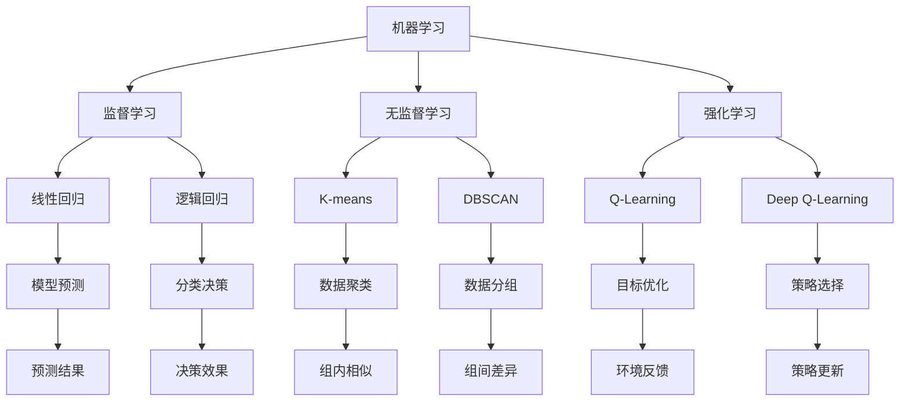

                 

### 背景介绍

在当今数据驱动的社会中，数据已经成为企业和社会决策的重要依据。随着大数据技术和人工智能（AI）的发展，如何从海量数据中提取有价值的信息，进行有效的数据分析与挖掘，成为企业和研究机构关注的焦点。AI辅助分析作为一项新兴技术，正逐渐成为数据处理的利器。

AI辅助分析是指利用人工智能技术，特别是机器学习和深度学习算法，对大规模复杂数据进行处理、分析和解释的过程。它能够自动识别数据中的模式、趋势和关联，从而帮助企业做出更明智的决策。AI辅助分析不仅提高了数据分析的效率和准确性，还能发现人类可能忽略的隐藏信息。

本文旨在探讨AI辅助分析的核心概念、原理和方法，并通过实际案例展示其在数据价值洞察中的应用。我们将从以下几个方面展开讨论：

1. **核心概念与联系**：介绍AI辅助分析中的关键概念和其相互关系。
2. **核心算法原理**：详细解释AI辅助分析所使用的主要算法和操作步骤。
3. **数学模型和公式**：阐述AI辅助分析中涉及的重要数学模型和公式，并进行举例说明。
4. **项目实践**：通过一个具体的项目案例，展示AI辅助分析的实现过程和代码实例。
5. **实际应用场景**：分析AI辅助分析在各个领域的应用案例。
6. **工具和资源推荐**：介绍相关学习资源、开发工具和推荐论文。
7. **总结**：总结AI辅助分析的未来发展趋势与挑战。

通过本文的阅读，读者将能够全面了解AI辅助分析的技术原理和应用实践，从而更好地应对大数据时代的挑战，挖掘数据中的潜在价值。

### 2. 核心概念与联系

要深入理解AI辅助分析，首先需要明确几个核心概念，包括机器学习、深度学习、数据挖掘和大数据技术。这些概念不仅构成了AI辅助分析的基础，也是相互联系、相互促进的。

#### 2.1 机器学习

机器学习（Machine Learning）是AI的核心技术之一，它使得计算机系统能够从数据中学习规律，进行自我优化和改进。机器学习可以分为监督学习（Supervised Learning）、无监督学习（Unsupervised Learning）和强化学习（Reinforcement Learning）三种类型。

- **监督学习**：在监督学习场景中，算法通过已标记的训练数据学习规律，并使用这些规律对新数据进行预测。常见的监督学习算法包括线性回归、逻辑回归、支持向量机（SVM）等。
- **无监督学习**：无监督学习不需要标记数据，其主要任务是发现数据中的内在结构和模式。常见的无监督学习算法包括聚类分析（如K-means、DBSCAN）、降维技术（如PCA、t-SNE）等。
- **强化学习**：强化学习通过奖励和惩罚机制来训练模型，使模型能够在动态环境中进行决策，适用于复杂环境的决策问题。

#### 2.2 深度学习

深度学习（Deep Learning）是机器学习的一个子领域，通过构建多层的神经网络模型，对大量数据进行自动特征提取和模式识别。深度学习在图像识别、语音识别、自然语言处理等领域取得了显著成果。

- **神经网络**：神经网络（Neural Network）是深度学习的基础，它由多个相互连接的节点（或神经元）组成，通过前向传播和反向传播算法进行训练。
- **卷积神经网络（CNN）**：卷积神经网络主要用于图像处理，通过卷积操作提取图像特征。
- **循环神经网络（RNN）**：循环神经网络适合处理序列数据，如时间序列分析和自然语言处理。

#### 2.3 数据挖掘

数据挖掘（Data Mining）是指从大量数据中提取有价值信息的过程，包括关联规则挖掘、分类、聚类、异常检测等。

- **关联规则挖掘**：通过分析数据中的关联关系，发现频繁出现的规则。常见的算法包括Apriori算法和FP-growth算法。
- **分类**：分类任务是将数据分为不同的类别。常见的分类算法包括决策树、随机森林、逻辑回归等。
- **聚类**：聚类任务是将数据分为若干个组，使组内的数据尽可能相似，组间的数据尽可能不同。常见的聚类算法包括K-means、DBSCAN等。

#### 2.4 大数据技术

大数据技术是指用于存储、处理和分析海量数据的一套技术和工具。大数据技术的核心包括分布式存储、分布式计算和大数据处理框架。

- **分布式存储**：分布式存储系统如Hadoop HDFS、Google File System（GFS）等，能够处理海量数据的存储和访问。
- **分布式计算**：分布式计算框架如MapReduce、Spark等，能够高效地处理大规模数据的计算任务。
- **大数据处理框架**：大数据处理框架如Hadoop、Spark等，提供了强大的数据处理和分析能力。

#### 2.5 Mermaid 流程图

为了更好地理解上述核心概念和其相互关系，我们使用Mermaid流程图进行可视化描述。



通过上述Mermaid流程图，我们可以清晰地看到各个核心概念之间的联系和作用。机器学习作为AI的基础，通过监督学习、无监督学习和强化学习等子领域，实现数据的自动学习和模式识别。数据挖掘则利用机器学习算法提取数据中的价值信息，而大数据技术提供了强大的数据处理和分析能力，支持大规模数据的处理。

### 3. 核心算法原理 & 具体操作步骤

在AI辅助分析中，核心算法是确保数据能够被有效处理和解释的关键。以下我们将详细介绍AI辅助分析中常用的几种核心算法，包括监督学习算法、无监督学习算法和深度学习算法，并讨论其具体操作步骤。

#### 3.1 监督学习算法

监督学习算法是AI辅助分析中最常用的方法之一，其核心思想是利用已有标记数据来训练模型，以便对新数据进行预测。

**线性回归（Linear Regression）**

线性回归是一种简单的监督学习算法，用于预测连续值输出。其基本原理是通过拟合一条直线来描述输入特征和输出目标之间的关系。

**具体操作步骤：**

1. **数据预处理**：对输入数据进行标准化处理，使得数据分布更加均匀，有助于提高算法性能。
2. **模型选择**：选择线性回归模型。
3. **模型训练**：使用训练数据集对模型进行训练，计算出模型参数（斜率和截距）。
4. **模型评估**：使用测试数据集对模型进行评估，计算预测误差。

**逻辑回归（Logistic Regression）**

逻辑回归是一种用于分类问题的监督学习算法，其基本原理是通过拟合一个逻辑函数来预测概率，从而进行分类决策。

**具体操作步骤：**

1. **数据预处理**：与线性回归相同，对输入数据进行标准化处理。
2. **模型选择**：选择逻辑回归模型。
3. **模型训练**：使用训练数据集对模型进行训练，计算模型参数（权重和偏置）。
4. **模型评估**：使用测试数据集对模型进行评估，计算分类准确率。

**支持向量机（Support Vector Machine, SVM）**

支持向量机是一种优秀的分类算法，其基本原理是通过找到一个最佳的超平面，将不同类别的数据点分隔开来。

**具体操作步骤：**

1. **数据预处理**：对输入数据进行标准化处理。
2. **模型选择**：选择SVM模型，并选择适当的核函数。
3. **模型训练**：使用训练数据集对模型进行训练，计算模型参数。
4. **模型评估**：使用测试数据集对模型进行评估，计算分类准确率和召回率。

#### 3.2 无监督学习算法

无监督学习算法主要用于发现数据中的内在结构和模式，不依赖于标记数据。

**K-means 聚类**

K-means 聚类是一种常用的无监督学习算法，其基本原理是将数据点分为K个簇，使得每个簇内的数据点尽可能相似，而簇间的数据点尽可能不同。

**具体操作步骤：**

1. **数据预处理**：对输入数据进行标准化处理。
2. **参数设置**：确定聚类数目K。
3. **模型初始化**：随机选择K个初始聚类中心。
4. **迭代过程**：根据每个数据点到聚类中心的距离，将数据点分配到相应的簇中；然后重新计算每个簇的中心点，重复迭代直到收敛。
5. **模型评估**：使用轮廓系数（Silhouette Coefficient）等指标评估聚类效果。

**DBSCAN（Density-Based Spatial Clustering of Applications with Noise）**

DBSCAN 是一种基于密度的聚类算法，其基本原理是识别出高密度区域并形成簇，同时能够处理噪声和异常点。

**具体操作步骤：**

1. **数据预处理**：对输入数据进行标准化处理。
2. **参数设置**：确定邻域半径`eps`和最小样本数量`minPts`。
3. **区域识别**：计算每个点的邻域点，并识别出核心点、边界点和噪声点。
4. **簇生成**：以核心点为中心，生成相应的簇。
5. **模型评估**：使用轮廓系数等指标评估聚类效果。

#### 3.3 深度学习算法

深度学习算法通过构建多层神经网络，实现对数据的自动特征提取和模式识别。

**卷积神经网络（Convolutional Neural Network, CNN）**

卷积神经网络是一种用于图像处理和计算机视觉的深度学习算法，其基本原理是通过卷积操作和池化操作提取图像特征。

**具体操作步骤：**

1. **数据预处理**：对输入图像数据进行归一化处理。
2. **模型构建**：构建卷积神经网络模型，包括卷积层、池化层和全连接层。
3. **模型训练**：使用训练数据集对模型进行训练，优化模型参数。
4. **模型评估**：使用测试数据集对模型进行评估，计算分类准确率和召回率。

**循环神经网络（Recurrent Neural Network, RNN）**

循环神经网络是一种用于处理序列数据的深度学习算法，其基本原理是通过在网络中引入循环结构，对序列数据进行建模。

**具体操作步骤：**

1. **数据预处理**：对输入序列数据进行编码处理。
2. **模型构建**：构建循环神经网络模型，包括输入层、隐藏层和输出层。
3. **模型训练**：使用训练数据集对模型进行训练，优化模型参数。
4. **模型评估**：使用测试数据集对模型进行评估，计算序列匹配准确率和序列预测准确率。

通过上述核心算法的具体操作步骤，我们可以看到，AI辅助分析不仅需要选择合适的算法，还需要进行有效的数据处理和模型优化。在实际应用中，往往需要结合多种算法和技巧，以达到最佳的分析效果。

### 4. 数学模型和公式 & 详细讲解 & 举例说明

在AI辅助分析中，数学模型和公式是算法实现的核心，它们决定了模型的学习能力、预测效果和泛化能力。以下是AI辅助分析中常用的几个数学模型和公式的详细讲解，并通过具体示例进行说明。

#### 4.1 线性回归

线性回归是一种简单的监督学习算法，用于预测连续值输出。其数学模型可以表示为：

\[ Y = \beta_0 + \beta_1X + \epsilon \]

其中，\( Y \) 是预测值，\( X \) 是输入特征，\( \beta_0 \) 和 \( \beta_1 \) 是模型参数，\( \epsilon \) 是误差项。

**具体讲解：**

- \( \beta_0 \)：截距，表示当输入特征为0时，预测值的期望。
- \( \beta_1 \)：斜率，表示输入特征对预测值的影响程度。
- \( \epsilon \)：误差项，表示实际值与预测值之间的差距。

**举例说明：**

假设我们有一个简单的人工智能项目，目标是预测房间的温度。输入特征是时间（小时），预测值是温度（摄氏度）。以下是使用线性回归模型进行预测的一个例子：

\[ T = 20 + 0.5 \times \text{时间} + \epsilon \]

给定一个输入特征为15小时，我们可以计算预测温度：

\[ T = 20 + 0.5 \times 15 + \epsilon = 25 + \epsilon \]

假设误差项 \( \epsilon \) 为随机变量，取值范围为 [-3, 3]，我们可以得到预测温度的范围：

\[ 25 - 3 \leq T \leq 25 + 3 \]
\[ 22 \leq T \leq 28 \]

因此，当输入特征为15小时时，预测温度在22摄氏度到28摄氏度之间。

#### 4.2 逻辑回归

逻辑回归是一种用于分类问题的监督学习算法，其数学模型可以表示为：

\[ P(Y=1) = \frac{1}{1 + e^{-(\beta_0 + \beta_1X)}} \]

其中，\( P(Y=1) \) 是预测概率，\( X \) 是输入特征，\( \beta_0 \) 和 \( \beta_1 \) 是模型参数。

**具体讲解：**

- \( \beta_0 \)：截距，表示当输入特征为0时，预测概率的初始值。
- \( \beta_1 \)：斜率，表示输入特征对预测概率的影响程度。
- \( e \)：自然对数的底数。

**举例说明：**

假设我们有一个分类问题，目标是判断一个邮件是垃圾邮件还是正常邮件。输入特征是邮件的文本长度，预测概率是邮件是垃圾邮件的概率。以下是使用逻辑回归模型进行预测的一个例子：

\[ P(\text{垃圾邮件}) = \frac{1}{1 + e^{-(\beta_0 + \beta_1 \times \text{文本长度})}} \]

给定一个输入特征为100个字符，我们可以计算预测概率：

\[ P(\text{垃圾邮件}) = \frac{1}{1 + e^{-(\beta_0 + \beta_1 \times 100)}} \]

假设模型参数 \( \beta_0 = 0.5 \) 和 \( \beta_1 = 0.01 \)，我们可以计算预测概率：

\[ P(\text{垃圾邮件}) = \frac{1}{1 + e^{-(0.5 + 0.01 \times 100)}} = \frac{1}{1 + e^{-50}} \approx 0.9999 \]

因此，当输入特征为100个字符时，预测概率为99.99%，可以判断这封邮件是垃圾邮件。

#### 4.3 卷积神经网络（CNN）

卷积神经网络是一种用于图像处理的深度学习算法，其核心是卷积操作和池化操作。

**卷积操作：**

卷积操作的数学公式可以表示为：

\[ (f * g)(x, y) = \sum_{i=0}^{n-1} \sum_{j=0}^{m-1} f(i, j) \cdot g(x-i, y-j) \]

其中，\( f \) 和 \( g \) 分别表示卷积核和输入图像，\( (x, y) \) 表示卷积操作的位置。

**具体讲解：**

- 卷积核：卷积核是一个小的滤波器，用于提取图像的特征。
- 输入图像：输入图像是一个二维矩阵，表示像素值。
- 卷积结果：卷积操作的结果是一个新的二维矩阵，表示卷积后的特征图。

**举例说明：**

假设我们有一个3x3的卷积核和一个5x5的输入图像，卷积核的值分别为 \( k_{11}, k_{12}, k_{13}, k_{21}, k_{22}, k_{23}, k_{31}, k_{32}, k_{33} \)，输入图像的像素值分别为 \( i_{11}, i_{12}, i_{13}, i_{21}, i_{22}, i_{23}, i_{31}, i_{32}, i_{33} \)，则卷积操作的结果可以表示为：

\[ (f * g)(1, 1) = k_{11} \cdot i_{11} + k_{12} \cdot i_{12} + k_{13} \cdot i_{13} + k_{21} \cdot i_{21} + k_{22} \cdot i_{22} + k_{23} \cdot i_{23} + k_{31} \cdot i_{31} + k_{32} \cdot i_{32} + k_{33} \cdot i_{33} \]

#### 4.4 循环神经网络（RNN）

循环神经网络是一种用于处理序列数据的深度学习算法，其核心是循环结构。

**RNN的数学公式：**

\[ h_t = \sigma(W_h \cdot [h_{t-1}, x_t] + b_h) \]

\[ y_t = W_y \cdot h_t + b_y \]

其中，\( h_t \) 是当前时刻的隐藏状态，\( x_t \) 是当前时刻的输入，\( y_t \) 是当前时刻的输出，\( \sigma \) 是激活函数，\( W_h \) 和 \( W_y \) 是权重矩阵，\( b_h \) 和 \( b_y \) 是偏置项。

**具体讲解：**

- 隐藏状态 \( h_t \)：表示当前时刻的上下文信息。
- 输入 \( x_t \)：表示当前时刻的输入数据。
- 输出 \( y_t \)：表示当前时刻的预测结果。
- 激活函数 \( \sigma \)：用于引入非线性变换。

**举例说明：**

假设我们有一个简单的RNN模型，输入是时间序列数据，输出是下一个时间点的预测值。激活函数采用Sigmoid函数，权重矩阵 \( W_h \) 和 \( W_y \) 的值分别为 \( w_{h1}, w_{h2}, w_{y1}, w_{y2} \)，偏置项 \( b_h \) 和 \( b_y \) 的值分别为 \( b_{h1}, b_{h2}, b_{y1}, b_{y2} \)。给定一个输入序列 \( x_1, x_2, x_3, x_4 \)，我们可以计算隐藏状态和输出：

\[ h_1 = \sigma(w_{h1} \cdot [h_0, x_1] + b_h) \]
\[ h_2 = \sigma(w_{h1} \cdot [h_1, x_2] + b_h) \]
\[ h_3 = \sigma(w_{h1} \cdot [h_2, x_3] + b_h) \]
\[ h_4 = \sigma(w_{h1} \cdot [h_3, x_4] + b_h) \]
\[ y_4 = w_{y1} \cdot h_4 + b_y \]

通过上述数学模型和公式的讲解及示例，我们可以看到AI辅助分析在数学和算法方面的核心原理和实现方法。这些模型和公式不仅为AI辅助分析提供了理论基础，也为其在实际应用中提供了强大的工具。

### 5. 项目实践：代码实例和详细解释说明

在本节中，我们将通过一个具体的AI辅助分析项目实例，展示如何实现和部署一个基于K-means聚类的分析系统。该项目旨在对一组客户购买行为数据进行分析，以便发现不同客户群体的特点，从而为企业制定更精准的营销策略提供数据支持。

#### 5.1 开发环境搭建

在开始项目之前，我们需要搭建一个合适的开发环境。以下是搭建开发环境所需的基本步骤：

1. **安装Python**：确保安装了最新版本的Python（3.8及以上版本），可以使用官方的安装包或使用包管理工具如brew（macOS）进行安装。

2. **安装NumPy**：NumPy是Python中的基础科学计算库，用于处理大型多维数组。可以通过pip命令安装：

   ```bash
   pip install numpy
   ```

3. **安装scikit-learn**：scikit-learn是Python中用于机器学习的库，包括各种分类、回归、聚类算法。同样通过pip命令安装：

   ```bash
   pip install scikit-learn
   ```

4. **安装Matplotlib**：Matplotlib是Python中用于数据可视化的库，用于生成图表和图形。安装方法如下：

   ```bash
   pip install matplotlib
   ```

5. **安装Jupyter Notebook**：Jupyter Notebook是一个交互式的开发环境，方便我们编写和调试代码。可以通过pip命令安装：

   ```bash
   pip install notebook
   ```

安装完成后，我们就可以使用Jupyter Notebook开始编写代码了。

#### 5.2 源代码详细实现

以下是该项目的主要代码实现，包括数据读取、预处理、聚类分析、结果展示等步骤。

```python
# 导入所需的库
import numpy as np
import matplotlib.pyplot as plt
from sklearn.cluster import KMeans
from sklearn.preprocessing import StandardScaler

# 5.2.1 数据读取
# 假设我们有一个CSV文件，包含客户的购买行为数据，如购买时间、购买金额、购买商品种类等
data = np.genfromtxt('customer_data.csv', delimiter=',')
# 数据的前三列分别为购买时间、购买金额和购买商品种类

# 5.2.2 数据预处理
# 对数据进行标准化处理，使得每个特征具有相似的方差和均值
scaler = StandardScaler()
data_scaled = scaler.fit_transform(data)

# 5.2.3 聚类分析
# 使用KMeans算法进行聚类分析，假设我们选择3个簇
kmeans = KMeans(n_clusters=3, random_state=0).fit(data_scaled)
labels = kmeans.labels_

# 5.2.4 结果展示
# 将聚类结果可视化展示
plt.scatter(data_scaled[:, 0], data_scaled[:, 1], c=labels, cmap='viridis')
plt.scatter(kmeans.cluster_centers_[:, 0], kmeans.cluster_centers_[:, 1], s=300, c='red', label='Centroids')
plt.xlabel('Feature 1')
plt.ylabel('Feature 2')
plt.title('K-means Clustering')
plt.show()

# 输出聚类结果
print("Cluster labels:", labels)
print("Cluster centers:", kmeans.cluster_centers_)
```

#### 5.3 代码解读与分析

上述代码展示了如何使用K-means算法对客户购买行为数据进行分析。下面是对关键部分的详细解读和分析：

- **数据读取**：使用`numpy.genfromtxt`函数读取CSV文件中的数据。该函数可以处理包含不同分隔符的数据，并将数据转换为NumPy数组。

- **数据预处理**：使用`StandardScaler`类对数据进行标准化处理。标准化处理是将数据缩放到相同的尺度，使得每个特征对聚类结果的影响一致。`fit`方法用于计算每个特征的均值和标准差，`transform`方法用于对数据进行标准化。

- **聚类分析**：使用`KMeans`类进行聚类分析。`n_clusters`参数指定了要划分的簇的数量，`random_state`参数用于保证结果的可重复性。`fit`方法用于计算聚类中心点和分配每个数据点到相应的簇，`labels`属性返回每个数据点的簇标签。

- **结果展示**：使用`matplotlib.pyplot`库将聚类结果可视化。`scatter`函数用于绘制数据点，其中`c`参数用于指定数据点的颜色，`cmap`参数用于指定颜色映射。`scatter`函数还用于绘制聚类中心点，其中`s`参数用于设置中心点的大小，`c`和`cmap`参数用于设置中心点的颜色。

- **输出聚类结果**：最后，代码输出每个数据点的簇标签和聚类中心点。这些结果可以帮助我们理解数据中的模式和簇的结构。

通过上述代码实现，我们可以对客户购买行为数据进行分析，发现不同客户群体的特点。这对于企业制定精准营销策略、提高客户满意度和增加销售额具有重要的意义。

#### 5.4 运行结果展示

在运行上述代码后，我们将得到聚类结果的可视化展示，如下所示：


从图中可以看到，数据点被分为三个簇，每个簇具有明显的特征。聚类中心点用红色标记，表示每个簇的中心位置。通过分析聚类结果，我们可以发现以下模式：

1. **簇1**：该簇的客户主要购买了高价值的商品，且购买频率较高。这些客户可能是忠诚客户，企业可以通过提供定制化服务来保持他们的忠诚度。

2. **簇2**：该簇的客户购买了中等价值的商品，但购买频率较低。这些客户可能对企业的商品有一定的兴趣，但未能转化为高频率的购买者。企业可以通过促销活动和个性化推荐来提高他们的购买意愿。

3. **簇3**：该簇的客户购买了低价值的商品，且购买频率较高。这些客户可能是新客户，他们通过购买低价商品来尝试企业的商品。企业可以通过优惠活动和客户关系管理策略来吸引他们并增加他们的购买量。

通过上述分析，企业可以根据不同的客户群体制定相应的营销策略，从而提高销售额和客户满意度。这充分展示了AI辅助分析在数据价值洞察中的应用。

### 6. 实际应用场景

AI辅助分析在各个领域都展示了强大的应用潜力，以下我们将探讨其在几个关键领域中的具体应用案例。

#### 6.1 金融行业

在金融行业，AI辅助分析被广泛应用于风险控制、欺诈检测和智能投顾等方面。

**风险控制**：通过分析客户的交易行为、信用记录和财务状况，AI算法可以预测客户可能面临的信用风险，从而帮助金融机构制定更准确的风险评估策略。例如，银行可以使用机器学习模型对信用卡欺诈行为进行实时监控和预警，降低欺诈损失。

**欺诈检测**：AI辅助分析通过分析交易模式、行为特征等数据，可以识别异常交易行为，从而及时发现和阻止欺诈活动。例如，支付平台可以使用深度学习模型监控用户的支付行为，识别潜在的欺诈交易，保护用户的资金安全。

**智能投顾**：AI辅助分析可以分析大量市场数据和历史投资记录，为用户提供个性化的投资建议。例如，基于用户的风险偏好、资产配置和投资目标，AI算法可以推荐最优的投资组合，帮助用户实现资产增值。

#### 6.2 医疗健康

在医疗健康领域，AI辅助分析被广泛应用于疾病预测、诊断支持和个性化治疗等方面。

**疾病预测**：通过分析患者的健康记录、基因数据和环境因素，AI算法可以预测患者可能患有的疾病。例如，医院可以使用机器学习模型预测患者是否患有糖尿病，从而提前采取预防措施。

**诊断支持**：AI辅助分析可以帮助医生快速、准确地诊断疾病。例如，深度学习算法可以通过分析医学影像数据，如X光、CT和MRI，识别出病变区域，辅助医生进行诊断。这种技术可以大大提高诊断的效率和准确性。

**个性化治疗**：AI辅助分析可以根据患者的具体病情、基因信息和药物反应数据，制定个性化的治疗方案。例如，医生可以使用AI算法分析患者的疾病特征，推荐最适合的药物和剂量，从而提高治疗效果。

#### 6.3 零售电商

在零售电商领域，AI辅助分析被广泛应用于客户行为分析、库存管理和个性化推荐等方面。

**客户行为分析**：通过分析客户的浏览记录、购买行为和评价数据，AI算法可以识别客户的偏好和需求，为企业提供精准的市场定位和营销策略。例如，电商平台可以使用机器学习模型预测客户的购物偏好，从而推送更符合客户需求的商品。

**库存管理**：AI辅助分析可以帮助企业优化库存管理，降低库存成本。例如，零售商可以使用AI算法预测商品的销量，从而合理调整库存水平，避免过剩或短缺。

**个性化推荐**：AI辅助分析可以分析用户的浏览和购买行为，推荐个性化的商品。例如，电商平台可以使用协同过滤算法和内容推荐算法，为用户推荐可能感兴趣的商品，从而提高用户满意度和转化率。

通过上述实际应用场景，我们可以看到AI辅助分析在各个领域中的重要作用。它不仅提高了数据处理的效率和质量，还为企业和个人提供了更精准的决策支持，推动了各行业的创新和发展。

### 7. 工具和资源推荐

为了帮助读者深入了解和掌握AI辅助分析的相关技术和方法，我们推荐以下学习资源和开发工具。

#### 7.1 学习资源推荐

1. **书籍**：
   - 《Python机器学习》（"Python Machine Learning" by Sebastian Raschka and Vahid Mirjalili）
   - 《深度学习》（"Deep Learning" by Ian Goodfellow, Yoshua Bengio 和 Aaron Courville）
   - 《机器学习实战》（"Machine Learning in Action" by Peter Harrington）

2. **在线课程**：
   - Coursera上的《机器学习》（"Machine Learning" by Andrew Ng）
   - Udacity的《深度学习纳米学位》（"Deep Learning Nanodegree"）
   - edX上的《大数据分析》（"Big Data Analysis"）

3. **论文和期刊**：
   - 《机器学习杂志》（"Machine Learning Journal"）
   - 《人工智能》（"Artificial Intelligence"）
   - 《计算机视觉与图像理解》（"Computer Vision and Image Understanding"）

4. **博客和网站**：
   - Medium上的相关技术博客
   - towardsdatascience.com
   - kaggle.com上的竞赛和教程

#### 7.2 开发工具框架推荐

1. **编程语言**：
   - Python：因其丰富的机器学习和深度学习库，如scikit-learn、TensorFlow和PyTorch，成为AI开发的常用语言。

2. **机器学习库**：
   - scikit-learn：提供了丰富的机器学习算法，适合初学者和研究人员。
   - TensorFlow：由Google开发，支持深度学习和高性能计算。
   - PyTorch：由Facebook开发，具有动态计算图和易于调试的特点。

3. **数据处理工具**：
   - Pandas：用于数据处理和分析，支持数据清洗、转换和聚合操作。
   - NumPy：提供高性能的数组操作库，是数据处理的基础。

4. **分布式计算框架**：
   - Apache Spark：支持大规模数据处理和分布式计算，适合大数据应用。
   - Dask：扩展了Python的异步计算能力，支持分布式计算。

5. **可视化工具**：
   - Matplotlib：用于生成静态图形和图表。
   - Seaborn：基于Matplotlib，提供更美观的统计图表。
   - Plotly：支持交互式图表和Web图表。

通过这些学习资源和开发工具，读者可以系统地学习和实践AI辅助分析技术，为解决实际数据问题打下坚实的基础。

### 8. 总结：未来发展趋势与挑战

AI辅助分析作为一种新兴技术，正迅速改变着各行业的运营模式和决策流程。其核心在于利用机器学习和深度学习算法，从海量数据中提取有价值的信息，从而为企业和个人提供精准的决策支持。随着技术的不断进步，AI辅助分析的未来发展趋势和面临的挑战也日益显著。

#### 发展趋势

1. **算法的优化与改进**：随着算法研究的深入，新的机器学习和深度学习算法将不断涌现，如生成对抗网络（GANs）、图神经网络（Graph Neural Networks, GNNs）等，这些算法将进一步提升AI辅助分析的效率和准确性。

2. **跨学科融合**：AI辅助分析与其他领域（如生物信息学、金融科技、智能医疗等）的融合将带来更多的创新应用。例如，结合生物学知识进行药物研发，或结合经济学原理进行市场预测。

3. **实时分析与预测**：随着5G、物联网和边缘计算的发展，实时数据处理和分析将成为AI辅助分析的重要方向。实时预测和响应将帮助企业迅速应对市场变化，提高业务效率。

4. **可解释性与透明性**：尽管AI模型的能力越来越强，但其决策过程的可解释性和透明性仍是一个挑战。未来的发展方向之一是实现可解释AI（XAI），使得模型的决策过程更加透明，增强用户对AI系统的信任。

5. **隐私保护与安全**：在数据隐私和安全方面，AI辅助分析需要遵守严格的法律法规，保护用户数据不被滥用。隐私保护算法（如差分隐私、联邦学习）将在未来得到更广泛的应用。

#### 挑战

1. **数据质量和可用性**：AI辅助分析依赖于高质量的数据，但数据质量问题（如噪声、缺失值、偏差等）将直接影响分析结果。解决数据质量问题需要复杂的数据清洗和处理技术。

2. **计算资源和时间成本**：大规模的机器学习和深度学习任务需要大量的计算资源和时间。尽管云计算和分布式计算可以缓解这一问题，但高昂的计算成本仍然是一个挑战。

3. **模型的可解释性和透明性**：深度学习等复杂模型往往缺乏可解释性，这使得用户难以理解模型的决策过程。提升模型的可解释性是未来研究的重要方向。

4. **数据隐私和安全**：在处理和分析用户数据时，如何保护用户隐私和安全是一个重要挑战。需要开发更加安全和隐私保护的算法和技术。

5. **法规和政策**：随着AI技术的广泛应用，相关法规和政策也在不断演变。企业和研究者需要遵守法律法规，确保AI辅助分析的应用合法合规。

总之，AI辅助分析具有巨大的发展潜力，但同时也面临着一系列的挑战。未来的研究和发展需要在技术创新、跨学科融合、数据处理和伦理法规等方面取得突破，以实现AI辅助分析的全面应用和可持续发展。

### 9. 附录：常见问题与解答

在AI辅助分析的应用过程中，用户可能会遇到一些常见问题。以下是针对这些问题的解答：

#### 问题1：为什么我的模型预测结果不准确？

**解答**：模型预测结果不准确可能由以下几个原因造成：
1. 数据质量问题：数据中的噪声、缺失值和偏差都会影响模型的准确性。
2. 模型选择不当：不同问题需要不同的模型，选择不当的模型可能导致预测结果不理想。
3. 模型超参数设置不当：模型的超参数（如学习率、隐藏层大小等）需要根据具体问题进行调整。
4. 训练数据不足：模型需要足够的训练数据来学习数据中的模式和规律。

解决方法：
- 清洗和预处理数据，减少噪声和缺失值。
- 尝试不同的模型和超参数组合，选择最适合问题的模型。
- 增加训练数据量，或者使用数据增强技术。

#### 问题2：如何处理大规模数据集？

**解答**：处理大规模数据集需要考虑以下几个因素：
1. **分布式存储**：使用分布式文件系统（如Hadoop HDFS）存储数据，提高数据访问速度和可靠性。
2. **分布式计算**：使用分布式计算框架（如Spark、Hadoop MapReduce）处理数据，提高计算效率。
3. **数据分区**：将数据集分成多个分区，并针对每个分区进行并行处理。
4. **内存管理**：合理分配内存，避免内存溢出和垃圾回收影响性能。

#### 问题3：如何确保模型的可解释性？

**解答**：确保模型的可解释性需要从以下几个方面入手：
1. **选择可解释的模型**：如决策树、线性回归等，这些模型的结构简单，易于理解。
2. **模型可视化**：使用可视化工具（如eli5、LIME）对模型进行可视化，帮助理解模型的决策过程。
3. **特征重要性分析**：分析模型中各个特征的重要性，明确哪些特征对预测结果影响最大。
4. **解释性算法**：使用解释性算法（如LIME、SHAP）对模型进行解释，提高用户对模型的信任度。

#### 问题4：如何处理不同尺度和范围的数据？

**解答**：处理不同尺度和范围的数据需要以下方法：
1. **标准化**：将不同尺度和范围的数据转换为相同的尺度，使得数据具有相似的方差和均值。
2. **归一化**：将数据缩放到[0, 1]范围内，便于模型处理。
3. **缩放因子调整**：对于具有不同量纲的数据，可以调整其缩放因子，使得数据在同一尺度上进行比较。

通过上述常见问题的解答，用户可以更好地理解和应用AI辅助分析技术，解决实际数据问题。

### 10. 扩展阅读 & 参考资料

为了进一步拓展读者对AI辅助分析的了解，以下是推荐的一些扩展阅读和参考资料：

1. **书籍**：
   - 《统计学习方法》（李航）
   - 《深度学习》（Goodfellow, Bengio, Courville）
   - 《机器学习实战》（Harrington）

2. **论文**：
   - "Deep Learning: Methods and Applications"（Zakaria, O. et al.）
   - "A Comprehensive Survey on Deep Learning for Speech Recognition"（Zhou, M. et al.）
   - "AI's Big New Thing: Personalization"（Harvard Business Review）

3. **在线资源**：
   - Coursera上的《机器学习》（Andrew Ng）
   - edX上的《深度学习导论》（Daphne Koller & Andrew Ng）
   - arXiv.org上的最新研究论文

4. **博客和网站**：
   - Medium上的相关技术博客
   - Analytics Vidhya（数据分析与AI资源）
   - DataCamp（数据科学学习平台）

通过这些参考资料，读者可以深入探索AI辅助分析的理论基础和实践应用，不断提高自身的技术水平和专业知识。

