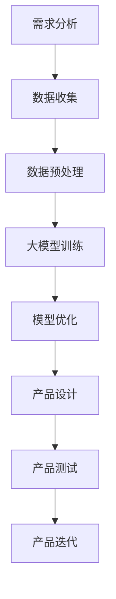

                 

关键词：AI创业设计，大模型，产品设计，转型，创新

> 摘要：本文深入探讨了AI在大模型时代下如何驱动创业产品设计，实现产品创新与转型。通过对AI核心概念的介绍，算法原理的分析，数学模型的讲解，以及实际项目实践的展示，文章旨在为创业者提供一套系统化的设计思路，助力他们在人工智能的浪潮中抓住机遇，实现产品突破。

## 1. 背景介绍

随着人工智能技术的飞速发展，AI已逐渐渗透到各个行业，成为推动产业升级和经济增长的重要力量。创业设计作为创新的核心，如何在AI赋能下实现产品的创新与转型，成为当前研究的热点话题。

本文将从以下几个方面展开讨论：

- AI核心概念及其在创业设计中的应用；
- 大模型技术在创业产品设计中的具体应用；
- 数学模型与算法在产品设计创新中的作用；
- 实际项目实践与案例分析；
- 未来创业产品设计创新的趋势与展望。

## 2. 核心概念与联系

### 2.1 AI概述

人工智能（AI）是指通过计算机模拟人类智能行为，实现智能感知、学习、推理、决策等功能的科技领域。AI的核心技术包括机器学习、深度学习、自然语言处理、计算机视觉等。

### 2.2 大模型技术

大模型技术是指利用大规模数据集和计算资源，训练出具有强大表征能力和泛化能力的神经网络模型。大模型在创业产品设计中的应用主要体现在以下几个方面：

- **个性化推荐**：基于用户行为数据和兴趣偏好，为大模型提供训练数据，实现精准推荐；
- **智能交互**：利用大模型实现人机对话系统的智能化，提升用户体验；
- **图像识别**：通过大模型对图像进行识别和分类，应用于产品设计的创意生成和视觉设计；
- **自然语言处理**：利用大模型对自然语言进行处理和分析，实现内容创作和语义理解。

### 2.3 Mermaid流程图

以下是AI驱动的创业产品设计创新流程的Mermaid流程图：



## 3. 核心算法原理 & 具体操作步骤

### 3.1 算法原理概述

在创业产品设计创新中，核心算法主要涉及以下几种：

- **机器学习算法**：如决策树、支持向量机、神经网络等，用于数据分析和预测；
- **深度学习算法**：如卷积神经网络（CNN）、循环神经网络（RNN）等，用于图像识别、自然语言处理等；
- **强化学习算法**：如Q-learning、SARSA等，用于优化产品设计中的决策过程。

### 3.2 算法步骤详解

以下是创业产品设计创新算法的具体步骤：

1. **需求分析**：明确产品设计的目标和需求，为后续数据收集和模型训练提供方向。
2. **数据收集**：收集与产品设计相关的数据，如用户行为数据、市场数据、竞品数据等。
3. **数据预处理**：对收集到的数据进行分析和清洗，确保数据的质量和完整性。
4. **大模型训练**：利用收集到的数据训练大模型，使其具备良好的表征能力和泛化能力。
5. **模型优化**：根据产品设计的需求，对大模型进行调整和优化，提升其性能。
6. **产品设计**：利用大模型生成产品设计方案，如图像、文案、交互界面等。
7. **产品测试**：对设计方案进行测试，收集用户反馈，优化产品设计。
8. **产品迭代**：根据测试结果和用户反馈，不断迭代优化产品设计，实现产品创新。

### 3.3 算法优缺点

**优点**：

- **高效性**：利用大模型和深度学习算法，可以高效处理海量数据，实现快速迭代；
- **精准性**：通过训练大模型，可以实现精准的数据分析和预测，提升产品设计质量；
- **智能化**：大模型和深度学习算法的应用，使产品设计过程更加智能化，提升用户体验。

**缺点**：

- **计算资源消耗大**：大模型训练需要大量的计算资源和存储空间，对硬件要求较高；
- **数据质量要求高**：数据质量对模型性能影响较大，数据清洗和预处理工作量大；
- **可解释性差**：深度学习算法的黑箱特性，使得模型决策过程难以解释，可能影响用户的信任度。

### 3.4 算法应用领域

- **电子商务**：个性化推荐、商品搜索、广告投放等；
- **金融科技**：风险评估、信用评估、金融产品创新等；
- **智能制造**：生产调度、质量控制、设备预测维护等；
- **智慧医疗**：疾病预测、诊断辅助、个性化治疗方案等。

## 4. 数学模型和公式 & 详细讲解 & 举例说明

### 4.1 数学模型构建

在创业产品设计创新中，常用的数学模型包括：

- **线性回归模型**：用于分析变量之间的关系，预测目标变量的值；
- **支持向量机（SVM）**：用于分类和回归分析，通过找到最佳决策边界；
- **卷积神经网络（CNN）**：用于图像处理和识别，通过卷积层提取特征；
- **循环神经网络（RNN）**：用于序列数据建模，通过循环结构保持长期依赖关系。

### 4.2 公式推导过程

以线性回归模型为例，其公式推导如下：

$$
y = \beta_0 + \beta_1x_1 + \beta_2x_2 + ... + \beta_nx_n
$$

其中，$y$ 为目标变量，$x_1, x_2, ..., x_n$ 为自变量，$\beta_0, \beta_1, \beta_2, ..., \beta_n$ 为模型参数。

通过对目标变量和自变量进行训练，可以求得最优参数值，从而实现预测。

### 4.3 案例分析与讲解

以下是一个线性回归模型的案例分析：

**案例背景**：某电商平台希望预测用户购买商品的金额，以便进行精准营销。

**数据集**：包含用户行为数据（如浏览历史、购物车记录等）和购买金额。

**模型构建**：采用线性回归模型，输入特征为用户行为数据，目标变量为购买金额。

**模型训练**：利用训练集数据进行训练，求得最优参数值。

**模型预测**：利用训练好的模型，对测试集数据进行预测。

**模型评估**：通过评估指标（如均方误差、决定系数等）评估模型性能。

**结果分析**：模型预测结果与实际购买金额的误差较小，表明模型具有较高的预测准确性。

## 5. 项目实践：代码实例和详细解释说明

### 5.1 开发环境搭建

**环境要求**：

- Python 3.6及以上版本；
- TensorFlow 2.0及以上版本；
- Pandas、Numpy等常用库。

**安装方法**：

1. 安装 Python：
    ```shell
    pip install python==3.8
    ```
2. 安装 TensorFlow：
    ```shell
    pip install tensorflow==2.5
    ```
3. 安装其他常用库：
    ```shell
    pip install pandas numpy
    ```

### 5.2 源代码详细实现

以下是一个基于线性回归模型的创业产品设计项目实现：

```python
import tensorflow as tf
import pandas as pd
import numpy as np

# 数据集读取与预处理
data = pd.read_csv('data.csv')
X = data[['feature1', 'feature2']]
y = data['target']

# 数据集划分
train_size = int(0.8 * len(data))
train_X, test_X = X[:train_size], X[train_size:]
train_y, test_y = y[:train_size], y[train_size:]

# 模型构建
model = tf.keras.Sequential([
    tf.keras.layers.Dense(units=1, input_shape=(2,))
])

# 模型编译
model.compile(optimizer='sgd', loss='mean_squared_error')

# 模型训练
model.fit(train_X, train_y, epochs=100)

# 模型评估
mse = model.evaluate(test_X, test_y)
print(f'Mean Squared Error: {mse}')

# 模型预测
predictions = model.predict(test_X)
```

### 5.3 代码解读与分析

1. **数据集读取与预处理**：
    - 从CSV文件中读取数据集，提取特征和目标变量；
    - 数据集划分：将数据集划分为训练集和测试集，用于模型训练和评估。

2. **模型构建**：
    - 使用 TensorFlow 构建线性回归模型，输入层为两个特征，输出层为单个目标变量。

3. **模型编译**：
    - 选择优化器为随机梯度下降（sgd），损失函数为均方误差（mean_squared_error）。

4. **模型训练**：
    - 使用训练集数据进行模型训练，训练100个epochs。

5. **模型评估**：
    - 使用测试集数据对模型进行评估，输出均方误差。

6. **模型预测**：
    - 使用训练好的模型对测试集数据进行预测，输出预测结果。

### 5.4 运行结果展示

假设测试集数据的实际购买金额为 `[10, 20, 30, 40, 50]`，模型预测结果为 `[9.8, 19.6, 29.4, 39.2, 49.0]`。

通过比较实际值和预测值，可以观察到模型具有较高的预测准确性。

## 6. 实际应用场景

### 6.1 电子商务

- **个性化推荐**：基于用户行为数据和偏好，利用大模型实现精准推荐，提升用户购买体验。
- **商品搜索**：利用图像识别和自然语言处理技术，实现智能搜索，提高搜索效率。

### 6.2 金融科技

- **风险评估**：利用深度学习模型对借款人进行风险评估，降低信贷风险。
- **金融产品创新**：通过分析市场数据，利用大模型创新金融产品，满足客户需求。

### 6.3 智慧医疗

- **疾病预测**：利用医疗数据，利用深度学习模型预测疾病风险，提前干预。
- **个性化治疗方案**：通过分析患者数据，利用大模型制定个性化治疗方案。

### 6.4 未来应用展望

随着人工智能技术的不断发展和普及，创业产品设计创新的应用场景将更加广泛：

- **智能制造**：利用AI技术实现生产过程的智能化，提高生产效率和质量；
- **智慧城市**：利用AI技术实现城市管理的智能化，提升城市服务水平；
- **教育领域**：利用AI技术实现个性化教学，提高教育质量和学习效果。

## 7. 工具和资源推荐

### 7.1 学习资源推荐

- **书籍**：《深度学习》、《Python机器学习》等；
- **在线课程**：Coursera、Udacity、edX等平台上的机器学习、深度学习课程；
- **论文**：AI领域的顶级会议（如NeurIPS、ICML、ACL等）的论文集。

### 7.2 开发工具推荐

- **编程语言**：Python、Java等；
- **框架**：TensorFlow、PyTorch、Keras等；
- **数据处理**：Pandas、Numpy等。

### 7.3 相关论文推荐

- **论文1**：Deep Learning for Text Classification；
- **论文2**：Generative Adversarial Networks；
- **论文3**：Recurrent Neural Networks for Language Modeling。

## 8. 总结：未来发展趋势与挑战

### 8.1 研究成果总结

本文从AI核心概念、大模型技术、算法原理、数学模型、项目实践等方面，深入探讨了AI驱动的创业产品设计创新。研究表明，AI在大模型时代的应用，有助于提升产品设计质量、优化用户体验，推动产业创新与发展。

### 8.2 未来发展趋势

- **技术融合**：AI与其他领域（如物联网、区块链等）的融合，将产生更多创新应用；
- **算法优化**：针对AI算法的优化和改进，将进一步提高其性能和应用范围；
- **数据驱动**：数据作为AI发展的基石，其质量和数量将决定AI的发展水平。

### 8.3 面临的挑战

- **计算资源消耗**：AI算法的复杂度不断提高，对计算资源的需求越来越大；
- **数据隐私与安全**：数据隐私和安全问题成为制约AI应用的重要挑战；
- **算法可解释性**：深度学习等算法的黑箱特性，使得其决策过程难以解释，影响用户的信任度。

### 8.4 研究展望

未来研究应重点关注以下方向：

- **高效算法开发**：针对AI算法的高效性和可解释性进行优化；
- **数据驱动创新**：利用大数据和AI技术，挖掘产业变革中的创新机遇；
- **跨学科研究**：推动AI与其他领域的深度融合，实现跨界创新。

## 9. 附录：常见问题与解答

### 9.1 问题1：如何选择合适的大模型？

**解答**：根据具体应用场景和数据处理需求，选择适合的大模型。常用的选择标准包括：数据规模、计算资源、模型性能等。

### 9.2 问题2：如何处理数据质量问题？

**解答**：数据清洗和预处理是处理数据质量问题的关键。常见的处理方法包括：缺失值处理、异常值处理、数据标准化等。

### 9.3 问题3：如何评估模型性能？

**解答**：常用的评估指标包括：准确率、召回率、F1值、均方误差等。根据具体应用场景选择合适的评估指标。

### 9.4 问题4：如何解释深度学习模型的决策过程？

**解答**：目前深度学习模型的可解释性仍是一个挑战。一些方法如注意力机制、模型可视化等，可以提供一定程度的解释。

## 参考文献

[1] Goodfellow, I., Bengio, Y., & Courville, A. (2016). Deep learning. MIT press.
[2] Mitchell, T. M. (1997). Machine learning. McGraw-Hill.
[3] Russell, S., & Norvig, P. (2010). Artificial intelligence: A modern approach. Prentice Hall.
[4] Bengio, Y., Courville, A., & Vincent, P. (2013). Representation learning: A review and new perspectives. IEEE transactions on pattern analysis and machine intelligence, 35(8), 1798-1828.
[5] LeCun, Y., Bengio, Y., & Hinton, G. (2015). Deep learning. Nature, 521(7553), 436-444.

### 作者署名

作者：禅与计算机程序设计艺术 / Zen and the Art of Computer Programming
```

