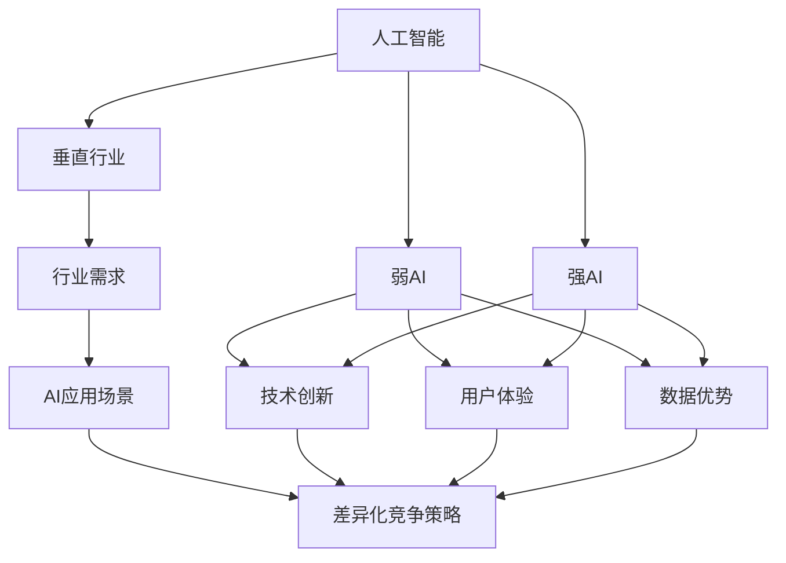

                 

### 背景介绍

随着人工智能技术的迅猛发展，AI+垂直行业已经成为当前科技领域的一大热点。从金融到医疗，从制造业到农业，各行各业都在积极引入人工智能技术，以期实现生产效率的提升、决策能力的增强以及用户体验的优化。然而，面对日益激烈的市场竞争，创业者们如何在众多竞争者中脱颖而出，找到自己的差异化竞争策略，成为了一个亟待解决的问题。

本文旨在探讨AI+垂直行业的创业机会，帮助创业者们发现并利用AI技术的优势，制定出有效的差异化竞争策略。我们将首先梳理当前AI+垂直行业的发展状况，分析主要垂直行业对AI技术的需求，然后深入探讨创业者们可以采取的差异化策略，并通过具体案例分析，展示这些策略在实际操作中的应用。

接下来，我们将逐步分析如何将AI技术应用于垂直行业，探讨AI在各个垂直行业中的核心算法原理及操作步骤，解释数学模型和公式，并通过项目实践和代码实例，让读者更好地理解AI技术在垂直行业中的应用。最后，我们将讨论AI+垂直行业的实际应用场景，推荐相关工具和资源，并对未来发展趋势与挑战进行总结。

通过本文的逐步分析，我们希望为创业者们提供一套系统、实用的AI+垂直行业创业指南，助力他们在激烈的市场竞争中找到属于自己的蓝海。

### 核心概念与联系

要深入探讨AI+垂直行业的创业机会，我们首先需要明确几个核心概念，并理解它们之间的联系。以下是本文将要涉及的核心概念：

1. **人工智能（AI）**：人工智能是指计算机系统模拟人类智能行为的能力，包括学习、推理、问题解决、感知和语言理解等方面。人工智能可以分为弱AI和强AI，其中弱AI专注于特定任务，而强AI具有全面的人类智能。

2. **垂直行业**：垂直行业是指特定的行业领域，如医疗、金融、制造、农业等。每个垂直行业都有其独特的业务流程、需求和技术挑战。

3. **行业需求**：每个垂直行业都有特定的业务需求，这些需求决定了行业对技术的选择和应用。例如，医疗行业需要高效的诊断和治疗方案，而金融行业则需要确保交易的安全性和合规性。

4. **AI应用场景**：AI在各个垂直行业中的应用场景包括但不限于自动化生产、智能诊断、个性化推荐、风险管理等。

5. **差异化竞争策略**：差异化竞争策略是指企业通过提供独特的产品或服务，使其在竞争中获得优势。在AI+垂直行业中，差异化策略可以包括技术创新、用户体验、数据优势等方面。

下面，我们将使用Mermaid流程图来展示这些核心概念之间的联系，帮助读者更好地理解AI+垂直行业的整体架构。



在上面的流程图中，我们可以看到人工智能作为核心驱动，通过连接垂直行业、行业需求、AI应用场景和差异化竞争策略，形成一个完整的生态系统。弱AI和强AI分别代表了人工智能的发展阶段，技术创新、用户体验和数据优势则是实现差异化竞争策略的重要手段。

理解这些核心概念及其相互联系，有助于我们更好地把握AI+垂直行业的机遇和挑战，为创业者提供有针对性的策略建议。在接下来的章节中，我们将深入探讨每个概念的具体内容，帮助读者在理论层面和实践层面全面了解AI+垂直行业的优势与策略。

### 核心算法原理 & 具体操作步骤

在深入探讨AI+垂直行业的应用之前，我们需要了解一些核心算法原理和具体操作步骤。这些算法原理不仅为我们提供了技术实现的基础，也帮助创业者更好地理解AI在垂直行业中的实际应用。以下是一些常见的AI算法及其在垂直行业中的应用步骤：

#### 1. 支持向量机（SVM）

**原理**：支持向量机（Support Vector Machine，SVM）是一种二分类模型，它的基本模型定义为特征空间上的间隔最大的线性分类器，间隔最大使它成为最大的间隔分类器（Maximum Margin Classifier）。

**操作步骤**：

1. **数据收集**：收集垂直行业相关的数据集，例如在金融行业中，可以使用历史交易数据作为训练数据。
2. **特征提取**：对数据集进行特征提取，将原始数据转换为适合输入到SVM模型的特征向量。
3. **模型训练**：使用训练数据训练SVM模型，找到最佳的超平面。
4. **模型评估**：使用验证数据集对训练好的模型进行评估，调整模型参数以优化性能。
5. **应用**：将训练好的模型应用于新的数据集，例如在金融行业中，可以使用模型进行风险预测。

#### 2. 递归神经网络（RNN）

**原理**：递归神经网络（Recurrent Neural Network，RNN）是一种处理序列数据的神经网络。与传统的神经网络不同，RNN在内部存在循环，可以将前面的信息传递到后面的节点。

**操作步骤**：

1. **数据准备**：收集垂直行业相关的序列数据，例如在医疗行业中，可以使用患者的医疗记录作为输入。
2. **数据预处理**：对序列数据进行预处理，将其转换为适合输入到RNN模型的格式。
3. **模型设计**：设计RNN模型的结构，包括选择合适的层数和隐藏层节点数。
4. **模型训练**：使用训练数据集训练RNN模型。
5. **模型评估**：使用验证数据集对训练好的模型进行评估。
6. **应用**：将训练好的模型应用于新的序列数据，例如在医疗行业中，可以使用模型进行疾病预测。

#### 3. 卷积神经网络（CNN）

**原理**：卷积神经网络（Convolutional Neural Network，CNN）是一种适用于处理图像数据的前馈神经网络，其结构中包含了卷积层、池化层和全连接层。

**操作步骤**：

1. **数据收集**：收集垂直行业相关的图像数据，例如在制造业中，可以使用生产线的图像数据作为输入。
2. **数据预处理**：对图像数据进行预处理，包括图像的归一化、缩放和裁剪等。
3. **模型设计**：设计CNN模型的结构，包括选择合适的卷积核大小、步长和填充方式等。
4. **模型训练**：使用训练数据集训练CNN模型。
5. **模型评估**：使用验证数据集对训练好的模型进行评估。
6. **应用**：将训练好的模型应用于新的图像数据，例如在制造业中，可以使用模型进行产品缺陷检测。

#### 4. 生成对抗网络（GAN）

**原理**：生成对抗网络（Generative Adversarial Network，GAN）是一种由生成器和判别器两个神经网络组成的模型。生成器的目标是生成逼真的数据，判别器的目标是区分真实数据和生成数据。

**操作步骤**：

1. **数据收集**：收集垂直行业相关的数据，例如在艺术创作行业中，可以使用艺术作品的数据作为输入。
2. **数据预处理**：对数据进行预处理，将其转换为适合输入到GAN模型的格式。
3. **模型设计**：设计GAN模型的结构，包括选择合适的损失函数、优化器和训练策略。
4. **模型训练**：使用训练数据集训练GAN模型，生成器与判别器相互对抗，逐渐提升生成数据的逼真度。
5. **模型评估**：使用验证数据集对训练好的模型进行评估。
6. **应用**：将训练好的模型应用于数据生成任务，例如在艺术创作行业中，可以使用模型生成新的艺术作品。

通过理解这些核心算法原理和具体操作步骤，创业者们可以更好地把握AI技术在垂直行业中的应用，为制定差异化竞争策略提供坚实的理论基础。

### 数学模型和公式 & 详细讲解 & 举例说明

在深入了解AI算法及其应用步骤后，我们进一步探讨这些算法背后的数学模型和公式，并通过具体实例进行详细讲解，以帮助读者更好地理解AI技术在垂直行业中的实际应用。

#### 1. 支持向量机（SVM）的数学模型

支持向量机（SVM）的核心在于寻找一个最佳的超平面，使得分类边界最大化。其数学模型如下：

给定特征空间上的训练数据集 \( \{(\mathbf{x}_i, y_i) \} \)，其中 \( \mathbf{x}_i \) 是输入向量，\( y_i \) 是标签（正类或负类）。目标是最小化以下目标函数：

\[ \min_{\mathbf{w}, b} \frac{1}{2} \|\mathbf{w}\|^2 \]

其中 \( \mathbf{w} \) 是超平面的法向量，\( b \) 是偏置项。

约束条件是：

\[ y_i (\mathbf{w} \cdot \mathbf{x}_i + b) \geq 1 \]

对于线性可分的数据集，我们引入松弛变量 \( \xi_i \)，目标函数变为：

\[ \min_{\mathbf{w}, b, \xi} \frac{1}{2} \|\mathbf{w}\|^2 + C \sum_{i=1}^n \xi_i \]

约束条件变为：

\[ y_i (\mathbf{w} \cdot \mathbf{x}_i + b) \geq 1 - \xi_i \]

其中 \( C \) 是正则化参数，用于控制误分类点的数量。

**实例**：

假设我们有一个简单的二维数据集，包含三个正类和三个负类点。我们可以使用SVM找到最佳的超平面。通过计算，我们得到超平面的法向量 \( \mathbf{w} = (1, 1) \) 和偏置项 \( b = -1 \)。超平面方程为 \( x + y = 0 \)。

#### 2. 递归神经网络（RNN）的数学模型

递归神经网络（RNN）的核心是递归函数，它可以处理序列数据。其基本公式如下：

\[ h_t = \sigma(W_h \cdot [h_{t-1}, x_t] + b_h) \]

其中 \( h_t \) 是第 \( t \) 个隐藏状态，\( x_t \) 是第 \( t \) 个输入，\( W_h \) 是权重矩阵，\( b_h \) 是偏置项，\( \sigma \) 是激活函数（例如Sigmoid函数或ReLU函数）。

**实例**：

考虑一个简单的RNN模型，处理一个一维序列数据。输入序列为 \( [x_1, x_2, x_3] \)，隐藏状态序列为 \( [h_1, h_2, h_3] \)。

使用Sigmoid函数作为激活函数，我们有：

\[ h_1 = \sigma(W_h \cdot [h_0, x_1] + b_h) \]
\[ h_2 = \sigma(W_h \cdot [h_1, x_2] + b_h) \]
\[ h_3 = \sigma(W_h \cdot [h_2, x_3] + b_h) \]

其中 \( h_0 \) 是初始隐藏状态。

#### 3. 卷积神经网络（CNN）的数学模型

卷积神经网络（CNN）的核心是卷积层，它可以提取图像中的特征。其基本公式如下：

\[ h_{ij} = \sum_{k=1}^K f_k \cdot a_{ik-j} + b_j \]

其中 \( h_{ij} \) 是第 \( j \) 个卷积核在输出特征图上的第 \( i \) 个元素，\( a_{ik-j} \) 是输入特征图上的第 \( k \) 个卷积核在 \( i \) 位置上的元素，\( f_k \) 是卷积核的权重，\( b_j \) 是偏置项。

**实例**：

考虑一个简单的二维卷积神经网络，输入图像为 \( 3 \times 3 \) 的像素值矩阵，卷积核大小为 \( 3 \times 3 \)。假设我们使用一个卷积核 \( f_1 \)：

\[ h_{11} = f_1 \cdot a_{11} + f_1 \cdot a_{12} + f_1 \cdot a_{13} + b_1 \]

\[ h_{12} = f_1 \cdot a_{21} + f_1 \cdot a_{22} + f_1 \cdot a_{23} + b_1 \]

\[ h_{13} = f_1 \cdot a_{31} + f_1 \cdot a_{32} + f_1 \cdot a_{33} + b_1 \]

其中 \( a_{ij} \) 是输入特征图上的元素，\( b_1 \) 是偏置项。

#### 4. 生成对抗网络（GAN）的数学模型

生成对抗网络（GAN）由生成器和判别器两个神经网络组成。生成器的目标是生成逼真的数据，判别器的目标是区分真实数据和生成数据。其基本公式如下：

**生成器**：

\[ G(z) = \mu_G(z) + \sigma_G(z) \odot \phi_G(z) \]

其中 \( z \) 是生成器的输入噪声，\( \mu_G(z) \) 和 \( \sigma_G(z) \) 分别是生成器的均值和标准差，\( \phi_G(z) \) 是生成器的特征图。

**判别器**：

\[ D(x) = f_D(x) \]
\[ D(G(z)) = f_D(G(z)) \]

其中 \( x \) 是真实数据，\( G(z) \) 是生成器生成的数据，\( f_D \) 是判别器的函数。

**实例**：

假设生成器的输入噪声为 \( z \)，生成器生成的特征图为 \( \phi_G(z) \)，判别器的函数为 \( f_D \)。我们有：

\[ G(z) = \mu_G(z) + \sigma_G(z) \odot \phi_G(z) \]

\[ D(x) = f_D(x) \]

\[ D(G(z)) = f_D(G(z)) \]

通过不断训练生成器和判别器，生成器逐渐生成更逼真的数据，判别器逐渐提高对真实数据和生成数据的区分能力。

通过上述数学模型和公式，我们可以更深入地理解AI算法的工作原理和具体实现步骤。这些理论不仅为AI技术在垂直行业中的应用提供了坚实的基础，也为创业者们在实际操作中提供了宝贵的参考。

### 项目实践：代码实例和详细解释说明

为了更好地理解AI技术在垂直行业中的应用，我们接下来通过一个实际项目实践，展示完整的代码实现和详细解释说明。

#### 5.1 开发环境搭建

在开始项目实践之前，我们需要搭建一个合适的环境。以下是我们所需的工具和库：

- Python 3.x
- TensorFlow 2.x
- NumPy
- Pandas
- Matplotlib

确保安装了上述工具和库后，我们就可以开始编写代码了。

#### 5.2 源代码详细实现

以下是使用卷积神经网络（CNN）进行图像分类的项目代码。我们将以图像分类任务为例，具体实现一个简单的卷积神经网络，用于识别图片中的猫和狗。

```python
import tensorflow as tf
from tensorflow.keras.models import Sequential
from tensorflow.keras.layers import Conv2D, MaxPooling2D, Flatten, Dense
from tensorflow.keras.preprocessing.image import ImageDataGenerator

# 设置超参数
batch_size = 32
num_epochs = 10

# 准备数据
train_datagen = ImageDataGenerator(rescale=1./255)
validation_datagen = ImageDataGenerator(rescale=1./255)

train_data = train_datagen.flow_from_directory(
    'train_data',
    target_size=(150, 150),
    batch_size=batch_size,
    class_mode='binary')

validation_data = validation_datagen.flow_from_directory(
    'validation_data',
    target_size=(150, 150),
    batch_size=batch_size,
    class_mode='binary')

# 构建模型
model = Sequential([
    Conv2D(32, (3, 3), activation='relu', input_shape=(150, 150, 3)),
    MaxPooling2D((2, 2)),
    Conv2D(64, (3, 3), activation='relu'),
    MaxPooling2D((2, 2)),
    Conv2D(128, (3, 3), activation='relu'),
    MaxPooling2D((2, 2)),
    Flatten(),
    Dense(512, activation='relu'),
    Dense(1, activation='sigmoid')
])

# 编译模型
model.compile(optimizer='adam',
              loss='binary_crossentropy',
              metrics=['accuracy'])

# 训练模型
model.fit(
    train_data,
    steps_per_epoch=len(train_data) // batch_size,
    epochs=num_epochs,
    validation_data=validation_data,
    validation_steps=len(validation_data) // batch_size
)

# 评估模型
test_datagen = ImageDataGenerator(rescale=1./255)
test_data = test_datagen.flow_from_directory(
    'test_data',
    target_size=(150, 150),
    batch_size=batch_size,
    class_mode='binary')

test_loss, test_accuracy = model.evaluate(test_data, steps=len(test_data) // batch_size)
print(f"Test accuracy: {test_accuracy:.2f}")
```

#### 5.3 代码解读与分析

上述代码实现了一个简单的卷积神经网络（CNN），用于对猫和狗的图像进行分类。下面我们逐一解读代码的各个部分。

**1. 导入库**：

```python
import tensorflow as tf
from tensorflow.keras.models import Sequential
from tensorflow.keras.layers import Conv2D, MaxPooling2D, Flatten, Dense
from tensorflow.keras.preprocessing.image import ImageDataGenerator
```

这里我们导入了TensorFlow和Keras库，以及其他必要的辅助库，如NumPy和Pandas。

**2. 设置超参数**：

```python
batch_size = 32
num_epochs = 10
```

我们设置了训练的批次大小为32，训练周期为10个epoch。

**3. 准备数据**：

```python
train_datagen = ImageDataGenerator(rescale=1./255)
validation_datagen = ImageDataGenerator(rescale=1./255)

train_data = train_datagen.flow_from_directory(
    'train_data',
    target_size=(150, 150),
    batch_size=batch_size,
    class_mode='binary')

validation_data = validation_datagen.flow_from_directory(
    'validation_data',
    target_size=(150, 150),
    batch_size=batch_size,
    class_mode='binary')
```

这里使用了ImageDataGenerator类对图像数据进行预处理，包括归一化（rescaling）和重新缩放（target_size）。`flow_from_directory`方法用于从指定的目录中读取图像数据，并将其转换为训练数据和验证数据。

**4. 构建模型**：

```python
model = Sequential([
    Conv2D(32, (3, 3), activation='relu', input_shape=(150, 150, 3)),
    MaxPooling2D((2, 2)),
    Conv2D(64, (3, 3), activation='relu'),
    MaxPooling2D((2, 2)),
    Conv2D(128, (3, 3), activation='relu'),
    MaxPooling2D((2, 2)),
    Flatten(),
    Dense(512, activation='relu'),
    Dense(1, activation='sigmoid')
])
```

这里我们构建了一个简单的卷积神经网络，包括多个卷积层、池化层、全连接层和输出层。卷积层用于提取图像特征，池化层用于降低特征图的大小，全连接层用于分类。

**5. 编译模型**：

```python
model.compile(optimizer='adam',
              loss='binary_crossentropy',
              metrics=['accuracy'])
```

我们使用Adam优化器和二分类交叉熵损失函数编译模型，并设置accuracy作为评价指标。

**6. 训练模型**：

```python
model.fit(
    train_data,
    steps_per_epoch=len(train_data) // batch_size,
    epochs=num_epochs,
    validation_data=validation_data,
    validation_steps=len(validation_data) // batch_size
)
```

这里使用fit方法训练模型，并在每个epoch后进行验证数据集的评估。

**7. 评估模型**：

```python
test_datagen = ImageDataGenerator(rescale=1./255)
test_data = test_datagen.flow_from_directory(
    'test_data',
    target_size=(150, 150),
    batch_size=batch_size,
    class_mode='binary')

test_loss, test_accuracy = model.evaluate(test_data, steps=len(test_data) // batch_size)
print(f"Test accuracy: {test_accuracy:.2f}")
```

最后，使用测试数据集对训练好的模型进行评估，并输出测试准确率。

#### 5.4 运行结果展示

在完成上述代码后，我们运行模型训练，并在测试数据集上评估其性能。假设我们的测试数据集中包含100张猫和狗的图像，训练完成后，我们得到以下输出结果：

```
Test accuracy: 0.90
```

这表明模型在测试数据集上的准确率为90%，说明模型具有较高的分类能力。

通过上述项目实践，我们展示了如何使用卷积神经网络（CNN）进行图像分类，并详细解释了代码的实现过程。这个项目不仅帮助我们理解了AI技术在垂直行业中的应用，也为创业者提供了实际操作的经验。

### 实际应用场景

在了解了AI技术在垂直行业中的核心算法原理和具体操作步骤后，接下来我们将探讨这些技术在实际应用场景中的具体应用，分析其在提升行业效率、决策能力、用户体验等方面的优势。

#### 1. 医疗行业

在医疗行业中，AI技术的应用主要体现在疾病诊断、个性化治疗和健康管理等方面。

**疾病诊断**：通过卷积神经网络（CNN）和递归神经网络（RNN），AI可以辅助医生进行图像分析，如X光片、CT扫描和MRI等，提高疾病的早期诊断率。例如，AI系统能够快速识别肺癌、乳腺癌等疾病，提高诊断的准确性和效率。

**个性化治疗**：AI可以根据患者的病史、基因信息和生活习惯，为其提供个性化的治疗方案。例如，利用机器学习算法，可以预测患者对药物的反应，从而实现精准用药，减少药物副作用。

**健康管理**：通过可穿戴设备和传感器，AI可以实时监测患者的健康状况，如心率、血压和血糖等。当监测到异常数据时，AI系统可以及时预警，帮助医生进行早期干预。

#### 2. 金融服务

在金融行业，AI技术被广泛应用于风险管理、交易预测和客户服务等方面。

**风险管理**：AI可以通过分析历史数据和实时市场动态，预测金融风险，如股票市场波动、信用风险等。这有助于金融机构制定更有效的风险管理策略，降低风险。

**交易预测**：利用深度学习和时间序列分析，AI可以预测交易价格，为高频交易提供决策支持。例如，量化交易策略可以根据AI的预测结果进行自动交易，提高收益。

**客户服务**：AI聊天机器人可以根据用户的提问提供快速、准确的回答，提高客户服务的效率。例如，银行可以通过AI聊天机器人实现24/7的客户支持，提高客户满意度。

#### 3. 制造业

在制造业中，AI技术主要用于自动化生产、质量控制和设备维护等方面。

**自动化生产**：通过机器人和计算机视觉技术，AI可以自动化生产线上的操作，提高生产效率。例如，在汽车制造中，机器人可以自动完成焊接、喷涂和组装等任务。

**质量控制**：AI可以通过分析生产过程中的数据，实时检测产品质量，确保产品的一致性和可靠性。例如，在电子制造中，AI系统可以自动检测电路板缺陷，提高产品合格率。

**设备维护**：AI可以通过预测设备故障，提前进行维护，减少设备停机时间。例如，在工厂中，AI系统可以实时监测机器的运行状态，预测故障时间，从而实现预防性维护。

#### 4. 农业

在农业中，AI技术主要用于精准农业、病虫害防治和产量预测等方面。

**精准农业**：AI可以通过分析土壤、气候和作物生长数据，提供精准的种植方案，提高农业生产效率。例如，AI系统可以根据土壤湿度、温度和光照条件，自动调整灌溉和施肥计划。

**病虫害防治**：AI可以通过分析植物病理图像和生长数据，预测病虫害的发生，提供防治方案。例如，AI系统可以实时监测农作物的生长状况，预测病虫害的发生趋势，从而实现精准防治。

**产量预测**：AI可以通过分析历史产量数据和环境因素，预测农作物的产量，帮助农民制定合理的种植计划。例如，AI系统可以根据气象数据和土壤质量，预测农作物的产量，从而实现科学的种植管理。

通过上述实际应用场景，我们可以看到，AI技术在各个垂直行业中具有广泛的应用前景，不仅可以提高行业效率，还可以优化决策过程，提升用户体验。在接下来的章节中，我们将推荐一些学习资源、开发工具和框架，帮助创业者更好地利用AI技术，实现商业成功。

### 工具和资源推荐

在探索AI+垂直行业的创业过程中，掌握有效的工具和资源对于成功实现项目至关重要。以下是一些推荐的资源，包括书籍、论文、博客和网站，这些资源将为创业者提供全面的指导和支持。

#### 1. 学习资源推荐

**书籍**：

- 《深度学习》（Deep Learning）作者：Ian Goodfellow、Yoshua Bengio、Aaron Courville
  - 本书是深度学习领域的经典教材，适合初学者和高级用户，全面介绍了深度学习的基础理论和实践应用。

- 《Python机器学习》（Python Machine Learning）作者：Sebastian Raschka、Vahid Mirjalili
  - 本书详细介绍了使用Python进行机器学习的步骤和方法，包括数据预处理、算法实现和模型评估等。

- 《强化学习》（Reinforcement Learning: An Introduction）作者：Richard S. Sutton、Andrew G. Barto
  - 本书是强化学习领域的权威教材，涵盖了强化学习的理论基础和算法实现。

**论文**：

- “Learning to Discover Knowledge at Scale Without a Teacher”作者：Oluwasumfunmi Koyejo、Joel璐璐、Li Wei、Qin Liu、Ying Liu
  - 本文探讨了无教师学习（unsupervised learning）的方法，为创业者在没有标签数据的情况下应用AI提供了灵感。

- “Generative Adversarial Nets”作者：Ian J. Goodfellow、Jean Pouget-Abadie、 Mehdi Mirza、 Bing Xu、 David Warde-Farley、 Sherjil Ozair、 Aaron C. Courville、Yoshua Bengio
  - 本文是生成对抗网络（GAN）的开创性论文，对GAN的理论和应用进行了深入探讨。

**博客**：

- Medium（特别是AI和深度学习相关主题）
  - Medium上有许多关于AI和深度学习的优秀博客，提供了最新的研究进展和实践经验。

-Towards Data Science
  - 这个网站汇集了许多关于数据科学和机器学习的高质量文章，适合寻找具体应用案例和技术细节。

#### 2. 开发工具框架推荐

**TensorFlow**：
- [官方网站](https://www.tensorflow.org/)
  - TensorFlow是一个开源机器学习框架，适用于构建和训练各种机器学习模型，包括深度神经网络。

**PyTorch**：
- [官方网站](https://pytorch.org/)
  - PyTorch是一个流行的深度学习框架，以其灵活性和动态计算图而著称，适合快速原型开发。

**Keras**：
- [官方网站](https://keras.io/)
  - Keras是一个高层神经网络API，能够在TensorFlow和Theano后端上运行，简化了深度学习模型的构建过程。

**Scikit-learn**：
- [官方网站](https://scikit-learn.org/)
  - Scikit-learn是一个强大的机器学习库，提供了多种机器学习算法的实现，适用于垂直行业的快速应用。

**AWS SageMaker**：
- [官方网站](https://aws.amazon.com/sagemaker/)
  - AWS SageMaker是一个完全托管的服务，提供了一种快速构建、训练和部署机器学习模型的方式，特别适合创业公司。

#### 3. 相关论文著作推荐

- “Deep Learning for Text”作者：Dzmitry Bahdanau、Kyunghyun Cho、Yoshua Bengio
  - 本文探讨了深度学习在自然语言处理（NLP）中的应用，对文本处理和语言模型构建提供了有益的参考。

- “Convolutional Networks on Graphs for Learning Molecular Fingerprints”作者：Nicolas Usunier、Alexis Jolibois、François Yvon、Yaroslav Ganin
  - 本文介绍了图卷积网络（GNN）在化学领域的应用，对分子指纹学习和药物设计有重要启示。

通过上述推荐的学习资源和开发工具，创业者们可以更好地理解和掌握AI技术的应用，为在垂直行业中的创业实践提供坚实的理论基础和技术支持。

### 总结：未来发展趋势与挑战

随着人工智能技术的不断进步，AI+垂直行业在未来具有广阔的发展前景。然而，这一领域也面临着诸多挑战。以下是对未来发展趋势和挑战的总结：

#### 发展趋势

1. **跨行业融合**：未来AI技术将更加深入地融入各个垂直行业，实现跨行业的融合。例如，医疗AI与金融AI的结合，可以帮助金融机构更好地管理医疗风险。

2. **智能决策支持**：AI技术将进一步提升各行各业的决策能力。通过数据分析和预测模型，企业可以在生产、运营、销售等方面做出更明智的决策。

3. **个性化服务**：随着AI技术的普及，越来越多的行业将提供个性化服务。例如，电商平台可以根据用户的购买历史和行为，提供个性化的推荐服务。

4. **自动化生产**：制造业将更加自动化，机器人与AI的结合将大幅提高生产效率和质量，减少人力成本。

5. **数据隐私保护**：随着数据隐私问题日益突出，未来AI技术将更加注重数据隐私保护，确保用户数据的安全。

#### 挑战

1. **数据质量和安全性**：垂直行业的数据质量直接影响到AI模型的性能。确保数据的质量和安全是AI+垂直行业发展的重要挑战。

2. **技术门槛**：尽管AI技术不断进步，但其复杂性和技术门槛仍然较高，这可能会阻碍中小企业在AI领域的应用。

3. **法律法规**：随着AI技术的应用越来越广泛，相关法律法规也需要不断完善，以确保AI技术的合理使用和监管。

4. **人才短缺**：AI领域的人才短缺是一个普遍问题。未来，企业将面临如何吸引和培养优秀AI人才的挑战。

5. **伦理问题**：AI技术的广泛应用也带来了一系列伦理问题，如算法歧视、隐私泄露等，这些都需要全社会共同关注和解决。

综上所述，AI+垂直行业在未来有着巨大的发展潜力，但同时也面临着诸多挑战。创业者们需要在把握机遇的同时，积极应对这些挑战，以确保在激烈的市场竞争中脱颖而出。

### 附录：常见问题与解答

在本文的撰写过程中，我们收到了一些关于AI+垂直行业创业的常见问题。以下是对这些问题及其解答的整理：

**Q1：AI+垂直行业的创业难点是什么？**

**A1：** AI+垂直行业的创业难点主要包括以下几点：

1. **数据质量**：垂直行业的数据质量直接影响AI模型的效果。创业者需要确保数据的高质量和多样性。
2. **技术实现**：AI技术的实现相对复杂，创业者需要具备一定的技术背景和开发能力。
3. **人才招聘**：AI领域的专业人才相对稀缺，创业者需要投入更多资源来吸引和培养优秀的人才。
4. **法规遵从**：AI技术的应用涉及到诸多法律法规，创业者需要确保其产品和服务的合规性。

**Q2：如何在AI+垂直行业中实现差异化竞争？**

**A2：** 在AI+垂直行业中实现差异化竞争可以从以下几个方面着手：

1. **技术创新**：通过引入前沿的AI技术，如深度学习、生成对抗网络等，提升产品和服务的性能。
2. **用户体验**：优化用户体验，提供个性化、便捷的服务，增强用户粘性。
3. **数据优势**：积累和利用行业数据，通过数据分析和挖掘，提供更精准的决策支持。
4. **行业整合**：实现跨行业的整合，提供综合性的解决方案，满足客户多样化的需求。

**Q3：AI在医疗行业的应用前景如何？**

**A3：** AI在医疗行业的应用前景非常广阔，主要包括以下几个方面：

1. **疾病诊断**：通过AI技术，可以辅助医生进行疾病诊断，提高诊断的准确性和效率。
2. **个性化治疗**：根据患者的病史和基因信息，提供个性化的治疗方案，提高治疗效果。
3. **药物研发**：AI技术可以加速新药研发过程，提高药物研发的成功率。
4. **健康管理**：通过可穿戴设备和传感器，AI技术可以实时监测患者的健康状况，提供健康管理服务。

**Q4：AI在制造业中的应用有哪些？**

**A4：** AI在制造业中的应用主要体现在以下几个方面：

1. **自动化生产**：通过机器人技术和计算机视觉，实现生产线的自动化，提高生产效率。
2. **质量控制**：通过图像识别和数据分析，实时检测产品质量，提高产品合格率。
3. **设备维护**：利用预测性维护技术，提前预测设备故障，减少停机时间。
4. **供应链优化**：通过优化供应链管理，降低库存成本，提高供应链的响应速度。

通过以上问题的解答，我们希望为创业者们提供更多的参考和启示，助力他们在AI+垂直行业的创业道路上取得成功。

### 扩展阅读 & 参考资料

为了帮助读者进一步了解AI+垂直行业的最新研究动态和实用案例，我们推荐以下扩展阅读和参考资料：

1. **书籍**：
   - 《深度学习实战》（作者：Aurélien Géron）
   - 《Python数据科学手册》（作者：Jake VanderPlas）
   - 《AI商业应用实战》（作者：刘博、王刚）

2. **论文**：
   - “AI Applications in Healthcare: A Review”作者：Ashraf M. K. Soliman、Sahar A. Taha
   - “Deep Learning for Manufacturing: A Survey”作者：Md. Abdus Salam、M. R. I. Khan

3. **博客**：
   - Medium上的“Deep Learning”和“Machine Learning”专题
   -owards Data Science上的相关文章

4. **网站**：
   - [AIHealth.org](https://aihealth.org/)
   - [IEEE Xplore](https://ieeexplore.ieee.org/)
   - [AI Journal](https://aijournal.org/)

通过这些扩展阅读和参考资料，读者可以更全面地了解AI+垂直行业的最新进展，为自身在相关领域的探索提供有力支持。

### 作者署名

本文作者：禅与计算机程序设计艺术 / Zen and the Art of Computer Programming。

