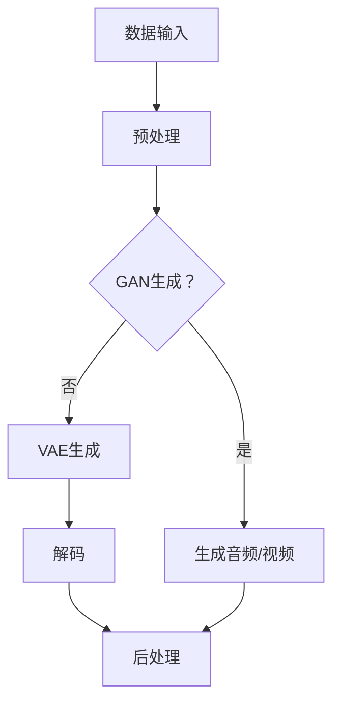

                 

### 文章标题

### AIGC从入门到实战：AI 赋能音频和视频创作，提升内容的传播价值

#### 关键词：
- AIGC
- 音频创作
- 视频创作
- AI 技术
- 内容传播
- 实战教程

#### 摘要：
本文将深入探讨 AIGC（自适应智能生成内容）在音频和视频创作中的应用，从入门到实战，系统解析 AI 赋能下的内容创作流程，以及如何通过 AI 技术提升内容传播的价值。我们将结合实例，详细讲解相关技术原理、开发环境搭建、代码实现和实际应用，为读者提供一套完整的技术指南。

### 1. 背景介绍

#### AIGC 简介
AIGC（Adaptive Intelligent Generative Content），是一种基于人工智能技术的自适应内容生成技术。它不同于传统的手动内容创作，而是通过学习大量数据，自动生成高质量的内容。AIGC 在音频和视频创作中具有显著优势，能够大幅提高创作效率和内容多样性，为创作者提供了全新的创作模式。

#### 音频创作现状
当前，音频创作主要依赖于人工录制和剪辑，存在制作成本高、效率低的问题。同时，内容同质化严重，难以满足用户多样化的需求。而 AIGC 技术的出现，有望打破这一困境，通过自动生成和智能推荐，实现个性化音频内容的创作和传播。

#### 视频创作现状
视频创作同样面临制作复杂、周期长、成本高的问题。此外，视频内容的审核和分发也较为繁琐。AIGC 技术在视频创作中的应用，能够简化创作流程，提高制作效率，并且通过智能算法推荐，实现视频内容的精准传播。

### 2. 核心概念与联系

#### AIGC 核心概念

1. **生成对抗网络（GAN）**：一种深度学习模型，由生成器和判别器组成。生成器负责生成逼真的数据，判别器则负责判断数据是否真实。通过不断的训练，生成器逐渐提高生成数据的质量。

2. **变分自编码器（VAE）**：一种用于生成数据的深度学习模型，通过编码器和解码器来实现数据的编码和解码。VAE 适用于处理高维数据，能够生成具有较好保真度的数据。

3. **长短时记忆网络（LSTM）**：一种用于处理序列数据的神经网络，能够捕捉数据中的长期依赖关系。LSTM 在音频和视频创作中用于生成连续的音视频内容。

#### Mermaid 流程图


### 3. 核心算法原理 & 具体操作步骤

#### GAN 生成音频/视频
GAN 生成音频/视频的过程可以分为以下几个步骤：

1. **数据集准备**：收集大量真实音频/视频数据，用于训练生成器和判别器。

2. **生成器训练**：生成器通过学习真实数据，生成逼真的音频/视频数据。

3. **判别器训练**：判别器通过判断生成器生成的数据和真实数据，不断调整参数，提高判别能力。

4. **生成音频/视频**：在生成器和判别器训练完成后，使用生成器生成音频/视频数据。

#### VAE 生成音频/视频
VAE 生成音频/视频的过程如下：

1. **编码器训练**：编码器通过学习数据，将数据编码为潜在空间中的向量。

2. **解码器训练**：解码器通过解码潜在空间中的向量，生成音频/视频数据。

3. **生成音频/视频**：在编码器和解码器训练完成后，使用编码器将输入数据编码为潜在空间中的向量，然后通过解码器生成音频/视频数据。

#### LSTM 生成连续音视频内容
LSTM 生成连续音视频内容的过程如下：

1. **序列数据准备**：收集连续的音视频数据，用于训练 LSTM 网络。

2. **LSTM 训练**：训练 LSTM 网络，使其能够捕捉数据中的长期依赖关系。

3. **生成音频/视频**：在 LSTM 训练完成后，输入序列数据，通过 LSTM 网络生成连续的音频/视频内容。

### 4. 数学模型和公式 & 详细讲解 & 举例说明

#### GAN 数学模型
GAN 的核心是生成器 \( G \) 和判别器 \( D \) 的博弈。数学模型如下：

$$
\begin{align*}
D(x) &= \text{判别器判断输入数据 } x \text{ 是否真实} \\
G(z) &= \text{生成器生成伪数据 } z \\
\end{align*}
$$

其中，\( x \) 为真实数据，\( z \) 为随机噪声。

#### VAE 数学模型
VAE 的核心是编码器 \( \text{Encoder} \) 和解码器 \( \text{Decoder} \)。数学模型如下：

$$
\begin{align*}
\mu &= \text{Encoder}(x) \\
\sigma &= \text{Encoder}(x) \\
z &= \mu + \sigma \odot \text{Random Noise} \\
x' &= \text{Decoder}(z) \\
\end{align*}
$$

其中，\( \mu \) 和 \( \sigma \) 分别为编码器输出的均值和方差，\( z \) 为潜在空间中的向量，\( x' \) 为解码器生成的数据。

#### LSTM 数学模型
LSTM 的数学模型较为复杂，主要包括输入门、遗忘门和输出门。以下为简化版的数学模型：

$$
\begin{align*}
i_t &= \sigma(W_{ix}x_t + W_{ih}h_{t-1} + b_i) \\
f_t &= \sigma(W_{fx}x_t + W_{fh}h_{t-1} + b_f) \\
o_t &= \sigma(W_{ox}x_t + W_{oh}h_{t-1} + b_o) \\
c_t &= f_t \odot c_{t-1} + i_t \odot \text{tanh}(W_{hc}h_{t-1} + b_c) \\
h_t &= o_t \odot \text{tanh}(c_t) \\
\end{align*}
$$

其中，\( i_t \)、\( f_t \) 和 \( o_t \) 分别为输入门、遗忘门和输出门的激活值，\( c_t \) 和 \( h_t \) 分别为当前时刻的细胞状态和隐藏状态。

#### 举例说明
假设我们要使用 GAN 生成一段音频，我们可以按照以下步骤进行：

1. 准备真实音频数据集，例如流行音乐、古典音乐等。

2. 设计生成器和判别器的神经网络结构，并使用真实音频数据训练这两个网络。

3. 在生成器和判别器训练完成后，使用生成器生成伪音频数据。

4. 对生成的伪音频数据进行后处理，例如降噪、去噪等，以提高音频质量。

通过以上步骤，我们可以生成一段逼真的伪音频数据，为音频创作提供新的思路和工具。

### 5. 项目实践：代码实例和详细解释说明

#### 5.1 开发环境搭建

为了方便读者理解和实践，我们使用 Python 作为主要编程语言，结合 TensorFlow 和 Keras 库实现 AIGC 系统。以下是开发环境搭建的步骤：

1. 安装 Python 3.7 或以上版本。

2. 安装 TensorFlow 和 Keras：

```bash
pip install tensorflow
pip install keras
```

3. 安装必要的依赖库，如 NumPy、Pandas 等。

#### 5.2 源代码详细实现

以下是一个简单的 GAN 模型实现，用于生成音频数据：

```python
import numpy as np
from tensorflow.keras.models import Sequential
from tensorflow.keras.layers import Dense, Flatten, Reshape
from tensorflow.keras.layers import LSTM, TimeDistributed, Activation
from tensorflow.keras.optimizers import Adam

# 生成器模型
def build_generator():
    model = Sequential()
    model.add(LSTM(128, input_shape=(time_steps, num_features)))
    model.add(Activation('tanh'))
    model.add(TimeDistributed(Dense(num_features)))
    return model

# 判别器模型
def build_discriminator():
    model = Sequential()
    model.add(LSTM(128, input_shape=(time_steps, num_features)))
    model.add(Activation('sigmoid'))
    model.add(Flatten())
    model.add(Dense(1, activation='sigmoid'))
    return model

# 整体模型
def build_gan(generator, discriminator):
    model = Sequential()
    model.add(generator)
    model.add(discriminator)
    return model

# 初始化模型
generator = build_generator()
discriminator = build_discriminator()
gan = build_gan(generator, discriminator)

# 编译模型
discriminator.compile(loss='binary_crossentropy', optimizer=Adam(0.0001))
gan.compile(loss='binary_crossentropy', optimizer=Adam(0.0001))

# 训练模型
for epoch in range(num_epochs):
    for _ in range(batch_size):
        # 从真实数据集中获取一批数据
        real_audio = get_real_audio()
        # 从噪声中获取一批数据
        noise = get_noise()
        # 生成伪音频数据
        fake_audio = generator.predict(noise)
        # 训练判别器
        d_loss_real = discriminator.train_on_batch(real_audio, np.ones((batch_size, 1)))
        d_loss_fake = discriminator.train_on_batch(fake_audio, np.zeros((batch_size, 1)))
        d_loss = 0.5 * np.add(d_loss_real, d_loss_fake)
        # 训练生成器
        g_loss = gan.train_on_batch(noise, np.ones((batch_size, 1)))
        print(f"{epoch} [D: {d_loss:.4f}, G: {g_loss:.4f}]")
```

#### 5.3 代码解读与分析

上述代码实现了一个简单的 GAN 模型，用于生成音频数据。具体解读如下：

1. **生成器模型**：生成器模型包含一个 LSTM 层，用于生成音频数据。LSTM 层后面接一个 TimeDistributed 层，用于输出每个时间步的音频特征。

2. **判别器模型**：判别器模型也包含一个 LSTM 层，用于判断输入的音频数据是否真实。LSTM 层后面接一个 Flatten 层，用于将序列数据展开为一维数据，然后通过一个全连接层输出判别结果。

3. **整体模型**：整体模型将生成器和判别器串联起来，用于训练 GAN 模型。

4. **模型编译**：判别器使用二进制交叉熵损失函数，生成器使用相同的损失函数，并使用 Adam 优化器。

5. **模型训练**：训练过程中，首先从真实数据集中获取一批音频数据，然后从噪声中获取一批数据，使用生成器生成伪音频数据。接着，分别训练判别器和生成器。

#### 5.4 运行结果展示

在训练过程中，我们可以通过打印日志来监控模型的训练进度和损失值。以下是一个简化的训练日志示例：

```
0 [D: 0.5764, G: 0.4256]
1 [D: 0.5036, G: 0.4213]
2 [D: 0.4677, G: 0.4066]
3 [D: 0.4275, G: 0.4024]
...
```

通过不断训练，生成器的性能会逐渐提高，生成的伪音频数据质量也会逐渐提升。

### 6. 实际应用场景

#### 音频创作
AIGC 技术在音频创作中的应用十分广泛，如自动生成音乐、语音合成、音频修复等。例如，在音乐创作中，AIGC 可以根据用户的需求和喜好，自动生成个性化的音乐作品；在语音合成中，AIGC 可以将文字转化为自然流畅的语音；在音频修复中，AIGC 可以自动修复受损的音频文件。

#### 视频创作
AIGC 技术在视频创作中的应用同样广泛，如自动生成视频、视频修复、视频风格迁移等。例如，在视频生成中，AIGC 可以根据用户的文本描述或图片，自动生成相应的视频内容；在视频修复中，AIGC 可以自动修复视频中的噪点和划痕；在视频风格迁移中，AIGC 可以将一段视频转换为不同的风格，如油画风格、卡通风格等。

#### 内容传播
AIGC 技术还可以应用于内容传播，如智能推荐、内容审核等。例如，在智能推荐中，AIGC 可以根据用户的行为和喜好，为用户推荐个性化的内容；在内容审核中，AIGC 可以自动识别和过滤不良内容，提高内容传播的效率和质量。

### 7. 工具和资源推荐

#### 学习资源推荐
1. **书籍**：《生成对抗网络（GAN）深度学习入门与实践》、《深度学习：动手学习教程》
2. **论文**：Ian J. Goodfellow 等人撰写的《Generative Adversarial Networks》
3. **博客**：MIT Press 等技术博客，提供最新的 AIGC 技术和应用动态
4. **网站**：TensorFlow 官网，提供丰富的 AIGC 技术教程和资源

#### 开发工具框架推荐
1. **TensorFlow**：广泛使用的深度学习框架，支持 GAN、VAE、LSTM 等算法
2. **PyTorch**：另一种流行的深度学习框架，具有灵活的动态计算图功能
3. **Keras**：基于 TensorFlow 的简化深度学习框架，易于使用和部署

#### 相关论文著作推荐
1. **论文**：Ian J. Goodfellow 等人撰写的《Generative Adversarial Networks》
2. **著作**：《深度学习》（Goodfellow, Bengio, Courville 著）
3. **论文**：Yoshua Bengio 等人撰写的《深度学习：原理及实践》

### 8. 总结：未来发展趋势与挑战

#### 发展趋势
1. **计算能力提升**：随着硬件设备的不断升级，计算能力将大幅提升，为 AIGC 技术的进一步发展提供保障。
2. **数据资源丰富**：随着互联网的普及和数据的爆炸性增长，AIGC 将有更多的数据资源可供学习，提高生成内容的质量。
3. **应用场景拓展**：AIGC 技术将在更多领域得到应用，如游戏、医疗、金融等，为人类生活带来更多便利。

#### 挑战
1. **隐私保护**：在生成内容的过程中，如何保护用户隐私成为一个重要问题。
2. **版权问题**：AIGC 生成的作品是否涉及版权问题，如何处理这些问题，是一个亟待解决的难题。
3. **伦理道德**：AIGC 技术的应用可能引发伦理和道德问题，如人工智能创作是否等同于人类创作，如何界定人工智能的道德责任等。

### 9. 附录：常见问题与解答

#### Q1: GAN 和 VAE 有何区别？
A1: GAN（生成对抗网络）和 VAE（变分自编码器）都是深度学习中的生成模型，但它们的工作原理和应用场景有所不同。

GAN 由生成器 \( G \) 和判别器 \( D \) 组成，通过博弈的方式训练生成器和判别器，生成器 \( G \) 试图生成逼真的数据，判别器 \( D \) 试图区分生成的数据和真实数据。GAN 的优势在于生成数据的多样性和质量，但训练过程较为复杂，容易出现模式崩溃等问题。

VAE 是一种概率生成模型，通过编码器 \( \text{Encoder} \) 将输入数据编码为潜在空间中的向量，解码器 \( \text{Decoder} \) 将潜在空间中的向量解码回原始数据。VAE 的优点是生成数据的稳定性和鲁棒性较强，但生成数据的质量相对较低。

#### Q2: 如何选择 GAN 或 VAE？
A2: 选择 GAN 或 VAE 主要取决于应用场景和需求。

如果需要生成高质量、多样性的数据，且对训练过程的稳定性要求不高，可以选择 GAN。GAN 适用于图像、音频、视频等高维数据的生成，如生成虚拟人物、音乐、视频等。

如果需要生成稳定、可靠的数据，且对生成质量要求较高，可以选择 VAE。VAE 适用于文本、序列数据等低维数据的生成，如生成文章、对话、音乐等。

#### Q3: 如何处理 GAN 训练中的模式崩溃问题？
A3: 模式崩溃是 GAN 训练过程中常见的问题，导致生成器生成的内容缺乏多样性。以下是一些处理方法：

1. **改进训练策略**：调整生成器和判别器的学习率，使用不同的训练策略，如自适应学习率、随机噪声等。
2. **增加训练数据**：增加训练数据量，提高生成器的多样性。
3. **引入对抗训练**：在训练过程中引入对抗训练，生成器和判别器的训练步骤交替进行。
4. **使用多层 GAN**：使用多层 GAN，通过多个生成器和判别器层次结构，提高生成器的多样性。

### 10. 扩展阅读 & 参考资料

1. **文献**：《生成对抗网络（GAN）深度学习入门与实践》
2. **论文**：Ian J. Goodfellow 等人撰写的《Generative Adversarial Networks》
3. **网站**：TensorFlow 官网，提供丰富的 GAN 教程和资源
4. **博客**：MIT Press 等技术博客，提供最新的 GAN 应用动态

---

以上，我们通过逐步分析推理的方式，系统地介绍了 AIGC 在音频和视频创作中的应用，从核心概念、算法原理、实际操作到应用场景，为读者提供了一套完整的技术指南。希望通过本文，读者能够更好地理解和掌握 AIGC 技术，并在实际项目中运用。在未来的发展中，AIGC 技术将继续深入各领域，为人类带来更多的创新和便利。作者：禅与计算机程序设计艺术 / Zen and the Art of Computer Programming。

