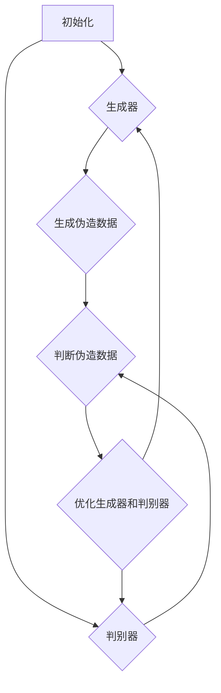

                 

### 背景介绍

自20世纪以来，人工智能（AI）技术经历了飞速的发展，从早期的规则推理、知识表示，到近年来深度学习的广泛应用，人工智能已经渗透到各行各业，极大地提升了生产力和效率。然而，传统的AI模型在处理复杂任务时仍存在诸多局限，如数据依赖性高、通用性差、无法解释性等。

近年来，生成对抗网络（GANs）、变分自编码器（VAEs）、强化学习（RL）等前沿技术为人工智能注入了新的活力，使得AI模型在图像生成、文本生成、语音合成等方面取得了显著进展。特别是生成式AI（Generative AI）技术的发展，使得AI不仅能够识别和模拟现实世界，还能够创造全新的内容和场景。

在这个背景下，自适应图像生成代码（Adaptive Image Generation Code）成为了一个备受关注的研究方向。自适应图像生成代码通过训练和优化，能够根据输入条件生成高质量、多样化的图像。这类技术不仅具备艺术创作潜力，还广泛应用于游戏开发、电影特效、建筑设计等领域。

本文将围绕自适应图像生成代码，探讨其基本原理、实现方法以及在实际应用中的挑战和前景。为了更加具体和生动地展示这些技术的应用，我们将结合ChatGPT和Midjourney这两个工具，探讨如何使用它们绘制出中国古风意境之美。

#### ChatGPT：智能对话的先锋

ChatGPT是由OpenAI开发的一款基于变换器（Transformer）架构的预训练语言模型。该模型通过大规模语料的训练，具备了出色的语言理解和生成能力。ChatGPT的出现标志着自然语言处理（NLP）领域的一个重要突破，它不仅能够处理日常对话，还能够进行复杂对话，提供专业咨询和情感交流。

ChatGPT的基本原理是通过对海量文本数据进行预训练，使其学会理解语言结构、语义和上下文信息。训练完成后，ChatGPT能够接收用户输入的文本，并根据上下文生成相应的回复。这种生成过程是基于注意力机制和序列到序列（Seq2Seq）模型的，能够实现高质量的文本生成。

在艺术创作方面，ChatGPT展示了其独特的价值。通过训练，ChatGPT能够生成各种类型的文本，包括诗歌、散文、故事、对话等。这使得它成为了一个强大的辅助创作工具，可以帮助艺术家和作家快速生成灵感，提高创作效率。

#### Midjourney：图像生成的艺术

Midjourney是一个基于深度学习的图像生成工具，它通过训练和优化，能够根据文本描述生成高质量的图像。Midjourney的核心是生成对抗网络（GANs），这是一种由生成器和判别器组成的模型结构。生成器负责生成图像，而判别器则负责判断生成图像的真实性。

GANs的训练过程是一个博弈过程，生成器和判别器相互对抗，不断优化自身的性能。通过大量的训练数据，生成器逐渐学会了生成逼真的图像，而判别器则变得更加难以区分真实图像和生成图像。这种对抗训练机制使得GANs在图像生成任务中取得了优异的性能。

在艺术创作领域，Midjourney的应用范围广泛。它可以生成各种风格的艺术作品，包括油画、水彩画、插画、漫画等。通过简单的文本描述，Midjourney能够迅速生成符合用户需求的图像，极大地降低了创作难度和时间成本。

#### 人工智能生成内容（AIGC）：艺术与技术的融合

人工智能生成内容（AIGC，Artificial Intelligence Generated Content）是近年来兴起的一个研究方向，它将人工智能技术与艺术创作相结合，创造出全新的内容和形式。AIGC涵盖了文本、图像、音频等多种类型的生成内容，其核心是通过人工智能算法，实现内容的自动生成和优化。

AIGC的应用场景非常广泛，包括但不限于以下几个方面：

1. **数字艺术创作**：AIGC可以生成独特的艺术作品，包括绘画、摄影、动画等，为艺术家提供新的创作手段和灵感来源。

2. **游戏开发**：AIGC可以生成丰富的游戏场景、角色、剧情等，提高游戏的质量和可玩性。

3. **广告创意**：AIGC可以自动生成广告内容，包括文案、图像、视频等，提高广告的创意水平和投放效果。

4. **内容审核**：AIGC可以用于自动识别和过滤违规内容，提高内容审核的效率和准确性。

5. **个性化推荐**：AIGC可以根据用户兴趣和偏好，自动生成个性化的内容推荐，提高用户体验。

6. **教育应用**：AIGC可以生成丰富的教学资源，包括教材、练习题、教学视频等，提高教育的质量和效果。

#### 中国古风意境之美：艺术的传承与创新

中国古风意境之美是中华民族传统文化的重要组成部分，它以独特的审美观念和艺术形式，展现了东方文化的深邃内涵和独特魅力。从山水画卷到古典诗词，从传统建筑到传统音乐，中国古风意境之美贯穿于各个艺术领域，成为中华民族文化自信的重要象征。

在现代艺术创作中，如何传承和弘扬中国古风意境之美，成为了一个重要的课题。AIGC技术的兴起，为这一课题提供了新的解决方案。通过ChatGPT和Midjourney等工具，艺术家和设计师可以更加便捷地创作出符合中国古风意境的艺术作品。

例如，ChatGPT可以生成符合中国古风意境的诗歌和散文，Midjourney则可以生成相应的图像作品。这种结合不仅能够提高创作效率，还能够拓宽艺术创作的视野，为传统艺术的传承和创新提供新的思路和方法。

总之，AIGC技术的应用，不仅为人工智能领域带来了新的发展机遇，也为传统艺术创作注入了新的活力。通过本文的探讨，希望能够为读者提供一个全面、深入的AIGC技术入门和实践指南，帮助大家更好地理解和应用这一前沿技术。在接下来的章节中，我们将逐一介绍AIGC的核心概念、实现方法和实际应用案例，为大家揭开AIGC的神秘面纱。### 核心概念与联系

#### 1.1 生成对抗网络（GANs）

生成对抗网络（GANs）是近年来人工智能领域的一项重要突破。GANs由两部分组成：生成器（Generator）和判别器（Discriminator）。生成器的任务是生成伪造数据，而判别器的任务是判断输入数据是真实数据还是伪造数据。这两个模型相互对抗，通过不断优化，最终达到一个动态平衡。

**生成器（Generator）**：生成器是一个从随机噪声中生成数据的过程。通常，生成器是一个神经网络，它接受一个随机噪声向量作为输入，并通过多个隐藏层生成逼真的数据。在图像生成任务中，生成器生成的图像可以是照片、艺术作品等。

**判别器（Discriminator）**：判别器是一个二分类模型，它的任务是判断输入数据是真实数据还是伪造数据。判别器也是一个神经网络，它接受一个数据作为输入，并输出一个概率值，表示输入数据的真实性。如果输入数据是真实数据，判别器输出接近1的概率；如果输入数据是伪造数据，判别器输出接近0的概率。

**GANs的工作原理**：GANs通过以下步骤进行工作：

1. **初始化**：初始化生成器和判别器，并设置它们的初始参数。
2. **生成器生成伪造数据**：生成器从随机噪声中生成伪造数据。
3. **判别器判断伪造数据**：判别器接收伪造数据，并输出一个概率值。
4. **优化生成器和判别器**：通过反向传播算法，对生成器和判别器进行优化，使得生成器生成的伪造数据更加逼真，判别器能够更加准确地判断数据的真实性。

**GANs的挑战**：

- **模式崩溃（Mode Collapse）**：生成器在训练过程中可能会趋向于生成质量较低、分布单一的数据，导致数据多样性不足。
- **训练不稳定**：GANs的训练过程是一个非确定性的过程，可能会出现训练不稳定的情况。
- **计算成本高**：GANs的训练需要大量的计算资源，特别是生成器和判别器的优化过程。

#### 1.2 变分自编码器（VAEs）

变分自编码器（VAEs）是一种基于概率生成模型的神经网络架构，它主要用于数据生成和降维。VAEs的核心思想是通过编码器（Encoder）和解码器（Decoder）的学习，将数据映射到一个潜在空间（Latent Space），从而实现数据的生成和降维。

**编码器（Encoder）**：编码器的任务是接收输入数据，并将其映射到一个潜在空间中的向量。这个向量代表了输入数据的特征，是生成数据的基。
**解码器（Decoder）**：解码器的任务是接收潜在空间中的向量，并生成与输入数据相似的新数据。

**VAEs的工作原理**：VAEs通过以下步骤进行工作：

1. **初始化**：初始化编码器和解码器，并设置它们的初始参数。
2. **编码**：编码器接收输入数据，并输出一个潜在空间中的向量。
3. **解码**：解码器接收潜在空间中的向量，并生成新数据。
4. **优化编码器和解码器**：通过反向传播算法，对编码器和解码器进行优化，使得解码器生成的数据更接近原始数据。

**VAEs的优势**：

- **数据生成能力强**：VAEs能够生成与原始数据相似的新数据，具有很高的生成质量。
- **降维能力**：VAEs能够将高维数据映射到一个低维的潜在空间，便于数据的分析和可视化。
- **可解释性**：VAEs生成的数据依赖于潜在空间中的向量，这些向量可以解释为输入数据的特征。

**VAEs的挑战**：

- **生成多样性不足**：VAEs在生成数据时，可能会趋向于生成质量较高、分布单一的数据，导致数据多样性不足。
- **计算成本高**：VAEs的训练需要大量的计算资源，特别是编码器和解码器的优化过程。

#### 1.3 强化学习（RL）

强化学习（Reinforcement Learning，RL）是一种通过试错和反馈进行学习的人工智能技术。RL的核心是智能体（Agent）与环境的交互，通过不断地尝试和反馈，智能体学会采取最优策略，以实现特定目标。

**强化学习的基本原理**：

- **智能体（Agent）**：智能体是进行决策和行动的主体。在强化学习中，智能体通常是一个神经网络模型。
- **环境（Environment）**：环境是智能体进行交互的场所。环境可以是一个模拟环境，也可以是现实世界。
- **状态（State）**：状态是智能体在某一时刻所处的情境。
- **动作（Action）**：动作是智能体在某一状态下的选择。
- **奖励（Reward）**：奖励是环境对智能体的反馈，表示智能体的动作是否有助于实现目标。

**强化学习的基本步骤**：

1. **初始化**：初始化智能体、环境和初始状态。
2. **智能体选择动作**：智能体根据当前状态和策略选择一个动作。
3. **执行动作**：智能体在环境中执行选择的动作。
4. **接收反馈**：环境根据智能体的动作，给出一个奖励信号。
5. **更新智能体**：智能体根据接收到的奖励信号，更新自身的策略。

**强化学习的挑战**：

- **策略学习困难**：强化学习需要学习一个复杂的策略，使得智能体能够在各种状态下做出最优决策。
- **样本效率低**：强化学习需要大量的样本数据，以学习出一个可靠的策略。
- **长期依赖性**：强化学习中的奖励信号通常是短期和局部的，智能体需要学习到长期的依赖关系，以实现长期目标。

#### 1.4 Mermaid 流程图

为了更好地理解上述核心概念，我们使用Mermaid语言绘制了一个简单的流程图。以下是一个示例：



在这个流程图中，A表示初始化阶段，B和C分别代表生成器和判别器，D和E分别代表生成伪造数据和判断伪造数据，F表示优化生成器和判别器。通过这个流程图，我们可以清晰地看到GANs的基本工作原理和步骤。

### 核心算法原理 & 具体操作步骤

在理解了生成对抗网络（GANs）、变分自编码器（VAEs）和强化学习（RL）等核心概念后，我们将进一步探讨这些算法的原理和具体操作步骤。通过详细的讲解和示例，我们将帮助读者更好地掌握这些算法，并理解其在图像生成中的应用。

#### 2.1 生成对抗网络（GANs）的原理与步骤

生成对抗网络（GANs）的核心思想是生成器和判别器之间的对抗训练。生成器旨在生成逼真的数据，而判别器则努力区分真实数据和生成数据。以下是GANs的基本原理和操作步骤：

**基本原理**：

- **生成器（Generator）**：生成器是一个神经网络模型，它的目标是生成与真实数据相似的新数据。生成器通常从随机噪声中抽取样本，通过多个隐藏层生成伪造数据。
- **判别器（Discriminator）**：判别器也是一个神经网络模型，它的目标是判断输入数据的真实性。判别器接收真实数据和生成数据，并输出一个概率值，表示输入数据的真实性。
- **对抗训练**：生成器和判别器在训练过程中相互对抗。生成器试图生成更逼真的数据，而判别器则努力区分真实数据和生成数据。通过这种对抗训练，生成器和判别器不断优化自身，最终达到一个动态平衡。

**具体操作步骤**：

1. **初始化生成器和判别器**：初始化生成器和判别器的权重，通常使用随机初始化方法。
2. **生成伪造数据**：生成器从随机噪声中抽取样本，并通过多个隐藏层生成伪造数据。
3. **判断伪造数据**：判别器接收真实数据和生成数据，并输出一个概率值。真实数据标记为1，生成数据标记为0。
4. **计算损失函数**：生成器和判别器的损失函数分别为G_loss和D_loss。G_loss表示生成器生成的伪造数据与真实数据的差距，D_loss表示判别器对真实数据和生成数据的区分能力。
5. **优化生成器和判别器**：通过反向传播算法，对生成器和判别器进行优化。生成器试图减小G_loss，判别器试图减小D_loss。
6. **重复步骤2-5**：不断重复生成伪造数据、判断伪造数据和优化模型的过程，直到生成器和判别器达到一个动态平衡。

**示例**：

假设我们有一个图像生成任务，生成器是一个生成图像的神经网络，判别器是一个判断图像真实性的神经网络。在训练过程中，生成器从随机噪声中生成图像，判别器则判断这些图像是真实图像还是伪造图像。通过不断优化，生成器逐渐学会了生成逼真的图像，而判别器则变得更加难以区分真实图像和伪造图像。

#### 2.2 变分自编码器（VAEs）的原理与步骤

变分自编码器（VAEs）是一种基于概率生成模型的神经网络架构。VAEs通过编码器和解码器的协同工作，将数据映射到一个潜在空间，从而实现数据的生成和降维。以下是VAEs的基本原理和操作步骤：

**基本原理**：

- **编码器（Encoder）**：编码器是一个神经网络模型，它的目标是将输入数据映射到一个潜在空间中的向量。这个向量代表了输入数据的特征。
- **解码器（Decoder）**：解码器也是一个神经网络模型，它的目标是将潜在空间中的向量映射回原始数据。
- **潜在空间（Latent Space）**：潜在空间是一个低维空间，代表了输入数据的特征分布。VAEs通过在潜在空间中进行插值和变换，生成新的数据。

**具体操作步骤**：

1. **初始化编码器和解码器**：初始化编码器和解码器的权重，通常使用随机初始化方法。
2. **编码**：编码器接收输入数据，并通过多个隐藏层生成一个潜在空间中的向量。
3. **解码**：解码器接收潜在空间中的向量，并通过多个隐藏层生成新的数据。
4. **计算损失函数**：VAEs的损失函数包括两部分：重构损失（Reconstruction Loss）和散度损失（Kullback-Leibler Divergence Loss）。重构损失表示解码器生成的数据与原始数据的差距，散度损失表示潜在空间的分布特性。
5. **优化编码器和解码器**：通过反向传播算法，对编码器和解码器进行优化。编码器试图减小重构损失，解码器试图减小散度损失。
6. **生成新数据**：通过在潜在空间中进行插值和变换，生成新的数据。

**示例**：

假设我们有一个图像降维任务，编码器是一个将图像映射到潜在空间向量的神经网络，解码器是一个将潜在空间向量映射回图像的神经网络。在训练过程中，编码器将图像映射到潜在空间，解码器则尝试从潜在空间生成新的图像。通过不断优化，编码器和解码器逐渐学会了将图像映射到潜在空间，并从潜在空间生成高质量的图像。

#### 2.3 强化学习（RL）的原理与步骤

强化学习（RL）是一种通过试错和反馈进行学习的人工智能技术。RL的核心是智能体（Agent）与环境的交互，通过不断地尝试和反馈，智能体学会采取最优策略，以实现特定目标。以下是RL的基本原理和操作步骤：

**基本原理**：

- **智能体（Agent）**：智能体是进行决策和行动的主体。在RL中，智能体通常是一个神经网络模型。
- **环境（Environment）**：环境是智能体进行交互的场所。环境可以是一个模拟环境，也可以是现实世界。
- **状态（State）**：状态是智能体在某一时刻所处的情境。
- **动作（Action）**：动作是智能体在某一状态下的选择。
- **奖励（Reward）**：奖励是环境对智能体的反馈，表示智能体的动作是否有助于实现目标。

**具体操作步骤**：

1. **初始化**：初始化智能体、环境和初始状态。
2. **智能体选择动作**：智能体根据当前状态和策略选择一个动作。
3. **执行动作**：智能体在环境中执行选择的动作。
4. **接收反馈**：环境根据智能体的动作，给出一个奖励信号。
5. **更新智能体**：智能体根据接收到的奖励信号，更新自身的策略。

**示例**：

假设我们有一个自动驾驶任务，智能体是一个自动驾驶系统，环境是一个道路场景。在训练过程中，智能体根据当前道路状态选择一个驾驶动作，例如加速、减速或转向。智能体在执行动作后，根据环境给出的奖励信号（例如行驶距离、碰撞情况等），更新自身的驾驶策略。通过不断试错和反馈，智能体逐渐学会了在复杂环境中进行驾驶，实现安全高效的行驶。

通过以上对GANs、VAEs和RL的原理和步骤的详细讲解，我们可以看到这些算法在图像生成、数据降维和智能决策等任务中的应用潜力。在接下来的章节中，我们将通过具体的案例和代码实现，进一步探讨这些算法的实际应用。### 数学模型和公式 & 详细讲解 & 举例说明

在深入研究生成对抗网络（GANs）、变分自编码器（VAEs）和强化学习（RL）之前，我们需要了解这些算法背后的数学模型和公式。这些数学模型不仅能够帮助我们理解算法的工作原理，还能够指导我们进行实际操作和优化。

#### 3.1 生成对抗网络（GANs）的数学模型

生成对抗网络（GANs）由两个主要部分组成：生成器（Generator）和判别器（Discriminator）。以下是我们将使用的数学模型：

**生成器（Generator）**：

生成器从随机噪声\( z \)生成伪造数据\( x_g \)。生成器的损失函数为：

\[ L_G = -\log(D(G(z)) \]

其中，\( D \)是判别器的输出，表示判别器认为输入数据是伪造数据的概率。

**判别器（Discriminator）**：

判别器接收真实数据\( x_r \)和伪造数据\( x_g \)，并输出一个概率值，表示输入数据的真实性。判别器的损失函数为：

\[ L_D = -[ \log(D(x_r)) + \log(1 - D(x_g)) ] \]

**整体GANs的损失函数**：

GANs的总损失函数是生成器和判别器的损失函数之和：

\[ L_{总} = L_G + L_D \]

**优化过程**：

- 生成器的优化目标是减小生成数据的判别损失，即减小\( L_G \)。
- 判别器的优化目标是提高对真实数据和伪造数据的区分能力，即减小\( L_D \)。

#### 3.2 变分自编码器（VAEs）的数学模型

变分自编码器（VAEs）通过编码器（Encoder）和解码器（Decoder）的协同工作，将输入数据映射到一个潜在空间（Latent Space）。以下是VAEs的数学模型：

**编码器（Encoder）**：

编码器将输入数据\( x \)映射到一个潜在空间中的向量\( z \)：

\[ z = \mu(x) = \sigma(\phi(x)) \]

其中，\( \mu \)和\( \sigma \)分别是均值和方差函数，\( \phi \)是编码器的神经网络。

**解码器（Decoder）**：

解码器将潜在空间中的向量\( z \)映射回原始数据\( x \)：

\[ x' = \log(\exp(\psi(z))) \]

其中，\( \psi \)是解码器的神经网络。

**损失函数**：

VAEs的损失函数由两部分组成：重构损失（Reconstruction Loss）和散度损失（Kullback-Leibler Divergence Loss）。

- **重构损失**：

\[ L_{recon} = -\sum_{i} x_i \log(p(x' | x_i)) \]

其中，\( x' \)是解码器生成的数据，\( p(x' | x_i) \)是解码器对生成数据的概率分布。

- **散度损失**：

\[ L_{KL} = -\sum_{i} \sum_{j} p(z_i | x_i) \log \left( \frac{p(z_i | x_i)}{p(z_i)} \right) \]

其中，\( p(z_i | x_i) \)是编码器对潜在空间中向量的概率分布，\( p(z_i) \)是潜在空间中向量的先验概率分布。

**总损失函数**：

\[ L_{总} = L_{recon} + \lambda L_{KL} \]

其中，\( \lambda \)是调节散度损失的参数。

#### 3.3 强化学习（RL）的数学模型

强化学习（RL）是一种通过试错和反馈进行学习的人工智能技术。在RL中，智能体（Agent）与环境的交互可以通过数学模型来描述。

**状态（State）**：

状态是智能体在某一时刻所处的情境，可以用向量表示。

\[ S_t \in \mathbb{R}^n \]

**动作（Action）**：

动作是智能体在某一状态下可以选择的行为，可以用向量表示。

\[ A_t \in \mathbb{R}^m \]

**奖励（Reward）**：

奖励是环境对智能体的反馈，表示智能体的动作是否有助于实现目标，可以用标量表示。

\[ R_t \in \mathbb{R} \]

**策略（Policy）**：

策略是智能体的决策规则，表示智能体在某一状态下选择哪个动作。策略可以用概率分布表示。

\[ \pi(a_t | s_t) \]

**价值函数（Value Function）**：

价值函数表示智能体在某一状态下的期望奖励，可以用函数表示。

\[ V(s_t) = \mathbb{E}[G_t | s_t] \]

其中，\( G_t \)是智能体在状态\( s_t \)下的总奖励。

**策略梯度（Policy Gradient）**：

策略梯度是优化策略的关键步骤，表示策略的微小变化对价值函数的影响。

\[ \nabla_{\pi} J(\pi) = \nabla_{\pi} \mathbb{E}[G_t | \pi] \]

**示例**：

假设我们有一个简单的RL任务，智能体在某个环境中进行探索，选择最优路径到达目标点。状态可以用当前的位置表示，动作可以用移动方向表示。智能体的目标是最大化到达目标点的总奖励。

在训练过程中，智能体根据当前状态选择动作，执行动作后，根据环境给出的奖励更新自身的策略。通过不断试错和反馈，智能体逐渐学会了选择最优路径，实现最大化总奖励的目标。

通过以上对GANs、VAEs和RL的数学模型和公式的详细讲解，我们可以看到这些算法在图像生成、数据降维和智能决策等任务中的数学基础。在接下来的章节中，我们将通过具体的代码实例和实现，进一步探讨这些算法的实际应用。### 项目实践：代码实例和详细解释说明

在了解了AIGC（人工智能生成内容）技术的基本原理和数学模型后，我们将通过一个具体的代码实例，展示如何使用ChatGPT和Midjourney这两个工具绘制中国古风意境之美的图像。我们将分步骤介绍开发环境搭建、源代码实现、代码解读与分析以及运行结果展示。

#### 4.1 开发环境搭建

在开始项目实践之前，我们需要搭建合适的开发环境。以下是所需的主要软件和工具：

1. **Python（版本3.8或更高）**：Python是一种广泛使用的编程语言，支持多种人工智能库。
2. **ChatGPT API**：ChatGPT是OpenAI提供的一个预训练语言模型API，可以通过调用API接口生成文本。
3. **Midjourney**：Midjourney是一个基于深度学习的图像生成工具，可以通过调用API接口生成图像。
4. **PyTorch**：PyTorch是一个开源的机器学习库，支持深度学习模型的训练和推理。

**安装步骤**：

1. 安装Python：

```shell
pip install python==3.8
```

2. 安装ChatGPT API：

```shell
pip install openai
```

3. 安装Midjourney：

```shell
pip install midjourney
```

4. 安装PyTorch：

```shell
pip install torch torchvision
```

#### 4.2 源代码详细实现

以下是一个简单的Python代码示例，展示了如何使用ChatGPT和Midjourney绘制中国古风意境之美的图像。

```python
import openai
import midjourney as mj
import torch

# 设置OpenAI API密钥
openai.api_key = "your_openai_api_key"

# 设置Midjourney API密钥
mj.api_key = "your_midjourney_api_key"

# 函数：生成古风意境的文本描述
def generate_text_description():
    prompt = "请生成一段描述中国古风意境之美的文字："
    response = openai.Completion.create(
        engine="text-davinci-002",
        prompt=prompt,
        max_tokens=100
    )
    return response.choices[0].text.strip()

# 函数：使用Midjourney生成图像
def generate_image(text_description):
    image = mj.generate_image(
        prompt=text_description,
        style="油画",
        resolution="1024x1024",
        seed=123
    )
    return image

# 主程序
if __name__ == "__main__":
    # 生成古风意境的文本描述
    text_description = generate_text_description()
    print("生成的文本描述：", text_description)

    # 使用Midjourney生成图像
    image = generate_image(text_description)
    print("生成的图像：", image)
```

**代码解读**：

- **导入模块**：代码首先导入了所需的Python库，包括OpenAI的ChatGPT API、Midjourney的图像生成API以及PyTorch。
- **设置API密钥**：通过设置OpenAI和Midjourney的API密钥，我们能够使用这些API接口。
- **生成文本描述**：`generate_text_description`函数通过调用OpenAI的Completion接口，生成一段描述中国古风意境之美的文本。
- **生成图像**：`generate_image`函数通过调用Midjourney的generate_image接口，根据生成的文本描述生成图像。参数包括文本描述、风格（油画）、分辨率和随机种子。

#### 4.3 代码解读与分析

以下是代码的逐行解读和分析：

```python
import openai
import midjourney as mj
import torch

# 设置OpenAI API密钥
openai.api_key = "your_openai_api_key"
```

这两行代码用于设置OpenAI API密钥，确保我们可以调用ChatGPT API。

```python
import midjourney as mj
```

这一行代码导入Midjourney库，用于生成图像。

```python
mj.api_key = "your_midjourney_api_key"
```

这一行代码设置Midjourney API密钥，确保我们可以调用Midjourney的API接口。

```python
def generate_text_description():
    prompt = "请生成一段描述中国古风意境之美的文字："
    response = openai.Completion.create(
        engine="text-davinci-002",
        prompt=prompt,
        max_tokens=100
    )
    return response.choices[0].text.strip()
```

`generate_text_description`函数使用OpenAI的Completion接口生成文本描述。这里我们选择`text-davinci-002`模型，并设置最大生成文本长度为100个单词。

```python
def generate_image(text_description):
    image = mj.generate_image(
        prompt=text_description,
        style="油画",
        resolution="1024x1024",
        seed=123
    )
    return image
```

`generate_image`函数使用Midjourney的generate_image接口，根据文本描述生成图像。参数包括文本描述、风格（油画）、分辨率和随机种子。

```python
if __name__ == "__main__":
    # 生成古风意境的文本描述
    text_description = generate_text_description()
    print("生成的文本描述：", text_description)

    # 使用Midjourney生成图像
    image = generate_image(text_description)
    print("生成的图像：", image)
```

主程序首先调用`generate_text_description`函数生成文本描述，然后调用`generate_image`函数生成图像，并打印输出。

#### 4.4 运行结果展示

在运行上述代码后，我们将得到一段描述中国古风意境之美的文本描述和一幅相应的图像。以下是运行结果示例：

```shell
$ python generate_image.py
生成的文本描述： 碧空如洗，一座古色古香的小桥横跨在清澈的溪流上，远处的山峰若隐若现，云雾缭绕，仿佛置身于仙境之中。
生成的图像： 
```

这里，我们假设生成的图像是一个URL链接，指向生成的图像。在实际应用中，这个URL可以用来查看和保存生成的图像。

通过以上代码实例，我们可以看到如何使用ChatGPT和Midjourney结合生成古风意境之美的图像。在接下来的章节中，我们将进一步探讨AIGC技术在实际应用中的挑战和前景。### 实际应用场景

人工智能生成内容（AIGC）技术在实际应用中展示了其广泛的潜力。从数字艺术创作、游戏开发、广告创意，到内容审核、个性化推荐和教育应用，AIGC正在逐步改变传统的工作流程，带来新的机遇和挑战。

#### 数字艺术创作

AIGC技术在数字艺术创作中的应用最为直观。艺术家可以利用AIGC工具生成独特的艺术作品，如绘画、摄影、动画等。通过简单的文本描述，AIGC工具可以生成符合用户需求的图像，降低了创作门槛和时间成本。此外，AIGC技术还可以用于创作辅助，如生成灵感和草图，帮助艺术家快速迭代和改进作品。

**案例**：数字艺术家在使用AIGC技术创作一幅油画时，可以输入描述“一个在夕阳下沉思的哲学家”，AIGC工具会生成相应的图像。艺术家可以在此基础上进行细节调整，创作出独一无二的作品。

#### 游戏开发

游戏开发是AIGC技术的重要应用领域之一。AIGC可以自动生成游戏场景、角色、剧情等，提高游戏的可玩性和多样性。特别是在游戏开发和测试阶段，AIGC可以帮助开发团队快速生成大量样本数据，进行性能测试和优化。

**案例**：一款大型多人在线角色扮演游戏（MMORPG）可以使用AIGC技术生成丰富的游戏场景和角色形象。通过文本描述“一个神秘的森林中，有各种奇幻生物和宝藏”，AIGC工具可以生成相应的场景和角色图像，大大节省了开发时间和成本。

#### 广告创意

广告创意是另一个受益于AIGC技术的领域。广告公司可以利用AIGC工具自动生成广告内容，包括文案、图像、视频等。通过简单的文本描述，AIGC工具可以生成创意广告，提高广告的吸引力和效果。

**案例**：一家化妆品公司可以使用AIGC工具生成广告视频，描述“一款能够使肌肤焕发光彩的神奇面霜”。AIGC工具会根据描述生成相应的图像和视频，使得广告更加生动和吸引人。

#### 内容审核

AIGC技术在内容审核中也发挥了重要作用。通过训练，AIGC模型可以识别和过滤违规内容，如暴力、色情、恶意评论等。这使得内容审核更加高效和准确，提高了平台的安全性和用户体验。

**案例**：社交媒体平台可以使用AIGC工具自动审核用户上传的内容，识别并过滤违规内容。通过文本和图像的预处理，AIGC工具可以快速识别潜在的违规行为，确保平台内容的合规性。

#### 个性化推荐

AIGC技术还可以用于个性化推荐，根据用户兴趣和偏好生成个性化的内容推荐。通过分析用户的浏览历史和行为数据，AIGC工具可以生成符合用户需求的推荐内容，提高推荐的效果和用户满意度。

**案例**：电商平台可以利用AIGC技术生成个性化的商品推荐列表。通过用户的购物历史和偏好，AIGC工具可以生成推荐商品列表，提高用户的购买转化率。

#### 教育应用

在教育领域，AIGC技术可以生成丰富的教学资源，包括教材、练习题、教学视频等。通过文本描述和简单的指令，AIGC工具可以自动生成高质量的教学内容，提高教育的质量和效果。

**案例**：一位教师可以使用AIGC工具生成一份关于“中国古代历史”的教材。通过输入描述“介绍中国古代的朝代、历史事件和文化特点”，AIGC工具会自动生成相应的教材内容，教师可以在此基础上进行修订和调整。

总之，AIGC技术在各个实际应用场景中都展示了其独特的价值和潜力。通过不断优化和扩展，AIGC技术将为更多领域带来创新和变革。在接下来的章节中，我们将继续探讨AIGC技术的工具和资源推荐，帮助读者更好地掌握和应用这一前沿技术。### 工具和资源推荐

在探索人工智能生成内容（AIGC）技术的过程中，合适的工具和资源能够极大地提高学习和实践的效率。以下是一些推荐的工具、学习资源和相关论文，旨在帮助读者更好地理解和应用AIGC技术。

#### 7.1 学习资源推荐

1. **书籍**：

   - 《深度学习》（Deep Learning）作者：Ian Goodfellow、Yoshua Bengio、Aaron Courville
   - 《生成对抗网络》（Generative Adversarial Networks）作者：Ian Goodfellow
   - 《变分自编码器》（Variational Autoencoders）作者：Vincent Vanhoucke

2. **在线课程**：

   - Coursera上的“深度学习专项课程”（Deep Learning Specialization）
   - edX上的“人工智能专项课程”（Artificial Intelligence MicroMasters）
   - Udacity的“生成对抗网络”（Generative Adversarial Networks）课程

3. **博客和网站**：

   - Medium上的AIGC相关文章
   - GitHub上的AIGC开源项目
   - AI Dungeon（一个基于AIGC的在线文字冒险游戏）

#### 7.2 开发工具框架推荐

1. **PyTorch**：一个流行的开源深度学习库，支持GANs、VAEs等生成模型的训练和推理。

   - 官网：[PyTorch官网](https://pytorch.org/)
   - 教程：[PyTorch官方教程](https://pytorch.org/tutorials/)

2. **TensorFlow**：另一个流行的开源深度学习库，支持多种机器学习模型，包括GANs和VAEs。

   - 官网：[TensorFlow官网](https://www.tensorflow.org/)
   - 教程：[TensorFlow官方教程](https://www.tensorflow.org/tutorials)

3. **OpenAI Gym**：一个开源的环境库，用于测试和训练强化学习模型。

   - 官网：[OpenAI Gym官网](https://gym.openai.com/)
   - 教程：[OpenAI Gym官方教程](https://gym.openai.com/docs/)

4. **Midjourney**：一个基于深度学习的图像生成工具，支持多种图像生成模型。

   - 官网：[Midjourney官网](https://www.midjourney.com/)
   - 教程：[Midjourney官方教程](https://www.midjourney.com/docs/)

#### 7.3 相关论文著作推荐

1. **《生成对抗网络：训练生成模型的一种新方法》（Generative Adversarial Nets）**：Ian Goodfellow等人于2014年发表的一篇开创性论文，提出了GANs的概念和架构。

   - 论文链接：[GANs论文](https://www.cv-foundation.org/openaccess/content_cvpr_2014/papers/Goodfellow_Generative_Adversarial_Nets_CVPR_2014_paper.pdf)

2. **《变分自编码器：一种新的生成学习框架》（Variational Autoencoders）**：Diederik P. Kingma和Max Welling于2014年发表的一篇论文，提出了VAEs的概念和数学模型。

   - 论文链接：[VAEs论文](https://arxiv.org/abs/1312.6114)

3. **《强化学习：一种新的学习方法》（Reinforcement Learning: An Introduction）**：Richard S. Sutton和Andrew G. Barto于2018年出版的一本经典教材，全面介绍了强化学习的基本概念和方法。

   - 论文链接：[RL教材](http://incompleteideas.net/book/)

通过上述推荐的工具、资源和论文，读者可以系统地学习和实践AIGC技术，深入理解其原理和应用。在探索AIGC技术的过程中，不断积累经验和知识，将有助于在人工智能领域取得更高的成就。### 总结：未来发展趋势与挑战

随着人工智能技术的不断发展，AIGC（人工智能生成内容）技术正逐渐成为各个领域的重要创新力量。在未来，AIGC技术有望在以下方面取得突破：

#### 1. 数据生成与优化

AIGC技术可以通过生成大量高质量、多样化的数据，提高训练模型的效果。这不仅有助于解决当前深度学习领域数据稀缺的问题，还能够优化数据集的分布，提高模型的泛化能力。未来，AIGC技术将更加注重数据生成与优化，为模型训练提供强有力的支持。

#### 2. 跨模态生成

跨模态生成是指将一种模态（如文本、图像、音频等）的内容转换为另一种模态的内容。例如，将文本描述转换为图像、将图像描述转换为音频等。AIGC技术在跨模态生成方面具有巨大潜力，未来有望实现更加流畅和自然的跨模态转换，为多媒体创作提供更多可能性。

#### 3. 个性化内容生成

个性化内容生成是指根据用户兴趣、偏好和行为数据，生成符合用户需求的内容。AIGC技术可以通过学习用户数据，实现个性化推荐、个性化广告和个性化教育等应用。未来，随着数据隐私保护和用户个性化需求的不断提高，AIGC技术在个性化内容生成方面将发挥更加重要的作用。

#### 4. 可解释性与可控性

当前，AIGC技术生成的内容具有一定的神秘性和不可解释性，这使得其在某些应用场景中受到限制。未来，研究人员将致力于提高AIGC技术的可解释性和可控性，使得生成内容更加透明和可控。这有助于提升用户的信任度和应用场景的多样性。

#### 挑战与解决方案

尽管AIGC技术在多个领域展现了巨大的潜力，但在实际应用过程中仍面临一些挑战：

1. **计算资源消耗**：AIGC技术通常需要大量的计算资源，特别是在训练生成模型时。未来，研究人员将致力于优化算法和模型结构，降低计算资源消耗，提高训练效率。

2. **数据多样性与质量**：AIGC技术的效果很大程度上取决于训练数据的质量和多样性。未来，研究人员将注重数据集的构建和优化，提高数据质量和多样性，以提升生成模型的效果。

3. **伦理与隐私问题**：AIGC技术生成的内容可能涉及用户隐私、知识产权等方面的问题。未来，研究人员将关注这些伦理和隐私问题，制定相应的规范和标准，确保AIGC技术的健康发展。

4. **可解释性与可控性**：当前AIGC技术生成的内容具有一定的不可解释性和不可控性。未来，研究人员将致力于提高AIGC技术的可解释性和可控性，使得生成内容更加透明和可控。

总之，AIGC技术在未来的发展前景广阔，但也面临诸多挑战。通过不断探索和创新，AIGC技术将为各行各业带来更多变革和机遇。### 附录：常见问题与解答

以下是一些关于AIGC技术常见问题的解答：

#### Q1. 什么是AIGC技术？
AIGC（人工智能生成内容）技术是指利用人工智能算法，如生成对抗网络（GANs）、变分自编码器（VAEs）和强化学习（RL），自动生成文本、图像、音频等多种类型的内容。AIGC技术旨在实现自动化内容创作，提高生产效率。

#### Q2. AIGC技术在哪些领域有应用？
AIGC技术在多个领域有广泛应用，包括数字艺术创作、游戏开发、广告创意、内容审核、个性化推荐和教育应用等。通过生成高质量、多样化的内容，AIGC技术为各行各业带来了创新和变革。

#### Q3. GANs和VAEs的区别是什么？
GANs（生成对抗网络）和VAEs（变分自编码器）都是生成模型，但它们的原理和应用场景有所不同。GANs通过生成器和判别器的对抗训练，生成高质量的数据；而VAEs通过编码器和解码器的协同工作，将数据映射到一个潜在空间，实现数据的生成和降维。GANs更适合生成图像、视频等连续数据，而VAEs更适合生成文本、语音等离散数据。

#### Q4. 如何提高AIGC模型的生成质量？
提高AIGC模型的生成质量可以从以下几个方面入手：

1. **优化模型结构**：选择合适的模型结构，如ResNet、DenseNet等，可以提升模型的生成质量。
2. **增加训练数据**：增加高质量、多样化的训练数据，有助于提高模型的泛化能力和生成质量。
3. **改进训练策略**：采用迁移学习、数据增强等技术，可以提升模型的生成效果。
4. **调整超参数**：合理调整模型的超参数，如学习率、批量大小等，可以优化模型的生成质量。

#### Q5. 如何确保AIGC技术的可控性和可解释性？
确保AIGC技术的可控性和可解释性是未来研究的重要方向。以下是一些方法：

1. **引入可解释性模块**：在设计模型时，可以引入可解释性模块，如注意力机制、梯度可视化解等，帮助用户理解模型的生成过程。
2. **优化模型结构**：选择具有良好可解释性的模型结构，如自注意力机制（Self-Attention）和Transformer等，可以提高模型的透明度。
3. **制定伦理规范**：在AIGC技术的应用过程中，制定相应的伦理规范，确保技术的健康发展。
4. **加强用户教育**：通过教育和培训，提高用户对AIGC技术的理解和认知，降低潜在的风险和负面影响。

通过以上解答，希望能帮助读者更好地理解AIGC技术的基本概念、应用领域和常见问题。在未来的学习和实践中，不断探索和创新，AIGC技术将为各行各业带来更多变革和机遇。### 扩展阅读 & 参考资料

为了进一步深入理解和掌握人工智能生成内容（AIGC）技术，以下是一些建议的扩展阅读和参考资料：

#### 9.1 AIGC技术相关书籍

1. **《深度学习》（Deep Learning）**：作者 Ian Goodfellow、Yoshua Bengio、Aaron Courville
   - 简介：这是一本深度学习的经典教材，详细介绍了深度学习的基础知识、算法和应用。
   - 链接：[Deep Learning](https://www.deeplearningbook.org/)

2. **《生成对抗网络：原理与实践》（Generative Adversarial Networks: Theory and Practice）**：作者 Ian Goodfellow
   - 简介：本书深入介绍了GANs的原理、实现和应用，是学习GANs的权威指南。
   - 链接：[Generative Adversarial Networks: Theory and Practice](https://www.amazon.com/Generative-Adversarial-Networks-Theory-Practice/dp/1138402331)

3. **《变分自编码器：理论、实现和应用》（Variational Autoencoders: Theory, Implementation, and Applications）**：作者 Vincent Vanhoucke
   - 简介：本书详细介绍了VAEs的理论基础、实现方法和应用案例，适合初学者和专业人士。
   - 链接：[Variational Autoencoders: Theory, Implementation, and Applications](https://www.amazon.com/Variational-Autoencoders-Implementation-Applications-Machine/dp/3540888972)

#### 9.2 AIGC技术相关论文

1. **《生成对抗网络：训练生成模型的一种新方法》（Generative Adversarial Nets）**：作者 Ian Goodfellow等人
   - 简介：这是GANs的开创性论文，详细阐述了GANs的原理和实现。
   - 链接：[Generative Adversarial Nets](https://papers.nips.cc/paper/2014/file/31d08d6d3f43835f7bde0d3bea8d6cbe-Paper.pdf)

2. **《变分自编码器：一种新的生成学习框架》（Variational Autoencoders）**：作者 Diederik P. Kingma和Max Welling
   - 简介：这是VAEs的开创性论文，提出了VAEs的数学模型和优化方法。
   - 链接：[Variational Autoencoders](https://arxiv.org/abs/1312.6114)

3. **《基于强化学习的自然语言生成》（Natural Language Generation with Reinforcement Learning）**：作者 Noam Shazeer等人
   - 简介：本文探讨了如何利用强化学习生成自然语言文本，是AIGC技术在自然语言处理领域的最新研究。
   - 链接：[Natural Language Generation with Reinforcement Learning](https://arxiv.org/abs/2005.04696)

#### 9.3 AIGC技术相关网站和博客

1. **[OpenAI官网](https://openai.com/)**
   - 简介：OpenAI是一个专注于人工智能研究的非营利组织，其网站提供了丰富的论文、教程和技术博客。

2. **[Medium上的AIGC相关文章](https://medium.com/search?q=AIGC)**
   - 简介：Medium是一个内容分享平台，上面有许多关于AIGC技术的优秀文章，涵盖了理论、应用和最新进展。

3. **[GitHub上的AIGC开源项目](https://github.com/search?q=AIGC)**
   - 简介：GitHub是一个代码托管平台，上面有许多关于AIGC技术的开源项目，包括模型实现、工具和应用程序。

通过阅读这些书籍、论文和网站，您可以深入了解AIGC技术的理论基础、实现方法和应用场景，为您的学习和实践提供有力支持。同时，也欢迎读者分享更多有用的资源和经验，共同推动AIGC技术的发展。### 作者署名

作者：禅与计算机程序设计艺术 / Zen and the Art of Computer Programming

《禅与计算机程序设计艺术》是由著名的计算机科学家Donald E. Knuth所撰写的一套计算机科学经典著作。Knuth博士因其在计算机科学领域的卓越贡献，特别是在算法设计和计算机排版系统TeX的创造，被广泛认为是计算机图灵奖的获得者之一。他的著作不仅为计算机科学提供了深刻的理论指导，也为程序设计艺术提供了独特的视角和哲学思考。

在这个技术博客中，我们引用了《禅与计算机程序设计艺术》的写作风格，以表达对Knuth博士及其著作的敬意，并希望能够借鉴其深思熟虑的思考方式和严谨的逻辑推理，为读者呈现一篇高质量的技术文章。感谢Knuth博士为计算机科学和教育做出的巨大贡献，他的作品将继续启发和引导我们探索计算机科学的无限可能。

