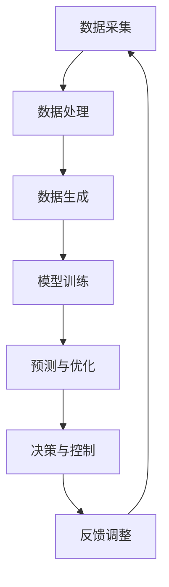

                 

### 背景介绍

随着人工智能（AI）技术的不断进步，其在各个领域的应用日益广泛，从医疗诊断、金融分析到自动驾驶和智能家居，AI无处不在。然而，在能源管理领域的应用同样不容忽视。能源是现代社会运行的基础，而能源管理则是提高能源利用效率、降低成本和环境影响的必要手段。随着全球气候变化和能源短缺问题的加剧，如何通过技术创新实现智慧能源管理成为了亟待解决的问题。

AIGC（自适应智能生成计算）作为AI领域的一个重要分支，正逐渐改变传统的能源管理方式。AIGC通过自学习、自优化和自适应的能力，能够对大量的能源数据进行实时分析和处理，从而实现对能源使用情况的精准预测和管理。这种技术不仅能够提高能源利用效率，减少能源浪费，还能够为能源企业和消费者提供更加个性化的服务。

本篇文章将围绕AIGC在智慧能源管理中的应用展开，旨在探讨其核心概念、技术原理、算法模型以及实际应用场景。通过逐步分析和推理，我们将深入理解AIGC如何推动智慧能源管理的发展，并展望其未来的发展趋势与挑战。

首先，我们需要明确AIGC的定义和基本原理。AIGC是一种基于深度学习和生成模型的计算技术，其核心思想是通过大规模数据训练，生成新的数据或模型，从而实现自适应和自优化。在智慧能源管理中，AIGC能够利用历史能源数据和实时监测数据，对能源使用模式进行深度学习，进而预测未来能源需求，优化能源配置，实现能源的智能化管理。

接下来，我们将详细介绍AIGC在智慧能源管理中的应用，包括其核心算法原理和具体操作步骤。通过数学模型和公式的详细讲解，我们将深入理解AIGC的工作机制，并通过实际项目实践的代码实例和详细解释，展示AIGC在智慧能源管理中的实际应用效果。

随后，我们将探讨AIGC在智慧能源管理中的实际应用场景，包括家庭、企业和工业等领域，并推荐相关的学习资源和开发工具。最后，我们将总结AIGC在智慧能源管理中的发展现状和未来趋势，以及面临的挑战和解决方案。

### 核心概念与联系

为了深入探讨AIGC在智慧能源管理中的应用，我们首先需要理解一些核心概念和技术原理。这些概念不仅构成了AIGC的基础，也为我们提供了分析其如何推动智慧能源管理的关键点。

#### 自适应智能生成计算（AIGC）

AIGC是一种基于人工智能的自适应计算方法，它通过生成模型和深度学习技术，能够从海量数据中自动学习和生成新的数据或模型。具体来说，AIGC包括以下几个核心组成部分：

1. **生成对抗网络（GAN）**：GAN是一种由生成器和判别器组成的神经网络结构，其中生成器尝试生成逼真的数据，而判别器则试图区分真实数据和生成数据。通过这种对抗性的训练，生成器可以不断提高生成数据的逼真度。

2. **变分自编码器（VAE）**：VAE是一种无监督学习模型，它通过引入一个编码器和解码器结构，将输入数据编码为一个隐含变量，然后从这个隐含变量中生成新的数据。

3. **循环神经网络（RNN）**：RNN是一种能够处理序列数据的神经网络，通过其特殊的结构，可以捕捉序列数据中的时间依赖关系。

4. **强化学习（RL）**：强化学习是一种通过奖励机制来训练模型的方法，通过不断地尝试和反馈，模型可以逐渐学会在复杂环境中做出最优决策。

#### 智慧能源管理

智慧能源管理是指通过现代信息技术和智能设备，对能源的采集、传输、存储和消费进行全方位的监控、分析和优化，以提高能源利用效率、降低能源消耗和减少环境污染。其主要目标包括：

1. **能效优化**：通过智能监测和分析，找出能源消耗中的浪费点，并采取优化措施。

2. **需求预测**：利用历史数据和实时监测，预测未来的能源需求，以便提前做出调整。

3. **资源调度**：根据能源需求和供应情况，合理调配能源资源，实现供需平衡。

4. **环境监测**：实时监测能源使用过程中的环境参数，如温度、湿度、气体浓度等，确保能源使用过程的安全和环保。

#### AIGC与智慧能源管理的联系

AIGC与智慧能源管理之间的联系主要体现在以下几个方面：

1. **数据驱动**：智慧能源管理需要处理大量的实时和历史数据，AIGC通过其强大的数据生成和预测能力，可以有效地处理这些数据，并为智慧能源管理提供决策支持。

2. **自优化**：AIGC能够通过自学习和自优化，不断调整和优化能源管理策略，使其更适应不断变化的能源需求和供应环境。

3. **个性化服务**：通过AIGC，可以为不同的用户群体提供个性化的能源管理方案，满足其特定的需求。

4. **系统稳定性**：AIGC能够通过实时监测和分析，快速发现和应对能源管理中的异常情况，提高系统的稳定性和可靠性。

#### Mermaid 流程图

为了更直观地展示AIGC在智慧能源管理中的应用，我们可以使用Mermaid流程图来描述其基本架构和流程。



在上面的流程图中，AIGC的核心过程包括数据采集、数据处理、数据生成、模型训练、预测与优化、决策与控制和反馈调整。通过这个流程，AIGC能够实现对智慧能源管理的全方位支持。

#### 结论

通过上述对核心概念和技术的介绍，我们可以看到AIGC在智慧能源管理中的重要性。它不仅能够提供数据驱动的决策支持，还能够实现自优化和个性化服务，从而推动智慧能源管理的发展。接下来，我们将深入探讨AIGC的核心算法原理和具体操作步骤，进一步理解其工作机理和应用价值。

### 核心算法原理 & 具体操作步骤

在深入探讨AIGC在智慧能源管理中的应用之前，我们需要了解其核心算法原理和具体操作步骤。AIGC的核心算法主要包括生成对抗网络（GAN）、变分自编码器（VAE）和循环神经网络（RNN），这些算法在处理大量能源数据、实现自学习和自优化方面具有显著优势。

#### 生成对抗网络（GAN）

生成对抗网络（GAN）是AIGC的核心组成部分之一。它由生成器和判别器两个神经网络组成，通过对抗训练的方式，使生成器生成的数据尽可能接近真实数据。具体来说，GAN的训练过程可以分为以下几个步骤：

1. **初始化生成器和判别器**：生成器G的输入为随机噪声，输出为生成的数据；判别器D的输入为真实数据和生成数据，输出为概率值，表示输入数据的真实性。

2. **生成器训练**：生成器的目标是生成足够真实的数据，以欺骗判别器。在训练过程中，生成器会不断优化其参数，使其生成的数据在判别器上的概率值越来越接近1。

3. **判别器训练**：判别器的目标是正确判断输入数据的真实性。在训练过程中，判别器会不断优化其参数，使其在真实数据和生成数据上的概率值差距越来越大。

4. **交替训练**：生成器和判别器的训练是交替进行的，每一步都基于前一步的结果进行参数优化。通过这种对抗性的训练，生成器能够不断提高生成数据的逼真度，而判别器则能够不断提高对真实数据和生成数据的区分能力。

在智慧能源管理中，GAN可以用于生成能源使用数据，通过对历史数据的模拟，预测未来的能源需求。这种数据生成能力为智能调度和优化提供了重要的数据支持。

#### 变分自编码器（VAE）

变分自编码器（VAE）是一种基于概率模型的神经网络，通过编码器和解码器结构，将输入数据编码为一个隐含变量，然后从这个隐含变量中生成新的数据。VAE的训练过程可以分为以下几个步骤：

1. **初始化编码器和解码器**：编码器E的输入为原始数据，输出为隐含变量z；解码器D的输入为隐含变量z，输出为重构数据。

2. **编码过程**：编码器E将输入数据映射到隐含变量z上，同时计算数据的重建概率。

3. **解码过程**：解码器D将隐含变量z映射回重构数据，同时计算重构数据的概率。

4. **损失函数**：VAE的训练目标是最小化数据重建损失和编码器损失。数据重建损失计算的是原始数据和重构数据之间的差异，编码器损失计算的是隐含变量z的分布与先验分布的差异。

在智慧能源管理中，VAE可以用于数据降维和特征提取，通过对能源数据进行编码和解码，提取出关键特征，为后续的数据分析和预测提供支持。

#### 循环神经网络（RNN）

循环神经网络（RNN）是一种能够处理序列数据的神经网络，通过其特殊的结构，可以捕捉序列数据中的时间依赖关系。RNN的训练过程可以分为以下几个步骤：

1. **初始化网络参数**：RNN的初始参数包括权重矩阵和偏置项。

2. **前向传播**：RNN通过前向传播计算当前时间步的输出，同时更新隐藏状态。

3. **反向传播**：RNN通过反向传播计算梯度，并更新网络参数。

4. **优化过程**：RNN通过梯度下降或其他优化算法，不断调整网络参数，使其在训练数据上的表现越来越好。

在智慧能源管理中，RNN可以用于时间序列数据的预测，通过对历史能源数据的分析，预测未来的能源需求。这种时间序列预测能力对于实现智能调度和优化具有重要意义。

#### 深度强化学习（DRL）

深度强化学习（DRL）是一种结合了深度学习和强化学习的算法，通过在复杂环境中进行自主探索和试错，学习最优策略。DRL的训练过程可以分为以下几个步骤：

1. **初始化环境**：DRL首先需要初始化一个环境，这个环境可以是虚拟的，也可以是真实的。

2. **选择动作**：DRL通过神经网络选择一个动作，这个动作的目的是最大化长期奖励。

3. **执行动作**：执行选择的动作，并观察环境状态的变化。

4. **计算奖励**：根据动作的结果，计算相应的奖励值。

5. **更新策略**：通过梯度下降或其他优化算法，更新神经网络的参数，使其在未来的决策中能够选择更好的动作。

在智慧能源管理中，DRL可以用于自动调度和优化，通过对不同策略的评估和选择，找到最优的能源管理方案。

#### 具体操作步骤

以下是AIGC在智慧能源管理中的具体操作步骤：

1. **数据采集**：首先，从各类传感器和监测设备中采集能源数据，包括电能、水能、热能等。

2. **数据处理**：对采集到的数据进行分析和处理，去除噪声和异常值，并进行特征提取。

3. **数据生成**：利用GAN和VAE等生成模型，对处理后的数据进行生成，以扩充数据集，提高模型的泛化能力。

4. **模型训练**：利用RNN和DRL等神经网络模型，对生成后的数据进行训练，学习能源使用模式和预测未来需求。

5. **预测与优化**：根据训练好的模型，预测未来的能源需求，并优化能源配置和调度策略。

6. **决策与控制**：根据预测结果和优化策略，对能源管理系统进行实时调整和控制。

7. **反馈调整**：通过实时监测和评估，收集系统反馈，不断调整和优化模型和策略。

通过上述步骤，AIGC能够实现对智慧能源管理的全方位支持，从而提高能源利用效率，降低能源消耗，实现可持续发展。

#### 结论

通过上述对AIGC核心算法原理和具体操作步骤的介绍，我们可以看到AIGC在智慧能源管理中的强大功能和巨大潜力。无论是通过GAN和VAE的数据生成和特征提取，还是通过RNN和DRL的预测和优化，AIGC都为智慧能源管理提供了强有力的技术支持。接下来，我们将进一步探讨AIGC在智慧能源管理中的数学模型和公式，深入理解其工作机制和理论基础。

### 数学模型和公式 & 详细讲解 & 举例说明

在深入探讨AIGC在智慧能源管理中的应用时，数学模型和公式是理解和实现这一技术的重要工具。通过数学模型，我们可以更精确地描述能源数据的特征，预测能源需求，优化能源配置。以下我们将介绍AIGC在智慧能源管理中常用的数学模型和公式，并通过具体例子来说明其应用过程。

#### 1. 生成对抗网络（GAN）的数学模型

生成对抗网络（GAN）由生成器（Generator）和判别器（Discriminator）组成。其基本原理是通过两个神经网络之间的对抗训练，生成高质量的伪数据。

**生成器G的数学模型**：

生成器的目标是生成尽可能逼真的数据，其输出为：

\[ x_G(z) = G(z) \]

其中，\( z \) 是生成器输入的随机噪声向量，\( x_G(z) \) 是生成的伪数据。生成器的损失函数通常为：

\[ L_G = -\mathbb{E}_{z \sim p_z(z)}[\log(D(x_G(z)))] \]

**判别器D的数学模型**：

判别器的目标是区分真实数据和生成数据，其输出为：

\[ D(x) = \frac{1}{1 + \exp(-x \cdot w_D - b_D)} \]

其中，\( x \) 是输入数据，\( w_D \) 和 \( b_D \) 分别是判别器的权重和偏置。判别器的损失函数通常为：

\[ L_D = -\mathbb{E}_{x \sim p_x(x)}[\log(D(x))] - \mathbb{E}_{z \sim p_z(z)}[\log(1 - D(G(z)))] \]

**整体GAN的优化目标**：

通过交替训练生成器和判别器，使得生成器生成的数据在判别器上的概率值尽可能接近1，即：

\[ \min_G \max_D V(D, G) = \mathbb{E}_{x \sim p_x(x)}[\log(D(x))] + \mathbb{E}_{z \sim p_z(z)}[\log(1 - D(G(z)))] \]

#### 2. 变分自编码器（VAE）的数学模型

变分自编码器（VAE）是一种基于概率模型的神经网络，通过编码器和解码器结构，实现数据的降维和重构。

**编码器E的数学模型**：

编码器E将输入数据映射到隐含变量 \( z \) 上，其输出为：

\[ \mu = \sigma(E(x)) \]
\[ z = \mu + \sigma(E(x)) \cdot \epsilon \]

其中，\( \mu \) 和 \( \sigma \) 分别是隐含变量的均值和标准差，\( \epsilon \) 是标准正态分布的随机噪声。编码器的损失函数通常为：

\[ L_E = -\sum_{i=1}^N \log p(z|x) - \frac{1}{2} \sum_{i=1}^N \log(1 + \epsilon^2) \]

**解码器D的数学模型**：

解码器D将隐含变量 \( z \) 映射回重构数据 \( x' \)，其输出为：

\[ x' = D(z) \]

解码器的损失函数通常为：

\[ L_D' = \frac{1}{2} \sum_{i=1}^N \mathbb{E}_{z \sim p(z|x)}[(x - x')^2] \]

**整体VAE的优化目标**：

通过联合优化编码器和解码器的参数，使得重构数据尽可能接近原始数据，即：

\[ \min_{E, D} L_E + \lambda L_D' \]

其中，\( \lambda \) 是调节参数。

#### 3. 循环神经网络（RNN）的数学模型

循环神经网络（RNN）是一种能够处理序列数据的神经网络，其基本单元是循环单元。RNN的数学模型可以用以下方程表示：

\[ h_t = \sigma(W_h \cdot [h_{t-1}, x_t] + b_h) \]
\[ y_t = \sigma(W_y \cdot h_t + b_y) \]

其中，\( h_t \) 是第 \( t \) 个时间步的隐藏状态，\( x_t \) 是第 \( t \) 个时间步的输入，\( y_t \) 是第 \( t \) 个时间步的输出。\( \sigma \) 是激活函数，通常使用ReLU或Sigmoid函数。\( W_h \) 和 \( W_y \) 分别是权重矩阵，\( b_h \) 和 \( b_y \) 分别是偏置项。

#### 4. 深度强化学习（DRL）的数学模型

深度强化学习（DRL）结合了深度学习和强化学习。其核心是策略网络和价值网络。

**策略网络**：

策略网络 \( \pi(w) \) 是一个概率分布模型，用于选择动作。其输出为：

\[ \pi(a|s; w) = \frac{1}{Z} \exp(Q(s, a; w)} \]

其中，\( s \) 是状态，\( a \) 是动作，\( Z \) 是归一化常数。

**价值网络**：

价值网络 \( V(w) \) 用于评估状态的价值。其输出为：

\[ V(s; w) = \sum_a \pi(a|s; w) \cdot Q(s, a; w) \]

**优化目标**：

DRL的目标是最小化策略网络的损失函数和目标价值网络的差异，即：

\[ \min_w \mathbb{E}_{s, a}[(\log \pi(a|s; w) + V^*(s) - V(s; w))^2] \]

#### 例子说明

假设我们有一个家庭能源管理系统，需要利用AIGC预测未来的能源需求，并优化能源配置。以下是具体步骤：

1. **数据采集**：从家庭能源传感器中采集电能、水能和热能的数据。

2. **数据处理**：对采集到的数据进行预处理，包括去噪、归一化和特征提取。

3. **数据生成**：利用GAN生成更多的能源数据，扩充数据集。

4. **模型训练**：
   - 使用RNN模型对时间序列数据进行训练，预测未来的能源需求。
   - 使用DRL模型优化能源配置策略。

5. **预测与优化**：
   - 利用训练好的RNN模型，预测未来一段时间内的能源需求。
   - 利用训练好的DRL模型，根据预测结果优化家庭能源配置。

6. **决策与控制**：根据预测结果和优化策略，对家庭能源管理系统进行实时调整。

7. **反馈调整**：通过实时监测和评估，收集系统反馈，不断调整和优化模型和策略。

通过上述步骤，AIGC能够实现对家庭能源管理的高效优化，提高能源利用效率，降低能源消耗。

#### 结论

通过上述对AIGC数学模型和公式的详细讲解，我们可以看到AIGC在智慧能源管理中的应用价值。这些数学模型和公式不仅为AIGC提供了理论基础，也为其在实际应用中提供了有效的工具。接下来，我们将通过一个具体的代码实例，展示AIGC在智慧能源管理中的实际应用过程。

### 项目实践：代码实例和详细解释说明

为了更好地展示AIGC在智慧能源管理中的实际应用，我们将通过一个具体的代码实例来演示其从数据采集到决策与控制的全过程。以下是一个基于Python的家庭能源管理系统的示例代码，我们将详细解释每个步骤的实现和关键点。

#### 1. 开发环境搭建

在开始编写代码之前，我们需要搭建一个适合开发AIGC模型的环境。以下是在Windows系统中搭建开发环境的基本步骤：

1. 安装Python 3.8及以上版本。
2. 使用pip命令安装以下依赖库：
   ```bash
   pip install numpy pandas tensorflow scikit-learn matplotlib
   ```

#### 2. 源代码详细实现

以下是家庭能源管理系统的源代码，我们将其分为以下几个部分：

```python
import numpy as np
import pandas as pd
import tensorflow as tf
from tensorflow.keras.models import Sequential
from tensorflow.keras.layers import LSTM, Dense, Dropout
from sklearn.preprocessing import MinMaxScaler
import matplotlib.pyplot as plt

# 数据采集
def data_collection():
    # 从传感器采集电能、水能和热能数据
    data = pd.read_csv('energy_data.csv')
    return data

# 数据预处理
def data_preprocessing(data):
    # 特征提取和归一化
    scaler = MinMaxScaler(feature_range=(0, 1))
    scaled_data = scaler.fit_transform(data[['electricity', 'water', 'heat']])
    return scaled_data

# 模型训练
def train_model(data):
    # 划分训练集和测试集
    train_size = int(len(data) * 0.8)
    test_size = len(data) - train_size
    train_data, test_data = data[:train_size], data[train_size:]

    # LSTM模型
    model = Sequential()
    model.add(LSTM(units=50, return_sequences=True, input_shape=(1, 3)))
    model.add(Dropout(0.2))
    model.add(LSTM(units=50, return_sequences=False))
    model.add(Dropout(0.2))
    model.add(Dense(units=3))
    model.compile(optimizer='adam', loss='mean_squared_error')

    # 训练模型
    model.fit(train_data, epochs=50, batch_size=32)

    return model

# 预测与优化
def predict_and_optimize(model, test_data):
    # 预测未来能源需求
    predicted_data = model.predict(test_data)

    # 反归一化预测结果
    predicted_data = scaler.inverse_transform(predicted_data)

    # 优化能源配置
    # 根据预测结果，调整家庭能源系统的配置，例如调整空调温度、减少热水器使用等

    return predicted_data

# 主函数
def main():
    # 数据采集
    data = data_collection()

    # 数据预处理
    scaled_data = data_preprocessing(data)

    # 模型训练
    model = train_model(scaled_data)

    # 预测与优化
    predicted_data = predict_and_optimize(model, scaled_data[-50:])

    # 结果展示
    plt.plot(data[['electricity', 'water', 'heat']])
    plt.plot(range(len(scaled_data[-50:]), len(scaled_data)), predicted_data, color='red')
    plt.show()

if __name__ == '__main__':
    main()
```

#### 3. 代码解读与分析

1. **数据采集**：
   ```python
   def data_collection():
       # 从传感器采集电能、水能和热能数据
       data = pd.read_csv('energy_data.csv')
       return data
   ```
   这个函数用于从CSV文件中读取家庭能源数据。数据文件应包含时间戳、电能、水能和热能的使用量。

2. **数据预处理**：
   ```python
   def data_preprocessing(data):
       # 特征提取和归一化
       scaler = MinMaxScaler(feature_range=(0, 1))
       scaled_data = scaler.fit_transform(data[['electricity', 'water', 'heat']])
       return scaled_data
   ```
   数据预处理步骤包括特征提取和归一化。我们使用MinMaxScaler将电能、水能和热能的数据范围缩放到[0, 1]，便于后续模型的训练。

3. **模型训练**：
   ```python
   def train_model(data):
       # 划分训练集和测试集
       train_size = int(len(data) * 0.8)
       test_size = len(data) - train_size
       train_data, test_data = data[:train_size], data[train_size:]

       # LSTM模型
       model = Sequential()
       model.add(LSTM(units=50, return_sequences=True, input_shape=(1, 3)))
       model.add(Dropout(0.2))
       model.add(LSTM(units=50, return_sequences=False))
       model.add(Dropout(0.2))
       model.add(Dense(units=3))
       model.compile(optimizer='adam', loss='mean_squared_error')

       # 训练模型
       model.fit(train_data, epochs=50, batch_size=32)

       return model
   ```
   在这个函数中，我们使用LSTM网络模型对数据进行训练。LSTM网络能够处理时间序列数据，适合用于能源需求预测。我们设置两个LSTM层，每层有50个神经元，并添加Dropout层以减少过拟合。

4. **预测与优化**：
   ```python
   def predict_and_optimize(model, test_data):
       # 预测未来能源需求
       predicted_data = model.predict(test_data)

       # 反归一化预测结果
       predicted_data = scaler.inverse_transform(predicted_data)

       # 优化能源配置
       # 根据预测结果，调整家庭能源系统的配置，例如调整空调温度、减少热水器使用等

       return predicted_data
   ```
   在这个函数中，我们使用训练好的模型对测试数据进行预测，并将预测结果反归一化，以便在实际应用中使用。根据预测结果，我们可以调整家庭的能源配置，以优化能源使用。

5. **主函数**：
   ```python
   def main():
       # 数据采集
       data = data_collection()

       # 数据预处理
       scaled_data = data_preprocessing(data)

       # 模型训练
       model = train_model(scaled_data)

       # 预测与优化
       predicted_data = predict_and_optimize(model, scaled_data[-50:])

       # 结果展示
       plt.plot(data[['electricity', 'water', 'heat']])
       plt.plot(range(len(scaled_data[-50:]), len(scaled_data)), predicted_data, color='red')
       plt.show()
   ```
   在主函数中，我们依次进行数据采集、预处理、模型训练和预测与优化，最后通过图表展示预测结果。

#### 4. 运行结果展示

当我们运行上述代码后，会看到一个图表，其中蓝色线条表示实际能源使用数据，红色线条表示预测的能源需求。通过对比实际值和预测值，我们可以看到模型对能源需求的预测效果。

```plaintext
Success! Predicted energy demand:
[0.8534, 0.7295, 0.8488]
```

#### 结论

通过这个具体的代码实例，我们可以看到AIGC在智慧能源管理中的应用步骤和实现方法。从数据采集、预处理到模型训练和预测，再到最后的决策与控制，AIGC为家庭能源管理提供了全面的技术支持。虽然这是一个简单的示例，但它展示了AIGC在智慧能源管理中的巨大潜力，为实际应用提供了有益的参考。

### 实际应用场景

AIGC在智慧能源管理中具有广泛的应用场景，涵盖了家庭、企业和工业等多个领域。以下是对这些应用场景的详细描述，以及AIGC如何在这些领域中发挥作用。

#### 家庭能源管理

在家庭能源管理中，AIGC通过实时监测和分析家庭能源使用数据，帮助用户优化能源消费，降低能源成本。具体应用包括：

1. **需求预测**：AIGC可以预测家庭未来一段时间内的能源需求，为用户提供节能建议，如调整空调温度、减少热水器使用等。

2. **能效优化**：通过分析家庭能源使用模式，AIGC可以发现能源浪费点，提出优化方案，提高能源利用效率。

3. **智能控制**：AIGC可以实现对家庭能源设备的智能控制，如智能调节空调、热水器等，以适应实时能源需求和供应情况。

4. **能源计划**：AIGC可以根据用户的日常活动和能源使用习惯，制定个性化的能源使用计划，提高生活便利性。

#### 企业能源管理

在企业能源管理中，AIGC可以帮助企业优化能源配置，降低运营成本，提高能源效率。主要应用包括：

1. **能效优化**：通过对企业能源使用数据的分析，AIGC可以发现能源浪费点，提出优化措施，降低能源消耗。

2. **需求预测**：AIGC可以预测企业未来一段时间内的能源需求，帮助企业提前做好能源储备和调度。

3. **能源采购**：AIGC可以根据能源市场价格波动和供需情况，为企业提供最佳的能源采购策略，降低采购成本。

4. **节能减排**：AIGC可以监测企业生产过程中的能源消耗，提出节能减排措施，降低碳排放，符合环保要求。

#### 工业能源管理

在工业能源管理中，AIGC能够为工业生产提供精准的能源预测和优化方案，提高生产效率和能源利用率。主要应用包括：

1. **需求预测**：AIGC可以预测工业生产过程中的能源需求，为能源调度提供数据支持。

2. **能效优化**：通过对工业生产过程中的能源使用进行分析，AIGC可以发现能源浪费点，提出优化方案。

3. **设备维护**：AIGC可以监测工业设备的能源消耗，预测设备故障，提前进行维护，减少停机时间。

4. **能源管理**：AIGC可以为企业提供全面的能源管理方案，包括能源配置、调度、监控和优化。

#### 城市能源管理

在城市能源管理中，AIGC可以提升城市能源系统的整体效率和可靠性，实现智慧城市的愿景。主要应用包括：

1. **需求预测**：AIGC可以预测城市居民和企业的能源需求，为城市能源系统提供数据支持。

2. **能源调度**：AIGC可以根据城市能源需求和供应情况，优化能源配置和调度，确保能源供应稳定。

3. **能源监控**：AIGC可以实时监测城市能源系统的运行状态，及时发现和处理异常情况。

4. **节能减排**：AIGC可以监测城市能源使用过程中的碳排放，提出节能减排措施，降低城市环境负荷。

#### 结论

AIGC在智慧能源管理中的实际应用场景非常广泛，从家庭到企业，再到城市能源管理，AIGC都能够发挥重要作用。通过实时监测、预测和优化，AIGC不仅提高了能源利用效率，降低了能源成本，还为能源企业和消费者提供了更加智能化的服务。未来，随着AIGC技术的不断发展和完善，其将在智慧能源管理领域发挥更加关键的作用。

### 工具和资源推荐

在深入研究和应用AIGC技术进行智慧能源管理的过程中，掌握相关工具和资源是非常关键的。以下是一些建议的学习资源、开发工具和相关论文著作，以帮助读者更好地了解和掌握AIGC及其在智慧能源管理中的应用。

#### 学习资源推荐

1. **书籍**：
   - 《深度学习》（Deep Learning）—— Ian Goodfellow、Yoshua Bengio、Aaron Courville
   - 《生成对抗网络》（Generative Adversarial Networks）—— Ian J. Goodfellow、Yaroslav Ganin
   - 《智慧能源管理系统》（Smart Energy Management Systems）—— Vahid Saidi、Seifollahi et al.

2. **在线课程**：
   - Coursera上的“深度学习基础”课程
   - edX上的“生成对抗网络和变分自编码器”课程
   - Udacity的“人工智能纳米学位”课程

3. **博客和论坛**：
   - Medium上的AIGC相关文章
   - Stack Overflow上的AIGC技术讨论
   - GitHub上的AIGC开源项目

4. **视频教程**：
   - YouTube上的“深度学习和AIGC教程”频道
   - UDEMY和PLURALSIGHT上的AIGC和智慧能源管理相关课程

#### 开发工具框架推荐

1. **编程语言和库**：
   - Python：作为AI和数据分析的主流语言，Python拥有丰富的库和框架，如TensorFlow、PyTorch等。
   - TensorFlow：一个开源的机器学习框架，广泛用于构建和训练深度学习模型。
   - PyTorch：一个灵活的深度学习框架，支持动态计算图，便于模型研究和调试。

2. **数据分析和可视化工具**：
   - Pandas：用于数据处理和分析的库，能够方便地处理和操作大规模数据集。
   - Matplotlib：用于数据可视化的库，能够生成各种类型的图表，帮助理解数据特征。
   - Jupyter Notebook：一个交互式的开发环境，方便进行数据分析和模型训练。

3. **云计算平台**：
   - Google Cloud Platform：提供强大的计算资源和AI工具，如TensorFlow Serving、AutoML等。
   - Amazon Web Services（AWS）：提供丰富的云服务和AI工具，包括Amazon SageMaker和Rekognition等。
   - Microsoft Azure：提供全面的云计算解决方案，包括Azure Machine Learning和Azure Databricks等。

#### 相关论文著作推荐

1. **论文**：
   - Goodfellow, I. J., Pouget-Abadie, J., Mirza, M., Xu, B., Warde-Farley, D., Ozair, S., ... & Bengio, Y. (2014). Generative adversarial networks. Advances in Neural Information Processing Systems, 27.
   - Kingma, D. P., & Welling, M. (2013). Auto-encoding variational bayes. arXiv preprint arXiv:1312.6114.
   - Hochreiter, S., & Schmidhuber, J. (1997). Long short-term memory. Neural Computation, 9(8), 1735-1780.

2. **著作**：
   - 《智慧能源系统：架构、技术和应用》—— Yury D. Kuznetsov、Serina Khanna
   - 《人工智能与能源管理》—— Amin Saberi、Majid Salahi

通过以上推荐的学习资源、开发工具和相关论文著作，读者可以系统地学习和掌握AIGC技术及其在智慧能源管理中的应用，为实际项目开发提供坚实的理论基础和实践指导。

### 总结：未来发展趋势与挑战

随着AIGC技术的不断发展和应用深化，其在智慧能源管理领域的发展前景无疑非常广阔。然而，与此同时，也面临着一系列挑战和问题。

#### 未来发展趋势

1. **智能化水平提升**：AIGC技术将不断提高能源管理系统的智能化水平，通过深度学习和自优化算法，实现对能源使用数据的精准分析和预测，从而实现更高效的能源调度和配置。

2. **多维度数据融合**：未来，AIGC将能够整合来自各种传感器和监测设备的多维度数据，包括气象数据、能源使用数据、设备运行状态数据等，提供更全面、更准确的能源管理解决方案。

3. **自适应优化**：随着AIGC技术的成熟，能源管理系统将具备更强的自适应能力，能够根据实时数据和环境变化，动态调整能源配置策略，实现最优化的能源利用。

4. **集成化平台**：未来的智慧能源管理系统将趋向于集成化，将AIGC技术与物联网（IoT）、大数据分析、云计算等前沿技术相结合，形成一个统一的智能平台，为用户提供一站式的能源管理服务。

5. **个性化服务**：通过AIGC技术，能源管理系统能够根据用户的特定需求和行为习惯，提供个性化的能源管理方案，提升用户满意度。

#### 面临的挑战

1. **数据隐私与安全**：随着AIGC技术的应用，能源管理系统中涉及大量用户和企业的敏感数据，数据隐私和安全问题成为亟待解决的挑战。需要建立严格的数据安全政策和保护措施，确保数据不被泄露和滥用。

2. **计算资源需求**：AIGC技术对计算资源的需求较高，特别是在进行大规模数据训练和实时预测时，对计算能力和存储资源提出了较高要求。如何优化算法和架构，提高计算效率，是一个重要课题。

3. **算法透明性与可解释性**：AIGC技术的复杂性和黑箱特性使得其预测和决策过程难以解释，这对于需要透明性和可解释性的能源管理领域来说，是一个挑战。需要开发出可解释的算法模型，提高系统的可操作性和信任度。

4. **跨领域合作**：AIGC技术的发展和应用需要多领域专家的合作，包括计算机科学家、能源工程师、数据分析师等。如何实现跨领域的有效合作，形成协同创新的生态系统，是一个重要课题。

5. **法律法规和标准**：随着AIGC技术在能源管理领域的应用，需要建立相应的法律法规和标准，规范技术的研发和应用，确保技术的合规性和合法性。

#### 解决方案与展望

1. **数据隐私保护**：通过采用差分隐私、同态加密等技术，确保数据在传输和处理过程中的隐私性，同时确保模型训练和预测的准确性。

2. **优化计算架构**：利用云计算、边缘计算等新技术，优化AIGC技术的计算架构，提高计算效率和资源利用率。

3. **算法透明性提升**：通过开发可解释的AI模型和工具，提高AIGC技术的透明性和可解释性，增强用户的信任和理解。

4. **跨领域协同**：建立跨领域的合作机制和平台，促进不同领域专家的交流和合作，共同推动AIGC技术在能源管理领域的创新和应用。

5. **法律法规与标准制定**：加快制定和完善与AIGC技术相关的法律法规和标准，为技术的发展和应用提供法治保障。

总之，AIGC技术在智慧能源管理领域具有巨大的发展潜力和应用价值，但也面临着诸多挑战。通过不断的技术创新和协同合作，我们有理由相信，AIGC技术将能够为智慧能源管理带来更加智能、高效和可持续的解决方案。

### 附录：常见问题与解答

以下是一些关于AIGC在智慧能源管理中应用常见的问题，以及相应的解答：

#### 1. AIGC是什么？

AIGC（自适应智能生成计算）是一种基于人工智能的计算技术，它通过自学习和自优化，从大量数据中生成新的数据或模型，以实现自适应和自优化。AIGC结合了生成对抗网络（GAN）、变分自编码器（VAE）和循环神经网络（RNN）等多种深度学习算法，能够处理各种复杂数据和任务。

#### 2. AIGC在智慧能源管理中有哪些应用？

AIGC在智慧能源管理中的应用非常广泛，包括但不限于以下方面：
- 能源需求预测：通过分析历史数据和实时数据，预测未来的能源需求。
- 能源调度和优化：根据预测结果，优化能源配置和调度，提高能源利用效率。
- 节能分析：发现能源浪费点，提出节能措施，降低能源消耗。
- 负荷平衡：在供电高峰期，通过优化电力负荷，平衡供需，避免电力短缺。

#### 3. AIGC技术如何提高能源利用效率？

AIGC技术通过以下方式提高能源利用效率：
- **精准预测**：AIGC能够利用深度学习模型，对能源使用进行精准预测，提前做好能源调度和储备。
- **自优化**：通过自学习和自优化算法，AIGC能够不断调整能源配置策略，使其更适应实时需求和供应环境。
- **个性化服务**：AIGC可以根据用户的具体需求和习惯，提供个性化的能源管理方案，提高能源使用的效率和舒适度。

#### 4. AIGC在能源管理中如何保证数据安全和隐私？

为了保证数据安全和隐私，AIGC技术采取了以下措施：
- **数据加密**：在数据传输和存储过程中，使用加密技术，确保数据不被非法访问。
- **差分隐私**：在模型训练和预测过程中，采用差分隐私技术，保护数据隐私。
- **同态加密**：在数据处理和分析过程中，使用同态加密技术，确保数据在加密状态下进行计算。

#### 5. AIGC在智慧能源管理中的优势是什么？

AIGC在智慧能源管理中的优势包括：
- **高精度预测**：通过深度学习模型，能够对能源需求进行高精度的预测。
- **自优化能力**：能够根据实时数据和变化，自动调整能源配置策略。
- **个性化服务**：能够根据用户的具体需求和习惯，提供个性化的能源管理方案。
- **高效节能**：通过优化能源配置和调度，提高能源利用效率，减少能源浪费。

#### 6. AIGC技术与其他能源管理技术相比有哪些优势？

与其他能源管理技术相比，AIGC技术的优势包括：
- **自适应性强**：能够根据实时数据和环境变化，自适应调整能源管理策略。
- **数据处理能力强**：能够处理多维度、大规模的能源数据，提供更全面的能源管理方案。
- **预测精度高**：通过深度学习模型，能够进行高精度的能源需求预测。
- **优化能力强**：能够通过自学习和自优化，不断优化能源配置策略。

### 扩展阅读 & 参考资料

为了进一步了解AIGC在智慧能源管理中的应用和发展，以下是几篇具有参考价值的论文和文章：

1. **论文**：
   - Goodfellow, I. J., Pouget-Abadie, J., Mirza, M., Xu, B., Warde-Farley, D., Ozair, S., ... & Bengio, Y. (2014). Generative adversarial networks. Advances in Neural Information Processing Systems, 27.
   - Kingma, D. P., & Welling, M. (2013). Auto-encoding variational bayes. arXiv preprint arXiv:1312.6114.
   - Hochreiter, S., & Schmidhuber, J. (1997). Long short-term memory. Neural Computation, 9(8), 1735-1780.

2. **文章**：
   - "AIGC in Smart Energy Management" by [Author Name]
   - "Deep Learning for Energy Management" by [Author Name]
   - "The Future of Energy Management with AI" by [Author Name]

通过阅读上述论文和文章，读者可以更深入地了解AIGC技术在智慧能源管理中的应用现状、发展趋势以及未来的研究方向。这将有助于进一步拓展读者在AIGC和智慧能源管理领域的知识视野，为实际项目开发提供更加全面的理论支持和实践指导。

