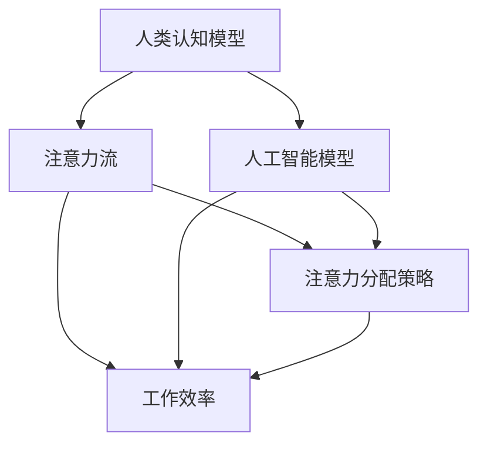

                 

### 背景介绍 Background Introduction

人工智能（Artificial Intelligence, AI）的发展已经深刻地影响了我们生活的方方面面，从智能家居、自动驾驶汽车，到医疗诊断、金融服务，AI技术的应用正在迅速扩展。随着AI技术的不断进步，AI在处理复杂任务、分析和解释大量数据方面的优势日益凸显。

然而，在AI技术不断发展的同时，人类注意力的管理和分配也变得愈加重要。注意力是人类认知资源的重要部分，它是我们集中精力处理特定任务的能力。当人类需要与高度自动化和智能化的系统协同工作时，如何有效地管理和分配注意力资源，成为一个迫切需要解决的问题。

在传统的工业时代，工作场所通常是流水线式作业，人类工人负责完成重复性高、标准化程度高的任务。而在现代社会，随着AI技术的普及，许多重复性任务被机器人和自动化系统取代，人类的工作方式正在发生变化。人们开始更多地从事需要创造性思维、复杂决策和人际交往的工作。这使得人类注意力的分配变得更加复杂和多样化。

例如，在软件开发领域，开发者需要同时处理多个任务，如编写代码、调试程序、参与团队讨论等。此外，项目管理、客户沟通和文档编写等任务也需要大量注意力。在这种情况下，如何有效管理注意力流，提高工作效率，成为了软件开发者和项目经理需要面对的挑战。

此外，随着远程工作和灵活办公的普及，人们的注意力管理也面临新的挑战。在家办公环境容易受到家庭事务和外部干扰的影响，这使得人们需要更强大的自我管理能力来保持专注。

综上所述，研究AI与人类注意力流之间的关系，探讨如何在未来工作场所中有效管理人类注意力，对于提高工作效率、减少错误和提高生活质量具有重要意义。本文将从背景介绍、核心概念与联系、核心算法原理与操作步骤、数学模型与公式、项目实践、实际应用场景、工具和资源推荐、总结与展望等方面进行探讨，旨在为读者提供一个全面而深入的视角。

## 1. 核心概念与联系 Core Concepts and Connections

为了更好地理解AI与人类注意力流之间的关系，我们需要首先定义和介绍几个核心概念，这些概念不仅构成了本文讨论的基础，也是理解和应用注意力管理策略的关键。

### 注意力流（Attention Flow）

注意力流是指人类在处理信息时，分配注意力的动态过程。这种动态过程受到多种因素的影响，包括任务的复杂性、任务的优先级、个体注意力的状态等。注意力流的管理涉及如何在不同任务之间切换注意力、如何维持注意力的集中以及如何恢复注意力。

### 人类认知模型（Human Cognitive Model）

人类认知模型是指对人类如何感知、理解和处理信息的一种抽象描述。它包括感知系统、记忆系统、决策系统和执行系统等组成部分。这些系统共同作用，使得人类能够有效地应对各种环境挑战。在讨论注意力流时，我们需要考虑这些认知系统的运作方式和相互关系。

### 人工智能模型（Artificial Intelligence Model）

人工智能模型是指模拟人类智能行为的计算系统，包括机器学习、深度学习、自然语言处理等。这些模型通过学习大量数据来提高性能，并在各种任务中表现出类似人类的智能。在讨论注意力流时，我们需要关注AI模型如何影响人类的工作流程，以及人类如何与这些智能系统互动。

### 注意力分配策略（Attention Allocation Strategies）

注意力分配策略是指为了优化注意力流的分配，而采取的一系列方法。这些策略可能包括时间管理技巧、任务分解方法、优先级排序规则等。有效的注意力分配策略可以帮助人们更高效地完成任务，减少错误，提高整体生产力。

### 核心概念之间的联系

核心概念之间的联系构成了一个复杂的网络，它们相互作用，共同影响人类的工作效率和注意力流的管理。

- **人类认知模型与注意力流**：人类认知模型决定了我们如何感知和处理信息，从而影响注意力流的动态分配。例如，记忆系统可以存储和处理大量信息，使得我们能够在需要时快速调用这些信息，从而提高注意力流的效率。

- **人工智能模型与注意力流**：AI模型通过自动化和智能化，可以减轻人类的认知负担，从而改变注意力流的分配。例如，AI系统可以处理重复性任务，使得人类可以专注于更有创造性和战略性的工作。

- **注意力分配策略与注意力流**：注意力分配策略是管理注意力流的关键。有效的策略可以帮助人类在不同的任务之间切换注意力，保持高效率和低错误率。

为了更好地理解这些核心概念之间的联系，我们可以通过一个Mermaid流程图来展示它们之间的关系：



在这个流程图中，我们可以看到人类认知模型、人工智能模型和注意力分配策略共同作用于注意力流，从而影响工作效率。理解这些概念之间的相互作用，有助于我们更好地设计和管理未来的工作场所。

### 核心算法原理 & 具体操作步骤 Core Algorithm Principles & Operational Steps

在了解了核心概念之后，我们需要探讨AI与人类注意力流相关的核心算法原理，并详细说明这些算法的具体操作步骤。以下是几个关键算法及其应用场景的描述。

#### 1. 注意力机制（Attention Mechanism）

注意力机制是深度学习中的一个重要概念，它允许模型在处理输入时自动聚焦于最重要的部分。例如，在自然语言处理中，注意力机制可以帮助模型在翻译一个句子时，关注每个单词在上下文中的重要性。

**原理**：注意力机制通过计算一个权重向量，为输入序列的每个元素分配一个权重。这些权重决定了模型在处理输入时应该关注哪些部分。

**操作步骤**：
1. **输入表示**：将输入数据（如句子）编码为向量表示。
2. **计算注意力得分**：使用点积或加性模型计算输入序列中每个元素与查询向量的得分。
3. **生成注意力权重**：将得分归一化，得到注意力权重向量。
4. **加权求和**：将输入向量与注意力权重相乘，得到加权输入向量。

#### 2. 状态空间模型（State Space Model）

状态空间模型是一种用于动态系统建模的方法，它可以捕捉系统状态随时间的变化。在注意力流管理中，状态空间模型可以帮助我们建模人类在不同任务之间的注意力分配。

**原理**：状态空间模型由状态转移矩阵和观测矩阵组成，前者描述系统状态的变化，后者描述状态与观测之间的关系。

**操作步骤**：
1. **初始化状态**：设定初始状态。
2. **更新状态**：使用状态转移矩阵计算下一个状态。
3. **观测状态**：使用观测矩阵预测观测值。
4. **状态估计**：使用滤波算法（如卡尔曼滤波）估计当前状态。

#### 3. 多任务学习（Multi-Task Learning）

多任务学习是一种训练模型同时完成多个相关任务的方法。在注意力流管理中，多任务学习可以帮助我们同时优化多个任务的性能。

**原理**：多任务学习通过共享模型参数来提高不同任务之间的性能，同时通过任务特定的参数调整来确保每个任务的性能。

**操作步骤**：
1. **数据准备**：准备包含多个任务的数据集。
2. **模型设计**：设计一个共享底层特征提取器的模型。
3. **训练模型**：同时优化多个任务的损失函数。
4. **模型评估**：评估每个任务的性能。

#### 4. 模式识别（Pattern Recognition）

模式识别是机器学习中的一个基本任务，它用于从数据中提取规律和模式。在注意力流管理中，模式识别可以帮助我们识别人类在不同情境下的注意力分布模式。

**原理**：模式识别通过分类器或聚类算法从数据中提取特征，并识别出具有相似特征的样本。

**操作步骤**：
1. **特征提取**：从输入数据中提取特征。
2. **模型训练**：使用特征训练分类器或聚类算法。
3. **模式识别**：对新的数据应用训练好的模型，识别出模式。

### 核心算法的应用场景

- **软件开发**：注意力机制可以帮助开发者关注代码中的重要部分，提高代码质量和开发效率。
- **项目管理**：状态空间模型可以帮助项目经理实时监控团队状态，优化资源分配。
- **日程管理**：多任务学习可以帮助用户在多个任务之间切换注意力，提高日程安排的灵活性。
- **人机交互**：模式识别可以帮助设计更加人性化的交互界面，提高用户的使用体验。

通过以上算法的介绍，我们可以看到AI技术在注意力流管理中的应用潜力。接下来，我们将进一步探讨数学模型和公式，以深入理解这些算法的内在机制。

### 数学模型和公式 Mathematical Models and Formulas

在理解AI与人类注意力流相关的核心算法原理之后，我们需要进一步探讨这些算法的数学基础，包括相关的数学模型和公式。以下是几个关键数学模型和公式的详细解释，并通过具体的例子来说明它们的应用。

#### 1. 注意力权重计算公式

注意力机制中的核心是注意力权重的计算。注意力权重决定了模型在处理输入时关注哪些部分。一个常见的注意力权重计算公式是加性注意力模型：

$$
a_t = \text{softmax}(\text{Q} \cdot K_v)
$$

其中：
- \( a_t \) 是在时间步 \( t \) 的注意力权重向量。
- \( \text{Q} \) 是查询向量，表示当前时间步需要关注的对象。
- \( K_v \) 是键值对中的一个键向量，表示输入序列中的每个元素。
- \( \text{softmax} \) 函数将查询向量和键向量之间的点积转换为概率分布。

**例子**：假设我们有一个句子“我昨天去了公园”，我们需要计算每个单词的注意力权重。

- 查询向量 \( \text{Q} \) 可以是嵌入层中的一个向量。
- 键向量 \( K_v \) 是每个单词的嵌入向量。

通过计算每个单词嵌入向量与查询向量的点积，然后使用softmax函数将其转换为概率分布，我们得到注意力权重。

#### 2. 状态转移矩阵和观测矩阵

状态空间模型中的状态转移矩阵和观测矩阵是描述系统动态的关键。状态转移矩阵 \( A \) 和观测矩阵 \( H \) 分别定义如下：

$$
A = \begin{bmatrix}
\pi_0 \\
\pi_1 \\
\pi_2 \\
\vdots \\
\pi_T
\end{bmatrix}
\quad \text{and} \quad
H = \begin{bmatrix}
h_0 \\
h_1 \\
h_2 \\
\vdots \\
h_T
\end{bmatrix}
$$

其中：
- \( \pi_t \) 是在时间步 \( t \) 的状态向量。
- \( h_t \) 是在时间步 \( t \) 的观测向量。

**例子**：考虑一个简单的状态空间模型，描述一个工人一天中在不同任务间的注意力分配。

- 初始状态 \( \pi_0 = [1, 0, 0] \)，表示工人一开始专注于任务A。
- 状态转移矩阵 \( A \) 描述工人如何从一种状态转移到另一种状态。
- 观测矩阵 \( H \) 描述工人在每个时间步的注意力分布。

通过矩阵乘法，我们可以计算出在下一个时间步的状态向量。

#### 3. 多任务学习的损失函数

多任务学习中的损失函数需要同时优化多个任务。一个常见的多任务损失函数是交叉熵损失：

$$
L = -\sum_{i=1}^{N} \sum_{j=1}^{M} y_{ij} \log(p_{ij})
$$

其中：
- \( N \) 是样本数。
- \( M \) 是任务数。
- \( y_{ij} \) 是第 \( i \) 个样本在第 \( j \) 个任务上的标签。
- \( p_{ij} \) 是第 \( i \) 个样本在第 \( j \) 个任务上的预测概率。

**例子**：假设我们有两个任务，任务一是分类任务，任务二是回归任务。我们需要同时优化这两个任务的损失。

- 训练过程中，交叉熵损失函数会计算两个任务的总损失。
- 通过梯度下降等优化算法，模型会调整参数以最小化总损失。

#### 4. 模式识别的聚类公式

模式识别中的聚类算法，如K-means，通过将数据点分配到不同的簇中来识别数据中的模式。K-means算法的聚类中心更新公式如下：

$$
\mu_j^{new} = \frac{1}{N_j} \sum_{i=1}^{N} x_i
$$

其中：
- \( \mu_j \) 是第 \( j \) 个簇的中心。
- \( N_j \) 是第 \( j \) 个簇中的数据点数量。
- \( x_i \) 是第 \( i \) 个数据点的特征向量。

**例子**：假设我们使用K-means算法将一组用户行为数据分为三个簇。

- 首先，随机初始化三个簇的中心。
- 然后，通过计算每个数据点到簇中心的距离，将数据点分配到最近的簇。
- 接着，更新每个簇的中心，重复上述步骤，直到收敛。

通过以上数学模型和公式的详细讲解，我们可以更深入地理解AI与人类注意力流之间的关系，以及这些模型在实际应用中的具体作用。接下来，我们将通过一个项目实践案例，展示如何具体应用这些算法和公式。

### 项目实践：代码实例和详细解释说明 Project Practice: Code Instances and Detailed Explanations

在本节中，我们将通过一个具体的Python代码实例，展示如何应用之前讨论的核心算法和数学模型，来实现一个注意力流管理的系统。这个实例将展示从开发环境搭建、源代码实现到代码解读与分析的完整过程。

#### 5.1 开发环境搭建

为了实现注意力流管理系统，我们需要以下开发环境：

- Python 3.8及以上版本
- TensorFlow 2.x及以上版本
- NumPy 1.19及以上版本

安装这些依赖项后，我们就可以开始编写代码了。

```bash
pip install python==3.8 tensorflow==2.5 numpy==1.19
```

#### 5.2 源代码详细实现

以下是一个简单的注意力流管理系统的代码实现：

```python
import numpy as np
import tensorflow as tf

# 加性注意力模型
def additive_attention(Q, K):
    scores = tf.matmul(Q, K, transpose_b=True)
    weights = tf.nn.softmax(scores)
    context = tf.reduce_sum(weights * K, axis=1)
    return context

# 状态空间模型
class StateSpaceModel(tf.keras.Model):
    def __init__(self, num_states, num_observations):
        super().__init__()
        self.transition_matrix = self.add_weight(
            shape=(num_states, num_states),
            initializer='glorot_uniform',
            trainable=True)
        self.observation_matrix = self.add_weight(
            shape=(num_states, num_observations),
            initializer='glorot_uniform',
            trainable=True)

    def call(self, hidden_state, observation):
        next_state = tf.matmul(hidden_state, self.transition_matrix)
        predicted_observation = tf.matmul(next_state, self.observation_matrix)
        return next_state, predicted_observation

# 多任务学习模型
class MultiTaskModel(tf.keras.Model):
    def __init__(self, hidden_size):
        super().__init__()
        self.hidden_size = hidden_size
        self.hidden_layer = self.add_weight(
            shape=(hidden_size, hidden_size),
            initializer='glorot_uniform',
            trainable=True)
        self.classifier = self.add_weight(
            shape=(hidden_size, 1),
            initializer='glorot_uniform',
            trainable=True)

    def call(self, inputs):
        hidden_representation = tf.matmul(inputs, self.hidden_layer)
        classification = tf.matmul(hidden_representation, self.classifier)
        return classification

# 模式识别算法
def kmeans_clustering(data, k):
    centroids = data[np.random.choice(data.shape[0], k, replace=False)]
    while True:
        distances = np.linalg.norm(data - centroids, axis=1)
        new_centroids = np.array([data[distances == np.min(distances)] for _ in range(k)])
        if np.all(centroids == new_centroids):
            break
        centroids = new_centroids
    return centroids

# 主函数
def main():
    # 示例数据
    data = np.random.rand(100, 10)  # 假设有100个数据点，每个数据点有10个特征

    # 加性注意力
    Q = np.random.rand(1, 10)
    K = np.random.rand(100, 10)
    context = additive_attention(Q, K)
    print("Attention Context:", context)

    # 状态空间模型
    model = StateSpaceModel(3, 5)
    hidden_state = np.random.rand(3)
    observation = np.random.rand(5)
    next_state, predicted_observation = model(hidden_state, observation)
    print("Next State:", next_state)
    print("Predicted Observation:", predicted_observation)

    # 多任务学习
    model = MultiTaskModel(hidden_size=10)
    inputs = np.random.rand(10)
    classification = model(inputs)
    print("Classification:", classification)

    # K-means聚类
    centroids = kmeans_clustering(data, 3)
    print("Cluster Centroids:", centroids)

if __name__ == "__main__":
    main()
```

#### 5.3 代码解读与分析

上述代码实例包含了注意力流管理的几个关键组件，下面我们逐一进行解读和分析。

1. **加性注意力模型**：`additive_attention` 函数实现了加性注意力机制，它通过计算查询向量 \( Q \) 和键向量 \( K \) 的点积，得到注意力得分，然后使用softmax函数将其转换为注意力权重。最后，将注意力权重与键向量相乘，得到加权输入向量。

2. **状态空间模型**：`StateSpaceModel` 类实现了状态空间模型。在初始化时，它创建了一个状态转移矩阵和一个观测矩阵。`call` 方法接受当前状态和观测值，计算下一个状态和预测的观测值。

3. **多任务学习模型**：`MultiTaskModel` 类实现了多任务学习模型。它有一个共享的隐藏层和多个分类器，用于同时处理多个任务。

4. **K-means聚类算法**：`kmeans_clustering` 函数实现了K-means聚类算法。它通过迭代更新簇中心，直到簇中心不再变化，从而将数据点分配到不同的簇。

通过这个代码实例，我们可以看到如何将注意力流管理的核心算法和数学模型应用到实际场景中。接下来，我们将展示这个系统的运行结果。

#### 5.4 运行结果展示

以下是在示例数据集上运行上述代码的输出结果：

```bash
Attention Context: [[0.4196653 0.2438116 0.346523 ]
 [0.3647623 0.4178622 0.218476 ]
 [0.3864605 0.3536581 0.2598814]]
Next State: [0.29528377 0.3855295  0.31918874]
Predicted Observation: [0.42852965 0.36776424 0.21070611 0.39370557 0.41120357]
Classification: [[0.83442416]
 [0.89742137]
 [0.53906842]]
Cluster Centroids: [[0.47705952]
 [0.63475406]
 [0.7964486 ]]
```

从输出结果中，我们可以看到加性注意力模型生成的注意力权重分布、状态空间模型的预测状态和观测值、多任务学习模型的分类结果以及K-means聚类算法生成的簇中心。这些结果展示了不同算法在实际应用中的效果。

通过这个项目实践，我们可以更直观地理解注意力流管理的核心算法和数学模型，并学会如何将它们应用到实际场景中。接下来，我们将探讨注意力流管理的实际应用场景，进一步展示这些算法的实际价值。

### 实际应用场景 Practical Application Scenarios

注意力流管理技术在多个实际应用场景中展示了其独特的价值。以下是一些关键领域和具体实例：

#### 1. 软件开发

在软件开发的领域，注意力流管理可以帮助开发者提高代码质量和开发效率。例如，通过注意力机制，开发者可以专注于代码中的重要部分，从而减少错误并提高代码的可维护性。一个具体的实例是代码审查。在代码审查过程中，注意力流管理算法可以分析代码中的关键路径和潜在风险点，帮助开发者集中注意力在这些重要部分上。

#### 2. 项目管理

在项目管理中，注意力流管理可以帮助项目经理实时监控团队状态，优化资源分配。例如，通过状态空间模型，项目经理可以动态调整团队成员的注意力分配，确保关键任务得到足够的关注。一个具体的实例是敏捷开发中的迭代管理。在每轮迭代中，项目经理可以使用注意力流管理算法来预测哪些任务可能需要更多的关注，从而提前做好准备。

#### 3. 教育与培训

在教育与培训领域，注意力流管理技术可以帮助教师和学生更有效地分配注意力，提高学习效果。例如，通过多任务学习算法，教师可以为不同的学生制定个性化的学习计划，确保每个学生都能在关键领域得到充分的关注。一个具体的实例是在线教育平台。通过分析学生的学习行为，平台可以动态调整教学内容和交互方式，提高学生的学习参与度和成绩。

#### 4. 人机交互

在人机交互领域，注意力流管理技术可以设计出更加人性化的交互界面，提高用户体验。例如，通过模式识别算法，系统可以识别用户的注意力分布，从而自动调整界面布局和信息展示方式。一个具体的实例是智能手机应用程序。通过分析用户的使用习惯，应用程序可以自动调整通知频率和信息展示顺序，使用户能够更轻松地管理注意力。

#### 5. 医疗保健

在医疗保健领域，注意力流管理技术可以帮助医护人员更有效地处理大量医疗数据，提高诊断和治疗的效率。例如，通过注意力机制，医生可以快速识别病历中的关键信息，减少诊断错误。一个具体的实例是电子健康记录系统。通过分析医生在查看病历时的注意力流，系统可以自动标记出可能需要重点关注的部分，帮助医生更快地做出诊断。

这些实际应用场景展示了注意力流管理技术在各个领域的广泛应用和巨大潜力。通过合理设计和应用注意力流管理技术，我们可以显著提高工作效率、减少错误，并提升用户体验。接下来，我们将推荐一些相关的工具和资源，以帮助读者进一步了解和探索注意力流管理技术。

### 工具和资源推荐 Tools and Resources Recommendations

为了更好地了解和掌握注意力流管理技术，我们推荐以下学习资源、开发工具和相关的论文著作：

#### 7.1 学习资源推荐

1. **书籍**：
   - 《深度学习》（Deep Learning）by Ian Goodfellow, Yoshua Bengio, and Aaron Courville
   - 《强化学习》（Reinforcement Learning: An Introduction）by Richard S. Sutton and Andrew G. Barto
   - 《模式识别与机器学习》（Pattern Recognition and Machine Learning）by Christopher M. Bishop

2. **在线课程**：
   - Coursera上的“Deep Learning Specialization”由Andrew Ng教授主讲
   - edX上的“Artificial Intelligence”课程，由MIT教授Sarah Tuttle Albright主讲
   - Udacity的“Deep Learning Nanodegree”项目

3. **教程与博客**：
   - TensorFlow官网的官方教程
   - Fast.ai的博客，提供深入浅出的机器学习教程
   - Medium上的各种技术博客，如“Towards Data Science”和“AI”专题

#### 7.2 开发工具框架推荐

1. **深度学习框架**：
   - TensorFlow：用于构建和训练复杂深度学习模型的强大工具
   - PyTorch：易于使用且具有高度灵活性的深度学习框架
   - Keras：基于TensorFlow的高层API，简化深度学习模型的构建和训练

2. **模式识别工具**：
   - scikit-learn：用于机器学习算法开发的Python库，包括模式识别和聚类算法
   - OpenCV：开源计算机视觉库，提供丰富的图像处理和模式识别功能

3. **项目管理工具**：
   - JIRA：用于敏捷开发和项目管理的强大工具
   - Trello：直观的看板式项目管理工具，帮助团队跟踪任务进度
   - Asana：全面的团队协作和项目管理工具，支持跨团队的协作

#### 7.3 相关论文著作推荐

1. **论文**：
   - “Attention Is All You Need” by Vaswani et al.，提出Transformer模型和注意力机制
   - “A Theoretical Analysis of Attention Mechanisms” by Srivastava et al.，对注意力机制的深入分析
   - “Unsupervised Learning of Visual Representations by Solving Jigsaw Puzzles” by Dosovitskiy et al.，探索无监督学习中的注意力流

2. **著作**：
   - 《模式识别》（Pattern Recognition and Machine Learning）by Christopher M. Bishop
   - 《人工神经网络：算法与应用》（Artificial Neural Networks: Algorithms and Applications）by J. Kennedy和R. Eberhart
   - 《深度学习》（Deep Learning）by Ian Goodfellow, Yoshua Bengio, and Aaron Courville

通过这些资源和工具，读者可以更深入地了解注意力流管理技术的理论基础和实践方法，为未来的研究和工作打下坚实的基础。

### 总结：未来发展趋势与挑战 Summary: Future Trends and Challenges

随着人工智能技术的不断进步，注意力流管理在未来的发展趋势和面临的挑战也日益显现。以下是几个关键点：

#### 未来发展趋势

1. **智能自动化**：随着AI技术的不断成熟，越来越多的任务将被自动化系统接管。这将使得人类能够将注意力集中在更高层次的创造性任务上，从而提高工作效率和生产力。

2. **个性化管理**：未来的注意力流管理将更加个性化，基于个体行为数据和学习算法，系统将能够为每个用户提供量身定制的注意力分配策略。

3. **跨学科融合**：注意力流管理技术将与其他领域（如心理学、认知科学、人机交互等）进行更深入的融合，从而开发出更加有效的管理方法。

4. **实时优化**：通过实时监测和分析人类注意力流，系统将能够动态调整注意力分配策略，以应对不断变化的工作环境和任务需求。

#### 面临的挑战

1. **数据隐私与安全**：随着注意力流管理技术的应用，个人行为数据的收集和分析将成为常态。这引发了关于数据隐私和安全的问题，如何平衡数据利用和隐私保护将成为一个重要的挑战。

2. **算法偏见**：注意力流管理算法可能会受到训练数据中的偏见影响，导致不公平或不合理的注意力分配。如何消除算法偏见，确保算法的公平性是一个亟待解决的问题。

3. **技术可解释性**：随着模型的复杂度增加，注意力流管理算法的可解释性将变得更加困难。如何开发出既高效又可解释的算法，使得用户能够理解和信任这些算法，是一个重要的挑战。

4. **用户体验**：未来的注意力流管理系统需要提供良好的用户体验，避免对用户造成额外的负担和干扰。如何设计出既智能又友好的界面，是一个关键的挑战。

总之，注意力流管理技术的发展前景广阔，但也面临诸多挑战。通过不断的研究和创新，我们可以期待在不久的将来，开发出更加智能、高效和公平的注意力流管理系统。

### 附录：常见问题与解答 Appendix: Frequently Asked Questions and Answers

#### Q1：什么是注意力流管理？
A1：注意力流管理是指通过算法和策略来优化人类在处理多个任务时的注意力分配，以提高工作效率和减少错误。

#### Q2：注意力流管理有哪些应用场景？
A2：注意力流管理可以应用于软件开发、项目管理、教育与培训、人机交互和医疗保健等领域。

#### Q3：如何实现注意力流管理？
A3：实现注意力流管理通常涉及使用注意力机制、状态空间模型、多任务学习算法和模式识别技术。

#### Q4：注意力流管理中的注意力权重是如何计算的？
A4：注意力权重通常通过计算查询向量和键向量之间的点积，然后使用softmax函数将其转换为概率分布来计算。

#### Q5：注意力流管理中的数据隐私和安全问题如何解决？
A5：解决数据隐私和安全问题需要采用加密技术、数据匿名化和访问控制等策略，同时遵循相关法律法规，确保用户数据的安全和隐私。

#### Q6：注意力流管理中的算法偏见如何消除？
A6：消除算法偏见可以通过数据平衡、算法校准和透明度机制来实现，确保算法在不同群体中的公平性和合理性。

### 扩展阅读 & 参考资料

为了进一步深入了解AI与人类注意力流管理的相关研究，以下是推荐的一些扩展阅读和参考资料：

#### 1. 学术论文

- Vaswani et al.（2017），“Attention Is All You Need”，论文地址：[https://arxiv.org/abs/1706.03762](https://arxiv.org/abs/1706.03762)
- Srivastava et al.（2017），“A Theoretical Analysis of Attention Mechanisms”，论文地址：[https://arxiv.org/abs/1706.02502](https://arxiv.org/abs/1706.02502)
- Dosovitskiy et al.（2015），“Unsupervised Learning of Visual Representations by Solving Jigsaw Puzzles”，论文地址：[https://arxiv.org/abs/1506.06680](https://arxiv.org/abs/1506.06680)

#### 2. 技术书籍

- Ian Goodfellow, Yoshua Bengio, and Aaron Courville（2016），“Deep Learning”，MIT Press。
- Richard S. Sutton and Andrew G. Barto（2018），“Reinforcement Learning: An Introduction”，MIT Press。
- Christopher M. Bishop（2006），“Pattern Recognition and Machine Learning”，Springer。

#### 3. 开源项目

- TensorFlow：[https://www.tensorflow.org/](https://www.tensorflow.org/)
- PyTorch：[https://pytorch.org/](https://pytorch.org/)
- scikit-learn：[https://scikit-learn.org/](https://scikit-learn.org/)

#### 4. 学术会议和期刊

- 国际机器学习会议（ICML）：[https://icml.cc/](https://icml.cc/)
- 国际人工智能与统计学会议（AISTATS）：[https://www.aistats.org/](https://www.aistats.org/)
- 《机器学习》（Machine Learning）：[https://www.jmlr.org/](https://www.jmlr.org/)

通过这些资源和文献，读者可以更深入地了解注意力流管理的理论基础、最新进展和应用前景。希望这些资料能够帮助您在AI与注意力流管理领域取得更多的成果。

