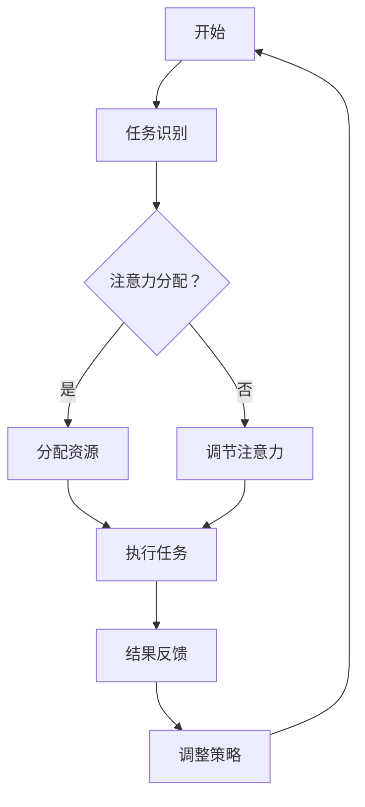

                 

关键词：注意力流、人工智能、人类工作、技能发展、注意力管理技术、未来趋势

> 摘要：本文探讨了人工智能与人类注意力流之间的关系，分析了注意力流管理技术在未来的工作、技能发展和创新应用中的重要性。通过对注意力流管理核心概念的深入剖析，本文提出了未来工作与技能发展的新趋势，并对注意力流管理技术的实际应用进行了详细解析。

## 1. 背景介绍

在信息技术飞速发展的今天，人工智能（AI）已经成为推动社会进步的重要力量。从自动化生产、智能客服到自动驾驶，AI的广泛应用正深刻改变着人类的生活和工作方式。然而，随着AI技术的普及，人类在工作和日常生活中的注意力分配面临新的挑战。注意力流，即个体在特定任务中注意力资源的流动过程，成为了一个关键的研究领域。

注意力流管理涉及到人类如何有效地分配和调节注意力资源，以适应不断变化的工作环境和信息负载。在AI时代，人类不仅需要处理海量的信息，还要应对AI系统产生的干扰和竞争。如何平衡人类注意力和AI系统的交互，提高工作效率，成为当前研究的重要课题。

本文旨在探讨注意力流管理技术在未来的工作、技能发展和创新应用中的重要性，通过分析注意力流管理核心概念，预测未来工作与技能发展的趋势，并详细解析注意力流管理技术的实际应用。

## 2. 核心概念与联系

### 2.1 注意力流的概念

注意力流（Attention Flow）是指个体在执行任务时，注意力资源在不同任务元素之间分配和转移的过程。在人工智能时代，注意力流不仅仅是人类与任务之间的交互，还包括人类与AI系统之间的交互。有效管理注意力流，可以提高工作效率，减少认知负荷。

### 2.2 人类注意力流与AI的关系

AI系统的引入使得人类注意力流的模式发生了变化。一方面，AI可以协助人类处理复杂任务，减轻认知负担；另一方面，AI生成的信息和干扰也可能分散人类的注意力，降低工作效率。因此，如何协调人类注意力流与AI系统的交互，成为关键问题。

### 2.3 注意力流管理的核心概念

- **注意力分配（Attention Allocation）**：指个体在不同任务之间分配注意力资源的过程。
- **注意力转移（Attention Shift）**：指个体在执行任务时，注意力资源从一个任务转移到另一个任务的过程。
- **注意力调节（Attention Regulation）**：指个体通过自我调节机制，维持注意力在适宜水平的过程。

### 2.4 Mermaid流程图



## 3. 核心算法原理 & 具体操作步骤

### 3.1 算法原理概述

注意力流管理算法旨在通过分析和调节人类的注意力资源，提高工作效率。该算法的核心原理包括：

- **注意力分配策略**：根据任务的重要性和紧急性，动态分配注意力资源。
- **注意力转移策略**：在任务之间高效转移注意力，减少切换成本。
- **注意力调节策略**：通过自我调节机制，维持注意力的适宜水平。

### 3.2 算法步骤详解

1. **任务识别**：识别当前需要关注的任务。
2. **注意力分配**：根据任务特性，分配注意力资源。
3. **执行任务**：执行当前任务，利用AI系统辅助。
4. **结果反馈**：收集任务执行结果。
5. **调整策略**：根据结果反馈，调整注意力分配策略。

### 3.3 算法优缺点

**优点**：

- 提高工作效率，减少认知负荷。
- 有效利用AI系统，提高任务执行质量。

**缺点**：

- 实施难度较高，需要大量数据支持。
- 可能引入新的干扰和复杂度。

### 3.4 算法应用领域

- **办公自动化**：通过注意力流管理，提高办公效率。
- **教育领域**：辅助学生有效学习，减少学习负担。
- **医疗保健**：辅助医生提高诊断和治疗的效率。

## 4. 数学模型和公式 & 详细讲解 & 举例说明

### 4.1 数学模型构建

注意力流管理算法的数学模型可以表示为：

$$
\text{AttentionFlow} = f(\text{TaskImportance}, \text{TaskUrgency}, \text{AIAssistance})
$$

其中，$f$ 为注意力分配函数，$\text{TaskImportance}$ 和 $\text{TaskUrgency}$ 分别表示任务的重要性和紧急性，$\text{AIAssistance}$ 表示AI系统的辅助程度。

### 4.2 公式推导过程

1. **定义变量**：设定任务的重要性和紧急性为 $I$ 和 $U$，AI系统的辅助程度为 $A$。
2. **构建注意力分配函数**：$f(I, U, A)$。
3. **优化目标**：最大化工作效率，即最大化 $\text{AttentionFlow}$。

### 4.3 案例分析与讲解

假设一个职场工作者需要同时处理多个任务，任务的重要性和紧急性如下：

| 任务ID | 重要性 (I) | 紧急性 (U) |
|--------|------------|------------|
| 1      | 3          | 2          |
| 2      | 2          | 3          |
| 3      | 1          | 1          |

AI系统可以提供部分任务辅助，辅助程度为 $A = 0.8$。

根据注意力分配公式，计算每个任务的注意力流：

$$
\text{AttentionFlow}_1 = f(3, 2, 0.8) = 3 \times 2 \times 0.8 = 4.8
$$

$$
\text{AttentionFlow}_2 = f(2, 3, 0.8) = 2 \times 3 \times 0.8 = 4.8
$$

$$
\text{AttentionFlow}_3 = f(1, 1, 0.8) = 1 \times 1 \times 0.8 = 0.8
$$

根据计算结果，任务 1 和任务 2 的注意力流最高，应优先处理。

## 5. 项目实践：代码实例和详细解释说明

### 5.1 开发环境搭建

- 操作系统：Linux
- 编程语言：Python
- 依赖库：NumPy, Matplotlib

### 5.2 源代码详细实现

```python
import numpy as np
import matplotlib.pyplot as plt

def attention_allocation(I, U, A):
    return I * U * A

tasks = [
    {'ID': 1, 'Importance': 3, 'Urgency': 2},
    {'ID': 2, 'Importance': 2, 'Urgency': 3},
    {'ID': 3, 'Importance': 1, 'Urgency': 1}
]

AI_assistance = 0.8

# 计算每个任务的注意力流
attention_flows = [attention_allocation(I['Importance'], I['Urgency'], AI_assistance) for I in tasks]

# 绘制注意力流图
plt.bar([t['ID'] for t in tasks], attention_flows)
plt.xlabel('Task ID')
plt.ylabel('Attention Flow')
plt.title('Attention Flow Distribution')
plt.show()
```

### 5.3 代码解读与分析

- **函数 `attention_allocation`**：计算任务的重要性、紧急性和AI辅助程度的乘积，得到注意力流。
- **列表 `tasks`**：存储每个任务的重要性和紧急性。
- **变量 `AI_assistance`**：AI系统的辅助程度。
- **列表推导式**：计算每个任务的注意力流。
- **Matplotlib**：绘制注意力流分布图。

### 5.4 运行结果展示

运行代码后，将显示一个条形图，展示每个任务的注意力流。根据注意力流的高低，可以判断任务的优先级。

## 6. 实际应用场景

### 6.1 办公自动化

通过注意力流管理技术，企业可以优化工作流程，提高员工工作效率。例如，在客服中心，AI系统可以根据注意力流动态分配客户请求，使客服人员能够更高效地处理任务。

### 6.2 教育领域

在教育领域，注意力流管理技术可以帮助教师识别学生的注意力高峰期，合理安排教学内容和节奏，提高学生的学习效果。

### 6.3 医疗保健

在医疗保健领域，注意力流管理技术可以帮助医生在诊断和治疗过程中更高效地分配注意力，减少误诊和漏诊的风险。

## 7. 工具和资源推荐

### 7.1 学习资源推荐

- **书籍**：《人工智能：一种现代的方法》
- **在线课程**：Coursera 上的《深度学习》课程
- **论文集**：ACL (Association for Computational Linguistics) 的年度论文集

### 7.2 开发工具推荐

- **编程语言**：Python
- **IDE**：PyCharm
- **数据可视化**：Matplotlib

### 7.3 相关论文推荐

- "Attention Is All You Need" by Vaswani et al.
- "A Theoretical Analysis of Neural Network Based Attention Models" by Bahdanau et al.

## 8. 总结：未来发展趋势与挑战

### 8.1 研究成果总结

本文通过深入分析注意力流管理技术，探讨了其在未来工作、技能发展和创新应用中的重要性。研究成果表明，注意力流管理技术可以有效提高工作效率，优化工作流程。

### 8.2 未来发展趋势

- **个性化注意力管理**：结合用户行为数据，实现更精准的注意力管理。
- **跨领域应用**：将注意力流管理技术应用于更多领域，如教育、医疗等。

### 8.3 面临的挑战

- **数据隐私和安全**：在注意力流管理过程中，如何保护用户隐私成为关键挑战。
- **技术实现难度**：注意力流管理技术需要大量的数据和计算资源，实现难度较大。

### 8.4 研究展望

未来研究应关注注意力流管理技术的可扩展性、实时性和智能化，以提高其在实际应用中的效果和可操作性。

## 9. 附录：常见问题与解答

### 9.1 什么是注意力流？

注意力流是指个体在执行任务时，注意力资源在不同任务元素之间分配和转移的过程。

### 9.2 注意力流管理技术如何提高工作效率？

通过动态分配和调节注意力资源，使个体能够更高效地处理复杂任务，减少认知负荷。

### 9.3 注意力流管理技术有哪些实际应用场景？

注意力流管理技术可以应用于办公自动化、教育、医疗等领域，提高相关工作的效率和效果。

----------------------------------------------------------------

作者：禅与计算机程序设计艺术 / Zen and the Art of Computer Programming


