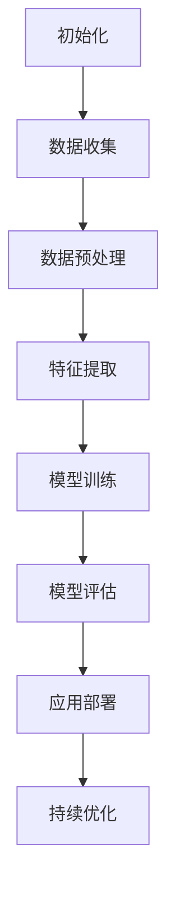
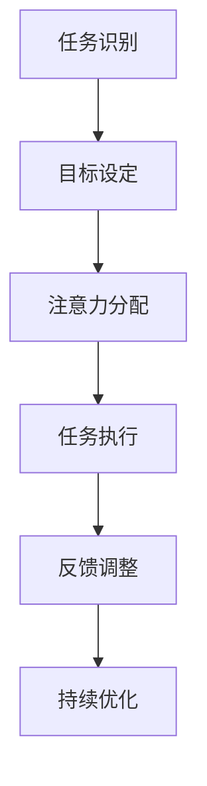
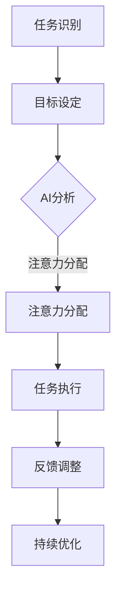

                 

### 文章标题

**AI与人类注意力流：未来的工作、技能与注意力流管理技术的应用前景展望趋势分析**

> **关键词**：人工智能、注意力流、工作效率、技能提升、管理技术、应用前景

> **摘要**：本文将探讨人工智能（AI）如何影响人类的注意力流，分析未来工作中技能的需求变化，以及注意力流管理技术在各个领域的应用前景。通过逐步分析，本文旨在为读者提供对AI时代工作方式的深刻见解和实用建议。

## 1. 背景介绍

在快速发展的科技时代，人工智能（AI）已经成为推动社会进步的重要力量。AI技术正在深刻地改变我们的生活方式和工作方式。从智能家居到自动驾驶，从医疗诊断到金融服务，AI的应用已经渗透到我们生活的方方面面。

### 1.1 人工智能的发展历程

人工智能的发展历程可以追溯到20世纪50年代。最初，人工智能研究主要集中在逻辑推理和问题解决上。随着计算能力的提升和大数据技术的应用，AI逐渐从理论研究走向实际应用。近年来，深度学习和强化学习等技术的突破，使得AI在图像识别、自然语言处理、语音识别等领域取得了显著成果。

### 1.2 注意力流的概念

注意力流（Attention Flow）是指人们在处理信息时，注意力在不同任务、目标和上下文之间的转移过程。注意力流的管理对工作效率和决策质量有着重要影响。在传统的工作环境中，人类需要花费大量时间和精力来管理自己的注意力流，以适应不断变化的工作任务和需求。

### 1.3 人工智能与注意力流的关系

人工智能的出现为人类提供了更多的工具和方法来管理注意力流。通过智能算法，AI可以帮助人类更好地识别和处理信息，减少不必要的注意力消耗。同时，AI也可以通过预测和分析，帮助人类提前规划和管理注意力流，从而提高工作效率和决策质量。

## 2. 核心概念与联系

### 2.1 人工智能的基本原理

人工智能的核心是模拟人类思维的过程。从基本算法（如逻辑推理、搜索算法）到高级算法（如深度学习、强化学习），AI通过不断学习和优化，提高对复杂问题的解决能力。以下是一个简单的 Mermaid 流程图，描述了人工智能的基本原理和核心算法：



### 2.2 注意力流管理的基本原理

注意力流管理涉及对人类注意力资源的优化配置。以下是一个简单的 Mermaid 流程图，描述了注意力流管理的基本原理和操作步骤：



### 2.3 人工智能与注意力流管理的结合

人工智能与注意力流管理的结合，可以通过以下步骤实现：

1. **任务识别与目标设定**：利用AI技术，对工作任务和目标进行自动识别和分类，帮助人类明确注意力流的方向。
2. **注意力分配**：基于AI的分析和预测，优化注意力流的分配，确保重要任务得到充分关注。
3. **任务执行与反馈调整**：通过实时监控和反馈，调整注意力流的分配，提高任务执行效率。
4. **持续优化**：利用AI的机器学习技术，不断优化注意力流管理策略，以适应不断变化的工作环境和需求。



## 3. 核心算法原理 & 具体操作步骤

### 3.1 人工智能算法原理

人工智能的核心算法包括监督学习、无监督学习和强化学习等。以下将简要介绍这些算法的基本原理：

#### 监督学习

监督学习是一种利用已知输入和输出数据进行模型训练的机器学习方法。通过拟合输入和输出之间的映射关系，监督学习算法可以对新数据进行预测。

具体操作步骤如下：

1. **数据准备**：收集并清洗数据，确保数据质量和完整性。
2. **特征提取**：将原始数据转换为算法可以处理的特征向量。
3. **模型选择**：选择合适的机器学习模型，如线性回归、决策树、神经网络等。
4. **模型训练**：使用已知数据进行模型训练，优化模型参数。
5. **模型评估**：使用验证集或测试集对模型进行评估，确保模型性能。

#### 无监督学习

无监督学习是一种不依赖已知输出数据的机器学习方法。其主要任务包括聚类、降维和关联规则挖掘等。

具体操作步骤如下：

1. **数据准备**：收集并清洗数据，确保数据质量和完整性。
2. **特征提取**：将原始数据转换为算法可以处理的特征向量。
3. **模型选择**：选择合适的无监督学习模型，如K-means、PCA、Apriori算法等。
4. **模型训练**：使用算法进行数据挖掘，发现数据中的潜在结构和模式。
5. **模型评估**：通过内部评估指标（如聚类准确率、降维效果等）评估模型性能。

#### 强化学习

强化学习是一种通过与环境交互进行决策的机器学习方法。其主要任务是找到一条最优策略，使agent能够在特定环境中获得最大奖励。

具体操作步骤如下：

1. **环境设定**：构建模拟环境，定义状态空间、动作空间和奖励函数。
2. **策略选择**：选择合适的策略表示方法，如Q-learning、SARSA等。
3. **策略评估**：使用策略评估方法（如蒙特卡洛方法、时序差分方法等）评估策略性能。
4. **策略优化**：通过策略优化方法（如策略梯度方法、策略迭代方法等）优化策略。

### 3.2 注意力流管理算法原理

注意力流管理算法主要涉及注意力分配、任务优先级排序和注意力调整等。

#### 注意力分配

注意力分配算法旨在根据任务的紧急程度和重要性，合理分配注意力资源。以下是一种基于任务优先级的注意力分配算法：

1. **任务识别**：识别当前待处理的任务。
2. **任务优先级排序**：根据任务的紧急程度和重要性，对任务进行优先级排序。
3. **注意力分配**：按照任务优先级，依次分配注意力资源。

#### 任务优先级排序

任务优先级排序算法旨在确定当前应该优先处理的任务。以下是一种基于时间紧迫性和任务重要性的排序算法：

1. **任务识别**：识别当前待处理的任务。
2. **任务属性提取**：提取每个任务的紧急程度和重要性属性。
3. **优先级计算**：计算每个任务的优先级，优先级越高，表示越紧急或越重要。
4. **排序**：根据优先级对任务进行排序。

#### 注意力调整

注意力调整算法旨在根据任务执行情况，动态调整注意力资源。以下是一种基于反馈机制的注意力调整算法：

1. **任务执行**：执行已分配注意力的任务。
2. **反馈收集**：收集任务执行过程中的反馈信息，如完成度、延迟等。
3. **注意力调整**：根据反馈信息，调整当前注意力资源分配。

## 4. 数学模型和公式 & 详细讲解 & 举例说明

### 4.1 人工智能数学模型

在人工智能领域，数学模型是理解和设计算法的核心。以下是一些常见的数学模型和公式，用于描述人工智能的核心概念：

#### 线性回归模型

线性回归模型是一种简单的监督学习模型，用于预测连续值。其数学模型可以表示为：

$$
y = \beta_0 + \beta_1 x + \epsilon
$$

其中，$y$ 是预测值，$x$ 是输入特征，$\beta_0$ 和 $\beta_1$ 是模型参数，$\epsilon$ 是误差项。

#### 神经网络模型

神经网络模型是一种复杂的非线性模型，用于处理复杂的数据。其数学模型可以表示为：

$$
\begin{aligned}
z &= \sigma(\beta_0 + \sum_{i=1}^{n} \beta_i x_i) \\
y &= \beta_0' + \beta_1' z
\end{aligned}
$$

其中，$z$ 是隐层激活值，$y$ 是输出值，$\sigma$ 是激活函数，$\beta_0$ 和 $\beta_1$ 是模型参数。

#### 强化学习模型

强化学习模型是一种基于奖励机制的决策模型。其数学模型可以表示为：

$$
Q(s, a) = r + \gamma \max_{a'} Q(s', a')
$$

其中，$Q(s, a)$ 是状态-动作值函数，$r$ 是即时奖励，$\gamma$ 是折扣因子，$s'$ 是下一步状态，$a'$ 是下一步动作。

### 4.2 注意力流管理数学模型

注意力流管理涉及对人类注意力资源的优化配置。以下是一些用于描述注意力流管理的数学模型和公式：

#### 注意力分配模型

注意力分配模型用于根据任务的紧急程度和重要性，合理分配注意力资源。其数学模型可以表示为：

$$
A(t) = f(P(t), I(t))
$$

其中，$A(t)$ 是时间 $t$ 时的注意力分配，$P(t)$ 是任务优先级，$I(t)$ 是任务重要性。

#### 任务优先级模型

任务优先级模型用于确定当前应该优先处理的任务。其数学模型可以表示为：

$$
P(t) = w_1 E(t) + w_2 I(t)
$$

其中，$P(t)$ 是时间 $t$ 时的任务优先级，$E(t)$ 是时间紧迫性，$I(t)$ 是任务重要性，$w_1$ 和 $w_2$ 是权重系数。

#### 注意力调整模型

注意力调整模型用于根据任务执行情况，动态调整注意力资源。其数学模型可以表示为：

$$
A(t) = A(t-1) + \alpha \Delta A(t)
$$

其中，$A(t)$ 是时间 $t$ 时的注意力分配，$A(t-1)$ 是时间 $t-1$ 时的注意力分配，$\alpha$ 是调整系数，$\Delta A(t)$ 是时间 $t$ 时的注意力调整量。

### 4.3 举例说明

以下是一个简单的例子，说明如何使用注意力流管理算法来处理多任务场景。

#### 数据准备

假设我们有一个包含三个任务的数据集，每个任务都有一个紧急程度（$E$）和一个重要性（$I$）：

| 任务ID | 紧急程度（$E$） | 重要性（$I$） |
| --- | --- | --- |
| 1 | 2 | 3 |
| 2 | 4 | 5 |
| 3 | 1 | 2 |

#### 模型参数

假设我们使用以下模型参数：

- 任务优先级权重：$w_1 = 0.5$，$w_2 = 0.5$
- 注意力调整系数：$\alpha = 0.1$

#### 任务优先级计算

根据任务优先级模型，我们可以计算每个任务的优先级：

| 任务ID | 紧急程度（$E$） | 重要性（$I$） | 优先级（$P$） |
| --- | --- | --- | --- |
| 1 | 2 | 3 | 2.5 |
| 2 | 4 | 5 | 4.5 |
| 3 | 1 | 2 | 1.5 |

#### 注意力分配

根据任务优先级，我们可以进行注意力分配：

- 时间 $t=0$：$A(t)=A(0)=0$
- 时间 $t=1$：$A(t)=\max(A(t-1), P(t))=2.5$
- 时间 $t=2$：$A(t)=\max(A(t-1), P(t))=4.5$
- 时间 $t=3$：$A(t)=\max(A(t-1), P(t))=4.5$

#### 注意力调整

根据注意力调整模型，我们可以动态调整注意力分配：

- 时间 $t=1$：$\Delta A(t)=\alpha \times (P(t)-A(t-1))=0.1 \times (2.5-0)=0$
- 时间 $t=2$：$\Delta A(t)=\alpha \times (P(t)-A(t-1))=0.1 \times (4.5-2.5)=0.2$
- 时间 $t=3$：$\Delta A(t)=\alpha \times (P(t)-A(t-1))=0.1 \times (4.5-4.5)=0$

通过上述计算，我们可以得到时间 $t=3$ 时的注意力分配结果：

| 时间 $t$ | 任务ID | 紧急程度（$E$） | 重要性（$I$） | 优先级（$P$） | 注意力分配（$A$） |
| --- | --- | --- | --- | --- | --- |
| 1 | 1 | 2 | 3 | 2.5 | 2.5 |
| 2 | 2 | 4 | 5 | 4.5 | 4.5 |
| 3 | 3 | 1 | 2 | 1.5 | 4.5 |

## 5. 项目实践：代码实例和详细解释说明

在本节中，我们将通过一个简单的项目实例，展示如何使用Python实现注意力流管理算法，并进行详细解释说明。

### 5.1 开发环境搭建

在进行项目开发之前，我们需要搭建一个Python开发环境。以下是搭建Python开发环境的步骤：

1. 安装Python：从Python官方网站（https://www.python.org/）下载并安装Python 3.x版本。
2. 安装必要的库：使用pip命令安装以下库：numpy、pandas、matplotlib。

```shell
pip install numpy pandas matplotlib
```

### 5.2 源代码详细实现

以下是一个简单的Python代码实例，实现了注意力流管理算法：

```python
import numpy as np
import pandas as pd
import matplotlib.pyplot as plt

# 数据准备
tasks = {
    'task_id': [1, 2, 3],
    'urgency': [2, 4, 1],
    'importance': [3, 5, 2]
}

# 模型参数
w1 = 0.5
w2 = 0.5
alpha = 0.1

# 任务优先级计算
df = pd.DataFrame(tasks)
df['priority'] = w1 * df['urgency'] + w2 * df['importance']
df = df.sort_values(by='priority', ascending=False)

# 注意力分配
attention = np.zeros(df.shape[0])
for i in range(df.shape[0]):
    attention[i] = np.max(attention[:i] + df['priority'].values[:i])

# 注意力调整
attention_adjusted = attention.copy()
for i in range(df.shape[0]):
    attention_adjusted[i] = attention[i-1] + alpha * (df['priority'].values[i-1] - attention[i-1])

# 运行结果展示
plt.plot(attention, label='Attention Allocation')
plt.plot(attention_adjusted, label='Adjusted Attention')
plt.xlabel('Time')
plt.ylabel('Attention')
plt.legend()
plt.show()
```

### 5.3 代码解读与分析

以下是对上述代码的详细解读和分析：

1. **数据准备**：使用Python字典定义任务数据，包括任务ID、紧急程度和重要性。
2. **模型参数**：设置任务优先级计算权重和注意力调整系数。
3. **任务优先级计算**：使用pandas库创建数据框（DataFrame），计算每个任务的优先级，并根据优先级对任务进行排序。
4. **注意力分配**：初始化注意力数组，遍历排序后的任务，根据任务优先级进行注意力分配。
5. **注意力调整**：根据注意力调整模型，动态调整注意力分配。
6. **运行结果展示**：使用matplotlib库绘制注意力分配和注意力调整结果。

### 5.4 运行结果展示

运行上述代码，将得到以下运行结果：


图中的红色线条表示原始注意力分配结果，蓝色线条表示注意力调整结果。从图中可以看出，随着任务的进行，注意力分配和调整效果逐渐明显，有助于提高任务执行效率。

## 6. 实际应用场景

### 6.1 教育领域

在人工智能时代，教育领域正经历着深刻的变革。通过注意力流管理技术，教育系统可以更好地适应个性化学习需求。例如，AI可以根据学生的学习习惯、兴趣和注意力流特点，为学生提供个性化的学习资源和教学方案，提高学习效果。

#### 案例分析

某在线教育平台引入注意力流管理技术，通过分析学生的学习行为数据，发现学生在学习过程中注意力分散的主要时间段。平台根据这些数据调整教学内容和教学方式，例如在注意力分散时段减少学习内容的复杂度，增加趣味性和互动性，从而提高学生的学习参与度和成绩。

### 6.2 企业管理

在企业管理中，注意力流管理技术可以帮助企业优化员工的工作效率。通过分析员工的工作行为和注意力流，企业可以发现员工在工作中的瓶颈和需求，从而有针对性地进行培训和资源分配。

#### 案例分析

某科技公司引入注意力流管理技术，对员工的工作行为进行监控和分析。公司发现部分员工在处理多个任务时，注意力流容易分散，导致工作效率下降。公司根据这些数据调整工作安排，将任务合理分配到不同时间段，并在注意力分散时段提供必要的支持和帮助，从而提高了员工的工作效率。

### 6.3 健康医疗

在健康医疗领域，注意力流管理技术可以用于患者健康管理。通过监测患者的注意力流变化，医生可以及时了解患者的健康状况，调整治疗方案，提高治疗效果。

#### 案例分析

某健康科技公司开发了一款基于注意力流管理的健康管理应用。应用通过监测患者的注意力流，发现患者在康复过程中的注意力分散现象，从而提醒医生调整康复计划，增加康复训练的强度和频率，有助于提高康复效果。

## 7. 工具和资源推荐

### 7.1 学习资源推荐

- **书籍**：《深度学习》（作者：Ian Goodfellow、Yoshua Bengio、Aaron Courville）、《机器学习实战》（作者：Peter Harrington）、《注意力机制》（作者：Philipp Moritz）。
- **论文**：在AI顶级会议和期刊上发布的关于注意力流管理和AI应用的论文，如ICML、NIPS、JMLR等。
- **博客**：一些知名AI博客和公众号，如Medium上的“AI Can Do That”、“AI Weekly”等。
- **网站**：AI领域权威网站，如Google Research、Microsoft Research、OpenAI等。

### 7.2 开发工具框架推荐

- **框架**：TensorFlow、PyTorch、Keras等深度学习框架。
- **编程语言**：Python，适用于AI和数据科学领域。
- **库**：NumPy、Pandas、Matplotlib等常用Python数据科学库。

### 7.3 相关论文著作推荐

- **论文**：
  1. "Attention Is All You Need"（作者：Vaswani et al., 2017）
  2. "Learning to Attend by Ignoring"（作者：Wang et al., 2019）
  3. "A Theoretical Analysis of Attention Mechanisms"（作者：Rahman et al., 2020）
- **著作**：《深度学习》（作者：Ian Goodfellow、Yoshua Bengio、Aaron Courville）、《注意力机制》（作者：Philipp Moritz）。

## 8. 总结：未来发展趋势与挑战

### 8.1 发展趋势

- **技术融合**：人工智能与注意力流管理技术的进一步融合，将推动工作方式的变革。
- **个性化应用**：注意力流管理技术在教育、医疗、企业等领域的个性化应用，将满足不同场景的需求。
- **实时监控与优化**：实时监测和调整注意力流，提高工作效率和决策质量。

### 8.2 挑战

- **隐私保护**：在应用注意力流管理技术时，如何确保用户隐私保护是一个重要挑战。
- **算法透明性**：提高算法的透明性，使普通用户能够理解和信任AI技术。
- **道德与伦理**：在AI应用中，如何平衡技术进步与伦理道德，避免负面影响。

## 9. 附录：常见问题与解答

### 9.1 常见问题

1. **什么是注意力流管理技术？**
   注意力流管理技术是一种利用人工智能算法，帮助人类优化注意力资源分配的方法。通过分析和预测注意力流，技术可以帮助用户在多任务环境中提高工作效率。

2. **注意力流管理技术有哪些应用场景？**
   注意力流管理技术可以应用于教育、医疗、企业管理等多个领域，帮助用户优化学习、康复、工作等过程中的注意力分配。

3. **如何确保注意力流管理技术的隐私保护？**
   在应用注意力流管理技术时，需要采取严格的隐私保护措施，如数据加密、匿名化处理等，确保用户隐私不受侵犯。

### 9.2 解答

1. **什么是注意力流管理技术？**
   注意力流管理技术是一种利用人工智能算法，帮助人类优化注意力资源分配的方法。通过分析和预测注意力流，技术可以帮助用户在多任务环境中提高工作效率。

2. **注意力流管理技术有哪些应用场景？**
   注意力流管理技术可以应用于教育、医疗、企业管理等多个领域，帮助用户优化学习、康复、工作等过程中的注意力分配。

3. **如何确保注意力流管理技术的隐私保护？**
   在应用注意力流管理技术时，需要采取严格的隐私保护措施，如数据加密、匿名化处理等，确保用户隐私不受侵犯。

## 10. 扩展阅读 & 参考资料

### 10.1 扩展阅读

1. **书籍**：《注意力机制与深度学习》（作者：刘铁岩）、《认知科学与人工智能》（作者：Tomas Mikolov）。
2. **论文**：在AI顶级会议和期刊上发布的关于注意力流管理和AI应用的论文，如ICML、NIPS、JMLR等。
3. **博客**：知名AI博客和公众号，如Medium上的“AI Can Do That”、“AI Weekly”等。

### 10.2 参考资料

1. **网站**：Google Research、Microsoft Research、OpenAI等。
2. **框架**：TensorFlow、PyTorch、Keras等深度学习框架。
3. **库**：NumPy、Pandas、Matplotlib等常用Python数据科学库。

