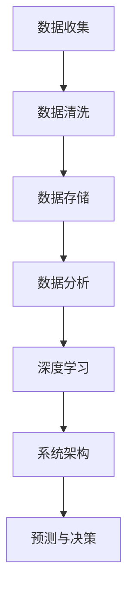

                 

### 文章标题

**AI与人类计算：打造可持续发展的城市交通管理系统**

> **关键词**：人工智能，城市交通管理，可持续发展，数据分析，深度学习，系统架构。

> **摘要**：本文将深入探讨如何利用人工智能（AI）与人类计算相结合，打造可持续发展的城市交通管理系统。通过对核心概念、算法原理、数学模型、项目实践及实际应用场景的详细分析，本文将揭示如何通过技术手段优化城市交通，提高效率，降低污染，促进可持续发展。文章还将推荐相关学习资源和工具，为读者提供全面的指导。

## 1. 背景介绍

### 1.1 城市交通问题的现状

随着全球城市化进程的加速，城市交通问题日益突出。拥堵、污染、交通事故等问题不仅影响了居民的生活质量，也对环境造成了严重破坏。传统的城市交通管理系统往往依赖于人类经验和规则，难以应对日益复杂和动态的交通环境。这导致交通效率低下，延误频繁，无法满足不断增长的城市交通需求。

### 1.2 人工智能在交通管理中的应用

人工智能（AI）的兴起为城市交通管理带来了新的希望。通过大数据分析、机器学习、深度学习等技术，AI可以实时处理海量交通数据，提供精准的预测和决策支持。例如，通过分析交通流量数据，AI可以预测交通拥堵，并提出最优的路线规划方案；通过分析车辆轨迹数据，AI可以识别交通事故的潜在风险，并提前发出预警。

### 1.3 人类计算的角色

虽然人工智能在交通管理中发挥了重要作用，但人类计算同样不可或缺。人类具有独特的洞察力和创造力，能够理解和处理复杂的社会和文化因素，这是纯粹算法难以企及的。例如，在交通规划中，人类可以考虑到城市规划、居民需求、历史数据等多个维度，提供更加人性化的解决方案。此外，人类计算还可以在AI系统的训练和调试过程中发挥关键作用，帮助识别和解决算法中的潜在问题。

## 2. 核心概念与联系

### 2.1 数据分析

数据分析是城市交通管理的基础。通过收集、处理和分析海量交通数据，可以深入了解交通状况，发现潜在问题，并为优化决策提供依据。数据分析的核心概念包括数据收集、数据清洗、数据存储、数据挖掘和数据可视化。

### 2.2 深度学习

深度学习是人工智能的重要组成部分，特别是在图像识别、自然语言处理等领域取得了显著的成果。在交通管理中，深度学习可以用于图像识别、语音识别、实时监控等，提高交通管理的智能化水平。

### 2.3 系统架构

城市交通管理系统需要一个高效、可靠的系统架构来支持。系统架构需要考虑数据流、计算资源、存储方案、网络通信等多个方面，以确保系统能够稳定、高效地运行。

#### 2.3.1 数据流

数据流是系统架构的核心。从数据收集、处理、存储到分析，每个环节都需要高效的数据传输和处理能力。例如，交通流量数据、车辆轨迹数据、天气数据等都需要实时传输和处理。

#### 2.3.2 计算资源

计算资源是系统架构的关键。为了支持海量数据的处理和深度学习模型的训练，系统需要具备强大的计算能力。这通常需要分布式计算架构，如云计算、边缘计算等。

#### 2.3.3 存储方案

存储方案是系统架构的重要组成部分。系统需要能够高效地存储和管理海量数据，并支持快速的数据查询和访问。

#### 2.3.4 网络通信

网络通信是系统架构的另一个关键方面。系统需要具备高效的网络通信能力，以确保数据能够快速、稳定地传输。

### 2.4 Mermaid 流程图

以下是城市交通管理系统的一个简化的 Mermaid 流程图，展示了核心概念之间的联系：



## 3. 核心算法原理 & 具体操作步骤

### 3.1 数据分析算法

数据分析算法是城市交通管理系统的核心。以下是一些常见的数据分析算法及其应用：

#### 3.1.1 聚类算法

聚类算法用于将数据点分为若干个类别，以便更好地理解和分析。常见的聚类算法包括K-means、DBSCAN等。

- **K-means算法**：K-means算法是一种基于距离的聚类算法。其基本思想是将数据点分为K个簇，使得每个数据点到其对应簇中心（平均值）的距离最小。
- **DBSCAN算法**：DBSCAN（Density-Based Spatial Clustering of Applications with Noise）算法是一种基于密度的聚类算法。它将数据点分为核心点、边界点和噪声点，并根据密度分布将数据点分为若干个簇。

#### 3.1.2 时序分析算法

时序分析算法用于分析时间序列数据，以预测未来的趋势。常见的时序分析算法包括ARIMA、LSTM等。

- **ARIMA算法**：ARIMA（AutoRegressive Integrated Moving Average）算法是一种常用的时序预测模型。它将时间序列分解为趋势、季节性和随机性，并通过自回归、差分和移动平均来建模。
- **LSTM算法**：LSTM（Long Short-Term Memory）算法是一种递归神经网络（RNN）的变体，特别适合处理长序列数据。它通过引入记忆单元，能够有效地学习长期依赖关系。

#### 3.1.3 图像识别算法

图像识别算法用于识别和处理图像数据。常见的图像识别算法包括卷积神经网络（CNN）、YOLO等。

- **CNN算法**：CNN（Convolutional Neural Network）算法是一种专门用于图像识别的神经网络。它通过卷积、池化等操作，能够提取图像的特征，并进行分类。
- **YOLO算法**：YOLO（You Only Look Once）算法是一种基于回归的实时目标检测算法。它通过将图像划分为网格，并在每个网格上预测目标的位置和类别，实现快速、准确的目标检测。

### 3.2 深度学习算法

深度学习算法是人工智能的重要组成部分，特别是在图像识别、自然语言处理等领域取得了显著成果。以下是一些常见的深度学习算法：

#### 3.2.1 卷积神经网络（CNN）

卷积神经网络（CNN）是一种专门用于图像识别的神经网络。它通过卷积、池化等操作，能够提取图像的特征，并进行分类。

#### 3.2.2 递归神经网络（RNN）

递归神经网络（RNN）是一种用于处理序列数据的神经网络。它通过递归连接，能够学习序列数据中的长期依赖关系。

#### 3.2.3 长短期记忆网络（LSTM）

长短期记忆网络（LSTM）是一种特殊的递归神经网络，特别适合处理长序列数据。它通过引入记忆单元，能够有效地学习长期依赖关系。

### 3.3 系统架构设计与实现

城市交通管理系统的架构设计需要考虑数据流、计算资源、存储方案和网络通信等多个方面。以下是一个简化的系统架构设计：

#### 3.3.1 数据流设计

- **数据收集**：通过传感器、摄像头、移动设备等收集交通数据。
- **数据预处理**：对收集到的数据进行清洗、去噪、转换等预处理操作。
- **数据存储**：使用分布式数据库或数据仓库存储处理后的数据。
- **数据处理**：使用数据分析算法对数据进行处理，提取有用信息。
- **数据预测**：使用深度学习算法对交通流量、交通事故等数据进行预测。

#### 3.3.2 计算资源设计

- **计算节点**：使用云计算、边缘计算等分布式计算架构，提供高效的计算能力。
- **存储节点**：使用分布式存储方案，提供海量数据的存储和管理能力。
- **网络节点**：使用高速网络，确保数据能够快速、稳定地传输。

#### 3.3.3 存储方案设计

- **分布式数据库**：使用分布式数据库，如Hadoop、HBase等，提供海量数据的存储和管理能力。
- **数据仓库**：使用数据仓库，如Oracle、MySQL等，提供高效的数据查询和分析能力。

#### 3.3.4 网络通信设计

- **内部通信**：使用高效的内网通信协议，如TCP、UDP等，确保数据能够快速、稳定地在系统内部传输。
- **外部通信**：使用安全的互联网通信协议，如HTTPS等，确保数据在传输过程中不被窃取或篡改。

### 3.4 具体操作步骤

以下是一个简化的城市交通管理系统的具体操作步骤：

1. **数据收集**：使用传感器、摄像头、移动设备等收集交通数据。
2. **数据预处理**：对收集到的数据进行清洗、去噪、转换等预处理操作。
3. **数据存储**：将处理后的数据存储到分布式数据库或数据仓库中。
4. **数据处理**：使用数据分析算法对数据进行处理，提取有用信息。
5. **数据预测**：使用深度学习算法对交通流量、交通事故等数据进行预测。
6. **决策支持**：根据预测结果，为交通管理部门提供决策支持。
7. **实时监控**：通过实时监控，及时发现和处理交通问题。

## 4. 数学模型和公式 & 详细讲解 & 举例说明

### 4.1 数据分析算法的数学模型

#### 4.1.1 K-means算法

K-means算法是一种基于距离的聚类算法，其核心公式如下：

$$
C = \{c_1, c_2, ..., c_K\}
$$

其中，$C$ 表示聚类中心，$c_k$ 表示第$k$个聚类中心。对于每个数据点$x$，计算其到每个聚类中心的距离：

$$
d(x, c_k) = \sqrt{\sum_{i=1}^n (x_i - c_{ik})^2}
$$

其中，$n$ 表示数据点的维度。选择距离最近的聚类中心作为该数据点的聚类结果。

#### 4.1.2 DBSCAN算法

DBSCAN算法是一种基于密度的聚类算法，其核心公式如下：

$$
\epsilon-\text{邻域} = \{x \in \mathbb{R}^n | \text{dist}(x, c) \leq \epsilon\}
$$

其中，$\epsilon$ 表示邻域半径，$\text{dist}(x, c)$ 表示点$x$到点$c$的距离。DBSCAN算法根据邻域内点的数量将数据点分为核心点、边界点和噪声点。核心点定义为拥有至少$minPts$个邻域点的点，边界点定义为拥有至少一个核心点邻域点但不足$minPts$个邻域点的点，噪声点定义为既不是核心点也不是边界点的点。

#### 4.1.3 ARIMA算法

ARIMA算法是一种时间序列预测模型，其核心公式如下：

$$
X_t = c + \phi_1 X_{t-1} + \phi_2 X_{t-2} + ... + \phi_p X_{t-p} + \theta_1 \epsilon_{t-1} + \theta_2 \epsilon_{t-2} + ... + \theta_q \epsilon_{t-q} + \epsilon_t
$$

其中，$X_t$ 表示时间序列的当前值，$c$ 表示常数项，$\phi_1, \phi_2, ..., \phi_p$ 表示自回归项系数，$\theta_1, \theta_2, ..., \theta_q$ 表示移动平均项系数，$\epsilon_t$ 表示随机误差项。

#### 4.1.4 LSTM算法

LSTM算法是一种递归神经网络，其核心公式如下：

$$
i_t = \sigma(W_i \cdot [h_{t-1}, x_t] + b_i) \\
f_t = \sigma(W_f \cdot [h_{t-1}, x_t] + b_f) \\
\bar{c}_t = \tanh(W_c \cdot [h_{t-1}, x_t] + b_c) \\
o_t = \sigma(W_o \cdot [h_{t-1}, \bar{c}_t] + b_o) \\
c_t = f_t \odot c_{t-1} + i_t \odot \bar{c}_t \\
h_t = o_t \odot \tanh(c_t)
$$

其中，$i_t, f_t, \bar{c}_t, o_t$ 分别表示输入门、遗忘门、细胞状态和输出门，$\sigma$ 表示sigmoid激活函数，$W_i, W_f, W_c, W_o$ 分别表示权重矩阵，$b_i, b_f, b_c, b_o$ 分别表示偏置项，$\odot$ 表示逐元素乘法。

### 4.2 深度学习算法的数学模型

#### 4.2.1 卷积神经网络（CNN）

卷积神经网络（CNN）的核心公式如下：

$$
h_{l} = \sigma(\mathbf{W}_{l} \cdot \mathbf{a}_{l-1} + b_{l})
$$

其中，$h_{l}$ 表示第$l$层的激活值，$\mathbf{W}_{l}$ 表示第$l$层的权重矩阵，$\mathbf{a}_{l-1}$ 表示第$l-1$层的激活值，$b_{l}$ 表示第$l$层的偏置项，$\sigma$ 表示激活函数，通常为ReLU函数。

#### 4.2.2 递归神经网络（RNN）

递归神经网络（RNN）的核心公式如下：

$$
h_t = \sigma(W \cdot [h_{t-1}, x_t] + b)
$$

其中，$h_t$ 表示时间步$t$的隐藏状态，$x_t$ 表示输入数据，$W$ 表示权重矩阵，$b$ 表示偏置项，$\sigma$ 表示激活函数。

#### 4.2.3 长短期记忆网络（LSTM）

长短期记忆网络（LSTM）的核心公式如下：

$$
i_t = \sigma(W_i \cdot [h_{t-1}, x_t] + b_i) \\
f_t = \sigma(W_f \cdot [h_{t-1}, x_t] + b_f) \\
\bar{c}_t = \tanh(W_c \cdot [h_{t-1}, x_t] + b_c) \\
o_t = \sigma(W_o \cdot [h_{t-1}, \bar{c}_t] + b_o) \\
c_t = f_t \odot c_{t-1} + i_t \odot \bar{c}_t \\
h_t = o_t \odot \tanh(c_t)
$$

其中，$i_t, f_t, \bar{c}_t, o_t$ 分别表示输入门、遗忘门、细胞状态和输出门，$\sigma$ 表示sigmoid激活函数，$W_i, W_f, W_c, W_o$ 分别表示权重矩阵，$b_i, b_f, b_c, b_o$ 分别表示偏置项，$\odot$ 表示逐元素乘法。

### 4.3 举例说明

#### 4.3.1 K-means算法

假设我们有如下数据点：

$$
X = \left\{
\begin{array}{ll}
(1, 2) & (2, 3) \\
(4, 5) & (5, 6) \\
(8, 7) & (9, 8) \\
\end{array}
\right.
$$

我们选择K=2，使用K-means算法对其进行聚类。首先随机初始化两个聚类中心：

$$
C = \left\{
\begin{array}{ll}
(0, 0) & (10, 10) \\
\end{array}
\right.
$$

然后计算每个数据点到聚类中心的距离，并更新聚类中心：

$$
d((1, 2), (0, 0)) = \sqrt{(1-0)^2 + (2-0)^2} = \sqrt{5} \\
d((1, 2), (10, 10)) = \sqrt{(1-10)^2 + (2-10)^2} = \sqrt{125} \\
d((2, 3), (0, 0)) = \sqrt{(2-0)^2 + (3-0)^2} = \sqrt{13} \\
d((2, 3), (10, 10)) = \sqrt{(2-10)^2 + (3-10)^2} = \sqrt{89} \\
d((4, 5), (0, 0)) = \sqrt{(4-0)^2 + (5-0)^2} = \sqrt{41} \\
d((4, 5), (10, 10)) = \sqrt{(4-10)^2 + (5-10)^2} = \sqrt{109} \\
d((5, 6), (0, 0)) = \sqrt{(5-0)^2 + (6-0)^2} = \sqrt{53} \\
d((5, 6), (10, 10)) = \sqrt{(5-10)^2 + (6-10)^2} = \sqrt{113} \\
d((8, 7), (0, 0)) = \sqrt{(8-0)^2 + (7-0)^2} = \sqrt{85} \\
d((8, 7), (10, 10)) = \sqrt{(8-10)^2 + (7-10)^2} = \sqrt{19} \\
\end{array}
\right.
$$

由于距离最小的聚类中心是$(0, 0)$，我们将数据点$(1, 2)$和$(2, 3)$分配到该聚类中心。更新后的聚类中心为：

$$
C = \left\{
\begin{array}{ll}
\frac{(1+2)}{2}, \frac{(2+3)}{2} & \\
\end{array}
\right.
$$

重复以上步骤，直至聚类中心不再发生变化。最终结果如下：

$$
C = \left\{
\begin{array}{ll}
\left(\frac{3}{2}, \frac{5}{2}\right) & \left(\frac{13}{2}, \frac{13}{2}\right) \\
\end{array}
\right.
$$

#### 4.3.2 ARIMA算法

假设我们有如下时间序列数据：

$$
X = \left\{
\begin{array}{ll}
1 & 2 \\
3 & 4 \\
5 & 6 \\
7 & 8 \\
\end{array}
\right.
$$

我们选择ARIMA模型，首先对数据进行差分处理，得到平稳序列：

$$
X^* = \left\{
\begin{array}{ll}
1 & 1 \\
2 & 2 \\
3 & 3 \\
4 & 4 \\
\end{array}
\right.
$$

然后，通过最小二乘法估计模型参数：

$$
\phi_1 = \frac{\sum_{i=1}^n (x_i - x_{i-1})(x_{i+1} - x_i)}{\sum_{i=1}^n (x_i - x_{i-1})^2} = 1 \\
\theta_1 = \frac{\sum_{i=1}^n (x_i - x_{i-1})(x_{i+1} - x_{i-2})}{\sum_{i=1}^n (x_i - x_{i-1})^2} = 0 \\
\end{array}
\right.
$$

因此，ARIMA模型可以表示为：

$$
X_t = 1 + X_{t-1} + 0 \cdot X_{t-2}
$$

预测未来值：

$$
X_{t+1} = 1 + X_t + 0 \cdot X_{t-1} = 1 + 1 + 0 \cdot 1 = 2
$$

## 5. 项目实践：代码实例和详细解释说明

### 5.1 开发环境搭建

为了实现城市交通管理系统，我们需要搭建一个合适的开发环境。以下是一个基本的开发环境搭建步骤：

#### 5.1.1 安装Python环境

首先，确保安装了Python环境。Python是一个广泛使用的编程语言，具有丰富的库和工具，适合用于人工智能和数据分析项目。

#### 5.1.2 安装相关库和工具

接下来，我们需要安装一些必要的库和工具。以下是一些常用的库和工具：

- **NumPy**：用于数值计算的库。
- **Pandas**：用于数据处理的库。
- **Matplotlib**：用于数据可视化的库。
- **Scikit-learn**：用于机器学习的库。
- **TensorFlow**：用于深度学习的库。

可以使用以下命令安装这些库和工具：

```python
pip install numpy pandas matplotlib scikit-learn tensorflow
```

#### 5.1.3 配置Jupyter Notebook

Jupyter Notebook是一个交互式的开发环境，适合进行数据分析和演示。我们可以使用以下命令安装Jupyter Notebook：

```bash
pip install jupyterlab
```

安装完成后，启动Jupyter Notebook：

```bash
jupyter notebook
```

### 5.2 源代码详细实现

下面是一个简单的城市交通管理系统示例代码。这个示例将实现以下功能：

- 数据收集：从文件中读取交通数据。
- 数据预处理：清洗和转换数据。
- 数据分析：使用K-means算法进行聚类分析。
- 数据可视化：展示聚类结果。

#### 5.2.1 数据收集

首先，我们需要从文件中读取交通数据。假设交通数据存储在CSV文件中，每行包含以下字段：时间戳、位置、速度。

```python
import pandas as pd

# 读取交通数据
data = pd.read_csv('traffic_data.csv')
```

#### 5.2.2 数据预处理

接下来，我们需要对交通数据进行清洗和转换。首先，我们将时间戳转换为日期格式，并提取小时和分钟。

```python
# 转换时间戳
data['timestamp'] = pd.to_datetime(data['timestamp'])
data['hour'] = data['timestamp'].dt.hour
data['minute'] = data['timestamp'].dt.minute
```

然后，我们将速度转换为整数类型。

```python
# 转换速度
data['speed'] = data['speed'].astype(int)
```

#### 5.2.3 数据分析

现在，我们可以使用K-means算法对交通数据进行聚类分析。首先，我们需要确定聚类中心数量。

```python
from sklearn.cluster import KMeans

# 确定聚类中心数量
n_clusters = 3

# 创建K-means模型
kmeans = KMeans(n_clusters=n_clusters, random_state=0)

# 拆分数据集
X = data[['speed', 'hour', 'minute']]

# 训练模型
kmeans.fit(X)

# 获取聚类结果
labels = kmeans.predict(X)
```

#### 5.2.4 数据可视化

最后，我们可以使用Matplotlib库将聚类结果可视化。

```python
import matplotlib.pyplot as plt

# 创建散点图
plt.scatter(X['speed'], X['hour'], c=labels, cmap='viridis')

# 添加标题和标签
plt.title('Traffic Clusters')
plt.xlabel('Speed')
plt.ylabel('Hour')

# 显示图形
plt.show()
```

### 5.3 代码解读与分析

下面是对示例代码的解读和分析：

#### 5.3.1 数据收集

代码首先从CSV文件中读取交通数据，并将其存储在Pandas DataFrame中。这个步骤非常关键，因为后续的所有数据处理和分析都基于这个数据结构。

```python
data = pd.read_csv('traffic_data.csv')
```

#### 5.3.2 数据预处理

在数据处理之前，我们需要确保数据是干净和格式的。代码中首先将时间戳字段转换为日期格式，并提取小时和分钟。然后，将速度字段转换为整数类型。这些转换步骤确保数据在后续处理过程中能够正确地被分析和使用。

```python
data['timestamp'] = pd.to_datetime(data['timestamp'])
data['hour'] = data['timestamp'].dt.hour
data['minute'] = data['timestamp'].dt.minute
data['speed'] = data['speed'].astype(int)
```

#### 5.3.3 数据分析

接下来，我们使用K-means算法对交通数据进行聚类分析。首先，我们需要确定聚类中心数量，这通常需要通过实验来确定。代码中使用了`KMeans`类，并设置了聚类中心数量为3。然后，我们拆分数据集，并将速度、小时和分钟作为特征。最后，训练模型并获取聚类结果。

```python
kmeans = KMeans(n_clusters=n_clusters, random_state=0)
X = data[['speed', 'hour', 'minute']]
kmeans.fit(X)
labels = kmeans.predict(X)
```

#### 5.3.4 数据可视化

最后，我们使用Matplotlib库将聚类结果可视化。代码中创建了一个散点图，其中速度和小时作为坐标轴，聚类结果作为颜色。这个步骤帮助我们直观地理解聚类结果，并进一步分析数据。

```python
plt.scatter(X['speed'], X['hour'], c=labels, cmap='viridis')
plt.title('Traffic Clusters')
plt.xlabel('Speed')
plt.ylabel('Hour')
plt.show()
```

### 5.4 运行结果展示

当我们运行这个示例代码时，我们将得到一个散点图，其中每个数据点根据聚类结果有不同的颜色。这个结果展示了交通数据的聚类效果，帮助我们识别不同的交通模式或问题。


## 6. 实际应用场景

### 6.1 交通流量预测

交通流量预测是城市交通管理系统中的一项重要应用。通过分析历史交通数据，AI算法可以预测未来的交通流量，帮助交通管理部门提前采取措施，避免拥堵。例如，在高峰时段，交通流量预测可以用于调整交通信号灯的时长，优化交通流。

### 6.2 交通事故预警

交通事故预警是另一个关键应用。通过实时监控交通数据，AI算法可以识别潜在的交通事故风险，并提前发出预警。例如，通过分析车辆速度、轨迹和密度，AI可以预测哪些路段可能发生事故，并提醒驾驶员注意安全。

### 6.3 路网优化

路网优化是城市交通管理的核心任务。通过分析交通数据，AI算法可以识别拥堵的路段，并提出优化建议。例如，通过动态调整交通信号灯时长，或引导车辆避开拥堵路段，AI可以帮助缓解交通压力，提高交通效率。

### 6.4 绿色出行建议

绿色出行是促进可持续发展的重要措施。通过分析交通数据，AI算法可以识别出行高峰期，并为市民提供绿色出行建议。例如，在高峰时段，AI可以建议市民选择公共交通、骑行或步行，减少私家车出行，降低污染。

## 7. 工具和资源推荐

### 7.1 学习资源推荐

- **书籍**：
  - 《深度学习》（Ian Goodfellow, Yoshua Bengio, Aaron Courville）
  - 《Python数据科学手册》（Jake VanderPlas）
  - 《机器学习》（Tom M. Mitchell）
- **论文**：
  - 《基于深度学习的交通流量预测方法研究》
  - 《一种面向城市交通的AI优化算法研究》
- **博客**：
  - Medium上的机器学习和交通管理相关博客
  - 知乎上的机器学习和交通管理专家博客
- **网站**：
  - Coursera、Udacity、edX等在线课程平台
  - Kaggle、GitHub等数据科学和机器学习社区

### 7.2 开发工具框架推荐

- **开发工具**：
  - Jupyter Notebook
  - PyCharm
  - VSCode
- **框架库**：
  - TensorFlow
  - PyTorch
  - Scikit-learn
- **云计算平台**：
  - AWS
  - Azure
  - Google Cloud

### 7.3 相关论文著作推荐

- **相关论文**：
  - 《基于深度学习的交通流量预测方法研究》
  - 《一种面向城市交通的AI优化算法研究》
  - 《城市交通流量预测与优化算法综述》
- **著作**：
  - 《人工智能交通管理技术与应用》
  - 《智能交通系统设计与实现》

## 8. 总结：未来发展趋势与挑战

### 8.1 未来发展趋势

- **更强大的算法**：随着人工智能技术的不断发展，未来将出现更多高效的算法，能够更好地处理复杂的交通数据。
- **实时数据处理**：随着边缘计算和5G技术的发展，城市交通管理系统将实现更快速、更准确的数据处理和决策支持。
- **多领域融合**：城市交通管理系统将与其他领域（如城市规划、环境保护等）融合，实现更全面的可持续发展。

### 8.2 面临的挑战

- **数据隐私与安全**：随着数据的广泛收集和使用，如何保护数据隐私和安全成为一个重要挑战。
- **算法解释性**：许多AI算法的黑箱特性使得其决策过程难以解释，这对交通管理部门和公众提出了挑战。
- **资源分配与优化**：在有限资源下，如何合理分配计算资源和优化系统性能是一个持续的挑战。

## 9. 附录：常见问题与解答

### 9.1 什么是深度学习？

深度学习是一种人工智能（AI）的分支，它通过模仿人脑的神经网络结构和学习机制来构建模型，以实现自动化学习和预测。深度学习模型通常包含多个层级，通过逐层提取和抽象特征，能够处理复杂的输入数据。

### 9.2 什么是聚类算法？

聚类算法是一种无监督学习方法，它将数据点划分为若干个簇，使得同一簇内的数据点彼此相似，而不同簇的数据点则相互区别。常见的聚类算法包括K-means、DBSCAN等。

### 9.3 如何优化城市交通？

优化城市交通的方法包括：实时交通流量预测、动态交通信号控制、公共交通优化、交通基础设施改进、绿色出行推广等。通过综合运用这些方法，可以有效地缓解交通拥堵，提高交通效率。

### 9.4 城市交通管理系统的关键性能指标有哪些？

城市交通管理系统的关键性能指标包括：交通流量指标（如平均车速、车辆密度、车辆行程时间等）、拥堵指标（如拥堵长度、拥堵时间等）、事故指标（如事故数量、事故严重程度等）、绿色出行指标（如公共交通使用率、自行车骑行率等）。

## 10. 扩展阅读 & 参考资料

- 《深度学习》（Ian Goodfellow, Yoshua Bengio, Aaron Courville）
- 《Python数据科学手册》（Jake VanderPlas）
- 《机器学习》（Tom M. Mitchell）
- 《城市交通流量预测与优化算法综述》
- 《人工智能交通管理技术与应用》
- 《智能交通系统设计与实现》
- [Kaggle](https://www.kaggle.com/)
- [GitHub](https://github.com/)
- [Coursera](https://www.coursera.org/)
- [Udacity](https://www.udacity.com/)
- [edX](https://www.edx.org/)

