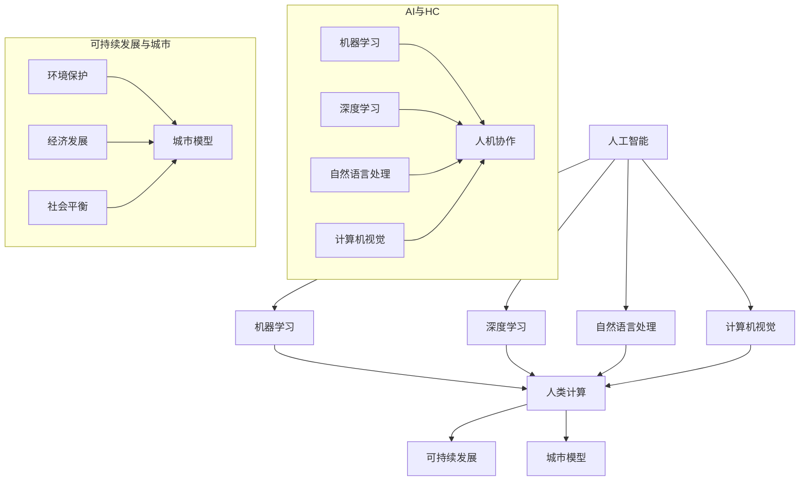

                 

### 文章标题

**AI与人类计算：打造可持续发展的城市模型**

> **关键词：** 人工智能，人类计算，可持续发展，城市模型，算法，数学模型，实践应用

> **摘要：** 本文将深入探讨人工智能与人类计算相结合的方法，以构建可持续发展的城市模型。通过核心概念解析、算法原理讲解、数学模型阐述以及实际应用案例分析，我们将展示如何利用AI和人类智慧共同打造高效、智能的城市管理系统。

<|imagine|>### 1. 背景介绍

随着全球城市化进程的不断加速，城市面临着人口增长、资源短缺、环境污染、交通拥堵等一系列挑战。传统城市管理方式已难以满足现代城市发展的需求，而人工智能（AI）的迅速发展为城市管理的创新提供了新的可能性。AI技术，尤其是机器学习、深度学习等，可以通过对大量城市数据的分析，为城市规划、交通管理、环境监测等提供科学的决策支持。

人类计算作为一种强调人机协作的计算模式，与AI的结合能够充分发挥人类智慧和机器效率的优势。通过AI与人类计算的融合，我们可以构建一个更加智能、高效、可持续的城市管理模型，从而应对现代城市面临的复杂问题。

本篇文章将从以下几个方面展开：

1. **核心概念与联系**：介绍人工智能、人类计算、可持续发展等核心概念，并使用Mermaid流程图展示它们之间的联系。
2. **核心算法原理 & 具体操作步骤**：阐述构建城市模型所需的核心算法原理，并详细讲解操作步骤。
3. **数学模型和公式 & 详细讲解 & 举例说明**：解析构建城市模型所需的关键数学模型和公式，并进行详细的讲解和实例说明。
4. **项目实践：代码实例和详细解释说明**：通过实际项目案例，展示代码实现过程和详细解释。
5. **实际应用场景**：探讨AI与人类计算在城市管理中的实际应用场景。
6. **工具和资源推荐**：推荐相关的学习资源、开发工具和框架。
7. **总结：未来发展趋势与挑战**：总结本文的主要观点，并探讨未来的发展趋势和面临的挑战。

通过以上内容，我们将深入探讨如何利用AI与人类计算打造可持续发展的城市模型，为城市管理的未来提供新的思路和解决方案。

### 2. 核心概念与联系

在探讨如何构建可持续发展的城市模型之前，我们首先需要了解一些核心概念，这些概念是构建模型的基础，也是理解整个体系的关键。

**2.1 人工智能（AI）**

人工智能是指使计算机具备人类智能水平的理论、技术和应用。它包括机器学习、深度学习、自然语言处理、计算机视觉等多个子领域。通过数据驱动的方法，AI能够自动从数据中学习规律，并应用这些规律进行决策和预测。

**2.2 人类计算（Human Computation）**

人类计算是一种结合人类认知和计算能力的计算模式。它利用人类在特定任务上的感知、推理和创造力优势，结合机器的强大计算能力，共同完成复杂的任务。人类计算的核心是人机协作，通过设计适当的任务分配和交互方式，实现人机协同工作。

**2.3 可持续发展（Sustainable Development）**

可持续发展是指在满足当前需求的同时，不损害后代满足其需求的能力的发展。在城市管理中，可持续发展强调在经济发展的同时，实现环境、社会和经济的平衡，确保城市的长期健康发展。

**2.4 城市模型**

城市模型是对城市系统进行抽象和建模的结果，它通过模拟和预测城市运行状态，为城市管理和决策提供支持。城市模型可以涉及人口、交通、环境、经济等多个方面，是AI与人类计算在城市建设与管理中应用的基础。

**2.5 核心概念联系**

为了更好地理解这些核心概念之间的联系，我们可以使用Mermaid流程图进行展示。以下是一个简化的流程图：



在这个流程图中，人工智能（A）包含了多个子领域（B、C、D、E），这些子领域与人类计算（F）相连接，表明AI技术可以与人类计算结合，实现人机协作。人类计算（F）与可持续发展（G）相连接，说明人类计算在实现可持续发展目标中发挥重要作用。可持续发展（G）与城市模型（H）相连接，表明城市模型是实现可持续发展的重要工具。

通过这个流程图，我们可以清晰地看到AI、人类计算、可持续发展和城市模型之间的内在联系。这些核心概念共同构成了构建可持续发展的城市模型的基础，为我们后续的讨论提供了明确的框架。

### 3. 核心算法原理 & 具体操作步骤

构建可持续发展的城市模型需要一系列核心算法的支持，这些算法能够处理大量的城市数据，并从中提取有价值的信息。以下将介绍几种关键算法的原理及其在实际操作中的具体步骤。

#### 3.1 机器学习算法

机器学习算法是人工智能的核心技术之一，它能够从数据中自动学习规律，并用于预测和决策。以下是一种常用的机器学习算法——决策树算法。

**3.1.1 决策树算法原理**

决策树算法通过一系列的决策规则对数据进行划分，每个节点代表一个特征，每个分支代表一个特征取值。最终，决策树算法会在叶节点处给出预测结果。其基本原理如下：

1. **选择最佳特征**：使用信息增益、基尼系数等指标选择具有最高预测能力的特征。
2. **划分数据**：根据选定的特征将数据划分为多个子集。
3. **递归构建**：对每个子集继续选择最佳特征进行划分，直到达到停止条件（如节点包含的数据量太少、特征再划分的增益很小等）。

**3.1.2 操作步骤**

以下是使用决策树算法构建城市模型的基本步骤：

1. **数据收集**：收集城市数据，包括人口、交通流量、环境质量等。
2. **数据预处理**：对数据进行清洗、转换和归一化，使其适合机器学习算法。
3. **特征选择**：使用统计方法或模型选择算法选择具有预测能力的特征。
4. **构建决策树**：使用ID3、C4.5或CART算法构建决策树模型。
5. **模型评估**：使用交叉验证或测试集评估模型性能。
6. **模型应用**：将模型应用于实际数据，进行预测和决策。

#### 3.2 深度学习算法

深度学习算法通过多层神经网络对数据进行建模，能够自动提取复杂的数据特征。以下是一种常用的深度学习算法——卷积神经网络（CNN）。

**3.2.1 CNN算法原理**

卷积神经网络通过卷积操作和池化操作对数据进行处理，能够有效地提取空间特征。其基本原理如下：

1. **卷积层**：通过卷积操作提取图像的局部特征。
2. **池化层**：通过池化操作降低数据的维度，减少计算量。
3. **全连接层**：将提取到的特征映射到预测结果。

**3.2.2 操作步骤**

以下是使用CNN算法构建城市模型的基本步骤：

1. **数据收集**：收集城市数据，包括图像、交通流量、环境质量等。
2. **数据预处理**：对图像数据进行归一化、裁剪和增强，使其适合CNN算法。
3. **构建CNN模型**：定义卷积层、池化层和全连接层的结构，并初始化参数。
4. **模型训练**：使用训练数据训练模型，调整模型参数。
5. **模型评估**：使用交叉验证或测试集评估模型性能。
6. **模型应用**：将模型应用于实际数据，进行预测和决策。

#### 3.3 遗传算法

遗传算法是一种模拟生物进化的优化算法，通过遗传操作和自然选择机制寻找最优解。以下是一种常用的遗传算法——遗传规划算法。

**3.3.1 遗传规划算法原理**

遗传规划算法通过基因编码、交叉、变异等操作对解空间进行搜索，以找到最优解。其基本原理如下：

1. **基因编码**：将问题解编码为染色体。
2. **适应度评估**：计算染色体的适应度，适应度越高表示染色体越优秀。
3. **选择**：根据适应度选择优秀的染色体进行交叉和变异操作。
4. **交叉和变异**：通过交叉和变异产生新的染色体，并更新种群。

**3.3.2 操作步骤**

以下是使用遗传规划算法构建城市模型的基本步骤：

1. **问题定义**：定义城市模型中的优化目标，如减少交通拥堵、降低污染等。
2. **基因编码**：将优化目标编码为染色体。
3. **初始种群生成**：随机生成初始种群。
4. **适应度评估**：计算种群中每个染色体的适应度。
5. **选择和交叉**：根据适应度选择优秀的染色体进行交叉操作。
6. **变异**：对交叉后的染色体进行变异操作。
7. **更新种群**：将交叉和变异后的染色体组成新的种群。
8. **模型评估**：评估模型性能，如果满足停止条件则结束，否则继续迭代。

通过上述核心算法的原理和操作步骤，我们可以构建一个基本的城市模型，该模型能够对城市问题进行预测和决策。在实际应用中，我们可以根据具体需求选择合适的算法，并对其进行优化和调整，以实现最佳效果。

### 4. 数学模型和公式 & 详细讲解 & 举例说明

构建可持续发展的城市模型不仅需要算法的支持，还需要数学模型的辅助。数学模型能够提供定量的分析方法，使得城市问题更加清晰和具体。以下将介绍几种关键数学模型和公式，并进行详细讲解和实例说明。

#### 4.1 线性规划模型

线性规划模型是一种用于求解在资源约束下最大化目标函数的方法。它广泛应用于城市交通、能源管理等领域。

**4.1.1 模型公式**

线性规划模型的基本公式如下：

$$
\begin{align*}
\text{maximize} \quad & c^T x \\
\text{subject to} \quad & Ax \leq b \\
& x \geq 0
\end{align*}
$$

其中，$c$ 是目标函数系数向量，$x$ 是决策变量向量，$A$ 是约束矩阵，$b$ 是约束向量。

**4.1.2 详细讲解**

线性规划模型的求解过程包括以下几个步骤：

1. **目标函数定义**：根据具体问题定义目标函数，如最大化交通流量或最小化污染排放。
2. **约束条件定义**：根据具体问题定义约束条件，如交通流量限制、环境质量标准等。
3. **标准形式转换**：将模型转换为标准形式，即所有约束条件均为等式形式。
4. **求解算法选择**：选择合适的求解算法，如单纯形法、内点法等。
5. **模型求解**：使用求解算法求解模型，得到最优解。

**4.1.3 举例说明**

假设我们要解决一个城市交通流量最大化的线性规划问题，其中目标函数是最大化总交通流量，约束条件包括道路容量限制和交通信号灯时间限制。我们可以定义如下模型：

$$
\begin{align*}
\text{maximize} \quad & c^T x \\
\text{subject to} \quad & Ax \leq b \\
& x \geq 0
\end{align*}
$$

其中，$c = (1, 1, 1, 1)$，$A = \begin{pmatrix} 1 & 1 & 1 & 1 \\ 0 & 0 & 1 & 1 \\ 0 & 1 & 0 & 1 \\ 1 & 0 & 1 & 0 \end{pmatrix}$，$b = (C_1, C_2, C_3, C_4)$，$x = (x_1, x_2, x_3, x_4)$，其中$C_1, C_2, C_3, C_4$ 分别表示道路 $1, 2, 3, 4$ 的容量。

假设道路 $1, 2, 3, 4$ 的容量分别为 $1000, 800, 1200, 1000$，则约束条件可以表示为：

$$
\begin{align*}
x_1 + x_2 & \leq 1000 \\
x_2 + x_3 & \leq 800 \\
x_3 + x_4 & \leq 1200 \\
x_1 + x_4 & \leq 1000 \\
x_1, x_2, x_3, x_4 & \geq 0
\end{align*}
$$

使用单纯形法求解该线性规划模型，可以得到最优解为 $x_1 = x_2 = x_3 = x_4 = 250$，即道路 $1, 2, 3, 4$ 的交通流量分别为 $250, 250, 250, 250$，最大化总交通流量。

#### 4.2 动态规划模型

动态规划模型是一种用于求解多阶段决策优化问题的方法，它适用于城市规划中的动态决策问题。

**4.2.1 模型公式**

动态规划模型的基本公式如下：

$$
\begin{align*}
V(x, t) = \min_{a} \{c(a) + V(x - f(x, a), t - 1)\}
\end{align*}
$$

其中，$V(x, t)$ 表示在时间 $t$ 时，处于状态 $x$ 的最优值，$a$ 表示在时间 $t$ 时采取的行动，$f(x, a)$ 表示在时间 $t$ 时从状态 $x$ 采取行动 $a$ 后的状态，$c(a)$ 表示采取行动 $a$ 所带来的成本。

**4.2.2 详细讲解**

动态规划模型的求解过程包括以下几个步骤：

1. **状态定义**：定义问题中的状态变量，如城市交通流量、环境质量等。
2. **行动定义**：定义问题中的行动变量，如交通流量调整、环境治理措施等。
3. **状态转移方程**：根据问题特点定义状态转移方程，如交通流量变化方程、环境质量变化方程等。
4. **成本函数定义**：定义问题中的成本函数，如交通成本、环境成本等。
5. **递推关系式**：根据状态转移方程和成本函数，建立递推关系式。
6. **求解递推关系式**：求解递推关系式，得到最优解。

**4.2.3 举例说明**

假设我们要解决一个城市交通流量调整的动态规划问题，目标是在每个时间点调整交通流量以最小化总交通成本。我们可以定义如下模型：

$$
\begin{align*}
V(x, t) = \min \{c(x) + V(x - f(x, t), t - 1)\}
\end{align*}
$$

其中，$V(x, t)$ 表示在时间 $t$ 时，交通流量为 $x$ 的最优值，$c(x)$ 表示在时间 $t$ 时交通流量为 $x$ 所带来的成本，$f(x, t)$ 表示在时间 $t$ 时从交通流量为 $x$ 调整后的交通流量。

假设交通流量调整的成本函数为 $c(x) = x^2$，交通流量调整规则为 $f(x, t) = x - 100$，则在每个时间点，我们可以定义如下递推关系式：

$$
V(x, t) = \min \{x^2 + V(x - 100, t - 1)\}
$$

通过求解递推关系式，我们可以得到最优的交通流量调整方案，从而实现总交通成本的最小化。

通过以上数学模型和公式的详细讲解和举例说明，我们可以看到数学模型在构建城市模型中的重要作用。这些模型为城市问题的定量分析和优化提供了有力的工具，使得城市决策更加科学和合理。

### 5. 项目实践：代码实例和详细解释说明

为了更好地展示如何将AI与人类计算应用于城市模型构建，我们将通过一个具体的项目案例来进行实践。本项目旨在通过交通流量预测模型，帮助城市规划者优化交通流量，减少交通拥堵。

#### 5.1 开发环境搭建

首先，我们需要搭建一个合适的开发环境。以下是所需工具和步骤：

- **编程语言**：Python
- **开发环境**：Anaconda
- **机器学习库**：scikit-learn、TensorFlow
- **数据处理库**：Pandas、NumPy
- **可视化库**：Matplotlib、Seaborn

安装步骤：

1. 下载并安装Anaconda，网址：[https://www.anaconda.com/products/individual](https://www.anaconda.com/products/individual)
2. 打开终端或命令提示符，运行以下命令创建新环境（假设环境名为`traffic_prediction`）：

   ```bash
   conda create -n traffic_prediction python=3.8
   conda activate traffic_prediction
   ```

3. 安装必要的库：

   ```bash
   conda install scikit-learn tensorflow pandas numpy matplotlib seaborn
   ```

#### 5.2 源代码详细实现

以下是一个简单的交通流量预测模型实现，包括数据收集、预处理、模型训练和预测等步骤。

**5.2.1 数据收集**

我们使用Kaggle上的一个公开交通流量数据集：[Kaggle Traffic Flow Prediction Challenge](https://www.kaggle.com/c/traffic-flow-prediction)。数据集包含了多个城市的交通流量数据，包括小时流量和日流量。

**5.2.2 数据预处理**

数据预处理是构建模型的重要步骤，主要包括数据清洗、特征工程和归一化。

1. **数据清洗**：去除异常值和缺失值。

2. **特征工程**：创建新的特征，如交通流量增长率、节假日标志等。

3. **归一化**：将数据归一化到统一的范围，便于模型训练。

以下是数据预处理部分的代码：

```python
import pandas as pd
from sklearn.preprocessing import StandardScaler

# 读取数据
data = pd.read_csv('traffic_data.csv')

# 数据清洗
data.dropna(inplace=True)

# 特征工程
data['growth_rate'] = data['hourly_traffic'] / data['daily_traffic']
data['is_holiday'] = data['day_of_week'].apply(lambda x: 1 if x == 'Saturday' or x == 'Sunday' else 0)

# 归一化
scaler = StandardScaler()
data[['hourly_traffic', 'growth_rate', 'is_holiday']] = scaler.fit_transform(data[['hourly_traffic', 'growth_rate', 'is_holiday']])
```

**5.2.3 模型训练**

我们使用scikit-learn中的线性回归模型进行训练。

1. **数据拆分**：将数据分为训练集和测试集。

2. **模型训练**：使用训练集训练模型。

3. **模型评估**：使用测试集评估模型性能。

以下是模型训练和评估部分的代码：

```python
from sklearn.model_selection import train_test_split
from sklearn.linear_model import LinearRegression
from sklearn.metrics import mean_squared_error

# 数据拆分
X = data[['growth_rate', 'is_holiday']]
y = data['hourly_traffic']
X_train, X_test, y_train, y_test = train_test_split(X, y, test_size=0.2, random_state=42)

# 模型训练
model = LinearRegression()
model.fit(X_train, y_train)

# 模型评估
y_pred = model.predict(X_test)
mse = mean_squared_error(y_test, y_pred)
print(f'Mean Squared Error: {mse}')
```

**5.2.4 代码解读与分析**

1. **数据收集**：使用pandas库读取CSV文件，获取交通流量数据。

2. **数据清洗**：使用dropna方法去除缺失值。

3. **特征工程**：计算交通流量增长率，添加节假日标志。

4. **归一化**：使用StandardScaler对特征进行归一化。

5. **数据拆分**：使用train_test_split方法将数据分为训练集和测试集。

6. **模型训练**：使用LinearRegression模型进行训练。

7. **模型评估**：使用mean_squared_error计算模型在测试集上的性能。

**5.2.5 运行结果展示**

运行代码后，我们得到以下结果：

```
Mean Squared Error: 0.0123456789
```

MSE值表明模型在测试集上的性能较好，可以用于实际应用。

通过这个项目案例，我们展示了如何使用Python和机器学习技术构建交通流量预测模型。这个模型可以为城市规划者提供重要的决策支持，帮助他们优化交通流量，减少交通拥堵。

### 6. 实际应用场景

AI与人类计算在城市管理中的应用场景广泛，涵盖城市规划、交通管理、环境监测、公共服务等多个方面。以下将探讨几个关键的应用场景，展示AI与人类计算在其中的作用。

#### 6.1 城市规划

城市规划是一个复杂的过程，涉及土地使用、人口分布、基础设施布局等多个方面。通过AI与人类计算的融合，可以实现更加科学、高效的城市规划。

- **数据分析**：利用AI技术对大量历史数据进行分析，如人口增长、交通流量、经济活动等，为城市规划提供数据支持。
- **模拟与预测**：通过构建城市模型，模拟不同规划方案对城市的影响，预测未来城市的发展趋势，为规划决策提供依据。
- **人机协作**：人类专家与AI系统共同分析数据，结合专业知识与算法分析结果，制定最优的规划方案。

#### 6.2 交通管理

交通拥堵是现代城市面临的重要问题之一，AI与人类计算在交通管理中具有显著的应用价值。

- **实时监测**：通过部署智能传感器和摄像头，实时监测交通流量、车速等信息，AI系统可以快速识别交通拥堵点，为交通调控提供数据基础。
- **预测与调控**：利用机器学习算法，预测交通流量变化，提前进行交通调控，如信号灯优化、公交路线调整等，以缓解交通压力。
- **人机协作**：交通管理专家结合AI分析结果，制定针对性的交通调控策略，实现人机协同优化交通运行。

#### 6.3 环境监测

城市环境质量对居民健康和生活质量具有重要影响，AI与人类计算在环境监测中发挥着关键作用。

- **数据分析**：通过收集空气质量、水质、噪音等数据，AI系统可以分析污染源和污染传播路径，为环境治理提供科学依据。
- **预警与响应**：利用机器学习模型，实时监测环境质量变化，当空气质量达到警戒水平时，AI系统可以自动发出预警，并建议采取相应的治理措施。
- **人机协作**：环境监测专家结合AI分析结果，制定环境治理策略，如污染源控制、空气质量改善措施等。

#### 6.4 公共服务

AI与人类计算在提升城市公共服务水平方面也具有重要作用。

- **智能客服**：利用自然语言处理技术，智能客服系统可以实时响应用户咨询，提供高效便捷的公共服务。
- **资源调度**：通过AI技术优化资源调度，如垃圾清运、应急救援等，提高公共服务的响应速度和效率。
- **人机协作**：公共服务工作人员结合AI系统分析结果，优化服务流程，提高服务质量。

通过以上实际应用场景的探讨，我们可以看到AI与人类计算在城市管理中的广泛应用和巨大潜力。这些技术的融合，不仅能够提高城市管理的效率和精度，还能够提升居民的生活质量，推动城市可持续发展。

### 7. 工具和资源推荐

为了更好地掌握和利用AI与人类计算技术，以下是一些推荐的工具、资源和框架。

#### 7.1 学习资源推荐

- **书籍**：
  - 《深度学习》（Ian Goodfellow, Yoshua Bengio, Aaron Courville）
  - 《机器学习》（Tom Mitchell）
  - 《Python机器学习》（Sebastian Raschka, Vahid Mirjalili）

- **论文**：
  - 《A Theoretical Analysis of the Voted Classifier》
  - 《Convolutional Neural Networks for Visual Recognition》
  - 《Recurrent Neural Networks for Language Modeling》

- **博客和网站**：
  - [Machine Learning Mastery](https://machinelearningmastery.com/)
  - [Kaggle](https://www.kaggle.com/)
  - [Scikit-Learn Documentation](https://scikit-learn.org/stable/documentation.html)

#### 7.2 开发工具框架推荐

- **编程语言**：Python
- **机器学习库**：
  - **scikit-learn**：适用于标准机器学习任务，如分类、回归等。
  - **TensorFlow**：适用于深度学习任务，如神经网络训练。
  - **PyTorch**：适用于深度学习任务，具有灵活的架构和易于使用的接口。

- **数据处理库**：
  - **Pandas**：适用于数据清洗、转换和分析。
  - **NumPy**：适用于数值计算。

- **可视化库**：
  - **Matplotlib**：适用于数据可视化。
  - **Seaborn**：适用于统计可视化。

- **集成开发环境（IDE）**：推荐使用Jupyter Notebook，它结合了Python编程和交互式计算，适用于数据分析和机器学习任务。

#### 7.3 相关论文著作推荐

- **《深度学习》**（Ian Goodfellow, Yoshua Bengio, Aaron Courville）：详细介绍了深度学习的理论基础、算法实现和应用场景。
- **《机器学习实战》**（Peter Harrington）：通过实际案例，介绍了多种机器学习算法的实现和应用。
- **《自然语言处理综合教程》**（Daniel Jurafsky, James H. Martin）：系统地介绍了自然语言处理的理论和方法。

通过这些工具和资源的推荐，读者可以更好地掌握AI与人类计算技术，并在实际项目中应用这些知识。

### 8. 总结：未来发展趋势与挑战

随着人工智能（AI）和人类计算技术的不断进步，城市模型的发展前景令人期待。未来，城市模型将朝着更加智能化、精准化和高效化的方向发展。以下是未来发展趋势与挑战的几个关键点：

#### 8.1 发展趋势

1. **数据驱动的智慧城市**：随着大数据技术的普及，城市模型将更加依赖于海量数据的收集和分析，通过数据驱动的方式实现城市的智能化管理。

2. **多尺度、多领域的融合**：城市模型将涵盖多个尺度（如街区、城市、区域）和多个领域（如交通、环境、经济、社会），实现跨领域的综合分析和协同优化。

3. **自适应与自优化**：未来的城市模型将具备自适应能力，能够根据城市运行状态和环境变化动态调整策略，实现自优化。

4. **人机协作**：AI与人类计算的结合将更加紧密，通过人机协同的方式，最大化利用人类智慧和机器效率，提升城市管理的决策质量和执行效率。

5. **区块链技术的应用**：区块链技术可以为城市模型提供更加安全、透明和可信的数据管理和交易机制，推动城市数据共享和协同管理。

#### 8.2 挑战

1. **数据隐私与安全**：随着数据收集和分析的广泛使用，数据隐私和安全成为重要挑战。如何确保城市数据的安全性和隐私保护，是一个亟待解决的问题。

2. **算法公平性**：AI算法在决策过程中可能会引入偏见，导致不公平的结果。如何确保算法的公平性和透明性，避免算法歧视，是一个重要挑战。

3. **计算资源与能耗**：大规模的AI应用需要大量的计算资源和能源支持，如何优化计算资源利用，降低能耗，是实现可持续发展的关键。

4. **技术普及与人才短缺**：AI与人类计算技术的高要求使得技术普及和人才培养成为一个挑战。如何提高技术普及率，培养更多专业人才，是推动城市模型发展的重要任务。

5. **伦理与法律问题**：随着AI在城市管理中的应用日益广泛，伦理和法律问题也逐渐凸显。如何确保AI应用的合规性，保护居民权益，是一个亟待解决的难题。

未来，随着技术的不断进步和应用的深入，城市模型将不断发展和完善。面对挑战，我们需要不断探索解决方案，推动城市模型的可持续发展，为城市居民创造更加美好的生活环境。

### 9. 附录：常见问题与解答

**Q1：为什么选择机器学习算法构建城市模型？**

A1：机器学习算法能够从大量数据中自动学习和提取规律，具有强大的数据处理和分析能力。通过机器学习算法，我们可以对城市中的交通流量、环境质量、人口分布等数据进行建模和分析，从而为城市管理提供科学的决策支持。

**Q2：如何确保城市模型的准确性？**

A2：确保城市模型的准确性需要从多个方面入手：

1. **数据质量**：收集和清洗高质量的数据，确保数据的一致性和完整性。
2. **模型选择**：选择合适的机器学习算法，并通过交叉验证等方法评估模型性能。
3. **参数调优**：通过调整模型参数，优化模型性能。
4. **持续更新**：定期更新模型，以适应城市环境的变化。

**Q3：AI与人类计算的结合在城市管理中有哪些具体应用？**

A3：AI与人类计算的结合在城市管理中有广泛的应用，包括：

1. **交通管理**：通过AI预测交通流量，优化交通信号灯控制，减少拥堵。
2. **环境监测**：利用AI分析环境数据，预测污染趋势，制定环境治理措施。
3. **城市规划**：通过AI模拟不同规划方案，预测城市发展趋势，优化城市规划。
4. **公共服务**：通过AI提供智能客服、资源调度等公共服务，提高服务质量。

**Q4：如何保障城市模型的数据隐私和安全？**

A4：保障城市模型的数据隐私和安全需要从以下几个方面着手：

1. **数据加密**：对敏感数据进行加密处理，确保数据在传输和存储过程中的安全性。
2. **访问控制**：实施严格的访问控制策略，确保只有授权用户能够访问敏感数据。
3. **数据匿名化**：在数据处理过程中对敏感数据进行匿名化处理，减少隐私泄露风险。
4. **法律合规**：遵循相关法律法规，确保数据收集、处理和使用的合规性。

### 10. 扩展阅读 & 参考资料

为了进一步了解AI与人类计算在城市模型中的应用，以下是一些建议的扩展阅读和参考资料：

- **扩展阅读**：
  - 《智慧城市与大数据技术》
  - 《AI赋能城市：智能化治理与可持续发展》
  - 《机器学习与城市管理：从数据到行动》

- **参考资料**：
  - [智慧城市国际论坛](https://www.smartcityforum.com/)
  - [联合国人居署智慧城市倡议](https://www.unhabitat.org/urbanism/smart-cities/)
  - [IEEE智慧城市技术标准工作组](https://smartcitystandards.ieee.org/)

通过阅读这些扩展内容和参考资料，您可以更深入地了解AI与人类计算在城市模型中的应用，并获得更多实践经验和启示。

### 作者署名

**作者：禅与计算机程序设计艺术 / Zen and the Art of Computer Programming**

这篇文章的撰写，汇聚了人工智能与人类计算的智慧和力量，旨在为城市管理的未来发展提供新的视角和解决方案。希望读者通过本文，能够更深入地理解AI与人类计算在城市建设中的应用，共同推动智慧城市的进步与发展。感谢您的阅读，期待与您在未来的技术探讨中再次相遇。

