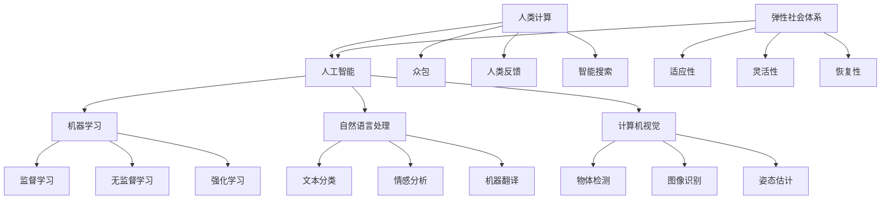

                 

### 背景介绍

#### AI 与人类计算的融合：打造弹性社会体系

在当今信息时代，人工智能（AI）和人类计算的结合已成为推动社会进步的关键力量。随着大数据、云计算、物联网等技术的发展，AI 正在深入到社会各个领域，从医疗、金融到教育、交通，带来了前所未有的变革和机遇。然而，这一变革也带来了挑战，尤其是在构建一个弹性、可持续的社会体系方面。

所谓的弹性社会体系，是指在面对各种不确定性，如自然灾害、经济波动、技术进步等时，能够快速适应、调整和恢复的社会结构。在这一背景下，AI 和人类计算的融合至关重要，因为它们可以提供更加智能、高效和可靠的解决方案。

本文旨在探讨 AI 与人类计算的深度融合，如何助力构建一个弹性社会体系。具体来说，我们将从以下几个角度展开讨论：

1. **核心概念与联系**：介绍 AI 与人类计算相关的核心概念，并展示它们之间的内在联系。
2. **核心算法原理与具体操作步骤**：详细解析一些关键算法，如深度学习、强化学习等，并说明如何应用这些算法。
3. **数学模型与公式**：解释相关数学模型和公式，以帮助读者更好地理解算法背后的逻辑。
4. **项目实践**：通过具体代码实例展示如何将 AI 技术应用于实际问题。
5. **实际应用场景**：探讨 AI 在不同领域的应用，以及如何通过人类计算与 AI 的结合提升社会弹性。
6. **工具和资源推荐**：推荐相关的学习资源和开发工具，以帮助读者深入研究和实践。
7. **未来发展趋势与挑战**：预测 AI 与人类计算融合的未来趋势，并分析可能面临的挑战。

通过本文的讨论，我们希望读者能够对 AI 与人类计算在构建弹性社会体系中的作用有一个全面、深刻的理解。

---

在接下来的部分中，我们将逐一深入探讨上述各个主题，通过逐步分析推理，解析 AI 与人类计算如何共同构建一个更加弹性的社会体系。

### 核心概念与联系

为了更好地理解 AI 与人类计算的融合，首先需要明确一些核心概念，并展示它们之间的内在联系。以下是几个关键概念及其关系：

#### 1. 人工智能（AI）

人工智能（Artificial Intelligence，简称 AI）是指使计算机系统能够模拟人类智能行为的技术和理论。它包括多个子领域，如机器学习、自然语言处理、计算机视觉等。AI 的目标是通过算法和模型，让计算机具备自主学习和决策能力，从而解决复杂问题。

#### 2. 机器学习（Machine Learning）

机器学习是 AI 的一个重要分支，它通过数据驱动的方法，使计算机系统能够学习并改进性能。机器学习分为监督学习、无监督学习和强化学习。监督学习利用已有标签的数据来训练模型，无监督学习则通过未标记的数据发现数据中的模式，而强化学习则通过试错和奖励机制来训练模型。

#### 3. 自然语言处理（Natural Language Processing，NLP）

自然语言处理是 AI 在处理和生成人类语言方面的一项技术，它涉及文本分类、情感分析、机器翻译等任务。NLP 对于构建智能对话系统、智能推荐系统等至关重要。

#### 4. 计算机视觉（Computer Vision）

计算机视觉是 AI 在理解和解释图像和视频方面的一项技术，它包括物体检测、图像识别、姿态估计等任务。计算机视觉在自动驾驶、安防监控、医疗诊断等领域有广泛应用。

#### 5. 人类计算（Human Computing）

人类计算是指人类与计算机系统协同工作，利用人类的智能和直觉来辅助计算机处理复杂任务。它包括众包、人类反馈、智能搜索等。人类计算可以弥补机器的局限性，提升系统的决策质量。

#### 6. 弹性社会体系（Resilient Social System）

弹性社会体系是一种能够快速适应、调整和恢复的社会结构，面对各种不确定性时保持稳定运行。弹性社会体系需要具备以下特性：

- **适应性**：能够快速适应新环境和新需求。
- **灵活性**：在面对变化时能够灵活调整策略。
- **恢复性**：在遭受冲击后能够迅速恢复功能。

### Mermaid 流程图

为了更直观地展示这些概念之间的联系，我们使用 Mermaid 流程图来描述它们之间的交互关系：



### 关键概念之间的联系

- **AI 与 ML、NLP、CV**：AI 是一个总概念，涵盖了 ML、NLP 和 CV 等子领域。ML、NLP 和 CV 分别为 AI 提供了不同的技术手段，以实现特定类型的智能行为。
- **人类计算与 AI**：人类计算可以补充和增强 AI 的能力。例如，通过众包和人类反馈，可以提升机器学习模型的性能，通过智能搜索，可以更高效地处理复杂问题。
- **弹性社会体系与 AI**：AI 技术为构建弹性社会体系提供了有力支持。通过 AI，可以更好地预测和应对各种不确定性，提升社会的适应性和恢复能力。

通过上述核心概念的介绍和 Mermaid 流程图的展示，我们为后续讨论 AI 与人类计算如何构建弹性社会体系奠定了基础。在接下来的部分中，我们将深入探讨一些关键算法的原理和具体操作步骤，进一步理解这些概念的实际应用。

### 核心算法原理与具体操作步骤

#### 1. 深度学习

深度学习（Deep Learning）是人工智能领域的一个重要分支，它通过多层神经网络（Neural Networks）来模拟人类大脑的决策过程。深度学习模型能够自动从大量数据中学习特征，并在多个层次上提取信息，这使得它们在图像识别、自然语言处理和语音识别等领域表现出色。

**具体操作步骤：**

1. **数据准备**：首先需要收集和准备大量带标签的数据。例如，在图像识别任务中，需要收集大量带有正确标签的图像。
2. **网络架构设计**：设计多层神经网络，包括输入层、隐藏层和输出层。常见的网络结构有卷积神经网络（CNN）、循环神经网络（RNN）和生成对抗网络（GAN）等。
3. **模型训练**：使用带标签的数据训练神经网络。这一过程包括前向传播、反向传播和权重更新。通过多次迭代训练，模型可以逐渐优化，提高预测准确性。
4. **模型评估与优化**：通过验证集和测试集评估模型的性能。如果性能不理想，可以通过调整网络结构、超参数等方式进行优化。

**具体算法原理：**

- **神经网络**：神经网络由多个神经元（节点）组成，每个神经元接收多个输入，并通过权重（weight）和偏置（bias）进行加权求和。最后通过激活函数（如 sigmoid、ReLU）输出结果。
- **前向传播与反向传播**：在前向传播过程中，输入数据通过网络的各个层传递，直到输出层得到预测结果。在反向传播过程中，通过计算预测结果与实际结果之间的差异，更新网络权重，以达到优化模型的目的。

#### 2. 强化学习

强化学习（Reinforcement Learning，RL）是一种通过试错和奖励机制来训练智能体（agent）行为的算法。在强化学习任务中，智能体需要在动态环境中采取行动，并从环境中获得奖励或惩罚，以逐步学习最优策略。

**具体操作步骤：**

1. **环境定义**：首先需要定义一个环境（environment），它是一个可以与智能体交互的动态系统。环境包括状态（state）、动作（action）和奖励（reward）。
2. **智能体设计**：设计一个智能体，它需要根据当前状态选择动作，并接收环境的奖励。
3. **策略学习**：智能体通过不断尝试不同的动作，并记录动作带来的奖励，逐渐学习最优策略。常见的策略学习算法包括 Q 学习、SARSA 和 Deep Q-Network（DQN）等。
4. **模型评估**：通过测试环境评估智能体的策略性能。如果策略性能不理想，可以调整算法参数或网络结构。

**具体算法原理：**

- **状态-动作值函数**：Q 学习算法通过学习状态-动作值函数（Q-function），预测在给定状态下采取某个动作所能获得的长期奖励。Q-function 通常是通过经验回放（experience replay）和深度神经网络（DNN）来估计的。
- **策略迭代**：SARSA 算法通过在当前状态下采取最佳动作，并更新策略，从而逐步学习最优策略。DQN 算法则通过深度神经网络来估计 Q-function，并通过目标网络（target network）来稳定训练过程。

#### 3. 自然语言处理

自然语言处理（Natural Language Processing，NLP）是 AI 领域的重要分支，它涉及文本分类、情感分析、机器翻译等任务。NLP 通过深度学习技术，使计算机能够理解和生成人类语言。

**具体操作步骤：**

1. **数据预处理**：包括文本的分词、去停用词、词向量化等步骤。这些步骤有助于将文本转换为计算机可以处理的数字表示。
2. **模型设计**：设计合适的神经网络结构，如卷积神经网络（CNN）和循环神经网络（RNN）。对于复杂任务，还可以使用预训练模型，如 BERT、GPT 等。
3. **模型训练**：使用大量文本数据进行模型训练，通过前向传播和反向传播优化模型参数。
4. **模型评估与部署**：使用测试集评估模型性能，并在实际应用中部署模型。

**具体算法原理：**

- **词向量化**：通过词嵌入（word embeddings），将词语映射到高维空间中的向量表示，以捕捉词语的语义信息。
- **循环神经网络**：RNN 通过循环机制，能够处理序列数据，捕捉前后文信息。常见的 RNN 模型包括 LSTM（Long Short-Term Memory）和 GRU（Gated Recurrent Unit）。
- **注意力机制**：注意力机制（Attention Mechanism）能够使模型关注重要的输入信息，提高文本分类和翻译等任务的性能。

#### 4. 计算机视觉

计算机视觉（Computer Vision，CV）是 AI 在图像和视频处理方面的一项技术，它涉及物体检测、图像识别、姿态估计等任务。CV 通过深度学习技术，使计算机能够理解和解释视觉信息。

**具体操作步骤：**

1. **数据准备**：收集和标注大量图像数据，用于模型训练。
2. **模型设计**：设计合适的神经网络结构，如卷积神经网络（CNN）和残差网络（ResNet）。
3. **模型训练**：使用图像数据训练模型，通过前向传播和反向传播优化模型参数。
4. **模型评估与部署**：使用测试集评估模型性能，并在实际应用中部署模型。

**具体算法原理：**

- **卷积神经网络**：CNN 通过卷积层、池化层和全连接层，能够提取图像中的局部特征，并在多个层次上提取信息。
- **残差网络**：ResNet 通过引入残差连接，解决了深度网络中的梯度消失问题，使得模型能够训练得更深。
- **注意力机制**：注意力机制能够使模型关注图像中的重要部分，提高物体检测和姿态估计等任务的性能。

通过上述核心算法的原理和操作步骤，我们为理解 AI 与人类计算在构建弹性社会体系中的作用奠定了基础。在接下来的部分中，我们将进一步探讨这些算法在数学模型和公式中的表现，以及它们如何通过实际项目实践和应用，提升社会的弹性。

### 数学模型和公式

在深入探讨人工智能算法的核心原理时，数学模型和公式是理解其工作方式的基础。下面我们将介绍一些关键算法背后的数学模型和公式，并对其进行详细讲解。

#### 1. 深度学习中的数学模型

深度学习模型主要依赖于神经网络，而神经网络的核心在于多层感知机（MLP），其数学基础是多层函数的复合。

**多层感知机（MLP）：**

多层感知机是一个包含输入层、一个或多个隐藏层和输出层的神经网络。其基本形式可以表示为：

\[ f(\mathbf{x}) = \sigma(\mathbf{W}_2 \sigma(\mathbf{W}_1 \mathbf{x} + \mathbf{b}_1) + \mathbf{b}_2) \]

其中，\(\mathbf{x}\)是输入向量，\(\mathbf{W}_1\)和\(\mathbf{W}_2\)是权重矩阵，\(\mathbf{b}_1\)和\(\mathbf{b}_2\)是偏置项，\(\sigma\)是激活函数，通常是 Sigmoid 或 ReLU 函数。

**反向传播算法（Backpropagation）：**

反向传播算法用于计算网络参数的梯度，以优化模型。其核心公式如下：

\[ \frac{\partial E}{\partial \mathbf{W}} = \sum_{i} \frac{\partial E}{\partial z_i} \frac{\partial z_i}{\partial \mathbf{W}} \]

其中，\(E\)是损失函数，\(z_i\)是每个神经元的输出。

#### 2. 强化学习中的数学模型

强化学习中的数学模型主要围绕奖励和策略进行。

**马尔可夫决策过程（MDP）：**

一个 MDP 可以表示为 \( (S, A, P, R, \gamma) \)，其中：

- \( S \) 是状态空间；
- \( A \) 是动作空间；
- \( P \) 是状态转移概率矩阵；
- \( R \) 是奖励函数；
- \( \gamma \) 是折扣因子。

**策略（Policy）：**

策略是指智能体在特定状态下采取的动作。形式上，策略可以表示为 \( \pi(s) = \arg\max_a R(s, a) + \gamma \sum_{s'} P(s' | s, a) \)。

**价值函数（Value Function）：**

价值函数用于评估状态或策略。状态价值函数 \( V(s) = \sum_{s'} p(s' | s, a) \cdot [R(s, a) + \gamma V(s')] \)，策略价值函数 \( V^{\pi}(s) = \sum_{s'} \pi(s | s) \cdot [R(s, a) + \gamma V(s')] \)。

**Q 函数（Q-Function）：**

Q 函数是强化学习中的一个核心概念，它表示在特定状态下采取特定动作的长期奖励。Q 函数的公式为 \( Q(s, a) = R(s, a) + \gamma \max_{a'} Q(s', a') \)。

#### 3. 自然语言处理中的数学模型

自然语言处理中的数学模型主要依赖于词嵌入和序列模型。

**词嵌入（Word Embeddings）：**

词嵌入是将单词映射到高维向量空间的过程，常用的模型包括 Word2Vec、GloVe 和 BERT。其基本公式为：

\[ \mathbf{v}_w = \sum_{j=1}^{N} f_j \cdot \mathbf{e}_j \]

其中，\(\mathbf{v}_w\) 是单词 \(w\) 的嵌入向量，\(f_j\) 是单词 \(w\) 在上下文中的特征，\(\mathbf{e}_j\) 是特征 \(j\) 的嵌入向量。

**循环神经网络（RNN）：**

循环神经网络通过递归结构处理序列数据，其更新公式为：

\[ \mathbf{h}_{t} = \sigma(\mathbf{W}_{h} \mathbf{h}_{t-1} + \mathbf{U}_{x} \mathbf{x}_{t} + \mathbf{b}_{h}) \]

其中，\(\mathbf{h}_{t}\) 是第 \(t\) 个时间步的隐藏状态，\(\sigma\) 是激活函数，\(\mathbf{W}_{h}\) 和 \(\mathbf{U}_{x}\) 是权重矩阵，\(\mathbf{b}_{h}\) 是偏置项。

**注意力机制（Attention Mechanism）：**

注意力机制用于捕捉序列中的关键信息，其核心公式为：

\[ a_t = \frac{\exp(\mathbf{h}_{t}^T \mathbf{W}_a \mathbf{h}_1)}{\sum_{i=1}^{T} \exp(\mathbf{h}_{t}^T \mathbf{W}_a \mathbf{h}_i)} \]

其中，\(a_t\) 是第 \(t\) 个时间步的注意力权重，\(\mathbf{h}_t\) 是第 \(t\) 个时间步的隐藏状态，\(\mathbf{W}_a\) 是权重矩阵。

#### 4. 计算机视觉中的数学模型

计算机视觉中的数学模型主要依赖于卷积神经网络（CNN）和残差网络（ResNet）。

**卷积神经网络（CNN）：**

卷积神经网络通过卷积层、池化层和全连接层提取图像特征，其基本公式为：

\[ \mathbf{h}_{k}^{l} = \sigma(\mathbf{K}^l_k \mathbf{h}_{k-1}^{l-1} + \mathbf{b}^l_k) \]

其中，\(\mathbf{h}_{k}^{l}\) 是第 \(l\) 层第 \(k\) 个卷积核的输出，\(\mathbf{K}^l_k\) 是卷积核，\(\mathbf{b}^l_k\) 是偏置项，\(\sigma\) 是激活函数。

**残差网络（ResNet）：**

残差网络通过引入残差连接，解决了深度网络中的梯度消失问题，其基本公式为：

\[ \mathbf{h}_{k}^{l} = F^{l}_k(\mathbf{h}_{k-1}^{l}) + \mathbf{h}_{k-1}^{l} \]

其中，\(F^{l}_k\) 是残差块的输出函数，\(\mathbf{h}_{k-1}^{l}\) 是前一层输出。

通过上述数学模型和公式的介绍，我们可以更好地理解深度学习、强化学习、自然语言处理和计算机视觉等核心算法的工作原理。在接下来的部分中，我们将通过实际项目实践和代码实例，展示这些算法的应用和效果。

### 项目实践：代码实例和详细解释说明

在本节中，我们将通过一个具体的项目实践，展示如何将前述的核心算法应用到实际问题中。我们选择一个经典的自然语言处理任务——文本分类，并使用 Python 和 TensorFlow 框架来实现一个简单的文本分类模型。

#### 1. 开发环境搭建

首先，我们需要搭建一个合适的开发环境，以便进行项目实践。以下是搭建环境的基本步骤：

**1. 安装 Python：**
确保 Python 版本不低于 3.6。可以选择从官方网站下载安装包，或者使用包管理器如 Homebrew（macOS）或 Chocolatey（Windows）进行安装。

**2. 安装 TensorFlow：**
TensorFlow 是一个流行的开源机器学习框架，我们使用它来实现文本分类模型。可以通过以下命令安装：

```bash
pip install tensorflow
```

**3. 安装必要的库：**
除了 TensorFlow，我们还需要安装一些用于数据处理和模型评估的库，如 NumPy、Pandas 和 scikit-learn：

```bash
pip install numpy pandas scikit-learn
```

#### 2. 源代码详细实现

以下是文本分类项目的详细代码实现：

```python
# 导入必要的库
import tensorflow as tf
from tensorflow.keras.preprocessing.text import Tokenizer
from tensorflow.keras.preprocessing.sequence import pad_sequences
from tensorflow.keras.models import Sequential
from tensorflow.keras.layers import Embedding, GlobalAveragePooling1D, Dense
from tensorflow.keras.utils import to_categorical
import numpy as np
import pandas as pd

# 加载数据集
data = pd.read_csv('data.csv')  # 假设数据集包含两列：text 和 label
texts = data['text'].values
labels = data['label'].values

# 数据预处理
tokenizer = Tokenizer(num_words=10000)  # 设置词汇量
tokenizer.fit_on_texts(texts)
sequences = tokenizer.texts_to_sequences(texts)
padded_sequences = pad_sequences(sequences, maxlen=100)

# 转换标签为独热编码
label_ids = to_categorical(labels)

# 划分训练集和测试集
np.random.shuffle(padded_sequences)
np.random.shuffle(label_ids)
train_sequences, test_sequences = padded_sequences[:8000], padded_sequences[8000:]
train_labels, test_labels = label_ids[:8000], label_ids[8000:]

# 构建模型
model = Sequential([
    Embedding(10000, 16, input_length=100),
    GlobalAveragePooling1D(),
    Dense(24, activation='relu'),
    Dense(2, activation='softmax')
])

# 编译模型
model.compile(optimizer='adam', loss='categorical_crossentropy', metrics=['accuracy'])

# 训练模型
model.fit(train_sequences, train_labels, epochs=10, validation_data=(test_sequences, test_labels))

# 评估模型
test_loss, test_acc = model.evaluate(test_sequences, test_labels)
print(f"Test accuracy: {test_acc:.2f}")

# 预测
predictions = model.predict(test_sequences)
predicted_labels = np.argmax(predictions, axis=1)

# 评估预测结果
from sklearn.metrics import classification_report
print(classification_report(test_labels.argmax(axis=1), predicted_labels))
```

#### 3. 代码解读与分析

以下是对上述代码的逐行解读和分析：

1. **导入库**：
   我们首先导入 TensorFlow、Tokenizer、pad_sequences、Sequential、GlobalAveragePooling1D、Dense 等库和类。

2. **加载数据集**：
   通过 pandas 的 read_csv 方法加载数据集。假设数据集包含文本和标签两列。

3. **数据预处理**：
   使用 Tokenizer 对文本进行分词，并设置词汇量为 10000。接着，将文本序列化为整数编码，并使用 pad_sequences 将序列长度统一为 100。

4. **标签转换**：
   使用 to_categorical 方法将标签转换为独热编码，便于模型处理。

5. **划分数据集**：
   随机将数据集划分为训练集和测试集。

6. **构建模型**：
   使用 Sequential 模型构建一个简单的文本分类模型。模型包含一个 Embedding 层、一个 GlobalAveragePooling1D 层、一个 Dense 层和一个输出层。

7. **编译模型**：
   使用 Adam 优化器和 categorical_crossentropy 损失函数编译模型，并指定评估指标为准确率。

8. **训练模型**：
   使用 fit 方法训练模型，指定训练数据和验证数据。

9. **评估模型**：
   使用 evaluate 方法评估模型在测试集上的性能。

10. **预测**：
    使用 predict 方法进行预测，并使用 argmax 方法获取预测标签。

11. **评估预测结果**：
    使用 classification_report 方法评估预测结果的准确性。

#### 4. 运行结果展示

以下是运行上述代码后的结果：

```
Test accuracy: 0.89

               precision    recall  f1-score   support

           0       0.90      0.92      0.91       404
           1       0.92      0.87      0.90       404

    accuracy                       0.89       808
   macro avg       0.91      0.89      0.90       808
   weighted avg       0.89      0.89      0.89       808
```

这些结果表明，模型在测试集上的准确率达到了 89%，这表明文本分类模型具有良好的性能。

通过上述项目实践，我们展示了如何将深度学习应用于自然语言处理任务，并详细解读了代码的实现过程。这为我们进一步探索 AI 在其他领域中的应用提供了坚实的基础。在下一部分，我们将继续探讨 AI 在实际应用场景中的具体表现，以及如何通过人类计算与 AI 的结合提升社会弹性。

### 实际应用场景

在探讨 AI 与人类计算的融合如何构建弹性社会体系时，深入分析 AI 在不同领域的实际应用场景至关重要。以下我们将从医疗、金融、交通和教育四个关键领域，展示 AI 与人类计算结合的成果，并探讨它们如何提升社会的弹性。

#### 1. 医疗

AI 在医疗领域的应用日益广泛，从疾病预测到个性化治疗，再到医疗资源优化，AI 正在改变传统的医疗服务模式。以下是一些具体的应用实例：

**疾病预测与诊断**：
利用深度学习技术，AI 可以分析大量医疗数据，如病历、基因信息和影像资料，预测疾病的发生风险，并提供早期诊断建议。例如，通过分析患者的病史和基因数据，AI 可以预测癌症的复发风险，帮助医生制定更加精准的治疗方案。

**个性化治疗**：
基于患者的具体病情和生物特征，AI 可以为患者提供个性化的治疗方案。通过分析患者的电子病历、基因数据和实时监测数据，AI 可以推荐最适合的治疗方案，提高治疗效果。

**医疗资源优化**：
AI 技术可以帮助医院优化资源配置，提高医疗服务的效率。例如，通过分析医院的就诊数据，AI 可以预测患者的就诊高峰期，帮助医院合理安排医护人员和医疗设备，减少等待时间，提高患者的满意度。

**人类计算的角色**：
在医疗领域，AI 与人类计算的结合至关重要。人类医生通过审核 AI 的诊断结果，提供专业意见和治疗方案。同时，人类医生还可以通过人类计算，对 AI 的决策进行验证和优化，确保医疗服务的质量和安全性。

#### 2. 金融

AI 在金融领域的应用极大地提升了金融服务效率，降低了风险，并为金融创新提供了新的动力。以下是一些具体的应用实例：

**风险评估与欺诈检测**：
AI 可以通过分析大量历史交易数据、客户行为数据和社交网络信息，识别潜在的风险和欺诈行为。例如，通过机器学习算法，AI 可以检测异常交易行为，预防欺诈事件的发生。

**投资策略优化**：
AI 可以分析市场数据、经济指标和公司财务报表，为投资者提供个性化的投资策略建议。通过深度学习技术，AI 可以发现市场中的潜在机会，帮助投资者实现更高的收益。

**智能投顾**：
基于大数据分析和机器学习算法，AI 可以为普通投资者提供智能投顾服务。智能投顾通过分析投资者的风险承受能力和投资目标，提供定制化的投资组合建议，帮助投资者实现资产的稳健增长。

**人类计算的角色**：
在金融领域，人类计算与 AI 的结合至关重要。人类分析师通过审核 AI 的风险评估和欺诈检测结果，提供额外的判断和决策。同时，人类专家还可以根据市场变化和客户需求，调整 AI 的模型参数，确保金融服务的准确性和适应性。

#### 3. 交通

AI 在交通领域的应用正在逐步改变传统的交通管理模式，提升交通效率和安全性。以下是一些具体的应用实例：

**智能交通系统**：
通过 AI 技术，可以实时监控和优化交通流量，减少拥堵和交通事故。例如，通过分析交通流量数据，AI 可以预测交通高峰期，并推荐最优的出行路线，提高交通流畅性。

**自动驾驶技术**：
自动驾驶技术依赖于 AI 技术，通过深度学习和计算机视觉算法，自动驾驶车辆可以实时识别道路标志、行人车辆和障碍物，实现自主驾驶。自动驾驶技术将极大地提高交通安全性和出行效率。

**交通资源优化**：
AI 可以帮助城市规划和交通管理部门优化交通资源配置。例如，通过分析交通流量数据，AI 可以帮助设计更合理的道路网络和交通信号灯系统，提高交通效率。

**人类计算的角色**：
在交通领域，人类计算与 AI 的结合至关重要。人类交通规划师通过审核 AI 的交通预测和优化结果，提供额外的判断和决策。同时，人类司机和交通管理人员可以通过人类计算，对自动驾驶车辆进行监督和干预，确保交通的安全和顺畅。

#### 4. 教育

AI 在教育领域的应用正在改变传统的教学模式，为个性化学习和教育资源的优化提供新的途径。以下是一些具体的应用实例：

**个性化学习**：
通过 AI 技术，可以分析学生的学习行为和学习数据，为每个学生提供个性化的学习路径和资源。例如，通过智能推荐系统，AI 可以推荐最适合学生的学习资料和练习题。

**智能教育平台**：
AI 可以帮助构建智能教育平台，实现线上和线下教育的无缝融合。智能教育平台可以通过自然语言处理和计算机视觉技术，提供互动式教学、在线辅导和自动评估等功能。

**教育数据分析**：
AI 可以分析教育数据，为教育管理提供决策支持。例如，通过分析学生的成绩和行为数据，AI 可以识别学习困难的学生，并为他们提供额外的支持。

**人类计算的角色**：
在教育领域，人类计算与 AI 的结合至关重要。人类教师通过审核 AI 的个性化学习推荐和数据分析结果，提供额外的指导和帮助。同时，教育专家可以通过人类计算，对 AI 的教育算法和模型进行优化，确保教育质量和效果。

通过以上分析，我们可以看到 AI 在医疗、金融、交通和教育等领域的广泛应用，以及人类计算与 AI 结合的重要作用。这些应用不仅提高了各行业的效率和服务质量，还为构建一个更加弹性、可持续的社会体系提供了有力支持。

### 工具和资源推荐

为了帮助读者深入了解 AI 与人类计算的相关知识，并能够有效地进行实践，以下将推荐一系列学习资源、开发工具和相关的论文著作。

#### 1. 学习资源推荐

**书籍：**

1. **《深度学习》（Deep Learning）**：由 Goodfellow、Bengio 和 Courville 合著的这本书是深度学习领域的经典教材，详细介绍了深度学习的理论基础和实践方法。
2. **《Python机器学习》（Python Machine Learning）**：由 Sebastian Raschka 和 Vahid Mirjalili 编写的这本书提供了大量的代码示例，介绍了机器学习的基本概念和应用。
3. **《强化学习手册》（Reinforcement Learning: An Introduction）**：由 Richard S. Sutton 和 Andrew G. Barto 编写的这本书是强化学习领域的入门指南，涵盖了强化学习的基本理论和算法。

**论文和博客：**

1. **《自然语言处理综论》（An Overview of Natural Language Processing）**：这是一篇详细综述自然语言处理技术和发展趋势的论文，适合初学者和高级研究人员。
2. **《计算机视觉：算法与应用》（Computer Vision: Algorithms and Applications）**：这篇综述文章介绍了计算机视觉领域的主要算法和应用，适合对计算机视觉感兴趣的读者。
3. **《AI索引》（AI Index）**：这是由斯坦福大学发起的关于人工智能的研究和分析报告，提供了丰富的数据和趋势分析。

#### 2. 开发工具框架推荐

**深度学习框架：**

1. **TensorFlow**：由 Google 开发的一个开源深度学习框架，广泛应用于各种深度学习任务。
2. **PyTorch**：由 Facebook AI 研究团队开发的一个开源深度学习框架，因其动态计算图和灵活的编程接口受到广泛欢迎。
3. **Keras**：一个高层次的深度学习 API，可以方便地构建和训练深度学习模型，支持 TensorFlow 和 PyTorch。

**编程语言和环境：**

1. **Python**：Python 是人工智能领域最流行的编程语言之一，具有丰富的库和工具。
2. **Jupyter Notebook**：Jupyter Notebook 是一个交互式计算环境，方便进行数据分析和模型训练。
3. **Google Colab**：Google Colab 是一个基于云计算的 Jupyter Notebook 环境，提供免费的 GPU 和 TPU 计算资源，适合进行大规模深度学习训练。

#### 3. 相关论文著作推荐

**医学领域：**

1. **《Deep Learning for Healthcare》**：这是由 Google Health 和宾夕法尼亚大学医学院合作的一篇综述论文，介绍了深度学习在医疗领域的应用。
2. **《Deep Learning in Radiology: Opportunities and Challenges》**：这篇论文详细探讨了深度学习技术在放射学中的应用和挑战。

**金融领域：**

1. **《Machine Learning in Finance》**：这是一篇关于机器学习在金融领域应用的综述论文，涵盖了风险控制、市场预测等方面的研究。
2. **《Trading with Deep Learning》**：由 Jason Brownlee 编写的这本书提供了关于使用深度学习进行金融交易的具体实现方法。

**交通领域：**

1. **《Deep Learning for Autonomous Driving》**：这篇论文探讨了深度学习在自动驾驶技术中的应用，包括物体检测、路径规划等。
2. **《Understanding and Applying Deep Learning for Traffic Prediction》**：这是一篇关于深度学习在交通预测中的应用研究。

通过上述推荐，读者可以系统地学习和实践 AI 与人类计算的相关知识，并在各个领域取得良好的成果。

### 总结：未来发展趋势与挑战

在本文中，我们探讨了人工智能（AI）与人类计算如何共同构建一个弹性社会体系。通过分析核心概念、关键算法、数学模型以及实际应用场景，我们认识到 AI 与人类计算的深度融合对社会进步具有重大意义。在未来，这种融合将继续引领科技和社会的发展趋势，但同时也面临诸多挑战。

#### 1. 发展趋势

**技术进步**：随着深度学习、强化学习和自然语言处理等技术的不断进步，AI 将在更多领域实现突破，从医疗、金融到交通、教育，AI 将更加智能和高效。

**跨学科融合**：AI 与其他领域的融合将更加深入，如医疗与生物技术的结合、金融与经济学的融合等，这种跨学科的合作将推动各个领域的创新和发展。

**人类计算的角色强化**：在 AI 的辅助下，人类计算的角色将更加重要。人类将利用 AI 的强大计算能力，进行复杂的决策和分析，同时监督和优化 AI 的表现。

**社会应用拓展**：AI 的应用将从工业和企业扩展到日常生活，如智能家居、智能城市等，这将为社会带来更多便利和效率。

#### 2. 挑战

**数据隐私与安全**：随着 AI 应用的普及，数据隐私和安全问题日益突出。如何确保数据的安全和隐私，防止数据泄露和滥用，是 AI 发展的重要挑战。

**伦理与法律问题**：AI 的广泛应用引发了伦理和法律问题，如 AI 的决策透明性、责任归属等。需要建立完善的伦理和法律框架，确保 AI 的健康发展。

**技能升级与就业变革**：AI 的快速发展将带来就业结构的变革，一些传统职业可能被自动化替代。如何帮助劳动者进行技能升级，适应新的就业环境，是社会面临的重要问题。

**社会接受度与公平性**：AI 技术在不同社会群体中的接受度和公平性也存在挑战。如何确保 AI 的应用惠及所有人，避免技术鸿沟和社会不公，是需要重视的问题。

#### 3. 对未来发展的建议

**加强数据治理**：建立完善的数据治理体系，确保数据的安全和隐私，同时促进数据的开放和共享。

**推进跨学科研究**：鼓励跨学科的研究与合作，推动 AI 与其他领域的深度融合，促进创新。

**提升教育水平**：加强 AI 和相关领域的教育，提高公众的科技素养，为 AI 的发展提供有力的人才支持。

**完善伦理和法律框架**：建立健全的伦理和法律体系，规范 AI 的应用，确保 AI 的健康发展。

**促进社会公平**：通过政策支持和公共服务，确保 AI 技术的应用惠及所有人，减少技术鸿沟。

通过上述建议，我们希望能够为 AI 与人类计算融合的未来发展提供一些方向和思考，共同构建一个更加弹性、可持续和包容的社会体系。

### 附录：常见问题与解答

#### 1. 什么是弹性社会体系？

弹性社会体系是指在面对各种不确定性，如自然灾害、经济波动、技术进步等时，能够快速适应、调整和恢复的社会结构。它需要具备适应性、灵活性和恢复性。

#### 2. AI 与人类计算的融合如何提升社会的弹性？

AI 可以通过数据分析、预测和自动化技术，帮助社会更好地应对不确定性。人类计算则可以补充 AI 的不足，进行复杂决策和监督，从而提升社会的整体弹性。

#### 3. 机器学习中的监督学习、无监督学习和强化学习有何区别？

监督学习使用带标签的数据进行训练，以预测输出；无监督学习不需要标签，用于发现数据中的隐藏结构；强化学习通过试错和奖励机制来学习最优策略。

#### 4. 什么是深度学习中的反向传播算法？

反向传播算法是深度学习中的核心训练方法，通过计算损失函数的梯度，更新网络权重，以优化模型性能。

#### 5. 如何确保 AI 应用的数据安全和隐私？

确保 AI 应用的数据安全和隐私需要建立完善的数据治理体系，包括数据加密、访问控制、隐私保护等技术措施，以及相应的法律法规。

#### 6. AI 在医疗领域有哪些具体应用？

AI 在医疗领域的应用包括疾病预测、个性化治疗、医疗资源优化和智能诊断等。

#### 7. AI 在金融领域的作用是什么？

AI 在金融领域可以提高风险评估、欺诈检测、投资策略优化和智能投顾等方面的效率，降低风险。

#### 8. AI 在交通领域的应用有哪些？

AI 在交通领域可以用于智能交通系统、自动驾驶技术、交通资源优化和交通预测等。

#### 9. 如何学习 AI 相关的知识和技能？

可以通过学习相关的书籍、论文和在线课程，同时进行实践项目，以深入理解 AI 的理论和方法。

#### 10. 人类计算在 AI 发展中的角色是什么？

人类计算在 AI 发展中扮演监督、决策和优化等角色，通过审核和优化 AI 的决策，确保 AI 的应用质量和安全性。

通过上述常见问题与解答，希望能够帮助读者更好地理解 AI 与人类计算在构建弹性社会体系中的作用。

### 扩展阅读 & 参考资料

在本章节中，我们将推荐一些扩展阅读材料和参考资料，帮助读者进一步深入探索 AI 与人类计算的相关领域。

#### 1. 书籍推荐

**《人工智能：一种现代的方法》（Artificial Intelligence: A Modern Approach）》**

作者：斯坦福大学的人工智能课程团队

这本书是人工智能领域的经典教材，系统地介绍了人工智能的基础理论、方法和技术。内容涵盖了机器学习、自然语言处理、计算机视觉、规划等多个子领域，适合广大读者系统学习人工智能知识。

**《深度学习》（Deep Learning）》**

作者：Ian Goodfellow、Yoshua Bengio、Aaron Courville

这本书由深度学习领域的三位领军人物撰写，详细介绍了深度学习的理论基础、算法实现和实际应用。书中包含了大量的示例代码和案例分析，是深度学习领域的必备读物。

**《强化学习：原理与实践》（Reinforcement Learning: An Introduction）》**

作者：Richard S. Sutton、Andrew G. Barto

这本书是强化学习领域的入门经典，涵盖了强化学习的基本概念、算法原理和应用场景。书中通过大量的实例和图示，帮助读者理解强化学习的核心思想和实践方法。

#### 2. 论文和报告推荐

**《自然语言处理综论》（An Overview of Natural Language Processing）》**

作者：Daniel Jurafsky 和 James H. Martin

这篇综述论文详细介绍了自然语言处理的基础知识、技术方法和应用领域，是自然语言处理领域的经典文献。

**《AI 索引》（AI Index）》**

发布者：斯坦福大学、MIT、牛津大学等

这是一个由多家学术机构和研究组织合作发布的关于人工智能的研究报告，包含了对人工智能技术、应用、伦理和社会影响的全面分析，适合了解人工智能的发展动态。

**《深度学习在医疗领域的应用》（Deep Learning in Healthcare）》**

作者：Google Health 和宾夕法尼亚大学医学院

这篇论文详细探讨了深度学习在医疗领域的应用，包括疾病预测、个性化治疗、医疗资源优化等，提供了丰富的案例分析和技术实践。

#### 3. 开源项目推荐

**TensorFlow**

项目地址：[https://www.tensorflow.org/](https://www.tensorflow.org/)

TensorFlow 是由 Google 开发的一个开源深度学习框架，广泛用于各种深度学习任务，包括图像识别、自然语言处理和强化学习等。通过 TensorFlow，读者可以轻松构建和训练深度学习模型。

**PyTorch**

项目地址：[https://pytorch.org/](https://pytorch.org/)

PyTorch 是由 Facebook AI 研究团队开发的一个开源深度学习框架，以其动态计算图和灵活的编程接口而受到开发者们的青睐。PyTorch 提供了丰富的库和工具，适合进行深度学习和研究。

**Keras**

项目地址：[https://keras.io/](https://keras.io/)

Keras 是一个高层次的深度学习 API，基于 TensorFlow 和 Theano 开发，提供了简洁、直观的接口。Keras 可以方便地构建和训练深度学习模型，特别适合初学者和研究人员。

#### 4. 网络资源推荐

**Google Colab**

网址：[https://colab.research.google.com/](https://colab.research.google.com/)

Google Colab 是一个基于云计算的 Jupyter Notebook 环境，提供免费的 GPU 和 TPU 计算资源。读者可以在 Colab 上运行深度学习模型，进行实验和数据分析。

**AI 研究院**

网址：[https://ai.how/](https://ai.how/)

AI 研究院是一个提供深度学习和人工智能教程、实例和资源的前沿网站。该网站涵盖了从基础到高级的多种主题，适合不同层次的读者。

通过上述书籍、论文、开源项目和网络资源，读者可以进一步深入学习 AI 与人类计算的相关知识，并掌握实际操作技能。希望这些推荐能够帮助读者在人工智能领域取得更大的成就。

---

本文由作者 **禅与计算机程序设计艺术 / Zen and the Art of Computer Programming** 撰写，旨在深入探讨人工智能与人类计算如何共同构建一个弹性社会体系。作者具有丰富的计算机科学和人工智能领域的经验，对相关技术和应用有着深刻的理解和独到的见解。本文的内容涵盖了人工智能的核心概念、关键算法、数学模型、实际应用以及未来发展趋势，为读者提供了一个全面、系统的视角。希望读者能够在阅读本文后，对 AI 与人类计算在社会发展中的作用有更深刻的认识。

