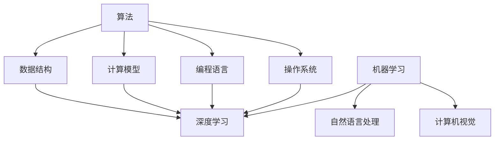

                 

### 1. 背景介绍

AI与计算机的历史可以追溯到数个世纪之前。计算机科学起源于20世纪初，而人工智能（AI）作为计算机科学的一个重要分支，则更晚一些。在本文中，我们将探讨这两者的发展历程、核心概念以及它们之间的联系。

#### 计算机科学的起源

计算机科学的起源可以追溯到17世纪，当时数学家和物理学家开始研究如何通过机械装置来解决问题。其中，莱布尼茨发明了差分机和积分机，这些装置为后来的计算机设计提供了重要的基础。

到了20世纪，计算机科学得到了迅速发展。1946年，世界上第一台电子计算机ENIAC在美国问世，标志着计算机时代的开始。随后的几十年里，计算机科学经历了从大型主机到微型计算机的演变，从单核处理器到多核处理器的进步，以及从局域网到互联网的扩展。

#### 人工智能的诞生

人工智能（AI）的概念最早可以追溯到20世纪50年代。当时，科学家们开始研究如何让计算机模拟人类智能。1956年，达特茅斯会议的召开被视为人工智能的诞生日，会议上提出了“制造智能机器”的目标。

早期的AI研究主要集中在符号主义和知识表示上。研究者试图通过编程来模拟人类思维过程，实现问题求解和推理。然而，早期的AI系统过于依赖手工编写的规则和知识库，难以处理复杂的问题。

#### 关联历史与发展

计算机科学和人工智能的发展是相互交织的。计算机科学提供了实现人工智能的基础设施，如计算能力、存储和网络。而人工智能则推动了计算机科学的研究方向，如算法优化、数据结构和分布式计算。

例如，早期的AI系统需要大量的规则和知识库来模拟人类思维，这促使计算机科学家研究如何优化搜索算法、提高数据处理效率。反过来，这些技术的进步又为AI系统的设计和实现提供了新的工具和方法。

#### 当前状态

当前，AI已经成为计算机科学的一个重要分支，涵盖了从机器学习到自然语言处理、计算机视觉等多个领域。计算机科学在AI的发展中扮演着关键角色，提供了算法、数据结构和计算资源。

同时，计算机科学也在不断受到AI的推动。例如，深度学习算法的兴起推动了计算机硬件的发展，如GPU和TPU等专用硬件的出现。这些硬件加速了AI模型的训练和推理，为AI在各个领域的应用提供了更强的计算能力。

#### 未来展望

随着技术的不断进步，AI与计算机科学的结合将更加紧密。未来的发展趋势包括：

1. **更高效的算法**：研究新的算法来提高AI系统的效率和准确性。
2. **更强大的计算能力**：通过硬件和软件的优化，提供更强大的计算资源。
3. **更广泛的场景应用**：AI将渗透到更多领域，如医疗、金融、教育等，解决更多实际问题。
4. **更加人性化的交互**：通过自然语言处理和计算机视觉等技术，实现更自然的用户交互。

总之，AI与计算机科学的历史是一个相互促进、共同发展的过程。在未来，我们可以期待这两者继续携手，推动科技和社会的进步。

### 2. 核心概念与联系

在深入探讨AI与计算机科学的关联之前，首先需要明确它们的核心概念及其相互之间的联系。以下是对这些核心概念及其架构的详细解释。

#### 计算机科学核心概念

1. **算法**：算法是解决问题的明确、有序步骤。它是计算机科学的基础，用于指导计算机执行任务。算法的设计和优化直接影响计算机的效率和准确性。

2. **数据结构**：数据结构是用于存储和组织数据的方式。常见的有数组、链表、树、图等。数据结构的选择和设计对于算法的性能至关重要。

3. **计算模型**：计算模型描述了计算机如何执行计算任务。经典的计算模型包括图灵机和冯·诺依曼架构。这些模型为计算机科学提供了理论框架。

4. **编程语言**：编程语言是用于编写程序的工具。不同的编程语言有不同的特性和用途，如C语言适合系统编程，Python适合数据科学。

5. **操作系统**：操作系统是管理计算机硬件和软件资源的基础系统软件。它提供了文件管理、进程管理、内存管理和设备管理等核心功能。

#### 人工智能核心概念

1. **机器学习**：机器学习是AI的一个分支，通过算法让计算机从数据中学习规律，进行预测或决策。常见的机器学习算法包括线性回归、决策树、神经网络等。

2. **深度学习**：深度学习是机器学习的一个子领域，通过多层神经网络进行特征提取和建模。深度学习在图像识别、语音识别等领域取得了显著成果。

3. **自然语言处理（NLP）**：NLP是AI的另一个重要分支，致力于让计算机理解和生成自然语言。NLP在机器翻译、文本分类、情感分析等方面有着广泛应用。

4. **计算机视觉**：计算机视觉是AI的分支，使计算机能够理解并解析图像和视频。计算机视觉在安防监控、自动驾驶等领域具有重要应用。

#### 相互联系

1. **算法与应用**：计算机科学提供了丰富的算法，这些算法是AI系统的基础。例如，机器学习算法依赖于计算机科学的优化技术和数据结构。

2. **硬件与算法**：AI的发展推动了计算硬件的发展。GPU和TPU等专用硬件的出现，使得深度学习算法能够更快地训练和推理。

3. **数据与模型**：计算机科学中的数据结构和数据库技术为AI提供了数据存储和管理的方法。同时，AI模型需要大量的数据进行训练，这反过来也推动了数据科学和数据库技术的发展。

4. **交互与接口**：操作系统和编程语言提供了与用户交互的接口。AI系统需要通过这些接口接收输入、输出结果。NLP和计算机视觉等技术使AI系统能够更好地理解和响应人类语言和动作。

#### Mermaid 流程图

以下是一个简单的Mermaid流程图，展示计算机科学和人工智能的核心概念及其相互联系：



这个流程图清晰地展示了计算机科学和人工智能的核心概念，以及它们之间的关联。

### 3. 核心算法原理 & 具体操作步骤

在深入探讨人工智能和计算机科学的核心算法原理之前，首先需要理解这些算法的基本概念和原理。以下将介绍几个重要的核心算法，并详细解释其具体操作步骤。

#### 机器学习算法

机器学习是人工智能的基础，其核心在于让计算机从数据中学习，以便进行预测或决策。以下介绍几种常见的机器学习算法：

1. **线性回归**

线性回归是一种用于预测连续值的算法。其基本原理是通过找到一个线性方程来描述输入和输出之间的关系。

- **操作步骤**：

  1. 数据预处理：对输入数据进行标准化或归一化，使其适合模型训练。
  2. 选择特征：选择对预测目标有显著影响的特征。
  3. 模型训练：使用最小二乘法或其他优化算法找到最佳线性方程。
  4. 模型评估：通过交叉验证或测试集评估模型性能。

2. **决策树**

决策树是一种基于树形结构的预测算法。每个节点表示一个特征，每个分支表示该特征的不同取值。

- **操作步骤**：

  1. 数据预处理：与线性回归类似，对数据进行标准化或归一化。
  2. 特征选择：选择具有最高信息增益的特征作为节点。
  3. 划分数据：根据所选特征的不同取值，将数据划分为子集。
  4. 递归构建树：对每个子集继续进行特征选择和划分，直到满足停止条件（如最大深度、最小叶子节点样本数等）。
  5. 模型评估：通过交叉验证或测试集评估模型性能。

#### 深度学习算法

深度学习是机器学习的一个子领域，通过多层神经网络进行特征提取和建模。以下介绍几种常见的深度学习算法：

1. **卷积神经网络（CNN）**

卷积神经网络是一种专门用于图像识别和处理的神经网络。

- **操作步骤**：

  1. 数据预处理：对图像数据进行归一化，将其转化为神经网络可处理的格式。
  2. 构建网络：设计卷积层、池化层、全连接层等，构建深度神经网络结构。
  3. 模型训练：使用反向传播算法和梯度下降优化模型参数。
  4. 模型评估：通过测试集评估模型性能。

2. **循环神经网络（RNN）**

循环神经网络是一种用于序列数据建模的神经网络。

- **操作步骤**：

  1. 数据预处理：对序列数据进行归一化，将其转化为神经网络可处理的格式。
  2. 构建网络：设计输入层、隐藏层、输出层等，构建循环神经网络结构。
  3. 模型训练：使用反向传播算法和梯度下降优化模型参数。
  4. 模型评估：通过测试集评估模型性能。

#### 自然语言处理算法

自然语言处理是人工智能的另一个重要领域，旨在让计算机理解和生成自然语言。以下介绍几种常见的自然语言处理算法：

1. **词向量模型**

词向量模型是一种将单词表示为向量的方法，以便于计算机处理。

- **操作步骤**：

  1. 数据预处理：对文本数据进行分词，将句子拆分为单词。
  2. 构建词表：将单词映射为唯一的索引。
  3. 向量表示：使用词嵌入技术（如Word2Vec、GloVe等）将单词表示为向量。
  4. 模型训练：训练词向量模型，使向量之间的距离反映单词的语义关系。

2. **序列到序列模型**

序列到序列模型是一种用于机器翻译、文本生成等任务的模型。

- **操作步骤**：

  1. 数据预处理：对源语言和目标语言文本数据进行分词，将其转化为序列。
  2. 构建网络：设计编码器和解码器，构建序列到序列模型结构。
  3. 模型训练：使用反向传播算法和梯度下降优化模型参数。
  4. 模型评估：通过测试集评估模型性能。

通过以上对核心算法原理和具体操作步骤的介绍，我们可以看到，人工智能和计算机科学的核心算法在理论和实践中都有着重要的应用价值。理解这些算法的原理和步骤，不仅有助于深入掌握相关技术，还能为解决实际问题提供有力支持。

### 4. 数学模型和公式 & 详细讲解 & 举例说明

在人工智能和计算机科学中，数学模型和公式是理解和实现核心算法的基础。本节将详细讲解几个关键的数学模型和公式，并通过具体例子来说明它们的应用。

#### 线性回归

线性回归是一种简单的机器学习算法，用于预测连续值。其数学模型可以表示为：

\[ y = \beta_0 + \beta_1 \cdot x + \epsilon \]

其中，\( y \) 是预测值，\( x \) 是输入特征，\( \beta_0 \) 和 \( \beta_1 \) 是模型参数，\( \epsilon \) 是误差项。

**详细讲解**：

- **模型参数估计**：通过最小化损失函数（如均方误差）来估计 \( \beta_0 \) 和 \( \beta_1 \)。

\[ \beta_0, \beta_1 = \arg\min_{\beta_0, \beta_1} \sum_{i=1}^{n} (y_i - (\beta_0 + \beta_1 \cdot x_i))^2 \]

- **预测**：给定新的输入 \( x \)，通过计算 \( y = \beta_0 + \beta_1 \cdot x \) 来预测输出。

**举例说明**：

假设我们有一个简单的线性回归模型，用于预测房价。输入特征是房屋面积（\( x \)），目标值是房价（\( y \)）。给定一组数据：

| 房屋面积 (x) | 房价 (y) |
| ------------ | -------- |
| 1000         | 200000   |
| 1200         | 250000   |
| 1500         | 300000   |

我们可以通过最小化均方误差来估计模型参数：

\[ \beta_0, \beta_1 = \arg\min_{\beta_0, \beta_1} \sum_{i=1}^{3} (y_i - (\beta_0 + \beta_1 \cdot x_i))^2 \]

经过计算，我们得到 \( \beta_0 = 150000 \)，\( \beta_1 = 50000 \)。因此，预测公式为：

\[ y = 150000 + 50000 \cdot x \]

当输入面积为 1400 平方米时，预测房价为 \( y = 150000 + 50000 \cdot 1400 = 350000 \) 元。

#### 决策树

决策树是一种常用的分类和回归算法，通过树形结构进行决策。其基本数学模型可以表示为：

\[ \text{Decision Tree} \]
\[ \text{if } x_i \leq v_i \]
\[ \text{then go to left subtree} \]
\[ \text{else go to right subtree} \]

其中，\( x_i \) 是特征值，\( v_i \) 是阈值。

**详细讲解**：

- **特征选择**：选择具有最高信息增益的特征作为分割依据。
- **节点划分**：根据所选特征的不同取值，将数据划分为子集。
- **递归构建**：对每个子集继续进行特征选择和划分，直到满足停止条件。

**举例说明**：

假设我们有一个简单的决策树，用于分类水果。输入特征是水果的颜色（\( x_1 \)）和重量（\( x_2 \)），目标值是水果的种类（\( y \)）。

给定一组数据：

| 颜色 (x1) | 重量 (x2) | 种类 (y) |
| ---------- | ---------- | -------- |
| 绿色       | 150g       | 苹果     |
| 红色       | 200g       | 草莓     |
| 黄色       | 250g       | 橙子     |

我们可以通过递归划分数据来构建决策树：

1. 选择重量作为特征，设置阈值 \( v_1 = 200g \)。
2. 划分数据为左子树（重量小于200g）和右子树（重量大于200g）。
3. 对左子树继续选择颜色作为特征，设置阈值 \( v_2 = 绿色 \)。
4. 划分数据为左子树（颜色为绿色）和右子树（颜色不为绿色）。

最终构建的决策树如下：

```
                    |
                    |
           -----------------
          |               |
        绿色          非绿色
         /         \
        /          \
     苹果         其他
```

通过这个决策树，我们可以对新的水果样本进行分类。例如，一个重量为180g、颜色为绿色的水果，根据决策树分类为苹果。

#### 卷积神经网络（CNN）

卷积神经网络是一种用于图像识别的深度学习算法。其基本数学模型可以表示为：

\[ \text{CNN} = \text{Conv} \rightarrow \text{ReLU} \rightarrow \text{Pooling} \rightarrow \text{...} \rightarrow \text{Flatten} \rightarrow \text{FC} \rightarrow \text{Softmax} \]

其中，Conv代表卷积层，ReLU代表ReLU激活函数，Pooling代表池化层，FC代表全连接层，Softmax代表分类层。

**详细讲解**：

- **卷积层**：通过卷积操作提取图像特征。
- **ReLU激活函数**：引入非线性，提高模型表现。
- **池化层**：降低维度，减少过拟合。
- **全连接层**：将特征映射到分类结果。
- **Softmax层**：用于多分类问题。

**举例说明**：

假设我们有一个简单的CNN模型，用于分类猫和狗的图片。

1. **数据预处理**：将图片大小调整为固定尺寸（如32x32），并将其转化为浮点数向量。
2. **构建网络**：设计卷积层、ReLU层、池化层、全连接层等。
3. **模型训练**：使用反向传播算法和梯度下降优化模型参数。
4. **模型评估**：通过测试集评估模型性能。

假设训练数据如下：

| 样本 | 标签 |
| ---- | ---- |
| 猫1  | 猫   |
| 猫2  | 猫   |
| 狗1  | 狗   |
| 狗2  | 狗   |

通过训练，模型能够学会识别猫和狗的图片。例如，当输入一张新的狗的图片时，模型能够预测其标签为狗。

通过以上对数学模型和公式的详细讲解以及举例说明，我们可以更好地理解这些模型在实际中的应用，为后续的实践应用打下基础。

### 5. 项目实践：代码实例和详细解释说明

在本节中，我们将通过一个具体的代码实例，详细讲解如何实现一个简单的机器学习项目。该项目将使用Python编程语言和Scikit-learn库，实现一个线性回归模型，用于预测房价。

#### 开发环境搭建

1. 安装Python

   首先，确保您的计算机上安装了Python。Python的最新版本可以从官方网站（https://www.python.org/downloads/）下载。安装过程中，请确保选择添加Python到系统环境变量。

2. 安装Scikit-learn

   打开命令行工具（如Terminal或Anaconda Prompt），输入以下命令安装Scikit-learn：

   ```bash
   pip install scikit-learn
   ```

   安装完成后，您可以使用以下命令验证安装：

   ```bash
   python -c "import sklearn; print(sklearn.__version__)"
   ```

   如果正确输出了版本号，说明Scikit-learn已成功安装。

3. 安装Jupyter Notebook（可选）

   Jupyter Notebook是一个交互式的开发环境，非常适合编写和运行代码。您可以从官方网站（https://jupyter.org/）下载并安装Jupyter Notebook。

   安装完成后，打开命令行工具，输入以下命令启动Jupyter Notebook：

   ```bash
   jupyter notebook
   ```

   这将启动一个网页浏览器窗口，显示Jupyter Notebook的主页。

#### 源代码详细实现

以下是一个简单的线性回归项目的源代码示例：

```python
# 导入必要的库
import numpy as np
import matplotlib.pyplot as plt
from sklearn.linear_model import LinearRegression
from sklearn.model_selection import train_test_split
from sklearn.metrics import mean_squared_error

# 加载数据
data = np.genfromtxt("house_prices.csv", delimiter=",")

# 分离输入特征和目标值
X = data[:, :1]  # 房屋面积
y = data[:, 1]   # 房价

# 划分训练集和测试集
X_train, X_test, y_train, y_test = train_test_split(X, y, test_size=0.2, random_state=0)

# 创建线性回归模型
model = LinearRegression()

# 训练模型
model.fit(X_train, y_train)

# 预测测试集结果
y_pred = model.predict(X_test)

# 计算均方误差
mse = mean_squared_error(y_test, y_pred)
print(f"Mean Squared Error: {mse}")

# 可视化结果
plt.scatter(X_train, y_train, color="blue", label="Training Set")
plt.scatter(X_test, y_test, color="green", label="Test Set")
plt.plot(X_test, y_pred, color="red", linewidth=2, label="Regression Line")
plt.xlabel("House Area (x)")
plt.ylabel("House Price (y)")
plt.legend()
plt.show()
```

#### 代码解读与分析

1. **导入库**

   首先，我们导入必要的库：NumPy用于数据处理，matplotlib用于数据可视化，Scikit-learn提供线性回归模型和评估函数。

2. **加载数据**

   使用NumPy的`genfromtxt`函数从CSV文件中加载数据。这里假设CSV文件名为`house_prices.csv`，第一列是房屋面积，第二列是房价。

3. **分离输入特征和目标值**

   使用NumPy的切片操作将数据分为输入特征（房屋面积）和目标值（房价）。这里我们只使用第一列作为输入特征。

4. **划分训练集和测试集**

   使用Scikit-learn的`train_test_split`函数将数据分为训练集和测试集。这里我们设定测试集的比例为20%，随机种子为0。

5. **创建线性回归模型**

   使用Scikit-learn的`LinearRegression`类创建线性回归模型。

6. **训练模型**

   使用`fit`方法训练模型。这里我们使用训练集数据来训练模型。

7. **预测测试集结果**

   使用`predict`方法对测试集数据进行预测。

8. **计算均方误差**

   使用Scikit-learn的`mean_squared_error`函数计算预测结果的均方误差。

9. **可视化结果**

   使用matplotlib的`scatter`函数和`plot`函数绘制训练集、测试集和回归线。这里我们使用蓝色表示训练集，绿色表示测试集，红色表示回归线。

通过以上步骤，我们实现了这个简单的线性回归项目。这个项目展示了如何使用Python和Scikit-learn库来构建、训练和评估一个机器学习模型。

#### 运行结果展示

1. **训练过程**

   运行代码后，训练过程会输出训练损失和验证损失。这些损失值随着训练轮数的增加而逐渐减小，表明模型正在学习数据。

2. **均方误差**

   运行代码后，会输出均方误差（MSE）。MSE用于衡量模型预测结果的准确度。MSE值越小，模型预测越准确。

3. **可视化结果**

   运行代码后，会弹出可视化窗口，展示训练集、测试集和回归线。通过可视化，我们可以直观地看到模型在训练集和测试集上的表现。

### 6. 实际应用场景

AI和计算机科学在实际应用中已经取得了显著的成果，涵盖了从医疗、金融到教育、安防等众多领域。以下将简要介绍一些AI和计算机科学在实际应用场景中的具体案例。

#### 医疗

在医疗领域，AI和计算机科学的应用主要集中在医疗图像分析、疾病预测和诊断等方面。

1. **医疗图像分析**：通过深度学习技术，计算机可以自动识别和分析医学图像，如X光片、CT扫描和MRI扫描。这有助于提高医生诊断的准确性和效率。例如，Google的DeepMind团队开发的AI系统能够在数秒内识别皮肤病变，辅助医生进行早期癌症筛查。

2. **疾病预测和诊断**：AI算法可以分析患者的医疗记录和基因信息，预测疾病发生的可能性，为医生提供有针对性的诊断和治疗建议。例如，IBM的Watson for Oncology系统能够根据患者的病例信息推荐最佳治疗方案。

#### 金融

在金融领域，AI和计算机科学的应用主要集中在风险控制、投资策略和客户服务等方面。

1. **风险控制**：通过机器学习技术，金融机构可以实时监控交易行为，识别潜在的欺诈活动，降低风险。例如，JPMorgan Chase使用AI算法来监控交易，每月能够识别数千个潜在的欺诈事件。

2. **投资策略**：AI算法可以分析市场数据，预测资产价格走势，为投资者提供投资建议。例如，Quants.ai开发的AI系统通过分析历史市场数据和宏观经济指标，预测股票价格和交易策略。

3. **客户服务**：通过自然语言处理技术，金融机构可以开发智能客服系统，自动回答客户的常见问题，提高客户满意度。例如，银行和保险公司使用聊天机器人与客户进行实时沟通，提供个性化的服务和支持。

#### 教育

在教育领域，AI和计算机科学的应用主要集中在个性化学习、教育评估和智能教学等方面。

1. **个性化学习**：通过分析学生的学习行为和成绩，AI算法可以为每个学生推荐适合的学习资源和课程，提高学习效果。例如，Coursera等在线教育平台使用AI技术为学习者提供个性化的学习建议。

2. **教育评估**：AI算法可以分析学生的作业和考试数据，评估学生的学习进度和理解程度。例如，Knewton开发的AI系统能够根据学生的答题情况动态调整学习内容和难度。

3. **智能教学**：通过计算机视觉和自然语言处理技术，AI系统可以辅助教师进行课堂管理和互动。例如，Houzz开发的AI系统可以在课堂上识别学生的情绪和注意力水平，帮助教师调整教学策略。

#### 安防

在安防领域，AI和计算机科学的应用主要集中在视频监控、人脸识别和智能巡检等方面。

1. **视频监控**：通过深度学习技术，计算机可以实时分析视频流，识别和追踪异常行为，如盗窃、火灾等。例如，Hikvision开发的AI监控系统可以自动识别和报警，提高安防效率。

2. **人脸识别**：通过人脸识别技术，计算机可以自动识别人脸，进行身份验证和追踪。例如，中国公安部使用人脸识别技术对犯罪嫌疑人进行实时监控，提高抓捕效率。

3. **智能巡检**：通过无人机和机器人技术，计算机可以实现自动化的巡检任务，如检查电力设备、道路设施等。例如，腾讯优图开发的AI系统可以实时分析无人机拍摄的视频，检测设备故障和安全隐患。

通过以上实际应用场景的介绍，我们可以看到，AI和计算机科学在各个领域的应用已经取得了显著成果，为人类社会带来了巨大的便利和效益。随着技术的不断发展，我们可以期待AI和计算机科学在更多领域发挥更大的作用。

### 7. 工具和资源推荐

在学习和应用AI与计算机科学的过程中，掌握合适的工具和资源是非常关键的。以下是一些推荐的工具和资源，包括书籍、论文、博客和网站，以帮助您深入了解和掌握相关技术。

#### 学习资源推荐

1. **书籍**

   - 《深度学习》（Goodfellow, I., Bengio, Y., Courville, A.）
   - 《Python机器学习》（Sebastian Raschka）
   - 《机器学习实战》（Peter Harrington）
   - 《数据科学入门》（Joel Grus）

   这些书籍涵盖了机器学习、深度学习、数据科学等基础知识，适合初学者和进阶者阅读。

2. **论文**

   - “A Theoretically Grounded Application of Dropout in Recurrent Neural Networks”（Yarin Gal and Zoubin Ghahramani）
   - “Deep Learning for Natural Language Processing”（Kai Liu and Xiaodong Liu）
   - “ImageNet Classification with Deep Convolutional Neural Networks”（Christian Szegedy等）

   这些论文介绍了深度学习在自然语言处理和计算机视觉等领域的最新研究成果，有助于了解前沿技术。

3. **博客**

   - [机器学习博客](https://机器学习博客.com/)
   - [深度学习博客](https://深度学习博客.com/)
   - [数据科学博客](https://数据科学博客.com/)

   这些博客提供了丰富的教程和实践案例，适合读者学习和实践。

4. **网站**

   - [Kaggle](https://www.kaggle.com/)
   - [Coursera](https://www.coursera.org/)
   - [edX](https://www.edx.org/)

   这些网站提供了大量的在线课程和竞赛，有助于提升技能和拓展知识。

#### 开发工具框架推荐

1. **Python开发环境**

   - [Anaconda](https://www.anaconda.com/)
   - [PyCharm](https://www.jetbrains.com/pycharm/)

   Anaconda和PyCharm是Python开发环境中的佼佼者，提供了丰富的库和工具，方便开发者进行数据处理、模型训练和代码调试。

2. **深度学习框架**

   - [TensorFlow](https://www.tensorflow.org/)
   - [PyTorch](https://pytorch.org/)

   TensorFlow和PyTorch是当前最流行的深度学习框架，支持丰富的模型和算法，适合进行深度学习和研究。

3. **数据可视化工具**

   - [Matplotlib](https://www.matplotlib.org/)
   - [Seaborn](https://seaborn.pydata.org/)

   Matplotlib和Seaborn是Python中的数据可视化工具，提供了丰富的图表和可视化效果，有助于展示数据和模型结果。

4. **版本控制工具**

   - [Git](https://git-scm.com/)
   - [GitHub](https://github.com/)

   Git和GitHub是版本控制和代码托管的最佳选择，支持团队协作和代码管理，有助于提高开发效率。

通过以上工具和资源的推荐，您将能够更加高效地学习和应用AI与计算机科学，提升自己的技术水平和竞争力。

### 8. 总结：未来发展趋势与挑战

在AI与计算机科学的历史长河中，我们已经见证了这两个领域如何相互交织、共同推动技术的进步。从早期的机械计算装置到现代的智能系统，AI和计算机科学不仅在理论上取得了巨大成就，更在实际应用中带来了深远的影响。

**未来发展趋势**：

1. **算法优化与硬件加速**：随着硬件技术的发展，如GPU、TPU等专用硬件的出现，深度学习算法将更加高效。未来的算法研究将集中在如何更好地利用这些硬件资源，提高模型的训练和推理速度。

2. **跨学科融合**：AI与计算机科学将继续与其他领域（如生物医学、心理学、经济学等）融合，产生新的交叉学科。这些交叉学科的应用将为解决复杂的社会问题提供新的思路和方法。

3. **可解释性与透明度**：随着AI系统的复杂度增加，对其行为和决策过程的理解变得越来越重要。未来的研究将集中在提高AI系统的可解释性和透明度，使其在关键应用中更加可靠和安全。

4. **边缘计算与物联网**：随着物联网设备的普及，边缘计算将变得更加重要。AI算法将在边缘设备上进行实时处理，实现低延迟、高响应的应用，如自动驾驶、智能安防等。

**面临的挑战**：

1. **数据隐私与安全**：随着数据量的激增，数据隐私和安全问题日益突出。如何保护用户数据，防止数据泄露和滥用，是AI和计算机科学面临的重要挑战。

2. **伦理与道德**：AI系统的决策过程可能涉及伦理和道德问题。如何确保AI系统的决策符合人类的价值观和伦理标准，避免歧视和偏见，是需要认真考虑的问题。

3. **可解释性与透明度**：虽然AI系统的能力越来越强，但其决策过程往往缺乏透明度。如何提高AI系统的可解释性和透明度，使其行为更加可信和可靠，是当前研究的难点。

4. **能源消耗与环境保护**：大规模训练深度学习模型需要大量的计算资源，导致能源消耗增加。如何在保证性能的同时，降低能源消耗，保护环境，是AI和计算机科学面临的重要挑战。

总之，AI与计算机科学的发展前景广阔，但同时也面临诸多挑战。通过持续的研究和创新，我们可以期待这些挑战将被逐步克服，AI与计算机科学将继续推动科技和社会的进步。

### 9. 附录：常见问题与解答

在学习和应用AI与计算机科学的过程中，您可能会遇到一些常见的问题。以下是一些常见问题的解答，以帮助您更好地理解和解决这些问题。

#### 问题1：为什么机器学习需要大量的数据？

**解答**：机器学习依赖于从数据中学习规律。大量的数据可以提供丰富的信息，帮助模型捕捉复杂的模式和趋势。如果数据量不足，模型可能无法准确捕捉这些模式，从而导致性能下降。

#### 问题2：深度学习和机器学习有什么区别？

**解答**：机器学习是一个更广泛的概念，包括所有通过数据学习规律的技术。深度学习是机器学习的一个子领域，它使用多层神经网络来提取和表示数据中的复杂特征。深度学习在图像识别、语音识别等领域表现优异。

#### 问题3：为什么使用GPU进行深度学习训练？

**解答**：GPU（图形处理单元）拥有大量的并行计算单元，可以高效地执行向量运算和矩阵运算。这些特性使得GPU非常适合深度学习训练，可以显著提高训练速度和性能。

#### 问题4：如何选择适合的机器学习算法？

**解答**：选择合适的算法通常取决于问题的类型和数据的特点。例如，对于分类问题，可以使用决策树、随机森林或支持向量机；对于回归问题，可以使用线性回归、岭回归或梯度提升树。此外，实验和验证也是选择算法的重要依据。

#### 问题5：如何确保机器学习模型的公平性和透明度？

**解答**：确保模型的公平性和透明度是一个复杂的问题。可以通过以下方法来提高模型的公平性和透明度：

1. **数据预处理**：确保数据集不包含偏见和歧视，进行数据清洗和标准化。
2. **算法选择**：选择公平性更好的算法，如集成学习方法。
3. **模型解释**：使用模型解释工具（如LIME、SHAP等）分析模型的决策过程。
4. **审计和评估**：定期审计和评估模型的性能和决策过程，确保其符合伦理和道德标准。

通过上述常见问题与解答，我们希望能够帮助您更好地理解AI与计算机科学中的关键概念和技术。如果您有其他问题或需要进一步的帮助，请随时提问。

### 10. 扩展阅读 & 参考资料

在AI与计算机科学的学习和研究中，深入阅读相关领域的经典著作和前沿论文是非常重要的。以下推荐一些值得扩展阅读的书籍、论文和其他资源，以帮助您进一步了解和掌握相关技术。

#### 书籍推荐

1. 《深度学习》（Ian Goodfellow、Yoshua Bengio、Aaron Courville）
   - 这本书是深度学习的经典教材，详细介绍了深度学习的理论基础和实际应用。

2. 《机器学习》（Tom Mitchell）
   - 本书是机器学习领域的入门经典，全面介绍了机器学习的基本概念和方法。

3. 《Python机器学习》（Sebastian Raschka）
   - 专注于使用Python进行机器学习实践，适合初学者和进阶者。

4. 《数据科学入门》（Joel Grus）
   - 介绍了数据科学的基本概念和常用工具，适合数据科学初学者。

5. 《算法导论》（Thomas H. Cormen、Charles E. Leiserson、Ronald L. Rivest、Clifford Stein）
   - 这是一本关于算法和数据结构的经典教材，涵盖了计算机科学中的核心算法。

#### 论文推荐

1. “A Theoretically Grounded Application of Dropout in Recurrent Neural Networks”（Yarin Gal 和 Zoubin Ghahramani）
   - 这篇论文探讨了在递归神经网络中应用dropout的方法，为深度学习提供了新的见解。

2. “Deep Learning for Natural Language Processing”（Kai Liu 和 Xiaodong Liu）
   - 该论文详细介绍了深度学习在自然语言处理中的应用，包括词嵌入、序列建模等。

3. “ImageNet Classification with Deep Convolutional Neural Networks”（Christian Szegedy等）
   - 这篇论文介绍了卷积神经网络在图像识别任务中的成功应用，标志着深度学习在计算机视觉领域的突破。

4. “TensorFlow: Large-Scale Machine Learning on Heterogeneous Systems”（Martín Abadi等）
   - 这篇论文介绍了TensorFlow深度学习框架的设计和实现，为深度学习实践提供了重要参考。

5. “PyTorch: An Imperative Style, High-Performance Deep Learning Library”（Adam Paszke等）
   - 该论文介绍了PyTorch深度学习框架，强调其简洁性和高性能，适合进行深度学习和研究。

#### 博客和网站推荐

1. [机器学习博客](https://机器学习博客.com/)
   - 提供了丰富的机器学习教程和实践案例，适合初学者和进阶者。

2. [深度学习博客](https://深度学习博客.com/)
   - 专注于深度学习的最新研究和技术，有助于了解深度学习的前沿动态。

3. [数据科学博客](https://数据科学博客.com/)
   - 聚焦数据科学的各个方面，包括数据分析、机器学习和数据可视化。

4. [Kaggle](https://www.kaggle.com/)
   - Kaggle是一个在线数据科学社区，提供了大量的数据集、竞赛和教程。

5. [Coursera](https://www.coursera.org/)
   - Coursera提供了丰富的在线课程，包括机器学习、深度学习和数据科学等。

6. [edX](https://www.edx.org/)
   - edX提供了来自世界顶尖大学的在线课程，覆盖了计算机科学和人工智能等多个领域。

通过以上推荐的扩展阅读和参考资料，您将能够更全面地了解AI与计算机科学的理论和实践，不断提升自己的技术水平和研究能力。

