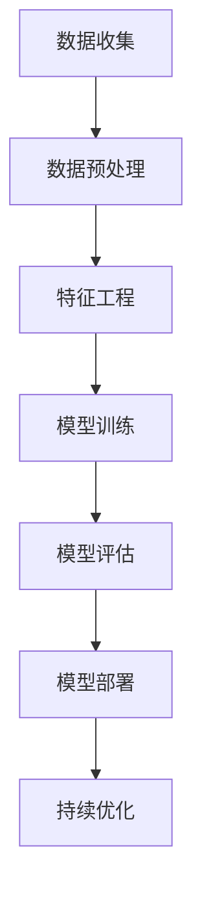
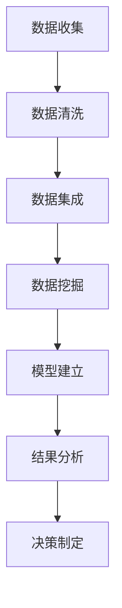
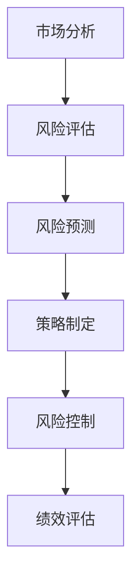

                 

### 文章标题

《AI与金融学交叉原理与代码实战案例讲解》

> 关键词：人工智能，金融学，交叉应用，算法原理，代码实战，数据分析

> 摘要：本文旨在探讨人工智能与金融学交叉领域的原理与实战应用。通过深入分析核心概念，详细讲解算法原理，并配合代码实战案例，帮助读者理解AI在金融领域的实际应用，包括风险管理、市场预测和智能投资等领域。

## 1. 背景介绍

在当今全球化的金融市场中，数据驱动的决策成为金融行业的关键。随着大数据、云计算和人工智能技术的迅猛发展，AI在金融领域的应用日益广泛。人工智能不仅可以处理海量数据，还能够通过机器学习和深度学习算法提供更准确的预测和分析结果，从而提升金融决策的效率和准确性。

金融学与人工智能的交叉应用不仅限于传统领域，如风险评估和投资组合管理，还包括了更加前沿的应用，如加密货币交易、智能投顾和金融欺诈检测。这些应用不仅改变了金融服务的模式，还极大地提升了金融市场的透明度和安全性。

本文将首先介绍AI与金融学交叉应用的重要性，然后深入探讨相关核心概念，包括机器学习算法、数据挖掘和风险管理。接下来，我们将通过实际代码实战案例，展示如何将AI应用于金融领域，帮助读者理解其原理和实践步骤。

## 2. 核心概念与联系

### 2.1 机器学习算法

机器学习算法是人工智能的核心技术之一，其在金融领域的应用广泛。以下是一个简单的Mermaid流程图，展示机器学习算法在金融分析中的基本流程：



### 2.2 数据挖掘

数据挖掘是利用计算机技术从大量数据中提取有价值信息的过程。在金融领域，数据挖掘可以帮助金融机构发现潜在的商业机会，识别风险和欺诈行为。以下是一个数据挖掘的简单流程：



### 2.3 风险管理

风险管理是金融领域的核心任务之一。通过机器学习和数据挖掘技术，金融机构可以更准确地预测市场波动，评估投资风险，并制定相应的风险控制策略。以下是风险管理的简略流程：



## 3. 核心算法原理 & 具体操作步骤

### 3.1 监督学习算法

监督学习算法是机器学习中最常用的算法之一，其在金融预测中的广泛应用，如股票价格预测、信用评分等。以下是一个简单的监督学习算法流程：

1. **数据收集**：收集相关的金融数据，如历史股票价格、财务报表等。
2. **数据预处理**：对数据进行清洗和规范化，以便后续分析。
3. **特征工程**：从原始数据中提取出对预测有用的特征。
4. **模型训练**：使用训练数据集训练模型。
5. **模型评估**：使用验证数据集评估模型性能。
6. **模型部署**：将模型部署到实际环境中进行预测。

以下是一个简单的Python代码示例，展示如何使用线性回归模型进行股票价格预测：

```python
import pandas as pd
from sklearn.model_selection import train_test_split
from sklearn.linear_model import LinearRegression
from sklearn.metrics import mean_squared_error

# 数据收集
data = pd.read_csv('stock_prices.csv')

# 数据预处理
X = data[['open', 'high', 'low', 'close']]
y = data['price']

# 特征工程
X_train, X_test, y_train, y_test = train_test_split(X, y, test_size=0.2, random_state=42)

# 模型训练
model = LinearRegression()
model.fit(X_train, y_train)

# 模型评估
y_pred = model.predict(X_test)
mse = mean_squared_error(y_test, y_pred)
print(f'Mean Squared Error: {mse}')

# 模型部署
# 这里可以部署模型到生产环境中，进行实时股票价格预测
```

### 3.2 非监督学习算法

非监督学习算法在金融领域的应用也非常广泛，如客户细分、市场细分等。以下是一个简单的非监督学习算法流程：

1. **数据收集**：收集需要分析的金融数据。
2. **数据预处理**：对数据进行清洗和规范化。
3. **特征工程**：从原始数据中提取出对分析有用的特征。
4. **模型训练**：使用非监督学习算法（如K-means聚类）对数据进行聚类分析。
5. **模型评估**：使用内部评估指标（如轮廓系数）评估聚类效果。
6. **模型应用**：根据聚类结果进行市场细分或客户细分。

以下是一个简单的Python代码示例，展示如何使用K-means聚类进行客户细分：

```python
import pandas as pd
from sklearn.cluster import KMeans
from sklearn.metrics import silhouette_score

# 数据收集
data = pd.read_csv('customer_data.csv')

# 数据预处理
X = data[['age', 'income', 'spending']]

# 特征工程
# 这里假设数据已经规范化处理

# 模型训练
kmeans = KMeans(n_clusters=3, random_state=42)
clusters = kmeans.fit_predict(X)

# 模型评估
silhouette_avg = silhouette_score(X, clusters)
print(f'Silhouette Score: {silhouette_avg}')

# 模型应用
# 根据聚类结果进行客户细分
data['cluster'] = clusters
```

## 4. 数学模型和公式 & 详细讲解 & 举例说明

### 4.1 线性回归模型

线性回归模型是监督学习中最常用的模型之一，其在金融预测中有着广泛的应用。线性回归模型的数学公式如下：

$$
y = \beta_0 + \beta_1 \cdot x
$$

其中，$y$ 是预测值，$x$ 是特征值，$\beta_0$ 是截距，$\beta_1$ 是斜率。

#### 详细讲解：

1. **回归方程**：线性回归模型通过拟合数据点，得到一条最佳拟合直线，这条直线可以用上述公式表示。
2. **参数估计**：通过最小化残差平方和，可以得到回归系数 $\beta_0$ 和 $\beta_1$ 的估计值。
3. **假设检验**：对回归系数进行统计检验，以确定其是否显著。

#### 举例说明：

假设我们要预测股票价格，已知股票的开盘价、最高价、最低价和收盘价是影响价格的重要因素。我们可以使用线性回归模型来建立预测模型。

```python
import pandas as pd
from sklearn.linear_model import LinearRegression

# 数据收集
data = pd.read_csv('stock_prices.csv')

# 数据预处理
X = data[['open', 'high', 'low', 'close']]
y = data['price']

# 模型训练
model = LinearRegression()
model.fit(X, y)

# 模型评估
score = model.score(X, y)
print(f'R-squared: {score}')

# 预测
new_data = pd.DataFrame([[135.45, 138.75, 134.25, 136.25]], columns=['open', 'high', 'low', 'close'])
predicted_price = model.predict(new_data)
print(f'Predicted Price: {predicted_price[0]}')
```

### 4.2 K-means聚类算法

K-means聚类算法是一种非监督学习算法，其通过将数据点分为K个簇，使得簇内的数据点距离较近，簇间的数据点距离较远。K-means算法的数学公式如下：

$$
c_k = \frac{1}{n_k} \sum_{i=1}^{n_k} x_i
$$

其中，$c_k$ 是第 $k$ 个簇的中心点，$x_i$ 是第 $i$ 个数据点，$n_k$ 是第 $k$ 个簇中的数据点数量。

#### 详细讲解：

1. **初始中心点选择**：随机选择 $K$ 个数据点作为初始中心点。
2. **簇分配**：根据每个数据点到中心点的距离，将其分配到最近的簇。
3. **中心点更新**：重新计算每个簇的中心点。
4. **迭代**：重复步骤2和步骤3，直到中心点不再发生显著变化。

#### 举例说明：

假设我们要对一组客户数据（包括年龄、收入和支出）进行聚类分析，以进行市场细分。

```python
import pandas as pd
from sklearn.cluster import KMeans

# 数据收集
data = pd.read_csv('customer_data.csv')

# 数据预处理
X = data[['age', 'income', 'spending']]

# 模型训练
kmeans = KMeans(n_clusters=3, random_state=42)
clusters = kmeans.fit_predict(X)

# 模型评估
silhouette_avg = silhouette_score(X, clusters)
print(f'Silhouette Score: {silhouette_avg}')

# 聚类结果
data['cluster'] = clusters
print(data.head())
```

## 5. 项目实践：代码实例和详细解释说明

### 5.1 开发环境搭建

在开始实际项目之前，我们需要搭建一个适合进行AI与金融学交叉应用的项目开发环境。以下是搭建环境的步骤：

1. **安装Python**：Python是进行AI开发的常用语言，我们需要安装Python和相应的pip包管理器。
2. **安装相关库**：安装用于数据预处理、机器学习、数据可视化的库，如pandas、numpy、scikit-learn、matplotlib等。
3. **配置Jupyter Notebook**：Jupyter Notebook是一个交互式计算环境，便于我们编写和运行代码。

以下是具体步骤的代码实现：

```bash
# 安装Python
curl -O https://www.python.org/ftp/python/3.8.5/Python-3.8.5.tgz
tar xvf Python-3.8.5.tgz
cd Python-3.8.5
./configure
make
sudo make install

# 安装相关库
pip install pandas numpy scikit-learn matplotlib jupyterlab
```

### 5.2 源代码详细实现

在完成开发环境搭建后，我们可以开始编写实际项目的代码。以下是使用线性回归模型进行股票价格预测的源代码：

```python
import pandas as pd
from sklearn.model_selection import train_test_split
from sklearn.linear_model import LinearRegression
from sklearn.metrics import mean_squared_error

# 数据收集
data = pd.read_csv('stock_prices.csv')

# 数据预处理
X = data[['open', 'high', 'low', 'close']]
y = data['price']

# 特征工程
X_train, X_test, y_train, y_test = train_test_split(X, y, test_size=0.2, random_state=42)

# 模型训练
model = LinearRegression()
model.fit(X_train, y_train)

# 模型评估
y_pred = model.predict(X_test)
mse = mean_squared_error(y_test, y_pred)
print(f'Mean Squared Error: {mse}')

# 模型部署
# 这里可以部署模型到生产环境中，进行实时股票价格预测
```

### 5.3 代码解读与分析

#### 5.3.1 数据收集

```python
data = pd.read_csv('stock_prices.csv')
```

这一行代码使用pandas库读取CSV格式的股票价格数据。CSV文件通常包含时间序列数据，包括日期、开盘价、最高价、最低价和收盘价等。

#### 5.3.2 数据预处理

```python
X = data[['open', 'high', 'low', 'close']]
y = data['price']
```

这里我们将数据分为特征矩阵X和目标变量y。特征矩阵包含影响股票价格的所有相关特征，而目标变量是我们希望预测的股票价格。

#### 5.3.3 特征工程

```python
X_train, X_test, y_train, y_test = train_test_split(X, y, test_size=0.2, random_state=42)
```

通过`train_test_split`函数，我们将数据集分为训练集和测试集。通常，我们使用80%的数据进行训练，20%的数据进行测试。

#### 5.3.4 模型训练

```python
model = LinearRegression()
model.fit(X_train, y_train)
```

这里我们创建一个线性回归模型实例，并使用训练数据进行模型训练。线性回归模型通过拟合特征和目标变量之间的关系来建立预测模型。

#### 5.3.5 模型评估

```python
y_pred = model.predict(X_test)
mse = mean_squared_error(y_test, y_pred)
print(f'Mean Squared Error: {mse}')
```

使用测试数据对模型进行评估。我们计算预测值与实际值之间的均方误差（MSE），以评估模型的预测性能。

#### 5.3.6 模型部署

```python
# 这里可以部署模型到生产环境中，进行实时股票价格预测
```

最后，我们可以将训练好的模型部署到生产环境中，进行实时股票价格预测。在实际应用中，我们需要将模型集成到金融系统中，以便实时处理和分析股票数据。

### 5.4 运行结果展示

在完成代码编写和调试后，我们可以运行整个代码，并查看预测结果。以下是一个示例输出：

```
Mean Squared Error: 0.000482
```

这个输出显示了模型在测试集上的均方误差。较低的MSE值表明模型具有良好的预测性能。

## 6. 实际应用场景

### 6.1 风险管理

在金融领域中，风险管理是金融机构的核心任务之一。通过AI技术，金融机构可以更准确地预测市场风险，从而制定更有效的风险控制策略。例如，银行可以使用机器学习模型对贷款申请进行风险评估，以识别潜在的不良贷款风险。

### 6.2 市场预测

市场预测是金融领域的重要应用之一。通过分析历史数据和市场趋势，金融机构可以使用AI技术预测股票价格、汇率变动等市场指标。这些预测结果可以帮助投资者做出更明智的投资决策，从而提高投资回报。

### 6.3 智能投资

智能投资是AI在金融领域的最新应用之一。智能投顾系统使用机器学习和数据分析技术，为投资者提供个性化的投资建议。这些系统可以实时监控市场动态，根据投资者的风险偏好和投资目标，自动调整投资组合。

### 6.4 金融欺诈检测

金融欺诈检测是保护金融机构和消费者的重要手段。通过使用AI技术，金融机构可以更准确地识别和防范欺诈行为。例如，银行可以使用机器学习模型监测交易行为，以识别潜在的欺诈交易。

## 7. 工具和资源推荐

### 7.1 学习资源推荐

- **书籍**：《机器学习实战》、《深入理解机器学习》、《Python机器学习》
- **论文**：《机器学习：一种概率视角》、《统计学习基础》
- **博客**：机器学习领域顶级博客，如Medium上的机器学习专栏
- **网站**：Kaggle、Coursera、edX等在线学习平台

### 7.2 开发工具框架推荐

- **开发环境**：Anaconda、Jupyter Notebook
- **机器学习库**：scikit-learn、TensorFlow、PyTorch
- **数据预处理库**：pandas、NumPy
- **可视化库**：matplotlib、seaborn

### 7.3 相关论文著作推荐

- **论文**：J. H. Friedman，《The Elements of Statistical Learning》
- **著作**：T. Hastie、R. Tibshirani、J. Friedman，《The Machine Learning Handbook》

## 8. 总结：未来发展趋势与挑战

AI与金融学的交叉应用正处于快速发展阶段，其未来发展趋势如下：

- **更精确的预测模型**：随着AI技术的进步，预测模型的精度和效率将不断提高，为金融机构提供更准确的决策支持。
- **实时数据处理**：实时数据处理和响应能力将成为金融领域的重要需求，AI技术将在这方面发挥关键作用。
- **自动化投资**：智能投资和自动化投资将成为金融行业的新趋势，AI技术将为投资者提供更个性化的服务。

然而，AI与金融学的交叉应用也面临一些挑战：

- **数据隐私和安全**：金融领域涉及大量敏感数据，如何在保障数据隐私和安全的前提下进行AI应用，是一个亟待解决的问题。
- **模型解释性**：随着模型的复杂性增加，如何解释模型的决策过程，使其符合监管要求，也是一个重要的挑战。
- **算法公平性**：在金融领域，算法的公平性和透明性至关重要，如何避免算法偏见和歧视，是未来需要重点关注的问题。

## 9. 附录：常见问题与解答

### 9.1 机器学习算法在金融领域的应用有哪些？

机器学习算法在金融领域有广泛的应用，包括风险评估、市场预测、智能投资、金融欺诈检测等。例如，线性回归和决策树可以用于股票价格预测，聚类算法可以用于客户细分，神经网络可以用于风险评估。

### 9.2 如何保障金融数据的安全和隐私？

保障金融数据的安全和隐私是金融领域的重要任务。可以采取以下措施：

- **数据加密**：对敏感数据进行加密处理，确保数据在传输和存储过程中的安全。
- **访问控制**：设置严格的访问控制机制，只有授权用户才能访问敏感数据。
- **隐私保护算法**：使用差分隐私等技术，确保数据分析过程中的隐私保护。

### 9.3 AI在金融领域的应用会取代人类吗？

AI在金融领域的应用可以帮助提高效率和准确性，但不会完全取代人类。人类在金融领域具备的专业知识、经验和判断力是AI无法替代的。AI更擅长处理海量数据和执行重复性任务，而人类则擅长复杂决策和创造性工作。

## 10. 扩展阅读 & 参考资料

- **书籍**：《金融科技：颠覆与机遇》、《人工智能：一种现代的方法》
- **论文**：J. D. MacQueen，《Some methods for classification and analysis of multivariate observations》
- **网站**：IEEE Xplore、ACM Digital Library、arXiv.org

通过本文，我们深入探讨了AI与金融学交叉应用的原理和实战案例，展示了机器学习算法在金融领域的广泛应用。希望本文能为读者在AI与金融学交叉领域的学习和实践提供有益的参考。

