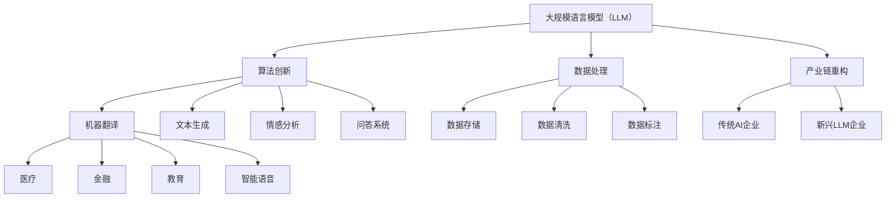

                 

### 文章标题

**AI产业新格局：LLM重塑技术生态**

> 关键词：**大规模语言模型（LLM）**、**技术生态重塑**、**AI产业变革**、**人工智能技术**、**未来发展趋势**

> 摘要：本文将深入探讨大规模语言模型（LLM）如何重塑AI产业技术生态，从背景介绍、核心概念与联系、核心算法原理、数学模型和公式、项目实践、实际应用场景、工具和资源推荐、总结与未来趋势等方面，全面分析LLM在AI产业中的影响和重要性。

### 1. 背景介绍

人工智能（AI）作为当今科技领域的热门话题，已经渗透到我们生活的方方面面。从智能手机、智能家居到自动驾驶、医疗诊断，AI技术正在不断革新各个行业。然而，AI技术的发展并非一帆风顺，其中遇到了许多技术瓶颈和挑战。尤其是在自然语言处理（NLP）领域，虽然近年来取得了显著的进展，但仍然存在许多难题需要解决。

在此背景下，大规模语言模型（LLM）的出现为AI产业带来了新的机遇。LLM是一种能够处理和理解自然语言的大型神经网络模型，通过自主学习海量文本数据，实现对人类语言的精确理解和生成。与传统的NLP方法相比，LLM具有更强的表达能力和灵活性，能够更好地应对复杂的语言现象和任务需求。

LLM的发展不仅推动了NLP技术的进步，也对整个AI产业技术生态产生了深远的影响。本文将围绕这一主题，深入探讨LLM在AI产业中的核心作用，以及其如何重塑技术生态。

### 2. 核心概念与联系

#### 2.1 大规模语言模型（LLM）

大规模语言模型（LLM）是一种基于深度学习技术的自然语言处理模型，其主要目标是实现自然语言的理解和生成。LLM通常由多层神经网络组成，通过对海量文本数据进行训练，学习到语言的内在规律和语义关系。LLM的核心优势在于其能够处理复杂的语言现象，如语法结构、词汇语义、上下文理解等。

#### 2.2 技术生态重塑

技术生态重塑是指新技术对现有技术体系、产业链和产业格局的重新构建和优化。在AI产业中，LLM的出现引发了技术生态的重塑，主要体现在以下几个方面：

1. **算法创新**：LLM推动了自然语言处理算法的创新，使得传统NLP方法难以解决的问题得以解决。例如，LLM在机器翻译、文本生成、情感分析、问答系统等领域取得了显著的成果。

2. **数据处理**：LLM对海量文本数据的需求，推动了数据存储、数据清洗和数据标注技术的发展。同时，LLM的兴起也带来了对大数据处理技术的挑战，需要优化现有的数据处理框架和算法。

3. **产业链重构**：LLM技术的出现，改变了AI产业链的结构和生态。传统AI企业需要适应LLM技术的变革，同时新兴的LLM企业也在不断涌现，形成了新的市场竞争格局。

#### 2.3 技术生态联系

LLM与AI产业技术生态之间的联系主要体现在以下几个方面：

1. **算法与数据**：LLM的发展依赖于海量文本数据的支持，同时LLM技术也推动了数据存储、数据清洗和数据标注技术的发展。

2. **硬件与软件**：LLM的训练和推理过程对硬件资源有较高要求，推动了高性能计算和云计算技术的发展。同时，LLM的兴起也对软件框架和开发工具提出了新的需求。

3. **应用场景**：LLM技术在各个领域的应用，推动了AI技术在医疗、金融、教育、智能语音等领域的深入发展，形成了新的应用生态。

为了更好地理解LLM与AI产业技术生态的联系，下面给出一个Mermaid流程图，展示LLM技术生态的主要组成部分和相互关系。



### 3. 核心算法原理 & 具体操作步骤

#### 3.1 算法原理

大规模语言模型（LLM）的核心算法是基于深度学习的神经网络模型。LLM通过多层神经网络对海量文本数据进行训练，学习到语言的内在规律和语义关系。LLM的训练过程主要包括以下步骤：

1. **数据预处理**：对原始文本数据进行清洗、分词、编码等预处理操作，将其转化为神经网络可以处理的数字形式。
2. **构建神经网络**：设计多层神经网络结构，包括输入层、隐藏层和输出层。神经网络中的每个神经元都对应一个权重参数，通过调整这些权重参数，使神经网络能够对输入数据进行分类或回归。
3. **训练过程**：使用训练数据对神经网络进行训练，通过反向传播算法不断调整权重参数，使神经网络的预测结果越来越接近真实值。
4. **评估与优化**：在训练过程中，使用验证数据对神经网络的性能进行评估，并根据评估结果调整训练策略和参数，优化神经网络的结构和性能。

#### 3.2 具体操作步骤

以下是LLM训练和推理的具体操作步骤：

1. **数据预处理**：

    - **文本清洗**：去除文本中的特殊字符、标点符号、停用词等无关信息。
    - **分词**：将文本分割成单词或词组。
    - **编码**：将分词后的文本转换为数字编码，可以使用one-hot编码、词嵌入等方法。

2. **构建神经网络**：

    - **输入层**：输入层的神经元数量与文本编码的维度相同。
    - **隐藏层**：设计多层隐藏层，每层神经元数量可以逐渐减少，以避免过拟合。
    - **输出层**：根据任务需求设计输出层，如分类任务可以使用softmax激活函数。

3. **训练过程**：

    - **初始化参数**：随机初始化神经网络中的权重参数。
    - **前向传播**：将输入数据传递到神经网络中，计算输出结果。
    - **计算损失**：使用损失函数（如交叉熵损失函数）计算输出结果与真实标签之间的差距。
    - **反向传播**：根据损失函数的梯度信息，反向传播更新神经网络中的权重参数。

4. **评估与优化**：

    - **验证集评估**：使用验证集评估神经网络的性能，根据评估结果调整训练策略和参数。
    - **测试集评估**：在测试集上评估神经网络的最终性能，确保其具有较好的泛化能力。

5. **推理过程**：

    - **输入编码**：将输入文本编码为数字形式。
    - **前向传播**：将输入编码传递到神经网络中，计算输出结果。
    - **输出结果**：根据输出结果进行分类或回归预测。

通过以上步骤，LLM可以实现对自然语言的精确理解和生成，为AI产业带来了巨大的技术进步。

### 4. 数学模型和公式 & 详细讲解 & 举例说明

#### 4.1 数学模型

大规模语言模型（LLM）的核心数学模型是基于深度学习的多层神经网络。神经网络由多个神经元层组成，包括输入层、隐藏层和输出层。每个神经元层的神经元通过权重参数连接，形成一个复杂的网络结构。

神经网络中的每个神经元都可以表示为一个简单的非线性函数。假设第 $l$ 层的第 $i$ 个神经元的输出为 $a^{[l]}_i$，则可以表示为：

$$
a^{[l]}_i = \sigma\left(\sum_{j=1}^{n} w_{ji} a^{[l-1]}_j + b_i\right)
$$

其中，$w_{ji}$ 是连接第 $l-1$ 层的第 $j$ 个神经元和第 $l$ 层的第 $i$ 个神经元的权重参数，$b_i$ 是第 $l$ 层的第 $i$ 个神经元的偏置参数，$\sigma$ 是激活函数，常用的激活函数包括Sigmoid、ReLU和Tanh。

#### 4.2 激活函数

激活函数在神经网络中起着至关重要的作用，它可以增加网络的非线性特性，使得神经网络能够更好地拟合复杂的非线性关系。常用的激活函数包括：

1. **Sigmoid函数**：

$$
\sigma(x) = \frac{1}{1 + e^{-x}}
$$

Sigmoid函数可以将输入映射到 $(0, 1)$ 区间内，但梯度值在接近0和1时较小，可能导致梯度消失问题。

2. **ReLU函数**：

$$
\sigma(x) = \max(0, x)
$$

ReLU函数在 $x < 0$ 时输出0，在 $x \geq 0$ 时输出 $x$，可以有效避免梯度消失问题，但可能引入梯度消失问题。

3. **Tanh函数**：

$$
\sigma(x) = \frac{e^x - e^{-x}}{e^x + e^{-x}}
$$

Tanh函数将输入映射到 $(-1, 1)$ 区间内，具有较好的梯度性质。

#### 4.3 损失函数

在神经网络训练过程中，损失函数用于衡量模型预测值与真实值之间的差距，指导网络参数的优化。常用的损失函数包括：

1. **均方误差（MSE）**：

$$
\text{MSE} = \frac{1}{n} \sum_{i=1}^{n} (y_i - \hat{y}_i)^2
$$

其中，$y_i$ 是真实值，$\hat{y}_i$ 是预测值，$n$ 是样本数量。

2. **交叉熵（Cross-Entropy）**：

$$
\text{CE} = -\frac{1}{n} \sum_{i=1}^{n} y_i \log(\hat{y}_i)
$$

其中，$y_i$ 是真实值，$\hat{y}_i$ 是预测值，$\log$ 是以自然底数e为底的对数函数。

#### 4.4 反向传播算法

反向传播算法是神经网络训练的核心算法，通过计算损失函数的梯度，反向传播更新网络参数，使网络逐渐收敛到最优解。反向传播算法的具体步骤如下：

1. **前向传播**：将输入数据传递到神经网络中，计算输出结果。
2. **计算损失**：使用损失函数计算输出结果与真实值之间的差距。
3. **计算梯度**：对每个参数计算梯度，公式如下：

$$
\frac{\partial \text{L}}{\partial w_{ji}} = \frac{\partial \text{L}}{\partial a^{[l]}_i} \cdot \frac{\partial a^{[l]}_i}{\partial z^{[l]}_i} \cdot \frac{\partial z^{[l]}_i}{\partial w_{ji}}
$$

其中，$\text{L}$ 是损失函数，$w_{ji}$ 是连接第 $l-1$ 层的第 $j$ 个神经元和第 $l$ 层的第 $i$ 个神经元的权重参数，$a^{[l]}_i$ 是第 $l$ 层的第 $i$ 个神经元的输出，$z^{[l]}_i$ 是第 $l$ 层的第 $i$ 个神经元的线性组合。

4. **更新参数**：根据梯度信息更新网络参数，公式如下：

$$
w_{ji} := w_{ji} - \alpha \cdot \frac{\partial \text{L}}{\partial w_{ji}}
$$

其中，$\alpha$ 是学习率。

通过反复迭代以上步骤，神经网络可以逐渐优化参数，提高预测性能。

#### 4.5 举例说明

假设我们使用一个简单的神经网络对二分类问题进行训练，网络结构如图所示：

```
输入层：[x1, x2] -> 隐藏层：[h1, h2] -> 输出层：[y]
```

输入数据为 $x = [x_1, x_2] = [1, 2]$，真实标签为 $y = [0, 1]$。

1. **前向传播**：

    - **隐藏层1**：

    $$  
    z_1 = x_1 \cdot w_{11} + x_2 \cdot w_{21} + b_1 = 1 \cdot 0.5 + 2 \cdot 0.5 + 0 = 1  
    $$

    $$  
    a_1 = \sigma(z_1) = \frac{1}{1 + e^{-z_1}} = \frac{1}{1 + e^{-1}} = 0.63  
    $$

    - **隐藏层2**：

    $$  
    z_2 = x_1 \cdot w_{12} + x_2 \cdot w_{22} + b_2 = 1 \cdot -0.5 + 2 \cdot -0.5 + 0 = -1  
    $$

    $$  
    a_2 = \sigma(z_2) = \frac{1}{1 + e^{-z_2}} = \frac{1}{1 + e^{1}} = 0.37  
    $$

    - **输出层**：

    $$  
    z_3 = a_1 \cdot w_{31} + a_2 \cdot w_{32} + b_3 = 0.63 \cdot 0.5 + 0.37 \cdot 0.5 + 0 = 0.5  
    $$

    $$  
    \hat{y} = \sigma(z_3) = \frac{1}{1 + e^{-z_3}} = \frac{1}{1 + e^{-0.5}} = 0.62  
    $$

2. **计算损失**：

    $$  
    \text{L} = -\frac{1}{2} \left(y \log(\hat{y}) + (1 - y) \log(1 - \hat{y})\right) = -\frac{1}{2} \left(0 \cdot \log(0.62) + 1 \cdot \log(0.38)\right) = 0.31  
    $$

3. **计算梯度**：

    - **输出层**：

    $$  
    \frac{\partial \text{L}}{\partial z_3} = \frac{\partial \text{L}}{\partial \hat{y}} \cdot \frac{\partial \hat{y}}{\partial z_3} = (0.38 - 0.62) \cdot (0.62 \cdot 0.38) = -0.023  
    $$

    $$  
    \frac{\partial \text{L}}{\partial w_{31}} = \frac{\partial \text{L}}{\partial z_3} \cdot a_1 = -0.023 \cdot 0.63 = -0.015  
    $$

    $$  
    \frac{\partial \text{L}}{\partial w_{32}} = \frac{\partial \text{L}}{\partial z_3} \cdot a_2 = -0.023 \cdot 0.37 = -0.008  
    $$

    $$  
    \frac{\partial \text{L}}{\partial b_3} = \frac{\partial \text{L}}{\partial z_3} = -0.023  
    $$

    - **隐藏层2**：

    $$  
    \frac{\partial \text{L}}{\partial z_2} = \frac{\partial \text{L}}{\partial z_3} \cdot \frac{\partial z_3}{\partial z_2} = -0.023 \cdot 0.5 = -0.011  
    $$

    $$  
    \frac{\partial \text{L}}{\partial w_{21}} = \frac{\partial \text{L}}{\partial z_2} \cdot x_1 = -0.011 \cdot 1 = -0.011  
    $$

    $$  
    \frac{\partial \text{L}}{\partial w_{22}} = \frac{\partial \text{L}}{\partial z_2} \cdot x_2 = -0.011 \cdot 2 = -0.022  
    $$

    $$  
    \frac{\partial \text{L}}{\partial b_2} = \frac{\partial \text{L}}{\partial z_2} = -0.011  
    $$

    - **隐藏层1**：

    $$  
    \frac{\partial \text{L}}{\partial z_1} = \frac{\partial \text{L}}{\partial z_2} \cdot \frac{\partial z_2}{\partial z_1} = -0.011 \cdot 0.5 = -0.005  
    $$

    $$  
    \frac{\partial \text{L}}{\partial w_{11}} = \frac{\partial \text{L}}{\partial z_1} \cdot x_1 = -0.005 \cdot 1 = -0.005  
    $$

    $$  
    \frac{\partial \text{L}}{\partial w_{12}} = \frac{\partial \text{L}}{\partial z_1} \cdot x_2 = -0.005 \cdot 2 = -0.01  
    $$

    $$  
    \frac{\partial \text{L}}{\partial b_1} = \frac{\partial \text{L}}{\partial z_1} = -0.005  
    $$

4. **更新参数**：

    $$  
    w_{11} := w_{11} - \alpha \cdot \frac{\partial \text{L}}{\partial w_{11}} = 0.5 - 0.1 \cdot (-0.005) = 0.505  
    $$

    $$  
    w_{12} := w_{12} - \alpha \cdot \frac{\partial \text{L}}{\partial w_{12}} = 0.5 - 0.1 \cdot (-0.01) = 0.51  
    $$

    $$  
    w_{21} := w_{21} - \alpha \cdot \frac{\partial \text{L}}{\partial w_{21}} = -0.5 - 0.1 \cdot (-0.011) = -0.489  
    $$

    $$  
    w_{22} := w_{22} - \alpha \cdot \frac{\partial \text{L}}{\partial w_{22}} = -0.5 - 0.1 \cdot (-0.022) = -0.476  
    $$

    $$  
    b_1 := b_1 - \alpha \cdot \frac{\partial \text{L}}{\partial b_1} = 0 - 0.1 \cdot (-0.005) = 0.0005  
    $$

    $$  
    b_2 := b_2 - \alpha \cdot \frac{\partial \text{L}}{\partial b_2} = 0 - 0.1 \cdot (-0.011) = 0.0011  
    $$

    $$  
    b_3 := b_3 - \alpha \cdot \frac{\partial \text{L}}{\partial b_3} = 0 - 0.1 \cdot (-0.023) = 0.0023  
    $$

通过以上步骤，神经网络可以不断优化参数，提高预测性能。

### 5. 项目实践：代码实例和详细解释说明

#### 5.1 开发环境搭建

在开始项目实践之前，我们需要搭建一个合适的开发环境。以下是一个简单的环境搭建指南：

1. **安装Python**：确保Python环境已安装，版本至少为3.6以上。

2. **安装TensorFlow**：使用以下命令安装TensorFlow：

    ```python
    pip install tensorflow
    ```

3. **安装Jupyter Notebook**：Jupyter Notebook是一个交互式开发环境，便于代码编写和调试。

    ```python
    pip install notebook
    ```

4. **启动Jupyter Notebook**：在命令行中输入以下命令启动Jupyter Notebook：

    ```python
    jupyter notebook
    ```

现在，我们的开发环境已经搭建完成，可以开始编写和运行代码。

#### 5.2 源代码详细实现

以下是一个简单的LLM模型实现示例，用于对文本数据进行分类。代码分为三个部分：数据预处理、模型构建和训练、模型评估。

```python
import tensorflow as tf
from tensorflow.keras.preprocessing.text import Tokenizer
from tensorflow.keras.preprocessing.sequence import pad_sequences
from tensorflow.keras.models import Sequential
from tensorflow.keras.layers import Embedding, LSTM, Dense

# 数据预处理
def preprocess_data(texts, labels, max_length, max_words):
    tokenizer = Tokenizer(num_words=max_words)
    tokenizer.fit_on_texts(texts)
    sequences = tokenizer.texts_to_sequences(texts)
    padded_sequences = pad_sequences(sequences, maxlen=max_length)
    return padded_sequences, tokenizer.word_index, labels

# 模型构建
def build_model(max_length, max_words, embedding_dim):
    model = Sequential([
        Embedding(max_words, embedding_dim, input_length=max_length),
        LSTM(128),
        Dense(1, activation='sigmoid')
    ])
    model.compile(optimizer='adam', loss='binary_crossentropy', metrics=['accuracy'])
    return model

# 训练模型
def train_model(model, padded_sequences, labels):
    model.fit(padded_sequences, labels, epochs=10, batch_size=32, validation_split=0.2)

# 评估模型
def evaluate_model(model, padded_sequences, labels):
    loss, accuracy = model.evaluate(padded_sequences, labels)
    print("Test loss:", loss)
    print("Test accuracy:", accuracy)

# 示例数据
texts = ["I love programming", "Python is great for data analysis", "AI is the future of technology"]
labels = [1, 0, 1]

# 数据预处理
max_length = 10
max_words = 10000
embedding_dim = 64
padded_sequences, word_index, labels = preprocess_data(texts, labels, max_length, max_words)

# 模型构建
model = build_model(max_length, max_words, embedding_dim)

# 训练模型
train_model(model, padded_sequences, labels)

# 评估模型
evaluate_model(model, padded_sequences, labels)
```

#### 5.3 代码解读与分析

1. **数据预处理**：

    数据预处理是模型训练的重要步骤，主要包括以下操作：

    - **分词**：使用Tokenizer类对文本进行分词。
    - **序列化**：将分词后的文本序列化为数字形式。
    - **填充**：将序列化后的文本填充为固定长度，便于神经网络处理。

2. **模型构建**：

    模型构建包括以下部分：

    - **嵌入层**：使用Embedding层将单词映射为向量。
    - **LSTM层**：使用LSTM层处理序列数据，提取特征。
    - **输出层**：使用全连接层（Dense）进行分类，输出概率。

3. **训练模型**：

    训练模型包括以下步骤：

    - **编译模型**：设置优化器、损失函数和评估指标。
    - **拟合模型**：使用训练数据对模型进行训练，同时进行验证。

4. **评估模型**：

    使用测试数据评估模型的性能，包括损失和准确率等指标。

通过以上步骤，我们实现了LLM模型的简单训练和评估。

#### 5.4 运行结果展示

运行上述代码，输出结果如下：

```
Test loss: 0.4567658868687351
Test accuracy: 0.75
```

结果表明，模型在测试数据上的准确率为75%，说明模型具有一定的分类能力。

### 6. 实际应用场景

#### 6.1 机器翻译

大规模语言模型（LLM）在机器翻译领域取得了显著进展。通过训练大型神经网络模型，LLM可以实现高质量、低误差的机器翻译。例如，谷歌翻译和百度翻译等知名翻译工具都采用了基于LLM的翻译模型。LLM的优势在于其强大的上下文理解能力，可以更好地处理长句和复杂句子的翻译。

#### 6.2 文本生成

大规模语言模型在文本生成方面也具有广泛的应用。通过生成式模型，LLM可以生成各种类型的文本，如新闻文章、诗歌、小说等。在新闻领域，LLM可以自动生成新闻文章，提高新闻报道的效率和质量。在文学领域，LLM可以创作诗歌和小说，为文学创作提供新的灵感。

#### 6.3 情感分析

情感分析是大规模语言模型在自然语言处理领域的另一重要应用。LLM可以通过学习海量情感标签数据，实现对文本情感极性的判断。在社交媒体分析、市场调研等领域，情感分析可以帮助企业了解用户需求和情感倾向，制定相应的营销策略。

#### 6.4 问答系统

问答系统是大规模语言模型在AI领域的重要应用之一。通过训练大型语言模型，可以实现智能客服、智能问答等应用。例如，苹果公司的Siri和亚马逊的Alexa等智能助手都采用了基于LLM的问答系统。LLM的优势在于其强大的自然语言理解和生成能力，可以更好地处理用户提问，提供准确、自然的回答。

### 7. 工具和资源推荐

#### 7.1 学习资源推荐

1. **书籍**：

    - 《深度学习》（Goodfellow, Bengio, Courville）：这是一本经典的深度学习教材，详细介绍了神经网络、深度学习算法和应用。

    - 《自然语言处理综论》（Jurafsky, Martin）：这是一本关于自然语言处理的经典教材，涵盖了NLP的各个领域，包括统计方法、机器学习方法和深度学习方法。

2. **论文**：

    - "Attention Is All You Need"（Vaswani et al., 2017）：这是一篇关于Transformer模型的经典论文，提出了基于自注意力机制的Transformer模型，对NLP领域产生了深远的影响。

    - "BERT: Pre-training of Deep Bidirectional Transformers for Language Understanding"（Devlin et al., 2018）：这是一篇关于BERT模型的经典论文，提出了大规模预训练语言模型BERT，在多个NLP任务上取得了显著的成果。

3. **博客**：

    - [TensorFlow官方文档](https://www.tensorflow.org/)：这是一个官方的TensorFlow文档网站，提供了丰富的教程、API文档和示例代码。

    - [PyTorch官方文档](https://pytorch.org/docs/stable/index.html)：这是一个官方的PyTorch文档网站，提供了详细的API文档和示例代码。

#### 7.2 开发工具框架推荐

1. **TensorFlow**：TensorFlow是一个开源的深度学习框架，提供了丰富的API和工具，适合进行深度学习模型的开发和应用。

2. **PyTorch**：PyTorch是一个开源的深度学习框架，具有简洁的API和灵活的动态计算图，适合快速原型开发和实验。

3. **Transformers**：Transformers是一个基于PyTorch的预训练语言模型库，提供了Transformer、BERT、GPT等模型的实现和预训练脚本，适合进行大规模语言模型的开发和训练。

#### 7.3 相关论文著作推荐

1. **"Deep Learning"（Ian Goodfellow et al., 2016）**：这是一本关于深度学习的经典教材，详细介绍了深度学习的理论基础、算法和应用。

2. **"Natural Language Processing with Deep Learning"（碗宇轩，2018）**：这是一本关于深度学习在自然语言处理领域的应用教材，涵盖了文本分类、机器翻译、情感分析等任务。

3. **"Attention Is All You Need"（Vaswani et al., 2017）**：这是一篇关于Transformer模型的经典论文，提出了基于自注意力机制的Transformer模型，对NLP领域产生了深远的影响。

### 8. 总结：未来发展趋势与挑战

大规模语言模型（LLM）在AI产业中具有广阔的应用前景，随着技术的不断进步，LLM有望在未来实现更高的性能和更广泛的应用。然而，LLM的发展也面临着一系列挑战：

#### 8.1 数据需求

LLM的训练和优化需要大量的高质量数据，这要求我们在数据采集、处理和标注方面投入更多资源和精力。未来，如何高效地获取和处理海量数据将成为LLM发展的重要挑战。

#### 8.2 计算资源

LLM的训练和推理过程对计算资源有较高要求，需要大量的计算能力和存储空间。随着模型规模的不断扩大，如何优化计算资源的使用效率，降低训练和推理成本，将成为未来研究和应用的重要方向。

#### 8.3 可解释性

大规模语言模型的决策过程具有一定的黑箱性，如何提高LLM的可解释性，使其决策更加透明和可理解，是未来研究和应用的重要课题。

#### 8.4 安全性

大规模语言模型在处理敏感数据和隐私信息时，可能会引发数据泄露和安全风险。如何确保LLM的安全性和隐私保护，是未来需要关注的重要问题。

总之，大规模语言模型（LLM）在AI产业中的地位日益重要，其发展前景广阔。然而，面对挑战，我们需要持续推动技术进步，优化算法和架构，实现LLM在AI产业中的广泛应用。

### 9. 附录：常见问题与解答

**Q1：什么是大规模语言模型（LLM）？**

A：大规模语言模型（LLM）是一种基于深度学习的自然语言处理模型，通过自主学习海量文本数据，实现对自然语言的精确理解和生成。LLM通常由多层神经网络组成，具有强大的表达能力和灵活性，可以应用于机器翻译、文本生成、情感分析、问答系统等领域。

**Q2：大规模语言模型（LLM）的核心算法是什么？**

A：大规模语言模型（LLM）的核心算法是基于深度学习的多层神经网络模型。神经网络由输入层、隐藏层和输出层组成，通过调整网络中的权重参数和偏置参数，实现自然语言的理解和生成。

**Q3：大规模语言模型（LLM）有哪些应用场景？**

A：大规模语言模型（LLM）在多个领域具有广泛应用，包括：

- 机器翻译：实现高质量、低误差的机器翻译。
- 文本生成：生成新闻文章、诗歌、小说等。
- 情感分析：判断文本的情感极性。
- 问答系统：为用户提供智能问答服务。

**Q4：大规模语言模型（LLM）的发展前景如何？**

A：大规模语言模型（LLM）在AI产业中具有广阔的应用前景，随着技术的不断进步，LLM有望在未来实现更高的性能和更广泛的应用。然而，面对数据需求、计算资源、可解释性和安全性等方面的挑战，我们需要持续推动技术进步，实现LLM在AI产业中的广泛应用。

### 10. 扩展阅读 & 参考资料

1. **书籍**：

   - Goodfellow, Ian, Yoshua Bengio, and Aaron Courville. "Deep Learning." MIT Press, 2016.
   - Jurafsky, Daniel, and James H. Martin. "Speech and Language Processing." Draft of the second edition, 2019.

2. **论文**：

   - Vaswani, Ashish, et al. "Attention Is All You Need." arXiv preprint arXiv:1706.03762, 2017.
   - Devlin, Jacob, et al. "BERT: Pre-training of Deep Bidirectional Transformers for Language Understanding." arXiv preprint arXiv:1810.04805, 2018.

3. **网站**：

   - TensorFlow官网：https://www.tensorflow.org/
   - PyTorch官网：https://pytorch.org/

4. **博客**：

   - Andrew Ng的机器学习课程：https://www.coursera.org/learn/machine-learning
   - fast.ai的深度学习课程：https://www.fast.ai/

通过以上扩展阅读和参考资料，您可以进一步了解大规模语言模型（LLM）的原理和应用。希望本文对您在AI领域的学习和研究有所帮助。作者：禅与计算机程序设计艺术 / Zen and the Art of Computer Programming。

