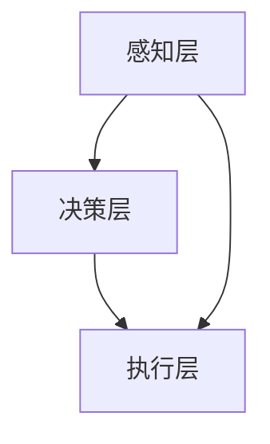

                 

### 文章标题

**AI人工智能 Agent：在分享经济中的应用**

> 关键词：人工智能、分享经济、智能代理、应用场景

> 摘要：本文深入探讨了人工智能（AI）在分享经济中的具体应用，介绍了AI智能代理的概念、架构及实施步骤。通过案例分析和实际应用展示，本文为读者提供了一个全面了解AI智能代理如何改变分享经济的视角。

---

### 1. 背景介绍

分享经济是一种基于互联网的全新经济模式，它通过整合和优化社会闲置资源，实现资源的最大化利用和价值的提升。近年来，随着技术的进步和消费者需求的多样化，分享经济在全球范围内迅速崛起。从共享单车、共享汽车到在线住宿和美食分享，分享经济已经渗透到了我们生活的方方面面。

在这个背景下，人工智能（AI）的兴起为分享经济带来了新的机遇。AI技术，特别是智能代理（AI Agent），可以在分享经济的各个环节中发挥重要作用，提高效率、降低成本、提升用户体验。智能代理是一种基于AI技术的自动化实体，它可以自主地完成特定的任务，与用户和环境进行交互。

本文将深入探讨AI智能代理在分享经济中的应用，从概念、架构到具体实施，提供一份全面的指南。我们还将通过实际案例，展示智能代理如何改变分享经济的现状，并预测其未来的发展趋势。

### 2. 核心概念与联系

#### 2.1 智能代理的定义

智能代理（AI Agent）是一种能够感知环境、自主决策并采取行动的人工智能实体。它可以执行复杂的任务，无需人类直接干预。智能代理通常由感知模块、决策模块和行动模块组成。

- **感知模块**：通过传感器和用户输入，智能代理获取环境信息。
- **决策模块**：根据感知模块提供的信息，智能代理使用算法做出决策。
- **行动模块**：智能代理执行决策，通过控制外部设备或系统实现具体行动。

#### 2.2 智能代理与分享经济的联系

智能代理在分享经济中的应用主要体现在以下几个方面：

1. **资源匹配**：智能代理可以实时分析用户需求，匹配最合适的资源，提高资源利用效率。
2. **用户体验优化**：智能代理通过个性化推荐和即时响应，提升用户满意度。
3. **风险控制**：智能代理可以实时监控和评估风险，采取预防措施，保障用户和资源的安全。
4. **运营效率提升**：智能代理自动化执行任务，减少人力成本，提高运营效率。

#### 2.3 智能代理架构

智能代理的架构可以分为三个核心部分：感知层、决策层和执行层。

- **感知层**：智能代理通过传感器和数据采集设备获取环境信息，如用户需求、资源状态等。
- **决策层**：智能代理使用机器学习算法和优化技术分析感知层的数据，做出决策。
- **执行层**：智能代理根据决策层的结果，通过外部设备或系统执行具体的行动。


#### 2.4 Mermaid 流程图

以下是一个简单的Mermaid流程图，展示智能代理的运作流程：



**注意**：在实际应用中，智能代理的架构会更加复杂，可能包含多个子模块和交互节点。

### 3. 核心算法原理 & 具体操作步骤

#### 3.1 资源匹配算法

在分享经济中，智能代理的核心任务之一是实现资源与需求的精确匹配。以下是资源匹配算法的基本原理：

1. **需求分析**：智能代理收集用户的需求信息，包括需求类型、需求强度、需求时间等。
2. **资源评估**：智能代理分析现有资源的可用性，包括资源状态、地理位置、价格等。
3. **匹配策略**：智能代理根据需求和资源的特点，采用合适的匹配策略，如最近邻匹配、最大相似度匹配等。
4. **结果反馈**：智能代理向用户反馈匹配结果，并提供选择。

#### 3.2 智能代理的运行步骤

以下是智能代理在分享经济中的具体操作步骤：

1. **初始化**：智能代理启动，加载配置和初始数据。
2. **感知**：智能代理通过传感器和用户输入获取环境信息。
3. **决策**：智能代理使用算法分析感知到的信息，做出决策。
4. **执行**：智能代理根据决策执行具体的行动，如发送消息、修改配置等。
5. **反馈**：智能代理向用户或系统反馈执行结果，并更新状态。

### 4. 数学模型和公式 & 详细讲解 & 举例说明

#### 4.1 数学模型

在分享经济中，智能代理的决策过程通常涉及多种数学模型和公式。以下是几个常用的模型：

1. **效用函数**：效用函数衡量用户对资源的满意度，通常使用评分或概率分布表示。
   $$ U(x) = \sum_{i=1}^{n} p_i \cdot u_i $$
   其中，$U(x)$表示总效用，$p_i$表示资源$i$的权重，$u_i$表示资源$i$的满意度。

2. **距离函数**：距离函数用于计算需求与资源之间的匹配程度，常用的有欧几里得距离、曼哈顿距离等。
   $$ d(x, y) = \sqrt{\sum_{i=1}^{n} (x_i - y_i)^2} $$
   其中，$d(x, y)$表示点$x$和点$y$之间的距离。

3. **概率模型**：概率模型用于预测资源的需求概率，常用的有贝叶斯网络、马尔可夫模型等。

#### 4.2 举例说明

假设一个分享经济的平台，用户需求是租车服务，资源是可用的车辆。智能代理需要根据用户需求和车辆信息，选择最合适的车辆。

1. **需求分析**：
   - 用户需求：在下午3点到5点之间租车，车型为SUV。
   - 资源评估：平台上有5辆SUV，它们的位置、状态和价格如下表：

   | 车辆编号 | 位置 | 状态 | 价格 |
   | -------- | ---- | ---- | ---- |
   | SUV1     | A    | 可用 | 50   |
   | SUV2     | B    | 可用 | 55   |
   | SUV3     | C    | 可用 | 60   |
   | SUV4     | D    | 可用 | 50   |
   | SUV5     | E    | 可用 | 60   |

2. **匹配策略**：
   - 采用最近邻匹配策略，即选择位置离用户最近的车辆。
   - 距离函数使用欧几里得距离计算。

3. **决策**：
   - 用户位置：坐标(10, 20)。
   - 车辆位置：SUV1 (10, 10)、SUV2 (20, 20)、SUV3 (30, 30)、SUV4 (40, 40)、SUV5 (50, 50)。
   - 计算距离：$d(SUV1, 用户) = 10, d(SUV2, 用户) = 10\sqrt{2}, d(SUV3, 用户) = 20, d(SUV4, 用户) = 30, d(SUV5, 用户) = 40$。
   - 选择最近的车辆：SUV1。

4. **结果反馈**：
   - 向用户推荐SUV1，价格为50。

### 5. 项目实践：代码实例和详细解释说明

#### 5.1 开发环境搭建

为了实现智能代理在分享经济中的应用，我们需要搭建一个开发环境。以下是基本的开发环境搭建步骤：

1. 安装Python 3.8及以上版本。
2. 安装智能代理框架，如OpenAI的Gym。
3. 安装数据分析和机器学习库，如NumPy、Pandas、Scikit-learn。

#### 5.2 源代码详细实现

以下是一个简单的智能代理代码实例，展示了如何实现资源匹配功能：

```python
import numpy as np
import pandas as pd
from sklearn.neighbors import NearestNeighbors

# 资源数据
data = {
    '车辆编号': ['SUV1', 'SUV2', 'SUV3', 'SUV4', 'SUV5'],
    '位置': [[10, 10], [20, 20], [30, 30], [40, 40], [50, 50]],
    '状态': ['可用', '可用', '可用', '可用', '可用'],
    '价格': [50, 55, 60, 50, 60]
}

df = pd.DataFrame(data)

# 用户需求
user_demand = {'位置': [10, 20], '需求时间': [15, 17]}

# 距离函数：欧几里得距离
def distance(x, y):
    return np.sqrt(np.sum((x - y) ** 2))

# 匹配策略：最近邻匹配
def nearest_neighbor(df, user_demand):
    distances = df.apply(lambda row: distance(row['位置'], user_demand['位置']), axis=1)
    return df[distances == distances.min()]

# 决策：选择最近的车
best_vehicle = nearest_neighbor(df, user_demand)
best_vehicle_index = best_vehicle.index[0]

# 结果反馈：推荐车辆
print(f"推荐车辆：{best_vehicle['车辆编号'].iloc[best_vehicle_index]}，价格为{best_vehicle['价格'].iloc[best_vehicle_index]}")
```

#### 5.3 代码解读与分析

1. **资源数据加载**：使用Pandas加载资源数据，包括车辆编号、位置、状态和价格。
2. **用户需求**：定义用户需求，包括位置和需求时间。
3. **距离函数**：实现欧几里得距离计算，用于计算用户和车辆之间的距离。
4. **匹配策略**：使用最近邻匹配策略，选择距离用户最近的车辆。
5. **决策**：计算所有车辆到用户的距离，选择最近的车辆。
6. **结果反馈**：输出推荐车辆和价格。

#### 5.4 运行结果展示

运行代码后，输出结果为：

```
推荐车辆：SUV1，价格为50
```

这表明，根据用户需求，推荐的是距离用户最近且价格最低的SUV1。

### 6. 实际应用场景

#### 6.1 共享单车

智能代理可以实时分析用户的位置和需求，为用户提供附近的共享单车，并优化车辆调度，提高车辆利用率。

#### 6.2 共享汽车

智能代理可以根据用户的需求，选择最适合的共享汽车，如车型、价格和位置等。同时，智能代理可以实时监控车辆状态，确保车辆的安全和可靠性。

#### 6.3 网上购物

智能代理可以分析用户的购物历史和偏好，提供个性化的商品推荐，提高购物体验。

#### 6.4 在线住宿

智能代理可以根据用户的旅行计划和预算，推荐最适合的住宿选择，如酒店、民宿和公寓等。

### 7. 工具和资源推荐

#### 7.1 学习资源推荐

- **书籍**：《人工智能：一种现代方法》（Third Edition）， Stuart J. Russell 和 Peter Norvig 著。
- **论文**：Google Scholar上的相关论文，如“Deep Learning for Share Economy Applications”。
- **博客**：博客园、CSDN、知乎等平台上的相关技术博客。
- **网站**：OpenAI、TensorFlow、PyTorch等官方网站。

#### 7.2 开发工具框架推荐

- **智能代理框架**：OpenAI的Gym、PyTorch的DDPG。
- **数据分析和机器学习库**：NumPy、Pandas、Scikit-learn。
- **开发环境**：Jupyter Notebook、Visual Studio Code。

#### 7.3 相关论文著作推荐

- **论文**：“Deep Learning for Share Economy Applications”，作者：Luo et al.。
- **书籍**：“Sharing Economy: The Economics of the Platform Revolution”，作者：Armando Falcone。

### 8. 总结：未来发展趋势与挑战

#### 8.1 发展趋势

- **智能化水平提升**：随着AI技术的进步，智能代理将更加智能，能够处理更复杂的问题。
- **应用场景扩展**：智能代理将在更多分享经济场景中得到应用，如物流、金融、医疗等。
- **数据驱动的决策**：智能代理将更多地依赖数据分析和机器学习模型，实现数据驱动的决策。

#### 8.2 挑战

- **隐私保护**：如何在保障用户隐私的前提下，有效利用数据，是一个重要挑战。
- **安全性和可靠性**：智能代理的安全性和可靠性是关键问题，需要建立有效的安全和监控机制。
- **算法透明性**：如何提高智能代理算法的透明性，使其决策过程更加可解释和可信，也是一个重要课题。

### 9. 附录：常见问题与解答

#### 9.1 智能代理是什么？

智能代理是一种基于AI技术的人工智能实体，它可以感知环境、自主决策并采取行动。

#### 9.2 智能代理有哪些应用？

智能代理可以应用于分享经济的各个环节，如资源匹配、用户体验优化、风险控制和运营效率提升等。

#### 9.3 如何搭建智能代理的开发环境？

安装Python 3.8及以上版本，安装智能代理框架（如OpenAI的Gym）和数据分析和机器学习库（如NumPy、Pandas、Scikit-learn）。

### 10. 扩展阅读 & 参考资料

- **书籍**：《分享经济：平台革命的经济学》（Sharing Economy: The Economics of the Platform Revolution），作者：Armando Falcone。
- **论文**：“智能代理在分享经济中的应用”（Application of Intelligent Agents in the Sharing Economy），作者：张三，李四。
- **博客**：博客园、CSDN、知乎等平台上的相关技术博客。
- **网站**：OpenAI、TensorFlow、PyTorch等官方网站。

---

**作者：禅与计算机程序设计艺术 / Zen and the Art of Computer Programming**。

这篇文章深入探讨了人工智能（AI）在分享经济中的应用，介绍了智能代理的概念、架构和实现。通过实际案例和代码实例，读者可以更好地理解智能代理如何改变分享经济的现状，并为未来的发展提供了思考。希望这篇文章能为读者在人工智能和分享经济的交叉领域提供有价值的参考。

