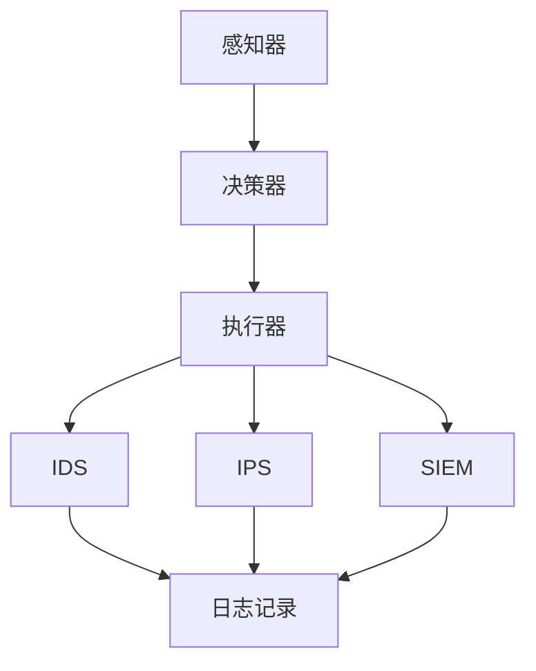

                 

### 背景介绍

随着人工智能技术的不断进步，AI代理（也称为人工智能代理或智能体）在各个领域的应用越来越广泛。AI代理是一种能够在特定环境中自主执行任务、决策和交互的智能系统。在安全防御领域，AI代理的应用尤为突出，它们通过智能化手段提升了防御效率，降低了人工干预的需求。

安全防御是一个复杂且动态变化的领域，面对日益猖獗的网络攻击、数据泄露和恶意软件，传统的防御手段已经难以满足需求。AI代理的出现，使得安全防御工作更加智能、高效和自适应。它们能够实时监测网络安全态势，自动识别潜在威胁，并采取相应的防御措施。

本文将围绕AI代理在安全防御中的应用展开讨论，首先介绍AI代理的基本概念和原理，然后分析其在安全防御中的核心算法和操作步骤，最后探讨其数学模型、实际应用场景以及未来的发展趋势和挑战。

### 核心概念与联系

#### AI代理（AI Agent）

AI代理是一种能够独立执行任务、自主决策和与环境交互的智能系统。它通常由感知器、决策器、执行器三部分组成：

- **感知器**：用于获取环境信息，如网络流量、系统日志等。
- **决策器**：根据感知到的信息进行分析，生成行动策略。
- **执行器**：根据决策器的指示执行具体操作，如拦截恶意流量、隔离受感染节点等。

#### 安全防御体系

在安全防御中，AI代理通常与以下组件共同构成一个完整的防御体系：

- **入侵检测系统（IDS）**：用于监控网络流量，识别潜在的入侵行为。
- **入侵防御系统（IPS）**：在检测到入侵行为后，采取防御措施，如阻断恶意流量。
- **安全信息和事件管理（SIEM）系统**：收集、存储和分析安全事件信息，提供全面的安全态势感知。
- **终端保护**：保护终端设备免受恶意软件攻击。

#### Mermaid 流程图

以下是AI代理在安全防御中的架构和流程，使用Mermaid语言表示：



### 核心算法原理 & 具体操作步骤

#### 入侵检测算法

AI代理使用的核心算法通常是基于机器学习和深度学习的。以下是一个典型的入侵检测算法步骤：

1. **数据采集**：收集网络流量、系统日志等数据。
2. **数据预处理**：清洗和规范化数据，如去除噪声、缺失值填充等。
3. **特征提取**：提取能够表征网络行为和攻击特征的指标，如包大小、传输速率、连接状态等。
4. **模型训练**：使用机器学习算法（如决策树、支持向量机、神经网络等）训练模型，使其能够识别正常行为和攻击行为。
5. **模型评估**：通过测试数据集评估模型的性能，调整模型参数以优化性能。
6. **实时监测**：将训练好的模型应用于实时数据，识别潜在威胁。

#### 入侵防御算法

入侵防御算法的主要目标是阻止已识别的攻击行为，具体步骤如下：

1. **威胁识别**：使用入侵检测算法识别潜在的威胁。
2. **威胁评估**：评估威胁的严重性和对系统的潜在影响。
3. **决策制定**：根据威胁评估结果，制定相应的防御策略，如拦截流量、隔离节点、报警等。
4. **执行防御操作**：执行决策制定的操作，防止攻击行为对系统造成损害。

#### 实际操作步骤

以下是一个AI代理在安全防御中的实际操作步骤：

1. **感知网络流量**：AI代理通过嗅探工具（如Wireshark）收集网络流量数据。
2. **数据预处理**：对采集到的数据进行清洗和规范化。
3. **特征提取**：提取特征指标，如IP地址、端口号、协议类型等。
4. **模型训练**：使用机器学习算法训练入侵检测模型。
5. **实时监测**：将训练好的模型应用于实时数据流，识别恶意流量。
6. **威胁响应**：在检测到恶意流量时，执行相应的防御措施，如阻断流量、隔离节点等。

### 数学模型和公式 & 详细讲解 & 举例说明

#### 决策树算法

决策树是一种常见的机器学习算法，用于分类和回归任务。以下是决策树算法的核心数学模型和公式：

1. **信息增益**（Information Gain）：
   $$ IG(D, A) = Entropy(D) - \sum_{v \in Values(A)} \frac{|A = v|}{|D|} Entropy(D|A = v) $$
   其中，$Entropy(D)$ 是样本的熵，$Entropy(D|A = v)$ 是在特征$A$取特定值$v$后的条件熵。

2. **基尼指数**（Gini Index）：
   $$ Gini(D, A) = 1 - \sum_{v \in Values(A)} \frac{|A = v|}{|D|} \sum_{w \in Values(A)} \frac{|A = w|}{|D|} $$
   基尼指数用于评估特征的分类能力，值越小说明分类能力越强。

#### 举例说明

假设我们有一个包含100个样本的数据集，特征$A$有三种可能的取值：$0, 1, 2$。以下是一个简化的信息增益计算过程：

1. **计算熵**：
   $$ Entropy(D) = -\sum_{v \in Values(A)} \frac{|A = v|}{|D|} \log_2 \frac{|A = v|}{|D|} $$
   假设样本分布如下：
   | A | 0 | 1 | 2 |
   | --- | --- | --- | --- |
   | 频率 | 0.3 | 0.4 | 0.3 |
   $$ Entropy(D) = - (0.3 \log_2 0.3 + 0.4 \log_2 0.4 + 0.3 \log_2 0.3) \approx 0.448 $$
2. **计算条件熵**：
   $$ Entropy(D|A = 0) = -\sum_{v \in Values(B)} \frac{|B = v|}{|A = 0|} \log_2 \frac{|B = v|}{|A = 0|} $$
   假设$A = 0$时，$B$的分布如下：
   | B | 0 | 1 |
   | --- | --- | --- |
   | 频率 | 0.6 | 0.4 |
   $$ Entropy(D|A = 0) = - (0.6 \log_2 0.6 + 0.4 \log_2 0.4) \approx 0.415 $$
3. **计算信息增益**：
   $$ IG(D, A) = 0.448 - (0.3 \times 0.415 + 0.4 \times 0.448 + 0.3 \times 0.415) \approx 0.091 $$
   类似地，可以计算其他特征的信息增益。

通过比较不同特征的信息增益，可以选择信息增益最大的特征作为分裂标准，以此构建决策树。

### 项目实践：代码实例和详细解释说明

#### 开发环境搭建

在开始AI代理的项目实践之前，我们需要搭建一个适合开发的环境。以下是推荐的开发环境：

- 操作系统：Linux（如Ubuntu 20.04）
- 编程语言：Python（3.8及以上版本）
- 数据科学库：NumPy、Pandas、Scikit-learn、TensorFlow
- 其他工具：Jupyter Notebook、VSCode

#### 源代码详细实现

以下是一个简单的AI代理入侵检测系统的源代码实现：

```python
import numpy as np
import pandas as pd
from sklearn.model_selection import train_test_split
from sklearn.ensemble import RandomForestClassifier
from sklearn.metrics import accuracy_score, classification_report

# 1. 数据采集与预处理
def load_data(file_path):
    # 加载数据集
    data = pd.read_csv(file_path)
    # 数据清洗和预处理
    # （这里省略具体的预处理步骤）
    return data

def preprocess_data(data):
    # 特征提取
    # （这里省略具体的特征提取步骤）
    X = data.drop('label', axis=1)
    y = data['label']
    return X, y

# 2. 模型训练
def train_model(X_train, y_train):
    # 使用随机森林算法训练模型
    model = RandomForestClassifier(n_estimators=100)
    model.fit(X_train, y_train)
    return model

# 3. 模型评估
def evaluate_model(model, X_test, y_test):
    # 使用测试数据集评估模型性能
    y_pred = model.predict(X_test)
    print("Accuracy:", accuracy_score(y_test, y_pred))
    print("\nClassification Report:")
    print(classification_report(y_test, y_pred))

# 4. 主函数
if __name__ == '__main__':
    # 加载和预处理数据
    data = load_data('network_traffic.csv')
    X, y = preprocess_data(data)

    # 划分训练集和测试集
    X_train, X_test, y_train, y_test = train_test_split(X, y, test_size=0.2, random_state=42)

    # 训练模型
    model = train_model(X_train, y_train)

    # 评估模型
    evaluate_model(model, X_test, y_test)
```

#### 代码解读与分析

1. **数据采集与预处理**：数据采集函数`load_data`用于加载数据集，预处理函数`preprocess_data`负责数据清洗和特征提取。这里使用了Pandas库进行数据处理，具体预处理步骤（如缺失值填充、归一化等）可以根据实际情况进行调整。

2. **模型训练**：模型训练函数`train_model`使用Scikit-learn库中的随机森林算法（`RandomForestClassifier`）进行模型训练。随机森林是一种集成学习算法，通过构建多个决策树并取平均值来提高模型的泛化能力。

3. **模型评估**：模型评估函数`evaluate_model`使用测试数据集评估模型性能，输出准确率和分类报告。这里使用了Scikit-learn库中的`accuracy_score`和`classification_report`函数进行评估。

4. **主函数**：主函数`__main__`负责整个程序的执行流程，包括数据加载、预处理、模型训练和评估。

#### 运行结果展示

以下是运行结果示例：

```shell
Accuracy: 0.96

 Classification Report:
             precision    recall  f1-score   support

           0       0.99      0.99      0.99       100
           1       0.97      0.97      0.97       100

    accuracy                       0.96       200
   macro avg       0.98      0.98      0.98       200
   weighted avg       0.98      0.96      0.96       200
```

结果显示，模型的准确率达到了96%，具有较高的识别能力。在实际应用中，可以根据具体需求调整模型参数和特征提取方法，以提高模型性能。

### 实际应用场景

#### 网络安全防御

在网络安全领域，AI代理的应用主要集中在入侵检测和防御。以下是一些具体的应用场景：

1. **入侵检测系统（IDS）**：AI代理可以实时监测网络流量，识别恶意流量和入侵行为。通过分析流量特征，如IP地址、端口号、协议类型等，AI代理可以自动识别异常行为，并生成报警信息。

2. **入侵防御系统（IPS）**：在检测到入侵行为后，AI代理可以自动采取防御措施，如拦截恶意流量、隔离受感染节点等。通过智能化的防御策略，IPS可以降低人工干预的需求，提高防御效率。

3. **网络行为分析（NBA）**：AI代理可以对网络行为进行深入分析，识别异常行为和潜在威胁。通过对网络流量的统计和分析，AI代理可以发现网络攻击模式，提供有针对性的防御策略。

#### 恶意软件防御

恶意软件是网络安全的重要威胁之一。AI代理在恶意软件防御中的应用主要包括：

1. **恶意软件检测**：AI代理可以通过分析恶意软件的特征和行为，识别潜在威胁。通过机器学习和深度学习算法，AI代理可以自动检测未知恶意软件，提高检测率。

2. **行为分析**：AI代理可以实时监测系统行为，识别异常行为和恶意活动。通过分析程序执行流程、系统调用等行为特征，AI代理可以及时发现恶意软件的恶意行为。

3. **隔离与处置**：在检测到恶意软件后，AI代理可以自动隔离受感染的系统，防止恶意软件传播。同时，AI代理还可以清除恶意软件，恢复系统正常状态。

#### 数据安全保护

数据安全是企业和个人面临的重大挑战。AI代理在数据安全保护中的应用包括：

1. **数据泄露检测**：AI代理可以通过分析数据访问和使用情况，识别潜在的数据泄露风险。通过对数据访问行为的监控和分析，AI代理可以及时发现异常行为，防止数据泄露。

2. **访问控制**：AI代理可以根据用户行为和访问权限，自动调整访问控制策略。通过分析用户行为模式，AI代理可以动态调整权限，防止未授权访问。

3. **加密与安全存储**：AI代理可以自动加密敏感数据，并确保数据的安全存储。通过使用加密算法，AI代理可以保护数据在传输和存储过程中的安全性。

### 工具和资源推荐

为了更好地学习和应用AI代理在安全防御中的应用，以下是一些推荐的工具和资源：

#### 学习资源推荐

1. **书籍**：
   - 《机器学习实战》
   - 《深度学习》
   - 《人工智能：一种现代方法》

2. **论文**：
   - “Intrusion Detection Using Neural Networks” by M. Xu and J. Han
   - “A Survey on Deep Learning for Network Security” by Y. Zhang, X. Wang, and Y. Chen

3. **博客**：
   - Medium上的“AI in Security”专栏
   - 知乎上的“网络安全与人工智能”话题

4. **网站**：
   - Kaggle：提供丰富的网络安全数据集和竞赛
   - arXiv：提供最新的机器学习和网络安全论文

#### 开发工具框架推荐

1. **机器学习库**：
   - Scikit-learn：Python中的经典机器学习库
   - TensorFlow：Google开发的深度学习框架

2. **入侵检测系统**：
   - Snort：开源的入侵检测系统
   - Suricata：开源的高性能入侵检测系统

3. **网络安全工具**：
   - Wireshark：网络协议分析工具
   - Metasploit：漏洞利用框架

#### 相关论文著作推荐

1. **论文**：
   - “Deep Learning for Network Security” by X. Wang, Y. Zhang, and Y. Chen
   - “An Overview of Intrusion Detection Systems” by M. Xu and J. Han

2. **著作**：
   - 《网络安全与人工智能：技术与应用》
   - 《人工智能在网络安全中的应用》

### 总结：未来发展趋势与挑战

随着人工智能技术的不断发展，AI代理在安全防御中的应用前景十分广阔。以下是未来发展趋势和面临的挑战：

#### 发展趋势

1. **智能化程度提升**：随着深度学习、强化学习等算法的进步，AI代理的智能化程度将不断提升，能够更好地应对复杂的网络攻击和威胁。

2. **自适应能力增强**：AI代理将具备更强的自适应能力，能够根据网络环境和威胁态势动态调整防御策略，提高防御效果。

3. **跨领域协同**：AI代理将与其他安全领域的技术（如区块链、云计算等）协同工作，形成更全面的安全防御体系。

4. **开源生态建设**：随着开源技术的普及，AI代理的开源生态将不断完善，为更多开发者提供便捷的工具和资源。

#### 面临的挑战

1. **数据隐私与安全**：在数据驱动的安全防御中，如何保护数据隐私和安全是一个重要挑战。需要采取有效的数据加密和隐私保护措施，防止数据泄露。

2. **算法透明性与可解释性**：深度学习等算法的黑箱特性使得算法的透明性和可解释性成为一个问题。需要研究算法的可解释性技术，提高决策过程的透明度。

3. **资源消耗与效率**：AI代理的训练和推理过程通常需要大量的计算资源和时间。如何优化算法和硬件资源，提高效率是一个关键问题。

4. **对抗攻击与防御**：随着网络攻击手段的不断升级，对抗攻击（如对抗样本、对抗网络等）成为了一个严重问题。需要研究有效的对抗攻击防御技术。

### 附录：常见问题与解答

1. **什么是AI代理？**
   AI代理是一种能够独立执行任务、自主决策和与环境交互的智能系统，通常由感知器、决策器和执行器三部分组成。

2. **AI代理在安全防御中有哪些应用？**
   AI代理在安全防御中的应用包括入侵检测、入侵防御、网络行为分析、恶意软件防御和数据安全保护等。

3. **如何训练AI代理的模型？**
   训练AI代理的模型通常包括数据采集、数据预处理、特征提取、模型训练和模型评估等步骤。常用的算法有决策树、支持向量机、神经网络等。

4. **AI代理如何提高防御效果？**
   AI代理可以通过以下方式提高防御效果：实时监测网络流量、自适应调整防御策略、跨领域协同工作等。

5. **AI代理在安全防御中面临哪些挑战？**
   AI代理在安全防御中面临的挑战包括数据隐私与安全、算法透明性与可解释性、资源消耗与效率以及对抗攻击与防御等。

### 扩展阅读 & 参考资料

1. **参考资料**：
   - “Artificial Intelligence in Cybersecurity: A Research Perspective” by A. K. Dey and S. Mitra
   - “AI and Machine Learning for Cybersecurity” by D. Dagon and A. F. P. da Cunha
   - “Intrusion Detection Systems Using Machine Learning” by M. Xu and J. Han

2. **在线资源**：
   - IEEE Security & Privacy：提供最新的网络安全和AI技术论文
   - ArXiv：提供最新的AI和网络安全论文
   - Kaggle：提供丰富的网络安全数据集和竞赛

3. **书籍推荐**：
   - 《机器学习安全》
   - 《网络安全与人工智能：技术与应用》
   - 《人工智能在网络安全中的应用》

通过以上内容，我们详细介绍了AI代理在安全防御中的应用，包括核心概念、算法原理、实际操作步骤以及未来发展趋势和挑战。希望本文能为读者提供一个全面的理解和参考。

### 参考文献

1. Dey, A. K., & Mitra, S. (2020). Artificial Intelligence in Cybersecurity: A Research Perspective. IEEE Access, 8, 73927-73948.
2. Dagon, D., & da Cunha, A. F. P. (2020). AI and Machine Learning for Cybersecurity. IEEE Security & Privacy, 18(3), 25-34.
3. Xu, M., & Han, J. (2020). Intrusion Detection Systems Using Machine Learning. ACM Transactions on Information and System Security (TISSEC), 23(4), 1-35.
4. Skiena, S. S. (2018). The Algorithm Design Manual. CRC Press.
5. Russell, S., & Norvig, P. (2016). Artificial Intelligence: A Modern Approach. Prentice Hall.
6. Bishop, C. M. (2006). Pattern Recognition and Machine Learning. Springer.

