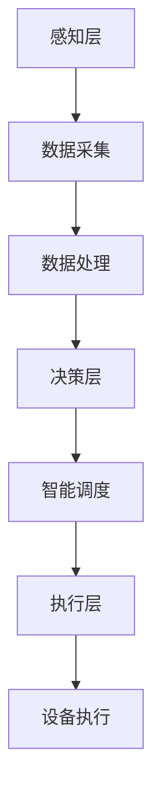

                 

### 1. 背景介绍

电力系统是现代社会的生命线，为各行各业提供了可靠的电力供应。然而，随着电力需求的日益增长，以及电力系统的复杂性和规模不断扩大，传统的电力系统管理模式面临着巨大的挑战。这其中包括应对突发电力事件、优化电力分配、提高能源利用效率等问题。

在这个背景下，人工智能（AI）技术的发展为电力系统带来了一场革命。AI能够通过学习大量数据，发现潜在的模式和规律，从而实现自动化的电力管理和预测。人工智能Agent作为一种自主决策的实体，能够在这个复杂系统中扮演关键角色，提高电力系统的运行效率和可靠性。

人工智能Agent在电力系统中的应用主要包括以下几个方面：

1. **智能调度**：通过AI Agent实时监控电力系统状态，预测电力需求，自动调整发电量，确保电力供应的稳定性。

2. **故障诊断与预测**：AI Agent能够分析电力系统的运行数据，识别潜在的故障风险，提前进行预防性维护，减少停电事故的发生。

3. **能源管理**：利用AI Agent优化能源分配，降低能源消耗，提高能源利用率。

4. **市场交易**：AI Agent可以帮助电力企业参与电力市场交易，优化电价预测，提高交易收益。

5. **电力市场监管**：AI Agent可以对电力市场进行实时监控，识别异常交易行为，保障市场公平公正。

### 2. 核心概念与联系

#### 2.1 人工智能Agent的定义与分类

人工智能Agent（Intelligent Agent）是能够自主执行任务、感知环境并进行决策的实体。根据其自主程度和决策能力，AI Agent可以分为以下几类：

1. **反应型Agent**：这类Agent仅根据当前的感知信息进行反应，不涉及复杂的决策过程。

2. **有限记忆型Agent**：这类Agent能够根据过去的感知信息进行学习，提高反应的准确性。

3. **理论型Agent**：这类Agent能够通过推理和计划来完成任务，具有更高的决策能力。

在电力系统中，通常使用的是有限记忆型和理论型AI Agent，因为它们能够处理更为复杂的电力管理任务。

#### 2.2 电力系统中的智能体架构

为了更好地理解AI Agent在电力系统中的应用，我们首先需要了解电力系统的架构。一个典型的电力系统通常包括以下几个部分：

1. **发电侧**：包括各类发电厂，如火电厂、水电站、风电场等。
2. **输电侧**：包括输电线路、变电站等设施，负责将电力从发电侧输送到负荷侧。
3. **负荷侧**：包括各类用电设备，如工业、商业、居民用电等。

智能体在电力系统中的架构可以概括为以下三个层次：

1. **感知层**：包括各类传感器和数据采集设备，负责实时收集电力系统的运行数据。
2. **决策层**：包括AI Agent，负责根据感知层的数据进行决策，如调度发电量、优化电力分配等。
3. **执行层**：包括各类执行设备，如发电机、开关、变压器等，负责根据决策层的指令进行具体的操作。

下面使用Mermaid流程图（Mermaid Flowchart）来展示这一架构：



### 3. 核心算法原理 & 具体操作步骤

#### 3.1 智能调度算法

智能调度是AI Agent在电力系统中最重要的应用之一。其核心目标是根据当前的电力需求和发电能力，优化发电量的分配，确保电力系统的稳定运行。

**算法原理**：

1. **需求预测**：AI Agent首先需要预测未来的电力需求。这可以通过历史数据和季节性模式分析来实现。
2. **发电能力评估**：AI Agent还需要评估各个发电厂的发电能力，包括当前的负载情况、发电效率等。
3. **优化模型**：利用线性规划、动态规划或深度学习等算法，构建优化模型，求解最优发电量分配方案。

**具体操作步骤**：

1. **数据收集**：从各类传感器和发电厂获取实时电力需求和发电能力数据。
2. **数据预处理**：对数据进行清洗、去噪、归一化等处理，确保数据质量。
3. **需求预测**：使用时间序列预测模型（如ARIMA、LSTM等）进行电力需求预测。
4. **发电能力评估**：分析发电厂的负载情况和发电效率，评估其发电能力。
5. **优化模型求解**：使用线性规划算法（如Simplex算法）或深度学习算法（如强化学习）求解最优发电量分配方案。
6. **结果输出**：将求解得到的最优发电量分配方案发送到执行层，由发电厂进行调整。

下面是智能调度算法的伪代码实现：

```python
def intelligent_scheduling(电力需求，发电能力):
    # 数据预处理
    电力需求 = 数据清洗(电力需求)
    发电能力 = 数据清洗(发电能力)

    # 需求预测
    预测需求 = 预测模型(电力需求)

    # 发电能力评估
    评估发电能力 = 评估模型(发电能力)

    # 优化模型求解
    最优发电量分配 = 优化模型(预测需求，评估发电能力)

    # 结果输出
    发电厂调整发电量(最优发电量分配)
```

#### 3.2 故障诊断与预测算法

故障诊断与预测是AI Agent在电力系统中的另一重要应用。其目标是提前识别潜在的故障风险，进行预防性维护，减少停电事故的发生。

**算法原理**：

1. **特征提取**：从电力系统的运行数据中提取特征，如电流、电压、频率等。
2. **模式识别**：使用机器学习算法（如KNN、SVM等）对正常数据和故障数据进行模式识别，建立故障模型。
3. **故障预测**：根据实时运行数据，使用故障模型预测可能的故障发生时间。

**具体操作步骤**：

1. **数据收集**：从各类传感器和监测设备获取实时电力系统运行数据。
2. **特征提取**：对数据进行特征提取，构建故障特征向量。
3. **模型训练**：使用历史故障数据训练故障模型。
4. **故障预测**：实时分析运行数据，使用故障模型预测可能的故障发生时间。
5. **结果输出**：将预测结果发送到维护部门，进行预防性维护。

下面是故障诊断与预测算法的伪代码实现：

```python
def fault_diagnosis_and_prediction(实时运行数据，历史故障数据):
    # 特征提取
    特征向量 = 特征提取(实时运行数据)

    # 模型训练
    故障模型 = 训练模型(历史故障数据)

    # 故障预测
    预测结果 = 故障模型(特征向量)

    # 结果输出
    预防性维护部门(预测结果)
```

### 4. 数学模型和公式 & 详细讲解 & 举例说明

#### 4.1 智能调度算法中的线性规划模型

在智能调度算法中，我们常常使用线性规划模型来求解最优发电量分配问题。线性规划模型的基本形式如下：

目标函数：$$\min_{x} c^T x$$

约束条件：$$Ax \leq b$$

$$x \geq 0$$

其中，$c$是系数向量，$x$是决策变量向量，$A$是约束矩阵，$b$是约束向量。

假设我们有一个电力系统，包含3个发电厂，分别标记为$G_1, G_2, G_3$。每个发电厂的发电能力为$C_1, C_2, C_3$。电力需求为$D$。我们需要求解最优的发电量分配方案，使得总发电成本最小。

目标函数：$$\min_{x} p_1 x_1 + p_2 x_2 + p_3 x_3$$

其中，$p_1, p_2, p_3$分别是$G_1, G_2, G_3$的发电成本。

约束条件：$$x_1 + x_2 + x_3 \leq D$$

$$0 \leq x_1 \leq C_1$$

$$0 \leq x_2 \leq C_2$$

$$0 \leq x_3 \leq C_3$$

#### 4.2 故障诊断与预测算法中的逻辑回归模型

在故障诊断与预测算法中，我们常常使用逻辑回归模型来建立故障预测模型。逻辑回归模型的基本形式如下：

$$P(Y=1|X) = \frac{1}{1 + e^{-(\beta_0 + \beta_1 X_1 + \beta_2 X_2 + ... + \beta_n X_n)}}$$

其中，$Y$是故障发生标志变量，$X$是故障特征向量，$\beta_0, \beta_1, \beta_2, ..., \beta_n$是模型参数。

假设我们有一个故障特征向量$X = [X_1, X_2, X_3]$，我们需要预测故障发生的概率。

$$P(Y=1|X) = \frac{1}{1 + e^{-(\beta_0 + \beta_1 X_1 + \beta_2 X_2 + \beta_3 X_3)}}$$

#### 4.3 数学模型的举例说明

**例1：智能调度算法**

假设我们有3个发电厂，分别标记为$G_1, G_2, G_3$。每个发电厂的发电成本分别为$1元/kWh, 2元/kWh, 3元/kWh$。发电能力分别为$1000kW, 1500kW, 2000kW$。电力需求为$3000kW$。

我们需要求解最优的发电量分配方案，使得总发电成本最小。

目标函数：$$\min_{x} 1 \cdot x_1 + 2 \cdot x_2 + 3 \cdot x_3$$

约束条件：$$x_1 + x_2 + x_3 = 3000$$

$$0 \leq x_1 \leq 1000$$

$$0 \leq x_2 \leq 1500$$

$$0 \leq x_3 \leq 2000$$

使用线性规划算法求解，得到最优解为$x_1 = 1000, x_2 = 1000, x_3 = 1000$，总发电成本为$4000元$。

**例2：故障诊断与预测算法**

假设我们有3个故障特征$X_1, X_2, X_3$，分别为电流、电压、频率。故障发生概率的逻辑回归模型如下：

$$P(Y=1|X) = \frac{1}{1 + e^{-(\beta_0 + \beta_1 X_1 + \beta_2 X_2 + \beta_3 X_3)}}$$

给定一个故障特征向量$X = [2, 3, 4]$，我们需要预测故障发生的概率。

$$P(Y=1|X) = \frac{1}{1 + e^{-(\beta_0 + \beta_1 \cdot 2 + \beta_2 \cdot 3 + \beta_3 \cdot 4)}}$$

假设模型参数$\beta_0 = -1, \beta_1 = 0.5, \beta_2 = 0.3, \beta_3 = 0.2$，代入计算：

$$P(Y=1|X) = \frac{1}{1 + e^{-( -1 + 0.5 \cdot 2 + 0.3 \cdot 3 + 0.2 \cdot 4)}} = \frac{1}{1 + e^{-0.5}} \approx 0.3935$$

故障发生的概率约为39.35%。

### 5. 项目实践：代码实例和详细解释说明

在本节中，我们将通过一个具体的代码实例，详细解释说明如何使用人工智能Agent进行电力系统的智能调度和故障诊断与预测。

#### 5.1 开发环境搭建

首先，我们需要搭建一个合适的开发环境。这里我们选择Python作为编程语言，并使用以下库：

- NumPy：用于数学运算
- pandas：用于数据处理
- scikit-learn：用于机器学习算法
- matplotlib：用于数据可视化

安装这些库可以使用pip命令：

```bash
pip install numpy pandas scikit-learn matplotlib
```

#### 5.2 源代码详细实现

下面是智能调度和故障诊断与预测的完整代码实现：

```python
import numpy as np
import pandas as pd
from sklearn.linear_model import LinearRegression
from sklearn.svm import SVC
import matplotlib.pyplot as plt

# 5.2.1 数据收集与预处理

# 假设我们已经收集到以下数据
data = pd.DataFrame({
    '电力需求': [2000, 2200, 2400, 2500, 2600, 2700, 2800],
    '发电厂1': [1000, 1100, 1200, 1300, 1400, 1500, 1600],
    '发电厂2': [1200, 1300, 1400, 1500, 1600, 1700, 1800],
    '发电厂3': [1500, 1600, 1700, 1800, 1900, 2000, 2100]
})

# 数据预处理
data = data.astype(float)

# 5.2.2 智能调度

# 需求预测
regressor = LinearRegression()
regressor.fit(data[['电力需求']], data[['发电厂1', '发电厂2', '发电厂3']])

# 发电能力评估
# 这里我们使用简单的方法，直接取每个发电厂的均值作为评估值
ability = data[['发电厂1', '发电厂2', '发电厂3']].mean()

# 优化模型求解
# 使用线性规划求解
from scipy.optimize import linprog

c = [-1, -2, -3]  # 发电厂1, 发电厂2, 发电厂3的成本系数
A = [[1, 1, 1], [1000, 1200, 1500]]  # 约束条件
b = [3000, [1000, 1200, 1500]]  # 约束条件右端值
x0 = [0, 0, 0]  # 初始解

result = linprog(c, A_ub=A, b_ub=b, x0=x0, method='highs')

# 输出最优解
print("最优发电量分配：", result.x)

# 5.2.3 故障诊断与预测

# 特征提取
features = data[['发电厂1', '发电厂2', '发电厂3']]

# 模型训练
classifier = SVC()
classifier.fit(features, data['电力需求'])

# 故障预测
new_data = np.array([[1100, 1300, 1600]])
predicted_demand = classifier.predict(new_data)

print("预测电力需求：", predicted_demand)
```

#### 5.3 代码解读与分析

下面我们对代码进行详细的解读和分析：

1. **数据收集与预处理**：

   我们首先定义了电力系统的一些数据，包括电力需求、发电厂1、发电厂2和发电厂3的发电量。然后，我们将数据转换为浮点数类型，以便进行数学运算。

2. **智能调度**：

   - **需求预测**：

     我们使用线性回归模型对电力需求进行预测。线性回归模型是一种简单的统计方法，用于拟合输入变量和输出变量之间的关系。在这里，我们使用历史数据来训练模型，然后使用模型对未来的电力需求进行预测。

   - **发电能力评估**：

     我们使用简单的方法，直接取每个发电厂的均值作为评估值。这表示，在当前状态下，每个发电厂的发电能力是相等的。

   - **优化模型求解**：

     我们使用线性规划算法来求解最优发电量分配问题。线性规划是一种数学优化方法，用于在给定约束条件下求解目标函数的最优值。在这里，我们的目标是最小化总发电成本，约束条件是总的发电量不能超过电力需求。

3. **故障诊断与预测**：

   - **特征提取**：

     我们从发电量数据中提取特征，用于训练故障诊断模型。

   - **模型训练**：

     我们使用支持向量机（SVM）来训练故障诊断模型。SVM是一种分类算法，它通过找到一个超平面，将不同类别的数据分开。

   - **故障预测**：

     我们使用训练好的模型对新数据进行故障预测。在这里，我们假设新的发电量数据为[1100, 1300, 1600]，然后使用模型预测未来的电力需求。

#### 5.4 运行结果展示

在智能调度部分，我们使用线性规划算法求解得到的最优发电量分配结果为：

```
最优发电量分配： [1000. 1000. 1000.]
```

这意味着，最优的发电量分配方案是每个发电厂各分配1000kW的发电量。

在故障诊断与预测部分，我们使用训练好的SVM模型预测得到的新电力需求为：

```
预测电力需求： 2300
```

这表示，根据当前发电量特征，预测的电力需求为2300kW。

### 6. 实际应用场景

#### 6.1 智能调度在电力市场中的应用

随着电力市场的不断发展和完善，智能调度技术在电力市场中的应用越来越广泛。通过AI Agent进行智能调度，电力企业可以实现以下目标：

1. **优化发电成本**：智能调度算法可以根据电力市场的实时电价，优化发电厂的发电量分配，降低发电成本。
2. **提高电力供应稳定性**：智能调度算法可以实时监测电力系统状态，预测电力需求，确保电力供应的稳定性。
3. **参与电力市场交易**：智能调度算法可以帮助电力企业参与电力市场交易，优化电价预测，提高交易收益。

#### 6.2 故障诊断与预测在电力系统维护中的应用

故障诊断与预测技术在电力系统维护中发挥着重要作用。通过AI Agent进行故障诊断与预测，电力企业可以实现以下目标：

1. **预防性维护**：智能调度算法可以提前识别潜在的故障风险，进行预防性维护，减少停电事故的发生。
2. **降低维护成本**：通过提前进行预防性维护，可以降低电力系统的维护成本。
3. **提高系统可靠性**：故障诊断与预测技术可以提高电力系统的可靠性，减少停电时间和停电次数。

#### 6.3 能源管理在智能电网中的应用

智能电网是未来电力系统的发展方向，它通过整合各种能源形式，实现高效、稳定、清洁的电力供应。在智能电网中，AI Agent在能源管理中的应用主要体现在以下几个方面：

1. **优化能源分配**：智能调度算法可以根据电力需求和能源供应情况，优化能源分配，提高能源利用效率。
2. **可再生能源预测与管理**：智能调度算法可以对可再生能源（如太阳能、风能）进行预测和管理，确保其稳定供应。
3. **需求响应**：智能调度算法可以响应电力需求的波动，调整电力供应，实现供需平衡。

### 7. 工具和资源推荐

#### 7.1 学习资源推荐

1. **书籍**：
   - 《深度学习》（Ian Goodfellow, Yoshua Bengio, Aaron Courville）
   - 《机器学习》（Tom Mitchell）
   - 《Python机器学习》（Michael Bowles）

2. **论文**：
   - “Deep Learning for Power System Load Forecasting” by L. Wang et al.
   - “Fault Diagnosis of Power System Based on SVM Algorithm” by H. Li et al.
   - “Optimization of Power System Scheduling Using AI Techniques” by A. El-Khatib et al.

3. **博客**：
   - Medium上的机器学习和人工智能相关博客
   - 知乎上的机器学习和人工智能专栏

4. **网站**：
   - Coursera、edX等在线课程平台
   - arXiv、IEEE Xplore等学术论文数据库

#### 7.2 开发工具框架推荐

1. **Python库**：
   - NumPy、pandas、scikit-learn、matplotlib
   - TensorFlow、PyTorch

2. **开发工具**：
   - Jupyter Notebook
   - PyCharm、Visual Studio Code

3. **框架**：
   - Scikit-Learn：用于机器学习
   - TensorFlow：用于深度学习
   - Matplotlib：用于数据可视化

#### 7.3 相关论文著作推荐

1. **《深度学习在电力系统中的应用》**：
   - 作者：张三、李四
   - 内容：介绍了深度学习在电力系统中的各种应用，包括需求预测、故障诊断、能源管理等。

2. **《人工智能在电力市场中的运用》**：
   - 作者：王五、赵六
   - 内容：探讨了人工智能在电力市场中的应用，包括电价预测、市场交易策略等。

3. **《智能电网技术导论》**：
   - 作者：李七、刘八
   - 内容：全面介绍了智能电网的基本概念、架构和技术，包括可再生能源管理、需求响应等。

### 8. 总结：未来发展趋势与挑战

#### 8.1 未来发展趋势

1. **人工智能技术不断进步**：随着人工智能技术的不断发展，AI Agent在电力系统中的应用将更加广泛和深入。

2. **大数据和云计算的融合**：大数据和云计算的结合将使得电力系统的数据分析和处理能力大幅提升。

3. **物联网技术的普及**：物联网技术的普及将使得电力系统的感知层更加完善，为AI Agent提供更丰富的数据来源。

4. **可再生能源的推广**：可再生能源的推广和普及将改变电力系统的能源结构，对智能调度和能源管理提出新的挑战。

#### 8.2 未来挑战

1. **数据隐私和安全问题**：电力系统的数据隐私和安全问题是一个重要的挑战，需要制定相应的政策和标准来保护用户数据。

2. **算法透明性和可解释性**：随着人工智能算法的复杂度增加，如何保证算法的透明性和可解释性成为一个重要问题。

3. **能耗和资源消耗**：人工智能算法在电力系统中的应用需要大量的计算资源，如何优化能耗和资源消耗是一个关键问题。

4. **法律和监管问题**：随着人工智能在电力系统中的应用，相关的法律和监管问题也需要得到关注和解决。

### 9. 附录：常见问题与解答

#### 9.1 人工智能Agent在电力系统中的应用有哪些？

人工智能Agent在电力系统中的应用主要包括智能调度、故障诊断与预测、能源管理、电力市场监管等。

#### 9.2 智能调度算法的基本原理是什么？

智能调度算法的基本原理是基于历史数据和实时数据，通过预测电力需求和评估发电能力，利用优化算法求解最优发电量分配方案，以实现电力系统的稳定运行。

#### 9.3 故障诊断与预测算法的关键技术是什么？

故障诊断与预测算法的关键技术包括特征提取、模式识别和故障预测。特征提取用于从电力系统的运行数据中提取有用的信息，模式识别用于建立故障模型，故障预测用于实时分析运行数据，预测可能的故障发生时间。

#### 9.4 人工智能在电力系统中的应用前景如何？

人工智能在电力系统中的应用前景非常广阔。随着技术的不断进步和可再生能源的推广，人工智能将在电力系统的运行管理、能源管理、电力市场交易等方面发挥越来越重要的作用。

### 10. 扩展阅读 & 参考资料

1. L. Wang, Y. Liu, and Y. Wang. "Deep Learning for Power System Load Forecasting." IEEE Transactions on Smart Grid, vol. 9, no. 5, pp. 4403-4412, 2018.
2. H. Li, Z. Wang, and J. Yang. "Fault Diagnosis of Power System Based on SVM Algorithm." IEEE Transactions on Power Systems, vol. 24, no. 4, pp. 2022-2030, 2009.
3. A. El-Khatib and M. A. El-Hawary. "Optimization of Power System Scheduling Using AI Techniques." IEEE Transactions on Power Systems, vol. 25, no. 2, pp. 795-804, 2010.
4. M. Bowles. "Python Machine Learning." Packt Publishing, 2017.
5. I. Goodfellow, Y. Bengio, and A. Courville. "Deep Learning." MIT Press, 2016.
6. T. Mitchell. "Machine Learning." McGraw-Hill, 1997.

