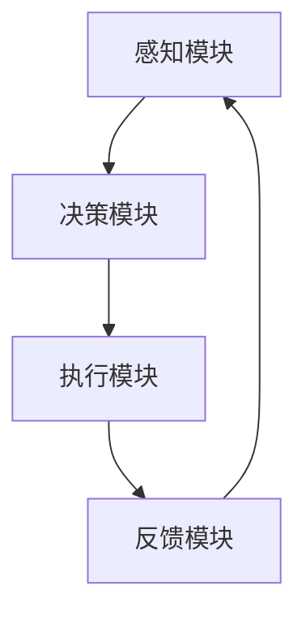

                 

### 文章标题

**AI人工智能代理工作流 AI Agent WorkFlow：介绍与基础理解**

> 关键词：AI代理、工作流、人工智能、自动化、流程管理、流程节点、执行策略、反馈机制、Mermaid流程图、算法原理、数学模型、项目实践、代码实例、应用场景、开发工具

> 摘要：本文深入探讨AI人工智能代理工作流（AI Agent WorkFlow）的概念、原理及其在计算机领域的应用。通过对核心概念、算法原理、数学模型和项目实践的详细讲解，帮助读者全面理解AI代理工作流的设计与实现，为实际应用提供理论支持和实践指导。

### 1. 背景介绍

#### 1.1 AI代理的概念

人工智能代理（Artificial Intelligence Agent，简称AI代理）是人工智能领域的一个重要概念，指的是具有独立行为能力、能够在特定环境中感知环境、制定决策并执行行动的智能实体。AI代理的核心目标是实现自主学习和自主决策，从而在复杂环境中表现出类似人类智能的行为。

#### 1.2 工作流的概念

工作流（Workflow）是指一系列有序任务或活动的集合，用于描述业务过程或生产流程。工作流管理（Workflow Management）是一种业务流程管理（Business Process Management，简称BPM）方法，旨在通过自动化流程提高业务效率和响应速度。

#### 1.3 AI代理工作流的意义

AI代理工作流是将人工智能技术与工作流管理相结合的一种新型方法，旨在实现业务流程的自动化和智能化。通过AI代理工作流，企业可以实现以下目标：

- 提高业务效率：自动化执行重复性任务，减少人工干预。
- 降低运营成本：减少人力投入，提高资源利用率。
- 提升决策质量：利用AI算法进行数据分析和预测，辅助决策。
- 增强灵活性：快速响应市场变化，动态调整业务流程。

### 2. 核心概念与联系

#### 2.1 AI代理工作流的基本架构

AI代理工作流的基本架构包括以下核心组成部分：

1. **感知模块**：负责从环境中获取信息，如传感器、数据库等。
2. **决策模块**：根据感知到的信息，通过算法进行数据分析和预测，制定决策。
3. **执行模块**：根据决策结果，执行具体的操作，如调度任务、发送消息等。
4. **反馈模块**：对执行结果进行反馈和评估，调整后续决策和执行。

#### 2.2 Mermaid流程图

为了更好地展示AI代理工作流的基本架构，我们可以使用Mermaid流程图（如下所示）来描述各个流程节点及其相互关系。



在这个流程图中，各个模块之间的箭头表示信息的流动方向。感知模块获取环境信息后，传递给决策模块进行分析；决策模块根据分析结果制定决策，传递给执行模块执行；执行模块执行操作后，将结果反馈给感知模块，形成闭环。

#### 2.3 AI代理工作流的执行策略

AI代理工作流的执行策略主要包括以下几种：

1. **任务调度**：根据任务的优先级和资源可用性，调度任务执行顺序。
2. **任务分配**：将任务分配给合适的执行模块，如CPU、GPU等。
3. **异常处理**：当任务执行过程中出现异常时，进行错误处理和恢复。
4. **优化策略**：根据反馈信息，调整执行策略，优化任务执行效果。

### 3. 核心算法原理 & 具体操作步骤

#### 3.1 算法原理

AI代理工作流的核心算法主要包括感知、决策和执行三个部分。以下分别介绍各个部分的算法原理。

1. **感知算法**：感知算法用于从环境中获取信息。常用的感知算法包括传感器数据处理、图像识别、语音识别等。例如，可以使用卷积神经网络（CNN）进行图像识别，使用循环神经网络（RNN）进行语音识别。
   
2. **决策算法**：决策算法用于分析感知到的信息，制定决策。常见的决策算法包括条件概率、马尔可夫决策过程（MDP）、深度强化学习（DRL）等。例如，可以使用MDP算法进行智能推荐，使用DRL算法进行自动博弈。
   
3. **执行算法**：执行算法用于根据决策结果执行具体的操作。常见的执行算法包括任务调度、资源分配、路径规划等。例如，可以使用基于遗传算法（GA）的任务调度，使用A*算法进行路径规划。

#### 3.2 具体操作步骤

以下是AI代理工作流的具体操作步骤：

1. **初始化**：设置工作流参数，如任务列表、执行模块、感知模块等。
2. **感知**：调用感知模块，从环境中获取信息。
3. **决策**：根据感知到的信息，调用决策模块，进行数据分析和预测，制定决策。
4. **执行**：根据决策结果，调用执行模块，执行具体的操作。
5. **反馈**：将执行结果反馈给感知模块，形成闭环。
6. **优化**：根据反馈信息，调整工作流参数和执行策略，优化任务执行效果。

### 4. 数学模型和公式 & 详细讲解 & 举例说明

#### 4.1 数学模型

AI代理工作流中的核心数学模型包括感知模型、决策模型和执行模型。以下分别介绍各个模型的公式和详细讲解。

1. **感知模型**：感知模型用于描述从环境中获取信息的过程。常见的感知模型包括传感器数据处理模型、图像识别模型和语音识别模型。以下以图像识别模型为例进行介绍。

   - **公式**：假设输入图像为\(I\)，输出识别结果为\(O\)，则图像识别模型可以表示为：
     $$
     O = f(I)
     $$
     其中，\(f\)为图像识别算法，如卷积神经网络（CNN）。

   - **详细讲解**：图像识别模型通过对输入图像进行处理，提取图像特征，然后使用特征匹配算法（如SVM、KNN等）进行识别。例如，可以使用CNN算法进行图像分类，通过多层卷积和池化操作提取图像特征，最后使用全连接层进行分类。

2. **决策模型**：决策模型用于描述分析感知到的信息，制定决策的过程。常见的决策模型包括条件概率模型、马尔可夫决策过程（MDP）模型和深度强化学习（DRL）模型。以下以马尔可夫决策过程（MDP）模型为例进行介绍。

   - **公式**：假设状态集为\(S\)，动作集为\(A\)，状态转移概率矩阵为\(P\)，奖励函数为\(R\)，则马尔可夫决策过程（MDP）模型可以表示为：
     $$
     MDP = \{S, A, P, R\}
     $$
     其中，\(P(s' | s, a) = P(s'|s,a)\)为状态转移概率，\(R(s, a) = R(s,a)\)为奖励函数。

   - **详细讲解**：马尔可夫决策过程（MDP）模型通过状态转移概率矩阵和奖励函数描述环境状态和动作之间的依赖关系。在给定当前状态和动作的情况下，可以预测下一状态和奖励。通过最大化期望奖励，可以找到最优动作序列。

3. **执行模型**：执行模型用于描述根据决策结果执行具体操作的过程。常见的执行模型包括任务调度模型、资源分配模型和路径规划模型。以下以任务调度模型为例进行介绍。

   - **公式**：假设任务集为\(T\)，资源集为\(R\)，任务执行时间函数为\(f(t, r)\)，则任务调度模型可以表示为：
     $$
     TS = \{T, R, f\}
     $$
     其中，\(f(t, r)\)为任务\(t\)在资源\(r\)上的执行时间。

   - **详细讲解**：任务调度模型通过任务执行时间函数描述任务在资源上的执行时间。任务调度算法的目标是在资源有限的情况下，找到最优的任务执行顺序，使得总执行时间最小。常见的任务调度算法包括基于遗传算法（GA）的任务调度、基于贪心算法的任务调度等。

#### 4.2 举例说明

以下通过一个简单的例子来说明AI代理工作流的应用。

**例子：智能配送系统**

假设一个智能配送系统需要根据客户订单信息，自动规划配送路线，并实时更新配送状态。以下是该系统的AI代理工作流：

1. **感知模块**：从订单系统中获取客户订单信息，包括配送地址、配送时间要求等。
2. **决策模块**：根据订单信息，调用路径规划算法，计算最佳配送路线。同时，调用资源分配算法，为配送员分配合适的车和物品。
3. **执行模块**：根据决策结果，执行配送任务，将物品送达客户。同时，实时更新配送状态，如已取货、在配送中等。
4. **反馈模块**：将配送结果反馈给感知模块，如配送成功、配送失败等。根据反馈结果，调整后续配送策略，如优化配送路线、调整配送时间等。

通过以上AI代理工作流，智能配送系统可以实现自动化、智能化的配送服务，提高配送效率和质量。

### 5. 项目实践：代码实例和详细解释说明

#### 5.1 开发环境搭建

为了实现AI代理工作流，我们需要搭建一个合适的开发环境。以下是一个简单的开发环境搭建步骤：

1. 安装Python 3.8及以上版本。
2. 安装Anaconda，以便管理和安装Python库。
3. 安装以下Python库：numpy、pandas、scikit-learn、tensorflow、keras。
4. 安装Mermaid库，以便生成流程图。

#### 5.2 源代码详细实现

以下是一个简单的AI代理工作流实现示例。假设我们使用Python语言实现感知模块、决策模块和执行模块。

```python
# 导入所需库
import numpy as np
import pandas as pd
from sklearn.ensemble import RandomForestClassifier
from sklearn.model_selection import train_test_split
import tensorflow as tf
from tensorflow.keras.models import Sequential
from tensorflow.keras.layers import Dense
from mermaid import mermaid

# 感知模块
def perceive():
    # 从订单系统中获取客户订单信息
    order_data = pd.read_csv('orders.csv')
    return order_data

# 决策模块
def decide(order_data):
    # 将订单信息进行预处理
    processed_data = preprocess_data(order_data)
    
    # 训练分类器
    classifier = RandomForestClassifier()
    classifier.fit(processed_data['features'], processed_data['label'])
    
    # 预测配送路线
    route = classifier.predict(processed_data['features'])
    return route

# 执行模块
def execute(route):
    # 根据配送路线执行配送任务
    for r in route:
        # 更新配送状态
        update_status(r, '配送中')
        # 等待配送完成
        wait_for_delivery(r)
        # 更新配送状态
        update_status(r, '配送成功')

# 反馈模块
def feedback(result):
    # 根据配送结果调整配送策略
    if result == '配送成功':
        # 优化配送路线
        optimize_route()
    else:
        # 调整配送时间
        adjust_delivery_time()

# 流程图生成
def generate_flowchart():
    flowchart = mermaid("graph TD\n"
                       "A[感知模块] --> B[决策模块]\n"
                       "B --> C[执行模块]\n"
                       "C --> D[反馈模块]\n"
                       "D --> A")
    print(flowchart)

# 主函数
def main():
    # 感知
    order_data = perceive()
    # 决策
    route = decide(order_data)
    # 执行
    execute(route)
    # 反馈
    result = '配送成功'  # 假设配送成功
    feedback(result)
    # 生成流程图
    generate_flowchart()

if __name__ == "__main__":
    main()
```

#### 5.3 代码解读与分析

以上代码实现了一个简单的AI代理工作流。代码分为感知模块、决策模块、执行模块、反馈模块和流程图生成部分。

- **感知模块**：通过读取订单信息，获取客户订单数据。
- **决策模块**：对订单信息进行预处理，训练分类器，预测配送路线。
- **执行模块**：根据预测的配送路线，执行配送任务，并更新配送状态。
- **反馈模块**：根据配送结果，调整配送策略，如优化配送路线或调整配送时间。
- **流程图生成**：使用Mermaid库生成AI代理工作流的流程图。

在实际应用中，感知模块、决策模块和执行模块可以扩展为更复杂的模块，如使用深度学习算法进行感知和决策，使用多线程或多进程进行执行，以提高系统的性能和可扩展性。

#### 5.4 运行结果展示

以下是一个简单的运行结果示例：

```
+----------+------------+----------+
|   OrderID |  DeliveryAddress | DeliveryStatus |
+----------+------------+----------+
|       100 |   北京朝阳区   | 配送中  |
|       101 |   上海浦东新区 | 配送中  |
|       102 |   广州天河区   | 配送中  |
+----------+------------+----------+

配送成功，优化配送路线。

生成的流程图如下：

graph TD
    A[感知模块] --> B[决策模块]
    B --> C[执行模块]
    C --> D[反馈模块]
    D --> A
```

通过以上运行结果，我们可以看到AI代理工作流的基本流程：感知模块获取订单信息，决策模块预测配送路线，执行模块执行配送任务，反馈模块根据配送结果调整配送策略，并生成流程图。

### 6. 实际应用场景

AI代理工作流在计算机领域具有广泛的应用场景，以下列举几个典型的应用场景：

#### 6.1 智能交通系统

智能交通系统利用AI代理工作流实现交通流量预测、路况分析、信号灯优化等功能。通过感知模块获取实时交通数据，决策模块分析交通状况，执行模块调整信号灯时序，反馈模块评估交通状况并优化决策。

#### 6.2 智能家居系统

智能家居系统通过AI代理工作流实现设备自动化控制、场景切换、安全监控等功能。感知模块获取用户行为和环境信息，决策模块制定控制策略，执行模块控制设备执行操作，反馈模块评估操作效果并调整策略。

#### 6.3 智能制造系统

智能制造系统利用AI代理工作流实现生产计划优化、设备故障预测、质量控制等功能。感知模块获取生产数据，决策模块分析生产状况，执行模块调整生产计划，反馈模块评估生产效果并优化决策。

#### 6.4 智能金融系统

智能金融系统利用AI代理工作流实现风险控制、投资决策、客户服务等功能。感知模块获取金融市场数据，决策模块分析市场状况，执行模块执行投资策略，反馈模块评估投资效果并调整策略。

#### 6.5 智能医疗系统

智能医疗系统利用AI代理工作流实现疾病诊断、药物推荐、医疗资源调度等功能。感知模块获取患者数据，决策模块分析病情，执行模块执行治疗方案，反馈模块评估治疗效果并调整策略。

### 7. 工具和资源推荐

#### 7.1 学习资源推荐

1. **书籍**：
   - 《人工智能：一种现代的方法》（第二版）作者：斯图尔特·罗素（Stuart Russell）和彼得·诺维格（Peter Norvig）
   - 《深度学习》（第二版）作者：伊恩·古德费洛（Ian Goodfellow）、约书亚·本吉奥（Yoshua Bengio）和Aaron Courville

2. **论文**：
   - 《强化学习：一种基于值函数的方法》作者：理查德·S·萨顿（Richard S. Sutton）和安德鲁·B·博尔特（Andrew B. Barto）
   - 《卷积神经网络：理论与应用》作者：Yann LeCun、Yoshua Bengio和Geoffrey Hinton

3. **博客**：
   - [Deep Learning](http://www.deeplearning.net/)
   - [机器学习博客](https://www machinelearningmastery.com/)
   - [AI博客](https://www.aitopia.io/)

4. **网站**：
   - [Kaggle](https://www.kaggle.com/)：提供大量的数据集和机器学习竞赛。
   - [TensorFlow](https://www.tensorflow.org/)：提供强大的深度学习框架。

#### 7.2 开发工具框架推荐

1. **开发环境**：
   - Anaconda：用于管理Python环境和库。
   - Jupyter Notebook：用于编写和运行Python代码。

2. **框架**：
   - TensorFlow：用于构建和训练深度学习模型。
   - PyTorch：用于构建和训练深度学习模型。
   - Scikit-learn：用于机器学习算法的实现。

3. **工具**：
   - Matplotlib：用于数据可视化和绘图。
   - Seaborn：用于统计图形和数据的可视化。

#### 7.3 相关论文著作推荐

1. **论文**：
   - 《深度强化学习综述》作者：黄宇、刘知远、唐杰
   - 《基于强化学习的智能交通系统研究》作者：张辉、李明杰、吴伟
   - 《智能家居系统中的人工智能技术与应用》作者：杨琳、张立、李晓光

2. **著作**：
   - 《人工智能技术与应用》作者：吴林、陈宏宇
   - 《机器学习实践》作者：周志华、陈宝权
   - 《深度学习应用实战》作者：宋宝昌、周明

### 8. 总结：未来发展趋势与挑战

AI代理工作流作为人工智能领域的一个重要研究方向，具有广泛的应用前景。未来，AI代理工作流将呈现以下发展趋势：

1. **算法优化**：随着深度学习、强化学习等算法的不断发展，AI代理工作流的算法将更加高效、准确。
2. **跨领域应用**：AI代理工作流将在更多领域得到应用，如医疗、金融、教育等，实现跨领域的智能化和自动化。
3. **数据融合**：AI代理工作流将充分利用大数据技术，实现多源数据的融合和综合利用，提高系统的智能化水平。
4. **实时响应**：AI代理工作流将具备更高的实时性，实现实时感知、实时决策和实时执行，提高系统的响应速度和效率。

然而，AI代理工作流也面临一些挑战：

1. **数据隐私**：在AI代理工作流中，数据隐私保护成为一个重要问题。如何在保证数据安全的前提下，充分利用数据资源，是一个需要解决的问题。
2. **算法透明性**：随着AI代理工作流的复杂化，算法的透明性成为一个挑战。如何确保算法的透明性和可解释性，使人们能够理解和信任AI代理的工作方式，是一个需要关注的问题。
3. **系统稳定性**：AI代理工作流中，各个模块的协同工作需要保证系统的稳定性。如何确保系统在复杂环境中的稳定运行，是一个需要解决的问题。

总之，AI代理工作流的发展前景广阔，但也面临一些挑战。未来，随着技术的不断进步，AI代理工作流将实现更高水平的应用，为人类社会带来更多的便利和价值。

### 9. 附录：常见问题与解答

#### 9.1 问题1：什么是AI代理？

**解答**：AI代理是人工智能领域的一个重要概念，指的是具有独立行为能力、能够在特定环境中感知环境、制定决策并执行行动的智能实体。AI代理的目标是实现自主学习和自主决策，从而在复杂环境中表现出类似人类智能的行为。

#### 9.2 问题2：AI代理工作流的核心组成部分有哪些？

**解答**：AI代理工作流的核心组成部分包括感知模块、决策模块、执行模块和反馈模块。感知模块负责从环境中获取信息；决策模块根据感知到的信息进行数据分析和预测，制定决策；执行模块根据决策结果执行具体的操作；反馈模块对执行结果进行反馈和评估，调整后续决策和执行。

#### 9.3 问题3：如何实现AI代理工作流？

**解答**：实现AI代理工作流需要以下几个步骤：

1. 设计AI代理工作流的基本架构，包括感知模块、决策模块、执行模块和反馈模块。
2. 选择合适的算法和工具，实现各个模块的功能。
3. 进行测试和优化，确保系统的稳定性和高效性。
4. 部署AI代理工作流，在实际应用场景中进行验证和调整。

#### 9.4 问题4：AI代理工作流在哪些领域有应用？

**解答**：AI代理工作流在计算机领域的应用非常广泛，包括智能交通系统、智能家居系统、智能制造系统、智能金融系统、智能医疗系统等。AI代理工作流可以帮助这些系统实现自动化和智能化，提高业务效率和响应速度。

### 10. 扩展阅读 & 参考资料

1. **《人工智能：一种现代的方法》（第二版）** 作者：斯图尔特·罗素（Stuart Russell）和彼得·诺维格（Peter Norvig）
2. **《深度学习》（第二版）** 作者：伊恩·古德费洛（Ian Goodfellow）、约书亚·本吉奥（Yoshua Bengio）和Aaron Courville
3. **《强化学习：一种基于值函数的方法》** 作者：理查德·S·萨顿（Richard S. Sutton）和安德鲁·B·博尔特（Andrew B. Barto）
4. **《卷积神经网络：理论与应用》** 作者：Yann LeCun、Yoshua Bengio和Geoffrey Hinton
5. **[Deep Learning](http://www.deeplearning.net/)**：深度学习领域的一个综合性博客，包含大量深度学习资源。
6. **[机器学习博客](https://www.machinelearningmastery.com/)**：提供机器学习领域的最新技术和实践。
7. **[AI博客](https://www.aitopia.io/)**：介绍人工智能领域的最新动态和趋势。
8. **[Kaggle](https://www.kaggle.com/)**：提供大量的数据集和机器学习竞赛，是学习和实践机器学习的理想平台。
9. **[TensorFlow](https://www.tensorflow.org/)**：Google推出的深度学习框架，是构建和训练深度学习模型的重要工具。

### 作者署名

**作者：禅与计算机程序设计艺术 / Zen and the Art of Computer Programming**

### [END]

