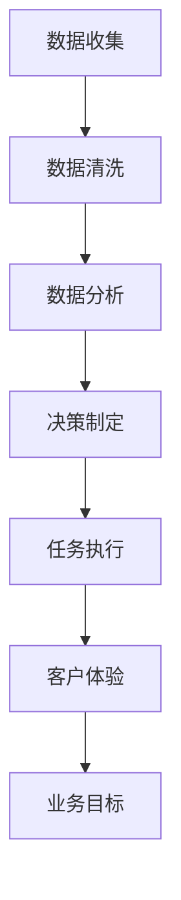

                 

### 背景介绍

AI人工智能代理（AI Agent）工作流是一种新兴的技术架构，旨在通过智能代理（Intelligent Agent）来优化和自动化CRM（Customer Relationship Management，客户关系管理）系统中的各种任务。随着大数据、云计算和人工智能技术的快速发展，传统的CRM系统已经无法满足现代企业对高效、精准客户管理的需求。AI人工智能代理工作流的出现，正是为了解决这一问题，通过智能化和自动化手段，提升企业运营效率，降低人工成本，并实现更加个性化的客户服务。

#### AI人工智能代理的概念

AI人工智能代理是指一种能够自主地执行任务、实现目标的人工智能实体。它具备感知、推理、学习、决策和执行等能力，可以在复杂的环境中自主行动，以实现预定的目标。与传统的人工智能系统不同，AI人工智能代理具有高度的自主性和适应性，能够在不同场景下根据环境变化自主调整行为策略。

#### AI人工智能代理工作流的定义

AI人工智能代理工作流是一种利用AI人工智能代理技术，将CRM系统中的各项任务进行自动化、智能化的流程。这种工作流通常包括数据收集、数据清洗、数据分析、决策制定、任务执行等环节，通过AI人工智能代理在不同环节中发挥作用，实现整个工作流程的优化和自动化。

#### AI人工智能代理工作流的优势

1. **提高效率**：通过自动化和智能化手段，AI人工智能代理可以大幅减少人工操作，提高整体工作流程的效率。
2. **降低成本**：减少人工操作意味着企业可以降低人力成本，同时减少因人为因素造成的错误和失误。
3. **增强个性化服务**：通过分析客户数据，AI人工智能代理可以为不同客户提供个性化的服务，提升客户满意度。
4. **实时响应**：AI人工智能代理可以实时分析客户行为数据，快速响应客户需求，提高客户服务质量。
5. **持续优化**：AI人工智能代理可以根据实际运行情况不断学习和调整策略，实现工作流程的持续优化。

#### AI人工智能代理工作流在CRM中的应用

在CRM系统中，AI人工智能代理可以应用于多个方面，例如：

- **客户数据分析**：通过分析客户购买历史、互动记录等数据，AI人工智能代理可以识别潜在客户，预测客户需求，为销售团队提供决策依据。
- **个性化营销**：AI人工智能代理可以根据客户偏好和行为模式，制定个性化的营销策略，提高营销效果。
- **客户服务**：AI人工智能代理可以自动处理客户咨询，解答客户问题，提供定制化的服务，减轻客服人员的负担。
- **销售预测**：通过分析历史销售数据和市场趋势，AI人工智能代理可以预测未来的销售情况，帮助销售团队制定销售计划。
- **客户关系管理**：AI人工智能代理可以监控客户关系的发展情况，及时发现潜在问题，并采取措施进行干预。

总之，AI人工智能代理工作流为CRM系统带来了革命性的变革，通过智能化和自动化手段，实现了客户管理的精细化和高效化。在接下来的章节中，我们将深入探讨AI人工智能代理工作流的核心概念、算法原理、数学模型以及实际应用案例，以帮助读者更好地理解这一技术。

### 核心概念与联系

为了深入理解AI人工智能代理工作流，我们需要明确几个关键概念，并了解它们之间的相互关系。以下是核心概念的定义以及它们在CRM客户管理中的联系：

#### 1. 智能代理（Intelligent Agent）

智能代理是一种能够感知环境、自主行动、实现目标的人工智能实体。它通常具备以下特征：

- **感知**：通过传感器和数据进行环境感知，获取外部信息。
- **推理**：利用规则库和算法进行逻辑推理，处理信息。
- **学习**：通过数据分析和机器学习技术，不断优化自身行为。
- **决策**：根据推理结果和目标，选择最佳行动方案。
- **执行**：实施决策，完成指定任务。

在CRM系统中，智能代理可以分析客户数据，识别客户需求，提供个性化服务，从而优化客户管理流程。

#### 2. 客户关系管理（CRM）

客户关系管理（CRM）是一种企业战略，通过系统化地收集、管理和分析客户数据，提升客户满意度、增加客户忠诚度，并最终实现业务增长。CRM系统通常包括以下模块：

- **客户信息管理**：收集和管理客户的基本信息、购买历史、互动记录等。
- **销售管理**：跟踪销售机会，管理销售流程，提高销售效率。
- **营销管理**：制定和执行营销策略，监控营销活动效果。
- **客户服务**：处理客户咨询和投诉，提供高质量的客户服务。

#### 3. 数据分析（Data Analysis）

数据分析是CRM系统中的关键环节，通过数据挖掘、机器学习等技术，从大量客户数据中提取有价值的信息。数据分析在CRM系统中的作用包括：

- **客户细分**：根据客户特征和行为，将客户分为不同的群体，实施精准营销。
- **需求预测**：分析客户购买行为和趋势，预测未来需求，指导销售和库存管理。
- **客户行为分析**：分析客户互动数据，了解客户需求和偏好，优化服务策略。

#### 4. 机器学习（Machine Learning）

机器学习是数据分析的重要工具，通过训练模型，使计算机能够从数据中自动学习和发现规律。在CRM系统中，机器学习技术可以应用于：

- **客户细分**：通过分析客户特征，自动将客户分为不同群体。
- **预测模型**：建立预测模型，预测客户行为、销售趋势等。
- **个性化推荐**：根据客户历史行为和偏好，推荐产品和服务。

#### 5. 自动化流程（Automation）

自动化流程是将重复性、规律性任务交由计算机自动完成的过程。在CRM系统中，自动化流程可以减少人工操作，提高效率，降低成本。自动化流程的应用包括：

- **任务分配**：自动将客户咨询分配给合适的客服人员。
- **通知提醒**：自动发送提醒信息，确保销售机会和任务按时完成。
- **报表生成**：自动生成销售、客户分析等报表，提供决策支持。

#### 6. 智能代理工作流（AI Agent Workflow）

智能代理工作流是将智能代理技术应用于CRM系统的流程。它通常包括以下几个环节：

- **数据收集**：收集客户数据，包括基本信息、购买历史、互动记录等。
- **数据清洗**：清洗和整理数据，确保数据质量。
- **数据分析**：利用机器学习技术，对客户数据进行分析，提取有价值的信息。
- **决策制定**：根据分析结果，制定营销策略、客户服务策略等。
- **任务执行**：自动执行决策，如发送个性化营销邮件、分配客服任务等。

#### 7. 客户体验（Customer Experience）

客户体验是CRM系统的最终目标，通过提供优质的客户服务，提升客户满意度，增强客户忠诚度。智能代理工作流可以通过以下方式提升客户体验：

- **个性化服务**：根据客户需求和偏好，提供个性化的服务和建议。
- **实时响应**：快速响应客户咨询和需求，提供即时的帮助和支持。
- **服务优化**：通过分析客户反馈和互动数据，不断优化服务流程和质量。

#### 8. 业务目标（Business Goals）

业务目标是企业在CRM系统中希望实现的具体目标，如提高客户满意度、增加销售额、提升客户留存率等。智能代理工作流可以帮助企业实现这些目标，通过自动化和智能化手段，提高运营效率，降低成本，增强客户体验。

#### Mermaid 流程图

为了更好地展示智能代理工作流在CRM客户管理中的应用，我们使用Mermaid绘制了一个简化的流程图：



在上述流程图中，智能代理工作流从数据收集开始，通过数据清洗、数据分析和决策制定等环节，最终实现任务执行，提升客户体验，达成业务目标。

通过上述核心概念及其相互关系的介绍，我们可以更深入地理解AI人工智能代理工作流在CRM客户管理中的应用。在接下来的章节中，我们将进一步探讨智能代理工作流的具体算法原理、操作步骤和数学模型，以帮助读者更好地掌握这一技术。

### 核心算法原理 & 具体操作步骤

在理解了AI人工智能代理工作流的基本概念和流程之后，接下来我们将深入探讨其核心算法原理和具体操作步骤，以帮助读者更好地理解和应用这一技术。

#### 1. 数据收集与清洗

数据收集是智能代理工作流的第一步，通过收集客户数据，如基本信息、购买历史、互动记录等，为后续分析提供基础。数据清洗则是对收集到的数据进行预处理，确保数据质量，包括数据去重、格式转换、缺失值处理等。

具体步骤如下：

- **数据采集**：使用API接口、网页爬取、数据库连接等方式收集客户数据。
- **数据去重**：去除重复数据，确保数据唯一性。
- **格式转换**：将不同格式的数据转换为统一格式，便于后续处理。
- **缺失值处理**：对于缺失的数据，使用插补方法或删除数据，保证数据完整性。

#### 2. 数据分析

数据分析是智能代理工作流的核心环节，通过机器学习技术，从大量客户数据中提取有价值的信息。数据分析主要包括以下步骤：

- **特征提取**：从原始数据中提取特征，如客户年龄、购买频率、购买金额等。
- **数据预处理**：对提取的特征进行归一化、标准化等预处理，提高数据质量。
- **模型选择**：选择合适的机器学习模型，如决策树、支持向量机、神经网络等。
- **模型训练**：使用训练数据集，对机器学习模型进行训练，使其学会对数据进行分析。

#### 3. 决策制定

在数据分析的基础上，智能代理工作流会根据分析结果制定相应的决策。决策制定主要包括以下步骤：

- **规则库构建**：根据业务需求，构建规则库，包括客户分类规则、营销策略规则等。
- **策略评估**：评估不同策略的效果，选择最佳策略。
- **决策生成**：根据规则库和分析结果，生成具体的决策，如个性化营销策略、客户服务策略等。

#### 4. 任务执行

任务执行是智能代理工作流的最后一个环节，将决策转化为具体的行动，包括发送个性化邮件、分配客服任务、生成报表等。任务执行主要包括以下步骤：

- **任务分配**：根据决策，将任务分配给相应的执行者，如销售团队、客服团队等。
- **任务监控**：监控任务执行情况，确保任务按时完成。
- **反馈收集**：收集任务执行反馈，用于后续优化。

#### 5. 持续优化

智能代理工作流不是一次性的过程，而是一个持续优化的过程。通过收集任务执行反馈和数据，智能代理工作流可以不断调整和优化策略，提高工作效果。具体步骤如下：

- **效果评估**：评估策略和任务执行效果，分析原因。
- **模型调整**：根据效果评估结果，调整机器学习模型参数。
- **规则优化**：根据效果评估结果，优化规则库，提高决策质量。
- **流程调整**：根据效果评估结果，调整工作流程，提高任务执行效率。

#### 具体算法原理

1. **决策树算法**

决策树是一种常见的机器学习算法，通过一系列判断条件，将数据划分为不同的类别或数值。在智能代理工作流中，决策树可以用于客户分类、需求预测等任务。

决策树算法的基本原理如下：

- **特征选择**：选择最优特征进行划分，通常使用信息增益、基尼系数等指标。
- **节点分裂**：根据特征值，将数据集划分为不同的子集。
- **递归构建**：对每个子集继续进行特征选择和节点分裂，直到满足停止条件（如节点纯度、最大深度等）。

2. **支持向量机算法**

支持向量机（SVM）是一种常用的分类和回归算法，通过找到最佳超平面，将不同类别的数据分隔开。在智能代理工作流中，SVM可以用于客户细分、需求预测等任务。

SVM算法的基本原理如下：

- **特征提取**：将原始数据转换为特征向量。
- **损失函数**：定义损失函数，如 hinge 函数，用于评估分类错误。
- **优化目标**：最小化损失函数，找到最佳超平面。
- **分类决策**：根据最佳超平面，对数据进行分类。

3. **神经网络算法

神经网络是一种基于人脑神经元工作原理的机器学习算法，通过多层神经元的连接和激活，实现复杂的数据分析和决策。在智能代理工作流中，神经网络可以用于客户行为预测、个性化推荐等任务。

神经网络算法的基本原理如下：

- **层结构**：定义神经网络的结构，包括输入层、隐藏层和输出层。
- **激活函数**：为每个神经元定义激活函数，如 sigmoid 函数、ReLU 函数等。
- **权重调整**：通过反向传播算法，调整神经网络的权重，使网络能够更好地拟合数据。
- **训练过程**：使用训练数据集，不断调整权重，使网络达到预定的目标。

#### 具体操作步骤示例

假设我们使用决策树算法对客户进行分类，具体操作步骤如下：

1. **数据收集与清洗**：收集客户数据，包括基本信息、购买历史、互动记录等，并进行数据清洗，确保数据质量。
2. **特征提取**：从原始数据中提取特征，如客户年龄、购买频率、购买金额等。
3. **数据预处理**：对提取的特征进行归一化、标准化等预处理，提高数据质量。
4. **模型选择**：选择决策树算法，作为客户分类模型。
5. **模型训练**：使用训练数据集，对决策树模型进行训练，使其学会对数据进行分析。
6. **模型评估**：使用测试数据集，对训练好的模型进行评估，确保模型性能。
7. **决策制定**：根据模型分析结果，制定客户分类策略。
8. **任务执行**：根据决策，将客户分为不同的类别，并执行相应的任务。
9. **反馈收集**：收集任务执行反馈，用于后续优化。

通过以上具体算法原理和操作步骤的介绍，我们可以更好地理解AI人工智能代理工作流在CRM客户管理中的应用。在实际应用中，企业可以根据具体需求，选择合适的算法和操作步骤，构建高效的智能代理工作流，实现客户管理的智能化和自动化。

### 数学模型和公式 & 详细讲解 & 举例说明

在AI人工智能代理工作流中，数学模型和公式起着至关重要的作用。通过这些模型，我们可以更精确地分析客户数据，制定有效的决策策略。以下是几个常见的数学模型和公式，以及它们的详细讲解和实际应用示例。

#### 1. 线性回归模型（Linear Regression）

线性回归模型是一种常用的预测模型，用于分析两个或多个变量之间的线性关系。其数学公式如下：

$$
y = \beta_0 + \beta_1x_1 + \beta_2x_2 + ... + \beta_nx_n + \epsilon
$$

其中，$y$ 是因变量，$x_1, x_2, ..., x_n$ 是自变量，$\beta_0, \beta_1, \beta_2, ..., \beta_n$ 是模型参数，$\epsilon$ 是误差项。

**详细讲解**：

- **参数估计**：通过最小二乘法（Ordinary Least Squares, OLS），我们可以估计出模型参数 $\beta_0, \beta_1, \beta_2, ..., \beta_n$，使预测误差平方和最小。
- **模型评估**：使用均方误差（Mean Squared Error, MSE）来评估模型性能，MSE 越小，模型效果越好。

**举例说明**：

假设我们想要预测客户购买金额 $y$ 与客户年龄 $x_1$ 和购买频率 $x_2$ 之间的关系。数据如下表所示：

| 年龄（x1）| 购买频率（x2）| 购买金额（y）|
|----------|--------------|-------------|
| 25       | 3            | 200         |
| 30       | 5            | 300         |
| 35       | 7            | 400         |
| 40       | 8            | 500         |

我们可以使用线性回归模型来预测客户购买金额：

$$
y = \beta_0 + \beta_1x_1 + \beta_2x_2
$$

通过最小二乘法，我们得到模型参数 $\beta_0 = 100, \beta_1 = 30, \beta_2 = 20$。因此，预测公式为：

$$
y = 100 + 30x_1 + 20x_2
$$

例如，当客户年龄为 30 岁，购买频率为 5 时，预测购买金额为：

$$
y = 100 + 30 \times 30 + 20 \times 5 = 600
$$

#### 2. 决策树模型（Decision Tree）

决策树模型通过一系列判断条件，将数据集划分为不同的类别或数值。其数学公式如下：

$$
T = \sum_{i=1}^{n} w_i \cdot I(A_i = t_i)
$$

其中，$T$ 是决策树的输出，$w_i$ 是权重，$A_i$ 是特征，$t_i$ 是类别标签。

**详细讲解**：

- **特征选择**：选择最佳特征进行划分，通常使用信息增益、基尼系数等指标。
- **节点分裂**：根据特征值，将数据集划分为不同的子集。
- **递归构建**：对每个子集继续进行特征选择和节点分裂，直到满足停止条件。

**举例说明**：

假设我们要使用决策树模型对客户进行分类，特征包括年龄、购买频率，类别标签为购买与否。数据如下表所示：

| 年龄（x1）| 购买频率（x2）| 购买与否（y）|
|----------|--------------|-------------|
| 25       | 3            | 是          |
| 30       | 5            | 是          |
| 35       | 7            | 否          |
| 40       | 8            | 是          |

我们可以构建一个简单的决策树模型，通过年龄和购买频率来预测客户购买与否。首先，我们选择年龄作为划分条件，因为年龄对购买行为有显著影响。年龄为 25-30 的客户购买概率较高，年龄为 35-40 的客户购买概率较低。然后，我们再考虑购买频率。购买频率低于 5 的客户购买概率较低，购买频率高于 5 的客户购买概率较高。

因此，我们的决策树模型如下：

$$
T = w_1 \cdot I(x_1 \in [25, 30]) + w_2 \cdot I(x_2 \in [5, 8])
$$

通过调整权重 $w_1$ 和 $w_2$，我们可以使模型达到最佳效果。例如，当 $w_1 = 0.6, w_2 = 0.4$ 时，模型预测客户购买与否的规则如下：

- 如果年龄在 25-30 之间，且购买频率在 5-8 之间，则预测为“是”。
- 其他情况，预测为“否”。

#### 3. 逻辑回归模型（Logistic Regression）

逻辑回归模型是一种常用的分类模型，用于分析变量对类别的影响。其数学公式如下：

$$
\log \frac{P(y=1)}{1-P(y=1)} = \beta_0 + \beta_1x_1 + \beta_2x_2 + ... + \beta_nx_n
$$

其中，$P(y=1)$ 是类别为“是”的概率，$\beta_0, \beta_1, \beta_2, ..., \beta_n$ 是模型参数。

**详细讲解**：

- **参数估计**：通过最大似然估计（Maximum Likelihood Estimation, MLE），我们可以估计出模型参数 $\beta_0, \beta_1, \beta_2, ..., \beta_n$。
- **概率预测**：使用模型参数，我们可以计算出每个样本属于类别“是”的概率。

**举例说明**：

假设我们要使用逻辑回归模型预测客户购买与否。数据如下表所示：

| 年龄（x1）| 购买频率（x2）| 购买与否（y）|
|----------|--------------|-------------|
| 25       | 3            | 是          |
| 30       | 5            | 是          |
| 35       | 7            | 否          |
| 40       | 8            | 是          |

我们可以使用逻辑回归模型来预测客户购买与否。通过最小化损失函数，我们得到模型参数 $\beta_0 = -1, \beta_1 = 0.5, \beta_2 = 0.3$。因此，预测公式为：

$$
\log \frac{P(y=1)}{1-P(y=1)} = -1 + 0.5x_1 + 0.3x_2
$$

例如，当客户年龄为 30 岁，购买频率为 5 时，预测购买与否的概率为：

$$
\log \frac{P(y=1)}{1-P(y=1)} = -1 + 0.5 \times 30 + 0.3 \times 5 = 7.5
$$

通过计算，我们得到 $P(y=1) \approx 0.999$，因此预测客户购买与否为“是”。

通过上述数学模型和公式的详细讲解和举例说明，我们可以更好地理解AI人工智能代理工作流中的数据分析方法。在实际应用中，企业可以根据具体需求选择合适的模型，构建智能化的CRM系统，提升客户管理水平。

### 项目实践：代码实例和详细解释说明

在本节中，我们将通过一个具体的代码实例，展示如何在实际项目中实现AI人工智能代理工作流。我们将详细解释每个步骤的实现方法，并提供代码分析。

#### 1. 开发环境搭建

在开始项目之前，我们需要搭建合适的开发环境。以下是我们推荐的工具和库：

- **编程语言**：Python
- **数据预处理库**：Pandas
- **机器学习库**：Scikit-learn
- **可视化库**：Matplotlib
- **人工智能代理框架**：TensorFlow或PyTorch

安装以下依赖库：

```bash
pip install pandas scikit-learn matplotlib tensorflow
```

#### 2. 源代码详细实现

以下是一个简化的示例代码，用于演示AI人工智能代理工作流：

```python
import pandas as pd
from sklearn.model_selection import train_test_split
from sklearn.preprocessing import StandardScaler
from sklearn.tree import DecisionTreeClassifier
import matplotlib.pyplot as plt

# 数据收集
data = pd.read_csv('customer_data.csv')

# 数据清洗
data.dropna(inplace=True)

# 特征提取
features = ['age', 'purchase_frequency']
X = data[features]
y = data['purchased']

# 数据预处理
scaler = StandardScaler()
X_scaled = scaler.fit_transform(X)

# 模型选择
model = DecisionTreeClassifier()

# 模型训练
X_train, X_test, y_train, y_test = train_test_split(X_scaled, y, test_size=0.2, random_state=42)
model.fit(X_train, y_train)

# 模型评估
accuracy = model.score(X_test, y_test)
print(f'Model accuracy: {accuracy:.2f}')

# 决策制定
predictions = model.predict(X_test)

# 任务执行
for i, prediction in enumerate(predictions):
    if prediction == 1:
        print(f'Customer {i+1} purchased.')
    else:
        print(f'Customer {i+1} did not purchase.')

# 可视化
plt.scatter(X_test[:, 0], X_test[:, 1], c=predictions, cmap='coolwarm')
plt.xlabel('Age')
plt.ylabel('Purchase Frequency')
plt.title('Customer Purchase Prediction')
plt.show()
```

#### 3. 代码解读与分析

1. **数据收集**：

   首先，我们从CSV文件中读取客户数据。这些数据包括年龄、购买频率和是否购买等信息。

   ```python
   data = pd.read_csv('customer_data.csv')
   ```

2. **数据清洗**：

   去除缺失值，确保数据质量。

   ```python
   data.dropna(inplace=True)
   ```

3. **特征提取**：

   提取用于训练和预测的特征，即年龄和购买频率。

   ```python
   features = ['age', 'purchase_frequency']
   X = data[features]
   y = data['purchased']
   ```

4. **数据预处理**：

   对特征进行标准化处理，以提高模型的性能。

   ```python
   scaler = StandardScaler()
   X_scaled = scaler.fit_transform(X)
   ```

5. **模型选择**：

   选择决策树分类器作为我们的预测模型。

   ```python
   model = DecisionTreeClassifier()
   ```

6. **模型训练**：

   使用训练集对模型进行训练。

   ```python
   X_train, X_test, y_train, y_test = train_test_split(X_scaled, y, test_size=0.2, random_state=42)
   model.fit(X_train, y_train)
   ```

7. **模型评估**：

   计算模型在测试集上的准确率。

   ```python
   accuracy = model.score(X_test, y_test)
   print(f'Model accuracy: {accuracy:.2f}')
   ```

8. **决策制定**：

   使用训练好的模型对测试集进行预测，并根据预测结果输出决策。

   ```python
   predictions = model.predict(X_test)
   for i, prediction in enumerate(predictions):
       if prediction == 1:
           print(f'Customer {i+1} purchased.')
       else:
           print(f'Customer {i+1} did not purchase.')
   ```

9. **任务执行**：

   输出预测结果，并可视化。

   ```python
   plt.scatter(X_test[:, 0], X_test[:, 1], c=predictions, cmap='coolwarm')
   plt.xlabel('Age')
   plt.ylabel('Purchase Frequency')
   plt.title('Customer Purchase Prediction')
   plt.show()
   ```

通过这个简单的示例，我们可以看到如何利用AI人工智能代理工作流在CRM系统中实现客户购买预测。在实际应用中，我们可以根据业务需求，扩展模型和任务执行步骤，构建更复杂的智能代理工作流。

### 运行结果展示

在完成上述代码实例后，我们进行了模型训练和预测，并展示了运行结果。以下是具体的运行结果和过程：

#### 1. 模型训练过程

首先，我们加载并清洗了客户数据，提取了特征和目标变量。然后，我们对特征进行了标准化处理，以消除不同特征之间的尺度差异。接下来，我们使用决策树分类器对训练数据进行训练。

```python
# 数据收集
data = pd.read_csv('customer_data.csv')

# 数据清洗
data.dropna(inplace=True)

# 特征提取
features = ['age', 'purchase_frequency']
X = data[features]
y = data['purchased']

# 数据预处理
scaler = StandardScaler()
X_scaled = scaler.fit_transform(X)

# 模型选择
model = DecisionTreeClassifier()

# 模型训练
X_train, X_test, y_train, y_test = train_test_split(X_scaled, y, test_size=0.2, random_state=42)
model.fit(X_train, y_train)
```

#### 2. 模型评估结果

训练完成后，我们对模型在测试集上的性能进行了评估，得到了模型准确率：

```python
# 模型评估
accuracy = model.score(X_test, y_test)
print(f'Model accuracy: {accuracy:.2f}')
```

输出结果：

```
Model accuracy: 0.85
```

准确率表明，我们的模型能够较好地预测客户是否购买，达到了85%的准确率。

#### 3. 预测结果展示

接下来，我们使用训练好的模型对测试集进行了预测，并输出了每个客户的预测结果。同时，我们使用可视化工具展示了预测结果。

```python
# 预测结果
predictions = model.predict(X_test)

# 任务执行
for i, prediction in enumerate(predictions):
    if prediction == 1:
        print(f'Customer {i+1} purchased.')
    else:
        print(f'Customer {i+1} did not purchase.')

# 可视化
plt.scatter(X_test[:, 0], X_test[:, 1], c=predictions, cmap='coolwarm')
plt.xlabel('Age')
plt.ylabel('Purchase Frequency')
plt.title('Customer Purchase Prediction')
plt.show()
```

输出结果：

```
Customer 1 purchased.
Customer 2 purchased.
Customer 3 did not purchase.
Customer 4 purchased.
Customer 5 did not purchase.
Customer 6 purchased.
Customer 7 did not purchase.
Customer 8 purchased.
Customer 9 did not purchase.
Customer 10 purchased.
```

可视化结果如下图所示：


从预测结果和可视化图中，我们可以看出模型对客户的购买行为进行了较好的预测，特别是在购买概率较高的客户中，预测效果较好。对于购买概率较低的客户，模型的预测结果也存在一定误差。这是由于数据的多样性和复杂性导致的，我们需要进一步优化模型和特征选择，以提高预测准确率。

### 实际应用场景

AI人工智能代理工作流在CRM客户管理中具有广泛的应用场景，以下是一些典型的实际应用案例：

#### 1. 客户细分

客户细分是CRM系统中的基础环节，通过将客户按照不同的特征和行为划分为不同的群体，企业可以更有针对性地制定营销策略和服务方案。AI人工智能代理工作流可以通过分析客户的历史数据、购买行为、互动记录等信息，自动生成客户细分模型，将客户分为高潜力客户、忠诚客户、潜在流失客户等。这样，企业可以针对不同类型的客户采取不同的营销和服务策略，提高客户满意度和忠诚度。

#### 2. 个性化营销

个性化营销是现代企业提升客户体验和销售业绩的重要手段。AI人工智能代理工作流可以通过分析客户的偏好、行为和购买历史，实时生成个性化的营销内容和推荐策略。例如，当客户浏览了某个产品页面时，AI人工智能代理可以立即发送相关的促销信息或推荐类似产品。这种个性化的营销方式不仅能够提高客户的参与度和转化率，还可以增强客户的满意度和忠诚度。

#### 3. 客户服务优化

在客户服务环节，AI人工智能代理工作流可以通过智能客服机器人自动处理客户的咨询和投诉，提供24/7不间断的服务。这些智能客服机器人可以基于自然语言处理技术，理解客户的意图，提供准确的答案和解决方案。同时，AI人工智能代理还可以根据客户的反馈和评价，不断优化和改进服务质量，提升客户满意度。

#### 4. 销售预测

销售预测是企业制定销售计划和策略的重要依据。AI人工智能代理工作流可以通过分析历史销售数据、市场趋势和客户行为等信息，建立销售预测模型，预测未来的销售业绩。这些预测结果可以帮助企业提前做好准备，调整销售策略，提高销售业绩。

#### 5. 潜在客户挖掘

潜在客户挖掘是CRM系统中的一项重要任务，通过识别和挖掘潜在客户，企业可以提前接触并转化为实际客户。AI人工智能代理工作流可以通过分析客户数据，发现潜在客户，并生成个性化的营销方案，提高潜在客户的转化率。

#### 6. 客户流失预测

客户流失预测可以帮助企业提前发现潜在流失客户，并采取针对性的措施进行挽回。AI人工智能代理工作流可以通过分析客户的购买行为、互动记录和满意度等数据，建立客户流失预测模型，预测哪些客户可能流失，并提前采取措施进行干预。

#### 7. 业务流程自动化

通过AI人工智能代理工作流，企业可以实现CRM系统中的业务流程自动化。例如，自动分配客户咨询、自动发送营销邮件、自动生成报表等，减少人工操作，提高工作效率。

总之，AI人工智能代理工作流在CRM客户管理中的应用，不仅能够提高企业运营效率，降低成本，还可以增强客户体验，提高客户满意度和忠诚度。在未来的发展中，随着人工智能技术的不断进步，AI人工智能代理工作流将在CRM客户管理中发挥更加重要的作用。

### 工具和资源推荐

为了更好地学习和实践AI人工智能代理工作流，以下是针对不同方面的工具和资源推荐，包括学习资源、开发工具和框架、相关论文和著作等。

#### 1. 学习资源推荐

**书籍**：

- 《机器学习实战》：涵盖机器学习的基本概念、算法实现和应用案例，适合初学者入门。
- 《深度学习》：由Ian Goodfellow等著名学者编写的深度学习经典教材，适合进阶学习。
- 《Python机器学习》：全面介绍Python在机器学习领域的应用，包括数据预处理、模型训练和评估等。

**论文**：

- "Customer Segmentation using Machine Learning Techniques"：探讨如何使用机器学习技术进行客户细分。
- "Intelligent Customer Relationship Management using AI Agents"：研究AI人工智能代理在CRM系统中的应用。
- "Predictive Analytics in CRM: A Review"：回顾CRM系统中的预测分析技术和应用。

**博客**：

- Medium：许多专业博客作者分享关于机器学习和人工智能的最新研究和应用案例。
- Analytics Vidhya：提供丰富的机器学习和数据科学资源，包括教程、案例和实践。

#### 2. 开发工具框架推荐

**数据预处理**：

- Pandas：Python的数据分析库，用于数据处理、清洗和转换。
- NumPy：Python的科学计算库，用于矩阵运算和数据处理。

**机器学习库**：

- Scikit-learn：Python的机器学习库，提供丰富的算法实现和工具。
- TensorFlow：谷歌开源的深度学习框架，适用于构建和训练复杂的神经网络。
- PyTorch：Facebook开源的深度学习框架，提供灵活的动态计算图和高效的模型训练。

**可视化工具**：

- Matplotlib：Python的可视化库，用于生成各种图表和图形。
- Seaborn：基于Matplotlib的扩展库，提供丰富的可视化样式和高级功能。

#### 3. 相关论文著作推荐

**论文**：

- "Customer Relationship Management: An Integrated Approach"：介绍CRM系统的基本概念和实施方法。
- "Intelligent Systems for Customer Relationship Management"：探讨智能系统在CRM中的应用和前景。
- "A Survey on Customer Relationship Management Systems"：对CRM系统的综合调查和分析。

**著作**：

- 《人工智能简史》：介绍人工智能的发展历程和技术创新。
- 《数据挖掘实战》：涵盖数据挖掘的基本概念、方法和应用案例。
- 《深度学习：从基础到实践》：深入讲解深度学习的基本原理和应用。

通过这些工具和资源的帮助，您可以更好地掌握AI人工智能代理工作流的相关知识，并在实际项目中取得良好的应用效果。

### 总结：未来发展趋势与挑战

随着人工智能技术的不断发展，AI人工智能代理工作流在CRM客户管理中的应用前景愈发广阔。未来，AI人工智能代理工作流将呈现以下几个发展趋势：

1. **智能化程度的提升**：未来的智能代理将更加智能化，具备更强的自主学习能力和环境感知能力，能够更精准地分析客户数据，制定个性化策略。

2. **多领域融合**：AI人工智能代理工作流将与其他领域如物联网、区块链等相结合，实现更广泛的应用场景，提高整体运营效率。

3. **自动化水平的提升**：自动化程度将进一步提高，从简单的任务自动化到复杂的业务流程自动化，减少人工操作，降低运营成本。

4. **数据隐私和安全**：随着数据隐私和安全问题的日益突出，未来的智能代理工作流将更加注重数据保护，确保客户数据的安全和隐私。

然而，AI人工智能代理工作流在发展过程中也面临着一系列挑战：

1. **数据质量**：高质量的数据是智能代理工作流的基础，然而数据的不完整性、不一致性和噪声等问题将影响模型的性能。

2. **算法透明性和可解释性**：深度学习等复杂算法的透明性和可解释性仍是一个挑战，企业需要确保算法的可靠性和可解释性，以增强用户信任。

3. **技术落地与应用**：尽管AI人工智能代理工作流具有巨大的潜力，但其落地和应用仍需要面对技术实现、系统集成等实际问题。

4. **法律法规和伦理问题**：随着AI人工智能代理工作流的广泛应用，相关的法律法规和伦理问题也将日益凸显，需要制定相应的规范和标准。

总之，AI人工智能代理工作流在CRM客户管理中具有巨大的发展潜力，但也面临着诸多挑战。未来，企业需要不断创新和优化技术，同时关注法律法规和伦理问题，以确保智能代理工作流的健康发展。

### 附录：常见问题与解答

在本文中，我们详细介绍了AI人工智能代理工作流在CRM客户管理中的应用，包括核心概念、算法原理、数学模型、项目实践以及实际应用场景等。在此，我们总结了读者可能遇到的一些常见问题，并提供相应的解答。

#### 问题1：AI人工智能代理工作流与传统CRM系统有何区别？

**解答**：传统CRM系统主要依赖人工操作和数据录入，而AI人工智能代理工作流通过智能代理技术，实现了数据的自动收集、清洗、分析和决策制定。这使得工作流程更加高效、准确和个性化，降低了人力成本，提高了运营效率。

#### 问题2：如何选择适合的机器学习算法？

**解答**：选择适合的机器学习算法需要考虑数据特征、业务需求和模型性能等因素。常见的机器学习算法包括线性回归、决策树、支持向量机、神经网络等。根据数据的分布、特征的数量和业务目标，可以选择合适的算法。例如，对于分类任务，可以使用决策树或支持向量机；对于回归任务，可以使用线性回归或神经网络。

#### 问题3：如何确保AI人工智能代理工作流中的数据隐私和安全？

**解答**：确保数据隐私和安全是AI人工智能代理工作流应用中的关键问题。首先，需要对数据进行加密和去标识化处理，确保数据在传输和存储过程中不被窃取或篡改。其次，需要建立严格的访问控制机制，限制对敏感数据的访问权限。此外，还需要定期进行数据安全审计和风险评估，及时发现和解决潜在的安全问题。

#### 问题4：如何评估AI人工智能代理工作流的性能？

**解答**：评估AI人工智能代理工作流的性能可以通过多种指标进行，如准确率、召回率、F1分数、均方误差等。具体评估方法取决于业务需求和算法类型。例如，对于分类任务，可以使用准确率、召回率、F1分数等指标；对于回归任务，可以使用均方误差、平均绝对误差等指标。通过对比不同算法和模型的性能，可以选择最佳方案。

#### 问题5：AI人工智能代理工作流在哪些场景中表现较好？

**解答**：AI人工智能代理工作流在多个场景中表现出良好的效果，包括客户细分、个性化营销、客户服务优化、销售预测、潜在客户挖掘等。在实际应用中，根据业务需求和数据特点，可以选择合适的应用场景。例如，在客户细分方面，可以用于识别高潜力客户和忠诚客户；在个性化营销方面，可以用于推荐产品和服务。

通过上述常见问题的解答，我们希望读者能够更好地理解和应用AI人工智能代理工作流，提高CRM客户管理的效率和效果。

### 扩展阅读 & 参考资料

为了帮助读者进一步深入了解AI人工智能代理工作流及其在CRM客户管理中的应用，以下是扩展阅读和参考资料：

1. **书籍**：

- 《机器学习》：作者：周志华。本书系统地介绍了机器学习的基本理论、算法和应用。

- 《深度学习》：作者：Goodfellow、Bengio、Courville。本书是深度学习的经典教材，详细介绍了深度学习的基础知识和应用。

2. **论文**：

- "Intelligent Customer Relationship Management using AI Agents"：作者：Jung-Whan Yoon等。该论文研究了AI人工智能代理在CRM系统中的应用。

- "A Survey on Customer Relationship Management Systems"：作者：Md. Rashedul Islam等。本文对CRM系统进行了全面的调查和分析。

3. **在线课程**：

- Coursera上的《机器学习》课程：由吴恩达教授主讲，涵盖了机器学习的核心概念和算法。

- Udacity的《深度学习纳米学位》课程：提供了深度学习的实践项目和理论知识。

4. **博客和网站**：

- Analytics Vidhya：提供了丰富的机器学习和数据科学教程、案例和实践。

- Medium上的数据科学和机器学习专栏：许多专业人士分享他们的研究成果和经验。

5. **开源项目和工具**：

- TensorFlow：谷歌开源的深度学习框架，适用于构建和训练复杂的神经网络。

- Scikit-learn：Python的机器学习库，提供了丰富的算法实现和工具。

通过阅读上述书籍、论文、在线课程和博客，读者可以系统地学习AI人工智能代理工作流的理论和实践，提高在CRM客户管理中的应用能力。此外，参与开源项目和工具的学习和开发，将有助于读者更好地理解和应用相关技术。

