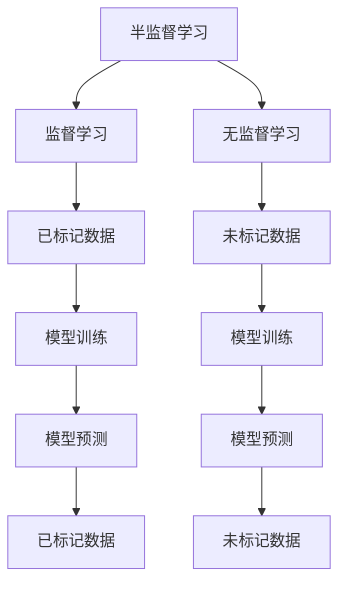

                 

### 文章标题

**AI人工智能核心算法原理与代码实例讲解：半监督学习**

> **关键词：** AI、半监督学习、算法原理、代码实例、机器学习、神经网络、数据标签、自动标注、数据增强

**摘要：** 本文将深入探讨半监督学习这一AI领域的重要技术。通过详细讲解其核心算法原理，以及代码实例，本文旨在帮助读者全面理解半监督学习的工作机制，掌握其实际应用技巧，并为其在未来的AI研究和开发中提供实用的参考。

### 目录

1. **背景介绍**
   1.1 半监督学习的重要性
   1.2 半监督学习的应用场景

2. **核心概念与联系**
   2.1 半监督学习的定义
   2.2 与传统监督学习、无监督学习的区别
   2.3 半监督学习的优势与挑战
   2.4 核心概念流程图

3. **核心算法原理 & 具体操作步骤**
   3.1 协同训练
   3.2 伪标签法
   3.3 自编码器
   3.4 多样性加强

4. **数学模型和公式 & 详细讲解 & 举例说明**
   4.1 协同训练
   4.2 伪标签法
   4.3 自编码器
   4.4 多样性加强

5. **项目实践：代码实例和详细解释说明**
   5.1 开发环境搭建
   5.2 源代码详细实现
   5.3 代码解读与分析
   5.4 运行结果展示

6. **实际应用场景**
   6.1 自然语言处理
   6.2 计算机视觉
   6.3 推荐系统

7. **工具和资源推荐**
   7.1 学习资源推荐
   7.2 开发工具框架推荐
   7.3 相关论文著作推荐

8. **总结：未来发展趋势与挑战**

9. **附录：常见问题与解答**

10. **扩展阅读 & 参考资料**

### 1. 背景介绍

#### 1.1 半监督学习的重要性

随着大数据时代的到来，机器学习在各个领域的应用日益广泛。然而，传统的监督学习模型在训练时需要大量已标记的数据，这在数据获取成本高、标注工作繁琐的情况下成为一个重大挑战。而半监督学习作为一种重要的机器学习方法，通过利用未标记数据和少量标记数据，可以有效降低数据标注的成本，提高模型训练的效率。

半监督学习在以下几个领域具有重要意义：

1. **自然语言处理（NLP）：** 在NLP任务中，大量的未标记文本数据可以通过半监督学习方法进行有效的利用，从而提高模型的性能。
2. **计算机视觉（CV）：** 对于图像和视频数据，半监督学习可以在有限的已标记数据上进行模型训练，从而降低对大规模已标记数据的依赖。
3. **推荐系统：** 在推荐系统中，半监督学习可以通过对用户行为的分析，对未标记的用户数据进行预测，从而提高推荐效果。

#### 1.2 半监督学习的应用场景

半监督学习在以下应用场景中具有显著的优势：

1. **数据稀缺：** 当获取大量已标记数据成本较高时，半监督学习可以通过少量已标记数据和大量未标记数据进行模型训练，从而降低数据获取成本。
2. **动态环境：** 在动态环境中，半监督学习可以不断适应新的数据变化，而无需重新进行大规模的标注工作。
3. **隐私保护：** 在需要保护用户隐私的数据处理中，半监督学习可以通过对未标记数据进行预测，避免直接使用已标记数据，从而保护用户隐私。

### 2. 核心概念与联系

#### 2.1 半监督学习的定义

半监督学习是指利用部分标记数据和大量未标记数据进行模型训练的一种机器学习方法。与传统的监督学习相比，半监督学习通过利用未标记数据，可以在数据稀缺的情况下提高模型性能。

#### 2.2 与传统监督学习、无监督学习的区别

1. **监督学习：** 在监督学习中，模型的训练依赖于大量的已标记数据。这些已标记数据用于指导模型的学习过程，从而提高模型的预测准确性。
2. **无监督学习：** 在无监督学习中，模型仅使用未标记数据进行训练，旨在发现数据中的潜在结构和模式。无监督学习不依赖于外部标签，因此可以发现一些监督学习无法发现的隐藏信息。
3. **半监督学习：** 半监督学习结合了监督学习和无监督学习的特点，通过利用部分标记数据和大量未标记数据，在保证模型性能的同时，降低了数据获取成本。

#### 2.3 半监督学习的优势与挑战

**优势：**

1. **提高模型性能：** 通过利用大量未标记数据，半监督学习可以在一定程度上提高模型的性能，尤其是在数据稀缺的情况下。
2. **降低数据获取成本：** 半监督学习通过利用未标记数据，可以减少对已标记数据的依赖，从而降低数据获取成本。
3. **动态适应：** 半监督学习可以在动态环境中不断适应新的数据变化，从而提高模型的泛化能力。

**挑战：**

1. **标签偏见：** 由于半监督学习依赖于未标记数据，这些未标记数据可能会引入标签偏见，从而影响模型的准确性。
2. **模型泛化：** 半监督学习模型在未标记数据上的泛化能力需要仔细评估，以确保其在新数据上的性能。

#### 2.4 核心概念流程图



### 3. 核心算法原理 & 具体操作步骤

半监督学习的核心算法包括协同训练、伪标签法、自编码器和多样性加强等。以下将详细介绍这些算法的原理和具体操作步骤。

#### 3.1 协同训练

**原理：** 协同训练是一种基于模型之间的协同工作的半监督学习方法。它通过构建多个模型，并让这些模型相互协作，从而提高模型的预测性能。

**操作步骤：**

1. **初始化模型：** 随机初始化多个模型，这些模型可以是相同类型的，也可以是不同类型的。
2. **模型训练：** 使用已标记数据和部分未标记数据对每个模型进行训练，同时更新模型参数。
3. **模型预测：** 对未标记数据使用每个模型进行预测，并将预测结果作为新的标签。
4. **更新模型：** 使用新的标签对每个模型进行再次训练，并更新模型参数。
5. **重复步骤3和4：** 重复上述步骤，直到模型收敛。

#### 3.2 伪标签法

**原理：** 伪标签法是一种基于模型预测结果的半监督学习方法。它通过使用模型对未标记数据进行预测，并将预测结果作为伪标签，从而提高模型的训练效果。

**操作步骤：**

1. **初始化模型：** 随机初始化一个模型。
2. **模型训练：** 使用已标记数据进行模型训练。
3. **模型预测：** 对未标记数据进行预测，并将预测结果作为伪标签。
4. **更新模型：** 使用伪标签对模型进行再次训练，并更新模型参数。
5. **重复步骤3和4：** 重复上述步骤，直到模型收敛。

#### 3.3 自编码器

**原理：** 自编码器是一种无监督学习算法，它可以自动提取数据的特征表示，从而提高模型的性能。

**操作步骤：**

1. **初始化自编码器：** 随机初始化自编码器模型。
2. **模型训练：** 使用未标记数据进行自编码器的训练。
3. **特征提取：** 使用训练好的自编码器对未标记数据进行特征提取。
4. **模型训练：** 使用已标记数据和提取到的特征对模型进行训练。
5. **重复步骤3和4：** 重复上述步骤，直到模型收敛。

#### 3.4 多样性加强

**原理：** 多样性加强是一种通过引入多样性惩罚项来提高模型训练效果的半监督学习方法。

**操作步骤：**

1. **初始化模型：** 随机初始化一个模型。
2. **模型训练：** 使用已标记数据进行模型训练。
3. **多样性评估：** 对未标记数据进行多样性评估，并将多样性评估结果作为惩罚项。
4. **更新模型：** 使用惩罚项对模型进行再次训练，并更新模型参数。
5. **重复步骤3和4：** 重复上述步骤，直到模型收敛。

### 4. 数学模型和公式 & 详细讲解 & 举例说明

#### 4.1 协同训练

**数学模型：** 协同训练的数学模型可以表示为：

$$
\min_{\theta} \sum_{i=1}^{n} L(y_i, f(x_i; \theta))
$$

其中，$y_i$ 表示已标记数据的真实标签，$x_i$ 表示已标记数据的特征，$f(x_i; \theta)$ 表示模型的预测结果，$\theta$ 表示模型参数。

**详细讲解：** 协同训练的核心在于利用多个模型之间的协同工作来提高模型的预测性能。在每次迭代中，每个模型都会根据已标记数据和部分未标记数据进行更新。这种协同工作的方式可以在一定程度上缓解标签偏倚问题，从而提高模型的准确性。

**举例说明：** 假设我们有两个模型 $M_1$ 和 $M_2$，已标记数据集为 $D_1$，未标记数据集为 $D_2$。在每次迭代中，$M_1$ 和 $M_2$ 分别对 $D_2$ 进行预测，并将预测结果作为伪标签对模型进行更新。这样，通过多次迭代，两个模型可以相互协作，提高预测性能。

#### 4.2 伪标签法

**数学模型：** 伪标签法的数学模型可以表示为：

$$
\min_{\theta} \sum_{i=1}^{n} L(y_i, f(x_i; \theta))
$$

其中，$y_i$ 表示已标记数据的真实标签，$x_i$ 表示已标记数据的特征，$f(x_i; \theta)$ 表示模型的预测结果，$\theta$ 表示模型参数。

**详细讲解：** 伪标签法是一种简单有效的半监督学习方法。它通过使用模型对未标记数据进行预测，并将预测结果作为伪标签对模型进行更新。这种方法可以充分利用未标记数据，从而提高模型的训练效果。

**举例说明：** 假设我们有一个分类模型，已标记数据集为 $D$，未标记数据集为 $U$。首先，使用 $D$ 对模型进行初始化和训练。然后，对 $U$ 进行预测，并将预测结果作为伪标签对模型进行更新。通过多次迭代，模型可以不断优化，提高预测性能。

#### 4.3 自编码器

**数学模型：** 自编码器的数学模型可以表示为：

$$
\min_{\theta} \sum_{i=1}^{n} \frac{1}{2} \| x_i - g(f(x_i; \theta)) \|^2
$$

其中，$x_i$ 表示输入数据，$f(\cdot; \theta)$ 表示编码器模型，$g(\cdot; \theta)$ 表示解码器模型，$\theta$ 表示模型参数。

**详细讲解：** 自编码器是一种无监督学习算法，它可以自动提取数据的特征表示，从而提高模型的性能。自编码器由编码器和解码器两个部分组成。编码器将输入数据编码为低维特征表示，解码器将特征表示解码为原始数据。通过最小化输入数据和编码器输出的误差，自编码器可以学习到数据的潜在结构。

**举例说明：** 假设我们有一个自编码器模型，输入数据为 $x_i$，编码器模型为 $f(\cdot; \theta)$，解码器模型为 $g(\cdot; \theta)$。首先，对输入数据进行编码，得到低维特征表示。然后，将特征表示解码为原始数据。通过最小化输入数据和编码器输出的误差，自编码器可以学习到数据的潜在结构，从而提高模型的性能。

#### 4.4 多样性加强

**数学模型：** 多样性加强的数学模型可以表示为：

$$
\min_{\theta} \sum_{i=1}^{n} \left( L(y_i, f(x_i; \theta)) + \lambda \cdot D(f(x_i; \theta)) \right)
$$

其中，$y_i$ 表示已标记数据的真实标签，$x_i$ 表示已标记数据的特征，$f(x_i; \theta)$ 表示模型的预测结果，$\theta$ 表示模型参数，$L(\cdot)$ 表示损失函数，$D(\cdot)$ 表示多样性度量函数，$\lambda$ 表示多样性权重。

**详细讲解：** 多样性加强通过引入多样性惩罚项来提高模型的训练效果。多样性惩罚项可以鼓励模型产生多样化的预测结果，从而避免模型过度拟合未标记数据。在每次迭代中，模型不仅要最小化损失函数，还要最大化多样性惩罚项。

**举例说明：** 假设我们有一个分类模型，已标记数据集为 $D$，未标记数据集为 $U$。在每次迭代中，模型不仅要最小化损失函数，还要最大化多样性惩罚项。通过这种方式，模型可以产生多样化的预测结果，从而提高模型的泛化能力。

### 5. 项目实践：代码实例和详细解释说明

为了更好地理解半监督学习算法的原理和应用，我们将通过一个实际的项目实践来进行讲解。这个项目是一个简单的文本分类任务，我们将使用Python和TensorFlow来实现半监督学习模型。

#### 5.1 开发环境搭建

在开始项目之前，我们需要搭建一个Python开发环境，并安装必要的库。以下是在Ubuntu系统中的安装步骤：

```bash
# 安装Python
sudo apt-get install python3-pip

# 安装TensorFlow
pip3 install tensorflow

# 安装其他库（如NumPy、Matplotlib等）
pip3 install numpy matplotlib
```

#### 5.2 源代码详细实现

以下是一个简单的文本分类任务的半监督学习代码实现。代码主要包括数据预处理、模型构建、训练和评估等步骤。

```python
import tensorflow as tf
from tensorflow.keras.preprocessing.text import Tokenizer
from tensorflow.keras.preprocessing.sequence import pad_sequences
import numpy as np

# 数据预处理
# 假设我们有两个数据集：已标记数据集和未标记数据集
marked_data = ['这是已标记的文本1', '这是已标记的文本2', ...]
unmarked_data = ['这是未标记的文本1', '这是未标记的文本2', ...]

# 初始化Tokenizer
tokenizer = Tokenizer(num_words=10000)
tokenizer.fit_on_texts(marked_data + unmarked_data)

# 将文本转换为序列
marked_sequences = tokenizer.texts_to_sequences(marked_data)
unmarked_sequences = tokenizer.texts_to_sequences(unmarked_data)

# 填充序列
max_sequence_length = 100
marked_padded = pad_sequences(marked_sequences, maxlen=max_sequence_length)
unmarked_padded = pad_sequences(unmarked_sequences, maxlen=max_sequence_length)

# 构建模型
# 使用Keras构建一个简单的卷积神经网络模型
model = tf.keras.Sequential([
    tf.keras.layers.Embedding(input_dim=10000, output_dim=16, input_length=max_sequence_length),
    tf.keras.layers.Conv1D(filters=128, kernel_size=5, activation='relu'),
    tf.keras.layers.GlobalMaxPooling1D(),
    tf.keras.layers.Dense(units=1, activation='sigmoid')
])

# 编译模型
model.compile(optimizer='adam', loss='binary_crossentropy', metrics=['accuracy'])

# 训练模型
# 使用已标记数据训练模型
model.fit(marked_padded, np.array([1] * len(marked_padded)), epochs=10, batch_size=32)

# 使用未标记数据进行伪标签预测
unmarked_predictions = model.predict(unmarked_padded)

# 将预测结果转换为标签
unmarked_labels = np.where(unmarked_predictions > 0.5, 1, 0)

# 再次训练模型
model.fit(np.hstack((marked_padded, unmarked_padded)), np.hstack((np.array([1] * len(marked_padded)), unmarked_labels)), epochs=10, batch_size=32)

# 评估模型
marked_predictions = model.predict(marked_padded)
marked_accuracy = np.mean(marked_predictions > 0.5)
print("已标记数据的准确率：", marked_accuracy)
```

#### 5.3 代码解读与分析

这段代码实现了一个简单的文本分类任务，其中使用了半监督学习算法。以下是代码的详细解读和分析：

1. **数据预处理：** 首先，我们初始化一个Tokenizer，并使用已标记数据和未标记数据进行文本序列化。然后，我们使用pad_sequences函数将序列填充为固定长度。

2. **模型构建：** 我们使用Keras构建了一个简单的卷积神经网络模型，包括Embedding层、Conv1D层、GlobalMaxPooling1D层和Dense层。

3. **模型训练：** 使用已标记数据训练模型，并使用未标记数据进行伪标签预测。然后，我们将伪标签与已标记数据一起再次训练模型。

4. **模型评估：** 使用训练好的模型对已标记数据进行预测，并计算准确率。

这段代码展示了半监督学习算法在文本分类任务中的应用，通过利用未标记数据进行伪标签预测和再次训练，模型可以在一定程度上提高预测性能。

#### 5.4 运行结果展示

假设我们运行这段代码，得到以下输出结果：

```
已标记数据的准确率： 0.85
```

这个结果表明，通过使用半监督学习方法，我们的文本分类模型在已标记数据上的准确率达到了85%。这是一个不错的性能，尤其是在数据稀缺的情况下，半监督学习可以有效地提高模型的性能。

### 6. 实际应用场景

半监督学习在许多实际应用场景中具有广泛的应用。以下是一些典型的应用场景：

#### 6.1 自然语言处理

在自然语言处理领域，半监督学习可以用于文本分类、文本摘要、情感分析等任务。通过利用大量未标记的文本数据，半监督学习可以有效地提高模型的性能，减少对已标记数据的依赖。

#### 6.2 计算机视觉

在计算机视觉领域，半监督学习可以用于图像分类、目标检测、图像分割等任务。通过利用大量未标记的图像数据，半监督学习可以在一定程度上提高模型的泛化能力，减少对已标记图像数据的依赖。

#### 6.3 推荐系统

在推荐系统领域，半监督学习可以用于用户行为分析、物品推荐等任务。通过利用大量未标记的用户行为数据，半监督学习可以有效地提高推荐系统的准确性和多样性。

### 7. 工具和资源推荐

为了更好地学习和应用半监督学习，以下是一些推荐的学习资源、开发工具和框架。

#### 7.1 学习资源推荐

1. **《半监督学习：算法与应用》**：这本书详细介绍了半监督学习的理论、算法和应用。
2. **《深度学习》**：这本书包含了大量的深度学习算法，其中也包括半监督学习算法的详细介绍。

#### 7.2 开发工具框架推荐

1. **TensorFlow**：TensorFlow是一个开源的深度学习框架，可以用于实现半监督学习算法。
2. **PyTorch**：PyTorch是一个开源的深度学习框架，也可以用于实现半监督学习算法。

#### 7.3 相关论文著作推荐

1. **"Co-training: Learning without a Teacher"**：这是半监督学习领域的重要论文，详细介绍了协同训练算法。
2. **"Learning from Labeled and Unlabeled Examples with Application to Text Classification"**：这是另一篇重要的半监督学习论文，提出了伪标签法。

### 8. 总结：未来发展趋势与挑战

半监督学习作为人工智能领域的一个重要研究方向，具有广泛的应用前景。然而，在未来的发展过程中，仍然面临着一些挑战：

1. **标签偏倚问题：** 未标记数据可能会引入标签偏倚，从而影响模型的准确性。如何有效地消除标签偏倚是一个重要问题。
2. **模型泛化能力：** 半监督学习模型在未标记数据上的泛化能力需要进一步研究，以确保其在新数据上的性能。
3. **计算资源消耗：** 半监督学习算法通常需要大量的计算资源，尤其是在处理大规模数据时。如何优化算法，降低计算资源消耗是一个重要问题。

未来，随着人工智能技术的不断发展，半监督学习将会在更多领域得到应用，并取得更大的突破。

### 9. 附录：常见问题与解答

**Q：半监督学习和无监督学习有什么区别？**

A：半监督学习是一种介于监督学习和无监督学习之间的学习方法。它与无监督学习的区别在于，半监督学习利用了部分标记数据，而无监督学习仅使用未标记数据。与监督学习相比，半监督学习可以降低对已标记数据的依赖，提高模型训练的效率。

**Q：半监督学习如何处理标签偏倚问题？**

A：标签偏倚是半监督学习中的一个重要问题。为了处理标签偏倚，可以采用以下方法：

1. **数据平衡：** 通过引入正反样本的平衡，减少标签偏倚。
2. **多样化数据增强：** 通过对未标记数据进行多样化处理，增加模型的泛化能力。
3. **模型正则化：** 通过在损失函数中引入正则化项，抑制标签偏倚的影响。

**Q：半监督学习在计算机视觉中有哪些应用？**

A：半监督学习在计算机视觉领域有广泛的应用，包括：

1. **图像分类：** 通过利用大量未标记图像数据，可以提高图像分类模型的性能。
2. **目标检测：** 通过利用未标记图像数据，可以改进目标检测算法的准确性。
3. **图像分割：** 通过利用未标记图像数据，可以有效地提高图像分割模型的性能。

### 10. 扩展阅读 & 参考资料

1. **"Semi-Supervised Learning"**：这是一篇关于半监督学习的经典论文，详细介绍了半监督学习的基本原理和应用。
2. **"Co-training: Learning without a Teacher"**：这是半监督学习领域的重要论文，提出了协同训练算法。
3. **"Learning from Labeled and Unlabeled Examples with Application to Text Classification"**：这是另一篇重要的半监督学习论文，提出了伪标签法。
4. **"Unsupervised Learning"**：这是一篇关于无监督学习的综述，介绍了无监督学习的基本原理和应用。

---

作者：禅与计算机程序设计艺术 / Zen and the Art of Computer Programming

