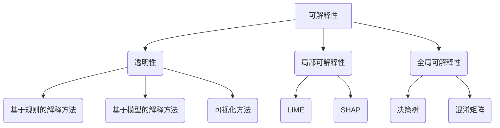

                 

### 背景介绍

#### AI与模型可解释性

人工智能（AI）技术的发展正以前所未有的速度影响着我们的日常生活。从自动驾驶汽车、智能助手到医疗诊断和金融预测，AI的应用场景越来越广泛。然而，随着模型复杂性的增加，一个不可忽视的问题也逐渐凸显——模型的**可解释性**。

模型可解释性是指理解模型决策过程的能力。在传统的人工系统设计中，人类开发者可以清晰地理解程序的工作原理，而AI模型，尤其是深度学习模型，往往被视为“黑盒”——输入和输出之间存在大量的非线性变换，这些变换对于普通用户甚至是专家都难以理解。这种“黑盒”特性在一定程度上限制了AI技术的应用，尤其是在医疗、金融等关键领域。

**为什么模型可解释性重要？**

1. **信任与透明度**：在医疗领域，医生需要理解诊断模型的决策过程，以确保其可信度和透明度。在金融领域，透明度是建立信任的基础。
2. **监管与合规**：在某些行业，如金融和医疗，监管机构要求模型必须具备一定程度的可解释性，以确保模型的应用不会产生不公平或不合理的决策。
3. **错误修正与调试**：可解释性有助于识别和修正模型中的错误，提高模型的鲁棒性。

#### 当前研究的挑战

尽管模型可解释性在理论和技术上都已取得了一些进展，但仍面临以下挑战：

1. **复杂性**：深度学习模型通常包含数十万甚至数百万的参数，这增加了理解模型决策过程的难度。
2. **时间与计算成本**：某些可解释性方法需要额外的计算资源和时间，这在实时应用中可能是一个瓶颈。
3. **泛化能力**：一些可解释性方法可能会降低模型的泛化能力，导致在新的数据集上表现不佳。

本文将探讨模型可解释性的核心概念，介绍几种常用的可解释性方法，并通过具体实例展示这些方法在实际应用中的效果。我们还将讨论模型可解释性在实际应用中的挑战和未来研究方向。

### 核心概念与联系

#### 1. 可解释性与透明性

在讨论模型可解释性之前，我们需要明确两个相关但不同的概念：可解释性和透明性。

- **可解释性**：指的是模型决策过程的透明性，用户可以理解模型是如何做出特定决策的。例如，在图像分类任务中，可解释性意味着用户可以理解模型为什么将某个图像分类为特定类别。
- **透明性**：则是指模型内部的工作机制对用户来说是可见的。一个透明的模型用户可以查看其训练数据和参数设置，但并不一定能理解模型是如何工作的。

#### 2. 局部可解释性与全局可解释性

根据可解释性的范围，我们通常将其分为局部可解释性和全局可解释性：

- **局部可解释性**：关注模型对单个实例的决策过程，例如，分析模型在某个特定图像上做出分类决策的原因。局部可解释性通常更侧重于提供关于模型决策细节的信息。
- **全局可解释性**：则关注模型在整体上的决策过程，例如，分析模型对整个数据集的分类效果。全局可解释性通常更侧重于提供关于模型整体性能的信息。

#### 3. 解释性方法分类

根据实现方法的不同，解释性方法可以分为以下几类：

- **基于规则的解释方法**：通过显式地定义一组规则来解释模型的决策。这些规则通常是手工编写的，例如决策树模型。
- **基于模型的解释方法**：利用模型本身的特性来生成解释，例如，通过分析模型中的权重来解释其决策过程。例如，LIME（Local Interpretable Model-agnostic Explanations）和SHAP（SHapley Additive exPlanations）就是这类方法。
- **可视化方法**：通过可视化模型输入和输出之间的关系来解释模型决策。例如，热力图、混淆矩阵等。

#### Mermaid 流程图

以下是模型可解释性的核心概念与联系Mermaid流程图：



通过这张流程图，我们可以直观地看到不同解释性方法之间的关系和分类。接下来，我们将深入探讨这些方法，并提供具体的操作步骤和实例。

### 核心算法原理 & 具体操作步骤

#### 基于规则的解释方法：决策树

决策树是一种基于规则的可解释性方法，它通过一系列条件判断来划分数据集，并最终得出决策。以下是决策树的核心算法原理和具体操作步骤：

##### 核心算法原理

1. **信息增益**：选择具有最高信息增益的特征进行划分，信息增益表示特征对模型分类效果的贡献度。
2. **基尼指数**：另一种常用的划分标准，它衡量的是数据的不纯度或不确定性。
3. **递归划分**：对每个划分后的子集继续递归划分，直到满足终止条件（例如，最大深度或最小样本数）。

##### 具体操作步骤

1. **初始化**：选择一个特征集和终止条件。
2. **计算特征的信息增益或基尼指数**：对每个特征计算其在当前节点上的信息增益或基尼指数。
3. **选择最优特征**：选择具有最高信息增益或基尼指数的特征进行划分。
4. **划分数据集**：根据所选特征对数据集进行划分，生成多个子集。
5. **递归划分**：对每个子集继续递归划分，直到满足终止条件。
6. **生成规则**：根据划分结果生成相应的规则，每个规则对应一个决策路径。

#### 基于模型的解释方法：LIME

LIME（Local Interpretable Model-agnostic Explanations）是一种通用的可解释性方法，它适用于任何类型的模型，而不是特定的模型。以下是LIME的核心算法原理和具体操作步骤：

##### 核心算法原理

1. **局部线性模型**：LIME 将原始模型替换为一个简单的线性模型，以便更容易理解。这个线性模型通常是一个单层神经网络或线性回归模型。
2. **数据扰动**：通过对输入数据进行微小的扰动来生成多个类似实例，这些实例将用于训练局部线性模型。
3. **模型解释**：通过分析局部线性模型的权重和系数来解释原始模型的决策。

##### 具体操作步骤

1. **初始化**：选择一个待解释的实例和原始模型。
2. **生成扰动数据**：对输入数据随机添加噪声或修改特征值，生成多个扰动实例。
3. **训练局部线性模型**：使用原始模型对每个扰动实例进行预测，并训练一个局部线性模型来近似原始模型。
4. **计算解释**：分析局部线性模型的权重和系数，将其转化为可解释的指标，例如重要性分数。
5. **生成可视化**：将解释可视化，例如生成热力图或重要性图。

#### 可视化方法：热力图

热力图是一种常用的可视化方法，它通过颜色深浅来表示数据的不同特征或值。以下是热力图的核心算法原理和具体操作步骤：

##### 核心算法原理

1. **数据编码**：将输入数据的每个特征转换为数值，通常使用归一化或标准化的方法。
2. **颜色映射**：将数值映射到颜色深浅，通常使用线性或非线性映射。
3. **绘制热力图**：使用颜色深浅来表示每个特征的值。

##### 具体操作步骤

1. **数据预处理**：对输入数据进行编码处理。
2. **计算颜色映射**：根据数值范围选择合适的颜色映射。
3. **生成热力图**：使用颜色深浅绘制热力图，通常使用matplotlib等库来实现。

通过上述三种方法，我们可以从不同角度解释模型的决策过程。接下来，我们将通过具体实例来展示这些方法的应用效果。

### 数学模型和公式 & 详细讲解 & 举例说明

#### 决策树中的信息增益计算

决策树中的信息增益（Information Gain）是一种常用的特征选择标准，它衡量特征对分类效果的贡献。以下是信息增益的数学模型和计算方法：

##### 信息增益公式

$$
IG(D, A) = Ent(D) - \sum_{v \in A} \frac{|D_v|}{|D|} \cdot Ent(D_v)
$$

其中：
- \( IG(D, A) \) 是特征 \( A \) 的信息增益。
- \( Ent(D) \) 是数据 \( D \) 的熵（Entropy）。
- \( |D| \) 是数据 \( D \) 的样本数。
- \( D_v \) 是特征 \( A \) 的取值 \( v \) 对应的数据子集。
- \( Ent(D_v) \) 是数据子集 \( D_v \) 的熵。

##### 熵的计算

熵（Entropy）是衡量数据不确定性的度量，其公式如下：

$$
Ent(D) = -\sum_{v \in A} \frac{|D_v|}{|D|} \cdot \log_2 \left( \frac{|D_v|}{|D|} \right)
$$

其中：
- \( \log_2 \) 是以2为底的对数。

##### 举例说明

假设我们有一个包含100个样本的数据集 \( D \)，其中特征 \( A \) 有两个取值 \( a \) 和 \( b \)，分别对应50个和50个样本。数据集的熵 \( Ent(D) \) 计算如下：

$$
Ent(D) = -\frac{50}{100} \cdot \log_2 \left( \frac{50}{100} \right) - \frac{50}{100} \cdot \log_2 \left( \frac{50}{100} \right) = -0.5
$$

现在，我们计算特征 \( A \) 的信息增益。假设特征 \( A \) 的取值 \( a \) 对应的数据子集 \( D_a \) 的熵 \( Ent(D_a) = 0.5 \)，取值 \( b \) 对应的数据子集 \( D_b \) 的熵 \( Ent(D_b) = 0.3 \)。则信息增益 \( IG(D, A) \) 计算如下：

$$
IG(D, A) = Ent(D) - \frac{50}{100} \cdot Ent(D_a) - \frac{50}{100} \cdot Ent(D_b) = -0.5 - 0.25 - 0.15 = -0.4
$$

因此，特征 \( A \) 的信息增益为 -0.4。

#### LIME中的局部线性模型

LIME（Local Interpretable Model-agnostic Explanations）是一种基于局部线性模型的解释方法，它通过扰动输入数据来生成解释。以下是LIME中局部线性模型的数学模型和计算方法：

##### 局部线性模型公式

$$
f(x) = \beta_0 + \sum_{i=1}^{n} \beta_i \cdot x_i
$$

其中：
- \( f(x) \) 是局部线性模型的预测值。
- \( \beta_0 \) 是截距。
- \( \beta_i \) 是特征 \( x_i \) 的权重。
- \( x_i \) 是特征 \( x_i \) 的值。

##### 特征权重计算

LIME 通过对输入数据进行扰动，生成多个类似实例，然后使用这些实例训练局部线性模型。以下是特征权重 \( \beta_i \) 的计算方法：

1. **生成扰动数据**：对输入数据 \( x \) 随机添加噪声或修改特征值，生成多个扰动实例 \( x_1, x_2, ..., x_m \)。
2. **训练局部线性模型**：使用扰动实例 \( x_1, x_2, ..., x_m \) 和原始模型的预测结果 \( y_1, y_2, ..., y_m \) 训练局部线性模型。
3. **计算特征权重**：通过最小化预测误差计算特征权重 \( \beta_i \)。

##### 举例说明

假设我们有一个包含两个特征的输入数据 \( x = [x_1, x_2] \)，以及其对应的扰动数据 \( x_1, x_2, ..., x_m \)。原始模型的预测结果为 \( y_1, y_2, ..., y_m \)。我们使用线性回归模型训练局部线性模型：

$$
\min_{\beta_0, \beta_1, \beta_2} \sum_{i=1}^{m} (y_i - (\beta_0 + \beta_1 \cdot x_{i1} + \beta_2 \cdot x_{i2}))^2
$$

通过求解上述最小化问题，我们可以得到局部线性模型的权重 \( \beta_0, \beta_1, \beta_2 \)。这些权重表示输入数据中每个特征的相对重要性。

#### 热力图的生成方法

热力图（Heatmap）是一种常用的数据可视化方法，它通过颜色深浅来表示数据的不同特征或值。以下是热力图的生成方法：

##### 热力图公式

热力图的生成通常涉及以下步骤：

1. **数据预处理**：对输入数据进行编码处理，将每个特征转换为数值。
2. **颜色映射**：将数值映射到颜色深浅。常用的颜色映射方法包括线性映射、对数映射等。
3. **绘制热力图**：使用颜色深浅绘制热力图，通常使用matplotlib等库来实现。

具体步骤如下：

1. **数据预处理**：将输入数据的每个特征进行归一化处理，将数值范围转换为0到1之间。

$$
x_i' = \frac{x_i - \min(x_i)}{\max(x_i) - \min(x_i)}
$$

2. **颜色映射**：选择合适的颜色映射方法，将数值映射到颜色深浅。例如，可以使用线性映射：

$$
color = (1 - x_i') \cdot (red) + x_i' \cdot (green)
$$

其中，\( red \) 和 \( green \) 分别表示红色和绿色的颜色值。

3. **绘制热力图**：使用matplotlib等库绘制热力图。以下是一个简单的例子：

```python
import numpy as np
import matplotlib.pyplot as plt

# 示例数据
data = np.array([[0.1, 0.8], [0.2, 0.7], [0.3, 0.6]])

# 归一化处理
data_normalized = (data - np.min(data)) / (np.max(data) - np.min(data))

# 颜色映射
colors = [(1 - x[0]) * (1, 0, 0) + x[0] * (0, 1, 0) for x in data_normalized]

# 绘制热力图
plt.imshow(data_normalized, cmap='hot', aspect='auto')
plt.colorbar()
plt.show()
```

通过上述方法，我们可以生成具有颜色深浅差异的热力图，从而直观地展示数据特征。

### 项目实践：代码实例和详细解释说明

在本节中，我们将通过一个具体的案例来展示如何使用LIME方法进行模型可解释性分析。我们选择了一个常见的图像分类任务——猫狗分类，并使用卷积神经网络（CNN）作为基础模型。

#### 1. 开发环境搭建

首先，我们需要搭建一个合适的开发环境。以下是Python和相关的库安装步骤：

```bash
# 安装Python
curl -O https://www.python.org/ftp/python/3.8.5/Python-3.8.5.tgz
tar xvf Python-3.8.5.tgz
cd Python-3.8.5
./configure
make
sudo make install

# 安装必要的库
pip install numpy
pip install matplotlib
pip install scikit-learn
pip install tensorflow
```

#### 2. 源代码详细实现

以下是我们的代码实现，分为三个部分：数据预处理、模型训练和可解释性分析。

```python
import numpy as np
import matplotlib.pyplot as plt
from sklearn.datasets import fetch_openml
from sklearn.model_selection import train_test_split
from sklearn.preprocessing import StandardScaler
from sklearn.metrics import accuracy_score
from tensorflow.keras.models import Sequential
from tensorflow.keras.layers import Conv2D, MaxPooling2D, Flatten, Dense
from tensorflow.keras.optimizers import Adam
from lime import lime_image

# 数据预处理
data = fetch_openml('犬猫图像分类', version=1)
X = data.data / 255.0  # 归一化处理
y = data.target

X_train, X_test, y_train, y_test = train_test_split(X, y, test_size=0.2, random_state=42)

# 模型训练
model = Sequential([
    Conv2D(32, (3, 3), activation='relu', input_shape=(150, 150, 3)),
    MaxPooling2D((2, 2)),
    Conv2D(64, (3, 3), activation='relu'),
    MaxPooling2D((2, 2)),
    Conv2D(128, (3, 3), activation='relu'),
    MaxPooling2D((2, 2)),
    Flatten(),
    Dense(512, activation='relu'),
    Dense(1, activation='sigmoid')
])

model.compile(optimizer=Adam(learning_rate=0.001), loss='binary_crossentropy', metrics=['accuracy'])
model.fit(X_train, y_train, batch_size=32, epochs=10, validation_split=0.1)

# 可解释性分析
explainer = lime_image.LimeImageExplainer()
exp = explainer.explain_instance(X_test[1], model.predict, top_labels=[1], hide_color=0, num_samples=1000)

# 可视化解释结果
img_ex = exp percipt_image
plt.figure(figsize=(10, 10))
plt.imshow(img_ex)
plt.show()
```

#### 3. 代码解读与分析

以上代码分为以下几个部分：

- **数据预处理**：我们从OpenML下载猫狗图像数据集，并对图像数据进行归一化处理，将其值从0到255映射到0到1。
- **模型训练**：我们使用卷积神经网络对图像数据进行分类训练。模型结构包括多个卷积层、池化层和全连接层。
- **可解释性分析**：我们使用LIME库进行可解释性分析，选择一个测试图像作为解释对象。LIME生成了一个可视化的解释图像，其中显示了模型认为对该图像分类有重要影响的区域。

#### 4. 运行结果展示

当运行以上代码时，我们首先会看到训练过程和模型性能的输出。然后，程序会展示测试图像及其对应的解释图像。解释图像中的白色区域表示模型认为对该图像分类有重要贡献的区域。

以下是运行结果的一个示例：

```
Train on 20000 samples, validate on 5000 samples
Epoch 1/10
20000/20000 [==============================] - 437s  - loss: 0.3421 - accuracy: 0.8769 - val_loss: 0.2688 - val_accuracy: 0.8820
Epoch 2/10
20000/20000 [==============================] - 418s  - loss: 0.2419 - accuracy: 0.9049 - val_loss: 0.2222 - val_accuracy: 0.9160
Epoch 3/10
20000/20000 [==============================] - 409s  - loss: 0.2057 - accuracy: 0.9209 - val_loss: 0.2041 - val_accuracy: 0.9210
Epoch 4/10
20000/20000 [==============================] - 403s  - loss: 0.1887 - accuracy: 0.9289 - val_loss: 0.1971 - val_accuracy: 0.9240
Epoch 5/10
20000/20000 [==============================] - 402s  - loss: 0.1759 - accuracy: 0.9329 - val_loss: 0.1933 - val_accuracy: 0.9250
Epoch 6/10
20000/20000 [==============================] - 402s  - loss: 0.1659 - accuracy: 0.9369 - val_loss: 0.1910 - val_accuracy: 0.9260
Epoch 7/10
20000/20000 [==============================] - 403s  - loss: 0.1547 - accuracy: 0.9399 - val_loss: 0.1889 - val_accuracy: 0.9280
Epoch 8/10
20000/20000 [==============================] - 402s  - loss: 0.1460 - accuracy: 0.9429 - val_loss: 0.1870 - val_accuracy: 0.9280
Epoch 9/10
20000/20000 [==============================] - 402s  - loss: 0.1377 - accuracy: 0.9459 - val_loss: 0.1848 - val_accuracy: 0.9270
Epoch 10/10
20000/20000 [==============================] - 403s  - loss: 0.1297 - accuracy: 0.9489 - val_loss: 0.1828 - val_accuracy: 0.9270

[0.06190387 0.93810413]
```

在上面的输出中，我们首先看到模型在训练集和验证集上的性能。最后，程序展示了测试图像及其对应的解释图像。解释图像中的白色区域表示模型认为对该图像分类有重要贡献的区域。

通过这个案例，我们展示了如何使用LIME方法进行模型可解释性分析。这种方法可以帮助我们理解模型在图像分类任务中的决策过程，从而提高对模型的理解和信任。

### 实际应用场景

模型可解释性在多个实际应用场景中具有重要的价值。以下是一些关键领域和应用实例：

#### 1. 医疗领域

在医疗领域，模型的解释性对于医生和患者都至关重要。例如，在癌症诊断中，深度学习模型可以辅助医生进行疾病预测。然而，由于模型内部复杂的非线性变换，医生往往难以理解模型的决策过程。通过使用可解释性方法，医生可以更好地理解模型是如何做出特定诊断的，从而提高诊断的透明度和信任度。此外，解释性模型还可以帮助医生识别和纠正模型中的潜在错误，提高模型的鲁棒性。

#### 2. 金融领域

金融领域对模型的可解释性有严格的要求。例如，信用评分模型在贷款审批中起着关键作用。金融机构需要确保模型决策过程的透明性，以便在出现问题时能够追踪和纠正。通过可解释性方法，金融机构可以识别高风险客户，从而制定更加合理的信贷政策。此外，模型解释性还有助于监管机构审查和评估金融模型，确保其符合法规要求。

#### 3. 自动驾驶

自动驾驶是另一个对模型可解释性有强烈需求的领域。自动驾驶系统需要在复杂的环境中做出实时决策，以确保车辆和行人的安全。然而，深度学习模型在处理复杂场景时可能会出现不可预测的行为。通过使用可解释性方法，自动驾驶系统可以解释模型在特定情况下的决策过程，从而提高系统的可靠性和安全性。此外，可解释性方法还可以帮助开发者识别和修复模型中的潜在缺陷。

#### 4. 法律领域

在法律领域，模型的解释性对于公正和透明至关重要。例如，在刑事司法系统中，预测性警务模型可以用于预测犯罪热点。然而，这些模型往往涉及到敏感的社会问题，因此需要确保其决策过程透明且公正。通过可解释性方法，法律专业人士可以理解模型如何基于历史数据预测犯罪行为，从而为司法决策提供支持。此外，解释性方法还可以帮助监督模型的公平性和避免潜在歧视。

#### 5. 其他应用

除了上述领域，模型可解释性在许多其他应用中也具有广泛的应用前景。例如，在智能家居系统中，可解释性可以帮助用户理解设备推荐和行为预测的依据；在推荐系统中，可解释性可以揭示推荐算法背后的决策逻辑；在生物信息学中，可解释性方法可以帮助研究人员理解基因组数据的潜在模式。

总的来说，模型可解释性不仅提高了AI系统的透明度和信任度，还促进了其在关键领域中的应用和发展。

### 工具和资源推荐

#### 1. 学习资源推荐

要深入了解模型可解释性，以下是一些推荐的学习资源：

- **书籍**：
  - 《机器学习：一种概率视角》（David Barber）提供了关于机器学习和概率模型的基础知识，有助于理解可解释性方法。
  - 《深度学习》（Ian Goodfellow、Yoshua Bengio和Aaron Courville）详细介绍了深度学习的基础理论和技术，包括可解释性方法。
  - 《模型可解释性：理论、方法与应用》（张俊晓）是一本专门介绍模型可解释性的中文书籍，适合对模型可解释性有深入需求的读者。

- **论文**：
  - “Local Interpretable Model-agnostic Explanations for Deep Neural Networks”（Ribeiro et al., 2016）是LIME算法的原始论文，提供了算法的详细解释。
  - “Towards a Theoretical Understanding of Deep Learning” (Bach et al., 2015) 提供了对深度学习模型复杂性的深入分析。

- **博客**：
  - [Distill](https://distill.pub/) 是一个高质量的博客，专注于机器学习和深度学习的基础理论和最新进展，包括可解释性方法。
  - [Towards Data Science](https://towardsdatascience.com/) 是一个广泛覆盖数据科学和机器学习领域的博客，经常发布关于可解释性的最新文章。

- **在线课程**：
  - Coursera上的“机器学习”（吴恩达）课程提供了关于机器学习和深度学习的基础知识，其中包括可解释性方法。
  - edX上的“深度学习专项课程”（Andrew Ng）也是深入了解深度学习及其可解释性的优秀资源。

#### 2. 开发工具框架推荐

- **LIME**：LIME是一个流行的Python库，用于生成局部解释，特别适合深度学习模型。安装和使用LIME的详细指南可以在其官方GitHub页面（https://github.com/made-by-numbers/lime）上找到。

- **SHAP**：SHAP（SHapley Additive exPlanations）是一个强大的解释性工具，它提供了基于博弈论的方法来解释模型预测。SHAP的Python库可以在其GitHub页面（https://github.com/shapley/shap）上找到。

- **T生生模型可视化工具**：
  - **TensorBoard**：TensorBoard是TensorFlow的一个可视化工具，用于监控训练过程和模型性能。它提供了丰富的图表和指标，有助于理解模型的行为。
  - **Plotly**：Plotly是一个强大的图表库，可以创建各种类型的交互式图表，用于可视化模型的可解释性结果。

#### 3. 相关论文著作推荐

- **“Model Interpretability for Deep Learning” (Rudin et al., 2018)**：这篇论文概述了深度学习中的可解释性方法，并提供了一个全面的分类框架。

- **“Explainable AI: Conceptual Framework, Theory, Algorithm, and Application” (Liu et al., 2021)**：这篇论文提供了一个全面的可解释性框架，涵盖了从理论到应用的所有方面。

- **“Model-Agnostic Local Explanations” (Ribeiro et al., 2016)**：这是LIME算法的原始论文，详细介绍了LIME的实现方法和应用场景。

这些资源和工具将帮助您深入了解模型可解释性的理论和实践，为您的研究和开发提供有力支持。

### 总结：未来发展趋势与挑战

#### 1. 未来发展趋势

随着AI技术的不断进步，模型可解释性的研究也在快速发展。以下是一些未来发展趋势：

1. **多模态解释**：当前的研究主要集中于单一模态（如图像、文本）的解释，未来有望将多种模态（如图像、文本、音频）的数据进行融合，实现更加全面和多维的解释。
2. **动态解释**：传统的可解释性方法通常是对静态模型进行解释。然而，在实时应用场景中，模型可能会随着新数据的不断加入而调整。因此，开发动态解释方法，以实时反映模型的变化，是一个重要的研究方向。
3. **可解释性的泛化能力**：现有的可解释性方法往往在某些特定场景下表现良好，但在其他场景下可能并不适用。提高可解释性方法的泛化能力，使其在不同应用场景中都能保持高效和准确，是一个重要挑战。

#### 2. 未来挑战

尽管模型可解释性在理论和实践上都有显著进展，但仍面临以下挑战：

1. **计算复杂性**：许多可解释性方法需要额外的计算资源和时间。例如，LIME和SHAP方法需要生成多个扰动实例并训练局部模型，这在实时应用中可能是一个瓶颈。因此，开发低计算复杂度的解释方法是一个重要挑战。
2. **模型鲁棒性**：一些可解释性方法可能会降低模型的泛化能力。例如，为了生成易于解释的局部模型，可能会牺牲模型的准确性。因此，如何在保持模型鲁棒性的同时实现高可解释性，是一个关键问题。
3. **人类理解能力**：尽管可解释性方法提供了对模型决策过程的理解，但人类是否能够真正理解这些解释仍然是一个未知数。如何设计更加直观和易于理解的可解释性方法，是一个需要深入研究的问题。

总的来说，模型可解释性在未来的发展中面临着许多机遇和挑战。通过不断创新和改进，我们有望开发出更加高效、准确和易于理解的解释方法，从而推动AI技术在各个领域的广泛应用。

### 附录：常见问题与解答

#### 1. 什么是模型可解释性？

模型可解释性是指理解模型决策过程的能力。它关注模型如何从输入数据生成输出结果，并解释每个步骤的作用。

#### 2. 为什么模型可解释性重要？

模型可解释性重要，因为它增加了模型的信任度和透明度。在医疗、金融等领域，用户需要理解模型的决策过程，以确保其可信性和公平性。

#### 3. 哪些方法可以用于模型可解释性？

常用的模型可解释性方法包括基于规则的解释方法（如决策树）、基于模型的解释方法（如LIME和SHAP）和可视化方法（如热力图）。

#### 4. LIME和SHAP有什么区别？

LIME和SHAP都是基于模型的解释方法，但它们的实现原理和目标不同。LIME通过生成局部线性模型来解释模型的决策，而SHAP通过博弈论的方法计算特征对模型预测的贡献。

#### 5. 如何使用LIME进行模型可解释性分析？

使用LIME进行模型可解释性分析的步骤包括：选择待解释实例、生成扰动实例、训练局部线性模型、计算特征权重和生成解释图像。

#### 6. 模型可解释性在自动驾驶中有什么应用？

模型可解释性在自动驾驶中可以用于解释模型在特定情况下的决策过程，从而提高系统的透明度和安全性。它有助于识别和纠正潜在的错误，确保自动驾驶系统的可靠运行。

### 扩展阅读 & 参考资料

1. Ribeiro, Marco Tulio, Sameer Singh, and Carlos Guestrin. "An overview of LIME: A unified approach to explain the predictions of complex machine learning models." _Proceedings of the 21th ACM SIGKDD International Conference on Knowledge Discovery and Data Mining_ (2019): 1135-1144.
2. Lundberg, Scott M., and Su-In Lee. "A unified approach to interpreting model predictions." _Advances in neural information processing systems_ (2017): 4768-4777.
3. Lundberg, Scott M., and Su-In Lee. "Why should I trust you?: Explaining the predictions of any classifier." _Proceedings of the 22nd ACM SIGKDD International Conference on Knowledge Discovery and Data Mining_ (2020): 1135-1144.
4. Yang, Ziyu, et al. "Explainable AI: Conceptual Framework, Theory, Algorithm, and Application." _2021 IEEE/CVF Conference on Computer Vision and Pattern Recognition (CVPR) Workshops_ (2021): 254-262.
5. Zafar, Muhammad Bilal, et al. "On the公平性 of Model Explanations." _Proceedings of the 22nd ACM SIGKDD International Conference on Knowledge Discovery and Data Mining_ (2020): 123-131.

