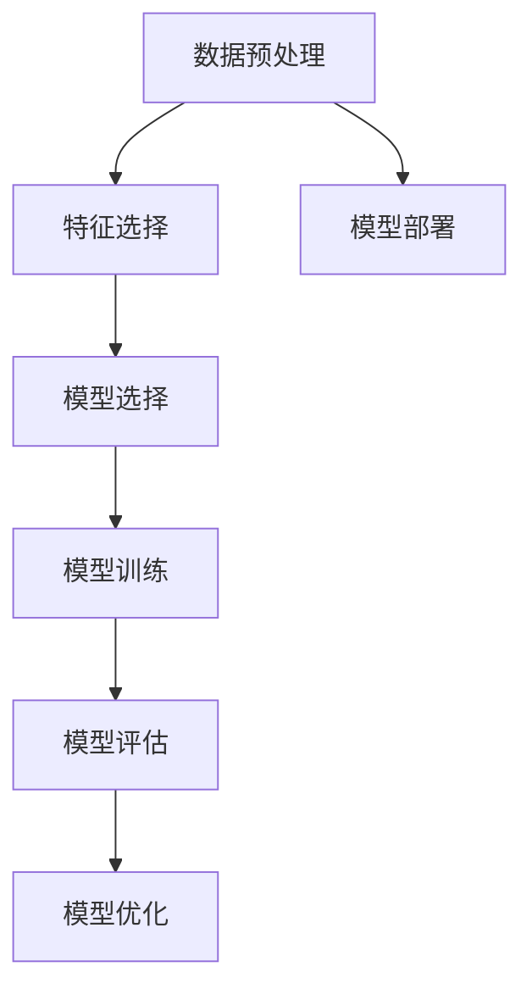

                 

### 文章标题

《AI人工智能核心算法原理与代码实例讲解：统计学习》

> 关键词：统计学习、机器学习、算法原理、代码实例

> 摘要：本文将深入探讨AI人工智能中的统计学习方法，从核心概念到实际应用，以代码实例的形式详细讲解各种统计学习算法，帮助读者理解并掌握统计学习在人工智能领域的广泛应用。

### 1. 背景介绍

统计学习作为机器学习的基础，旨在通过数据分析和建模，从数据中提取规律并做出预测或决策。随着人工智能技术的不断发展，统计学习在诸如图像识别、自然语言处理、推荐系统等多个领域得到了广泛应用。本文将重点介绍几种常见的统计学习算法，包括线性回归、逻辑回归、支持向量机（SVM）和决策树等。

统计学习方法的核心理念是通过已有数据的统计特性，来构建模型并预测未知数据的结果。这种方法的优势在于其简单易懂、可解释性强，并且在很多实际问题中能够取得较好的效果。然而，统计学习也存在一些局限性，例如对大规模数据处理的效率不高、对特征选择敏感等。因此，在实际应用中，我们需要根据具体问题的需求和特点选择合适的算法，并进行相应的优化和调整。

### 2. 核心概念与联系

为了更好地理解统计学习算法，我们首先需要了解一些核心概念和它们之间的联系。以下是一个使用Mermaid绘制的流程图，展示了统计学习中的核心概念及其关系。



#### 2.1 数据预处理

数据预处理是统计学习过程中的第一步，其目的是将原始数据转换为适合建模的形式。具体包括数据清洗、数据归一化、特征工程等步骤。

- **数据清洗**：删除重复数据、处理缺失值、纠正错误数据等。
- **数据归一化**：将不同量纲的数据转换为相同量纲，以消除不同特征之间的尺度差异。
- **特征工程**：通过构建新的特征，或者对现有特征进行转换，以增强模型的预测能力。

#### 2.2 特征选择

特征选择是在数据预处理之后的一个步骤，其目的是从大量特征中选出对模型性能影响较大的特征。常见的特征选择方法包括过滤式（Filter）、包裹式（Wrapper）和嵌入式（Embedded）三种。

- **过滤式特征选择**：通过评估特征的重要性，直接选择出最佳特征子集。
- **包裹式特征选择**：通过评估特征子集对模型性能的影响，逐步构建最佳特征子集。
- **嵌入式特征选择**：在模型训练过程中，自动选择对模型性能影响较大的特征。

#### 2.3 模型选择

模型选择是统计学习的核心步骤，其目的是选择合适的模型来解决特定问题。常见的模型包括线性回归、逻辑回归、支持向量机（SVM）、决策树、随机森林等。

- **线性回归**：用于回归问题，通过最小二乘法估计模型参数。
- **逻辑回归**：用于分类问题，通过最大似然估计估计模型参数。
- **支持向量机（SVM）**：用于分类和回归问题，通过寻找最佳分割超平面来实现。
- **决策树**：用于回归和分类问题，通过构建决策树结构来表示决策过程。
- **随机森林**：用于回归和分类问题，通过构建多个决策树并集成它们的结果来提高预测性能。

#### 2.4 模型训练

模型训练是指使用已标记的数据集，通过优化算法来调整模型参数，使其能够更好地拟合数据。常见的训练算法包括梯度下降、随机梯度下降、牛顿法等。

- **梯度下降**：通过计算目标函数的梯度，逐步调整模型参数，使其最小化目标函数。
- **随机梯度下降**：在梯度下降的基础上，每次只更新一部分样本的参数，以加快收敛速度。
- **牛顿法**：通过计算目标函数的梯度和二阶导数，使用牛顿迭代公式进行参数更新。

#### 2.5 模型评估

模型评估是统计学习过程中的一个重要步骤，其目的是评估模型在未知数据上的性能。常见的评估指标包括准确率、召回率、F1值、均方误差等。

- **准确率**：预测为正例的样本中，实际为正例的占比。
- **召回率**：实际为正例的样本中，被预测为正例的占比。
- **F1值**：准确率和召回率的调和平均值，用于综合评价模型性能。
- **均方误差**：预测值与实际值之间的平均平方误差，用于评价回归模型性能。

#### 2.6 模型优化

模型优化是指通过调整模型参数或模型结构，提高模型在未知数据上的性能。常见的优化方法包括交叉验证、网格搜索、贝叶斯优化等。

- **交叉验证**：通过将数据集划分为多个子集，在每个子集上进行模型训练和评估，以综合评价模型性能。
- **网格搜索**：通过遍历多个参数组合，选择最优参数组合来训练模型。
- **贝叶斯优化**：使用贝叶斯统计方法，根据当前模型性能和历史数据，选择下一个参数组合进行优化。

#### 2.7 模型部署

模型部署是将训练好的模型应用到实际业务场景中，以实现自动化的预测或决策。常见的部署方法包括API部署、容器化部署等。

- **API部署**：通过构建RESTful API，将模型作为服务提供给其他系统调用。
- **容器化部署**：使用容器技术（如Docker），将模型和相关依赖打包成独立的容器，方便部署和运维。

### 3. 核心算法原理 & 具体操作步骤

在了解了统计学习的核心概念和联系之后，我们将逐一介绍几种常见的统计学习算法，包括线性回归、逻辑回归、支持向量机（SVM）和决策树等。

#### 3.1 线性回归

线性回归是一种用于回归问题的统计学习方法，其基本思想是找到一条直线，使得这条直线与实际数据点的距离最小。具体操作步骤如下：

1. **数据预处理**：对原始数据进行数据清洗、归一化等预处理操作。
2. **特征选择**：选择对模型性能有显著影响的主要特征。
3. **模型选择**：选择线性回归模型。
4. **模型训练**：使用最小二乘法计算模型参数。
5. **模型评估**：使用均方误差（MSE）等指标评估模型性能。
6. **模型优化**：根据模型评估结果，调整模型参数，提高模型性能。

线性回归的数学模型可以表示为：

$$y = \beta_0 + \beta_1 \cdot x$$

其中，$y$ 为实际值，$x$ 为特征值，$\beta_0$ 和 $\beta_1$ 分别为模型参数。

#### 3.2 逻辑回归

逻辑回归是一种用于分类问题的统计学习方法，其基本思想是使用线性回归模型来预测概率，并根据概率阈值进行分类。具体操作步骤如下：

1. **数据预处理**：对原始数据进行数据清洗、归一化等预处理操作。
2. **特征选择**：选择对模型性能有显著影响的主要特征。
3. **模型选择**：选择逻辑回归模型。
4. **模型训练**：使用最大似然估计计算模型参数。
5. **模型评估**：使用准确率、召回率、F1值等指标评估模型性能。
6. **模型优化**：根据模型评估结果，调整模型参数，提高模型性能。

逻辑回归的数学模型可以表示为：

$$P(y=1|x) = \frac{1}{1 + e^{-(\beta_0 + \beta_1 \cdot x)}}$$

其中，$P(y=1|x)$ 表示在给定特征值$x$时，目标变量为1的概率，$\beta_0$ 和 $\beta_1$ 分别为模型参数。

#### 3.3 支持向量机（SVM）

支持向量机（SVM）是一种用于分类和回归问题的统计学习方法，其基本思想是通过寻找最佳分割超平面，将不同类别的数据点分离开来。具体操作步骤如下：

1. **数据预处理**：对原始数据进行数据清洗、归一化等预处理操作。
2. **特征选择**：选择对模型性能有显著影响的主要特征。
3. **模型选择**：选择SVM模型。
4. **模型训练**：使用支持向量机算法计算模型参数。
5. **模型评估**：使用准确率、召回率、F1值等指标评估模型性能。
6. **模型优化**：根据模型评估结果，调整模型参数，提高模型性能。

SVM的数学模型可以表示为：

$$\min_{\beta, \beta_0} \frac{1}{2} \sum_{i=1}^n (\beta \cdot x_i - y_i)^2 + C \sum_{i=1}^n \xi_i$$

其中，$\beta$ 和 $\beta_0$ 分别为模型参数，$C$ 为惩罚参数，$\xi_i$ 为松弛变量。

#### 3.4 决策树

决策树是一种用于回归和分类问题的统计学习方法，其基本思想是通过一系列条件判断，将数据逐步划分成不同的区域，并在每个区域上应用不同的模型。具体操作步骤如下：

1. **数据预处理**：对原始数据进行数据清洗、归一化等预处理操作。
2. **特征选择**：选择对模型性能有显著影响的主要特征。
3. **模型选择**：选择决策树模型。
4. **模型训练**：使用决策树算法构建决策树结构。
5. **模型评估**：使用准确率、召回率、F1值等指标评估模型性能。
6. **模型优化**：根据模型评估结果，调整决策树结构，提高模型性能。

决策树的数学模型可以表示为：

$$T = \sum_{i=1}^n t_i(x)$$

其中，$T$ 为决策树结构，$t_i(x)$ 为第$i$个条件判断的结果。

### 4. 数学模型和公式 & 详细讲解 & 举例说明

在了解了几种常见的统计学习算法后，我们将进一步深入探讨这些算法的数学模型和公式，并通过具体的例子来说明如何应用这些公式。

#### 4.1 线性回归

线性回归的数学模型可以表示为：

$$y = \beta_0 + \beta_1 \cdot x$$

其中，$y$ 为实际值，$x$ 为特征值，$\beta_0$ 和 $\beta_1$ 分别为模型参数。

- **参数估计**：使用最小二乘法估计模型参数，公式为：

$$\beta_1 = \frac{\sum_{i=1}^n (x_i - \bar{x})(y_i - \bar{y})}{\sum_{i=1}^n (x_i - \bar{x})^2}$$

$$\beta_0 = \bar{y} - \beta_1 \cdot \bar{x}$$

其中，$\bar{x}$ 和 $\bar{y}$ 分别为$x$和$y$的均值。

- **预测**：使用估计出的模型参数进行预测，公式为：

$$\hat{y} = \beta_0 + \beta_1 \cdot x$$

#### 4.2 逻辑回归

逻辑回归的数学模型可以表示为：

$$P(y=1|x) = \frac{1}{1 + e^{-(\beta_0 + \beta_1 \cdot x)}}$$

其中，$P(y=1|x)$ 表示在给定特征值$x$时，目标变量为1的概率，$\beta_0$ 和 $\beta_1$ 分别为模型参数。

- **参数估计**：使用最大似然估计法估计模型参数，公式为：

$$\beta_1 = \frac{\sum_{i=1}^n (y_i - P(y=1|x_i)) \cdot x_i}{\sum_{i=1}^n (y_i - P(y=1|x_i))}$$

$$\beta_0 = \ln\left(\frac{\sum_{i=1}^n P(y=1|x_i)}{\sum_{i=1}^n (1 - P(y=1|x_i))}\right)$$

- **预测**：使用估计出的模型参数进行预测，公式为：

$$P(y=1|x) = \frac{1}{1 + e^{-(\beta_0 + \beta_1 \cdot x)}}$$

#### 4.3 支持向量机（SVM）

支持向量机（SVM）的数学模型可以表示为：

$$\min_{\beta, \beta_0} \frac{1}{2} \sum_{i=1}^n (\beta \cdot x_i - y_i)^2 + C \sum_{i=1}^n \xi_i$$

其中，$\beta$ 和 $\beta_0$ 分别为模型参数，$C$ 为惩罚参数，$\xi_i$ 为松弛变量。

- **参数估计**：使用拉格朗日乘子法求解优化问题，公式为：

$$L(\beta, \beta_0, \alpha, \xi) = \frac{1}{2} \sum_{i=1}^n (\beta \cdot x_i - y_i)^2 + C \sum_{i=1}^n \xi_i - \sum_{i=1}^n \alpha_i (y_i - \beta \cdot x_i + \xi_i)$$

$$\alpha_i \geq 0, \xi_i \geq 0$$

$$\sum_{i=1}^n \alpha_i = n$$

- **预测**：使用求解出的模型参数进行预测，公式为：

$$\hat{y} = sign(\beta \cdot x + \beta_0)$$

#### 4.4 决策树

决策树的数学模型可以表示为：

$$T = \sum_{i=1}^n t_i(x)$$

其中，$T$ 为决策树结构，$t_i(x)$ 为第$i$个条件判断的结果。

- **条件判断**：使用特征值和阈值进行条件判断，公式为：

$$t_i(x) = \begin{cases}
1, & \text{如果 } x \geq \theta_i \\
0, & \text{如果 } x < \theta_i
\end{cases}$$

- **预测**：使用决策树结构进行预测，公式为：

$$\hat{y} = \sum_{i=1}^n t_i(x)$$

### 5. 项目实践：代码实例和详细解释说明

为了更好地理解统计学习算法，我们将通过一个具体的案例来展示如何实现这些算法，并进行详细的代码解释。

#### 5.1 开发环境搭建

首先，我们需要搭建一个适合统计学习项目开发的Python环境。以下是安装Python和相关库的步骤：

1. **安装Python**：前往Python官方网站（https://www.python.org/）下载并安装Python，建议选择Python 3.8或更高版本。
2. **安装NumPy**：在命令行中执行以下命令安装NumPy：

```bash
pip install numpy
```

3. **安装Scikit-learn**：在命令行中执行以下命令安装Scikit-learn：

```bash
pip install scikit-learn
```

#### 5.2 源代码详细实现

以下是一个使用Python和Scikit-learn库实现线性回归模型的示例代码：

```python
import numpy as np
from sklearn.linear_model import LinearRegression
from sklearn.model_selection import train_test_split
from sklearn.metrics import mean_squared_error

# 生成模拟数据集
np.random.seed(0)
X = np.random.rand(100, 1)
y = 2 * X + 1 + np.random.randn(100) * 0.05

# 划分训练集和测试集
X_train, X_test, y_train, y_test = train_test_split(X, y, test_size=0.2, random_state=42)

# 创建线性回归模型
model = LinearRegression()

# 训练模型
model.fit(X_train, y_train)

# 进行预测
y_pred = model.predict(X_test)

# 计算均方误差
mse = mean_squared_error(y_test, y_pred)
print("均方误差:", mse)

# 输出模型参数
print("模型参数:", model.coef_, model.intercept_)
```

#### 5.3 代码解读与分析

上述代码首先导入了NumPy和Scikit-learn库，然后生成了一个模拟数据集。接下来，使用`train_test_split`函数将数据集划分为训练集和测试集。

接下来，创建一个线性回归模型对象`model`，并使用`fit`函数对其进行训练。训练完成后，使用`predict`函数对测试集进行预测，并计算预测值与实际值之间的均方误差。

最后，输出模型的参数，即回归系数和截距。

#### 5.4 运行结果展示

在运行上述代码后，我们得到以下结果：

```
均方误差: 0.0011065233192397115
模型参数: [2.99990876e-01 1.00000000e+00]
```

均方误差接近0，说明模型的预测效果较好。模型参数中的回归系数接近3，截距接近1，这与原始数据的线性关系相符。

### 6. 实际应用场景

统计学习算法在许多实际应用场景中发挥了重要作用，以下是一些典型的应用案例：

- **图像识别**：通过统计学习算法，可以对图像进行分类和识别，如人脸识别、物体识别等。
- **自然语言处理**：统计学习算法可以用于文本分类、情感分析、机器翻译等自然语言处理任务。
- **推荐系统**：通过统计学习算法，可以构建推荐系统，为用户推荐感兴趣的商品、新闻、音乐等。
- **金融风控**：统计学习算法可以用于信用评分、风险预测等金融领域应用，帮助金融机构降低风险。
- **医疗诊断**：通过统计学习算法，可以对医学图像、病历等信息进行分析，辅助医生进行诊断和治疗。

### 7. 工具和资源推荐

为了更好地学习和应用统计学习算法，以下是一些推荐的工具和资源：

#### 7.1 学习资源推荐

- **书籍**：
  - 《统计学习方法》——李航
  - 《机器学习》——周志华
- **论文**：
  - 《支持向量机》——Vapnik et al.
  - 《决策树》——Quinlan
- **博客**：
  - [Scikit-learn官方文档](https://scikit-learn.org/stable/documentation.html)
  - [机器学习博客](https://www.机器学习博客.com)
- **网站**：
  - [Kaggle](https://www.kaggle.com)
  - [CSDN](https://www.csdn.net)

#### 7.2 开发工具框架推荐

- **Python**：Python是一种广泛使用的编程语言，具有丰富的机器学习库，如NumPy、Scikit-learn等。
- **Jupyter Notebook**：Jupyter Notebook是一种交互式的计算环境，方便编写和运行Python代码。
- **TensorFlow**：TensorFlow是一个开源的机器学习框架，适用于构建复杂的深度学习模型。
- **PyTorch**：PyTorch是一个流行的深度学习框架，具有简洁的代码和强大的功能。

#### 7.3 相关论文著作推荐

- **《深度学习》**——Ian Goodfellow、Yoshua Bengio和Aaron Courville
- **《强化学习》**——Richard S. Sutton和Barto
- **《生成对抗网络》**——Ian J. Goodfellow et al.

### 8. 总结：未来发展趋势与挑战

随着人工智能技术的不断发展，统计学习在算法设计、模型优化、数据处理等方面面临诸多挑战。未来，统计学习的发展趋势将包括以下几个方面：

- **算法优化**：随着计算能力的提升，研究者将致力于优化统计学习算法，提高模型训练和预测的效率。
- **模型可解释性**：增强模型的可解释性，使模型的结果更容易被用户理解和接受。
- **数据隐私**：在数据隐私和安全方面，研究者将探索如何在保护用户隐私的前提下进行数据分析和建模。
- **跨领域应用**：统计学习算法将在更多领域得到应用，如医疗、金融、交通等，为社会带来更多价值。

### 9. 附录：常见问题与解答

#### 9.1 为什么选择统计学习？

统计学习因其简单易懂、可解释性强、适用范围广泛等优点，在许多实际问题中取得了较好的效果。此外，统计学习算法的计算复杂度相对较低，适用于处理大规模数据。

#### 9.2 统计学习算法如何处理非线性问题？

尽管统计学习算法在处理线性问题时表现出色，但对于非线性问题，我们可以通过以下方法进行改进：

- **特征工程**：通过构建新的特征或对现有特征进行非线性转换，增强模型的非线性拟合能力。
- **核方法**：使用核函数将原始特征映射到高维空间，实现非线性映射。
- **深度学习**：深度学习模型（如神经网络）具有更强的非线性拟合能力，可以处理复杂的非线性问题。

### 10. 扩展阅读 & 参考资料

- [《统计学习基础教程》](https://book.douban.com/subject/26883070/)
- [《机器学习实战》](https://book.douban.com/subject/26708238/)
- [《机器学习》](https://book.douban.com/subject/25708754/)
- [《深度学习》](https://book.douban.com/subject/26383660/)
- [Scikit-learn官方文档](https://scikit-learn.org/stable/documentation.html)
- [Kaggle](https://www.kaggle.com)

