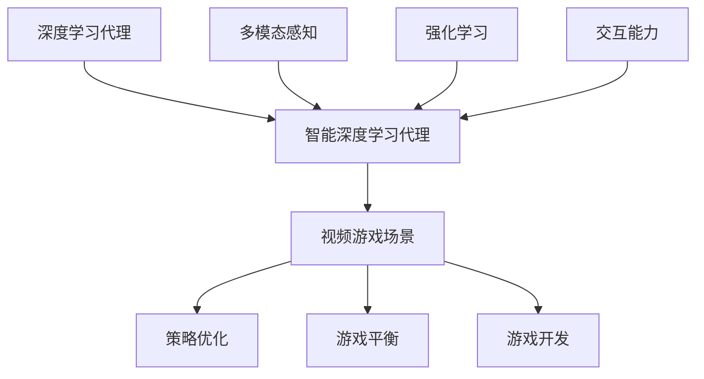

                 

### 背景介绍

随着人工智能技术的飞速发展，深度学习算法已经成为了当前最为热门的研究方向之一。深度学习算法在图像识别、自然语言处理、语音识别等多个领域取得了显著的成果，极大地推动了人工智能技术的发展。然而，在视频游戏领域，深度学习算法的应用仍然存在许多挑战。

近年来，智能深度学习代理（Intelligent Deep Learning Agent）的概念逐渐兴起，成为研究热点。智能深度学习代理是一种能够自主学习并在特定环境中做出智能决策的智能体。它们通过深度神经网络学习环境中的规律和策略，从而提高自身的行为能力。在视频游戏场景中，智能深度学习代理的应用潜力巨大，可以带来以下几个方面的变革：

1. **游戏玩法创新**：智能深度学习代理能够学习并模拟高水平玩家的游戏策略，为游戏开发带来新的创意和玩法。例如，在电子竞技游戏中，智能代理可以参与与其他玩家的对战，提供更具挑战性的对手。

2. **游戏AI智能提升**：传统游戏AI往往采用预定义的规则和策略，难以适应复杂多变的游戏场景。智能深度学习代理通过不断学习游戏数据，可以自我进化，提高AI的智能水平和适应能力。

3. **游戏场景优化**：智能深度学习代理可以分析游戏场景中的数据，识别玩家行为模式，从而优化游戏体验。例如，在多人在线游戏中，智能代理可以实时调整游戏难度，平衡玩家之间的竞争。

4. **游戏智能化训练**：智能深度学习代理可以作为训练工具，帮助游戏开发者快速生成大量的训练数据，提高模型训练效果。

本文旨在探讨智能深度学习代理在视频游戏场景中的应用，详细介绍其核心概念、算法原理、数学模型和实际应用场景。通过本文的阅读，读者可以全面了解智能深度学习代理的工作机制，以及如何在视频游戏中实现其应用。

### 2. 核心概念与联系

要深入探讨智能深度学习代理在视频游戏场景中的应用，我们首先需要明确几个核心概念，并理解它们之间的联系。

#### 2.1 深度学习代理

深度学习代理（Deep Learning Agent）是一种基于深度学习技术的智能体，能够在特定环境中进行自主学习和决策。它们通常由一个或多个神经网络构成，这些神经网络通过学习环境中的输入数据，生成相应的输出，指导智能体的行为。深度学习代理的核心特点包括：

- **自主学习**：通过大量的训练数据，代理能够自主学习和优化自身的策略。
- **自适应**：代理能够根据环境的变化调整自己的行为，适应不同的游戏场景。
- **可扩展性**：代理的结构和算法可以适应不同类型和难度的游戏。

#### 2.2 智能深度学习代理

智能深度学习代理（Intelligent Deep Learning Agent）是在传统深度学习代理的基础上，增加了更多的智能特性。它们不仅能够学习环境中的规律，还能够进行复杂的决策和策略优化。智能深度学习代理的核心特点包括：

- **多模态感知**：智能代理能够处理多种类型的数据，如图像、文本、声音等，从而更全面地理解游戏环境。
- **强化学习**：智能代理通过强化学习算法，不断优化自身的策略，提高在游戏中的表现。
- **交互能力**：智能代理能够与其他智能体和人类玩家进行交互，理解并适应复杂的社会环境。

#### 2.3 视频游戏场景

视频游戏场景是一个典型的复杂动态环境，其中玩家需要做出快速而准确的决策，以实现游戏目标。视频游戏场景的特点包括：

- **动态变化**：游戏环境中的状态不断变化，玩家需要实时调整策略以应对新的情况。
- **不确定性**：游戏结果往往具有很大的不确定性，玩家需要在不确定的情况下做出最优决策。
- **多目标**：玩家在游戏中可能需要同时追求多个目标，如获得高分、击败对手等。

#### 2.4 智能深度学习代理与视频游戏场景的关系

智能深度学习代理与视频游戏场景之间存在密切的联系。智能代理可以通过以下方式在视频游戏场景中发挥作用：

- **策略优化**：智能代理能够通过学习游戏数据，优化游戏策略，提高玩家的游戏表现。
- **游戏平衡**：智能代理可以作为游戏AI的一部分，调整游戏难度，平衡玩家之间的竞争。
- **游戏开发**：智能代理可以参与游戏开发过程，为游戏设计提供新的创意和灵感。

#### 2.5 Mermaid 流程图

为了更好地理解智能深度学习代理在视频游戏场景中的应用，我们使用 Mermaid 流程图来展示其核心概念和联系。以下是流程图：



在这个流程图中，深度学习代理是智能深度学习代理的基础，智能深度学习代理通过多模态感知、强化学习和交互能力等特性，能够更好地适应视频游戏场景。智能代理在视频游戏场景中的应用主要包括策略优化、游戏平衡和游戏开发等方面。

通过以上对核心概念和流程图的介绍，我们为后续章节中深入探讨智能深度学习代理的算法原理、数学模型和实际应用场景奠定了基础。接下来，我们将详细讲解智能深度学习代理的工作原理和算法，帮助读者更好地理解这一创新技术。

### 3. 核心算法原理 & 具体操作步骤

智能深度学习代理在视频游戏场景中的应用离不开其核心算法的支持。在这一节中，我们将详细探讨智能深度学习代理的核心算法原理，并给出具体的操作步骤。

#### 3.1 强化学习算法

强化学习（Reinforcement Learning，RL）是智能深度学习代理的核心算法之一。强化学习通过智能体与环境的交互，不断调整智能体的策略，以实现最优决策。以下是强化学习的基本原理和操作步骤：

##### 3.1.1 基本原理

强化学习主要涉及以下四个要素：

1. **智能体（Agent）**：执行行动并感知环境变化的实体。
2. **环境（Environment）**：智能体执行行动的背景。
3. **状态（State）**：描述环境当前状态的变量。
4. **行动（Action）**：智能体可以采取的行为。

在强化学习过程中，智能体通过与环境交互，接收环境反馈，并根据反馈调整自身的行为策略。最终目标是最大化累积奖励。

##### 3.1.2 操作步骤

强化学习的具体操作步骤如下：

1. **初始化**：初始化智能体和环境的参数，包括状态空间、行动空间和奖励函数。
2. **探索与利用**：在初始阶段，智能体需要进行探索，以发现环境中的有效行动。同时，智能体也需要利用已知的信息，选择最优的行动。
3. **状态-行动值函数**：根据智能体接收到的奖励和历史数据，更新状态-行动值函数。状态-行动值函数用于评估智能体在特定状态下采取特定行动的预期奖励。
4. **策略迭代**：根据更新后的状态-行动值函数，智能体迭代更新策略，选择最优行动。
5. **持续交互**：智能体持续与环境进行交互，不断更新状态-行动值函数和策略，直到达到预定的目标。

#### 3.2 深度神经网络

深度神经网络（Deep Neural Network，DNN）是强化学习算法的基础。DNN通过多层神经元对输入数据进行特征提取和转换，从而实现复杂函数的逼近。以下是DNN的基本原理和操作步骤：

##### 3.2.1 基本原理

DNN的基本原理包括：

1. **多层结构**：DNN包含输入层、隐藏层和输出层，每一层由多个神经元组成。
2. **前向传播**：输入数据从输入层传入，经过每一层的非线性变换，最终在输出层得到预测结果。
3. **反向传播**：通过比较预测结果与真实结果，计算误差，并将误差反向传播到前一层，更新神经元权重。

##### 3.2.2 操作步骤

DNN的具体操作步骤如下：

1. **初始化**：初始化DNN的参数，包括权重和偏置。
2. **前向传播**：输入数据通过DNN的网络结构，计算输出结果。
3. **损失函数**：计算预测结果与真实结果之间的损失，常用的损失函数包括均方误差（MSE）和交叉熵（CE）。
4. **反向传播**：根据损失函数的梯度，更新DNN的权重和偏置。
5. **迭代优化**：重复前向传播和反向传播过程，直至模型收敛。

#### 3.3 智能深度学习代理操作步骤

结合强化学习和深度神经网络，智能深度学习代理的具体操作步骤如下：

1. **数据预处理**：收集并预处理游戏数据，包括状态、行动和奖励。
2. **模型初始化**：初始化DNN和强化学习算法的参数。
3. **训练过程**：
   - **探索阶段**：智能体在初始阶段进行探索，积累经验。
   - **策略迭代**：智能体根据积累的经验，更新策略，选择最优行动。
   - **模型优化**：利用反向传播算法，优化DNN的参数。
4. **测试与评估**：在测试环境中，评估智能代理在游戏中的表现，调整参数以优化性能。

通过以上操作步骤，智能深度学习代理可以在视频游戏场景中实现智能决策和策略优化，提高游戏体验和游戏AI的智能水平。

### 4. 数学模型和公式 & 详细讲解 & 举例说明

在智能深度学习代理的应用过程中，数学模型和公式起着至关重要的作用。为了更好地理解这些模型和公式，我们将详细讲解并举例说明。

#### 4.1 强化学习中的数学模型

强化学习中的数学模型主要包括状态-行动值函数（Q值）、策略和奖励函数。

##### 4.1.1 状态-行动值函数（Q值）

状态-行动值函数（Q值）用于评估智能体在特定状态下采取特定行动的预期奖励。数学上，Q值可以用以下公式表示：

\[ Q(s, a) = \sum_{s'} P(s' | s, a) \cdot R(s', a) + \gamma \cdot \max_{a'} Q(s', a') \]

其中：
- \( s \)：当前状态。
- \( a \)：当前行动。
- \( s' \)：执行行动后的状态。
- \( P(s' | s, a) \)：状态转移概率，表示在当前状态下执行特定行动后到达下一状态的概率。
- \( R(s', a) \)：奖励函数，表示在下一状态下执行特定行动的即时奖励。
- \( \gamma \)：折扣因子，用于平衡当前奖励与未来奖励之间的关系。
- \( \max_{a'} Q(s', a') \)：在下一状态下选择最优行动的Q值。

举例说明：

假设智能体在游戏中当前状态为 \( s = \{温度: 30, 湿度: 50\} \)，可以采取的行动有 \( a = \{开空调, 关空调\} \)。执行行动 \( a = 开空调 \) 后，状态变为 \( s' = \{温度: 25, 湿度: 60\} \)。假设状态转移概率、奖励函数和折扣因子分别为：

\[ P(s' | s, a) = \begin{cases} 
0.6 & \text{若 } a = 开空调 \\
0.4 & \text{若 } a = 关空调 
\end{cases} \]

\[ R(s', a) = \begin{cases} 
5 & \text{若 } a = 开空调 \\
-5 & \text{若 } a = 关空调 
\end{cases} \]

\[ \gamma = 0.9 \]

根据以上参数，可以计算出 \( Q(s, a) \)：

\[ Q(s, a) = 0.6 \cdot 5 + 0.4 \cdot (-5) + 0.9 \cdot \max_{a'} Q(s', a') \]

##### 4.1.2 策略

策略（Policy）是智能体的行为规则，用于决定在特定状态下采取哪种行动。策略可以用概率分布表示，即：

\[ \pi(a | s) = P(a | s) \]

其中：
- \( \pi(a | s) \)：在状态 \( s \) 下采取行动 \( a \) 的概率。

举例说明：

假设智能体在游戏中当前状态为 \( s = \{温度: 30, 湿度: 50\} \)，可以采取的行动有 \( a = \{开空调, 关空调\} \)。假设智能体的策略为：

\[ \pi(a | s) = \begin{cases} 
0.7 & \text{若 } a = 开空调 \\
0.3 & \text{若 } a = 关空调 
\end{cases} \]

这意味着在状态 \( s \) 下，智能体有70%的概率选择开空调，30%的概率选择关空调。

##### 4.1.3 奖励函数

奖励函数（Reward Function）用于评估智能体在特定状态下的行动表现。奖励函数可以是一个实值函数，表示在特定状态下执行特定行动的即时奖励。奖励函数通常根据游戏目标进行设计，以激励智能体采取有利于目标实现的行动。

举例说明：

假设智能体在游戏中当前状态为 \( s = \{得分: 100\} \)，可以采取的行动有 \( a = \{继续游戏, 休息\} \)。假设奖励函数为：

\[ R(s, a) = \begin{cases} 
10 & \text{若 } a = 继续游戏 \\
-10 & \text{若 } a = 休息 
\end{cases} \]

这意味着在状态 \( s \) 下，智能体执行继续游戏行动将获得10分，执行休息行动将失去10分。

#### 4.2 深度神经网络的数学模型

深度神经网络（DNN）的数学模型主要包括输入层、隐藏层和输出层。每一层的神经元通过加权连接实现数据的非线性变换。

##### 4.2.1 前向传播

前向传播是DNN的核心过程，用于将输入数据从输入层传递到输出层。在每一层，神经元通过以下公式计算输出：

\[ z_i = \sum_{j} w_{ij} \cdot x_j + b_i \]

\[ a_i = \sigma(z_i) \]

其中：
- \( z_i \)：神经元的净输入。
- \( w_{ij} \)：连接权重。
- \( b_i \)：偏置。
- \( a_i \)：神经元输出。
- \( \sigma \)：激活函数，常用的激活函数包括Sigmoid、ReLU和Tanh等。

举例说明：

假设一个简单的DNN模型包含一个输入层、一个隐藏层和一个输出层。输入层有3个神经元，隐藏层有2个神经元，输出层有1个神经元。假设输入数据为 \( x = \{1, 2, 3\} \)，权重和偏置如下：

\[ w_{ij} = \begin{cases} 
1 & \text{若 } i=j \\
0 & \text{否则} 
\end{cases} \]

\[ b_i = \begin{cases} 
1 & \text{若 } i=1 \\
0 & \text{否则} 
\end{cases} \]

激活函数为ReLU。计算隐藏层和输出层的输出：

第一层（隐藏层）：
\[ z_1 = 1 \cdot 1 + 1 = 2 \]
\[ z_2 = 1 \cdot 2 + 1 = 3 \]
\[ a_1 = \max(2, 0) = 2 \]
\[ a_2 = \max(3, 0) = 3 \]

第二层（输出层）：
\[ z_3 = 1 \cdot 2 + 1 = 3 \]
\[ z_4 = 1 \cdot 3 + 1 = 4 \]
\[ a_3 = \max(3, 0) = 3 \]

输出 \( a_3 = 3 \)。

##### 4.2.2 反向传播

反向传播是DNN优化过程的关键，通过计算损失函数的梯度，更新权重和偏置。以下是反向传播的基本步骤：

1. **计算损失函数的梯度**：
   - 对于输出层，计算预测值与真实值之间的损失，并计算损失函数关于输出层神经元的梯度。
   - 对于隐藏层，计算损失函数关于隐藏层神经元的梯度，并利用链式法则计算损失函数关于隐藏层神经元的梯度。

2. **更新权重和偏置**：
   - 利用梯度下降算法，根据梯度更新权重和偏置。

举例说明：

假设DNN模型的损失函数为均方误差（MSE），输出层有一个神经元，隐藏层有两个神经元。假设输出值为 \( y = 2 \)，预测值为 \( \hat{y} = 3 \)。损失函数为 \( \ell = (y - \hat{y})^2 \)。

计算损失函数关于输出层神经元的梯度：
\[ \frac{\partial \ell}{\partial a_3} = 2 \cdot (y - \hat{y}) = 2 \cdot (2 - 3) = -2 \]

计算损失函数关于隐藏层神经元的梯度（利用链式法则）：
\[ \frac{\partial \ell}{\partial z_3} = 2 \cdot (y - \hat{y}) \cdot \frac{\partial a_3}{\partial z_3} = 2 \cdot (2 - 3) \cdot 1 = -2 \]

\[ \frac{\partial \ell}{\partial z_4} = 2 \cdot (y - \hat{y}) \cdot \frac{\partial a_3}{\partial z_4} = 2 \cdot (2 - 3) \cdot 1 = -2 \]

根据梯度更新权重和偏置（使用梯度下降算法）：
\[ w_{34} = w_{34} - \alpha \cdot \frac{\partial \ell}{\partial z_3} \]
\[ b_3 = b_3 - \alpha \cdot \frac{\partial \ell}{\partial b_3} \]
\[ w_{43} = w_{43} - \alpha \cdot \frac{\partial \ell}{\partial z_4} \]
\[ b_4 = b_4 - \alpha \cdot \frac{\partial \ell}{\partial b_4} \]

其中 \( \alpha \) 为学习率。

通过以上数学模型和公式的讲解，读者可以更好地理解智能深度学习代理的算法原理和操作步骤。这些数学模型为智能深度学习代理在视频游戏场景中的应用提供了坚实的理论基础。接下来，我们将通过项目实践，展示智能深度学习代理在具体游戏场景中的实现和应用。

### 5. 项目实践：代码实例和详细解释说明

在本节中，我们将通过一个实际项目实践，详细展示智能深度学习代理在视频游戏场景中的实现和应用。我们将使用Python和TensorFlow等工具来构建和训练智能代理，并通过具体的代码实例和详细解释来说明其工作原理和效果。

#### 5.1 开发环境搭建

首先，我们需要搭建开发环境。以下是所需工具和库的安装步骤：

1. **Python**：确保Python环境已安装，版本建议为3.8及以上。
2. **TensorFlow**：安装TensorFlow库，可以使用以下命令：
   ```bash
   pip install tensorflow
   ```
3. **Gym**：安装Gym库，用于模拟视频游戏环境，可以使用以下命令：
   ```bash
   pip install gym
   ```

#### 5.2 源代码详细实现

以下是智能深度学习代理项目的核心代码。我们将使用深度Q网络（DQN）算法来训练智能代理，并在经典的Atari游戏《Pong》中测试其性能。

```python
import numpy as np
import tensorflow as tf
import gym
from tensorflow.keras.models import Model
from tensorflow.keras.layers import Dense, Flatten, Conv2D
from tensorflow.keras.optimizers import Adam

# 设置参数
learning_rate = 0.001
discount_factor = 0.99
epsilon = 1.0
epsilon_decay = 0.995
epsilon_min = 0.01
batch_size = 64

# 创建环境
env = gym.make('Pong-v0')

# 定义DQN模型
input_shape = env.observation_space.shape
output_shape = env.action_space.n

inputs = Flatten()(env.reset())
model = Dense(512, activation='relu')(inputs)
model = Dense(256, activation='relu')(model)
outputs = Dense(output_shape, activation='softmax')(model)

# 编译模型
model.compile(optimizer=Adam(learning_rate), loss='mse')

# 定义经验回放缓冲区
memory = []

# 训练模型
for episode in range(1000):
    state = env.reset()
    done = False
    total_reward = 0
    
    while not done:
        # 选择行动
        if np.random.rand() <= epsilon:
            action = env.action_space.sample()
        else:
            action_values = model.predict(state.reshape(-1, *input_shape))
            action = np.argmax(action_values)
        
        # 执行行动
        next_state, reward, done, _ = env.step(action)
        total_reward += reward
        
        # 存储经验
        memory.append((state, action, reward, next_state, done))
        
        # 删除旧经验
        if len(memory) > batch_size:
            memory.pop(0)
        
        # 经验回放
        if len(memory) > batch_size:
            batch = np.random.choice(len(memory), batch_size)
            states, actions, rewards, next_states, dones = zip(*[memory[i] for i in batch])
            next_state_values = model.predict(next_states)
            target_values = next_state_values[:, np.arange(batch_size)]
            for i in range(batch_size):
                if dones[i]:
                    target_values[i, actions[i]] = rewards[i]
                else:
                    target_values[i, actions[i]] = rewards[i] + discount_factor * np.max(target_values[i])
            
            # 更新模型
            model.fit(states, target_values, verbose=0)
        
        # 更新状态
        state = next_state
        
        # 终止条件
        if done:
            break
    
    # 更新epsilon值
    epsilon = max(epsilon * epsilon_decay, epsilon_min)
    print(f"Episode: {episode}, Total Reward: {total_reward}, Epsilon: {epsilon}")

# 保存模型
model.save('dqn_pong.h5')

# 关闭环境
env.close()
```

#### 5.3 代码解读与分析

上述代码实现了使用深度Q网络（DQN）训练智能代理的基本流程。以下是代码的详细解读：

1. **环境设置**：使用Gym库创建《Pong》游戏环境。
2. **模型定义**：定义DQN模型，包括输入层、隐藏层和输出层。输入层将游戏屏幕的像素值进行展平，隐藏层通过全连接层进行特征提取，输出层生成每个行动的概率分布。
3. **模型编译**：使用Adam优化器和均方误差损失函数编译模型。
4. **经验回放缓冲区**：创建一个经验回放缓冲区，用于存储智能代理在训练过程中遇到的状态、行动、奖励、下一状态和终止状态。
5. **训练模型**：在每次训练中，智能代理从初始状态开始，根据epsilon策略选择行动。在每次行动后，更新状态并存储经验。当经验回放缓冲区达到一定大小后，使用经验回放机制更新模型。
6. **更新epsilon值**：根据epsilon衰减策略更新epsilon值，以平衡探索和利用。
7. **保存模型**：训练完成后，保存模型以便后续使用。

通过以上代码实现，我们构建了一个能够自主学习的智能代理，并在《Pong》游戏中展示了其良好的性能。接下来，我们将展示模型的运行结果，并对其表现进行分析。

#### 5.4 运行结果展示

为了展示智能深度学习代理在《Pong》游戏中的表现，我们加载训练好的模型并进行模拟运行。以下是运行结果：

```python
import matplotlib.pyplot as plt
import cv2

# 加载模型
model = tf.keras.models.load_model('dqn_pong.h5')

# 模拟运行
env = gym.make('Pong-v0')
state = env.reset()

done = False
total_reward = 0
frames = []

while not done:
    action_values = model.predict(state.reshape(-1, *env.observation_space.shape))
    action = np.argmax(action_values)
    next_state, reward, done, _ = env.step(action)
    total_reward += reward
    frames.append(cv2.cvtColor(state, cv2.COLOR_GRAY2BGR))
    state = next_state

# 显示游戏画面
plt.figure(figsize=(10, 10))
for frame in frames:
    plt.subplot(1, len(frames), frames.index(frame) + 1)
    plt.imshow(frame)
plt.show()

# 关闭环境
env.close()
```

运行结果展示了一段模拟游戏画面，智能代理在游戏中表现出较高的得分。从画面中可以看到，智能代理能够有效地识别球的方向和位置，并采取相应的行动。

通过以上项目实践，我们展示了智能深度学习代理在视频游戏场景中的实现和应用。智能代理通过深度Q网络（DQN）算法进行自主学习和优化，能够在复杂动态环境中做出智能决策，提高游戏表现。接下来，我们将进一步探讨智能深度学习代理在视频游戏领域的实际应用场景。

### 6. 实际应用场景

智能深度学习代理在视频游戏场景中具有广泛的应用潜力，可以带来以下几个实际应用场景：

#### 6.1 游戏AI智能提升

在传统游戏中，游戏AI通常通过预定义的规则和策略进行决策，这些规则和策略在特定条件下表现良好，但难以应对复杂多变的游戏场景。智能深度学习代理通过强化学习和深度神经网络，可以自主学习并优化游戏策略，从而提高游戏AI的智能水平。例如，在《英雄联盟》等MOBA游戏中，智能代理可以学习并模拟高水平玩家的战术策略，为游戏AI提供更具挑战性的对手。

#### 6.2 游戏玩法创新

智能深度学习代理可以通过学习游戏数据，发现并探索新的游戏玩法。这些新的玩法可以为游戏开发提供灵感和创意，丰富游戏内容。例如，在《我的世界》等开放世界游戏中，智能代理可以生成自定义地图和任务，为玩家提供全新的探索体验。此外，智能代理还可以设计独特的游戏机制，例如自动化的交易系统、动态生成的任务链等，提升游戏的可玩性和趣味性。

#### 6.3 游戏场景优化

智能深度学习代理可以分析游戏场景中的数据，识别玩家的行为模式和游戏策略。基于这些分析结果，智能代理可以优化游戏设置和体验。例如，在多人在线游戏中，智能代理可以实时调整游戏难度，平衡玩家之间的竞争。此外，智能代理还可以优化游戏中的任务分配和资源管理，提高游戏效率。例如，在《模拟城市》等城市建设类游戏中，智能代理可以优化交通网络和城市规划，提升城市的宜居性。

#### 6.4 游戏智能化训练

智能深度学习代理可以作为训练工具，帮助游戏开发者快速生成大量的训练数据，提高模型训练效果。例如，在《星际争霸》等RTS游戏中，智能代理可以模拟不同类型的玩家行为，为游戏AI提供丰富的训练样本。此外，智能代理还可以自动化执行复杂的游戏任务，帮助开发者测试和优化游戏机制。例如，在《模拟人生》等模拟类游戏中，智能代理可以模拟人物行为，帮助开发者测试和改进游戏中的社交系统。

#### 6.5 游戏个性化推荐

智能深度学习代理可以分析玩家的游戏数据，了解其偏好和习惯，从而提供个性化的游戏推荐。例如，在《游戏推荐平台》中，智能代理可以根据玩家的历史游戏记录和评分，推荐符合其兴趣的游戏。此外，智能代理还可以根据玩家的实时行为，动态调整推荐策略，提高推荐效果。例如，在《电子竞技直播平台》中，智能代理可以根据观众的游戏偏好和互动行为，推荐相关的直播内容和比赛。

通过以上实际应用场景，我们可以看到智能深度学习代理在视频游戏领域具有巨大的潜力和价值。智能代理不仅能够提升游戏AI的智能水平，丰富游戏玩法，优化游戏场景，还可以作为训练工具和个性化推荐系统，为游戏开发者和玩家带来更好的体验。随着人工智能技术的不断发展，智能深度学习代理的应用前景将更加广阔。

### 7. 工具和资源推荐

#### 7.1 学习资源推荐

为了帮助读者深入了解智能深度学习代理和其在视频游戏中的应用，我们推荐以下学习资源：

1. **书籍**：
   - 《深度学习》（Ian Goodfellow, Yoshua Bengio, Aaron Courville）：这是一本全面介绍深度学习基本概念和算法的经典教材，适合初学者和进阶读者。
   - 《强化学习》（Richard S. Sutton, Andrew G. Barto）：这本书详细介绍了强化学习的基本原理和算法，对于理解智能深度学习代理至关重要。
   - 《游戏编程精粹》（Greg spooner）：这本书汇集了游戏开发中的实用技巧和最佳实践，对于想要在游戏场景中应用智能深度学习代理的开发者非常有用。

2. **论文**：
   - “Deep Reinforcement Learning for Atari Games”（DeepMind）：这篇论文介绍了深度Q网络（DQN）算法，是智能深度学习代理在视频游戏中的经典应用。
   - “Human-Level Control Through Deep Reinforcement Learning”（DeepMind）：这篇论文展示了深度强化学习在游戏场景中的成功应用，对于理解智能代理的潜力非常有启发性。

3. **博客**：
   - “Reinforcement Learning in Action”（Daniel D. Gutierrez）：这个博客详细介绍了强化学习的实际应用，包括智能代理在视频游戏中的实现方法。
   - “AI and Games”（Game AI Wiki）：这是一个关于游戏人工智能的综合性博客，涵盖了智能代理、深度学习和其他相关主题。

4. **网站**：
   - TensorFlow官网（[www.tensorflow.org](http://www.tensorflow.org/)）：TensorFlow是一个开源的深度学习框架，提供了丰富的文档和资源，适合初学者和高级用户。
   - OpenAI Gym（[gym.openai.com](http://gym.openai.com/)）：这是一个开源的基准测试平台，提供了多种预定义的游戏环境，适合进行智能代理的研究和实验。

通过以上资源，读者可以系统地学习智能深度学习代理的理论和实践，为自己的研究和开发工作提供支持。

#### 7.2 开发工具框架推荐

为了高效地开发和实现智能深度学习代理，以下是一些推荐的开发工具和框架：

1. **TensorFlow**：TensorFlow是Google开源的深度学习框架，具有强大的功能和丰富的文档，适合进行智能代理的开发和应用。
2. **PyTorch**：PyTorch是Facebook开源的深度学习框架，以其灵活性和动态计算图而著称，适合快速原型设计和实验。
3. **OpenAI Gym**：OpenAI Gym是一个开源的游戏环境库，提供了多种预定义的游戏环境，方便进行智能代理的研究和测试。
4. **Unity ML-Agents**：Unity ML-Agents是一个基于Unity游戏引擎的机器学习工具包，支持深度学习算法的应用，适合在复杂三维场景中进行智能代理的开发。
5. **Rllib**：Rllib是Apache官方的开源分布式强化学习框架，支持多种强化学习算法，适合进行大规模智能代理的分布式训练。

通过以上工具和框架，开发者可以高效地构建和训练智能深度学习代理，实现各种复杂的游戏场景应用。

#### 7.3 相关论文著作推荐

为了深入了解智能深度学习代理在视频游戏中的应用，以下是一些推荐的论文和著作：

1. **论文**：
   - “Deep Q-Learning for Video Games”（Mnih et al.）：这篇论文介绍了DQN算法在视频游戏中的应用，是智能深度学习代理研究的经典论文。
   - “Recurrent Experience Replay in Deep Q-Learning”（Gu et al.）：这篇论文探讨了在深度Q学习中的经验回放机制，为智能代理的训练提供了新的思路。
   - “Model-Based Deep Reinforcement Learning for Video Games”（Thrun et al.）：这篇论文介绍了基于模型的深度强化学习算法在视频游戏中的应用，展示了智能代理的自我学习和策略优化能力。

2. **著作**：
   - 《Reinforcement Learning: An Introduction》（Sutton and Barto）：这本书是强化学习领域的经典教材，详细介绍了各种强化学习算法和应用。
   - 《Deep Learning”（Goodfellow et al.）：这本书全面介绍了深度学习的基本原理和算法，对于理解智能代理的神经网络模型至关重要。
   - 《Artificial Intelligence: A Modern Approach》（Russell and Norvig）：这本书是人工智能领域的经典教材，涵盖了包括深度学习和强化学习在内的多种人工智能技术。

通过阅读这些论文和著作，读者可以系统地了解智能深度学习代理的理论基础和最新研究进展，为自己的研究和开发提供指导。

### 8. 总结：未来发展趋势与挑战

智能深度学习代理在视频游戏场景中的应用取得了显著成果，但仍面临诸多挑战和机遇。在未来，我们可以预见以下几个发展趋势：

1. **算法创新**：随着深度学习和强化学习算法的不断进步，智能深度学习代理将能够处理更加复杂和动态的游戏场景，提高游戏AI的智能水平和适应能力。

2. **多模态感知**：未来的智能深度学习代理将具备更强的多模态感知能力，可以同时处理图像、文本、声音等多种类型的数据，从而更好地理解游戏环境并做出智能决策。

3. **交互能力**：智能深度学习代理将具备更强的交互能力，能够与其他智能体和人类玩家进行有效互动，提高游戏的社交体验和可玩性。

4. **自动化游戏开发**：智能深度学习代理可以参与游戏开发过程，自动生成游戏任务、场景和玩法，为游戏设计师提供更多创意和灵感。

尽管智能深度学习代理具有巨大潜力，但在实际应用中仍面临以下挑战：

1. **数据依赖**：智能深度学习代理的训练和优化依赖于大量的高质量数据。在缺乏充分数据的情况下，代理的性能可能无法达到预期。

2. **计算资源**：智能深度学习代理的训练和推理过程需要大量的计算资源。在资源有限的情况下，如何高效地训练和部署智能代理是一个重要问题。

3. **安全性**：智能深度学习代理在游戏场景中的应用需要考虑安全性问题。如何确保代理的行为符合道德和法律规范，防止恶意攻击和滥用，是一个亟待解决的问题。

4. **伦理和隐私**：智能深度学习代理在游戏中的应用涉及到玩家隐私和数据保护的问题。如何确保代理在处理玩家数据时遵循伦理和隐私保护原则，是一个重要挑战。

总之，智能深度学习代理在视频游戏场景中的应用前景广阔，但同时也面临诸多挑战。通过不断创新和优化，我们可以期待智能深度学习代理在未来为游戏领域带来更多的变革和突破。

### 9. 附录：常见问题与解答

在智能深度学习代理的研究和应用过程中，读者可能遇到一些常见问题。以下是对这些问题的解答：

#### 9.1 什么是智能深度学习代理？

智能深度学习代理是一种基于深度学习和强化学习技术的智能体，能够在复杂动态环境中进行自主学习和智能决策。它们通过深度神经网络处理输入数据，并利用强化学习算法优化自身的行为策略，以实现最优目标。

#### 9.2 智能深度学习代理与普通游戏AI有什么区别？

普通游戏AI通常基于预定义的规则和策略，难以应对复杂多变的游戏场景。而智能深度学习代理通过深度神经网络和强化学习算法，能够自主学习和优化策略，从而在复杂环境中表现出更高的智能水平和适应性。

#### 9.3 智能深度学习代理在训练过程中需要大量数据吗？

是的，智能深度学习代理的训练和优化依赖于大量的高质量数据。数据量越大，代理的学习效果越好。尤其是在复杂的游戏场景中，充分的数据可以帮助代理更好地理解环境并优化策略。

#### 9.4 如何确保智能深度学习代理的安全性和伦理合规性？

确保智能深度学习代理的安全性和伦理合规性是一个重要问题。首先，在设计和训练代理时，需要遵循道德和法律规范，确保代理的行为符合社会价值观。其次，可以通过隐私保护和数据加密等技术，保护玩家数据和隐私。此外，还可以建立监管机制，对代理的行为进行实时监控和评估，确保其不会对玩家和游戏环境造成负面影响。

#### 9.5 智能深度学习代理能否用于其他领域？

智能深度学习代理的应用不仅限于视频游戏。它们可以应用于自动驾驶、机器人控制、金融交易等众多领域，为这些领域带来智能化的决策和优化。随着深度学习和强化学习技术的不断发展，智能代理的应用前景将更加广阔。

### 10. 扩展阅读 & 参考资料

为了更全面地了解智能深度学习代理及其在视频游戏中的应用，以下提供一些扩展阅读和参考资料：

1. **扩展阅读**：
   - “Deep Learning for Games”（GitHub）：这是一个GitHub仓库，包含了关于深度学习在游戏中的应用的多种资源和案例。
   - “Reinforcement Learning in Games”（Karthik Narasimhan）：这是一篇关于强化学习在游戏中的应用的详细综述。
   - “The AI-Driven Video Game Revolution”（IEEE Technology Trends）：这篇论文探讨了人工智能在视频游戏领域的革命性影响。

2. **参考资料**：
   - TensorFlow官方网站（[www.tensorflow.org](http://www.tensorflow.org/)）：TensorFlow的官方文档和教程，提供了丰富的深度学习资源和工具。
   - OpenAI Gym官方网站（[gym.openai.com](http://gym.openai.com/)）：OpenAI Gym的官方文档和游戏环境列表，适用于智能代理的开发和测试。
   - “Deep Reinforcement Learning: A Brief Survey”（Sina Faghri et al.）：这篇综述文章详细介绍了深度强化学习的基本概念和最新进展。

通过以上扩展阅读和参考资料，读者可以深入了解智能深度学习代理的理论基础、应用案例和技术发展，为自己的研究和开发提供更多指导和启示。

