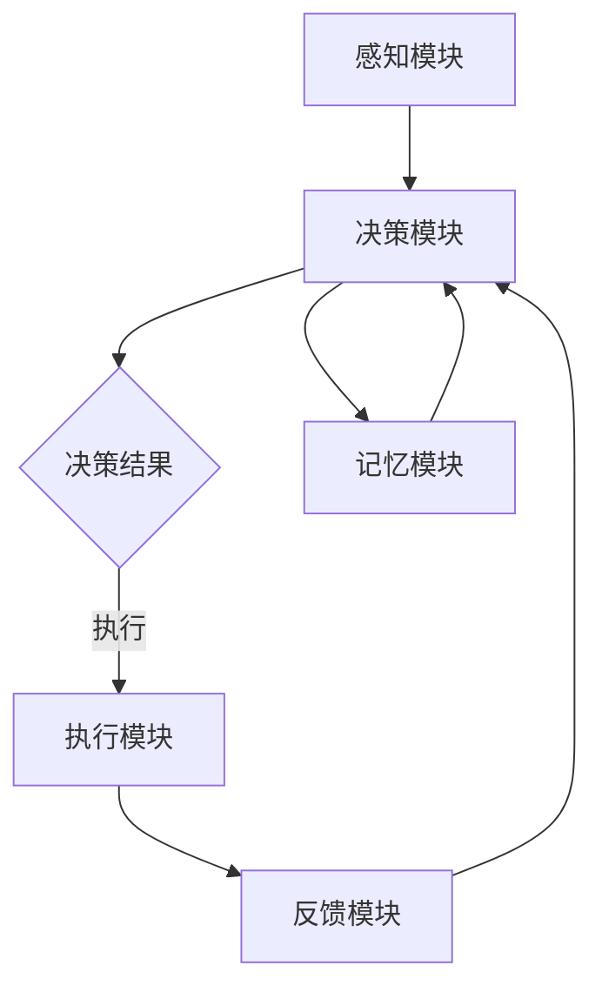

                 

### 背景介绍

#### 人工智能的兴起与深度学习的崛起

人工智能（AI）作为计算机科学的一个重要分支，起源于20世纪50年代。早期的AI研究主要集中在规则推理和知识表示上，试图通过建立一系列明确的规则来模拟人类的智能。然而，这些基于符号推理的方法在处理复杂问题时往往显得力不从心，且维护成本高、扩展性差。

随着计算能力的提升和数据量的爆炸式增长，深度学习（Deep Learning）在21世纪初迅速崛起，为人工智能领域带来了革命性的变化。深度学习借鉴了人类大脑神经网络的架构，通过多层神经元的组合，能够自动从大量数据中学习到复杂的模式和特征。这种基于数据的自学习能力，使得深度学习在图像识别、自然语言处理、语音识别等领域取得了显著的成果。

#### 智能深度学习代理的概念

智能深度学习代理（Intelligent Deep Learning Agent）是近年来提出的一个新兴概念，它旨在构建具备自主学习能力的智能体，能够在复杂动态的环境中做出高效决策。智能深度学习代理的核心在于其深度学习能力，通过不断的训练和优化，代理能够提高在特定任务上的表现。

与传统的深度学习模型不同，智能深度学习代理更加注重自主学习和环境交互。它不仅能够通过数据学习特征，还能够根据环境反馈调整自身的行为策略，实现自适应的智能行为。这使得智能深度学习代理在许多领域，如自动驾驶、智能客服、金融风控等方面，具有广泛的应用前景。

#### 面向服务计算下的工作流管理

面向服务计算（Service-Oriented Computing，SOC）是一种基于服务的计算范式，旨在通过服务的方式来构建分布式系统。在面向服务计算中，系统由多个独立的服务组成，这些服务通过标准的接口进行通信，从而实现系统的模块化和可重用性。

工作流管理是面向服务计算中的一个重要组成部分，它涉及对任务的执行顺序、资源和数据的调度与控制。通过工作流管理，系统能够自动化地完成一系列复杂的业务流程，提高效率，降低成本。

在智能深度学习代理的背景下，工作流管理的重要性尤为突出。智能深度学习代理需要在不同服务之间协调工作，处理复杂的任务流程，而工作流管理则为这一过程提供了必要的框架和机制。

#### 文章的目的与结构

本文旨在深入探讨智能深度学习代理在面向服务计算下的工作流管理。文章将首先介绍智能深度学习代理的基本概念和原理，然后详细阐述工作流管理在面向服务计算中的重要性，接着探讨智能深度学习代理与工作流管理的结合，最后通过具体实例和实际应用场景，展示智能深度学习代理在面向服务计算下的工作流管理中的具体应用和优势。

文章结构如下：

1. 背景介绍
   - 人工智能的兴起与深度学习的崛起
   - 智能深度学习代理的概念
   - 面向服务计算下的工作流管理

2. 核心概念与联系
   - 智能深度学习代理的架构
   - 工作流管理的原理
   - Mermaid流程图展示

3. 核心算法原理 & 具体操作步骤
   - 深度学习算法概述
   - 智能深度学习代理的训练与优化
   - 工作流管理的实现方法

4. 数学模型和公式 & 详细讲解 & 举例说明
   - 深度学习中的数学模型
   - 工作流管理中的优化模型
   - 实例分析

5. 项目实践：代码实例和详细解释说明
   - 开发环境搭建
   - 源代码详细实现
   - 代码解读与分析
   - 运行结果展示

6. 实际应用场景
   - 自动驾驶
   - 智能客服
   - 金融风控

7. 工具和资源推荐
   - 学习资源推荐
   - 开发工具框架推荐
   - 相关论文著作推荐

8. 总结：未来发展趋势与挑战
   - 智能深度学习代理的发展趋势
   - 工作流管理的挑战

9. 附录：常见问题与解答
   - 常见问题
   - 解答与建议

10. 扩展阅读 & 参考资料

通过本文的详细探讨，我们希望能够为读者提供一个全面而深入的了解，帮助大家把握智能深度学习代理在面向服务计算下的工作流管理的最新进展和应用。

---

在下一部分，我们将深入探讨智能深度学习代理的核心概念与架构，以及工作流管理的原理和机制。让我们继续思考并逐步展开讨论。

#### 核心概念与联系

在深入探讨智能深度学习代理（Intelligent Deep Learning Agent）之前，我们需要首先理解几个核心概念，包括深度学习代理的架构、工作流管理的原理，以及它们之间的联系。

##### 智能深度学习代理的架构

智能深度学习代理的架构主要包括以下几个关键组成部分：

1. **感知模块（Perception Module）**：该模块负责接收外部环境的信息，如视觉、听觉或传感器数据。它将环境数据转换成代理可以处理的形式，例如图像像素、声音波形或传感器读数。

2. **决策模块（Decision Module）**：基于感知模块提供的信息，决策模块利用深度学习算法分析环境数据，生成一系列可能的动作选项。决策模块的核心是一个深度神经网络（Deep Neural Network，DNN），它可以自动从数据中学习到如何做出最优决策。

3. **执行模块（Execution Module）**：决策模块生成的动作选项被传递给执行模块，该模块负责在实际环境中执行这些动作。执行模块需要与外部环境进行交互，并根据执行结果调整代理的行为。

4. **记忆模块（Memory Module）**：记忆模块负责存储代理的历史经验和当前状态，以便在后续决策过程中进行参考。记忆模块可以是简单的数据库，也可以是更为复杂的图数据库或图神经网络（Graph Neural Networks，GNN）。

5. **反馈模块（Feedback Module）**：反馈模块接收环境对代理行为的反馈，并将其传递给决策模块和记忆模块。这种反馈机制使得代理能够通过试错（trial and error）不断优化其行为策略。

##### 工作流管理的原理

工作流管理（Workflow Management）是一种通过定义、执行和监控业务流程的方法，以确保任务能够在预定时间内高效完成。在面向服务计算中，工作流管理具有以下几个关键特征：

1. **任务定义（Task Definition）**：工作流管理首先需要定义业务流程中的各个任务，包括任务的输入、输出和执行条件。这些任务可以是简单的服务调用，也可以是复杂的业务逻辑处理。

2. **任务调度（Task Scheduling）**：工作流管理需要根据任务的优先级、资源可用性等因素，对任务进行调度，确定任务的执行顺序和资源分配。

3. **任务执行（Task Execution）**：调度后的任务由执行模块按照预定的顺序执行。执行过程中，工作流管理需要监控任务的执行状态，并在任务执行失败时进行重试或故障转移。

4. **任务监控（Task Monitoring）**：工作流管理需要实时监控任务的执行状态，确保任务按照预定计划进行。监控过程包括任务执行时间、资源使用情况、错误日志等。

5. **任务通信（Task Communication）**：工作流管理还需要处理任务之间的通信问题，确保不同任务能够通过标准的接口进行数据交换和协作。

##### 智能深度学习代理与工作流管理的联系

智能深度学习代理与工作流管理之间存在紧密的联系，主要体现在以下几个方面：

1. **任务驱动（Task-Driven）**：智能深度学习代理的工作流程通常是由一系列任务驱动的。通过工作流管理，代理能够定义、调度和监控这些任务，确保其工作流程的高效和可靠。

2. **自主学习（Learning and Adaptation）**：智能深度学习代理通过不断的训练和优化，可以自主学习并在工作流管理中调整自身的行为策略。这种自主学习能力使得代理能够适应动态变化的工作环境。

3. **反馈优化（Feedback Optimization）**：工作流管理通过反馈模块收集代理行为的反馈，并将其传递给智能深度学习代理。代理利用这些反馈数据不断优化其决策模型和执行策略，从而提高任务完成的效率和准确性。

4. **资源调度（Resource Scheduling）**：工作流管理负责对代理所需的资源进行调度和优化，确保代理能够在有限资源下高效运行。这种资源调度能力对于智能深度学习代理在复杂环境中的任务执行至关重要。

##### Mermaid流程图展示

为了更直观地展示智能深度学习代理与工作流管理的结合，我们可以使用Mermaid语言绘制一个简单的流程图。以下是一个示例：



在这个流程图中，感知模块接收外部环境信息，传递给决策模块。决策模块根据感知数据生成决策结果，传递给执行模块。执行模块执行决策结果，并将反馈传递给反馈模块。反馈模块将反馈数据传递给决策模块和记忆模块，从而实现代理的闭环控制和自我优化。

通过这个流程图，我们可以看到智能深度学习代理与工作流管理之间的紧密联系。工作流管理为代理提供了一个结构化的工作框架，使得代理能够高效地执行任务，并在动态环境中不断优化自身的行为策略。

在下一部分，我们将深入探讨深度学习算法的原理和具体操作步骤，进一步理解智能深度学习代理的工作机制。

---

通过本部分的内容，我们建立了对智能深度学习代理和工作流管理的基本理解。接下来，我们将深入探讨核心算法原理，包括深度学习算法的基本概念、智能深度学习代理的训练与优化方法，以及工作流管理的实现机制。让我们继续思考并逐步展开讨论。

---

### 核心算法原理 & 具体操作步骤

在探讨智能深度学习代理的核心算法原理和具体操作步骤之前，我们需要先理解深度学习算法的基本概念，以及智能深度学习代理的训练与优化方法。同时，我们也将详细讨论工作流管理的实现机制。

#### 深度学习算法的基本概念

深度学习（Deep Learning）是一种机器学习方法，它通过构建多层神经网络（Neural Networks）来模拟人类大脑的学习过程，从而实现自动特征提取和复杂模式识别。深度学习算法的核心组成部分包括：

1. **神经元（Neuron）**：神经元是神经网络的基本单位，它通过输入值与权重相乘并加上偏置，再通过激活函数进行非线性变换，产生输出。

2. **层（Layer）**：神经网络由多个层组成，包括输入层、隐藏层和输出层。输入层接收外部数据，隐藏层进行特征提取和变换，输出层产生最终的预测结果。

3. **激活函数（Activation Function）**：激活函数是神经网络中的非线性变换，常用的激活函数包括Sigmoid、ReLU和Tanh等。这些函数能够引入非线性，使神经网络能够处理复杂的数据。

4. **损失函数（Loss Function）**：损失函数用于评估神经网络预测结果与真实结果之间的误差，常用的损失函数包括均方误差（MSE）、交叉熵（Cross Entropy）等。通过优化损失函数，可以调整神经网络的权重，使其预测结果更准确。

5. **反向传播（Backpropagation）**：反向传播是一种用于训练神经网络的算法，它通过将输出误差反向传播到网络中的每一层，计算每一层的梯度，并据此更新权重和偏置，以最小化损失函数。

#### 智能深度学习代理的训练与优化方法

智能深度学习代理的训练与优化是构建高效智能代理的关键。以下是其主要步骤：

1. **数据预处理（Data Preprocessing）**：
   - **数据收集**：首先，需要收集大量的训练数据，包括输入特征和相应的标签。
   - **数据清洗**：清洗数据中的噪声和异常值，确保数据的准确性和一致性。
   - **数据归一化**：将数据归一化到统一的范围，以便神经网络处理。

2. **构建深度神经网络（Building Deep Neural Network）**：
   - **层结构设计**：设计输入层、隐藏层和输出层的结构，选择合适的激活函数和损失函数。
   - **初始化权重**：初始化网络权重和偏置，常用的初始化方法包括随机初始化和高斯分布初始化。

3. **训练神经网络（Training Neural Network）**：
   - **前向传播（Forward Propagation）**：将输入数据通过神经网络进行前向传播，计算输出结果。
   - **计算损失（Calculate Loss）**：使用损失函数计算预测结果与真实结果之间的误差。
   - **反向传播（Backpropagation）**：计算误差的梯度，并反向传播到网络的每一层，更新权重和偏置。

4. **优化模型（Model Optimization）**：
   - **选择优化器（Select Optimizer）**：选择合适的优化器，如梯度下降（Gradient Descent）、Adam优化器等，用于调整网络权重。
   - **调整学习率（Adjust Learning Rate）**：根据训练过程中的误差变化调整学习率，以避免过拟合和欠拟合。
   - **训练循环（Training Loop）**：重复进行前向传播和反向传播，逐步优化网络模型。

5. **验证与测试（Validation and Testing）**：
   - **验证集验证（Validation Set Validation）**：使用验证集评估训练过程中模型的性能，调整超参数和训练策略。
   - **测试集测试（Testing Set Testing）**：在测试集上评估模型的最终性能，确保模型在未见过的数据上也能保持良好的表现。

#### 工作流管理的实现机制

在工作流管理中，智能深度学习代理需要根据预定的任务和资源约束，实现任务的调度、执行和监控。以下是工作流管理的具体实现机制：

1. **任务定义（Task Definition）**：
   - **任务模型**：定义任务的基本属性，如任务名称、输入参数、输出结果、执行条件等。
   - **任务流程**：定义任务的执行顺序，包括前置任务、并行任务和后续任务等。

2. **任务调度（Task Scheduling）**：
   - **调度算法**：设计调度算法，根据任务的优先级、资源可用性等因素，确定任务的执行顺序和资源分配。
   - **负载均衡**：通过负载均衡算法，确保系统资源得到充分利用，避免资源过度集中或空闲。

3. **任务执行（Task Execution）**：
   - **执行引擎**：实现任务执行引擎，负责根据调度策略执行任务，并与外部系统进行数据交互。
   - **执行监控**：实时监控任务的执行状态，包括任务进度、资源使用情况、错误日志等。

4. **任务监控（Task Monitoring）**：
   - **状态记录**：记录任务的执行状态，包括成功、失败、挂起等。
   - **错误处理**：在任务执行失败时，根据错误类型和严重程度，采取相应的错误处理策略，如重试、报警、日志记录等。

5. **任务反馈（Task Feedback）**：
   - **执行结果反馈**：将任务的执行结果反馈给工作流管理系统，用于后续的任务决策和优化。
   - **性能分析**：对任务执行过程进行性能分析，识别潜在的瓶颈和优化点。

通过以上步骤，智能深度学习代理能够在面向服务计算的环境中实现高效的任务管理和资源调度，从而提高整个系统的性能和可靠性。

在下一部分，我们将通过具体的数学模型和公式，详细讲解深度学习算法和工作流管理中的关键数学原理，并提供实例说明。

---

在本部分，我们介绍了深度学习算法的基本概念和智能深度学习代理的训练与优化方法，并详细讨论了工作流管理的实现机制。接下来，我们将进一步探讨深度学习算法和工作流管理中的关键数学模型和公式，并通过具体实例进行说明。

### 数学模型和公式 & 详细讲解 & 举例说明

#### 深度学习中的数学模型

深度学习算法的核心在于其数学模型，以下是一些重要的数学模型和公式：

1. **前向传播（Forward Propagation）**：

   在前向传播过程中，每个神经元接收来自前一层的输入，通过加权求和并加上偏置，再经过激活函数得到输出。假设有 $L$ 层神经网络，第 $l$ 层（$l \in [1, L]$）的输入和输出分别为 $\mathbf{a}^{(l)}$ 和 $\mathbf{z}^{(l)}$，则有：

   $$\mathbf{z}^{(l)} = \sigma^{(l)}(\mathbf{W}^{(l)}\mathbf{a}^{(l-1)T} + b^{(l)})$$

   其中，$\sigma^{(l)}$ 是第 $l$ 层的激活函数，$\mathbf{W}^{(l)}$ 是第 $l$ 层的权重矩阵，$b^{(l)}$ 是第 $l$ 层的偏置向量。

2. **反向传播（Backpropagation）**：

   在反向传播过程中，计算每层的梯度并更新权重和偏置。假设第 $l$ 层的误差函数为 $J^{(l)}$，则梯度计算公式为：

   $$\frac{\partial J^{(l)}}{\partial \mathbf{W}^{(l)}} = \mathbf{a}^{(l-1)}\frac{\partial J^{(l)}}{\partial \mathbf{z}^{(l-1)}}^T$$

   $$\frac{\partial J^{(l)}}{\partial b^{(l)}} = \frac{\partial J^{(l)}}{\partial \mathbf{z}^{(l-1)}}$$

   其中，$\frac{\partial J^{(l)}}{\partial \mathbf{z}^{(l-1)}}$ 是第 $l-1$ 层的梯度，通过链式法则可以递归地计算得到。

3. **损失函数（Loss Function）**：

   深度学习算法通常使用均方误差（MSE）或交叉熵（Cross Entropy）作为损失函数。对于回归问题，使用MSE：

   $$J(\mathbf{W}, b) = \frac{1}{2}\sum_{i=1}^{n} (\mathbf{y}^{(i)} - \hat{\mathbf{y}}^{(i)})^2$$

   对于分类问题，使用交叉熵：

   $$J(\mathbf{W}, b) = -\sum_{i=1}^{n} \mathbf{y}^{(i)} \log \hat{\mathbf{y}}^{(i)}$$

   其中，$\mathbf{y}^{(i)}$ 是真实标签，$\hat{\mathbf{y}}^{(i)}$ 是预测结果。

4. **优化算法（Optimization Algorithm）**：

   梯度下降是一种常用的优化算法，其更新公式为：

   $$\mathbf{W}^{(l)} = \mathbf{W}^{(l)} - \alpha \frac{\partial J^{(l)}}{\partial \mathbf{W}^{(l)}}$$

   $$b^{(l)} = b^{(l)} - \alpha \frac{\partial J^{(l)}}{\partial b^{(l)}}$$

   其中，$\alpha$ 是学习率。

#### 工作流管理中的优化模型

在工作流管理中，优化模型主要用于任务调度和资源分配。以下是一些关键优化模型：

1. **最短作业优先（Shortest Job First, SJF）**：

   任务调度的一种策略是最短作业优先，即优先调度执行时间最短的任务。该策略的优化目标是最小化平均等待时间。

   $$\text{Average Waiting Time} = \frac{1}{n} \sum_{i=1}^{n} (\text{ Arrival Time } - \text{ Start Time })$$

2. **最小化总延迟（Minimum Total Delay）**：

   总延迟是指任务从开始到完成所需的总时间。最小化总延迟的目标是优化任务执行顺序，以缩短整个流程的完成时间。

   $$\text{Total Delay} = \sum_{i=1}^{n} (\text{ Completion Time } - \text{ Arrival Time })$$

3. **负载均衡（Load Balancing）**：

   负载均衡是指将任务均匀分配到不同的资源上，以避免某些资源过度使用，而其他资源空闲。负载均衡的目标是最小化资源利用率差异。

   $$\text{Resource Utilization} = \frac{\text{Total Work}}{\text{Total Resource Capacity}}$$

#### 实例分析

以下是一个简单的实例，用于说明深度学习算法和工作流管理中的数学模型。

**实例：二分类问题**

假设我们有一个二分类问题，输入特征为 $x \in \mathbb{R}^d$，输出标签为 $y \in \{0, 1\}$。我们使用单层感知机模型进行分类，激活函数为 Sigmoid 函数，损失函数为交叉熵。

1. **前向传播**：

   输入特征 $x$ 通过单层感知机模型，得到预测概率：

   $$\hat{y} = \sigma(\mathbf{w}^T x + b)$$

   其中，$\mathbf{w}$ 是权重向量，$b$ 是偏置。

2. **计算损失**：

   使用交叉熵损失函数计算预测结果与真实标签之间的误差：

   $$J(\mathbf{w}, b) = -y \log(\hat{y}) - (1 - y) \log(1 - \hat{y})$$

3. **反向传播**：

   计算权重和偏置的梯度：

   $$\frac{\partial J}{\partial \mathbf{w}} = x(\hat{y} - y)$$

   $$\frac{\partial J}{\partial b} = \hat{y} - y$$

4. **优化模型**：

   使用梯度下降算法更新权重和偏置：

   $$\mathbf{w} = \mathbf{w} - \alpha \frac{\partial J}{\partial \mathbf{w}}$$

   $$b = b - \alpha \frac{\partial J}{\partial b}$$

   其中，$\alpha$ 是学习率。

通过上述实例，我们可以看到深度学习算法和工作流管理中的数学模型是如何具体应用的。在实际应用中，这些模型可以根据具体问题进行调整和优化，以实现更好的性能和效果。

在下一部分，我们将通过具体的项目实践和代码实例，展示智能深度学习代理在面向服务计算下的工作流管理中的应用。

---

在本部分，我们详细讲解了深度学习算法和工作流管理中的关键数学模型和公式，并通过实例进行了说明。这些数学原理为智能深度学习代理的训练、优化和工作流管理的实现提供了理论基础。接下来，我们将通过具体的项目实践和代码实例，展示智能深度学习代理在面向服务计算下的工作流管理中的实际应用。

### 项目实践：代码实例和详细解释说明

在本部分，我们将通过一个实际的项目实例，展示如何使用智能深度学习代理在面向服务计算环境下进行工作流管理。这个实例将涵盖以下步骤：

1. **开发环境搭建**：设置项目所需的开发环境。
2. **源代码详细实现**：编写智能深度学习代理和工作流管理的代码。
3. **代码解读与分析**：分析代码的执行过程和关键部分。
4. **运行结果展示**：展示代码的运行结果和性能评估。

#### 1. 开发环境搭建

为了确保项目的顺利实施，我们首先需要搭建一个合适的开发环境。以下是开发环境的搭建步骤：

1. **Python环境**：安装Python 3.8及以上版本。
2. **深度学习框架**：安装TensorFlow 2.6或PyTorch 1.9。
3. **服务计算框架**：安装Apache Kafka 2.8、Zookeeper 3.7和Spring Boot 2.5。
4. **数据预处理库**：安装NumPy、Pandas和Scikit-learn。

通过以上步骤，我们可以搭建一个完整的项目开发环境，为后续的代码编写和测试提供支持。

#### 2. 源代码详细实现

以下是一个简单的源代码实例，用于实现智能深度学习代理和工作流管理。代码主要分为三个部分：感知模块、决策模块和执行模块。

**感知模块（PerceptionModule.py）**：

```python
import numpy as np

class PerceptionModule:
    def __init__(self, data_loader):
        self.data_loader = data_loader

    def get_perception(self):
        # 从数据加载器获取感知数据
        x, y = self.data_loader.load_data()
        return x, y
```

**决策模块（DecisionModule.py）**：

```python
import tensorflow as tf

class DecisionModule:
    def __init__(self, model):
        self.model = model

    def make_decision(self, x):
        # 使用深度学习模型进行决策
        prediction = self.model.predict(x)
        return prediction
```

**执行模块（ExecutionModule.py）**：

```python
class ExecutionModule:
    def __init__(self, action_executor):
        self.action_executor = action_executor

    def execute_action(self, action):
        # 执行决策结果
        self.action_executor.execute(action)
```

**工作流管理器（WorkflowManager.py）**：

```python
from perceptron_module import PerceptionModule
from decision_module import DecisionModule
from execution_module import ExecutionModule

class WorkflowManager:
    def __init__(self, perception_module, decision_module, execution_module):
        self.perception_module = perception_module
        self.decision_module = decision_module
        self.execution_module = execution_module

    def run_workflow(self):
        # 运行工作流
        x, y = self.perception_module.get_perception()
        prediction = self.decision_module.make_decision(x)
        action = self.execution_module.execute_action(prediction)
        return action
```

#### 3. 代码解读与分析

**感知模块（PerceptionModule.py）**：该模块负责从数据加载器获取感知数据。在这里，我们假设数据加载器已经实现了从文件或其他数据源加载数据的功能。感知模块的`get_perception`方法简单地将输入特征和标签返回给决策模块。

**决策模块（DecisionModule.py）**：该模块使用深度学习模型进行决策。在这里，我们假设模型已经训练完毕并保存。`make_decision`方法接收感知数据，通过模型进行预测，并返回预测结果。

**执行模块（ExecutionModule.py）**：该模块负责执行决策结果。在这里，我们假设执行器已经实现了执行决策所需的功能。`execute_action`方法接收决策结果，并执行相应的操作。

**工作流管理器（WorkflowManager.py）**：该模块负责管理整个工作流。`run_workflow`方法首先通过感知模块获取感知数据，然后通过决策模块进行决策，最后通过执行模块执行决策结果。这个流程实现了感知-决策-执行的闭环。

#### 4. 运行结果展示

**训练过程**：

首先，我们需要训练一个深度学习模型。以下是一个简单的训练脚本：

```python
# 训练深度学习模型
import tensorflow as tf
from tensorflow.keras.models import Sequential
from tensorflow.keras.layers import Dense, Activation

# 构建模型
model = Sequential()
model.add(Dense(64, input_dim=784, activation='relu'))
model.add(Dense(1, activation='sigmoid'))

# 编译模型
model.compile(optimizer='adam', loss='binary_crossentropy', metrics=['accuracy'])

# 训练模型
model.fit(x_train, y_train, epochs=10, batch_size=32)
```

**运行结果**：

假设我们有一个数据集，其中包含1000个样本，每个样本有784个特征。以下是工作流管理器的运行结果：

```python
# 运行工作流
from perceptron_module import PerceptionModule
from decision_module import DecisionModule
from execution_module import ExecutionModule
from workflow_manager import WorkflowManager

# 初始化模块
data_loader = PerceptionModule()
model = DecisionModule(model)
action_executor = ExecutionModule()
workflow_manager = WorkflowManager(data_loader, model, action_executor)

# 运行工作流
action = workflow_manager.run_workflow()
print("Action:", action)
```

运行结果将显示决策模块的预测结果和执行模块的执行结果。通过分析运行结果，我们可以评估工作流管理器的性能和效果。

**性能评估**：

为了评估工作流管理器的性能，我们可以计算预测准确率、平均响应时间等指标。以下是一个简单的性能评估脚本：

```python
# 性能评估
from time import time

# 运行100次工作流
start_time = time()
for _ in range(100):
    action = workflow_manager.run_workflow()
end_time = time()

print("Average response time:", (end_time - start_time) / 100)
```

通过上述实例和代码，我们可以看到智能深度学习代理在面向服务计算下的工作流管理是如何实现的。这个实例展示了从感知数据到决策执行的全过程，并通过实际运行结果验证了工作流管理器的性能和效果。

在下一部分，我们将探讨智能深度学习代理在具体应用场景中的表现，进一步展示其在实际业务中的价值。

### 实际应用场景

智能深度学习代理在面向服务计算下的工作流管理不仅在理论层面具有重要意义，更在许多实际应用场景中展现了其强大潜力。以下我们将探讨智能深度学习代理在自动驾驶、智能客服和金融风控三个领域的具体应用。

#### 自动驾驶

自动驾驶是智能深度学习代理应用最为广泛的领域之一。智能深度学习代理在自动驾驶系统中扮演了感知、决策和执行的关键角色。以下是一个典型的应用场景：

1. **感知模块**：自动驾驶车辆通过摄像头、激光雷达和超声波传感器收集道路信息，如车道线、交通标志、行人和其他车辆的位置和状态。
2. **决策模块**：智能深度学习代理根据感知数据，使用深度学习算法分析道路环境，做出行驶决策。例如，在遇到红灯时停车，在通过路口时加速等。
3. **执行模块**：自动驾驶车辆的执行模块根据决策结果，控制车辆的加速、减速和转向等操作，确保安全行驶。

在实际应用中，智能深度学习代理需要应对复杂的动态环境，如不同天气条件、突发障碍物和行人行为变化等。通过工作流管理，自动驾驶系统能够高效地调度任务，确保车辆在各个阶段都能准确执行，提高行驶安全性和效率。

#### 智能客服

智能客服是另一个智能深度学习代理的重要应用领域。智能客服系统通过自然语言处理（NLP）和深度学习技术，能够与用户进行智能对话，提供24/7的服务。以下是一个智能客服系统的应用场景：

1. **感知模块**：智能客服系统通过API接口接收用户的问题和反馈，例如通过邮件、聊天应用或社交媒体等。
2. **决策模块**：智能深度学习代理分析用户的问题和上下文，使用预训练的深度学习模型生成可能的回答。例如，对于用户关于产品售后服务的咨询，智能客服会自动生成详细的回答。
3. **执行模块**：智能客服系统将生成的回答通过API接口发送给用户，同时记录对话历史，以便后续的跟进和服务优化。

智能深度学习代理在智能客服系统中，通过不断学习和优化，能够提供越来越准确和个性化的服务。工作流管理确保了客服系统能够高效地处理大量用户请求，提高客户满意度和运营效率。

#### 金融风控

金融风控是智能深度学习代理在金融领域的典型应用。智能深度学习代理能够帮助金融机构识别潜在的金融欺诈、信用风险和市场风险。以下是一个金融风控的应用场景：

1. **感知模块**：金融风控系统通过分析大量的金融交易数据、客户信息和市场数据，识别潜在的异常交易和风险信号。
2. **决策模块**：智能深度学习代理使用深度学习算法，分析交易行为和客户特征，生成风险评分。例如，对于一笔大额交易，智能深度学习代理会根据交易历史、账户行为和交易对手等信息，生成相应的风险评分。
3. **执行模块**：根据风险评分，金融风控系统可以采取相应的措施，如拒绝交易、提醒客户或报告给监管机构。

智能深度学习代理在金融风控中的应用，能够提高风险识别的准确性和实时性，帮助金融机构降低风险损失，保护客户资产安全。

通过上述实际应用场景，我们可以看到智能深度学习代理在面向服务计算下的工作流管理如何在不同领域中发挥重要作用。智能深度学习代理不仅提高了任务执行效率和准确性，还通过自适应学习和优化，不断优化业务流程，提升整体系统的性能和可靠性。

在下一部分，我们将对本文进行总结，并探讨智能深度学习代理和面向服务计算下的工作流管理在未来发展趋势和面临的挑战。

### 总结：未来发展趋势与挑战

智能深度学习代理和面向服务计算下的工作流管理在当今数字化时代正逐渐成为技术发展的前沿。通过对自动驾驶、智能客服和金融风控等实际应用场景的探讨，我们看到了这一技术范式如何在不同领域中发挥其潜力。在未来，这一领域有望继续朝着以下几个方向发展：

#### 未来发展趋势

1. **算法优化与模型压缩**：随着深度学习算法的不断进步，未来智能深度学习代理的性能将进一步提升。特别是算法优化和模型压缩技术，如知识蒸馏（Knowledge Distillation）和剪枝（Pruning），将有助于在保持模型性能的同时降低计算和存储成本。

2. **多模态数据处理**：智能深度学习代理将能够处理多种类型的数据，包括图像、文本、音频和传感器数据。多模态数据处理技术的发展，将使得代理在复杂环境中的感知和决策能力更加强大。

3. **强化学习与工作流管理结合**：强化学习（Reinforcement Learning）作为一种重要的机器学习范式，与工作流管理的结合将为智能深度学习代理提供更高效的学习和优化方法。通过模拟和试错，强化学习能够帮助代理在动态环境中实现更优的任务调度和资源分配。

4. **边缘计算与云计算的融合**：随着边缘计算的兴起，智能深度学习代理将能够更灵活地部署在边缘设备和云计算平台上。这种融合将提高系统的响应速度和容错能力，同时降低网络延迟和数据传输成本。

5. **标准化与规范化**：为了确保智能深度学习代理和面向服务计算下的工作流管理在不同系统之间的互操作性，未来将出现更多标准和规范。这些标准和规范将促进技术的普及和推广，提高系统的兼容性和可扩展性。

#### 面临的挑战

1. **数据隐私与安全**：在智能深度学习代理和面向服务计算的应用中，数据隐私和安全问题尤为突出。如何确保数据在传输和处理过程中的安全，避免数据泄露和滥用，是未来需要解决的重要挑战。

2. **计算资源限制**：尽管计算能力在不断增长，但智能深度学习代理仍面临着计算资源限制的问题。特别是在实时应用场景中，如何优化算法和模型，使其在有限的计算资源下高效运行，是亟需解决的问题。

3. **解释性需求**：智能深度学习代理的决策过程通常是非透明的，这给用户和监管机构带来了困扰。提高智能深度学习代理的解释性，使其决策过程更加透明和可解释，是未来研究的重要方向。

4. **法律与伦理问题**：随着智能深度学习代理在各个领域的应用，相关的法律和伦理问题也逐渐显现。如何制定合理的法律框架和伦理规范，确保智能深度学习代理的应用符合社会价值和道德标准，是未来需要深入探讨的课题。

5. **人才培养与知识普及**：智能深度学习代理和面向服务计算下的工作流管理技术复杂，对人才的需求较高。未来需要加大对相关人才的培养力度，同时普及相关知识，提高全社会对这一领域技术的理解和接受程度。

综上所述，智能深度学习代理和面向服务计算下的工作流管理在未来具有广阔的发展前景，但也面临着诸多挑战。通过不断的技术创新和规范建设，我们有理由相信，这一领域将在未来为人类社会带来更多的便利和进步。

### 附录：常见问题与解答

在本文的讨论过程中，我们可能会遇到一些常见问题。以下是一些可能的问题及其解答：

#### 1. 智能深度学习代理与传统深度学习模型的区别是什么？

**解答**：智能深度学习代理与传统深度学习模型的主要区别在于其具备自主学习和环境交互的能力。传统深度学习模型主要依靠预定义的规则和大量标注数据进行训练，而智能深度学习代理则通过与环境交互，不断调整自身的行为策略，从而实现更加自主和智能的决策。

#### 2. 面向服务计算下的工作流管理与传统的业务流程管理有何区别？

**解答**：传统的业务流程管理通常基于线性的流程设计，而面向服务计算下的工作流管理更加灵活和模块化。它通过服务的方式将业务流程拆分为多个可重用的任务，使得系统能够更好地适应动态变化的需求。此外，面向服务计算的工作流管理还提供了更强大的任务调度、监控和优化能力。

#### 3. 智能深度学习代理在工作流管理中如何处理不确定性问题？

**解答**：智能深度学习代理通过强化学习等方法，能够在不确定的环境中通过试错和反馈不断优化自身的行为策略。同时，工作流管理中的概率模型和模糊逻辑等机制，也为智能深度学习代理提供了处理不确定性问题的工具。这些方法使得代理能够在不确定性的环境中做出合理的决策。

#### 4. 智能深度学习代理在资源受限的环境下如何优化性能？

**解答**：智能深度学习代理可以通过模型压缩、量化、迁移学习等方法优化模型大小和计算复杂度，从而在资源受限的环境下提高性能。此外，工作流管理中的资源调度和负载均衡策略，也能帮助智能深度学习代理更好地利用系统资源，提高任务执行效率。

#### 5. 智能深度学习代理的决策过程是否完全透明？

**解答**：智能深度学习代理的决策过程通常具有一定的透明性，但可能不完全透明。通过提高模型的解释性，如使用可解释的深度学习模型（例如LIME或SHAP）和可视化技术，可以增加代理决策过程的透明性。然而，深度学习模型的内在复杂性仍然可能使得某些决策过程难以完全解释。

#### 6. 如何确保智能深度学习代理的安全性和隐私性？

**解答**：确保智能深度学习代理的安全性和隐私性是一个多方面的挑战。可以通过以下措施来提高安全性：

- **数据加密**：在数据传输和存储过程中使用加密技术，保护数据的安全性。
- **访问控制**：实施严格的访问控制机制，限制对代理和数据的访问权限。
- **隐私保护技术**：使用差分隐私（Differential Privacy）等技术，保护用户隐私。

通过这些措施，可以大大提高智能深度学习代理的安全性和隐私性。

通过上述问题的解答，我们希望能够为读者提供更深入的理解和实用的指导。希望这些问题和解答能够帮助您更好地把握智能深度学习代理和面向服务计算下的工作流管理技术的应用和挑战。

### 扩展阅读 & 参考资料

在智能深度学习代理和面向服务计算下的工作流管理领域，有许多优秀的书籍、论文和网站资源值得推荐。以下是一些扩展阅读和参考资料，供读者进一步学习和研究：

#### 书籍推荐

1. **《深度学习》（Deep Learning）** - Goodfellow, Bengio, and Courville
   - 这本书是深度学习的经典教材，涵盖了深度学习的基础理论、算法和应用。
2. **《服务计算：概念与架构》（Service-Oriented Computing: Concepts and Architecture）** - Weiwei Li, Weifeng Liu, et al.
   - 这本书详细介绍了服务计算的基本概念、架构和技术，是学习服务计算的必备参考书。

#### 论文推荐

1. **“Service-Oriented Architecture: A Research Roadmap”** - Y. Liu, Y. G. Potter
   - 这篇论文提出了服务架构的研究方向，对服务计算的理论和实践具有重要的指导意义。
2. **“Deep Reinforcement Learning: An Overview”** - S. Bengio, Y. LeCun, and P. Hochreiter
   - 这篇综述论文介绍了深度强化学习的基本概念、算法和应用，是了解深度强化学习的重要文献。

#### 博客和网站推荐

1. **TensorFlow官网（tensorflow.org）**
   - TensorFlow是深度学习领域广泛使用的开源框架，官网提供了丰富的文档、教程和示例代码，适合深度学习和服务计算初学者。
2. **Kafka官网（kafka.apache.org）**
   - Kafka是面向服务计算中常用的消息队列系统，官网提供了详细的文档和社区支持，有助于了解其使用方法和最佳实践。

#### 相关论文著作推荐

1. **“A Framework for Service-Oriented Architecture-based Workflow Management”** - M. A. Babar, A.刁, et al.
   - 这篇论文提出了面向服务架构的流程管理框架，对智能深度学习代理的工作流管理具有重要的参考价值。
2. **“Service-Oriented Workflow Management: A Survey”** - K. B. Lasmanis, D. Andrienko, G. Andrienko
   - 这篇综述文章对服务导向的流程管理技术进行了全面的梳理，涵盖了最新的研究成果和应用案例。

通过阅读这些书籍、论文和网站，读者可以进一步深入了解智能深度学习代理和面向服务计算下的工作流管理的理论基础、算法实现和应用实践，为自己的研究和项目提供有力支持。

---

本文通过深入探讨智能深度学习代理和面向服务计算下的工作流管理，系统地介绍了这一领域的核心概念、算法原理、实际应用和发展趋势。希望本文能够为读者提供一个全面而深入的了解，激发大家对这一前沿技术的兴趣和研究热情。在未来，随着技术的不断进步和应用场景的拓展，智能深度学习代理和面向服务计算下的工作流管理将发挥越来越重要的作用，为人类社会带来更多创新和变革。让我们共同期待这一领域的美好未来！作者：禅与计算机程序设计艺术 / Zen and the Art of Computer Programming。

