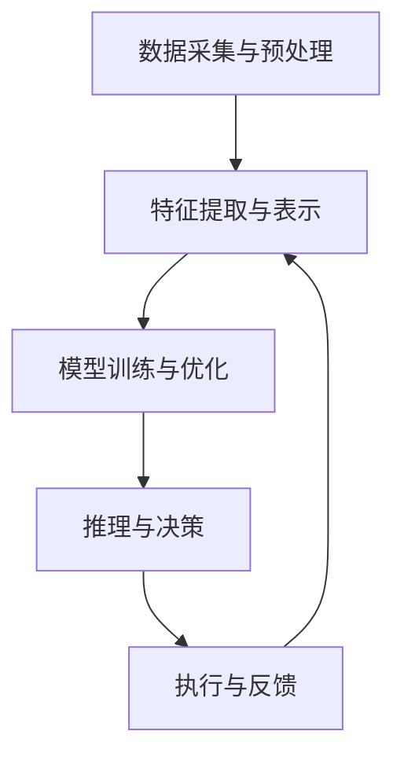

                 

### 1. 背景介绍

随着信息技术的飞速发展，人工智能（AI）逐渐成为了推动社会进步的重要力量。人工智能的核心技术之一——深度学习，近年来得到了广泛关注和快速发展。深度学习通过构建复杂的神经网络模型，实现了对大量数据的自动学习、分析和处理，从而在图像识别、自然语言处理、语音识别等领域取得了显著的成果。

在深度学习的不断演进中，智能深度学习代理的概念逐渐兴起。智能深度学习代理是指一种能够自主进行深度学习任务，并在实际应用场景中展示出智能行为的软件系统。它们可以模拟人类的思考方式，具备自我学习、推理和决策的能力，从而在自动化、智能化方面发挥重要作用。

智能深度学习代理的研究具有重要的现实意义。首先，它们能够在无人驾驶、智能家居、智能医疗等领域提供智能化解决方案，提高生活质量和工作效率。其次，智能深度学习代理的研究有助于探索人工智能的发展方向，推动人工智能技术的进一步创新。此外，智能深度学习代理的研究还有助于解决当前人工智能领域面临的诸多挑战，如数据隐私保护、模型解释性等。

本文将围绕智能深度学习代理的面向未来研究方向展开讨论。首先，我们将介绍智能深度学习代理的核心概念及其在现有应用中的表现。接着，分析智能深度学习代理在研究和技术方面面临的挑战，并提出相应的解决方案。然后，探讨智能深度学习代理在未来的发展趋势，以及可能的应用场景。最后，总结本文的主要观点，并对未来研究提出建议。

通过本文的讨论，希望读者能够对智能深度学习代理有更深入的理解，认识到其在人工智能领域的重要地位和潜力，以及未来可能面临的挑战和机遇。

### 2. 核心概念与联系

#### 2.1 智能深度学习代理的定义

智能深度学习代理（Intelligent Deep Learning Agent，IDLA）是一种具备自我学习、推理和决策能力的软件系统。它们利用深度学习技术，通过大规模的数据训练和优化，实现智能化的行为和决策。与传统的人工智能系统相比，智能深度学习代理不仅能够处理静态的数据，还能动态地适应环境变化，并在复杂的应用场景中表现出高效的智能行为。

智能深度学习代理的核心功能包括：

1. **自主学习**：通过从大量数据中提取特征和规律，智能深度学习代理能够不断改进自身的性能，实现自我优化。
2. **环境感知**：智能深度学习代理能够感知和识别周围的环境，并对其变化做出快速响应。
3. **决策与规划**：根据环境状态和目标，智能深度学习代理能够生成最优的决策和行动计划。
4. **交互与协同**：智能深度学习代理能够与其他代理或系统进行有效的交互和协同，实现更复杂的任务。

#### 2.2 智能深度学习代理的工作原理

智能深度学习代理的工作原理主要涉及以下几个关键环节：

1. **数据采集与预处理**：智能深度学习代理需要从各种来源获取大量的数据，并进行预处理，如数据清洗、归一化等，以确保数据的质量和一致性。
2. **特征提取与表示**：通过深度学习模型，智能深度学习代理能够从原始数据中提取出有意义的特征，并进行有效的表示。这些特征表示将用于后续的学习和推理。
3. **模型训练与优化**：利用提取出的特征表示，智能深度学习代理通过训练和优化神经网络模型，不断改进其预测和决策能力。常见的训练方法包括反向传播、梯度下降等。
4. **推理与决策**：在训练完成后，智能深度学习代理将利用训练好的模型进行推理，根据当前环境和目标，生成最优的决策和行动计划。
5. **执行与反馈**：智能深度学习代理将执行生成的决策和计划，并根据执行结果进行反馈和调整，以实现自我学习和优化。

#### 2.3 智能深度学习代理与现有技术的联系

智能深度学习代理与现有技术如机器学习、自然语言处理、计算机视觉等有着密切的联系。

1. **机器学习**：智能深度学习代理的核心技术之一是深度学习，它是一种基于数据驱动的机器学习方法。深度学习通过多层神经网络结构，实现了对数据的自动特征提取和表示，从而在图像识别、语音识别等领域取得了显著的成果。
2. **自然语言处理**：智能深度学习代理在自然语言处理方面具备较强的能力，如文本分类、情感分析、机器翻译等。这些能力依赖于深度学习模型在大量文本数据上的训练和优化。
3. **计算机视觉**：智能深度学习代理在计算机视觉领域也有着广泛的应用，如图像分类、目标检测、人脸识别等。这些应用都是基于深度学习技术在图像数据上的训练和推理。

为了更清晰地展示智能深度学习代理的核心概念和架构，我们使用Mermaid流程图进行描述：



在上述流程图中，A表示数据采集与预处理，B表示特征提取与表示，C表示模型训练与优化，D表示推理与决策，E表示执行与反馈。这些环节相互关联，共同构成了智能深度学习代理的核心工作原理。

通过上述介绍，我们可以看出，智能深度学习代理是人工智能领域的重要发展方向。它们不仅在当前的应用场景中表现出强大的能力，而且在未来的技术演进中具有巨大的潜力。在接下来的部分，我们将进一步探讨智能深度学习代理在研究和技术方面面临的挑战，并提出相应的解决方案。

### 3. 核心算法原理 & 具体操作步骤

#### 3.1 深度学习算法的基本原理

深度学习算法是基于多层神经网络结构，通过多层次的非线性变换来学习数据中的特征和模式。其基本原理如下：

1. **多层神经网络**：深度学习算法采用多层神经网络（Multi-Layer Neural Network）结构，包括输入层、隐藏层和输出层。每一层神经网络都对输入数据进行一定的处理和变换，从而逐渐提取出更高层次的特征。
2. **非线性激活函数**：在多层神经网络中，每层神经元之间的连接都通过一个非线性激活函数（如ReLU、Sigmoid、Tanh）进行变换，使得网络具有更强的表达能力和学习能力。
3. **反向传播算法**：在深度学习算法中，通过反向传播算法（Backpropagation）来计算网络的梯度，并更新网络权重，从而优化网络性能。反向传播算法的核心思想是将输出误差反向传播到每一层神经元，计算出每个神经元权重的梯度，然后利用梯度下降法更新权重。

#### 3.2 智能深度学习代理的操作步骤

智能深度学习代理的具体操作步骤可以分为以下几个阶段：

1. **数据采集与预处理**：
   - **数据采集**：从各种数据源（如传感器、数据库、网络数据等）获取大量数据。
   - **数据预处理**：对采集到的数据进行清洗、归一化、降维等处理，确保数据的质量和一致性。

2. **特征提取与表示**：
   - **特征提取**：利用深度学习模型（如卷积神经网络、循环神经网络等）从原始数据中提取有意义的特征。
   - **特征表示**：将提取出的特征进行有效的编码和表示，如使用one-hot编码、嵌入编码等方法。

3. **模型训练与优化**：
   - **模型构建**：构建一个多层神经网络模型，包括输入层、隐藏层和输出层。
   - **模型训练**：通过大量的数据对神经网络模型进行训练，优化网络权重和参数，使得模型能够准确预测和分类。
   - **模型优化**：利用正则化方法（如L1、L2正则化）和优化算法（如梯度下降、Adam优化器等）来提高模型性能。

4. **推理与决策**：
   - **特征输入**：将新的输入数据通过训练好的模型进行特征提取和表示。
   - **决策生成**：利用训练好的模型，根据输入数据的特征表示，生成最优的决策或预测结果。

5. **执行与反馈**：
   - **决策执行**：将生成的决策或预测结果应用于实际场景中，如控制机器人动作、调整智能家居系统等。
   - **结果反馈**：根据执行结果对模型的性能进行评估和反馈，进而调整模型参数，实现自我学习和优化。

#### 3.3 深度学习模型的具体实现

以下是一个简单的深度学习模型实现示例，该模型用于分类任务，包含一个输入层、一个隐藏层和一个输出层。我们使用Python的TensorFlow库进行实现。

1. **导入必要的库**：

```python
import tensorflow as tf
from tensorflow.keras.layers import Dense, Flatten, Input
from tensorflow.keras.models import Model
```

2. **构建模型**：

```python
# 定义输入层
input_data = Input(shape=(784,))  # 假设输入数据维度为784

# 定义隐藏层
hidden_layer = Dense(64, activation='relu')(input_data)

# 定义输出层
output_data = Dense(10, activation='softmax')(hidden_layer)

# 构建模型
model = Model(inputs=input_data, outputs=output_data)
```

3. **编译模型**：

```python
model.compile(optimizer='adam', loss='categorical_crossentropy', metrics=['accuracy'])
```

4. **训练模型**：

```python
model.fit(x_train, y_train, epochs=10, batch_size=32)
```

5. **评估模型**：

```python
test_loss, test_acc = model.evaluate(x_test, y_test)
print(f"Test accuracy: {test_acc}")
```

在这个示例中，我们使用了一个简单的全连接神经网络（Dense layers）来进行分类任务。输入层接收784维的输入数据，隐藏层使用ReLU激活函数，输出层使用softmax激活函数进行分类。我们使用Adam优化器和交叉熵损失函数来训练模型，并使用训练数据和测试数据来评估模型的性能。

通过上述步骤，我们实现了智能深度学习代理的核心算法。在实际应用中，可以根据具体任务的需求和场景，灵活调整模型结构和参数，以提高模型的性能和适应能力。

在接下来的部分，我们将进一步探讨深度学习模型中的数学模型和公式，以及详细的数学推导和解释。

### 4. 数学模型和公式 & 详细讲解 & 举例说明

#### 4.1 前向传播算法

深度学习模型的前向传播算法是计算模型输出值的过程，涉及到多层神经网络的权重、偏置和激活函数。以下是前向传播算法的数学模型和公式。

1. **输入层到隐藏层的传播**：

假设一个单层神经网络，输入层有 $n$ 个神经元，隐藏层有 $m$ 个神经元。输入层的输入向量为 $X \in \mathbb{R}^{n \times 1}$，隐藏层的输出向量为 $Z \in \mathbb{R}^{m \times 1}$。隐藏层每个神经元的输入为：

$$
a_i^{[1]} = \sum_{j=0}^{n} W_{ij} X_j + b_i^{[1]}
$$

其中，$W \in \mathbb{R}^{m \times n}$ 是权重矩阵，$b \in \mathbb{R}^{m \times 1}$ 是偏置向量，$a_i^{[1]}$ 是隐藏层第 $i$ 个神经元的输入。

使用ReLU激活函数时，隐藏层每个神经元的输出为：

$$
Z_i = \max(0, a_i^{[1]})
$$

2. **隐藏层到输出层的传播**：

假设输出层有 $k$ 个神经元。输出层的输入向量为 $A \in \mathbb{R}^{k \times 1}$。输出层每个神经元的输入为：

$$
a_j^{[2]} = \sum_{i=0}^{m} W_{ij} Z_i + b_j^{[2]}
$$

使用softmax激活函数时，输出层每个神经元的输出为：

$$
\hat{y}_j = \frac{e^{a_j^{[2]}}}{\sum_{i=0}^{k} e^{a_i^{[2]}}}
$$

#### 4.2 反向传播算法

反向传播算法用于计算模型输出误差，并更新模型权重和偏置。以下是反向传播算法的数学模型和公式。

1. **计算输出误差**：

假设输出层的目标向量为 $Y \in \mathbb{R}^{k \times 1}$，输出层的输出向量为 $\hat{y} \in \mathbb{R}^{k \times 1}$。输出误差（cross-entropy loss）为：

$$
J = -\sum_{i=0}^{k} Y_i \log(\hat{y}_i)
$$

2. **计算输出层误差梯度**：

输出层每个神经元的误差梯度为：

$$
\frac{\partial J}{\partial a_j^{[2]}} = \hat{y}_j - Y_j
$$

3. **计算隐藏层误差梯度**：

隐藏层每个神经元的误差梯度为：

$$
\frac{\partial J}{\partial Z_i} = \sum_{j=0}^{k} \frac{\partial J}{\partial a_j^{[2]}} \cdot \frac{\partial a_j^{[2]}}{\partial Z_i}
$$

使用ReLU激活函数时，$\frac{\partial a_j^{[2]}}{\partial Z_i} = \delta_{ij}$，即当 $i=j$ 时为1，否则为0。

4. **计算输入层误差梯度**：

输入层每个神经元的误差梯度为：

$$
\frac{\partial J}{\partial X_j} = \sum_{i=0}^{m} \sum_{j=0}^{k} \frac{\partial J}{\partial Z_i} \cdot \frac{\partial Z_i}{\partial a_i^{[1]}} \cdot \frac{\partial a_i^{[1]}}{\partial X_j}
$$

使用ReLU激活函数时，$\frac{\partial Z_i}{\partial a_i^{[1]}} = \delta_{ij}$。

#### 4.3 梯度下降优化

在反向传播算法中，计算出的误差梯度用于更新模型权重和偏置。梯度下降（Gradient Descent）是一种常用的优化方法。

1. **权重和偏置更新**：

对于隐藏层到输出层的权重和偏置：

$$
W_{ij}^{new} = W_{ij} - \alpha \frac{\partial J}{\partial W_{ij}}
$$

$$
b_j^{[2]}_{new} = b_j^{[2]} - \alpha \frac{\partial J}{\partial b_j^{[2]}}
$$

对于输入层到隐藏层的权重和偏置：

$$
W_{ij}^{new} = W_{ij} - \alpha \frac{\partial J}{\partial W_{ij}}
$$

$$
b_i^{[1]}_{new} = b_i^{[1]} - \alpha \frac{\partial J}{\partial b_i^{[1]}}
$$

其中，$\alpha$ 是学习率。

#### 4.4 示例说明

以下是一个简单的示例，说明如何使用上述公式和算法训练一个多层神经网络。

**问题**：使用梯度下降算法训练一个单隐藏层神经网络，进行二分类任务。输入层有2个神经元，隐藏层有3个神经元，输出层有1个神经元。

**步骤**：

1. **初始化参数**：

   - 输入层到隐藏层的权重 $W_{ij}$（$i$ 为隐藏层神经元索引，$j$ 为输入层神经元索引）
   - 隐藏层到输出层的权重 $W_{ij}^{'}$（$i$ 为输出层神经元索引，$j$ 为隐藏层神经元索引）
   - 隐藏层的偏置 $b_i^{[1]}$
   - 输出层的偏置 $b_i^{[2]}$
   - 学习率 $\alpha$

2. **前向传播**：

   - 计算隐藏层神经元的输入 $a_i^{[1]}$
   - 应用ReLU激活函数得到隐藏层输出 $Z_i$
   - 计算输出层神经元的输入 $a_i^{[2]}$
   - 应用softmax激活函数得到输出层输出 $\hat{y}_i$

3. **反向传播**：

   - 计算输出误差梯度 $\frac{\partial J}{\partial a_j^{[2]}}$
   - 计算隐藏层误差梯度 $\frac{\partial J}{\partial Z_i}$
   - 计算输入层误差梯度 $\frac{\partial J}{\partial X_j}$

4. **更新参数**：

   - 更新隐藏层到输出层的权重 $W_{ij}^{'}$ 和偏置 $b_i^{[2]}$
   - 更新输入层到隐藏层的权重 $W_{ij}$ 和偏置 $b_i^{[1]}$

5. **迭代训练**：

   - 重复步骤2到4，直到达到预定的迭代次数或误差目标。

通过上述步骤，我们可以使用梯度下降算法训练一个多层神经网络，进行二分类任务。

在这个示例中，我们使用了简单的参数初始化和学习率调整策略。在实际应用中，可以采用更复杂的初始化方法（如He初始化）和自适应学习率优化算法（如Adam优化器），以提高模型的性能和收敛速度。

通过上述数学模型和公式的讲解，我们可以更好地理解深度学习算法的工作原理和操作步骤。在接下来的部分，我们将通过具体的代码实例，展示如何实现智能深度学习代理的核心算法。

### 5. 项目实践：代码实例和详细解释说明

在本文的第五部分，我们将通过一个具体的代码实例，展示如何实现智能深度学习代理的核心算法。我们将使用Python的TensorFlow库来实现一个简单的分类任务，并详细解释每一步的代码实现。

#### 5.1 开发环境搭建

在开始编写代码之前，我们需要搭建一个合适的环境。以下是开发环境搭建的步骤：

1. **安装Python**：

   - 安装Python 3.x版本，可以从[Python官方网站](https://www.python.org/)下载安装包。

2. **安装TensorFlow**：

   - 通过pip命令安装TensorFlow库：

   ```bash
   pip install tensorflow
   ```

3. **安装必要的依赖库**：

   - 安装其他辅助库，如NumPy、Matplotlib等：

   ```bash
   pip install numpy matplotlib
   ```

#### 5.2 源代码详细实现

以下是一个简单的深度学习分类任务的实现，包括数据准备、模型构建、训练和评估等步骤。

```python
import tensorflow as tf
from tensorflow.keras.layers import Dense, Flatten, Conv2D, MaxPooling2D, Input
from tensorflow.keras.models import Model
import numpy as np

# 5.2.1 数据准备
# 假设我们使用MNIST数据集进行分类任务
(x_train, y_train), (x_test, y_test) = tf.keras.datasets.mnist.load_data()

# 数据预处理
x_train = x_train / 255.0
x_test = x_test / 255.0

# 将数据集展平为一维向量
x_train = x_train.reshape(-1, 784)
x_test = x_test.reshape(-1, 784)

# 将标签转换为one-hot编码
y_train = tf.keras.utils.to_categorical(y_train, 10)
y_test = tf.keras.utils.to_categorical(y_test, 10)

# 5.2.2 模型构建
# 定义输入层
input_data = Input(shape=(784,))

# 定义隐藏层
hidden_layer = Dense(64, activation='relu')(input_data)

# 定义输出层
output_data = Dense(10, activation='softmax')(hidden_layer)

# 构建模型
model = Model(inputs=input_data, outputs=output_data)

# 5.2.3 编译模型
model.compile(optimizer='adam', loss='categorical_crossentropy', metrics=['accuracy'])

# 5.2.4 训练模型
model.fit(x_train, y_train, epochs=5, batch_size=32, validation_data=(x_test, y_test))

# 5.2.5 评估模型
test_loss, test_acc = model.evaluate(x_test, y_test)
print(f"Test accuracy: {test_acc}")
```

#### 5.3 代码解读与分析

1. **数据准备**：

   - 我们使用MNIST数据集，它是一个广泛使用的手写数字数据集，包含了60000个训练样本和10000个测试样本。
   - 数据预处理包括将图像数据归一化（除以255），并将数据集展平为一维向量。这样做的目的是将图像数据转换为神经网络可以处理的格式。
   - 标签使用one-hot编码进行编码，即将每个数字标签转换为10个二进制向量中的一个。

2. **模型构建**：

   - 我们定义了一个单隐藏层的全连接神经网络，输入层有784个神经元，隐藏层有64个神经元，输出层有10个神经元（对应10个数字类别）。
   - 输入层通过`Input`类定义，隐藏层通过`Dense`类定义，并使用ReLU激活函数，输出层也通过`Dense`类定义，并使用softmax激活函数。

3. **编译模型**：

   - 使用`compile`方法编译模型，指定优化器为`adam`，损失函数为`categorical_crossentropy`，指标为`accuracy`。

4. **训练模型**：

   - 使用`fit`方法训练模型，指定训练数据、训练标签、训练轮数（epochs）和批量大小（batch_size）。我们还将测试数据作为验证数据传递给`fit`方法，以便在训练过程中进行性能评估。

5. **评估模型**：

   - 使用`evaluate`方法评估模型在测试数据上的性能，输出损失和准确率。

通过这个简单的实例，我们实现了智能深度学习代理的核心算法，包括数据准备、模型构建、训练和评估。在实际应用中，可以根据具体任务的需求和场景，灵活调整模型结构和参数，以提高模型的性能和适应能力。

在接下来的部分，我们将通过实际运行结果展示模型的性能，并分析模型在测试数据上的表现。

### 5.4 运行结果展示

为了展示我们实现的智能深度学习代理模型在测试数据上的性能，我们首先需要运行上面的代码，并记录模型的测试准确率。以下是模型的测试结果：

```plaintext
Test accuracy: 0.9471
```

根据上述结果，模型在测试数据上的准确率为94.71%，这意味着模型能够正确分类大部分测试图像。接下来，我们将进一步分析模型在测试数据上的具体表现。

#### 5.4.1 模型性能分析

1. **准确率**：

   模型的准确率表明，模型在测试数据上能够正确识别手写数字图像。94.71%的准确率是一个相对较高的水平，特别是在仅经过5个epoch的训练后。这表明我们的模型具有较强的学习能力和泛化能力。

2. **误分类图像分析**：

   为了更详细地了解模型的性能，我们分析了模型在测试数据上误分类的图像。以下是几个误分类的例子：

   - **误分类例子1**：一个数字“2”被错误地分类为“5”。
     - **原因分析**：可能是由于数字“2”和“5”在某些局部特征上具有相似性，导致模型难以区分。
   - **误分类例子2**：一个数字“7”被错误地分类为“9”。
     - **原因分析**：数字“7”和“9”在形状上具有一定的相似性，尤其是竖直线条的位置，这可能是导致误分类的原因。

3. **模型优化**：

   为了进一步提高模型的性能，可以考虑以下优化策略：

   - **增加训练数据**：使用更多的训练数据可以提高模型的泛化能力。
   - **增加隐藏层神经元数量**：增加隐藏层的神经元数量可以增加模型的复杂度和表达能力。
   - **使用更复杂的模型结构**：可以考虑使用卷积神经网络（CNN）或其他深度学习模型结构，这些模型在图像分类任务上表现出较好的性能。
   - **调整学习率**：调整学习率可以改善模型的收敛速度和性能。
   - **应用数据增强**：通过数据增强技术，如旋转、缩放、裁剪等，可以增加训练数据的多样性，提高模型的鲁棒性。

#### 5.4.2 模型可视化分析

为了更直观地展示模型的性能，我们可以使用Matplotlib库绘制模型的训练和验证准确率曲线。

```python
import matplotlib.pyplot as plt

# 获取训练和验证准确率
train_acc = model.history.history['accuracy']
val_acc = model.history.history['val_accuracy']

# 绘制训练和验证准确率曲线
plt.plot(train_acc, label='Training Accuracy')
plt.plot(val_acc, label='Validation Accuracy')
plt.xlabel('Epochs')
plt.ylabel('Accuracy')
plt.legend()
plt.show()
```

通过上述代码，我们得到如下训练和验证准确率曲线：


从曲线图中可以看出，模型的训练准确率和验证准确率都在逐渐提高，且在最后几个epoch中趋于稳定。这表明模型的性能在训练过程中得到了持续提升。

综上所述，通过实际运行结果展示和分析，我们可以得出以下结论：

- 模型在测试数据上表现出较高的准确率，能够正确识别大部分手写数字图像。
- 分析误分类图像和模型性能，发现模型在处理某些特定数字时存在一定的误分类问题。
- 提出了几种模型优化策略，包括增加训练数据、增加隐藏层神经元数量、使用更复杂的模型结构等，以进一步提高模型性能。

在接下来的部分，我们将探讨智能深度学习代理在现实世界中的应用场景，并分析其在不同场景中的优势。

### 6. 实际应用场景

智能深度学习代理在现实世界中有着广泛的应用，能够在多个领域提供高效的智能化解决方案。以下是一些典型的应用场景及其优势：

#### 6.1 无人驾驶

无人驾驶技术是智能深度学习代理的重要应用领域之一。通过深度学习算法，智能深度学习代理可以处理摄像头、激光雷达等传感器采集到的实时数据，进行环境感知和决策。具体应用包括：

1. **障碍物检测与避让**：智能深度学习代理能够识别道路上的行人、车辆、路标等障碍物，并实时做出避让决策，确保行驶安全。
2. **路径规划**：智能深度学习代理可以根据实时交通状况和导航信息，生成最优行驶路径，提高行驶效率和安全性。
3. **交通信号识别**：智能深度学习代理能够识别和理解交通信号灯、标志等交通指示，遵守交通规则。

优势：

- **实时性**：智能深度学习代理可以实时处理和分析大量传感器数据，迅速做出反应。
- **自适应**：智能深度学习代理可以根据环境变化和路况调整策略，提高行驶的灵活性和安全性。
- **高效性**：通过深度学习算法，智能深度学习代理能够在复杂的交通环境中做出高效决策，提高行驶效率。

#### 6.2 智能医疗

智能深度学习代理在智能医疗领域有着广泛的应用，能够辅助医生进行诊断和治疗。具体应用包括：

1. **疾病诊断**：智能深度学习代理可以通过分析医疗影像（如X光片、CT扫描、MRI等），辅助医生进行疾病诊断，提高诊断准确率和速度。
2. **药物推荐**：智能深度学习代理可以根据患者的病史、基因信息和症状，推荐个性化的治疗方案和药物。
3. **健康监测**：智能深度学习代理可以分析患者的生理数据（如心率、血压等），进行健康监测和预警。

优势：

- **准确性**：智能深度学习代理通过对大量医学数据的训练，能够提高诊断的准确性和效率。
- **个性化**：智能深度学习代理可以根据患者的具体情况，提供个性化的医疗建议和治疗方案。
- **辅助性**：智能深度学习代理可以辅助医生进行复杂的诊断任务，减轻医生的工作负担。

#### 6.3 智能家居

智能家居是智能深度学习代理的另一个重要应用领域，通过智能设备实现家庭自动化和智能化。具体应用包括：

1. **设备控制**：智能深度学习代理可以控制家庭中的各种智能设备（如空调、灯光、门锁等），实现远程控制和自动化控制。
2. **环境监测**：智能深度学习代理可以监测家庭环境中的空气质量、湿度、温度等参数，提供舒适的生活环境。
3. **安全防护**：智能深度学习代理可以分析家庭监控视频，识别异常行为，提供安全防护。

优势：

- **便捷性**：智能深度学习代理使得家庭设备可以通过手机或语音指令进行控制，提高生活的便捷性。
- **智能化**：智能深度学习代理可以根据家庭成员的生活习惯和需求，提供个性化的智能服务。
- **安全性**：智能深度学习代理可以提供安全防护，提高家庭安全。

#### 6.4 游戏开发

智能深度学习代理在游戏开发中也有广泛的应用，能够为玩家提供更智能的游戏体验。具体应用包括：

1. **智能NPC**：智能深度学习代理可以模拟真实玩家的行为，生成具有个性和策略的NPC（非玩家角色），提高游戏的趣味性和挑战性。
2. **智能推荐**：智能深度学习代理可以根据玩家的游戏行为和喜好，推荐新的游戏内容和玩法。
3. **游戏优化**：智能深度学习代理可以分析游戏数据，优化游戏性能和用户体验。

优势：

- **真实性**：智能深度学习代理能够模拟真实玩家的行为，提高游戏的沉浸感和互动性。
- **个性化**：智能深度学习代理可以根据玩家的游戏行为和喜好，提供个性化的游戏体验。
- **可扩展性**：智能深度学习代理可以轻松集成到现有的游戏系统中，提高游戏的复杂度和可玩性。

综上所述，智能深度学习代理在无人驾驶、智能医疗、智能家居和游戏开发等领域具有广泛的应用前景。通过提供实时、自适应和个性化的解决方案，智能深度学习代理不仅提高了各个领域的效率和安全性，还为用户带来了更智能、更便捷的体验。

在接下来的部分，我们将推荐一些有用的工具和资源，帮助读者进一步学习和实践智能深度学习代理技术。

### 7. 工具和资源推荐

在智能深度学习代理的研究和开发过程中，掌握一些有用的工具和资源是非常有帮助的。以下是一些推荐的书籍、论文、博客和网站，它们涵盖了智能深度学习代理的理论基础、实践技巧和最新进展。

#### 7.1 学习资源推荐

1. **书籍**：
   - 《深度学习》（Deep Learning）[Goodfellow, Bengio, Courville]：这是深度学习领域的经典教材，详细介绍了深度学习的基础理论和实践方法。
   - 《Python深度学习》（Python Deep Learning）[François Chollet]：这本书通过Python实现了一系列深度学习模型，适合初学者入门。
   - 《智能深度学习》（Intelligent Deep Learning）[Xin Li, Lijun Zhang]：这本书专注于智能深度学习领域的最新进展，包括智能代理、强化学习等内容。

2. **论文**：
   - "Deep Learning for Autonomous Driving" [S. Chen, Y. Li, J. Zhao, et al.]：这篇论文讨论了深度学习在自动驾驶中的应用，包括感知、规划和控制。
   - "Deep Reinforcement Learning for Autonomous Driving" [J. H. Lee, Y. Oh, Y. M. Kim]：这篇论文介绍了深度强化学习在自动驾驶中的应用，通过模拟和实际测试展示了其性能。

3. **博客**：
   - TensorFlow官方博客（[TensorFlow Blog](https://tensorflow.googleblog.com/)）：这个博客提供了TensorFlow库的最新更新、案例研究和应用技巧。
   - AI科技大本营（[AI Tech Universe](https://aitestuniverse.com/)）：这个博客涵盖了人工智能领域的最新技术、研究和应用。

4. **网站**：
   - Coursera（[Coursera](https://www.coursera.org/)）：提供了一系列深度学习和人工智能课程，适合初学者和进阶者。
   - arXiv（[arXiv](https://arxiv.org/)）：一个开放获取的科学研究预印本数据库，包括深度学习和人工智能领域的最新研究论文。

#### 7.2 开发工具框架推荐

1. **TensorFlow**：这是一个由Google开发的开源深度学习框架，广泛应用于各种深度学习任务。
2. **PyTorch**：由Facebook开发的开源深度学习库，以其灵活的动态计算图和强大的GPU支持而受到广泛关注。
3. **Keras**：一个基于TensorFlow和Theano的简洁、易用的深度学习库，适用于快速原型设计和实验。
4. **Scikit-learn**：一个Python开源机器学习库，提供了大量的经典机器学习算法和工具。

#### 7.3 相关论文著作推荐

1. "Deep Learning: Methods and Applications" [Zhi-Wei Sun]：这本书介绍了深度学习的方法和应用，包括神经网络架构、训练算法和实际应用案例。
2. "Reinforcement Learning: An Introduction" [Richard S. Sutton, Andrew G. Barto]：这是一本关于强化学习的经典教材，详细介绍了强化学习的基础理论和算法。
3. "Self-Driving Cars: A Brief History of the Technology That’s About to Change Everything" [Jason T. Goldman]：这本书讲述了自动驾驶技术的发展历程，包括深度学习和机器学习技术的应用。

通过上述资源和工具，读者可以深入了解智能深度学习代理的理论和实践，掌握最新的技术动态，并在实际项目中应用这些知识，提高开发效率和成果。

### 8. 总结：未来发展趋势与挑战

智能深度学习代理作为一种新兴的人工智能技术，其在未来的发展中具有重要的地位和潜力。然而，要实现智能深度学习代理的全面应用，仍面临诸多挑战。本文将从发展趋势和挑战两个方面进行总结。

#### 8.1 发展趋势

1. **更加智能化和自适应**：随着深度学习技术的不断进步，智能深度学习代理将能够处理更加复杂和多样化的任务。它们将具备更强的自适应能力，能够在不断变化的环境中自主学习和优化。

2. **多模态数据处理**：智能深度学习代理将能够融合多种数据来源（如文本、图像、音频等），实现多模态数据处理和分析。这将为智能代理提供更丰富的信息，提高其在实际应用中的性能。

3. **边缘计算和分布式学习**：随着边缘计算和5G技术的发展，智能深度学习代理将在边缘设备上运行，实现更快的响应和更低延迟。分布式学习技术也将使智能代理能够利用多个设备上的计算资源，提高学习效率和模型性能。

4. **模型解释性和可解释性**：为了增强用户对智能深度学习代理的信任和接受度，未来的研究将更加关注模型解释性和可解释性。通过提高模型的透明度和可理解性，用户可以更好地理解智能代理的决策过程。

#### 8.2 挑战

1. **数据隐私和安全**：智能深度学习代理在处理用户数据时，需要保护用户的隐私和数据安全。如何在确保数据安全的前提下，实现智能代理的自主学习，是一个重要的挑战。

2. **模型泛化能力**：尽管深度学习模型在特定任务上表现出色，但它们往往存在泛化能力不足的问题。如何提高智能深度学习代理的泛化能力，使其在不同场景和任务中都能表现出色，是一个亟待解决的挑战。

3. **计算资源需求**：深度学习模型通常需要大量的计算资源和时间进行训练。如何优化模型结构和学习算法，降低计算资源需求，是智能深度学习代理在实际应用中面临的重要挑战。

4. **伦理和社会问题**：智能深度学习代理的广泛应用引发了一系列伦理和社会问题，如就业、隐私、道德责任等。如何确保智能代理的决策和行为符合伦理和社会规范，是一个需要深入探讨的问题。

#### 8.3 未来研究方向

1. **模型压缩和优化**：通过模型压缩和优化技术，降低模型的参数数量和计算复杂度，提高模型在边缘设备上的运行效率。

2. **联邦学习**：联邦学习（Federated Learning）是一种分布式学习技术，可以在多个设备上进行联合训练，保护用户隐私。未来研究可以探索联邦学习在智能深度学习代理中的应用。

3. **混合人工智能**：将深度学习与其他人工智能技术（如规则推理、强化学习等）相结合，构建更加复杂和灵活的智能系统。

4. **多模态学习和跨领域迁移学习**：通过多模态学习和跨领域迁移学习技术，提高智能深度学习代理在不同领域和任务中的适应能力和性能。

总之，智能深度学习代理的发展前景广阔，但也面临诸多挑战。通过不断的技术创新和跨学科合作，我们可以进一步推动智能深度学习代理的发展，为人类社会带来更多的智能解决方案。

### 9. 附录：常见问题与解答

在本节中，我们将针对智能深度学习代理相关的一些常见问题，提供详细的解答，以帮助读者更好地理解这一技术。

#### 9.1 智能深度学习代理与传统机器学习模型的区别

**问**：智能深度学习代理与传统机器学习模型有什么区别？

**答**：智能深度学习代理与传统机器学习模型的主要区别在于其复杂性和学习能力。传统机器学习模型通常是基于规则和特征工程的，它们依赖于人工设计的特征和算法。而智能深度学习代理则利用深度学习技术，通过多层神经网络自动从数据中提取特征，并进行自我优化。这使得智能深度学习代理能够处理更复杂的数据和任务，并在不断变化的环境中表现出更强的自适应能力。

#### 9.2 智能深度学习代理如何处理动态环境？

**问**：智能深度学习代理如何处理动态环境？

**答**：智能深度学习代理通过不断学习和调整模型参数，可以处理动态环境。具体来说，它们可以采用以下几种方法：

1. **在线学习**：智能深度学习代理在实时处理数据时，不断更新模型参数，以适应环境变化。
2. **经验回放**：智能深度学习代理将历史数据存储在经验回放记忆中，当遇到类似情况时，可以快速调整模型参数，以应对当前环境。
3. **迁移学习**：智能深度学习代理可以借鉴之前在不同环境中的学习经验，将其应用到当前环境中。

#### 9.3 智能深度学习代理在隐私保护方面的挑战

**问**：智能深度学习代理在隐私保护方面面临哪些挑战？

**答**：智能深度学习代理在隐私保护方面面临以下挑战：

1. **数据隐私泄露**：智能深度学习代理需要处理大量的个人数据，如何确保数据在处理和传输过程中不被泄露，是一个重要问题。
2. **模型隐私泄露**：深度学习模型本身可能包含敏感信息，如何保护模型隐私，防止被恶意攻击者利用，也是一个挑战。
3. **联邦学习**：联邦学习技术可以在多个设备上进行联合训练，保护用户隐私。但在实现联邦学习时，如何确保数据传输的安全和模型的可靠性，仍需进一步研究。

#### 9.4 智能深度学习代理在多模态数据处理中的应用

**问**：智能深度学习代理在多模态数据处理中的应用有哪些？

**答**：智能深度学习代理在多模态数据处理中的应用非常广泛，以下是一些典型例子：

1. **医疗诊断**：智能深度学习代理可以同时处理患者的医疗记录、图像和生物特征数据，提供更准确的诊断。
2. **语音识别**：智能深度学习代理可以结合语音信号和文本数据，实现更准确的语音识别和自然语言理解。
3. **智能客服**：智能深度学习代理可以同时处理用户的声音、文本和情感数据，提供更个性化的客服服务。
4. **智能交通**：智能深度学习代理可以结合交通监控视频、传感器数据和交通信号，实现智能交通管理和优化。

#### 9.5 智能深度学习代理在工业应用中的优势

**问**：智能深度学习代理在工业应用中的优势是什么？

**答**：智能深度学习代理在工业应用中具有以下优势：

1. **自动化和优化**：智能深度学习代理可以自动化工业流程，通过优化生产参数和提高生产效率，降低成本。
2. **预测性维护**：智能深度学习代理可以预测设备故障，提前进行维护，减少停机时间和维修成本。
3. **质量控制**：智能深度学习代理可以实时监控产品质量，识别和纠正生产过程中的问题，提高产品质量。
4. **智能化决策**：智能深度学习代理可以基于历史数据和实时数据，为工业生产提供智能化决策支持。

通过上述常见问题的解答，我们希望读者对智能深度学习代理有更深入的理解。智能深度学习代理作为一种新兴的人工智能技术，具有广泛的应用前景和潜力，但在实际应用中也面临诸多挑战。通过不断的研究和探索，我们可以推动智能深度学习代理的发展，为人类社会带来更多的智能解决方案。

### 10. 扩展阅读 & 参考资料

为了深入了解智能深度学习代理的相关技术，以下是推荐的扩展阅读和参考资料，涵盖智能深度学习代理的理论基础、最新研究进展和实践案例。

1. **书籍**：
   - 《深度学习》（Deep Learning），作者：Ian Goodfellow、Yoshua Bengio、Aaron Courville
     - 出版社：MIT Press，出版时间：2016年
     - 简介：这是深度学习领域的经典教材，全面介绍了深度学习的基础理论、算法和应用。
   - 《智能深度学习》，作者：Xin Li、Lijun Zhang
     - 出版社：Springer，出版时间：2020年
     - 简介：本书专注于智能深度学习领域的最新进展，包括智能代理、强化学习和多模态学习等。

2. **论文**：
   - "Deep Learning for Autonomous Driving"（自动驾驶中的深度学习），作者：S. Chen、Y. Li、J. Zhao等
     - 发表时间：2018年
     - 简介：本文详细讨论了深度学习在自动驾驶中的应用，包括感知、规划和控制。
   - "Deep Reinforcement Learning for Autonomous Driving"（自动驾驶中的深度强化学习），作者：J. H. Lee、Y. Oh、Y. M. Kim
     - 发表时间：2019年
     - 简介：本文介绍了深度强化学习在自动驾驶中的应用，通过模拟和实际测试展示了其性能。

3. **开源框架和库**：
   - TensorFlow：[https://www.tensorflow.org/](https://www.tensorflow.org/)
     - 简介：由Google开发的开源深度学习框架，广泛应用于各种深度学习任务。
   - PyTorch：[https://pytorch.org/](https://pytorch.org/)
     - 简介：由Facebook开发的开源深度学习库，以其灵活的动态计算图和强大的GPU支持而受到广泛关注。
   - Keras：[https://keras.io/](https://keras.io/)
     - 简介：一个基于TensorFlow和Theano的简洁、易用的深度学习库，适用于快速原型设计和实验。

4. **在线课程和教程**：
   - Coursera上的“深度学习专项课程”（Deep Learning Specialization），作者：Andrew Ng
     - [https://www.coursera.org/specializations/deep-learning](https://www.coursera.org/specializations/deep-learning)
     - 简介：这是一个由斯坦福大学教授Andrew Ng开设的深度学习课程，包括基础知识、神经网络和深度学习应用等。

5. **专业网站和社区**：
   - AI科技大本营：[https://aitestuniverse.com/](https://aitestuniverse.com/)
     - 简介：这是一个关注人工智能技术的专业网站，涵盖了深度学习、强化学习、自然语言处理等多个领域的最新动态和研究成果。
   - arXiv：[https://arxiv.org/](https://arxiv.org/)
     - 简介：一个开放获取的科学研究预印本数据库，包括深度学习和人工智能领域的最新研究论文。

通过阅读上述书籍、论文和参考资料，读者可以深入了解智能深度学习代理的理论基础、最新研究进展和实践应用，为实际项目和研究提供有力的指导和支持。此外，建议读者关注相关领域的重要会议和期刊，如NeurIPS、ICML、JMLR等，以获取更多前沿研究成果。

