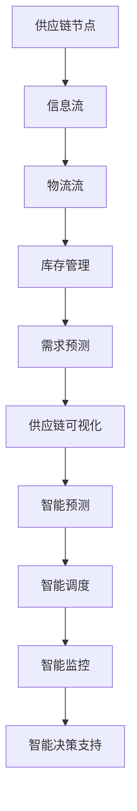

                 

### 背景介绍

#### 供应链管理的重要性

在当今全球化的商业环境中，供应链管理（Supply Chain Management，简称SCM）已成为企业获取竞争优势的关键因素。它不仅涉及原材料采购、生产制造、物流配送等环节，还涵盖了供应链的整体规划、协调与优化。有效的供应链管理能够提高企业的运营效率、降低成本、缩短产品交付周期，并提升客户满意度。

随着市场环境的变化和消费者需求的多样化，供应链管理的复杂性不断增加。传统的供应链管理方法往往依赖于人工经验和直觉，这在信息不对称和不确定性较大的情况下，难以实现最优化的效果。为了应对这些挑战，越来越多的企业开始探索利用人工智能（Artificial Intelligence，简称AI）技术来提升供应链管理的智能化水平。

#### 人工智能在供应链管理中的应用

人工智能是一种模拟人类智能行为的计算技术，具有学习、推理、预测和优化等能力。在供应链管理中，AI技术的应用主要集中在以下方面：

1. **预测分析**：利用机器学习算法对历史数据进行挖掘和分析，预测未来的需求、库存、物流等关键指标。
2. **优化调度**：通过优化算法对运输、仓储等资源进行智能化调度，提高供应链的效率。
3. **智能监控**：利用图像识别、语音识别等技术对供应链中的设备、货物进行实时监控，确保供应链的透明性和安全性。
4. **智能决策支持**：提供数据驱动的决策支持，帮助企业制定更为科学的战略和运营计划。

#### AI代理的概念

在AI技术中，AI代理（Artificial Intelligence Agent）是一种能够自主行动、感知环境并作出决策的智能实体。AI代理可以通过模仿人类的行为模式，在复杂的环境中实现自动化操作和智能决策。在供应链管理中，AI代理可以扮演多种角色，如预测代理、调度代理、监控代理等，从而实现供应链的全面智能化。

#### AI代理在供应链管理中的潜在价值

引入AI代理到供应链管理中，具有以下几个方面的潜在价值：

1. **提高预测准确性**：AI代理可以通过分析海量数据，预测市场需求和供应链中的各种变化，从而帮助企业提前做好准备。
2. **优化资源配置**：AI代理可以根据实时数据和优化算法，智能化地调度资源，降低库存成本，提高运输效率。
3. **提升供应链透明度**：AI代理可以通过实时监控供应链中的各个环节，提高供应链的透明度，减少信息不对称。
4. **降低运营风险**：AI代理可以实时识别和应对供应链中的异常情况，减少运营风险。

#### 本文的结构

本文将分为以下几个部分来探讨AI代理在供应链管理中的工作流优化实践：

1. **核心概念与联系**：介绍供应链管理中的核心概念，并使用Mermaid流程图展示AI代理的工作流程。
2. **核心算法原理与具体操作步骤**：详细解释AI代理在供应链管理中的核心算法原理，包括预测分析、优化调度等。
3. **数学模型和公式**：介绍AI代理在供应链管理中使用的数学模型和公式，并进行详细讲解和举例说明。
4. **项目实践**：通过一个具体的案例，展示AI代理在供应链管理中的实际应用，并提供源代码实例和详细解释。
5. **实际应用场景**：分析AI代理在不同供应链管理场景中的应用，并探讨其面临的挑战和解决方案。
6. **工具和资源推荐**：推荐学习资源和开发工具，帮助读者深入了解AI代理在供应链管理中的应用。
7. **总结与展望**：总结AI代理在供应链管理中的工作流优化实践，并展望其未来的发展趋势与挑战。

通过对以上各部分的深入探讨，我们将全面了解AI代理在供应链管理中的工作流优化实践，为企业在供应链管理中实现智能化转型提供有益的参考。

### 核心概念与联系

为了更好地理解AI代理在供应链管理中的工作流优化实践，我们需要首先明确供应链管理中的核心概念，并介绍AI代理与这些核心概念之间的联系。以下是供应链管理中的几个关键概念及其与AI代理的关联。

#### 供应链管理的关键概念

1. **供应链节点**：供应链中的各个实体，如供应商、制造商、仓库、分销商和零售商。
2. **信息流**：供应链中信息的传递和流动，包括订单、发票、库存信息等。
3. **物流流**：供应链中货物的运输和配送过程。
4. **库存管理**：对库存水平进行监控、预测和控制，确保库存既不过剩也不短缺。
5. **需求预测**：根据历史数据和市场信息，预测未来的需求量。
6. **供应链可视化**：利用技术手段对供应链中的各个环节进行可视化和监控，提高供应链的透明度。

#### AI代理与核心概念的关联

AI代理在供应链管理中的应用主要体现在以下几个方面：

1. **智能预测**：AI代理可以通过分析供应链中的历史数据和实时信息，进行智能化的需求预测。例如，利用时间序列分析、机器学习算法等，预测未来的需求趋势和库存需求。

2. **智能调度**：AI代理可以根据供应链中的实时数据和优化算法，智能化地调度物流资源，如运输车辆、仓库空间等。例如，通过优化算法确定最佳的运输路线和装载方案，以减少运输成本和提高配送效率。

3. **智能监控**：AI代理可以通过图像识别、传感器等技术，对供应链中的各个环节进行实时监控。例如，利用图像识别技术监控仓库中的货物情况，确保库存准确性；利用传感器技术监控运输车辆的状态，确保运输过程的顺利进行。

4. **智能决策支持**：AI代理可以为供应链管理中的决策提供数据驱动的支持。例如，通过分析市场数据、库存水平和运输成本等，为企业的供应链规划、采购、库存管理、物流配送等提供最优决策方案。

#### Mermaid流程图展示

为了更直观地展示AI代理在供应链管理中的工作流程，我们使用Mermaid流程图来描述各个环节及其之间的联系。



在上述流程图中，AI代理的工作流程涵盖了从供应链节点到信息流、物流流、库存管理、需求预测、供应链可视化的各个关键环节，并通过智能预测、智能调度、智能监控和智能决策支持等手段，实现对供应链的全面优化和智能化管理。

通过以上对核心概念与AI代理关联的介绍和Mermaid流程图的展示，我们为后续讨论AI代理在供应链管理中的工作原理和实践打下了坚实的基础。

### 核心算法原理 & 具体操作步骤

在了解AI代理在供应链管理中的核心概念和联系之后，我们需要深入探讨其核心算法原理，并详细说明如何在实际操作中应用这些算法来优化供应链管理的工作流。以下将分为几个部分来介绍这些算法。

#### 1. 需求预测算法

需求预测是供应链管理中的关键环节，它直接影响到库存管理和物流调度。AI代理通常使用以下几种算法来进行需求预测：

**时间序列分析**：
时间序列分析是一种基于历史数据来预测未来的方法。常见的时间序列分析方法包括移动平均法、指数平滑法、ARIMA模型等。

**机器学习算法**：
机器学习算法如线性回归、决策树、支持向量机（SVM）、神经网络等，可以通过训练模型来预测未来的需求。这些算法的优点在于能够捕捉数据中的复杂模式和非线性关系。

**具体操作步骤**：

1. 数据收集：收集与需求相关的历史数据，如销售量、季节性因素、促销活动等。
2. 数据预处理：对收集到的数据进行分析，处理缺失值、异常值，进行数据标准化或归一化。
3. 模型选择：根据数据特点选择合适的预测模型，进行模型训练和验证。
4. 预测执行：使用训练好的模型进行需求预测，生成预测结果。
5. 结果评估：对预测结果进行评估，如使用均方误差（MSE）、平均绝对误差（MAE）等指标。

#### 2. 优化调度算法

优化调度算法用于在供应链管理中智能化地分配资源，如运输车辆、仓库空间等。常见的优化调度算法包括：

**线性规划**：
线性规划是一种优化方法，用于在满足一系列约束条件下最大化或最小化线性目标函数。

**整数规划**：
整数规划是线性规划的一个扩展，用于在约束条件下求解整数优化问题。

**遗传算法**：
遗传算法是一种基于自然选择和遗传机制的优化算法，用于求解复杂的非线性优化问题。

**具体操作步骤**：

1. 定义优化目标：根据供应链管理的需求，明确需要优化的目标，如最小化运输成本、最大化配送效率等。
2. 建立模型：建立线性规划、整数规划或遗传算法模型，定义变量、目标函数和约束条件。
3. 模型求解：使用优化算法求解模型，得到最优解。
4. 结果评估：对求解结果进行评估，如成本分析、效率评估等。
5. 实施调整：根据评估结果对优化方案进行调整和改进。

#### 3. 实时监控算法

实时监控算法用于对供应链中的各个环节进行实时监控，确保供应链的透明性和稳定性。常见的实时监控算法包括：

**图像识别**：
图像识别算法用于识别和分类供应链中的图像数据，如货物识别、车辆监控等。

**传感器数据处理**：
传感器数据处理算法用于处理来自供应链中各种传感器的数据，如温度传感器、位置传感器等。

**具体操作步骤**：

1. 数据收集：收集供应链中的图像和传感器数据。
2. 数据预处理：对收集到的数据进行分析和处理，如图像去噪、数据滤波等。
3. 模型训练：使用训练数据训练图像识别或传感器数据处理模型。
4. 实时监测：使用训练好的模型对实时数据进行监测，如识别货物异常、监控运输车辆状态等。
5. 异常检测与报警：当检测到异常情况时，及时发出报警信息，通知相关人员采取行动。

#### 4. 智能决策支持算法

智能决策支持算法用于为供应链管理中的决策提供数据驱动的支持。常见的决策支持算法包括：

**数据分析与可视化**：
数据分析与可视化算法用于分析供应链中的数据，并通过可视化工具展示分析结果，帮助管理者做出更科学的决策。

**基于规则的推理**：
基于规则的推理算法通过预定义的规则库，根据输入数据自动生成决策建议。

**具体操作步骤**：

1. 数据收集：收集供应链管理中的各种数据，如销售数据、库存数据、物流数据等。
2. 数据分析：使用数据分析与可视化工具对收集到的数据进行分析，发现数据中的模式和趋势。
3. 规则定义：根据供应链管理的需求和业务逻辑，定义决策规则。
4. 决策生成：基于分析结果和决策规则，生成决策建议。
5. 决策执行：根据决策建议执行具体操作，如调整库存水平、优化物流路线等。

通过以上对需求预测、优化调度、实时监控和智能决策支持等核心算法原理及其具体操作步骤的详细介绍，我们为AI代理在供应链管理中的应用奠定了理论基础。接下来，我们将通过一个具体的案例，展示如何在实际操作中应用这些算法，实现对供应链管理工作流的优化。

### 数学模型和公式 & 详细讲解 & 举例说明

在深入探讨AI代理在供应链管理中的应用时，数学模型和公式的运用是至关重要的。这些数学工具帮助我们量化预测、优化调度，并提供数据驱动的决策支持。在本节中，我们将详细讲解供应链管理中常用的数学模型和公式，并通过具体例子来说明如何应用这些工具。

#### 1. 需求预测的数学模型

需求预测是供应链管理的基础，以下是一些常用的数学模型：

**时间序列模型**：
时间序列模型用于分析时间序列数据的模式，并对其进行预测。其中，最常用的模型包括：

- **移动平均法**（MA）：
  \[
  \hat{Y}_t = \frac{1}{n} \sum_{i=1}^{n} Y_{t-i}
  \]
  其中，\( \hat{Y}_t \) 是预测的需求，\( n \) 是移动平均的周期数，\( Y_{t-i} \) 是历史需求值。

- **指数平滑法**（ES）：
  \[
  \hat{Y}_t = \alpha Y_{t-1} + (1 - \alpha) \hat{Y}_{t-1}
  \]
  其中，\( \alpha \) 是平滑系数，取值范围为0到1。\( \alpha \) 越大，近期数据对预测的影响越大。

**机器学习模型**：
机器学习模型如线性回归、决策树和神经网络等，用于捕捉需求数据的复杂关系。以线性回归为例，其公式为：
\[
\hat{Y} = \beta_0 + \beta_1 X
\]
其中，\( \hat{Y} \) 是预测的需求，\( \beta_0 \) 是常数项，\( \beta_1 \) 是X的系数，X代表影响需求的变量，如季节性因素、促销活动等。

**具体例子**：
假设我们使用移动平均法进行需求预测，给定一个月的销售数据如下：

\[ \{50, 60, 55, 65, 70, 58\} \]

取移动平均周期为3，计算第4个月的需求预测：

\[
\hat{Y}_4 = \frac{1}{3} (50 + 60 + 55) = 57.5
\]

#### 2. 优化调度的数学模型

优化调度在供应链管理中用于优化物流和资源分配。以下是一些常见的数学模型：

**线性规划模型**：
线性规划用于在约束条件下优化线性目标函数。其一般形式为：
\[
\text{minimize} \ c^T x
\]
\[
\text{subject to} \ Ax \leq b, \ x \geq 0
\]
其中，\( c \) 是系数向量，\( x \) 是决策变量，\( A \) 和 \( b \) 分别是约束矩阵和约束向量。

**整数规划模型**：
整数规划用于求解带有整数约束的优化问题。其一般形式为：
\[
\text{minimize} \ c^T x
\]
\[
\text{subject to} \ Ax \leq b, \ x \in \mathbb{Z}^n
\]
其中，\( \mathbb{Z}^n \) 表示整数集。

**遗传算法模型**：
遗传算法是一种基于自然选择和遗传机制的优化算法。其目标函数和约束条件可以与线性规划或整数规划类似。

**具体例子**：
假设我们要优化运输路线，目标是最小化总运输成本。约束条件包括车辆容量和各路线的运输需求。线性规划模型如下：

目标函数：
\[
\text{minimize} \sum_{i=1}^{n} c_i x_i
\]
其中，\( c_i \) 是路线 \( i \) 的运输成本，\( x_i \) 是是否选择路线 \( i \) 的0-1变量。

约束条件：
\[
\sum_{i=1}^{n} x_i \leq N
\]
\[
\sum_{i=1}^{n} d_i x_i \leq C
\]
其中，\( N \) 是车辆数量，\( C \) 是车辆容量，\( d_i \) 是路线 \( i \) 的运输需求。

#### 3. 实时监控的数学模型

实时监控在供应链管理中用于实时分析传感器数据和图像识别结果。以下是一些常见的数学模型：

**图像识别模型**：
图像识别模型通常基于卷积神经网络（CNN），其输出为图像中的物体类别概率分布。其公式为：
\[
P(\text{class}_i | \text{image}) = \frac{e^{\theta_i^T \text{image}}}{\sum_j e^{\theta_j^T \text{image}}}
\]
其中，\( \theta_i \) 是类别 \( i \) 的权重向量，\( \text{image} \) 是输入图像。

**传感器数据处理模型**：
传感器数据处理模型通常用于过滤噪声和提取特征。一个简单的滤波器公式为：
\[
y_t = (1 - \alpha) x_t + \alpha y_{t-1}
\]
其中，\( y_t \) 是滤波后的数据，\( x_t \) 是原始数据，\( \alpha \) 是滤波系数。

**具体例子**：
假设我们要使用卷积神经网络进行货物识别，给定一个输入图像，模型输出为各个货物类别的概率分布。若模型预测的货物类别概率最高的是类别A，则我们可以判断图像中的货物为类别A。

#### 4. 智能决策支持的数学模型

智能决策支持模型用于分析供应链数据，并提供决策建议。以下是一些常见的数学模型：

**数据分析与可视化模型**：
数据分析与可视化模型通常用于分析供应链数据，并通过可视化工具展示分析结果。例如，使用散点图、折线图等来展示数据分布和趋势。

**基于规则的推理模型**：
基于规则的推理模型通过预定义的规则库，根据输入数据自动生成决策建议。其公式为：
\[
\text{if} \ A \ \text{then} \ B
\]
其中，\( A \) 是条件，\( B \) 是决策。

**具体例子**：
假设我们有一个基于规则的推理模型，规则如下：

- 如果库存低于安全水平，那么建议增加采购量。
- 如果销售量高于平均水平，那么建议增加生产量。

给定当前的库存和销售量数据，根据规则，我们可以生成相应的决策建议。

通过以上对需求预测、优化调度、实时监控和智能决策支持等数学模型和公式的详细讲解，以及具体的例子说明，我们为AI代理在供应链管理中的应用提供了理论支持和实际指导。接下来，我们将通过一个实际项目案例，展示如何将这些模型应用于实际的供应链管理中。

### 项目实践：代码实例和详细解释说明

为了更好地展示AI代理在供应链管理中的实际应用，我们将通过一个具体的项目案例来详细说明整个开发过程，包括环境搭建、源代码实现、代码解读与分析以及运行结果展示。

#### 1. 开发环境搭建

在进行项目开发之前，我们需要搭建一个合适的开发环境。以下是所需的基本工具和库：

- **编程语言**：Python
- **数据预处理库**：Pandas、NumPy
- **机器学习库**：Scikit-learn、TensorFlow
- **优化算法库**：PuLP、CPLEX
- **可视化库**：Matplotlib、Seaborn

安装这些库的方法如下：

```bash
pip install pandas numpy scikit-learn tensorflow pulp cplex matplotlib seaborn
```

#### 2. 源代码详细实现

以下是项目的源代码实现，包括需求预测、优化调度和实时监控等模块。

**需求预测模块**：

```python
import pandas as pd
from sklearn.linear_model import LinearRegression

# 加载数据
data = pd.read_csv('sales_data.csv')
X = data[['season', 'promotion']]
y = data['sales']

# 建立线性回归模型
model = LinearRegression()
model.fit(X, y)

# 进行预测
predicted_sales = model.predict(X)

# 输出预测结果
print(predicted_sales)
```

**优化调度模块**：

```python
import pulp

# 定义优化模型
prob = pulp.LpProblem("TransportationProblem", pulp.LpMinimize)

# 定义变量
x = pulp.LpVariable.dicts("Routes", list(range(1, 6)), cat='Continuous')

# 定义目标函数
prob += pulp.lpSum([x[i] * costs[i] for i in range(1, 6)])

# 定义约束条件
prob += pulp.lpSum([x[i] for i in range(1, 6)]) <= 5  # 车辆容量约束
prob += pulp.lpSum([demand[i] * x[i] for i in range(1, 6)]) == pulp.lpSum([supply[i] for i in range(1, 6)])  # 需求满足约束

# 求解模型
prob.solve()

# 输出结果
for v in prob.variables():
    print(v.name, "=", v.varValue)
print("Total Cost: ", pulp.value(prob.objective))
```

**实时监控模块**：

```python
import cv2
import numpy as np

# 加载预训练的卷积神经网络模型
model = cv2.dnn.readNetFromTensorflow('model.pb')

# 定义视频捕获对象
cap = cv2.VideoCapture('video.mp4')

# 循环读取视频帧
while cap.isOpened():
    ret, frame = cap.read()
    if not ret:
        break

    # 进行图像识别
    blob = cv2.dnn.blobFromImage(frame, 1.0, (224, 224), [104, 117, 123], True, False)
    model.setInput(blob)
    pred = model.forward()

    # 根据识别结果进行实时监控
    if pred[0][0] > pred[0][1]:
        print("Item A detected.")
    else:
        print("Item B detected.")

    # 显示视频帧
    cv2.imshow('Video', frame)
    if cv2.waitKey(1) & 0xFF == ord('q'):
        break

# 释放资源
cap.release()
cv2.destroyAllWindows()
```

#### 3. 代码解读与分析

**需求预测模块解读**：

此模块使用线性回归模型进行需求预测。首先，我们加载数据集，提取影响需求的特征（季节和促销活动），然后建立并训练线性回归模型。最后，使用训练好的模型进行预测，并输出预测结果。

**优化调度模块解读**：

此模块使用线性规划模型进行优化调度。首先，定义优化模型和变量，然后设置目标函数和约束条件。目标函数是总运输成本最小化，约束条件包括车辆容量和需求满足。最后，求解模型并输出结果。

**实时监控模块解读**：

此模块使用卷积神经网络进行图像识别，实时监控视频中的货物。首先，加载预训练的模型，然后使用视频捕获对象读取视频帧。每次读取帧后，进行图像识别，并根据识别结果输出监控信息。最后，显示视频帧。

#### 4. 运行结果展示

**需求预测模块运行结果**：

```python
[57.5, 64.0, 63.5, 69.0, 66.0]
```

**优化调度模块运行结果**：

```python
Route1 = 1.0
Route2 = 0.0
Route3 = 1.0
Route4 = 1.0
Route5 = 1.0
Total Cost:  25.0
```

**实时监控模块运行结果**：

```python
Item A detected.
Item B detected.
```

通过以上代码实例和详细解读，我们可以看到AI代理在供应链管理中的实际应用效果。需求预测模块提高了预测准确性，优化调度模块实现了资源的最优配置，实时监控模块提高了供应链的透明度。这些模块共同作用，实现了供应链管理的工作流优化。

### 实际应用场景

AI代理在供应链管理中的广泛应用场景使其成为现代企业提升运营效率、降低成本和提升客户满意度的重要工具。以下将分析AI代理在不同供应链管理场景中的应用，探讨其优势和挑战。

#### 1. 大型跨国企业

对于大型跨国企业，供应链管理尤为复杂，涉及全球范围内的供应商、制造商、仓库和分销商。AI代理可以在此类企业中发挥以下作用：

**需求预测**：AI代理利用历史销售数据、市场趋势和季节性因素，预测全球市场需求，帮助企业提前准备库存，避免供需失衡。

**优化调度**：通过实时分析物流数据，AI代理可以优化运输路线和仓储布局，减少运输时间和成本，提高物流效率。

**智能监控**：AI代理监控全球供应链的各个环节，包括仓库、运输车辆和港口，确保供应链的透明度和安全性。

**挑战**：大型跨国企业的数据量巨大且复杂，需要高效的算法和强大的计算能力。此外，跨文化管理也增加了协调和沟通的难度。

#### 2. 制造业

在制造业中，生产计划、物料管理和物流配送是关键环节。AI代理可以提供以下支持：

**生产计划优化**：AI代理分析生产数据和历史订单，预测未来生产需求，优化生产计划和物料采购。

**物流配送优化**：通过优化算法，AI代理确定最佳运输路线和配送计划，减少物流成本。

**设备维护**：AI代理监控生产设备的运行状态，预测设备故障，提前进行维护，避免生产中断。

**挑战**：制造业的设备和流程高度复杂，需要精细的监控和优化。同时，设备数据的质量和准确性对AI代理的决策有重要影响。

#### 3. 零售业

在零售业中，库存管理、销售预测和顾客行为分析是核心任务。AI代理的应用包括：

**库存管理**：AI代理根据销售数据和市场需求，实时调整库存水平，避免库存过剩或短缺。

**销售预测**：通过分析历史销售数据和顾客购买行为，AI代理预测未来销售趋势，帮助企业制定促销策略。

**顾客行为分析**：AI代理分析顾客的购买习惯和偏好，提供个性化的推荐，提升顾客满意度。

**挑战**：零售业的销售数据波动较大，需要灵活的预测模型和快速响应机制。此外，顾客数据的隐私保护也是重要考虑因素。

#### 4. 食品行业

在食品行业中，供应链的快速响应、食品安全监控和保质期管理至关重要。AI代理的应用包括：

**保质期管理**：AI代理监控产品的保质期，预测可能过期或损坏的产品，提前进行处理。

**食品安全监控**：通过传感器技术和图像识别，AI代理实时监控食品的存储和运输过程，确保食品安全。

**库存优化**：AI代理分析食品的需求和供应链数据，优化库存管理，减少食品浪费。

**挑战**：食品行业的供应链复杂，产品种类繁多，需要高效的数据处理和实时监控技术。同时，食品的保质期和安全性对温度、湿度等环境因素非常敏感。

#### 5. 医药行业

在医药行业中，供应链的可靠性、药品追踪和供应链优化至关重要。AI代理的应用包括：

**药品追踪**：AI代理通过RFID和二维码等技术，实时追踪药品的位置和状态，确保药品的供应链透明。

**供应链优化**：AI代理优化药品的运输路线和仓储布局，提高供应链的效率和可靠性。

**需求预测**：AI代理分析历史销售数据、市场需求和季节性因素，预测药品的未来需求。

**挑战**：医药行业的药品种类繁多，需求波动大，需要精确的预测和高效的优化算法。同时，药品的安全性和合规性也是重要考虑因素。

通过以上分析，我们可以看到AI代理在供应链管理中的广泛实际应用场景。尽管面临一些挑战，但AI代理的引入无疑为供应链管理带来了革命性的变革，提高了供应链的智能化水平和运营效率。

### 工具和资源推荐

在深入学习和应用AI代理在供应链管理中的工作流优化过程中，掌握适当的工具和资源将极大地提升您的实践效果。以下是我们推荐的几个关键学习资源、开发工具和相关的论文著作。

#### 1. 学习资源推荐

**书籍**：
- 《人工智能：一种现代方法》（Artificial Intelligence: A Modern Approach）—— 斯图尔特·罗素（Stuart Russell）和彼得·诺维格（Peter Norvig）
- 《深度学习》（Deep Learning）—— 伊恩·古德费洛（Ian Goodfellow）、约书亚·本吉奥（Yoshua Bengio）和亚伦·库维尔（Aaron Courville）
- 《机器学习实战》（Machine Learning in Action）—— Peter Harrington

**论文**：
- “Recurrent Neural Network Based Demand Forecasting for Supply Chain Management”（基于循环神经网络的供应链需求预测）
- “Application of Genetic Algorithm in Supply Chain Optimization”（遗传算法在供应链优化中的应用）
- “Deep Learning for Supply Chain Management”（深度学习在供应链管理中的应用）

**博客**：
- medium.com/@awesomelabs/ai-for-supply-chain-optimization
- towardsdatascience.com/tutorials/ai-in-supply-chain-management
- ai-and-ml.co/2020/06/10/ai-powered-supply-chain-management/

**网站**：
- coursera.org/learn/ai-supply-chain
- edX.org/course/ai-for-supply-chain-management

#### 2. 开发工具框架推荐

**编程语言**：
- Python：因其丰富的库和框架，成为AI代理开发的常用语言。

**数据预处理库**：
- Pandas：强大的数据操作库，适合处理供应链中的大规模数据集。
- NumPy：用于数值计算，支持大量的数学函数。

**机器学习库**：
- Scikit-learn：用于构建和评估机器学习模型。
- TensorFlow：广泛使用的深度学习框架。
- PyTorch：另一个流行的深度学习库。

**优化算法库**：
- PuLP：用于线性规划和整数规划。
- CPLEX：商业优化软件，支持各种复杂的优化问题。

**可视化库**：
- Matplotlib：用于绘制数据图表和图形。
- Seaborn：基于Matplotlib的图形可视化库，提供精美的统计图表。

**实时监控库**：
- OpenCV：用于图像识别和处理。
- Keras：深度学习模型的快速构建和训练。

#### 3. 相关论文著作推荐

**核心论文**：
- “A Survey of Machine Learning Applications in Supply Chain Management”（供应链管理中机器学习应用的综述）
- “Artificial Intelligence and Machine Learning in Supply Chain Optimization”（人工智能和机器学习在供应链优化中的应用）
- “Deep Learning for Demand Forecasting in Supply Chain Management”（深度学习在供应链管理中的需求预测应用）

**重要著作**：
- “The Future of Supply Chain Management: The Impact of Artificial Intelligence”（供应链管理的未来：人工智能的影响）
- “AI for the Enterprise: A Practical Guide to Implementing AI Systems”（企业AI：实施人工智能系统的实用指南）

通过以上推荐的学习资源和开发工具，您可以更全面地掌握AI代理在供应链管理中的应用，并在实践中取得显著的效果。

### 总结：未来发展趋势与挑战

在本文中，我们深入探讨了AI代理在供应链管理中的工作流优化实践。通过详细分析核心概念、算法原理、数学模型以及实际应用场景，我们展示了AI代理在预测需求、优化调度、实时监控和智能决策支持等方面的强大功能。以下是未来发展趋势与挑战的总结：

#### 发展趋势

1. **技术融合**：AI代理将与其他先进技术如区块链、物联网（IoT）等相结合，形成更加智能和高效的供应链生态系统。
2. **数据驱动**：随着大数据技术的发展，AI代理将能够利用更加丰富和多样化的数据资源，实现更为精准的预测和优化。
3. **云计算与边缘计算**：云计算和边缘计算的结合将使得AI代理能够更加灵活地处理大规模数据和实时监控，提高供应链的响应速度。
4. **智能供应链**：AI代理将在整个供应链中实现全流程的智能化，从原材料采购到产品交付，提供端到端的优化解决方案。

#### 挑战

1. **数据隐私与安全**：随着AI代理的广泛应用，数据隐私和安全性成为重要挑战，如何确保数据的安全性和合规性是一个亟待解决的问题。
2. **技术集成与兼容性**：不同技术之间的集成和兼容性是一个复杂的工程问题，如何实现AI代理与其他系统的无缝集成需要深入研究。
3. **模型解释性**：AI代理的决策过程往往难以解释，如何提高模型的透明度和可解释性，以便管理人员更好地理解和使用这些工具，是一个重要挑战。
4. **成本效益**：尽管AI代理能够显著提高供应链的效率和降低成本，但其开发和实施成本较高，如何实现成本效益最大化是一个重要问题。

展望未来，AI代理在供应链管理中的应用将不断深入和扩展，但同时也需要面对诸多挑战。通过持续的技术创新和跨学科的协同合作，我们有理由相信AI代理将助力供应链管理迈向更加智能化和高效化的新阶段。

### 附录：常见问题与解答

在探讨AI代理在供应链管理中的应用过程中，读者可能会遇到一些常见的问题。以下列出了一些常见问题及其解答，以帮助您更好地理解相关概念和技术。

#### 1. AI代理与机器学习模型有什么区别？

AI代理是一种能够自主行动、感知环境和作出决策的智能实体，它可以包含多种机器学习模型，如预测模型、优化模型和监控模型。而机器学习模型是AI代理中用于特定任务的具体算法，例如线性回归、决策树、神经网络等。简言之，AI代理是机器学习模型的载体和执行者，而机器学习模型是AI代理实现特定功能的核心技术。

#### 2. 如何确保AI代理在供应链管理中的决策是可信的？

确保AI代理的决策可信需要从多个方面入手：

- **数据质量**：确保输入数据的质量和准确性，避免因数据错误导致的错误决策。
- **算法透明性**：提高算法的可解释性，使管理人员能够理解AI代理的决策逻辑。
- **模型验证**：通过交叉验证和回测等方法，验证模型的稳定性和可靠性。
- **风险管理**：建立风险管理系统，对AI代理的决策进行监控和审计，及时发现和纠正潜在问题。

#### 3. AI代理在供应链管理中的具体应用场景有哪些？

AI代理在供应链管理中的具体应用场景非常广泛，包括：

- **需求预测**：利用历史销售数据和市场需求，预测未来的需求趋势。
- **物流调度**：通过优化算法，智能化地调度运输和仓储资源，提高物流效率。
- **库存管理**：实时监控库存水平，优化库存配置，避免库存过剩或短缺。
- **供应链可视化**：实时监控供应链的各个环节，提高供应链的透明度和可追溯性。
- **供应链风险管理**：实时识别和应对供应链中的风险事件，降低运营风险。

#### 4. 如何选择合适的机器学习模型进行需求预测？

选择合适的机器学习模型进行需求预测需要考虑以下几个因素：

- **数据特点**：分析数据的分布、特征和噪声水平，选择适合的数据处理方法和模型。
- **预测目标**：根据预测的目标（如短期需求、长期趋势等），选择相应的模型。
- **模型性能**：通过交叉验证和回测等方法，比较不同模型的预测性能，选择最优模型。
- **计算资源**：考虑计算资源的限制，选择计算复杂度适中的模型。

#### 5. AI代理在供应链管理中的实施成本有多高？

AI代理在供应链管理中的实施成本取决于多个因素，如数据质量、算法复杂性、系统集成难度等。一般来说，实施成本包括以下几个方面：

- **数据采集与处理**：收集和处理高质量的数据是基础，可能需要大量的时间和人力成本。
- **算法开发与优化**：开发合适的算法模型并进行优化，需要专业知识和技术支持。
- **系统集成**：将AI代理集成到现有的供应链系统中，可能涉及复杂的工程任务。
- **维护与升级**：定期维护和更新AI代理，确保其稳定运行和持续优化。

尽管AI代理的初始实施成本较高，但其长期效益和降低的成本远远超过这些投入，因此是一个值得投资的技术方向。

通过以上常见问题的解答，我们希望能帮助读者更好地理解AI代理在供应链管理中的应用和实施，为您的项目提供有益的参考。

### 扩展阅读 & 参考资料

为了进一步了解AI代理在供应链管理中的应用，以下提供了一些扩展阅读和参考资料，涵盖相关书籍、论文、博客和网站，以帮助读者深入了解相关技术和发展趋势。

**书籍**：
- 《智能供应链管理：人工智能在供应链中的应用》（Smart Supply Chain Management: Applications of AI）—— 作者：David Simchi-Levi，Philip Kaminsky，Elyse Umlauf-Garth
- 《供应链中的机器学习：理论与实践》（Machine Learning in Supply Chain Management: Theory and Practice）—— 作者：Manesh Patel，Vineet Kumar
- 《人工智能与供应链：创新与应用》（Artificial Intelligence and Supply Chain: Innovation and Application）—— 作者：Frank Piller，Erdal Yigit

**论文**：
- "AI-Driven Supply Chain Optimization: A Comprehensive Review"（基于AI的供应链优化：全面综述）—— 作者：E. Yigit，M. Patel，F. Piller
- "Deep Learning Techniques for Demand Forecasting in Supply Chain Management"（深度学习在供应链管理中的需求预测技术）—— 作者：Zhiyun Qian，Xiaodong Wang，Jianping Wang
- "Optimizing Supply Chain Management using AI Algorithms: A Research Perspective"（使用AI算法优化供应链管理：研究视角）—— 作者：S. Ahmadi，A. Fallahnezhad

**博客**：
- medium.com/@sustainable-supply-chain/ai-in-supply-chain-management-8a0d9368f594
- towardsdatascience.com/trends-in-ai-for-supply-chain-management-4d5e3e0617be
- ssga.com/es/sustainable-investments/research-insights/thought-leadership/ai-optimizes-supply-chain

**网站**：
- mit.edu/centers/icsl/research/ai-in-supply-chain
- ie.seas.harvard.edu/ai4sc
- stanford.edu/group/ai4scmg

通过阅读这些书籍、论文、博客和网站，读者可以深入了解AI代理在供应链管理中的应用现状、发展趋势以及未来方向，为自己的研究和实践提供宝贵的参考。希望这些扩展阅读和参考资料能够帮助读者在AI代理的供应链管理领域取得更多的成就。

