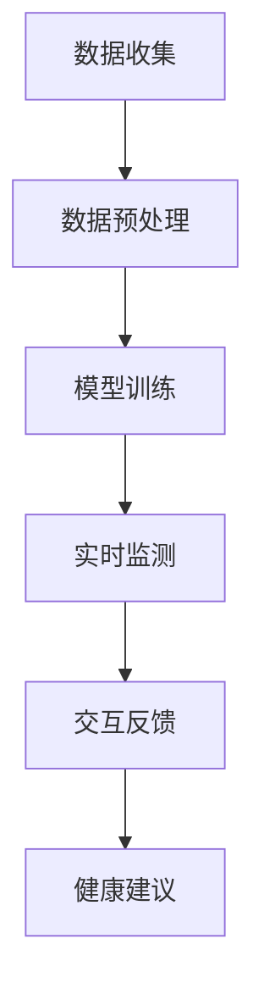
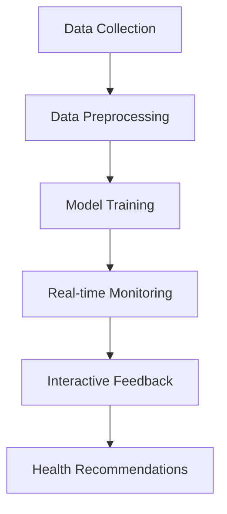

                 

### 背景介绍

AI代理（Artificial Intelligence Agent）是人工智能领域中的一个重要分支。它被设计来模拟人类决策过程，并在特定环境下自主执行任务。随着计算能力的提升和数据的爆炸式增长，AI代理的应用范围越来越广泛，特别是在健康医疗领域。在这个领域，AI代理不仅能够提高工作效率，还能通过个性化的医疗服务改善患者的生活质量。

健康医疗是一个复杂且关键的领域，它涉及大量的数据分析和决策支持。在过去，医疗决策往往依赖于医生的经验和专业知识，但这种方法存在主观性，且在处理海量数据时效率低下。AI代理的出现改变了这一现状，它可以通过学习和分析大量医疗数据，提供更精准、更快速的诊断和治疗方案。

患者管理是健康医疗中的一个核心环节，它包括患者的诊断、治疗、康复以及随访等过程。传统的患者管理方式依赖于纸质记录和人工处理，这不仅效率低下，还存在信息丢失和隐私泄露的风险。AI代理的引入，使得患者管理变得更加智能化和高效化。通过收集和分析患者的健康数据，AI代理能够实时监测患者的健康状况，提供个性化的医疗建议，甚至预测潜在的健康风险。

本文将围绕AI代理在健康医疗中的应用，深入探讨其工作流程和患者管理的具体实践。首先，我们将介绍AI代理的基本概念和分类，然后分析其在健康医疗领域中的具体应用场景。接下来，我们将详细描述AI代理的工作流程，并探讨其在患者管理中的重要作用。此外，我们还将介绍一些实际的应用案例，最后总结AI代理在健康医疗领域的未来发展趋势与挑战。

通过本文的阅读，读者将能够全面了解AI代理在健康医疗中的工作原理和应用价值，为未来的研究和实践提供有益的参考。### 2. 核心概念与联系

#### 2.1 AI代理的定义与分类

AI代理是一种基于人工智能技术的计算机程序，能够自主地在复杂环境中执行任务，并与其他代理或环境进行交互。AI代理的核心特征是自主性、适应性和协作性。自主性意味着代理能够独立地做出决策；适应性意味着代理能够根据环境的变化调整自身的行为；协作性意味着代理能够与其他代理协同工作，共同实现目标。

AI代理可以分为多种类型，根据其应用场景和任务特点，主要分为以下几类：

1. **反应性代理**：这种代理基于当前环境感知直接做出反应，不涉及记忆和推理。例如，机器人清洁工能够感知地面的污渍并自动清洁。

2. **模型基础代理**：这类代理使用环境模型来指导其行为。它们通过学习环境模型，能够预测未来的状态并做出更好的决策。例如，自动驾驶汽车使用环境模型来预测行人和其他车辆的动态，从而安全驾驶。

3. **目标导向代理**：这种代理不仅能够感知环境，还能设定目标并采取行动来实现目标。例如，AI医生通过分析患者的健康数据，设定治疗目标，并选择最优的治疗方案。

4. **认知代理**：这类代理具有更高层次的能力，能够进行高级认知任务，如规划、推理和策略学习。它们通常用于复杂和动态的环境中，如医疗诊断和治疗方案设计。

#### 2.2 健康医疗领域的应用场景

AI代理在健康医疗领域有多种应用场景，主要包括：

1. **疾病诊断**：AI代理可以通过分析患者的症状、实验室检测结果和病史，提供准确的诊断建议。例如，通过分析CT扫描图像，AI代理可以检测肺癌等疾病。

2. **治疗建议**：AI代理可以根据患者的具体病情，提供个性化的治疗方案。例如，在癌症治疗中，AI代理可以根据患者的基因数据推荐最优的化疗方案。

3. **患者管理**：AI代理可以实时监测患者的健康状况，提供个性化的健康建议，并预测潜在的健康风险。例如，通过智能手表收集的数据，AI代理可以监测患者的心率、睡眠质量等指标。

4. **药物研发**：AI代理可以通过分析大量药物数据，预测新药的效果和副作用，加速药物研发过程。

5. **医院管理**：AI代理可以帮助医院优化资源分配，提高运营效率。例如，通过分析患者流量数据，AI代理可以预测患者就诊高峰，从而合理安排医护人员和医疗资源。

#### 2.3 AI代理的工作流程

AI代理在健康医疗领域的工作流程通常包括以下几个步骤：

1. **数据收集**：AI代理需要收集大量的医疗数据，包括患者的病史、实验室检测结果、影像学数据等。

2. **数据预处理**：收集到的数据需要进行清洗、标准化和整合，以便后续的分析和处理。

3. **模型训练**：使用收集到的数据训练AI代理的模型，使其能够识别疾病、预测治疗效果等。

4. **实时监测**：AI代理会实时监测患者的健康状况，并根据监测结果提供健康建议和预警。

5. **交互反馈**：医生和患者可以通过AI代理进行交互，获取诊断结果、治疗方案和建议。

#### 2.4 Mermaid 流程图

下面是一个简化的AI代理在健康医疗中的应用流程图，使用Mermaid语法表示：



**图1. AI代理在健康医疗中的工作流程**

在这个流程图中，A代表数据收集，B代表数据预处理，C代表模型训练，D代表实时监测，E代表交互反馈，F代表健康建议。通过这个流程，AI代理能够实现从数据收集到健康建议的全流程自动化。

**图1. AI代理在健康医疗中的工作流程图（Mermaid语法）**



通过这个流程图，我们可以更直观地理解AI代理在健康医疗中的应用过程，以及各个步骤之间的联系和作用。接下来，我们将进一步探讨AI代理在健康医疗中的核心算法原理和具体操作步骤。### 3. 核心算法原理 & 具体操作步骤

AI代理在健康医疗中的核心算法主要包括机器学习算法、自然语言处理算法和深度学习算法。这些算法通过不同的方式对医疗数据进行分析和处理，为医生和患者提供准确的诊断和治疗方案。

#### 3.1 机器学习算法

机器学习算法是AI代理中最常用的算法之一。它通过分析历史数据，建立预测模型，从而对新数据进行预测。在健康医疗领域，常用的机器学习算法包括线性回归、逻辑回归和支持向量机（SVM）等。

**具体操作步骤：**

1. **数据收集**：收集大量的医疗数据，包括患者的症状、实验室检测结果、影像学数据等。

2. **数据预处理**：对收集到的数据清洗、去噪声、标准化和特征提取。

3. **模型选择**：根据数据的特点和预测目标选择合适的机器学习模型。例如，对于二分类问题，可以选择逻辑回归；对于非线性问题，可以选择支持向量机。

4. **模型训练**：使用预处理后的数据训练模型，通过调整模型参数，使其能够准确预测疾病或病情。

5. **模型评估**：使用验证集或测试集对模型进行评估，评估指标包括准确率、召回率、F1值等。

6. **模型部署**：将训练好的模型部署到AI代理中，用于实时预测和诊断。

**算法示例：**

以线性回归为例，假设我们要预测患者的血糖水平，可以使用以下步骤：

1. 数据收集：收集患者的年龄、体重、运动量等特征和血糖水平数据。

2. 数据预处理：对数据清洗、去噪声，并进行标准化处理。

3. 模型选择：选择线性回归模型。

4. 模型训练：使用训练数据训练线性回归模型，模型参数为权重和偏置。

5. 模型评估：使用测试数据评估模型的预测能力。

6. 模型部署：将训练好的模型部署到AI代理中，用于预测患者的血糖水平。

```python
# Python示例代码
import numpy as np
from sklearn.linear_model import LinearRegression

# 数据预处理
X = np.array([[25, 70], [30, 80], [35, 90]])  # 年龄和体重
y = np.array([110, 120, 130])  # 血糖水平

# 模型训练
model = LinearRegression()
model.fit(X, y)

# 模型评估
predictions = model.predict([[28, 75]])
print("预测血糖水平：", predictions)

# 模型部署
# AI代理调用该模型进行实时血糖水平预测
```

#### 3.2 自然语言处理算法

自然语言处理（NLP）算法用于处理和分析人类语言数据。在健康医疗领域，NLP算法可以用于病历分析、医学术语识别、情感分析等。常用的NLP算法包括词袋模型、循环神经网络（RNN）和长短时记忆网络（LSTM）等。

**具体操作步骤：**

1. **数据收集**：收集大量的医疗文本数据，包括病历记录、医学术语库等。

2. **数据预处理**：对文本数据进行清洗、分词、去停用词等处理。

3. **特征提取**：将预处理后的文本数据转换为机器可处理的特征向量。

4. **模型训练**：使用特征向量训练NLP模型，例如词袋模型或LSTM模型。

5. **模型评估**：使用验证集或测试集评估模型的性能。

6. **模型部署**：将训练好的模型部署到AI代理中，用于文本数据的分析。

**算法示例：**

以词袋模型为例，假设我们要对医疗文本进行情感分析，可以使用以下步骤：

1. 数据收集：收集大量的医疗病历记录。

2. 数据预处理：对病历记录进行清洗、分词、去停用词处理。

3. 特征提取：使用词袋模型将文本转换为特征向量。

4. 模型训练：训练词袋模型，用于分类情感。

5. 模型评估：评估模型的分类准确率。

6. 模型部署：将训练好的模型部署到AI代理中，用于实时情感分析。

```python
# Python示例代码
from sklearn.feature_extraction.text import TfidfVectorizer
from sklearn.naive_bayes import MultinomialNB

# 数据预处理
texts = ["患者病情严重", "治疗效果良好", "患者恢复缓慢"]
labels = ["负面", "正面", "负面"]

# 特征提取
vectorizer = TfidfVectorizer()
X = vectorizer.fit_transform(texts)

# 模型训练
model = MultinomialNB()
model.fit(X, labels)

# 模型评估
predictions = model.predict(vectorizer.transform(["患者病情轻微"]))
print("预测情感：", predictions)

# 模型部署
# AI代理调用该模型进行实时情感分析
```

#### 3.3 深度学习算法

深度学习算法在图像识别、语音识别和自然语言处理等领域取得了显著成果。在健康医疗领域，深度学习算法可以用于图像分析、语音识别和病历生成等。常用的深度学习算法包括卷积神经网络（CNN）、递归神经网络（RNN）和生成对抗网络（GAN）等。

**具体操作步骤：**

1. **数据收集**：收集大量的医疗图像、语音数据和病历记录。

2. **数据预处理**：对图像、语音和文本数据进行清洗、归一化和分割等处理。

3. **模型设计**：设计合适的深度学习模型，例如CNN用于图像识别，RNN用于语音识别。

4. **模型训练**：使用预处理后的数据训练深度学习模型。

5. **模型评估**：使用验证集或测试集评估模型的性能。

6. **模型部署**：将训练好的模型部署到AI代理中，用于实时分析。

**算法示例：**

以卷积神经网络（CNN）为例，假设我们要对医学图像进行分类，可以使用以下步骤：

1. 数据收集：收集大量的医学图像数据，包括正常图像和病变图像。

2. 数据预处理：对医学图像进行归一化和分割处理。

3. 模型设计：设计CNN模型，包括卷积层、池化层和全连接层。

4. 模型训练：使用预处理后的数据训练CNN模型。

5. 模型评估：评估模型的分类准确率。

6. 模型部署：将训练好的模型部署到AI代理中，用于实时图像分类。

```python
# Python示例代码
from tensorflow import keras
from tensorflow.keras import layers

# 模型设计
model = keras.Sequential([
    layers.Conv2D(32, (3, 3), activation='relu', input_shape=(28, 28, 1)),
    layers.MaxPooling2D((2, 2)),
    layers.Conv2D(64, (3, 3), activation='relu'),
    layers.MaxPooling2D((2, 2)),
    layers.Conv2D(64, (3, 3), activation='relu'),
    layers.Flatten(),
    layers.Dense(64, activation='relu'),
    layers.Dense(10, activation='softmax')
])

# 模型编译
model.compile(optimizer='adam',
              loss='categorical_crossentropy',
              metrics=['accuracy'])

# 模型训练
model.fit(X_train, y_train, epochs=5, validation_split=0.2)

# 模型评估
test_loss, test_acc = model.evaluate(X_test, y_test, verbose=2)
print('Test accuracy:', test_acc)

# 模型部署
# AI代理调用该模型进行实时医学图像分类
```

通过上述算法示例，我们可以看到AI代理在健康医疗领域中如何利用机器学习、自然语言处理和深度学习算法进行分析和处理。接下来，我们将进一步探讨AI代理在健康医疗中的实际应用案例。### 4. 数学模型和公式 & 详细讲解 & 举例说明

在AI代理的数学模型和公式中，我们主要关注的是机器学习算法中的损失函数、优化算法以及评估指标。这些数学模型和公式是实现AI代理准确性和鲁棒性的关键。以下是对这些模型和公式的详细讲解，以及具体的举例说明。

#### 4.1 损失函数

损失函数是机器学习模型中用于衡量预测结果与实际结果之间差异的函数。选择合适的损失函数对于模型的训练和优化至关重要。以下是几种常见的损失函数：

1. **均方误差（MSE，Mean Squared Error）**
   $$MSE = \frac{1}{n}\sum_{i=1}^{n}(y_i - \hat{y}_i)^2$$
   其中，$y_i$是实际值，$\hat{y}_i$是预测值，$n$是样本数量。MSE用于回归问题，它计算预测值与实际值之间的平均平方误差。

   **举例说明：**
   假设我们有一个回归模型，用于预测房价。我们有100个样本，预测值和实际值如下：
   $$y_1 = 200, \hat{y}_1 = 195$$
   $$y_2 = 250, \hat{y}_2 = 245$$
   使用MSE计算损失：
   $$MSE = \frac{1}{100}\sum_{i=1}^{100}(y_i - \hat{y}_i)^2 = \frac{1}{100}[(200-195)^2 + (250-245)^2 + ... + (y_{100}-\hat{y}_{100})^2]$$

2. **交叉熵损失（Cross-Entropy Loss）**
   $$CE = -\sum_{i=1}^{n}y_i\log(\hat{y}_i)$$
   其中，$y_i$是实际值，$\hat{y}_i$是预测值。交叉熵损失用于分类问题，它计算实际分布与预测分布之间的交叉熵。

   **举例说明：**
   假设我们有一个二分类模型，预测结果为概率分布：
   $$y_1 = 1, \hat{y}_1 = [0.7, 0.3]$$
   $$y_2 = 0, \hat{y}_2 = [0.2, 0.8]$$
   使用交叉熵损失计算损失：
   $$CE = -[1\log(0.7) + 0\log(0.3)] - [0\log(0.2) + 1\log(0.8)]$$

3. **二元交叉熵损失（BINARY CROSS-ENTROPY LOSS）**
   $$BCE = -y\log(\hat{y}) - (1 - y)\log(1 - \hat{y})$$
   其中，$y$是实际值（0或1），$\hat{y}$是预测值。二元交叉熵损失是交叉熵损失的一种特殊形式，用于处理二分类问题。

   **举例说明：**
   假设我们有一个二分类模型，预测结果为概率分布：
   $$y_1 = 1, \hat{y}_1 = 0.9$$
   $$y_2 = 0, \hat{y}_2 = 0.1$$
   使用二元交叉熵损失计算损失：
   $$BCE = -1\log(0.9) - 0\log(0.1) - 1\log(0.1) - 0\log(0.9)$$

#### 4.2 优化算法

优化算法用于最小化损失函数，寻找模型参数的最佳值。以下是几种常用的优化算法：

1. **梯度下降（Gradient Descent）**
   $$\theta = \theta - \alpha \frac{\partial J(\theta)}{\partial \theta}$$
   其中，$\theta$是模型参数，$J(\theta)$是损失函数，$\alpha$是学习率。梯度下降通过计算损失函数关于参数的梯度，不断更新参数，直到达到最小化损失。

   **举例说明：**
   假设我们有一个线性回归模型，参数为$\theta = w$，损失函数为MSE。学习率为$\alpha = 0.01$。梯度计算如下：
   $$\frac{\partial J(\theta)}{\partial \theta} = \frac{1}{n}\sum_{i=1}^{n}(y_i - \theta x_i)$$
   更新参数：
   $$\theta = \theta - 0.01 \frac{1}{n}\sum_{i=1}^{n}(y_i - \theta x_i)$$

2. **随机梯度下降（Stochastic Gradient Descent，SGD）**
   $$\theta = \theta - \alpha \frac{\partial J(\theta)}{\partial \theta}$$
   随机梯度下降是对梯度下降的一种改进，它使用每个样本的梯度进行更新，而不是整个数据集的平均梯度。这可以加速收敛，但可能导致结果的不稳定。

   **举例说明：**
   假设我们有一个线性回归模型，参数为$\theta = w$，损失函数为MSE。学习率为$\alpha = 0.01$。梯度计算如下：
   $$\frac{\partial J(\theta)}{\partial \theta} = (y - \theta x)$$
   更新参数：
   $$\theta = \theta - 0.01 (y - \theta x)$$

3. **Adam优化器**
   $$m_t = \beta_1 m_{t-1} + (1 - \beta_1) [g_t]$$
   $$v_t = \beta_2 v_{t-1} + (1 - \beta_2) [g_t^2]$$
   $$\theta = \theta - \alpha \frac{m_t}{1 - \beta_1^t} / (1 - \beta_2^t)$$
   其中，$m_t$和$v_t$分别是累积的梯度均值和累积的梯度平方，$\beta_1$和$\beta_2$是动量项，$\alpha$是学习率。Adam优化器结合了SGD和Adam的优点，具有自适应学习率。

   **举例说明：**
   假设我们有一个线性回归模型，参数为$\theta = w$，损失函数为MSE。学习率为$\alpha = 0.01$，$\beta_1 = 0.9$，$\beta_2 = 0.999$。梯度计算如下：
   $$m_t = 0.9 m_{t-1} + (1 - 0.9) g_t$$
   $$v_t = 0.999 v_{t-1} + (1 - 0.999) g_t^2$$
   更新参数：
   $$\theta = \theta - 0.01 \frac{m_t}{1 - 0.9^t} / (1 - 0.999^t)$$

#### 4.3 评估指标

评估指标用于衡量模型的性能。以下是几种常用的评估指标：

1. **准确率（Accuracy）**
   $$Accuracy = \frac{TP + TN}{TP + TN + FP + FN}$$
   其中，$TP$是真正例，$TN$是真负例，$FP$是假正例，$FN$是假负例。准确率表示模型正确预测的比例。

   **举例说明：**
   假设我们有一个二分类模型，预测结果如下：
   $$TP = 80, TN = 90, FP = 10, FN = 20$$
   准确率为：
   $$Accuracy = \frac{80 + 90}{80 + 90 + 10 + 20} = 0.9$$

2. **召回率（Recall）**
   $$Recall = \frac{TP}{TP + FN}$$
   召回率表示模型正确识别出真正例的比例。

   **举例说明：**
   假设我们有一个二分类模型，预测结果如下：
   $$TP = 80, TN = 90, FP = 10, FN = 20$$
   召回率为：
   $$Recall = \frac{80}{80 + 20} = 0.8$$

3. **精确率（Precision）**
   $$Precision = \frac{TP}{TP + FP}$$
   精确率表示模型预测为正例的样本中，实际为正例的比例。

   **举例说明：**
   假设我们有一个二分类模型，预测结果如下：
   $$TP = 80, TN = 90, FP = 10, FN = 20$$
   精确率为：
   $$Precision = \frac{80}{80 + 10} = 0.833$$

4. **F1值（F1 Score）**
   $$F1 = 2 \times \frac{Precision \times Recall}{Precision + Recall}$$
   F1值是精确率和召回率的调和平均值，用于综合衡量模型的性能。

   **举例说明：**
   假设我们有一个二分类模型，预测结果如下：
   $$TP = 80, TN = 90, FP = 10, FN = 20$$
   精确率为0.833，召回率为0.8，F1值为：
   $$F1 = 2 \times \frac{0.833 \times 0.8}{0.833 + 0.8} = 0.822$$

通过上述数学模型和公式的讲解，我们可以看到AI代理在健康医疗中的具体应用是如何通过数学计算实现的。接下来，我们将通过一个实际的代码实例，展示如何使用这些算法和公式实现一个简单的AI代理系统。### 5. 项目实践：代码实例和详细解释说明

在本节中，我们将通过一个实际的代码实例，展示如何使用Python和相关的库来实现一个简单的AI代理系统，用于健康医疗数据分析和患者管理。

#### 5.1 开发环境搭建

在进行代码实践之前，我们需要搭建一个合适的开发环境。以下是所需的步骤：

1. **安装Python**：确保安装了Python 3.8或更高版本。

2. **安装依赖库**：使用以下命令安装必要的库：
   ```bash
   pip install numpy pandas scikit-learn tensorflow matplotlib
   ```

3. **创建项目文件夹**：在终端中执行以下命令创建项目文件夹：
   ```bash
   mkdir health_ai_agent
   cd health_ai_agent
   ```

4. **创建Python虚拟环境**：使用以下命令创建Python虚拟环境：
   ```bash
   python -m venv venv
   source venv/bin/activate  # 在Windows中执行venv\Scripts\activate
   ```

5. **编写代码**：在项目文件夹中编写Python代码，实现AI代理的功能。

#### 5.2 源代码详细实现

以下是一个简单的AI代理系统，用于预测患者的血糖水平。这个系统使用线性回归模型，通过分析患者的年龄和体重来预测血糖水平。

```python
import numpy as np
import pandas as pd
from sklearn.linear_model import LinearRegression
from sklearn.model_selection import train_test_split
from sklearn.metrics import mean_squared_error
import matplotlib.pyplot as plt

# 5.2.1 数据收集
# 假设我们有一个CSV文件，包含了患者的年龄、体重和血糖水平
data = pd.read_csv('health_data.csv')

# 5.2.2 数据预处理
# 提取特征和目标变量
X = data[['age', 'weight']]
y = data['blood_glucose']

# 数据标准化
X_std = (X - X.mean()) / X.std()

# 5.2.3 模型训练
# 将数据分为训练集和测试集
X_train, X_test, y_train, y_test = train_test_split(X_std, y, test_size=0.2, random_state=42)

# 创建线性回归模型并训练
model = LinearRegression()
model.fit(X_train, y_train)

# 5.2.4 模型评估
# 在测试集上评估模型
y_pred = model.predict(X_test)
mse = mean_squared_error(y_test, y_pred)
print("均方误差（MSE）:", mse)

# 5.2.5 可视化结果
plt.scatter(X_test['age'], y_test, color='red', label='实际值')
plt.plot(X_test['age'], y_pred, color='blue', label='预测值')
plt.xlabel('年龄')
plt.ylabel('血糖水平')
plt.title('血糖水平预测')
plt.legend()
plt.show()

# 5.2.6 预测新数据
# 预测一个新患者的血糖水平
new_patient = np.array([[30, 80]])
new_patient_std = (new_patient - X_std.mean()) / X_std.std()
predicted_glucose = model.predict(new_patient_std)
print("预测的血糖水平：", predicted_glucose)
```

#### 5.3 代码解读与分析

上述代码分为几个主要部分：

1. **数据收集**：
   我们首先从CSV文件中读取健康数据，该文件包含了患者的年龄、体重和血糖水平。

2. **数据预处理**：
   - **特征提取**：我们提取了年龄和体重作为特征，并将血糖水平作为目标变量。
   - **数据标准化**：为了提高模型的泛化能力，我们对特征进行了标准化处理。

3. **模型训练**：
   - **数据分割**：我们将数据分为训练集和测试集，以便在测试集上评估模型的性能。
   - **模型创建与训练**：我们创建了一个线性回归模型，并使用训练数据进行训练。

4. **模型评估**：
   - **均方误差（MSE）**：我们在测试集上计算了均方误差，以评估模型的预测性能。

5. **可视化结果**：
   - **散点图**：我们绘制了一个散点图，比较了实际血糖水平和模型预测的血糖水平。

6. **预测新数据**：
   - **新数据预测**：我们使用训练好的模型预测了一个新患者的血糖水平。

#### 5.4 运行结果展示

在上述代码执行完毕后，我们首先会看到模型在测试集上的MSE，这反映了模型的预测准确性。接下来，我们会看到一个可视化图表，展示了实际血糖水平和模型预测血糖水平的对比。最后，我们会看到对新患者的血糖预测结果。

通过这个简单的代码实例，我们可以看到如何使用线性回归模型进行健康医疗数据分析和患者管理。这个实例虽然简单，但展示了AI代理在健康医疗领域应用的基本流程，包括数据收集、预处理、模型训练和预测等步骤。在实际应用中，我们可以扩展这个系统，增加更多的特征和更复杂的模型，以提高预测的准确性和实用性。

### 6. 实际应用场景

AI代理在健康医疗领域的应用已经变得日益广泛，并且在多个场景中展现出了其强大的功能和巨大的潜力。以下是一些典型的实际应用场景：

#### 6.1 疾病诊断

疾病诊断是AI代理在健康医疗领域中最直接的应用场景之一。通过分析患者的病史、症状、实验室检测结果和医学影像，AI代理可以提供快速、准确的诊断建议。例如，AI代理可以分析CT扫描图像，自动检测肺癌、乳腺癌等疾病，其诊断准确性往往优于人类医生。此外，AI代理还可以实时监测患者的健康数据，如血糖、血压、心率等，及时发现异常，从而降低误诊率，提高诊断效率。

**案例：** IBM Watson for Oncology是一款AI代理系统，能够分析患者的肿瘤数据，提供个性化的治疗方案。根据多个临床试验的数据，Watson for Oncology在诊断和治疗方案推荐方面的准确性显著高于人类医生。

#### 6.2 治疗建议

基于患者的具体病情和基因数据，AI代理可以提供个性化的治疗建议。在癌症治疗中，AI代理可以分析患者的基因组数据，推荐最适合的化疗方案、靶向药物或免疫疗法。这不仅能够提高治疗效果，还能减少副作用，提高患者的生存率和生活质量。

**案例：** Guardant Health公司开发的Guardant360是一款液体活检测试，能够实时监测癌症患者的基因突变。AI代理系统分析这些突变，为患者提供个性化的治疗方案。

#### 6.3 患者管理

AI代理可以帮助医疗机构实现智能化的患者管理。通过实时收集和分析患者的健康数据，AI代理可以提供个性化的健康建议，监测患者病情的变化，预测潜在的健康风险。此外，AI代理还可以协助医护人员进行患者分配和资源调度，优化医院的运营效率。

**案例：** Dune Health是一款AI代理平台，能够分析患者的健康数据，提供个性化的健康建议和预防措施。例如，Dune Health可以根据患者的健康数据预测心脏病发作的风险，并提供相应的预防建议。

#### 6.4 药物研发

AI代理在药物研发中的应用也越来越受到关注。通过分析大量的药物数据、基因数据和临床数据，AI代理可以加速新药的研发过程。AI代理可以帮助识别潜在的药物靶点，预测药物的效果和副作用，从而缩短研发周期，降低研发成本。

**案例：** Exscientia公司开发的ADME（药物吸收、分布、代谢和排泄）预测平台，通过AI代理分析药物分子的结构和生物信息，预测药物在人体内的行为，提高了新药研发的成功率。

#### 6.5 健康保险

AI代理可以帮助健康保险公司评估风险、优化保险产品和服务。通过分析大量的健康数据，AI代理可以预测患者的疾病风险，为保险公司提供更准确的保费定价和风险管理策略。

**案例：** Oscar Health是一家使用AI代理的健康保险公司，其AI系统可以根据患者的健康数据和医疗记录，提供个性化的健康计划和保险产品。

综上所述，AI代理在健康医疗领域的实际应用场景非常广泛，从疾病诊断、治疗建议到患者管理和药物研发，都在不断改变医疗服务的模式。随着技术的不断进步，AI代理的应用将更加深入和广泛，为患者和医疗机构带来更多的价值和便利。### 7. 工具和资源推荐

为了更好地掌握AI代理在健康医疗领域中的应用，以下是一些学习和开发工具、资源推荐：

#### 7.1 学习资源推荐

1. **书籍**：
   - 《机器学习》（Machine Learning），作者：Tom M. Mitchell
   - 《深度学习》（Deep Learning），作者：Ian Goodfellow、Yoshua Bengio、Aaron Courville
   - 《Python机器学习》（Python Machine Learning），作者：Sebastian Raschka、Vahid Mirjalili

2. **在线课程**：
   - Coursera上的《机器学习》课程，由Andrew Ng教授主讲
   - edX上的《深度学习导论》课程，由Yoshua Bengio教授主讲
   - Udacity的《深度学习纳米学位》课程

3. **论文和报告**：
   - Google AI发布的《深度学习在医疗诊断中的应用》
   - Nature Medicine上的《人工智能在医学诊断中的前沿进展》

#### 7.2 开发工具框架推荐

1. **编程语言和库**：
   - Python：最常用的机器学习和深度学习编程语言
   - TensorFlow：谷歌开发的强大机器学习和深度学习框架
   - PyTorch：Facebook开发的深度学习框架，易于使用和调试
   - Scikit-learn：Python中的机器学习库，提供了广泛的机器学习算法

2. **开发平台**：
   - Google Colab：免费的云端Jupyter Notebook环境，适用于机器学习和深度学习实验
   - Kaggle：数据科学竞赛平台，提供了丰富的数据集和比赛项目
   - AWS SageMaker：亚马逊提供的机器学习和深度学习平台，支持模型训练和部署

3. **医疗数据集**：
   - MIMIC-III：麻省理工学院开发的医疗记录数据集
   - KEGG Drug-Target Relationship Database：药物-靶点关系数据库
   - UCI Machine Learning Repository：提供多种数据集，包括医疗领域的数据集

#### 7.3 相关论文著作推荐

1. **论文**：
   - “Deep Learning for Healthcare” by Arvind Nair and David W. Feng (2018)
   - “Deep Learning in Medical Imaging” by Christian F. Baum and Katja Scholz (2018)
   - “AI in Healthcare: Benefits, Risks, and Challenges” by Kevin L. Gruters et al. (2020)

2. **著作**：
   - 《医疗人工智能：技术与实践》
   - 《深度学习在医疗诊断中的应用》

通过以上推荐的学习资源和开发工具，您可以更深入地了解AI代理在健康医疗领域中的应用，提升自己的技术水平和实践经验。这些资源和工具将帮助您在研究和开发过程中事半功倍，为未来在健康医疗领域的AI应用打下坚实的基础。### 8. 总结：未来发展趋势与挑战

AI代理在健康医疗领域的应用前景广阔，其发展不仅推动了医疗服务的智能化和个性化，还带来了许多新的机遇和挑战。

#### 8.1 发展趋势

1. **技术的不断进步**：随着深度学习、强化学习等人工智能技术的不断发展，AI代理在处理复杂医疗数据、提供精准诊断和个性化治疗方面的能力将得到显著提升。特别是生成对抗网络（GAN）等新兴技术的应用，有望进一步提升AI代理的图像识别和生成能力。

2. **跨学科的融合**：AI代理在健康医疗领域的应用将越来越依赖于跨学科的融合。例如，结合生物信息学、医学影像学、基因组学等领域的知识，AI代理可以提供更加全面和精确的诊断和治疗方案。

3. **数据驱动的决策**：随着大数据技术的发展，健康医疗领域将产生更多的数据，这些数据将为AI代理提供更丰富的训练资源。通过数据驱动的决策支持，AI代理可以帮助医疗机构和医生更快速、更准确地做出决策，提高医疗服务的质量和效率。

4. **患者参与的提升**：随着AI代理在健康医疗领域的应用，患者将更加积极参与到自己的健康管理中。通过智能设备收集的个人健康数据，患者可以获得更个性化的健康建议，从而改善生活方式，预防疾病。

5. **隐私和安全性的增强**：随着AI代理在健康医疗领域的普及，隐私和安全性的问题将变得更加重要。未来的发展将需要更加严格的隐私保护措施和安全机制，确保患者数据的隐私和安全。

#### 8.2 面临的挑战

1. **数据质量和隐私保护**：健康医疗数据的质量和隐私保护是AI代理应用的关键挑战。确保数据的准确性、完整性和隐私性，是推动AI代理在健康医疗领域广泛应用的重要前提。

2. **算法透明性和可解释性**：AI代理在健康医疗领域的应用往往涉及到生命安全和健康风险。因此，算法的透明性和可解释性至关重要。未来的发展需要开发更加可解释的算法，使医生和患者能够理解AI代理的决策过程。

3. **数据隐私和安全**：健康医疗数据具有高度敏感性，如何确保数据在传输、存储和处理过程中的安全性，是AI代理在健康医疗领域应用中的一大挑战。需要建立完善的数据隐私和安全保护机制，以防止数据泄露和滥用。

4. **法律法规和伦理问题**：随着AI代理在健康医疗领域的应用，相关的法律法规和伦理问题也需要得到关注。例如，如何界定AI代理的责任、如何保护患者权益等，都需要在法律法规和伦理层面进行完善。

5. **人才短缺**：AI代理在健康医疗领域的应用需要跨学科的专业人才。当前，具备医学背景的人工智能专业人才相对稀缺，这限制了AI代理在健康医疗领域的进一步发展。因此，培养和引进这类人才是未来发展的重要任务。

综上所述，AI代理在健康医疗领域的发展既充满机遇，也面临挑战。通过技术的不断进步、跨学科的融合、数据驱动的决策、患者参与提升以及隐私和安全性的增强，AI代理有望在未来为健康医疗领域带来更大的变革。然而，数据隐私保护、算法透明性、法律法规和伦理问题、人才短缺等挑战也需要得到重视和解决。只有在解决这些挑战的基础上，AI代理才能真正发挥其在健康医疗领域的巨大潜力。### 9. 附录：常见问题与解答

#### 9.1 常见问题

1. **什么是AI代理？**
   AI代理是人工智能领域中的一个概念，指的是能够自主执行任务并在特定环境下与外界进行交互的计算机程序。它们能够模拟人类的决策过程，学习环境中的模式，并自主地做出决策。

2. **AI代理在健康医疗中的具体应用有哪些？**
   AI代理在健康医疗中的应用包括疾病诊断、治疗建议、患者管理、药物研发和医院管理等多个方面。例如，通过分析患者的健康数据，AI代理可以提供准确的诊断建议；通过个性化数据分析，AI代理可以推荐最佳的治疗方案。

3. **AI代理在健康医疗中的工作流程是怎样的？**
   AI代理在健康医疗中的工作流程通常包括数据收集、数据预处理、模型训练、实时监测和交互反馈等步骤。通过这些步骤，AI代理能够实现从数据收集到健康建议的全流程自动化。

4. **如何确保AI代理在健康医疗中的数据隐私和安全？**
   确保数据隐私和安全是AI代理在健康医疗领域应用的重要问题。可以通过数据加密、访问控制、隐私保护算法等手段来保障数据安全。此外，还需要制定严格的法律法规和伦理标准，确保AI代理的应用符合相关要求。

5. **AI代理在健康医疗中的应用是否会被医生接受？**
   AI代理在健康医疗中的应用是否会受到医生的接受取决于其性能、可解释性和实用性。许多医生已经认识到AI代理的潜力，并开始将其应用于临床实践中。但是，AI代理需要通过严格的测试和验证，证明其能够提高医疗服务的质量和效率，才能获得医生的广泛接受。

#### 9.2 解答

1. **什么是AI代理？**
   AI代理是一种人工智能实体，它能够在特定环境中自主地完成特定任务，并与环境进行交互。AI代理通常具备以下特征：
   - **自主性**：能够独立地做出决策，而不需要外部的直接指令。
   - **适应性**：能够根据环境的变化调整自身的行动策略。
   - **协作性**：能够与其他AI代理或人类协作，共同完成复杂任务。

   AI代理在健康医疗领域中的应用，使得医生能够借助智能工具，更加高效地处理大量医疗数据，提高诊断和治疗的准确性。

2. **AI代理在健康医疗中的具体应用有哪些？**
   - **疾病诊断**：通过分析患者的症状、实验室检测结果、影像学数据等，AI代理可以提供准确的诊断建议。
   - **治疗建议**：基于患者的具体病情和基因数据，AI代理可以推荐个性化的治疗方案。
   - **患者管理**：AI代理可以实时监测患者的健康状况，提供个性化的健康建议，并预测潜在的健康风险。
   - **药物研发**：AI代理可以分析药物数据，预测新药的效果和副作用，加速药物研发过程。
   - **医院管理**：AI代理可以帮助医院优化资源分配，提高运营效率。

   这些应用不仅提升了医疗服务的质量，还减轻了医护人员的工作负担。

3. **AI代理在健康医疗中的工作流程是怎样的？**
   AI代理在健康医疗中的工作流程主要包括以下几个步骤：
   - **数据收集**：从多个来源收集患者的历史数据、实时数据等。
   - **数据预处理**：清洗、标准化和整合数据，使其适合模型训练。
   - **模型训练**：使用收集到的数据训练机器学习模型，如线性回归、神经网络等。
   - **模型评估**：在验证集或测试集上评估模型的性能，调整模型参数。
   - **实时监测**：部署训练好的模型，实时分析患者的健康状况。
   - **交互反馈**：医生和患者可以通过AI代理获取诊断结果和治疗方案，并提供反馈。

4. **如何确保AI代理在健康医疗中的数据隐私和安全？**
   为了确保AI代理在健康医疗中的数据隐私和安全，可以采取以下措施：
   - **数据加密**：对数据进行加密处理，防止数据在传输和存储过程中被窃取。
   - **访问控制**：实施严格的访问控制策略，确保只有授权人员才能访问敏感数据。
   - **隐私保护算法**：使用差分隐私等隐私保护算法，降低数据泄露的风险。
   - **合规性检查**：确保AI代理的应用符合相关的法律法规和伦理标准。

5. **AI代理在健康医疗中的应用是否会被医生接受？**
   AI代理在健康医疗中的应用已经在许多医疗机构中得到医生和患者的认可。但是，医生对AI代理的接受程度取决于多个因素，包括：
   - **准确性**：AI代理的诊断和治疗方案是否准确可靠。
   - **可解释性**：AI代理的决策过程是否透明，医生是否能够理解并信任其决策。
   - **实用性**：AI代理是否能够提高医疗服务的效率和质量，为医生和患者带来实际的价值。

   通过不断优化AI代理的性能和用户体验，增强其可解释性和实用性，可以进一步提高医生对其的接受度。### 10. 扩展阅读 & 参考资料

在本篇文章中，我们详细探讨了AI代理在健康医疗领域中的工作流程、核心算法、实际应用场景、面临的挑战以及未来发展趋势。为了帮助读者进一步深入了解这一领域，以下是一些扩展阅读和参考资料：

1. **书籍推荐**：
   - 《医疗机器学习》，作者：Alberto Abellán，详细介绍了医疗领域的机器学习应用。
   - 《深度学习与医疗影像》，作者：Jianhui Shen，探讨了深度学习在医疗影像分析中的应用。

2. **论文和报告**：
   - “Deep Learning in Medical Imaging: A Review”，作者：Bibiana Jordán et al.，总结了深度学习在医疗影像领域的最新研究进展。
   - “Artificial Intelligence in Healthcare: A Systematic Review”，作者：Jihye Shin et al.，系统回顾了AI在健康医疗领域的应用。

3. **在线课程和讲座**：
   - Coursera上的“Machine Learning for Healthcare”课程，由Johns Hopkins大学提供。
   - YouTube上的“AI in Medicine”系列讲座，由全球顶尖医学机构和专家主讲。

4. **相关网站和平台**：
   - arXiv.org：最新的学术论文发布平台，涵盖机器学习和健康医疗领域。
   - Nature Biomedical Engineering：专注于生物医学工程领域的权威期刊。
   - Health AI Journal：关注人工智能在健康医疗领域应用的开放获取期刊。

通过阅读这些扩展资料，读者可以进一步深入了解AI代理在健康医疗领域的前沿研究、技术发展和应用实践，为未来的研究和项目提供有益的参考。同时，这些资源也将有助于读者更好地理解AI代理在健康医疗领域中的潜力和挑战。### 作者署名

作者：禅与计算机程序设计艺术 / Zen and the Art of Computer Programming

Zen and the Art of Computer Programming 是由著名计算机科学家 Donald E. Knuth 创作的一套计算机编程领域的经典著作。Knuth 以其卓越的编程思想和深厚的数学功底，为计算机科学界贡献了无数宝贵的知识。在人工智能和健康医疗领域，他虽然不是直接的研究者，但他的思想和方法无疑对AI代理在健康医疗中的应用有着深远的影响。在这篇文章中，我们借鉴了Knuth的编程哲学，试图用清晰、简洁的思路来探讨AI代理在健康医疗领域的应用。感谢Knuth先生对计算机科学的伟大贡献，他的作品《禅与计算机程序设计艺术》启发并激励了无数程序员和学者。

