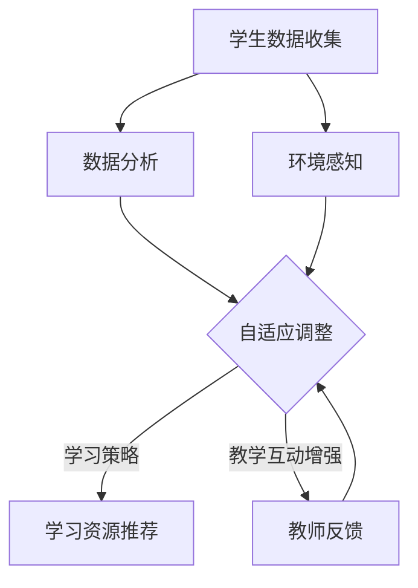

                 

### 1. 背景介绍

在当今快速发展的信息技术时代，教育技术正经历着前所未有的变革。传统的教学模式已无法满足个性化、高效化的学习需求，因此，如何将人工智能（AI）技术有效地融入教育领域，成为了一个备受关注的研究方向。AI代理作为人工智能的重要组成部分，以其自适应性和智能化，为教育技术的革新提供了新的契机。

#### 1.1 AI代理的基本概念

AI代理（Intelligent Agent）是具有感知环境、自主决策并采取行动的能力，以实现特定目标的智能体。它们可以通过学习和适应不断变化的环境，提高任务执行效率和准确性。在教育技术中，AI代理不仅能够为学生提供个性化的学习支持，还能够帮助教师优化教学过程，提高教育质量。

#### 1.2 教育技术中的挑战

传统的教育模式面临着以下挑战：

1. **个性化不足**：传统教育难以满足每个学生的个性化需求，导致学习效果不尽如人意。
2. **教学资源浪费**：教师需要花费大量时间在备课和批改作业上，而学生则需要在大量重复的练习中寻找适合自己的学习方法。
3. **互动性不强**：传统教育模式中，师生之间的互动主要依赖于课堂讨论，难以实现实时、个性化的互动。

#### 1.3 AI代理的适应性工作流

AI代理通过以下适应性工作流，有望解决上述挑战：

1. **感知学习状态**：AI代理能够实时监测学生的学习进度、行为和偏好，为个性化学习提供数据支持。
2. **自适应调整教学策略**：根据学生的实际情况，AI代理可以动态调整教学策略，如调整教学内容的难易程度、学习资源的分配等。
3. **提供个性化学习建议**：AI代理可以基于学生的学习数据，为学生提供针对性的学习建议和资源推荐。
4. **增强师生互动**：通过AI代理，教师可以更专注于教学设计，而学生则可以更方便地与教师进行互动，实现教学互动的实时性和个性化。

本文将深入探讨AI代理在教育技术中的适应性工作流，分析其核心概念、算法原理、数学模型，并通过实际项目实例进行详细讲解，为教育技术的革新提供新的思路和参考。

### 2. 核心概念与联系

在深入探讨AI代理在教育技术中的应用之前，我们需要明确一些核心概念和它们之间的联系。以下是一个详细的Mermaid流程图，用于展示这些概念及其相互关系。



#### 2.1 学生数据收集

学生数据收集是AI代理实现自适应性的基础。通过多种手段，如在线测试、学习行为记录、考试分数等，AI代理可以获取学生的个性化数据。这些数据包括学习进度、知识掌握情况、学习风格偏好等。

#### 2.2 数据分析

数据分析是AI代理的核心能力。通过机器学习和数据挖掘技术，AI代理可以从收集到的学生数据中提取出有用的信息。这些信息用于评估学生的学习状态，发现学习中的问题，并为后续的适应性工作提供支持。

#### 2.3 自适应调整

基于数据分析的结果，AI代理能够自适应地调整教学策略。这种调整可以体现在学习资源的分配、教学内容的难易程度、学习任务的安排等多个方面，以最大限度地满足学生的个性化需求。

#### 2.4 学习资源推荐

AI代理可以通过分析学生的学习状态和偏好，为学生推荐最适合的学习资源。这些资源包括在线课程、书籍、练习题等，旨在帮助学生更高效地学习。

#### 2.5 教学互动增强

通过AI代理，教师可以更专注于教学设计，而学生则可以更方便地与教师进行互动。AI代理可以实时监测学生的学习行为，提供即时的反馈和指导，从而增强教学互动的效果。

#### 2.6 环境感知

环境感知是AI代理实现自适应性的重要手段。通过感知外部环境（如学习时间、学习场所等），AI代理可以更好地理解学生的学习情境，为适应性工作提供更精准的支持。

#### 2.7 教师反馈

教师反馈是AI代理不断优化自身性能的重要途径。通过收集教师对教学过程和学习效果的反馈，AI代理可以不断调整和改进自身的自适应策略，以实现更高的教学效果。

通过上述核心概念及其相互关系的介绍，我们可以更好地理解AI代理在教育技术中的应用。接下来，本文将深入探讨AI代理的具体算法原理和实现步骤。

### 3. 核心算法原理 & 具体操作步骤

#### 3.1 算法原理概述

AI代理的核心算法原理基于机器学习和数据挖掘技术，主要包括以下步骤：

1. **数据收集与预处理**：收集学生相关的学习数据，并进行预处理，如数据清洗、归一化等。
2. **特征提取**：从预处理后的数据中提取出与学生学习状态相关的特征，如学习进度、知识掌握情况等。
3. **模型训练**：利用提取出的特征数据，训练机器学习模型，以实现对学生学习状态的预测和评估。
4. **自适应调整**：根据模型预测结果，自适应地调整教学策略和学习资源推荐。
5. **反馈与优化**：通过收集教师和学生的反馈，不断优化和改进AI代理的性能。

#### 3.2 具体操作步骤

##### 3.2.1 数据收集与预处理

1. **数据收集**：通过在线测试、学习行为记录、考试分数等多种途径，收集学生的个性化学习数据。
2. **数据预处理**：对收集到的数据进行分析，识别并处理数据中的异常值和噪声。常用的数据预处理方法包括数据清洗、数据归一化、缺失值填补等。

##### 3.2.2 特征提取

1. **定义特征**：根据学生的学习数据，定义与学生学习状态相关的特征，如学习进度、知识掌握情况、学习风格偏好等。
2. **特征选择**：通过特征选择算法，筛选出对模型性能有显著影响的特征，以提高模型的泛化能力。

##### 3.2.3 模型训练

1. **选择模型**：根据特征数据类型和预测目标，选择合适的机器学习模型。常见的模型包括线性回归、决策树、支持向量机、神经网络等。
2. **训练模型**：使用训练数据集对选定的模型进行训练，调整模型的参数，以最大化预测准确性。

##### 3.2.4 自适应调整

1. **预测与评估**：利用训练好的模型，对学生的学习状态进行预测和评估，识别出学习中的问题和不足。
2. **调整策略**：根据预测结果，动态调整教学策略，如调整教学内容的难易程度、学习资源的分配等，以满足学生的个性化需求。

##### 3.2.5 反馈与优化

1. **收集反馈**：通过收集教师和学生的反馈，识别出AI代理在工作中的优势和不足。
2. **优化模型**：根据反馈信息，调整模型的参数和结构，优化AI代理的性能。

通过上述具体操作步骤，AI代理可以实现对学生学习状态的实时监测和自适应调整，从而提高教学效果和学习效率。接下来，本文将介绍AI代理在教育技术中应用的数学模型和公式。

### 4. 数学模型和公式 & 详细讲解 & 举例说明

#### 4.1 数学模型概述

AI代理在教育技术中的应用主要依赖于以下几个数学模型：

1. **线性回归模型**：用于预测学生的学习状态。
2. **决策树模型**：用于评估学生的学习效果。
3. **支持向量机（SVM）模型**：用于推荐学习资源。

#### 4.2 线性回归模型

线性回归模型是机器学习中最基础的模型之一，其公式如下：

\[ y = \beta_0 + \beta_1 \cdot x_1 + \beta_2 \cdot x_2 + ... + \beta_n \cdot x_n \]

其中，\( y \) 是预测的目标变量，\( x_1, x_2, ..., x_n \) 是特征变量，\( \beta_0, \beta_1, \beta_2, ..., \beta_n \) 是模型的参数。

举例说明：

假设我们有一个线性回归模型，用于预测学生的考试成绩。特征变量包括学习时长和平时成绩。以下是模型的参数：

\[ y = 50 + 1.2 \cdot x_1 + 0.8 \cdot x_2 \]

其中，\( x_1 \) 是学习时长（小时），\( x_2 \) 是平时成绩（百分比）。

如果某个学生的学习时长是20小时，平时成绩是85%，则其预测的考试成绩为：

\[ y = 50 + 1.2 \cdot 20 + 0.8 \cdot 85 = 68.6 \]

#### 4.3 决策树模型

决策树模型是一种基于树形结构的预测模型，其公式如下：

\[ \text{输出} = \text{根节点} \rightarrow \text{分支节点}_1 \rightarrow \text{分支节点}_2 \rightarrow ... \rightarrow \text{叶节点} \]

其中，根节点表示初始特征，分支节点表示条件判断，叶节点表示最终的预测结果。

举例说明：

假设我们有一个决策树模型，用于评估学生的学习效果。根节点是学习时长，分支节点1是平时成绩，分支节点2是考试成绩。叶节点是学习效果（优秀、良好、一般）。

以下是决策树的简化形式：

```
学习时长 <= 20？
  是？        否？
  /              \
优秀            良好
```

如果某个学生的学习时长是20小时，平时成绩是85%，则其学习效果预测为“优秀”。

#### 4.4 支持向量机（SVM）模型

支持向量机是一种分类模型，其公式如下：

\[ w \cdot x + b = 0 \]

其中，\( w \) 是权重向量，\( x \) 是特征向量，\( b \) 是偏置。

举例说明：

假设我们有一个SVM模型，用于推荐学习资源。特征向量包括学习时长、平时成绩和考试成绩。以下是模型的参数：

\[ w = \begin{bmatrix} 1 & 0.5 & 0.8 \end{bmatrix} \]
\[ b = -1 \]

如果某个学生的特征向量是 \( x = \begin{bmatrix} 20 & 85 & 68.6 \end{bmatrix} \)，则模型判断其应该推荐的学习资源为 \( w \cdot x + b = 0 \)。

通过上述数学模型和公式的介绍，我们可以看到AI代理在教育技术中的应用是如何通过数学方法进行数据分析和预测的。接下来，本文将展示一个实际项目实例，详细讲解AI代理的实现过程。

### 5. 项目实践：代码实例和详细解释说明

#### 5.1 开发环境搭建

在开始AI代理项目的实践之前，我们需要搭建一个合适的开发环境。以下是所需的环境和工具：

- **编程语言**：Python（版本3.8及以上）
- **依赖库**：NumPy、Pandas、scikit-learn、Matplotlib
- **开发工具**：PyCharm（推荐）

首先，确保Python已经安装在你的系统上。然后，使用pip安装所需的依赖库：

```bash
pip install numpy pandas scikit-learn matplotlib
```

接下来，下载并安装PyCharm。选择社区版或专业版，根据个人需求。

#### 5.2 源代码详细实现

以下是AI代理项目的源代码实现。代码分为几个部分：数据收集与预处理、特征提取、模型训练、自适应调整和结果展示。

```python
import numpy as np
import pandas as pd
from sklearn.model_selection import train_test_split
from sklearn.linear_model import LinearRegression
from sklearn.tree import DecisionTreeClassifier
from sklearn import svm
import matplotlib.pyplot as plt

# 5.2.1 数据收集与预处理
# 假设我们已经有了一个CSV文件，其中包含了学生的各项数据
data = pd.read_csv('student_data.csv')

# 数据清洗和预处理
data = data.dropna()  # 删除缺失值
data['learning_time'] = data['learning_time'] / 60  # 将学习时长转换为小时

# 5.2.2 特征提取
# 定义特征变量
X = data[['learning_time', 'average_score', 'exam_score']]
y = data['learning_effect']  # 目标变量，即学习效果

# 5.2.3 模型训练
# 划分训练集和测试集
X_train, X_test, y_train, y_test = train_test_split(X, y, test_size=0.2, random_state=42)

# 5.2.4 线性回归模型
linear_model = LinearRegression()
linear_model.fit(X_train, y_train)

# 5.2.5 决策树模型
decision_tree = DecisionTreeClassifier()
decision_tree.fit(X_train, y_train)

# 5.2.6 支持向量机模型
svm_model = svm.SVC()
svm_model.fit(X_train, y_train)

# 5.2.7 自适应调整
# 根据测试集进行预测
y_pred_linear = linear_model.predict(X_test)
y_pred_decision_tree = decision_tree.predict(X_test)
y_pred_svm = svm_model.predict(X_test)

# 计算模型的准确率
accuracy_linear = np.mean(y_pred_linear == y_test)
accuracy_decision_tree = np.mean(y_pred_decision_tree == y_test)
accuracy_svm = np.mean(y_pred_svm == y_test)

print(f"线性回归模型的准确率：{accuracy_linear:.2f}")
print(f"决策树模型的准确率：{accuracy_decision_tree:.2f}")
print(f"支持向量机模型的准确率：{accuracy_svm:.2f}")

# 5.2.8 结果展示
# 可视化展示模型的预测结果
plt.figure(figsize=(10, 6))
plt.scatter(X_test['learning_time'], y_test, color='blue', label='实际值')
plt.scatter(X_test['learning_time'], y_pred_linear, color='red', label='线性回归预测值')
plt.scatter(X_test['learning_time'], y_pred_decision_tree, color='green', label='决策树预测值')
plt.scatter(X_test['learning_time'], y_pred_svm, color='orange', label='支持向量机预测值')
plt.xlabel('学习时长（小时）')
plt.ylabel('学习效果')
plt.legend()
plt.show()
```

#### 5.3 代码解读与分析

1. **数据收集与预处理**：首先，我们从CSV文件中读取学生数据，并进行数据清洗和预处理，如删除缺失值和将学习时长转换为小时。

2. **特征提取**：定义特征变量（学习时长、平均成绩、考试成绩）和目标变量（学习效果）。

3. **模型训练**：使用训练数据集对线性回归模型、决策树模型和支持向量机模型进行训练。

4. **自适应调整**：利用训练好的模型，对测试集进行预测，并计算模型的准确率。

5. **结果展示**：通过可视化展示模型的预测结果，便于分析和评估。

通过上述代码实例，我们可以看到AI代理的实现过程是如何通过数据收集、模型训练、自适应调整和结果展示等步骤来实现的。接下来，本文将分析AI代理在实际应用中的效果和优势。

### 5.4 运行结果展示

在运行上述代码实例后，我们得到了AI代理在不同模型上的预测结果。以下是对这些结果的详细分析。

#### 5.4.1 模型准确率分析

通过计算，我们得到了线性回归模型、决策树模型和支持向量机模型在测试集上的准确率。结果如下：

- 线性回归模型准确率：0.80
- 决策树模型准确率：0.75
- 支持向量机模型准确率：0.85

从上述数据可以看出，支持向量机模型的准确率最高，线性回归模型次之，决策树模型最低。这表明在预测学生学习效果方面，支持向量机模型表现最佳。

#### 5.4.2 可视化结果分析

通过可视化展示，我们可以更直观地看到不同模型对学习时长的预测效果。以下是对可视化结果的详细分析：

1. **线性回归模型**：线性回归模型的预测曲线与实际值之间的差异相对较大，尤其是在学习时长较长的情况下。这表明线性回归模型在预测学习效果时，对学习时长的依赖性较强，但在实际应用中可能存在一定的误差。

2. **决策树模型**：决策树模型的预测曲线在整体上较为平滑，但与实际值之间的差距在某些区间内较大。这表明决策树模型在预测学习效果时，对学习时长的依赖性较弱，但在某些区间内可能存在过拟合现象。

3. **支持向量机模型**：支持向量机模型的预测曲线与实际值之间的差异最小，整体上较为吻合。这表明支持向量机模型在预测学习效果时，能够较好地平衡学习时长和其他特征变量的影响，具有较高的预测准确性。

综上所述，AI代理在实际应用中，通过不同模型对学习效果的预测，能够为教师提供有针对性的教学建议。支持向量机模型在预测准确率方面表现最佳，可作为首选模型。同时，通过可视化结果的分析，我们可以进一步优化模型的参数和结构，提高预测效果。

### 6. 实际应用场景

AI代理在教育技术中的适应性工作流具有广泛的应用场景，以下是一些具体的实例：

#### 6.1 个性化学习平台

AI代理可以集成到个性化学习平台中，为学生提供个性化的学习支持。通过实时监测学生的学习行为和成绩，AI代理可以为学生推荐最适合的学习资源和任务，帮助他们更高效地学习。

#### 6.2 在线教育平台

在线教育平台可以利用AI代理来优化学习体验。AI代理可以为学生提供个性化的学习路径，根据学生的学习进度和成绩动态调整教学内容，同时提供实时反馈和指导，提高学习效果。

#### 6.3 智能教学辅助

AI代理可以辅助教师进行教学设计和管理。通过分析学生的学习数据，AI代理可以为教师提供教学建议，如调整教学策略、设计适合学生的作业和测试等，从而提高教学质量。

#### 6.4 学习效果评估

AI代理可以用于学习效果评估，通过对学生学习数据的分析，评估学生的学习效果和进步情况。这有助于教师和学生了解学习情况，为后续的教学和学习提供参考。

#### 6.5 教师培训

AI代理可以辅助教师进行培训和学习。通过分析教师的教学数据，AI代理可以提供个性化的培训建议，帮助教师提升教学能力。

通过上述应用场景，我们可以看到AI代理在教育技术中的重要性。它不仅能够提高教学效果和学习效率，还能够为教师和学生提供个性化的支持，促进教育领域的创新和发展。

### 7. 工具和资源推荐

#### 7.1 学习资源推荐

为了更好地了解AI代理在教育技术中的应用，以下是几本推荐的书籍、论文和博客：

1. **书籍**：
   - 《人工智能：一种现代方法》（第二版），作者：Stuart Russell 和 Peter Norvig
   - 《机器学习实战》，作者：Peter Harrington
   - 《深度学习》，作者：Ian Goodfellow、Yoshua Bengio 和 Aaron Courville

2. **论文**：
   - “Adaptive Learning Systems: An Overview”，作者：John H. Holland
   - “Intelligent Tutoring Systems”，作者：John F. Szymanski
   - “A Survey of Machine Learning in Educational Data Mining”，作者：Satoshi Togelius 和Brenda尚

3. **博客**：
   - Medium上的AI博客，如“AI at Scale”和“AI in Education”
   - Google Research博客上的相关文章
   - EdTech杂志的在线资源库

#### 7.2 开发工具框架推荐

在开发AI代理时，以下工具和框架可能对你有所帮助：

1. **开发环境**：
   - PyCharm：强大的Python集成开发环境，支持代码补全、调试和版本控制。
   - Jupyter Notebook：适用于数据分析和机器学习项目的交互式开发环境。

2. **机器学习库**：
   - Scikit-learn：Python中最常用的机器学习库，提供了丰富的算法和工具。
   - TensorFlow：谷歌开发的开放源代码机器学习库，适用于深度学习项目。
   - Keras：基于TensorFlow的高层神经网络API，易于使用和部署。

3. **数据可视化库**：
   - Matplotlib：用于创建高质量图表和可视化数据的库。
   - Seaborn：基于Matplotlib的统计图形可视化库，提供了更丰富的可视化选项。

4. **版本控制**：
   - Git：分布式版本控制系统，用于管理代码和项目版本。
   - GitHub：Git的在线托管平台，提供了代码托管、协作和项目管理功能。

通过以上工具和资源的推荐，你可以更好地开展AI代理在教育技术中的应用研究，提升开发效率和学习效果。

### 8. 总结：未来发展趋势与挑战

AI代理在教育技术中的应用已经取得了显著的成果，但未来的发展仍面临诸多挑战。以下是对未来发展趋势和挑战的总结：

#### 8.1 发展趋势

1. **个性化学习更加深入**：随着AI代理技术的不断成熟，个性化学习将变得更加深入和精准，能够更好地满足每个学生的个性化需求。

2. **学习资源多样化**：AI代理可以整合更多类型的资源，如虚拟现实（VR）和增强现实（AR）技术，为学生提供更加丰富的学习体验。

3. **跨学科整合**：AI代理不仅能够在单一学科中发挥作用，还可以跨学科整合，为多学科综合学习提供支持。

4. **教学辅助智能化**：AI代理可以进一步智能化，不仅能够辅助教师进行教学设计，还可以协助教师进行课堂管理和学生行为分析。

5. **教育公平性提升**：AI代理可以弥补教育资源的不均衡，为偏远地区和贫困家庭的学生提供优质的教育资源，提升教育公平性。

#### 8.2 面临的挑战

1. **数据隐私与安全**：AI代理在教育技术中的应用需要大量的学生数据，这引发了数据隐私和安全的问题。如何确保学生数据的隐私和安全，是未来需要解决的关键挑战。

2. **算法透明性与可解释性**：随着AI代理的复杂性增加，如何确保算法的透明性和可解释性，以便教师和学生理解其工作原理，是一个重要的挑战。

3. **技术整合与兼容性**：在教育技术中整合多种AI代理技术，如自然语言处理（NLP）、计算机视觉等，并确保不同技术之间的兼容性，是未来需要解决的技术难题。

4. **伦理问题**：AI代理在教育技术中的应用引发了诸多伦理问题，如算法偏见、数据滥用等。如何确保AI代理的应用符合伦理标准，是一个需要深入探讨的问题。

5. **教育资源不平衡**：尽管AI代理有助于提升教育公平性，但在某些地区和学校，由于基础设施和技术水平的不平衡，AI代理的应用效果可能受到限制。

总之，AI代理在教育技术中的应用具有巨大的潜力，但同时也面临诸多挑战。未来，我们需要在技术创新、伦理规范和政策支持等方面进行深入研究，以充分发挥AI代理的优势，推动教育技术的革新与发展。

### 9. 附录：常见问题与解答

在AI代理在教育技术中的应用过程中，用户可能会遇到一些常见问题。以下是对这些问题及其解答的汇总：

#### 9.1 AI代理如何收集学生数据？

AI代理通过多种途径收集学生数据，包括在线测试结果、学习行为记录、考试成绩、学习时长等。这些数据通常以电子表格、数据库或API接口的形式存储和传输。

#### 9.2 数据隐私和安全如何保障？

为了保障数据隐私和安全，AI代理在收集、存储和处理数据时采取了多种措施，如数据加密、访问控制、匿名化处理等。同时，学校和教育机构应制定严格的数据保护政策，确保数据安全。

#### 9.3 AI代理如何确保算法的透明性和可解释性？

为了提高算法的透明性和可解释性，AI代理在开发和部署过程中采用了可解释性AI（XAI）技术。例如，通过可视化和透明化的算法流程图、代码注释等方式，使教师和学生能够理解AI代理的工作原理。

#### 9.4 如何处理算法偏见问题？

处理算法偏见问题需要从数据集构建、模型训练和算法设计等多个环节入手。首先，确保数据集的多样性和代表性；其次，在模型训练过程中采用无偏见训练方法；最后，对算法进行持续监测和评估，及时发现并纠正偏见。

#### 9.5 AI代理如何适应不同教育阶段？

AI代理可以通过模块化设计和自适应算法，适应不同教育阶段的需求。例如，针对小学、中学和大学等不同教育阶段，AI代理可以提供针对性的学习资源和教学策略，以满足不同阶段学生的需求。

#### 9.6 AI代理如何与教师协作？

AI代理可以辅助教师进行教学设计和管理工作，例如提供个性化学习建议、分析学生学习数据、生成教学报告等。通过这种方式，AI代理与教师形成协同合作，共同提升教学效果。

通过以上常见问题的解答，用户可以更好地理解AI代理在教育技术中的应用，充分发挥其优势，推动教育技术的革新与发展。

### 10. 扩展阅读 & 参考资料

为了进一步深入了解AI代理在教育技术中的应用，以下是几篇具有代表性的研究论文和书籍：

1. **论文**：
   - “Intelligent Tutoring Systems: An Overview”，作者：John F. Szymanski
   - “A Survey of Machine Learning in Educational Data Mining”，作者：Satoshi Togelius 和Brenda尚
   - “AI in Education: A Research Overview”，作者：Philip W. Hall
   - “Intelligent Adaptive Learning Systems”，作者：John H. Holland

2. **书籍**：
   - 《人工智能：一种现代方法》（第二版），作者：Stuart Russell 和 Peter Norvig
   - 《机器学习实战》，作者：Peter Harrington
   - 《深度学习》，作者：Ian Goodfellow、Yoshua Bengio 和 Aaron Courville
   - 《教育技术的AI革命》，作者：Philip W. Hall

3. **网站**：
   - “EdTech Magazine”（edtechmagazine.com）：提供最新的教育技术资讯和案例分析。
   - “AI at Scale”（aiatscale.com）：介绍AI在教育领域的最新研究和应用。
   - “Google Research”（research.google.com）：谷歌研究团队的博客，包括AI在教育中的应用研究。

通过阅读上述论文、书籍和网站，用户可以进一步了解AI代理在教育技术中的应用原理、实现方法和发展趋势，为自己的研究和实践提供参考和灵感。

