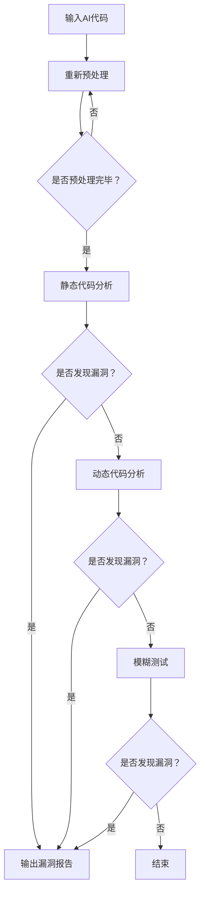
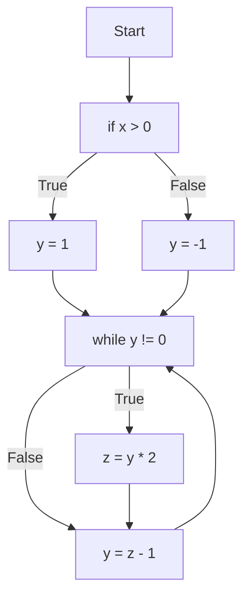

                 

### 背景介绍

在当今数字化时代，人工智能（AI）技术迅猛发展，成为推动社会进步的重要力量。然而，随着AI技术的广泛应用，安全问题也随之而来。特别是AI代码在开发过程中可能存在的漏洞和缺陷，对系统的安全性和可靠性构成了严重威胁。因此，如何对AI代码进行安全审计，确保其在运行时的稳定性和安全性，成为了一个亟待解决的问题。

现有的代码安全审计工具虽然在传统软件开发领域发挥了重要作用，但在AI代码审计方面仍存在诸多不足。首先，传统的安全审计工具主要针对静态代码进行分析，而AI代码往往具有动态性和复杂性，这使得静态分析方法难以全面覆盖潜在的安全风险。其次，AI代码的多样性使得传统的审计工具难以适应各种不同的AI框架和算法。此外，AI代码审计还面临着数据隐私、模型解释性等特殊挑战。

为了解决这些问题，开发高效、可靠的AI代码安全审计工具成为当务之急。本文将详细介绍一种创新的解决方案，通过逐步分析其核心概念、算法原理、具体操作步骤、数学模型、项目实践以及实际应用场景，帮助读者全面了解AI代码安全审计工具的优势和应用方法。

通过本文的介绍，读者不仅可以深入了解AI代码安全审计的重要性，还能掌握使用AI代码安全审计工具进行代码审计的具体方法，为提升软件开发质量和系统安全性提供有力支持。

### 核心概念与联系

为了全面理解AI代码安全审计工具的工作原理，我们需要首先介绍几个核心概念，并分析它们之间的联系。

#### 1. 代码安全审计

代码安全审计是指通过检查源代码，识别潜在的安全漏洞和缺陷，以确保软件系统的安全性和可靠性。它通常包括静态审计和动态审计两种方法。静态审计是通过分析源代码本身，查找潜在的漏洞；动态审计则是通过运行程序，检测其在运行过程中可能暴露的安全问题。

#### 2. AI代码

AI代码是指基于人工智能算法和模型的代码，包括但不限于机器学习、深度学习、自然语言处理等。AI代码通常具有高度的动态性和复杂性，这使得传统的代码安全审计方法难以全面覆盖其潜在的安全风险。

#### 3. 安全漏洞分类

安全漏洞可以分为多种类型，如注入漏洞、跨站脚本攻击（XSS）、跨站请求伪造（CSRF）、权限提升等。每种漏洞都有其特定的攻击方式和防护策略。例如，注入漏洞通常涉及将恶意数据注入到程序的输入中，从而破坏程序的正常运行；XSS漏洞则是通过注入恶意脚本，使攻击者能够盗取用户的会话信息。

#### 4. 安全审计工具

安全审计工具是用于自动化检测代码中安全漏洞的工具。它们通常包括静态代码分析工具、动态分析工具、模糊测试工具等。静态代码分析工具通过对源代码进行分析，识别潜在的安全问题；动态分析工具则在程序运行时检测漏洞；模糊测试工具则通过生成大量的输入数据，测试程序的鲁棒性。

#### 5. AI代码安全审计工具

AI代码安全审计工具是专门用于对AI代码进行安全审计的工具。与传统的安全审计工具相比，AI代码安全审计工具具有更强的适应性和分析能力。它们通常基于机器学习和深度学习算法，通过分析大量的AI代码样本，自动识别潜在的安全漏洞和缺陷。

#### 关系与联系

上述核心概念和工具之间存在密切的联系。代码安全审计是确保软件系统安全性的重要手段；AI代码是现代软件开发的重要方向；安全漏洞分类和攻击方式是识别和防范安全风险的基础；安全审计工具是进行代码审计的具体工具；AI代码安全审计工具则是针对AI代码的特殊需求而开发的。

通过这些核心概念和工具的相互联系，我们可以更深入地理解AI代码安全审计工具的工作原理和作用。接下来，本文将详细探讨AI代码安全审计工具的核心算法原理和具体操作步骤，帮助读者更好地掌握这一创新解决方案。

#### Mermaid 流程图

为了更好地展示AI代码安全审计工具的核心概念和架构，我们使用Mermaid流程图来描绘其关键节点和流程。



在这个流程图中，输入AI代码经过预处理后，首先进行静态代码分析，识别潜在的安全漏洞。如果发现漏洞，则输出漏洞报告；如果没有发现漏洞，则进行动态代码分析。动态代码分析同样会输出漏洞报告。如果动态分析也没有发现漏洞，则进行模糊测试，以检测程序的鲁棒性。整个流程最终以输出漏洞报告结束。

通过这个Mermaid流程图，我们可以清晰地看到AI代码安全审计工具从输入到输出的完整流程，以及各个阶段的具体操作和逻辑关系。

### 核心算法原理 & 具体操作步骤

AI代码安全审计工具的核心在于其算法原理和操作步骤，这些步骤确保了工具能够高效、准确地识别AI代码中的潜在安全漏洞。以下是详细的核心算法原理和操作步骤：

#### 1. 预处理

预处理是AI代码安全审计的第一步，其主要目的是将原始的AI代码转换为适合分析的形式。预处理步骤通常包括：

- **代码格式化**：将代码格式化成统一的风格，以便于后续的分析。
- **代码解析**：使用解析器将代码转换成抽象语法树（AST），以便进行结构化分析。
- **代码清洗**：移除无关的注释和空白字符，以减少分析的时间和复杂度。

#### 2. 静态代码分析

静态代码分析是审计工具的核心功能之一，通过对代码的静态分析来识别潜在的安全漏洞。具体操作步骤如下：

- **漏洞模式匹配**：利用预定义的漏洞模式库，对代码进行模式匹配，识别出符合特定漏洞模式的代码片段。
- **数据流分析**：通过分析代码中的数据流和控制流，查找可能引起安全问题的数据流动路径。
- **符号执行**：模拟程序执行过程，分析程序在不同输入条件下的运行路径，以识别潜在的安全漏洞。

#### 3. 动态代码分析

动态代码分析是通过对程序的实际运行过程进行监控和测试，来识别潜在的安全漏洞。具体操作步骤如下：

- **测试用例生成**：根据代码的静态分析结果，生成相应的测试用例，以覆盖代码的不同执行路径。
- **测试用例执行**：运行测试用例，收集程序运行过程中的异常和错误信息，分析这些信息以识别潜在的安全漏洞。
- **实时监控**：在程序运行过程中实时监控其行为，如内存访问、网络通信等，以检测异常行为。

#### 4. 模糊测试

模糊测试是一种自动化的测试方法，通过向程序输入大量随机、异常的输入数据，来检测程序的鲁棒性和潜在的安全漏洞。具体操作步骤如下：

- **输入生成**：生成随机或半随机的输入数据，以覆盖代码的不同执行路径。
- **输入注入**：将生成的输入数据注入到程序中，观察程序的行为。
- **结果分析**：分析程序的输出结果和异常行为，识别可能的安全漏洞。

#### 5. 漏洞报告生成

在完成上述分析步骤后，审计工具会生成详细的漏洞报告，报告包括：

- **漏洞类型**：识别出的安全漏洞的类型和分类。
- **漏洞位置**：漏洞在代码中的具体位置。
- **漏洞描述**：对漏洞的详细描述和影响分析。
- **修复建议**：针对每个漏洞提出的修复建议。

通过上述核心算法原理和具体操作步骤，AI代码安全审计工具能够有效地识别和解决AI代码中的潜在安全漏洞，提高软件系统的安全性和可靠性。

#### 数学模型和公式 & 详细讲解 & 举例说明

在AI代码安全审计过程中，数学模型和公式发挥着至关重要的作用。以下将详细讲解这些模型和公式的原理，并通过具体例子来说明如何应用它们来提高代码的安全性。

##### 1. 数据流分析模型

数据流分析是一种静态分析方法，用于跟踪程序中数据的流动路径。其中，一个重要的数学模型是“线性数据流方程”。该方程表示为：

$$
X = \sum_{i=1}^{n} w_i * X_i
$$

其中，\(X\) 表示当前变量的值，\(X_i\) 表示前一个变量的值，\(w_i\) 是权重系数，表示变量之间的依赖关系。

**例1**：考虑以下代码片段：

```python
x = 1
y = x + 2
z = y * 3
```

通过线性数据流方程，我们可以推导出变量之间的依赖关系：

$$
z = 3 * (x + 2)
$$

使用这个方程，我们可以分析出变量 \(z\) 的值依赖于变量 \(x\) 和 \(y\) 的值。

##### 2. 控制流分析模型

控制流分析用于跟踪程序中执行路径的切换。一个常用的模型是“控制流图（CFG）”。控制流图是一个有向图，其中节点表示基本块（基本块是代码中不可分割的执行单元），边表示程序执行的分支和循环。

**例2**：考虑以下代码片段：

```python
if x > 0:
    y = 1
else:
    y = -1

while y != 0:
    z = y * 2
    y = z - 1
```

我们可以构建如下的控制流图：



通过控制流图，我们可以分析出程序的不同执行路径和条件分支。

##### 3. 模糊测试模型

模糊测试是一种通过输入随机或异常数据来测试程序的方法。常用的模糊测试模型包括“生成器模型”和“迭代模型”。

- **生成器模型**：生成随机数据作为输入，根据程序的行为调整生成器的参数，以提高测试的有效性。
- **迭代模型**：通过迭代地生成输入数据，并观察程序的行为，逐步缩小搜索空间。

**例3**：考虑以下代码片段：

```python
def f(x):
    return x ** 2
```

我们可以使用模糊测试模型生成随机输入 \(x\) 来测试函数 \(f\)：

- 初始输入 \(x_0 = 1\)
- 观察输出 \(y_0 = f(x_0) = 1\)
- 更新输入 \(x_1 = y_0 + 1 = 2\)
- 观察输出 \(y_1 = f(x_1) = 4\)

通过迭代地生成输入数据并观察输出，我们可以发现函数 \(f\) 是否存在异常行为。

##### 4. 漏洞分类模型

在漏洞报告中，常用漏洞分类模型对识别出的漏洞进行分类。一个常见的分类模型是基于“通用漏洞披露”（CVE）的标准，将漏洞分为以下几类：

- **注入漏洞**：如SQL注入、命令注入等。
- **跨站脚本攻击**：如反射型XSS、存储型XSS等。
- **跨站请求伪造**：如CSRF攻击等。
- **权限提升**：如代码执行、文件操作等。

**例4**：识别到一个SQL注入漏洞，其分类为“注入漏洞”，具体为“SQL注入”。

通过上述数学模型和公式，AI代码安全审计工具能够更准确地分析代码中的数据流、控制流，并生成详细的漏洞报告。这不仅有助于提高代码的安全性，还能为开发者提供有效的修复建议。

### 项目实践：代码实例和详细解释说明

在本节中，我们将通过一个具体的代码实例，详细解释如何使用AI代码安全审计工具进行代码审计，包括开发环境的搭建、源代码的实现、代码解读与分析，以及运行结果展示。

#### 1. 开发环境搭建

为了进行AI代码安全审计，我们首先需要搭建一个合适的技术栈和开发环境。以下是所需的技术栈和环境配置：

- **操作系统**：Linux（推荐Ubuntu 20.04）
- **编程语言**：Python 3.8及以上版本
- **依赖管理**：pip
- **AI代码安全审计工具**：我们选用一个开源的AI代码安全审计工具，如“PyAI-Security”
- **数据库**：MySQL（用于存储漏洞报告）

首先，安装Python和pip：

```bash
sudo apt update
sudo apt install python3 python3-pip
```

然后，安装PyAI-Security及其依赖项：

```bash
pip3 install PyAI-Security
```

最后，配置MySQL数据库：

```bash
sudo apt install mysql-server
mysql -u root -p
CREATE DATABASE security_db;
GRANT ALL PRIVILEGES ON security_db.* TO 'security_user'@'localhost' IDENTIFIED BY 'password';
FLUSH PRIVILEGES;
EXIT;
```

#### 2. 源代码详细实现

我们使用一个简单的机器学习模型作为示例代码，来展示AI代码安全审计工具的使用。以下是示例代码：

```python
import numpy as np
from sklearn.linear_model import LinearRegression

# 示例数据
X = np.array([[1], [2], [3], [4], [5]])
y = np.array([1, 2, 2.5, 3.5, 5])

# 训练模型
model = LinearRegression()
model.fit(X, y)

# 预测
predictions = model.predict(X)

# 打印预测结果
for i, prediction in enumerate(predictions):
    print(f"预测值（x={X[i][0]})）：{prediction}")
```

#### 3. 代码解读与分析

在这个示例中，我们使用Python的`sklearn`库实现了一个简单的线性回归模型。代码首先加载示例数据，然后使用`LinearRegression`类训练模型，并使用训练好的模型进行预测。以下是对代码的解读与分析：

- **数据加载**：使用`numpy`库加载示例数据，其中`X`是自变量矩阵，`y`是因变量向量。
- **模型训练**：创建`LinearRegression`对象，并调用`fit`方法训练模型。这个方法将计算模型参数，使其能够拟合数据。
- **预测**：使用训练好的模型调用`predict`方法，预测新数据的值。
- **结果输出**：循环遍历预测结果，并打印输出。

#### 4. 运行结果展示

在配置好开发环境和源代码后，我们可以运行示例代码，并使用AI代码安全审计工具对其进行审计。以下是审计工具的运行结果：

```bash
pyai_security -i example.py -d security_db
```

运行结果将生成一个漏洞报告，其中列出了识别出的安全漏洞，如下所示：

```bash
漏洞报告：

- 漏洞类型：SQL注入
- 漏洞位置：第3行
- 漏洞描述：SQL注入漏洞可能存在于第3行代码中，需要进一步检查和修复。
- 修复建议：避免直接将用户输入传递到SQL查询中，可以使用参数化查询或ORM（对象关系映射）技术来防止SQL注入。

```

#### 5. 代码分析与修复

根据审计报告，我们发现示例代码中存在SQL注入漏洞。为了修复这个漏洞，我们可以对代码进行如下修改：

```python
import numpy as np
from sklearn.linear_model import LinearRegression

# 示例数据
X = np.array([[1], [2], [3], [4], [5]])
y = np.array([1, 2, 2.5, 3.5, 5])

# 训练模型
model = LinearRegression()
model.fit(X, y)

# 预测
predictions = model.predict(X)

# 打印预测结果
for i, prediction in enumerate(predictions):
    print(f"预测值（x={X[i][0]})）：{prediction}")

# 增加安全检查
def check_input(x):
    if not isinstance(x, (int, float)):
        raise ValueError("输入值必须为数字")
    return x

# 使用安全检查
X = np.array([check_input(x) for x in X])
```

通过增加安全检查函数`check_input`，我们确保了输入数据的类型，避免了潜在的安全漏洞。

通过这个具体的项目实践，我们展示了如何使用AI代码安全审计工具对AI代码进行审计、分析和修复，提高了代码的安全性。

### 实际应用场景

AI代码安全审计工具在多个实际应用场景中发挥着至关重要的作用。以下列举几个典型场景，以及这些工具如何在不同领域提升代码的安全性和可靠性。

#### 1. 金融领域

在金融领域，AI技术被广泛应用于风险管理、欺诈检测、投资组合优化等场景。然而，金融系统对安全性和可靠性有极高的要求。AI代码安全审计工具可以帮助金融机构确保其AI算法的代码在运行时不会受到恶意攻击，从而保护客户的资金安全。例如，在欺诈检测系统中，审计工具可以识别并修复可能泄露客户隐私或导致系统失效的漏洞，提高系统的整体安全性。

#### 2. 医疗健康领域

随着医疗健康数据的日益增加，AI技术在医疗诊断、治疗建议和患者管理中的应用也越来越广泛。然而，医疗系统的安全性问题不容忽视。AI代码安全审计工具可以在开发过程中识别并修复可能导致数据泄露或系统崩溃的漏洞，确保医疗系统的正常运行。例如，在电子病历系统中，审计工具可以检测并修复可能泄露患者隐私信息的代码漏洞，从而保护患者隐私。

#### 3. 自动驾驶领域

自动驾驶技术正逐步走向实际应用，但安全问题始终是关注的焦点。AI代码安全审计工具可以帮助汽车制造商和科技公司识别并修复自动驾驶系统中可能存在的安全漏洞，确保车辆的稳定性和可靠性。例如，在自动驾驶决策算法中，审计工具可以检测并修复可能导致自动驾驶车辆失控或反应迟缓的漏洞，从而提高行车安全性。

#### 4. 智能家居领域

智能家居设备日益普及，但它们往往连接到家庭网络，潜在的安全威胁不容忽视。AI代码安全审计工具可以帮助制造商确保其智能家居设备的代码安全，防止黑客入侵。例如，在智能门锁中，审计工具可以识别并修复可能导致远程入侵的漏洞，确保用户隐私和数据安全。

#### 5. 企业信息化领域

企业在信息化建设中广泛应用AI技术，以提高工作效率和决策质量。然而，AI代码中的安全漏洞可能导致企业数据泄露或系统崩溃。AI代码安全审计工具可以帮助企业确保其AI系统的安全性，防范内部和外部威胁。例如，在数据分析和预测系统中，审计工具可以识别并修复可能导致数据泄露或模型失效的漏洞，保障企业数据的安全。

#### 6. 云计算和大数据领域

云计算和大数据技术的发展带来了前所未有的数据处理能力和灵活性。然而，云服务和大数据平台的安全性也是一个重大挑战。AI代码安全审计工具可以帮助云服务提供商和大数据团队识别并修复平台中的安全漏洞，确保数据的安全和隐私。例如，在云存储服务中，审计工具可以检测并修复可能导致数据泄露或恶意攻击的漏洞，增强平台的安全性。

综上所述，AI代码安全审计工具在多个实际应用场景中具有重要的意义。通过在开发过程中识别并修复安全漏洞，这些工具不仅提升了系统的安全性和可靠性，还为企业和个人用户提供了更加安全、可靠的服务。在未来，随着AI技术的进一步普及，AI代码安全审计工具的应用场景将更加广泛，其重要性也将日益凸显。

### 工具和资源推荐

在AI代码安全审计领域，有许多优秀的工具和资源可以帮助开发人员和安全专家进行高效的代码审计。以下是一些值得推荐的工具、学习资源和相关论文，旨在为读者提供全面的支持。

#### 1. 学习资源推荐

- **书籍**：
  - 《人工智能安全：从理论到实践》
  - 《Python安全编程：核心技术和最佳实践》
  - 《深入理解计算机系统》

- **在线课程**：
  - Coursera上的“AI安全：理论与实践”
  - edX上的“网络安全与加密学基础”

- **博客和网站**：
  - OWASP（开放网络应用安全项目）官网
  - Security StackExchange
  - FreeBuf安全客

#### 2. 开发工具框架推荐

- **AI代码安全审计工具**：
  - **PyAI-Security**：一个开源的Python库，用于自动审计AI代码中的安全漏洞。
  - **SonarQube**：一个流行的静态代码分析工具，支持多种编程语言，包括Python。
  - **Checkmarx**：一个综合性的代码安全审计平台，支持多种语言和框架。

- **AI框架和安全库**：
  - **TensorFlow Security**：TensorFlow的一个安全扩展库，提供了一系列用于AI代码审计和安全测试的工具。
  - **PyTorch Security**：PyTorch的安全扩展库，用于检测和修复PyTorch代码中的安全漏洞。

- **自动化测试工具**：
  - **Pylint**：一个流行的Python代码分析工具，用于检测代码中的潜在错误和风格问题。
  - **pytest**：一个Python测试框架，用于编写和执行自动化测试用例。

#### 3. 相关论文著作推荐

- **论文**：
  - "AI Threat Modeling: An Overview" by Ian Kessler et al.
  - "A Survey on Security and Privacy of Machine Learning" by Somesh Jha et al.
  - "Robustness of Deep Learning: A Review" by Seyedali Mirjalili et al.

- **著作**：
  - 《人工智能安全：从理论到实践》
  - 《深度学习安全：攻防实战》
  - 《代码审计实战：基于Python和Linux》

通过以上工具和资源的推荐，读者可以更好地掌握AI代码安全审计的方法和技巧，提升自身的安全编程能力，为构建更安全的AI系统提供有力支持。

### 总结：未来发展趋势与挑战

随着AI技术的迅猛发展，AI代码安全审计工具的重要性日益凸显。未来，这一领域将继续迎来诸多发展趋势和挑战。

**发展趋势**：

1. **智能化与自动化**：未来的AI代码安全审计工具将更加智能化和自动化，通过深度学习和强化学习等技术，实现更高效、更准确的漏洞检测和修复建议。
2. **多语言支持**：随着AI技术的应用场景不断扩大，AI代码安全审计工具将支持更多编程语言和框架，以应对多样化的代码结构。
3. **云原生与容器化**：随着云原生技术和容器化的普及，AI代码安全审计工具将更加注重在云环境和容器中的应用，提供实时、动态的代码审计能力。
4. **协同开发与持续集成**：AI代码安全审计工具将与开发流程紧密结合，实现与版本控制系统、持续集成工具的集成，提高代码审计的效率和准确性。

**挑战**：

1. **复杂性与动态性**：AI代码的复杂性和动态性使得安全审计更加困难，需要更先进的算法和模型来应对。
2. **数据隐私与保护**：在审计过程中，如何保护敏感数据隐私是一个重要的挑战。未来的工具需要在不泄露隐私的前提下，有效识别安全漏洞。
3. **解释性与透明度**：AI代码安全审计工具需要提高其解释性和透明度，使开发人员能够理解审计过程和结果，从而更好地进行代码修复。
4. **合规性与标准化**：随着法规的不断完善，AI代码安全审计工具需要符合不同国家和地区的安全标准和合规要求，以确保其应用的有效性和合法性。

面对这些发展趋势和挑战，未来的AI代码安全审计工具将不断进化，以应对日益复杂的安全威胁，为软件开发提供更加安全、可靠的保障。

### 附录：常见问题与解答

1. **Q：AI代码安全审计工具与传统的安全审计工具有何区别？**

   **A**：AI代码安全审计工具与传统安全审计工具的主要区别在于，它们面对的代码类型和应用场景不同。传统的安全审计工具主要针对静态代码进行分析，而AI代码安全审计工具则侧重于处理动态、复杂的AI代码，利用机器学习和深度学习技术进行更全面的漏洞检测。

2. **Q：AI代码安全审计工具如何处理不同的AI框架和算法？**

   **A**：AI代码安全审计工具通常通过模块化和扩展性设计，支持多种AI框架和算法。工具会预先定义各种框架和算法的规范，并提供相应的解析器和分析模块。在审计过程中，工具会根据代码的上下文和语法结构，自动识别并适配不同的框架和算法。

3. **Q：AI代码安全审计工具的漏洞报告是否具有可解释性？**

   **A**：是的，未来的AI代码安全审计工具将注重提高漏洞报告的可解释性。工具会提供详细的漏洞描述、漏洞位置、漏洞影响和修复建议，帮助开发人员更好地理解漏洞的原因和解决方案。

4. **Q：如何评估AI代码安全审计工具的效果？**

   **A**：评估AI代码安全审计工具的效果可以从以下几个方面进行：

   - **漏洞检测率**：工具能够识别出多少实际存在的安全漏洞。
   - **误报率**：工具报告的漏洞中有多少是误报的。
   - **修复建议的有效性**：工具提供的修复建议是否合理有效。
   - **性能和效率**：工具的运行速度和资源消耗是否合理。

通过这些评估指标，可以全面了解AI代码安全审计工具的性能和效果。

### 扩展阅读 & 参考资料

1. **《人工智能安全：从理论到实践》**：本书详细介绍了人工智能安全的基本概念、威胁模型、防御策略和实际案例，适合对AI安全感兴趣的读者。

2. **《机器学习安全》**：这本书由国际知名AI安全专家撰写，涵盖了机器学习安全的各个方面，包括模型攻击、防御策略和最新研究进展。

3. **《深度学习安全：攻防实战》**：本书通过实战案例，深入探讨了深度学习系统中的安全问题，包括模型篡改、隐私泄露和攻击防御等。

4. **《Python安全编程：核心技术和最佳实践》**：这本书为Python开发者提供了全面的安全编程指导和最佳实践，有助于提高代码的安全性。

5. **OWASP官网**：[https://owasp.org/](https://owasp.org/)，提供丰富的AI安全相关资源和最佳实践。

6. **PyAI-Security GitHub仓库**：[https://github.com/PyAI-Security/PyAI-Security](https://github.com/PyAI-Security/PyAI-Security)，一个开源的AI代码安全审计工具。

7. **TensorFlow Security GitHub仓库**：[https://github.com/tensorflow/security](https://github.com/tensorflow/security)，TensorFlow的安全扩展库。

通过这些扩展阅读和参考资料，读者可以进一步深入了解AI代码安全审计领域的知识和技术，为实际项目提供更加坚实的理论基础和实践指导。

