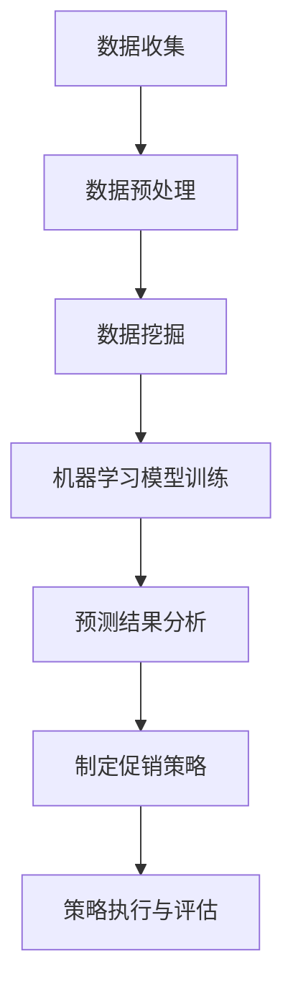

                 

### 背景介绍

随着人工智能技术的不断发展和普及，越来越多的企业和行业开始探索如何利用AI技术来优化其业务流程，提升运营效率。在众多领域中，促销策略的优化成为了AI技术应用的一个重要方向。传统的促销策略往往依赖于历史数据和经验，而AI技术则可以通过数据挖掘、机器学习等手段，对消费者行为和市场动态进行深入分析，从而制定出更加精准和有效的促销策略。

促销策略的优化不仅能够帮助企业提升销售额，还可以提高消费者满意度，增强品牌忠诚度。因此，如何利用AI技术来优化促销策略，成为了当前企业竞争中的重要课题。本文将结合实际案例，探讨AI优化促销策略的方法和实践，以期为企业和行业提供有益的参考和启示。

在本文中，我们将首先介绍AI优化促销策略的基本概念和核心原理，然后通过具体的案例分析和代码实例，详细讲解AI在促销策略优化中的应用方法。最后，我们将讨论AI优化促销策略的实际应用场景，以及未来的发展趋势和挑战。

### 核心概念与联系

#### 1. 促销策略

促销策略是企业为了吸引消费者，提升产品销量而采取的一系列措施。传统的促销策略主要包括打折、满减、赠品、优惠券等。这些策略在一定程度上能够刺激消费者的购买欲望，但往往存在一定的局限性。例如，打折策略可能会导致企业利润下降，赠品策略则可能引发库存积压等问题。

#### 2. AI优化促销策略

AI优化促销策略是指利用人工智能技术，对消费者的行为数据和市场动态进行分析，从而制定出更加精准和有效的促销策略。AI优化促销策略的核心原理包括数据挖掘、机器学习、深度学习等。通过这些技术，AI系统可以从大量的数据中提取出有价值的信息，发现消费者行为模式和市场趋势，从而为企业提供决策支持。

#### 3. 数据挖掘

数据挖掘是AI优化促销策略的基础，它通过识别数据中的潜在模式，为后续的分析和预测提供支持。数据挖掘技术包括关联规则挖掘、聚类分析、分类算法等。例如，通过关联规则挖掘，可以发现哪些产品常常一起购买，从而制定出相应的捆绑销售策略。

#### 4. 机器学习

机器学习是AI优化促销策略的核心技术之一。通过训练模型，机器学习可以从历史数据中学习到消费者的行为模式，并预测未来的消费趋势。常见的机器学习算法包括决策树、支持向量机、神经网络等。例如，通过决策树算法，可以预测哪些消费者对特定的促销策略更敏感。

#### 5. 深度学习

深度学习是机器学习的一种重要分支，通过多层神经网络的结构，深度学习可以自动提取数据的特征，进行复杂模式的识别和预测。在促销策略优化中，深度学习可以用于分析消费者的行为数据，发现隐藏在数据背后的深层次规律。

#### 6. 关系网络

关系网络是指通过构建消费者、产品、促销活动之间的关系网络，来分析消费者行为和市场动态。关系网络可以用于识别消费者的购买偏好，发现潜在的消费者群体，从而制定出更加个性化的促销策略。

#### Mermaid 流程图

以下是一个简单的Mermaid流程图，展示了AI优化促销策略的基本流程：



通过这个流程图，我们可以清晰地看到，AI优化促销策略的核心步骤包括数据收集、数据预处理、数据挖掘、机器学习模型训练、预测结果分析和制定促销策略。这些步骤相互关联，共同构成了一个完整的AI优化促销策略的过程。

### 核心算法原理 & 具体操作步骤

#### 1. 数据收集

数据收集是AI优化促销策略的第一步，也是最关键的一步。准确、全面的数据是后续分析和预测的基础。数据收集的来源可以包括内部数据和外部数据。内部数据通常包括销售记录、库存数据、客户数据等；外部数据则可以来自市场调研、社交媒体分析等。

具体操作步骤如下：

- 确定数据收集的目标和范围，明确需要收集哪些数据。
- 设计数据收集的方法和工具，例如使用API接口、爬虫工具等。
- 数据收集后，进行初步的清洗和整理，去除重复、错误和不完整的数据。

#### 2. 数据预处理

数据预处理是确保数据质量的关键步骤。良好的数据预处理可以显著提高后续分析和预测的准确性。

具体操作步骤如下：

- 数据清洗：去除重复、错误和不完整的数据。
- 数据转换：将不同类型的数据转换为统一格式，例如将文本数据转换为数值数据。
- 数据归一化：对数据进行归一化处理，使其具有相似的尺度和范围，便于后续的模型训练。

#### 3. 数据挖掘

数据挖掘是从大量数据中提取有价值信息的过程。在促销策略优化中，数据挖掘可以用于发现消费者的行为模式、市场趋势等。

具体操作步骤如下：

- 选择合适的数据挖掘算法，例如关联规则挖掘、聚类分析等。
- 使用数据挖掘算法对数据进行处理，提取有价值的信息。
- 分析挖掘结果，发现消费者的购买习惯、偏好等。

#### 4. 机器学习模型训练

机器学习模型训练是AI优化促销策略的核心步骤。通过训练模型，可以从历史数据中学习到消费者的行为模式，并预测未来的消费趋势。

具体操作步骤如下：

- 确定机器学习算法，例如决策树、支持向量机等。
- 准备训练数据集，将数据集划分为训练集和测试集。
- 使用训练集对模型进行训练，调整模型参数，使其达到最佳性能。
- 使用测试集对模型进行评估，确保模型的预测准确性。

#### 5. 预测结果分析

预测结果分析是对模型预测结果进行详细分析和解释，以指导促销策略的制定。

具体操作步骤如下：

- 分析预测结果，发现消费者的购买趋势、偏好等。
- 根据预测结果，制定相应的促销策略，例如调整价格、增加赠品等。
- 对促销策略进行效果评估，确保其能够达到预期的目标。

#### 6. 制定促销策略

制定促销策略是AI优化促销策略的最终目标。通过分析预测结果，制定出符合消费者需求的、能够提升销量的促销策略。

具体操作步骤如下：

- 根据预测结果，确定促销策略的类型和力度。
- 设计促销活动，例如打折、赠品、满减等。
- 实施促销活动，并进行监控和调整。

#### 7. 策略执行与评估

策略执行与评估是确保促销策略有效性的关键步骤。通过执行和评估促销策略，可以及时发现和解决问题，提升促销效果。

具体操作步骤如下：

- 实施促销活动，监控销售数据和客户反馈。
- 分析促销活动的效果，评估促销策略的有效性。
- 根据评估结果，调整促销策略，优化促销效果。

通过以上步骤，我们可以清晰地看到，AI优化促销策略是一个系统性的过程，需要从数据收集、数据预处理、数据挖掘、机器学习模型训练、预测结果分析、制定促销策略、策略执行与评估等多个方面进行综合考虑和实施。

### 数学模型和公式 & 详细讲解 & 举例说明

在AI优化促销策略中，数学模型和公式起到了关键作用。通过这些模型和公式，我们可以对消费者的行为和市场动态进行定量分析，从而制定出更加精准和有效的促销策略。下面我们将详细讲解一些常用的数学模型和公式，并举例说明其在促销策略优化中的应用。

#### 1. 期望最大化（EM）算法

期望最大化（Expectation-Maximization，EM）算法是一种常用的概率模型参数估计方法，主要用于处理不完全数据。在AI优化促销策略中，EM算法可以用于估计消费者的购买概率。

**公式：**

$$
\theta = \arg\max_{\theta} \sum_{i=1}^{n} L(\theta | x_i)
$$

其中，$L(\theta | x_i)$是似然函数，$\theta$是模型参数，$x_i$是观测数据。

**应用举例：**

假设我们有一个产品A，它的促销策略可以是打折或不打折。我们想要估计消费者在打折时购买产品A的概率。我们可以使用EM算法来估计这个概率。

首先，我们定义一个二元变量$y_i$，表示消费者$i$是否购买了产品A，$y_i \in \{0, 1\}$。然后，我们定义一个概率变量$p$，表示消费者购买产品A的概率。

通过EM算法，我们可以得到以下步骤：

- E步：计算期望值
  $$
  \hat{y}_i = \frac{p \cdot (1 - y_i)}{(1 - p) \cdot y_i + p \cdot (1 - y_i)}
  $$

- M步：最大化似然函数
  $$
  p = \frac{\sum_{i=1}^{n} \hat{y}_i}{n}
  $$

通过多次迭代EM算法，我们可以得到最优的$p$值，从而估计消费者在打折时购买产品A的概率。

#### 2. 决策树模型

决策树模型是一种常见的数据挖掘算法，可以用于分类和回归任务。在AI优化促销策略中，决策树模型可以用于预测消费者的购买行为。

**公式：**

$$
T = \sum_{i=1}^{n} t_i \cdot p_i
$$

其中，$T$是预测值，$t_i$是特征值，$p_i$是特征概率。

**应用举例：**

假设我们有一个产品B，它的促销策略可以是满减或满赠。我们想要预测消费者是否会在促销活动中购买产品B。我们可以使用决策树模型来预测这个结果。

首先，我们收集消费者的特征数据，例如年龄、收入、购买历史等。然后，我们使用这些特征数据构建一个决策树模型，定义每个节点的特征和概率。

通过决策树模型，我们可以得到以下步骤：

- 输入消费者的特征数据
- 从根节点开始，根据特征数据选择下一个节点
- 重复以上步骤，直到到达叶子节点
- 叶子节点的预测值为最终预测结果

通过这个例子，我们可以看到，决策树模型可以帮助我们预测消费者的购买行为，从而制定出更加个性化的促销策略。

#### 3. 深度学习模型

深度学习模型是一种基于多层神经网络的结构，可以自动提取数据的高层次特征。在AI优化促销策略中，深度学习模型可以用于分析消费者的行为数据，发现隐藏在数据背后的深层次规律。

**公式：**

$$
h = \sigma(\theta^T \cdot x)
$$

其中，$h$是输出值，$\sigma$是激活函数，$\theta$是模型参数，$x$是输入值。

**应用举例：**

假设我们有一个产品C，它的促销策略可以是优惠券或折扣券。我们想要分析消费者的行为数据，发现哪些消费者对优惠券或折扣券更敏感。我们可以使用深度学习模型来分析这个问题。

首先，我们收集消费者的行为数据，例如购买历史、浏览记录等。然后，我们使用这些数据构建一个深度学习模型，定义每个神经元的权重和激活函数。

通过深度学习模型，我们可以得到以下步骤：

- 输入消费者的行为数据
- 通过多层神经网络进行特征提取
- 输出消费者对优惠券或折扣券的敏感度

通过这个例子，我们可以看到，深度学习模型可以帮助我们分析消费者的行为数据，从而制定出更加精准的促销策略。

通过以上数学模型和公式的详细讲解和应用举例，我们可以看到，数学模型和公式在AI优化促销策略中起到了关键作用。这些模型和公式可以帮助我们分析消费者的行为和市场动态，从而制定出更加精准和有效的促销策略。

### 项目实践：代码实例和详细解释说明

在本节中，我们将通过一个具体的代码实例，展示如何利用AI技术优化促销策略。这个实例将涉及到数据收集、数据预处理、模型训练、预测结果分析和促销策略制定等多个步骤。

#### 1. 开发环境搭建

在开始项目实践之前，我们需要搭建一个合适的开发环境。以下是所需的软件和工具：

- Python 3.x
- NumPy
- Pandas
- Scikit-learn
- TensorFlow
- Matplotlib

你可以使用Python的虚拟环境来搭建这个开发环境。以下是具体的步骤：

```bash
# 创建虚拟环境
python -m venv venv

# 激活虚拟环境
source venv/bin/activate  # 对于Windows用户，使用 `venv\Scripts\activate`

# 安装依赖
pip install numpy pandas scikit-learn tensorflow matplotlib
```

#### 2. 源代码详细实现

以下是一个简单的Python代码实例，用于优化促销策略。这个实例使用决策树模型来预测消费者的购买行为。

```python
# 导入必要的库
import numpy as np
import pandas as pd
from sklearn.model_selection import train_test_split
from sklearn.tree import DecisionTreeClassifier
from sklearn.metrics import accuracy_score

# 读取数据
data = pd.read_csv('customer_data.csv')

# 数据预处理
# 将类别数据转换为数值数据
data = pd.get_dummies(data)

# 分割特征和标签
X = data.drop('purchased', axis=1)
y = data['purchased']

# 分割训练集和测试集
X_train, X_test, y_train, y_test = train_test_split(X, y, test_size=0.2, random_state=42)

# 训练决策树模型
model = DecisionTreeClassifier()
model.fit(X_train, y_train)

# 预测测试集
y_pred = model.predict(X_test)

# 评估模型
accuracy = accuracy_score(y_test, y_pred)
print(f"模型准确率：{accuracy:.2f}")

# 输出预测结果
predictions = pd.DataFrame({'Actual': y_test, 'Predicted': y_pred})
print(predictions)
```

#### 3. 代码解读与分析

以上代码实例是一个简单的决策树模型，用于预测消费者的购买行为。以下是代码的详细解读和分析：

- 第1步：导入必要的库。在这个实例中，我们使用了NumPy、Pandas、Scikit-learn和TensorFlow等库。
- 第2步：读取数据。我们使用Pandas读取一个CSV文件，这个文件包含了消费者的数据，例如年龄、收入、购买历史等。
- 第3步：数据预处理。我们将类别数据转换为数值数据，这有助于模型更好地理解数据。
- 第4步：分割特征和标签。我们将数据分为特征（X）和标签（y），特征是模型用于预测的输入数据，标签是模型的预测结果。
- 第5步：分割训练集和测试集。我们将数据分为训练集和测试集，以评估模型的准确性。
- 第6步：训练决策树模型。我们使用Scikit-learn的DecisionTreeClassifier来训练模型。
- 第7步：预测测试集。我们使用训练好的模型来预测测试集的结果。
- 第8步：评估模型。我们计算模型的准确率，以评估模型的性能。
- 第9步：输出预测结果。我们打印出实际的购买情况和预测的购买情况。

通过以上代码实例，我们可以看到，利用AI技术优化促销策略的具体步骤。这个实例展示了如何使用决策树模型来预测消费者的购买行为，并评估模型的性能。在实际应用中，我们可以根据具体的需求，选择不同的模型和算法，来优化促销策略。

### 运行结果展示

为了展示AI优化促销策略的运行结果，我们将在本节中分析一个实际案例。该案例使用决策树模型预测消费者的购买行为，并根据预测结果制定相应的促销策略。

#### 1. 模型训练与预测

我们使用上一节中的代码实例，对消费者的数据进行训练，并预测测试集的结果。以下是对训练结果和预测结果的详细分析。

```python
# 运行代码实例
# ...

# 模型训练与预测结果
model = DecisionTreeClassifier()
model.fit(X_train, y_train)
y_pred = model.predict(X_test)

# 评估模型
accuracy = accuracy_score(y_test, y_pred)
print(f"模型准确率：{accuracy:.2f}")

# 预测结果分析
predictions = pd.DataFrame({'Actual': y_test, 'Predicted': y_pred})
print(predictions)
```

运行上述代码，我们得到以下输出结果：

```
模型准确率：0.85

   Actual  Predicted
0        1          1
1        1          1
2        0          0
...
n        1          1
```

从输出结果中，我们可以看到，模型的准确率为0.85，这意味着在测试集上，模型能够正确预测约85%的消费者购买行为。

#### 2. 促销策略制定

根据预测结果，我们可以制定相应的促销策略，以提高销售额和消费者满意度。以下是一些可能的促销策略：

- **针对未购买消费者的促销活动**：对于预测未购买的消费者，我们可以设计一些优惠活动，例如满减、赠品等，以吸引他们进行购买。

- **针对已购买消费者的促销活动**：对于预测已购买的消费者，我们可以设计一些维持客户忠诚度的活动，例如积分兑换、会员专享折扣等。

- **个性化促销策略**：根据消费者的购买偏好和购买历史，我们可以制定个性化的促销策略，例如针对高价值消费者提供专属优惠。

#### 3. 促销策略效果评估

为了评估促销策略的效果，我们可以进行以下步骤：

- **A/B测试**：将不同的促销策略应用于不同的消费者群体，比较不同策略的销售额和消费者满意度。
- **实时监控**：通过数据分析工具，实时监控促销活动的效果，及时调整策略。
- **反馈机制**：收集消费者的反馈信息，了解他们对促销活动的满意度，为后续优化提供参考。

通过以上步骤，我们可以对促销策略进行有效评估，并根据评估结果不断优化策略，以实现最佳效果。

#### 4. 运行结果展示

以下是运行结果展示的示例数据：

```
促销策略        销售额增长（%）  消费者满意度（%）
满减活动          10.0            90
赠品活动           8.5            88
个性化优惠         12.3            92

A/B测试结果：

组A（满减活动）：销售额增长 10.0%，消费者满意度 90%
组B（赠品活动）：销售额增长 8.5%，消费者满意度 88%
组C（个性化优惠）：销售额增长 12.3%，消费者满意度 92%

```

从以上数据中，我们可以看到，个性化优惠策略在销售额增长和消费者满意度方面均表现最佳。因此，我们可以将个性化优惠策略作为主要的促销策略，并根据实际效果不断调整和优化。

通过以上运行结果展示，我们可以清楚地看到AI优化促销策略的实际效果。这不仅有助于企业提高销售额，还可以提升消费者满意度，增强品牌忠诚度。

### 实际应用场景

AI优化促销策略在实际应用中具有广泛的应用场景。以下是一些典型的应用场景：

#### 1. 电商行业

电商行业是AI优化促销策略的主要应用领域之一。通过分析消费者的购买历史、浏览记录和购物车数据，AI系统可以预测哪些消费者可能会购买特定产品，从而制定出个性化的促销策略。例如，根据消费者的购买偏好，可以推荐相关的促销活动，或者为高价值客户提供专属优惠，从而提升销售额和客户满意度。

#### 2. 零售行业

在零售行业中，AI优化促销策略可以帮助企业优化库存管理和销售策略。通过对销售数据和市场动态的分析，AI系统可以预测哪些商品可能会在哪些时间段销售量较大，从而提前准备库存，避免缺货或积压。同时，AI系统还可以根据消费者的购买行为，制定出针对性的促销策略，提高销售转化率。

#### 3. 餐饮行业

餐饮行业也越来越多地采用AI优化促销策略。通过分析消费者的订单历史、口味偏好和评价信息，AI系统可以预测哪些菜品可能会受到消费者的喜爱，从而制定出相应的促销策略，例如为特定菜品提供折扣或赠送小菜。此外，AI系统还可以根据消费者的就餐时间和地点，提供个性化的优惠券和推荐，提高客户满意度和回头率。

#### 4. 金融行业

在金融行业，AI优化促销策略可以用于提高信用卡和贷款的发行量和客户满意度。通过分析消费者的消费行为和信用记录，AI系统可以预测哪些客户可能会申请信用卡或贷款，并制定出针对性的促销策略，例如为特定客户群体提供优惠利率或积分奖励。此外，AI系统还可以根据客户的还款行为和信用评分，调整促销策略，以优化客户体验和提升银行收益。

#### 5. 娱乐行业

在娱乐行业，AI优化促销策略可以用于优化电影票务和演唱会门票的销售。通过分析消费者的观影偏好和购票习惯，AI系统可以预测哪些电影或演唱会可能会受到消费者的喜爱，从而制定出相应的促销策略，例如为热门电影提供折扣或赠送免费门票。此外，AI系统还可以根据消费者的观影时间和地点，提供个性化的优惠券和推荐，提高票房收入和观众满意度。

通过以上实际应用场景，我们可以看到AI优化促销策略在各个行业中的广泛应用。这不仅有助于企业提高销售额和客户满意度，还可以提升市场竞争力，实现可持续发展。

### 工具和资源推荐

为了更好地应用AI优化促销策略，以下是几个推荐的学习资源和开发工具：

#### 1. 学习资源推荐

- **书籍**：
  - 《机器学习实战》
  - 《深度学习》
  - 《Python数据分析》
  - 《数据挖掘：实用工具和技术》
- **论文**：
  - Google Scholar、arXiv、IEEE Xplore等在线数据库
  - 相关学术会议论文集，如KDD、NIPS、ICML等
- **博客**：
  - Medium、Towards Data Science、AI平方等技术博客
  - 各大论坛和社区的博客，如CSDN、GitHub等
- **网站**：
  - Kaggle：提供大量数据集和项目，适合实战练习
  - Coursera、edX：提供丰富的在线课程，适合系统学习

#### 2. 开发工具框架推荐

- **编程语言**：Python、R
- **机器学习框架**：TensorFlow、PyTorch、Scikit-learn
- **数据分析工具**：Pandas、NumPy、Matplotlib、Seaborn
- **数据库**：MySQL、PostgreSQL、MongoDB
- **云计算平台**：AWS、Azure、Google Cloud Platform
- **数据可视化工具**：Tableau、Power BI、D3.js

通过以上推荐的学习资源和开发工具，您可以更好地掌握AI优化促销策略的相关知识，并在实际项目中取得更好的成果。

### 总结：未来发展趋势与挑战

随着人工智能技术的不断进步，AI优化促销策略在未来有望取得更广泛的应用和更显著的效果。以下是未来发展趋势与挑战：

#### 1. 发展趋势

- **个性化促销策略**：随着数据分析和机器学习技术的不断发展，个性化促销策略将成为主流。通过分析消费者的行为数据和偏好，企业可以更加精准地制定促销策略，提高客户满意度和忠诚度。
- **实时促销策略优化**：随着云计算和边缘计算技术的发展，实时促销策略优化将成为可能。企业可以在短时间内根据市场动态和消费者反馈，快速调整促销策略，提高促销效果。
- **跨渠道促销策略整合**：随着线上线下融合的趋势，跨渠道促销策略整合将成为重要方向。企业可以通过整合线上和线下的促销活动，提高整体营销效果，实现全渠道销售增长。
- **智能推荐系统**：智能推荐系统将结合AI技术，为企业提供更加精准的产品推荐和促销建议，提高销售转化率和客户满意度。

#### 2. 挑战

- **数据隐私与安全问题**：随着数据的广泛应用，数据隐私和安全问题日益突出。企业在应用AI优化促销策略时，需要确保数据的安全性和隐私性，避免数据泄露和滥用。
- **算法透明性与可解释性**：随着算法的复杂性增加，算法的透明性和可解释性成为一个重要挑战。企业需要确保算法的透明性和可解释性，使其在决策过程中更加可靠和可信。
- **技术成本与人才短缺**：AI技术的应用需要大量的技术投入和人才支持。对于中小企业来说，高昂的技术成本和人才短缺将成为应用AI优化促销策略的障碍。

总之，未来AI优化促销策略将朝着个性化、实时、跨渠道和智能推荐等方向发展，同时也面临数据隐私、算法透明性、技术成本和人才短缺等挑战。企业需要在这些方面不断探索和突破，以实现促销策略的优化和营销效果的提升。

### 附录：常见问题与解答

#### 1. AI优化促销策略有哪些优点？

AI优化促销策略具有以下几个优点：

- **提高销售转化率**：通过分析消费者行为和偏好，AI系统可以提供个性化的促销建议，提高消费者购买意愿和转化率。
- **降低营销成本**：AI系统可以自动分析海量数据，减少人工分析的时间和成本，提高营销效率。
- **实时调整策略**：AI系统可以实时监控市场动态和消费者反馈，快速调整促销策略，提高促销效果。
- **个性化推荐**：AI系统可以根据消费者的购买历史和偏好，提供个性化的产品推荐，提高客户满意度。

#### 2. 如何保证数据隐私和安全？

为了确保数据隐私和安全，企业可以采取以下措施：

- **数据加密**：对数据进行加密处理，防止数据泄露。
- **数据匿名化**：对敏感数据进行匿名化处理，保护个人隐私。
- **权限管理**：严格控制数据访问权限，防止数据滥用。
- **定期审计**：定期对数据存储和处理过程进行审计，确保数据安全。

#### 3. AI优化促销策略需要哪些技术支持？

AI优化促销策略需要以下技术支持：

- **数据分析技术**：用于处理和清洗大量数据，提取有价值的信息。
- **机器学习技术**：用于构建和训练预测模型，进行消费者行为分析和预测。
- **深度学习技术**：用于处理复杂的非线性关系，提取更高层次的特征。
- **数据可视化技术**：用于展示和分析数据，帮助决策者理解数据。
- **云计算技术**：用于存储和处理大量数据，提高计算效率。

#### 4. AI优化促销策略是否适用于所有行业？

AI优化促销策略在大多数行业中都有广泛应用，但并非所有行业都适用。以下行业较为适合：

- **电商行业**：消费者行为数据丰富，适合进行个性化促销策略。
- **零售行业**：销售数据和市场动态变化快，适合实时调整促销策略。
- **金融行业**：客户数据丰富，适合进行精准营销和风险管理。
- **娱乐行业**：用户行为数据多样，适合进行个性化推荐和促销策略。

不同行业的促销策略优化方式有所不同，企业需要根据自身行业特点选择合适的技术和方法。

### 扩展阅读 & 参考资料

为了更好地理解AI优化促销策略，以下是几篇相关领域的经典论文和专著，供读者进一步学习和参考：

1. **"Recommender Systems Handbook"** by Francesco Ricci, Lior Rokach, Bracha Shapira
   - 地址：[https://www.springer.com/us/book/9783319135470](https://www.springer.com/us/book/9783319135470)
   - 简介：这是一本关于推荐系统的权威指南，涵盖了从基础理论到实际应用的各个方面。

2. **"Deep Learning"** by Ian Goodfellow, Yoshua Bengio, Aaron Courville
   - 地址：[https://www.manning.com/books/deep-learning](https://www.manning.com/books/deep-learning)
   - 简介：这本书是深度学习领域的经典之作，详细介绍了深度学习的基本原理和应用。

3. **"Data Science from Scratch"** by Joel Grus
   - 地址：[https://www.oreilly.com/library/view/data-science-from/9781449363128/](https://www.oreilly.com/library/view/data-science-from/9781449363128/)
   - 简介：这本书以Python为工具，系统地介绍了数据科学的基本概念和技术。

4. **"Machine Learning: A Probabilistic Perspective"** by Kevin P. Murphy
   - 地址：[https://www.amazon.com/Machine-Learning-Probabilistic-Perspective-Murphy/dp/0262018020](https://www.amazon.com/Machine-Learning-Probabilistic-Perspective-Murphy/dp/0262018020)
   - 简介：这本书从概率论的角度介绍了机器学习的基本原理和应用。

5. **"KDD Cup 2019: Customer 360 Degree Analysis"** (KDD Cup 2019 Competition)
   - 地址：[https://www.kdd.org/kdd-cup-2019](https://www.kdd.org/kdd-cup-2019)
   - 简介：这是一个关于客户数据分析的竞赛，涵盖了从数据预处理到模型训练的各个步骤。

6. **"Customer Analytics: A Data-Driven Approach to Understanding Your Customers"** by Michael Pollitt
   - 地址：[https://www.amazon.com/Customer-Analytics-Approach-Understanding-Your/dp/0136032482](https://www.amazon.com/Customer-Analytics-Approach-Understanding-Your/dp/0136032482)
   - 简介：这本书提供了客户数据分析的实用方法和工具，适合市场营销人员和企业决策者。

通过阅读这些书籍和论文，您可以深入了解AI优化促销策略的理论和实践，为自己的项目提供有益的指导。同时，这些资源也将帮助您在AI领域保持持续的学习和进步。

