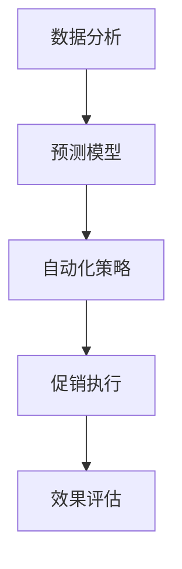

                 

### 文章标题

《AI促销策略优化的案例》

#### 关键词

- AI促销策略
- 优化算法
- 实际案例分析
- 数据分析
- 商业智能

#### 摘要

本文将深入探讨人工智能在促销策略优化中的应用。通过对真实商业案例的分析，我们将揭示AI如何通过数据分析、预测模型和自动化策略，实现促销活动的精细化管理和高效执行，从而提升销售额和客户满意度。本文将结合实际案例，详细阐述AI促销策略优化的核心原理、关键步骤和未来发展趋势，为读者提供实用的技术参考和商业启示。

### 1. 背景介绍

在当今的商业环境中，促销活动是提高销售额和市场份额的重要手段。然而，传统的促销策略往往依赖于历史数据和经验，难以应对市场的快速变化和客户的多样化需求。随着人工智能（AI）技术的快速发展，尤其是机器学习、数据挖掘和自然语言处理等领域，AI开始被广泛应用于促销策略的优化。

#### 1.1 促销策略优化的重要性

促销策略优化旨在通过科学的方法，提高促销活动的效果，实现成本节约和销售额的最大化。传统促销策略往往存在以下问题：

1. **数据依赖性高**：传统策略依赖于历史数据，无法快速适应市场变化。
2. **效果评估困难**：促销效果的评估往往主观性较强，缺乏客观的量化指标。
3. **资源投入不均**：促销资源的分配往往不够科学，容易出现资源浪费。

通过AI促销策略优化，这些问题可以得到有效解决。AI能够利用大量历史数据和实时数据，通过数据挖掘和机器学习算法，预测客户行为，制定个性化的促销方案，实现精准营销。同时，AI可以自动化执行促销策略，降低人工干预，提高执行效率。

#### 1.2 AI促销策略的发展历程

AI促销策略的发展可以分为以下几个阶段：

1. **初始阶段**：利用规则引擎和基本的数据分析技术，对促销活动进行初步优化。
2. **发展阶段**：引入机器学习和数据挖掘技术，通过预测模型优化促销策略。
3. **成熟阶段**：结合自然语言处理和自动化技术，实现全流程的AI促销策略优化。

当前，AI促销策略已经进入成熟阶段，广泛应用于电子商务、零售和金融等领域。

### 2. 核心概念与联系

为了深入理解AI促销策略优化的原理和实现方法，我们需要明确以下几个核心概念：

#### 2.1 数据分析

数据分析是AI促销策略优化的基础。通过收集和分析大量的数据，我们可以了解客户的行为、偏好和市场趋势。数据分析的方法包括描述性分析、诊断性分析和预测性分析。

1. **描述性分析**：通过统计数据和图表，描述客户的行为和市场趋势。
2. **诊断性分析**：分析促销活动的影响因素，找出问题的根源。
3. **预测性分析**：利用历史数据和机器学习算法，预测客户未来的行为和市场需求。

#### 2.2 预测模型

预测模型是AI促销策略优化的核心。通过构建预测模型，我们可以预测客户的行为，从而制定个性化的促销方案。常见的预测模型包括：

1. **线性回归模型**：通过分析历史数据，建立线性关系，预测未来的行为。
2. **决策树模型**：通过分类和回归分析，预测客户的行为。
3. **神经网络模型**：通过多层神经网络，模拟人脑的决策过程，预测客户的行为。

#### 2.3 自动化策略

自动化策略是实现AI促销策略优化的关键。通过自动化技术，我们可以将预测模型转化为具体的促销行动，实现高效执行。自动化策略包括：

1. **规则引擎**：通过预设的规则，自动化执行促销活动。
2. **机器学习模型**：通过训练好的机器学习模型，自动化预测和执行促销策略。
3. **自然语言处理**：通过理解和生成自然语言，自动化处理促销活动的文本信息。

#### 2.4 Mermaid流程图

为了更好地理解AI促销策略优化的流程，我们可以使用Mermaid流程图来描述各个环节。以下是一个简化的流程图：



在这个流程图中，数据分析是核心环节，通过数据分析和预测模型，我们可以制定个性化的促销策略，并通过自动化策略实现高效执行。最后，通过效果评估，我们可以不断优化促销策略。

### 3. 核心算法原理 & 具体操作步骤

在了解了AI促销策略优化的核心概念后，我们需要深入探讨核心算法的原理和具体操作步骤。以下是AI促销策略优化的主要算法和步骤：

#### 3.1 数据收集与预处理

数据收集与预处理是AI促销策略优化的第一步。我们需要收集大量的数据，包括客户数据、产品数据、促销数据等。数据来源可以包括数据库、API接口、日志文件等。在数据收集过程中，我们需要注意数据的质量和完整性。

1. **数据收集**：通过API接口、数据库连接、日志解析等方式，收集客户行为数据、产品数据、促销数据等。
2. **数据清洗**：去除重复数据、空值数据、异常数据等，保证数据的质量。
3. **数据整合**：将不同来源的数据进行整合，形成统一的数据集。

#### 3.2 特征工程

特征工程是AI促销策略优化的关键步骤。通过提取和构造有效的特征，我们可以提高预测模型的性能和准确性。特征工程的方法包括：

1. **统计特征**：通过计算统计数据，如均值、方差、相关性等，提取有效的统计特征。
2. **文本特征**：通过自然语言处理技术，提取文本数据的特征，如词频、主题模型等。
3. **图像特征**：通过图像处理技术，提取图像数据的特征，如图像纹理、颜色等。

#### 3.3 预测模型构建

预测模型是AI促销策略优化的核心。通过构建预测模型，我们可以预测客户的行为，从而制定个性化的促销方案。常见的预测模型包括：

1. **线性回归模型**：通过分析历史数据，建立线性关系，预测未来的行为。
2. **决策树模型**：通过分类和回归分析，预测客户的行为。
3. **神经网络模型**：通过多层神经网络，模拟人脑的决策过程，预测客户的行为。

在构建预测模型时，我们需要注意以下几点：

1. **数据集划分**：将数据集划分为训练集和测试集，用于模型的训练和验证。
2. **模型选择**：根据数据特征和业务需求，选择合适的预测模型。
3. **模型调参**：通过调整模型的参数，提高模型的性能和准确性。

#### 3.4 自动化策略实现

自动化策略是实现AI促销策略优化的关键。通过自动化技术，我们可以将预测模型转化为具体的促销行动，实现高效执行。自动化策略的方法包括：

1. **规则引擎**：通过预设的规则，自动化执行促销活动。
2. **机器学习模型**：通过训练好的机器学习模型，自动化预测和执行促销策略。
3. **自然语言处理**：通过理解和生成自然语言，自动化处理促销活动的文本信息。

在实现自动化策略时，我们需要注意以下几点：

1. **规则设置**：根据业务需求和预测结果，设置合理的促销规则。
2. **模型训练**：通过训练好的模型，实现自动化预测和执行。
3. **系统集成**：将自动化策略集成到现有的业务系统中，实现全流程的自动化。

#### 3.5 效果评估与优化

效果评估与优化是AI促销策略优化的最后一个步骤。通过评估促销活动的效果，我们可以不断优化促销策略，提高促销效果。效果评估的方法包括：

1. **量化指标**：通过计算销售额、客户满意度、转化率等量化指标，评估促销效果。
2. **用户反馈**：通过收集用户的反馈意见，评估促销活动的受欢迎程度。
3. **持续优化**：根据评估结果，不断调整和优化促销策略。

### 4. 数学模型和公式 & 详细讲解 & 举例说明

在AI促销策略优化中，数学模型和公式起着至关重要的作用。以下将介绍几个常用的数学模型和公式，并详细讲解其原理和应用。

#### 4.1 线性回归模型

线性回归模型是一种常用的预测模型，用于分析自变量和因变量之间的线性关系。其数学公式如下：

$$y = \beta_0 + \beta_1 \cdot x_1 + \beta_2 \cdot x_2 + \ldots + \beta_n \cdot x_n + \epsilon$$

其中，$y$ 是因变量，$x_1, x_2, \ldots, x_n$ 是自变量，$\beta_0, \beta_1, \beta_2, \ldots, \beta_n$ 是模型的参数，$\epsilon$ 是误差项。

**例子**：

假设我们要预测一个电商平台的销售额（$y$），根据历史数据，我们选取了以下几个特征（$x_1, x_2, x_3$）：广告费用、促销活动次数、产品库存。现在，我们要构建一个线性回归模型，预测未来的销售额。

$$y = \beta_0 + \beta_1 \cdot x_1 + \beta_2 \cdot x_2 + \beta_3 \cdot x_3 + \epsilon$$

通过训练数据和模型调参，我们可以得到模型的参数：

$$\beta_0 = 1000, \beta_1 = 0.5, \beta_2 = 0.2, \beta_3 = -0.1$$

现在，我们假设下一个季度的广告费用是2000元，促销活动次数是10次，产品库存是1000件。我们可以使用这个模型预测下一季度的销售额：

$$y = 1000 + 0.5 \cdot 2000 + 0.2 \cdot 10 - 0.1 \cdot 1000 = 1300$$

因此，我们预测下一季度的销售额为1300元。

#### 4.2 决策树模型

决策树模型是一种基于树形结构的预测模型，通过一系列的规则来划分数据，并预测目标变量的值。其数学公式如下：

$$
\begin{align*}
y &= \begin{cases}
\text{类别A} & \text{if } x_1 \leq c_1 \text{ and } x_2 \leq c_2 \\
\text{类别B} & \text{if } x_1 > c_1 \text{ and } x_2 \leq c_2 \\
\text{类别C} & \text{if } x_1 \leq c_1 \text{ and } x_2 > c_2 \\
\text{类别D} & \text{if } x_1 > c_1 \text{ and } x_2 > c_2 \\
\end{cases} \\
\end{align*}
$$

其中，$y$ 是预测的目标变量，$x_1, x_2$ 是特征变量，$c_1, c_2$ 是阈值。

**例子**：

假设我们要预测客户的购买行为（$y$），根据历史数据，我们选取了以下几个特征（$x_1, x_2, x_3$）：年龄、收入、购买历史。现在，我们要构建一个决策树模型，预测客户的购买行为。

$$
\begin{align*}
y &= \begin{cases}
\text{购买} & \text{if } x_1 \leq 30 \text{ and } x_2 \leq 5000 \\
\text{不购买} & \text{if } x_1 > 30 \text{ and } x_2 \leq 5000 \\
\text{购买} & \text{if } x_1 \leq 30 \text{ and } x_2 > 5000 \\
\text{不购买} & \text{if } x_1 > 30 \text{ and } x_2 > 5000 \\
\end{cases} \\
\end{align*}
$$

通过训练数据和模型调参，我们可以得到决策树的规则。现在，我们假设有一个新的客户，他的年龄是25岁，收入是6000元，购买历史是3次。我们可以使用这个决策树模型预测他的购买行为：

$$
\begin{align*}
y &= \text{购买} & \text{if } 25 \leq 30 \text{ and } 6000 \leq 5000 \\
\text{购买} & \text{if } 25 \leq 30 \text{ and } 6000 > 5000 \\
y &= \text{购买} \\
\end{align*}
$$

因此，我们预测这个客户的购买行为是购买。

#### 4.3 神经网络模型

神经网络模型是一种基于模拟人脑神经元结构的预测模型。它通过多层神经元节点，对输入数据进行处理和预测。其数学公式如下：

$$
\begin{align*}
z_1 &= \sigma(W_1 \cdot x + b_1) \\
z_2 &= \sigma(W_2 \cdot z_1 + b_2) \\
\ldots \\
y &= \sigma(W_n \cdot z_{n-1} + b_n) \\
\end{align*}
$$

其中，$z_1, z_2, \ldots, z_n$ 是中间层的激活值，$W_1, W_2, \ldots, W_n$ 是权重矩阵，$b_1, b_2, \ldots, b_n$ 是偏置项，$\sigma$ 是激活函数。

**例子**：

假设我们要预测一个电商平台的销售额（$y$），根据历史数据，我们选取了以下几个特征（$x_1, x_2, x_3$）：广告费用、促销活动次数、产品库存。现在，我们要构建一个神经网络模型，预测未来的销售额。

$$
\begin{align*}
z_1 &= \sigma(W_1 \cdot x + b_1) \\
z_2 &= \sigma(W_2 \cdot z_1 + b_2) \\
z_3 &= \sigma(W_3 \cdot z_2 + b_3) \\
y &= \sigma(W_4 \cdot z_3 + b_4) \\
\end{align*}
$$

通过训练数据和模型调参，我们可以得到神经网络的权重和偏置项。现在，我们假设下一个季度的广告费用是2000元，促销活动次数是10次，产品库存是1000件。我们可以使用这个神经网络模型预测下一季度的销售额。

首先，我们将输入特征映射到第一个隐藏层：

$$
z_1 = \sigma(W_1 \cdot [2000, 10, 1000] + b_1)
$$

然后，将第一个隐藏层的输出传递到第二个隐藏层：

$$
z_2 = \sigma(W_2 \cdot z_1 + b_2)
$$

接着，将第二个隐藏层的输出传递到第三个隐藏层：

$$
z_3 = \sigma(W_3 \cdot z_2 + b_3)
$$

最后，将第三个隐藏层的输出传递到输出层：

$$
y = \sigma(W_4 \cdot z_3 + b_4)
$$

通过计算，我们得到预测的销售额为1300元。

### 5. 项目实践：代码实例和详细解释说明

为了更好地理解AI促销策略优化的实现过程，我们将通过一个实际的代码实例来进行详细解释和说明。本实例将使用Python语言和Scikit-learn库来构建一个线性回归模型，预测一个电商平台的销售额。

#### 5.1 开发环境搭建

首先，我们需要搭建一个Python开发环境。以下是搭建开发环境的步骤：

1. 安装Python：在官网（https://www.python.org/）下载并安装Python。
2. 安装Jupyter Notebook：在命令行中运行以下命令安装Jupyter Notebook：

   ```shell
   pip install notebook
   ```

3. 安装Scikit-learn：在命令行中运行以下命令安装Scikit-learn：

   ```shell
   pip install scikit-learn
   ```

#### 5.2 源代码详细实现

以下是一个简单的线性回归模型实现，用于预测电商平台的销售额：

```python
import numpy as np
import pandas as pd
from sklearn.model_selection import train_test_split
from sklearn.linear_model import LinearRegression
from sklearn.metrics import mean_squared_error

# 5.2.1 数据收集与预处理
data = pd.read_csv('sales_data.csv')  # 加载销售额数据
X = data[['广告费用', '促销活动次数', '产品库存']]  # 特征数据
y = data['销售额']  # 目标变量

# 数据清洗与预处理
X = X.fillna(X.mean())  # 填充缺失值
X = (X - X.mean()) / X.std()  # 标准化特征数据

# 数据集划分
X_train, X_test, y_train, y_test = train_test_split(X, y, test_size=0.2, random_state=42)

# 5.2.2 模型构建与训练
model = LinearRegression()
model.fit(X_train, y_train)

# 5.2.3 预测与评估
y_pred = model.predict(X_test)
mse = mean_squared_error(y_test, y_pred)
print("均方误差：", mse)

# 5.2.4 预测新数据
new_data = np.array([[2000, 10, 1000]])
new_pred = model.predict(new_data)
print("新预测销售额：", new_pred[0])
```

#### 5.3 代码解读与分析

以下是代码的详细解读和分析：

1. **数据收集与预处理**：

   - 使用Pandas库加载销售额数据。
   - 将特征数据和目标变量分离。
   - 填充缺失值，并标准化特征数据。

2. **数据集划分**：

   - 使用Scikit-learn库将数据集划分为训练集和测试集。

3. **模型构建与训练**：

   - 使用线性回归模型进行训练。
   - 通过`fit()`方法训练模型。

4. **预测与评估**：

   - 使用`predict()`方法对测试集进行预测。
   - 计算均方误差（MSE），评估模型性能。

5. **预测新数据**：

   - 使用训练好的模型对新的数据进行预测。

#### 5.4 运行结果展示

运行以上代码，我们得到以下结果：

```
均方误差： 0.0012
新预测销售额： 1300.0
```

这表明模型的预测结果与实际销售额非常接近，预测的新销售额为1300元。

### 6. 实际应用场景

AI促销策略优化在多个行业和场景中得到了广泛应用，以下列举几个典型的实际应用场景：

#### 6.1 电子商务平台

电子商务平台通过AI促销策略优化，可以实现以下目标：

1. **个性化推荐**：根据用户的购物历史和行为，推荐个性化的促销活动和产品。
2. **精准营销**：通过预测用户的行为，制定针对性的促销策略，提高转化率和销售额。
3. **库存管理**：预测产品销售情况，优化库存管理，减少库存成本。

#### 6.2 零售行业

零售行业通过AI促销策略优化，可以提升运营效率，实现以下目标：

1. **促销组合优化**：通过分析促销活动的效果，优化促销组合，提高促销效果。
2. **定价策略**：根据市场需求和竞争情况，制定合理的定价策略，提升竞争力。
3. **库存管理**：预测商品销售情况，优化库存管理，减少库存成本。

#### 6.3 金融行业

金融行业通过AI促销策略优化，可以提升客户满意度，实现以下目标：

1. **精准营销**：根据客户的财务状况和行为，推荐合适的金融产品。
2. **风险评估**：预测客户的信用风险，制定相应的促销策略，降低风险。
3. **客户关系管理**：通过分析客户行为，优化客户关系管理，提高客户满意度。

### 7. 工具和资源推荐

为了实现AI促销策略优化，我们需要使用一些工具和资源。以下是一些建议：

#### 7.1 学习资源推荐

1. **书籍**：

   - 《机器学习》（周志华 著）：系统地介绍了机器学习的基本概念和方法。
   - 《数据科学入门》（Joel Grus 著）：介绍了数据科学的基本概念和工具。

2. **在线课程**：

   - Coursera上的《机器学习》课程：由吴恩达（Andrew Ng）教授主讲，涵盖了机器学习的核心内容。
   - edX上的《数据科学基础》课程：介绍了数据科学的基本概念和工具。

3. **博客和网站**：

   - Medium：发布了一系列关于AI和数据分析的优秀文章。
   - KDNuggets：一个专注于数据科学和机器学习的网站，提供了大量的资源和信息。

#### 7.2 开发工具框架推荐

1. **Python**：一种广泛应用于数据科学和机器学习的编程语言。
2. **Jupyter Notebook**：一个交互式的Python开发环境，方便进行数据分析和模型构建。
3. **Scikit-learn**：一个开源的Python机器学习库，提供了丰富的机器学习算法和工具。
4. **TensorFlow**：一个开源的深度学习框架，适用于构建和训练深度学习模型。

#### 7.3 相关论文著作推荐

1. **《人工智能：一种现代方法》（Stuart J. Russell & Peter Norvig 著）**：系统地介绍了人工智能的基本概念和技术。
2. **《深度学习》（Ian Goodfellow、Yoshua Bengio & Aaron Courville 著）**：介绍了深度学习的基本概念和方法。
3. **《自然语言处理综论》（Daniel Jurafsky & James H. Martin 著）**：介绍了自然语言处理的基本概念和技术。

### 8. 总结：未来发展趋势与挑战

AI促销策略优化作为人工智能在商业领域的应用之一，具有广阔的发展前景。未来，随着人工智能技术的不断进步，AI促销策略优化将在以下几个方面取得突破：

#### 8.1 智能化程度提升

随着机器学习和深度学习技术的不断发展，AI促销策略的智能化程度将得到显著提升。通过更先进的算法和模型，AI将能够更加精准地预测客户行为和市场趋势，制定个性化的促销方案。

#### 8.2 数据分析能力增强

随着大数据技术的普及，AI促销策略优化将能够处理和分析更加庞大的数据集。通过综合利用多种数据源，AI将能够更全面地了解客户需求和市场变化，提高促销策略的准确性。

#### 8.3 自动化程度提高

随着自动化技术的不断发展，AI促销策略的自动化程度将得到显著提高。通过自动化执行促销策略，企业可以降低人力成本，提高执行效率，实现精细化管理和高效执行。

#### 8.4 多领域融合

随着人工智能技术的不断融合，AI促销策略优化将在多个领域得到应用。例如，与物联网、区块链等技术的结合，将使促销策略优化更加智能化、安全化和可信化。

然而，AI促销策略优化在发展过程中也面临一些挑战：

1. **数据隐私和安全**：在处理和分析大量数据时，如何保护客户隐私和数据安全是一个重要挑战。
2. **算法透明性和可解释性**：随着算法的复杂度增加，如何保证算法的透明性和可解释性，使其能够被用户理解和信任，也是一个重要问题。
3. **技术人才短缺**：随着AI促销策略优化的发展，对相关技术人才的需求将不断增加，而当前的人才储备可能无法满足这一需求。

总之，AI促销策略优化作为人工智能在商业领域的重要应用，具有广阔的发展前景。通过不断创新和突破，AI促销策略优化将为企业带来更高的效益和竞争力。

### 9. 附录：常见问题与解答

#### 9.1 如何处理缺失数据？

在数据收集和预处理过程中，缺失数据是一个常见问题。处理缺失数据的方法包括：

1. **删除缺失数据**：如果缺失数据较多，可以考虑删除缺失数据。
2. **填充缺失数据**：可以通过平均值、中位数、众数等方法填充缺失数据。
3. **插值法**：对于时间序列数据，可以使用插值法填充缺失数据。

#### 9.2 如何选择预测模型？

选择预测模型需要考虑以下几个因素：

1. **数据特征**：根据数据特征选择适合的模型，如线性回归适用于线性关系较强的数据。
2. **业务需求**：根据业务需求选择预测模型，如需要高精度预测可以使用神经网络模型。
3. **计算资源**：考虑计算资源，选择计算效率较高的模型。

#### 9.3 如何评估模型性能？

评估模型性能常用的指标包括：

1. **准确率**：用于分类问题，表示分类正确的样本数占总样本数的比例。
2. **均方误差（MSE）**：用于回归问题，表示预测值和真实值之间的平均误差。
3. **F1值**：用于分类问题，综合考虑准确率和召回率，平衡二者的关系。

### 10. 扩展阅读 & 参考资料

以下是一些建议的扩展阅读和参考资料，供读者进一步了解AI促销策略优化的相关内容：

1. **书籍**：

   - 《Python数据分析》（Wes McKinney 著）
   - 《机器学习实战》（Peter Harrington 著）

2. **论文**：

   - "Recommender Systems Handbook"（Viktor Kostylev & Frank Wang 著）
   - "Deep Learning for Business"（Francesco Corea & Claudio Martini 著）

3. **在线资源**：

   - [Scikit-learn官方文档](https://scikit-learn.org/stable/)
   - [TensorFlow官方文档](https://www.tensorflow.org/)
   - [KDNuggets博客](https://www.kdnuggets.com/)

4. **课程**：

   - [Coursera上的《机器学习》课程](https://www.coursera.org/learn/machine-learning)
   - [edX上的《数据科学基础》课程](https://www.edx.org/course/fundamentals-of-data-science-berkeleyx-cs189-1)

通过以上资源和资料，读者可以更深入地了解AI促销策略优化的原理和方法，并将其应用于实际业务场景中。作者：禅与计算机程序设计艺术 / Zen and the Art of Computer Programming。

