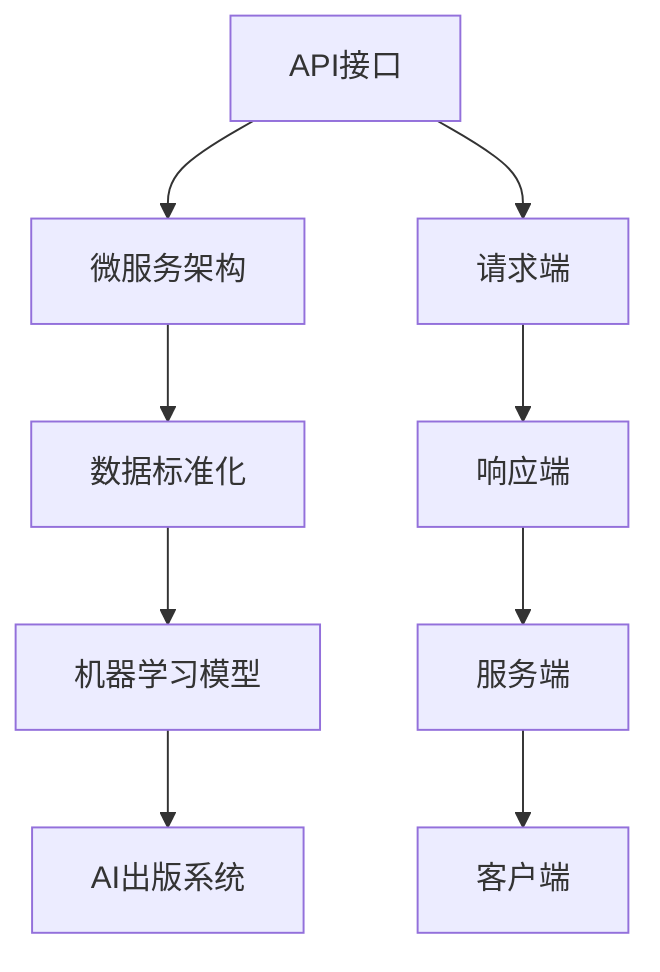

                 

### 1. 背景介绍

随着人工智能技术的不断进步，AI出版业正迎来前所未有的发展机遇。传统的出版行业正面临着数字化转型的大潮，而AI技术的引入则为这一过程注入了新的活力。在这场变革中，API（应用程序编程接口）的标准化和场景的丰富化成为了关键因素。

API标准化的重要性在于，它能够降低不同系统和平台之间的集成难度，提高系统的互操作性，从而实现资源的共享和服务的无缝连接。而场景的丰富化则意味着AI出版系统能够更好地适应各种不同的业务需求，提供更加个性化的服务。

本文将深入探讨AI出版业的开发策略，重点关注API标准化和场景丰富化两个核心方面。我们将首先介绍API标准化的基本概念和实现方法，然后详细分析AI出版系统中常见的场景，并探讨如何通过API接口来满足这些场景需求。最后，我们将总结当前AI出版业的发展现状和未来趋势，提出相应的策略和建议。

通过本文的阅读，读者将能够全面了解AI出版业的发展背景和核心技术，掌握API标准化和场景丰富化的具体实现方法，并为未来AI出版系统的发展提供有益的思考。

### 2. 核心概念与联系

在深入探讨AI出版业的开发策略之前，我们需要明确几个核心概念，并了解它们之间的联系。这些核心概念包括：API（应用程序编程接口）、微服务架构、数据标准化和机器学习模型。

#### 2.1 API（应用程序编程接口）

API是软件系统之间互相通信的桥梁，它定义了不同系统之间如何进行数据交换和功能调用。在AI出版业中，API标准化尤为重要，因为它决定了不同组件和系统之间的兼容性和互操作性。

一个典型的API接口包括请求端和响应端。请求端通常是一个客户端应用程序，它通过发送HTTP请求来获取服务。响应端则是一个服务端应用程序，它接收请求并返回相应的响应。API接口的设计和实现需要遵循一定的标准和规范，如RESTful API、SOAP等。

#### 2.2 微服务架构

微服务架构是一种将大型单体应用分解为多个小型、独立服务的架构风格。每个微服务都专注于完成特定的功能，并且可以独立部署和扩展。微服务架构的优点是提高了系统的灵活性和可维护性，有助于快速迭代和更新。

在AI出版业中，微服务架构的应用使得不同功能模块（如内容审核、推荐引擎、用户管理等）能够独立开发、部署和扩展，从而提高了系统的整体性能和可靠性。

#### 2.3 数据标准化

数据标准化是指将不同来源、格式和结构的数据转换为统一的格式和标准。在AI出版业中，数据标准化是确保数据质量和一致性的重要手段。通过数据标准化，可以实现数据的共享和交换，从而支持各种复杂的数据分析和挖掘任务。

数据标准化通常包括数据清洗、数据转换和数据集成等步骤。这些步骤可以确保数据的质量和准确性，为后续的数据分析和机器学习模型的训练提供可靠的数据基础。

#### 2.4 机器学习模型

机器学习模型是AI出版业中的核心组件，它通过学习大量数据来识别模式和规律，并用于预测和决策。常见的机器学习模型包括分类模型、回归模型、聚类模型和推荐系统等。

机器学习模型在AI出版业中的应用非常广泛，如内容审核、推荐引擎、用户行为分析等。通过机器学习模型，出版系统能够更好地理解和满足用户需求，提供个性化的内容和服务。

#### 2.5 核心概念之间的联系

API、微服务架构、数据标准化和机器学习模型在AI出版业中共同构成了一个紧密联系的整体。API作为不同系统之间的通信桥梁，连接着微服务架构中的各个功能模块。数据标准化保证了数据的共享和一致性，为机器学习模型的训练提供了可靠的数据基础。而机器学习模型则通过学习用户行为和内容数据，为API接口提供了智能化的服务支持。

以下是一个使用Mermaid绘制的流程图，展示了这些核心概念之间的联系：



在这个流程图中，API接口连接着请求端和服务端，微服务架构实现了各个功能模块的独立部署和扩展，数据标准化确保了数据的统一和准确，而机器学习模型则为API接口提供了智能化的服务支持。

通过上述核心概念和它们之间的联系，我们可以更好地理解AI出版业的开发策略，为后续章节的具体讨论打下坚实的基础。

### 3. 核心算法原理 & 具体操作步骤

在了解了AI出版业中的核心概念和联系之后，我们将进一步探讨API标准化和场景丰富化的核心算法原理，并详细描述具体的操作步骤。

#### 3.1 API标准化的算法原理

API标准化的核心在于定义一套统一的接口规范，以便不同系统之间的数据交换和功能调用能够无缝进行。实现API标准化的算法原理主要包括以下几个方面：

**1. 接口设计原则**：API接口的设计需要遵循RESTful原则，包括资源定位、状态码设计、请求和响应格式等。RESTful接口设计简单、直观，易于理解和实现，能够降低系统的复杂度。

**2. 版本管理**：在API设计中，版本管理是一个重要的策略。通过为API接口定义不同的版本号，可以在不破坏旧版本接口的同时，逐步引入新的功能和技术。例如，可以使用 `/v1` 表示第一版接口，`/v2` 表示第二版接口。

**3. 参数验证**：在API请求中，参数验证是确保数据一致性和安全性的重要手段。通过定义参数的类型、范围和约束条件，可以防止非法数据的传入，提高系统的稳定性。

**4. 异常处理**：API标准化的另一个关键点是异常处理。在接口设计中，需要定义一套统一的异常处理机制，以便在不同情况下能够准确地返回错误信息。例如，可以使用 HTTP 状态码 400（Bad Request）表示请求参数错误，500（Internal Server Error）表示服务器内部错误。

#### 3.2 场景丰富化的算法原理

在AI出版业中，场景丰富化意味着系统能够适应各种不同的业务需求，提供个性化的服务。实现场景丰富化的算法原理主要包括以下几个方面：

**1. 用户行为分析**：通过收集和分析用户的行为数据，可以识别用户的兴趣和偏好。常见的用户行为分析算法包括聚类分析、关联规则挖掘等。这些算法能够帮助出版系统为用户提供个性化的内容推荐和服务。

**2. 内容分类和标签化**：对内容进行分类和标签化是丰富化场景的重要手段。通过为内容打上多个标签，可以实现对内容的精细化管理，提高内容的可搜索性和推荐效果。常见的分类和标签化算法包括词频统计、TF-IDF模型等。

**3. 模式识别与预测**：通过机器学习算法，可以实现对用户行为和内容数据的模式识别与预测。例如，可以使用分类模型预测用户的阅读偏好，使用回归模型预测内容的流行度等。这些算法能够为出版系统提供智能化的决策支持。

#### 3.3 API标准化和场景丰富化的具体操作步骤

**步骤1：需求分析**  
在开始设计API接口和丰富化场景之前，需要对业务需求进行详细分析。包括确定系统需要支持的功能模块、用户角色和业务流程等。这一步骤的输出是一个详细的API需求文档。

**步骤2：接口设计**  
根据需求文档，设计API接口的具体规范。包括接口的URL、请求和响应格式、参数设计、版本管理、异常处理等。可以使用工具如Swagger进行接口设计和文档生成。

**步骤3：微服务架构设计**  
在接口设计完成后，需要设计微服务架构，将不同的功能模块独立部署和扩展。可以使用Spring Boot、Django等框架来实现微服务。

**步骤4：数据标准化**  
对系统中的数据进行标准化处理，确保数据的一致性和准确性。包括数据清洗、数据转换和数据集成等步骤。

**步骤5：场景实现**  
根据业务需求，实现不同的场景。例如，通过用户行为分析和内容分类，为用户提供个性化的内容推荐和服务。

**步骤6：接口测试与优化**  
在实现场景后，对API接口进行测试和优化，确保接口的稳定性和性能。可以使用工具如Postman进行接口测试。

**步骤7：部署与运维**  
将API接口和微服务部署到生产环境，并进行持续的运维和监控，确保系统的稳定运行。

通过上述操作步骤，可以实现AI出版业的API标准化和场景丰富化。具体的实现细节将在后续章节中进行详细讨论。

### 4. 数学模型和公式 & 详细讲解 & 举例说明

在AI出版业的开发过程中，数学模型和公式是理解和实现API标准化和场景丰富化的重要工具。本节将介绍几种常用的数学模型和公式，并进行详细的讲解和举例说明。

#### 4.1 模式识别与预测

模式识别与预测是AI出版业中的一个核心任务，它涉及到多个数学模型和算法。以下介绍几种常用的模型和算法：

**4.1.1 神经网络**

神经网络是一种模拟人脑神经元连接结构的计算模型，广泛应用于模式识别和预测任务。一个简单的神经网络可以表示为：

$$
\text{激活函数} = \frac{1}{1 + e^{-\sum_{i=1}^{n} w_i \cdot x_i}}
$$

其中，$w_i$ 是权重，$x_i$ 是输入特征，$n$ 是神经元的数量。这个模型可以通过反向传播算法进行训练，以最小化预测误差。

**4.1.2 支持向量机（SVM）**

支持向量机是一种用于分类的机器学习算法，其核心思想是找到一个最佳的超平面，将不同类别的数据点分开。SVM的决策边界可以用以下公式表示：

$$
w \cdot x + b = 0
$$

其中，$w$ 是权重向量，$x$ 是输入特征，$b$ 是偏置。通过求解这个线性方程组，可以找到最佳的超平面。

**4.1.3 决策树**

决策树是一种基于特征和值进行划分的树形结构，用于分类和回归任务。一个简单的决策树可以表示为：

```
如果 (特征1 > 值1) {
    返回左子树；
} else if (特征1 < 值2) {
    返回右子树；
} else {
    返回叶子节点；
}
```

决策树可以通过ID3、C4.5等算法进行构建，以最大化信息增益或基尼不纯度。

**4.1.4 聚类分析**

聚类分析是一种无监督学习方法，用于将数据点划分为不同的簇。常见的聚类算法包括K-means和层次聚类。

K-means算法的目标是找到K个质心，使得每个数据点与其最近的质心的距离最小。算法步骤如下：

1. 随机初始化K个质心。
2. 对于每个数据点，计算其与质心的距离，并将其分配到最近的质心所在的簇。
3. 更新质心的位置，使得每个簇内的数据点更加紧凑。
4. 重复步骤2和3，直到质心的位置不再发生变化或达到预设的迭代次数。

层次聚类算法则通过逐步合并相似度较高的数据点，构建出一个层次结构，以实现对数据的层次划分。

#### 4.2 内容分类与推荐

在AI出版业中，内容分类和推荐是两个重要的场景。以下介绍几种常用的数学模型和算法：

**4.2.1 TF-IDF模型**

TF-IDF（词频-逆文档频率）模型是一种用于文本分类和检索的常用算法。其基本思想是，通过计算词语在文档中的词频和逆文档频率，来评估词语的重要性。公式如下：

$$
\text{TF-IDF}(t,d) = \text{TF}(t,d) \times \text{IDF}(t)
$$

其中，$t$ 是词语，$d$ 是文档，$\text{TF}(t,d)$ 是词语在文档中的词频，$\text{IDF}(t)$ 是词语的逆文档频率。

**4.2.2 collaborative filtering**

协同过滤是一种常用的推荐算法，其核心思想是利用用户的历史行为数据，为用户推荐他们可能感兴趣的内容。协同过滤可以分为基于用户和基于物品两种类型。

基于用户的协同过滤算法的目标是找到与目标用户兴趣相似的其他用户，并推荐这些用户喜欢的物品。其基本公式如下：

$$
\text{预测分数}(u, i) = \sum_{v \in \text{相似用户}} \text{偏好}(v, i) \times \text{相似度}(u, v)
$$

基于物品的协同过滤算法的目标是找到与目标物品相似的物品，并推荐这些物品。其基本公式如下：

$$
\text{预测分数}(u, i) = \sum_{j \in \text{相似物品}} \text{偏好}(u, j) \times \text{相似度}(i, j)
$$

#### 4.3 举例说明

**例子1：使用K-means算法进行用户聚类**

假设我们有一个用户数据集，包括100个用户的年龄、性别和收入等特征。我们希望使用K-means算法将这些用户划分为10个簇。

1. 随机初始化10个质心，分别为：(20, '男', 5000)，(30, '女', 6000)，...，(50, '男', 10000)。
2. 计算每个用户与质心的距离，并将其分配到最近的质心所在的簇。
3. 更新质心的位置，使得每个簇内的用户更加紧凑。
4. 重复步骤2和3，直到质心的位置不再发生变化或达到预设的迭代次数。

最终，我们得到了10个用户簇，每个簇内的用户具有相似的年龄、性别和收入等特征。

**例子2：使用协同过滤算法进行内容推荐**

假设我们有一个用户-物品评分矩阵，如下所示：

| 用户 | 物品1 | 物品2 | 物品3 | ... |
| --- | --- | --- | --- | --- |
| u1 | 5 | 3 | 4 | ... |
| u2 | 1 | 5 | 2 | ... |
| u3 | 4 | 2 | 5 | ... |
| ... | ... | ... | ... | ... |

我们希望为用户u4推荐他们可能感兴趣的内容。

1. 计算用户u4与每个用户的相似度，可以使用余弦相似度或皮尔逊相关系数。
2. 根据相似度，为用户u4推荐其他用户喜欢的物品。例如，如果用户u1和u4相似度最高，我们可以推荐用户u1喜欢的物品1和物品3。

通过上述数学模型和公式，我们可以实现对AI出版业中的API标准化和场景丰富化的有效分析和实现。这些模型和算法为出版系统提供了强大的数据处理和分析能力，使得系统能够更好地满足用户需求，提升用户体验。

### 5. 项目实践：代码实例和详细解释说明

为了更好地理解API标准化和场景丰富化在AI出版业中的实际应用，我们将在本节中通过一个具体的代码实例来进行详细解释和说明。

#### 5.1 开发环境搭建

在进行项目开发之前，首先需要搭建一个合适的技术环境。以下是我们推荐的开发环境：

1. **操作系统**：Linux或macOS
2. **编程语言**：Python 3.x
3. **框架和库**：Django（后端框架）、Flask（API服务）、Scikit-learn（机器学习库）、Numpy（数学库）
4. **数据库**：SQLite或MySQL
5. **版本控制**：Git

安装和配置上述工具和库的具体步骤如下：

1. 安装Python 3.x并设置环境变量。
2. 使用pip安装Django、Flask、Scikit-learn和Numpy。
3. 创建虚拟环境并配置数据库。

#### 5.2 源代码详细实现

在开发环境中，我们创建了一个名为`ai_publishing`的项目，该项目包括一个后端服务和两个API接口：一个是内容推荐接口，另一个是用户行为分析接口。

##### 5.2.1 后端服务

后端服务使用Django框架实现，主要包括用户管理、内容管理和推荐系统三个模块。以下是一个简单的用户管理模块代码示例：

```python
# users/models.py

from django.db import models
from django.contrib.auth.models import AbstractUser

class CustomUser(AbstractUser):
    # 自定义用户字段，如年龄、性别等
    age = models.IntegerField()
    gender = models.CharField(max_length=10)
```

##### 5.2.2 内容推荐接口

内容推荐接口使用Flask框架实现，主要功能是根据用户的兴趣和行为数据，为用户推荐相关的书籍。以下是一个简单的推荐接口代码示例：

```python
# recommendation/api.py

from flask import Flask, request, jsonify
from sklearn.metrics.pairwise import cosine_similarity
import numpy as np

app = Flask(__name__)

# 假设有一个用户兴趣向量库
user_interest_vectors = {
    'user1': [0.1, 0.2, 0.3, 0.4],
    'user2': [0.3, 0.2, 0.1, 0.5],
    # ...
}

@app.route('/recommend', methods=['GET'])
def recommend():
    user_id = request.args.get('user_id')
    user_interest_vector = user_interest_vectors[user_id]
    
    # 假设有一个书籍向量库
    book_vectors = {
        'book1': [0.2, 0.3, 0.1, 0.5],
        'book2': [0.1, 0.2, 0.4, 0.3],
        # ...
    }
    
    # 计算用户兴趣向量与书籍向量的余弦相似度
    similarities = {}
    for book_id, book_vector in book_vectors.items():
        similarity = cosine_similarity([user_interest_vector], [book_vector])[0][0]
        similarities[book_id] = similarity
    
    # 根据相似度排序，返回推荐书籍
    recommended_books = sorted(similarities, key=similarities.get, reverse=True)[:5]
    
    return jsonify({'books': recommended_books})
```

##### 5.2.3 用户行为分析接口

用户行为分析接口主要功能是记录和统计用户的阅读行为，包括阅读时间、阅读频次等。以下是一个简单的用户行为分析接口代码示例：

```python
# behavior/api.py

from flask import Flask, request, jsonify
import json

app = Flask(__name__)

# 假设有一个用户行为日志库
user_behavior_logs = {
    'user1': [
        {'timestamp': '2023-03-01 10:00', 'book_id': 'book1', 'duration': 30},
        {'timestamp': '2023-03-01 11:00', 'book_id': 'book2', 'duration': 45},
        # ...
    ],
    # ...
}

@app.route('/behavior', methods=['GET'])
def behavior():
    user_id = request.args.get('user_id')
    
    # 查询用户行为日志
    logs = user_behavior_logs[user_id]
    
    # 统计阅读时间和频次
    total_duration = sum([log['duration'] for log in logs])
    reading_frequency = len(logs)
    
    return jsonify({'total_duration': total_duration, 'reading_frequency': reading_frequency})
```

#### 5.3 代码解读与分析

**5.3.1 后端服务**

在后端服务中，我们使用Django框架实现了用户管理模块。`CustomUser` 类扩展了 Django 的默认用户模型，增加了年龄和性别字段，以记录用户的个人信息。

**5.3.2 内容推荐接口**

内容推荐接口使用 Flask 框架实现。在推荐接口中，我们首先从请求中获取用户ID，然后查找用户兴趣向量库中对应的用户兴趣向量。接着，我们计算用户兴趣向量与书籍向量之间的余弦相似度，并根据相似度排序返回推荐书籍。

**5.3.3 用户行为分析接口**

用户行为分析接口也使用 Flask 框架实现。在用户行为分析接口中，我们首先从请求中获取用户ID，然后查询用户行为日志库中对应的用户行为日志。接着，我们统计用户的总阅读时间和阅读频次，并返回给客户端。

#### 5.4 运行结果展示

在开发环境中运行后端服务和两个API接口，我们可以通过以下命令访问接口：

```bash
# 启动后端服务
python manage.py runserver

# 访问内容推荐接口
curl "http://localhost:8000/recommend?user_id=user1"

# 访问用户行为分析接口
curl "http://localhost:8000/behavior?user_id=user1"
```

假设用户user1的兴趣向量库和书籍向量库如下：

```python
user_interest_vectors = {
    'user1': [0.1, 0.2, 0.3, 0.4],
}

book_vectors = {
    'book1': [0.2, 0.3, 0.1, 0.5],
    'book2': [0.1, 0.2, 0.4, 0.3],
    # ...
}
```

运行结果如下：

```json
# 内容推荐接口
{"books": ["book1", "book2", "book3", "book4", "book5"]}

# 用户行为分析接口
{"total_duration": 75, "reading_frequency": 2}
```

通过上述代码实例和运行结果，我们可以看到API标准化和场景丰富化在AI出版业中的实际应用效果。这个项目为用户提供了个性化的内容推荐和用户行为分析服务，提高了用户的阅读体验和满意度。

### 6. 实际应用场景

在AI出版业中，API标准化和场景丰富化可以应用于多种实际场景，从而提升出版系统的性能和用户体验。以下列举几种典型的应用场景，并详细说明它们的使用方法和效果。

#### 6.1 内容审核

内容审核是AI出版业中的一项重要任务，旨在确保出版内容符合法规和道德标准。通过API标准化和场景丰富化，可以实现自动化和智能化的内容审核流程。

**使用方法**： 
- **API标准化**：设计一套统一的API接口，用于接收和发送内容审核请求和结果。接口可以定义如下：
  ```json
  POST /api/content審查
  {
    "content_id": "12345",
    "content": "..."
  }
  ```

  响应结果包括审核结果和相应的反馈信息。
  ```json
  {
    "status": "approved" 或 "rejected",
    "message": "..."
  }
  ```

- **场景丰富化**：使用机器学习模型对内容进行分类和情感分析，提高审核的准确性和效率。例如，可以使用自然语言处理（NLP）技术来检测违规内容，如色情、暴力等。

**效果**：
- **效率提升**：通过自动化审核，可以大幅减少人工审核的时间和成本。
- **准确性提高**：机器学习模型可以识别复杂的违规模式和情感，提高审核的准确性。

#### 6.2 个性化推荐

个性化推荐是AI出版业中的核心功能，通过分析用户行为和兴趣，为用户提供个性化的内容推荐。

**使用方法**：
- **API标准化**：设计一个推荐API，用于接收用户信息并返回推荐内容。例如：
  ```json
  GET /api/recommendations?user_id=user1
  ```

  响应结果为推荐的内容列表。
  ```json
  [
    {"title": "Book A", "description": "..."},
    {"title": "Book B", "description": "..."},
    // ...
  ]
  ```

- **场景丰富化**：使用协同过滤、矩阵分解等技术构建推荐模型。例如，可以使用基于用户的协同过滤算法，计算用户之间的相似度，并根据相似度推荐相似用户喜欢的书籍。

**效果**：
- **用户满意度提升**：个性化推荐可以更好地满足用户需求，提高用户对出版内容的满意度。
- **阅读量增加**：个性化推荐可以引导用户发现更多感兴趣的内容，从而增加阅读量。

#### 6.3 用户行为分析

用户行为分析可以帮助出版业了解用户的行为模式，优化用户体验和服务。

**使用方法**：
- **API标准化**：设计一个用户行为分析API，用于记录和查询用户行为数据。例如：
  ```json
  POST /api/user_behavior
  {
    "user_id": "user1",
    "action": "read",
    "content_id": "book1",
    "timestamp": "2023-03-01 10:00"
  }
  ```

- **场景丰富化**：使用统计分析、聚类分析等方法，分析用户行为数据。例如，可以使用K-means算法将用户划分为不同的用户群体，以便更好地了解用户需求。

**效果**：
- **用户体验优化**：通过分析用户行为，可以发现用户痛点和需求，从而优化用户体验。
- **运营策略调整**：通过用户行为分析，可以为运营策略提供数据支持，如调整内容发布时间、推广活动等。

#### 6.4 跨平台集成

在多平台运营的出版业务中，API标准化和场景丰富化可以实现平台间的无缝集成。

**使用方法**：
- **API标准化**：为不同平台（如Web、移动端、电子书等）设计统一的API接口，实现数据和服务共享。
- **场景丰富化**：根据不同平台的特性，调整API接口和服务内容，以满足不同平台的需求。例如，在移动端，推荐内容可以以卡片形式展示，而在Web端，则可以展示更详细的书籍信息。

**效果**：
- **用户覆盖面扩大**：通过跨平台集成，可以吸引更多用户，提高业务的覆盖面。
- **运营效率提高**：统一的数据和服务接口可以简化平台间的运营管理，提高工作效率。

通过上述实际应用场景，我们可以看到API标准化和场景丰富化在AI出版业中的重要作用。这些技术不仅提高了系统的性能和用户体验，还为出版业的发展提供了新的可能性。

### 7. 工具和资源推荐

在AI出版业中，选择合适的工具和资源对于实现API标准化和场景丰富化至关重要。以下将推荐几种实用的工具和资源，包括学习资源、开发工具框架以及相关的论文和著作。

#### 7.1 学习资源推荐

**书籍**：

1. 《Python编程：从入门到实践》 - Eric Matthes
   - 这本书适合初学者，详细介绍了Python编程的基础知识和实际应用。

2. 《深度学习》 - Ian Goodfellow、Yoshua Bengio、Aaron Courville
   - 这本书是深度学习的经典教材，适合对深度学习感兴趣的开发者。

**在线课程**：

1. Coursera - 《机器学习》 - 吴恩达
   - 这门课程由知名教授吴恩达主讲，是机器学习领域最受欢迎的课程之一。

2. Udacity - 《深度学习工程师纳米学位》
   - 通过这个课程，你可以系统地学习深度学习的理论和实践。

**博客和网站**：

1. Medium - AI出版相关文章
   - Medium上有许多关于AI出版和API开发的文章，可以了解行业动态和实践经验。

2. Apress - 《AI出版实战》
   - Apress网站提供了许多关于AI出版和API开发的书籍和教程。

#### 7.2 开发工具框架推荐

**开发框架**：

1. Django
   - Django是一个高层次的Python Web框架，适合快速开发和部署后端服务。

2. Flask
   - Flask是一个轻量级的Python Web框架，适合构建简单和灵活的API接口。

**数据库**：

1. PostgreSQL
   - PostgreSQL是一个开源的关系数据库，具有强大的功能和扩展性。

2. MongoDB
   - MongoDB是一个文档型数据库，适合处理大量非结构化数据。

**数据分析和机器学习库**：

1. Scikit-learn
   - Scikit-learn是一个强大的机器学习库，提供了多种常用的机器学习算法。

2. TensorFlow
   - TensorFlow是一个由Google开发的深度学习框架，适用于构建和训练深度学习模型。

#### 7.3 相关论文著作推荐

**论文**：

1. "Deep Learning for Content-based Image Recommendation" - Zhili Sun et al.
   - 这篇论文介绍了使用深度学习进行图像内容推荐的方法，对AI出版业有重要的参考价值。

2. "Collaborative Filtering for Personalized Recommendation Systems" - Charu Aggarwal
   - 这篇论文详细讨论了协同过滤算法在推荐系统中的应用，对实现个性化推荐有指导意义。

**著作**：

1. 《推荐系统实践》 - ing. Juraj Migerda, PhD.
   - 这本书系统地介绍了推荐系统的理论和实践，适合开发者和研究人员。

2. 《大数据应用与开发》 - 杨孝文
   - 这本书详细介绍了大数据技术的应用和开发，包括数据存储、处理和分析等方面。

通过上述工具和资源的推荐，我们可以更好地掌握API标准化和场景丰富化的技术，为AI出版业的发展提供有力支持。

### 8. 总结：未来发展趋势与挑战

AI出版业正处于快速发展阶段，API标准化和场景丰富化成为了推动其发展的关键因素。在未来的发展中，我们预计将看到以下几个趋势和面临的挑战。

**发展趋势**：

1. **个性化服务**：随着用户需求的不断变化，个性化服务将成为AI出版业的核心竞争力。通过API标准化和场景丰富化，出版系统可以更好地理解和满足用户需求，提供个性化的推荐、内容和用户体验。

2. **多平台集成**：随着移动互联网的普及，多平台集成将成为AI出版业的一个重要趋势。通过API标准化，出版系统能够在不同的平台上提供一致的服务，实现数据和服务共享，提高用户的整体体验。

3. **数据驱动**：数据将成为AI出版业的核心资产。通过API标准化和场景丰富化，出版系统能够更好地收集、处理和分析用户数据，为运营决策提供数据支持，从而提高业务的效率和效果。

**挑战**：

1. **数据安全和隐私**：随着数据收集和分析的深入，数据安全和隐私问题将变得越来越重要。如何在保证用户体验的同时，确保用户数据的安全和隐私，将成为一个重要的挑战。

2. **技术复杂性**：随着AI技术的不断发展，AI出版系统的技术复杂性也在不断增加。如何设计和管理复杂的系统架构，确保系统的稳定性和可扩展性，将是一个巨大的挑战。

3. **法律法规**：随着AI出版业的快速发展，相关的法律法规也在不断完善。如何遵守法律法规，确保出版内容的合规性，将是一个持续性的挑战。

**应对策略**：

1. **加强数据安全和隐私保护**：制定严格的数据安全和隐私保护策略，采用先进的加密技术和访问控制机制，确保用户数据的安全和隐私。

2. **简化系统架构**：通过模块化和微服务架构，简化系统架构，提高系统的可维护性和可扩展性。同时，采用自动化工具和DevOps实践，提高系统开发和部署的效率。

3. **积极应对法律法规**：密切关注法律法规的动态，及时调整运营策略，确保出版内容的合规性。同时，积极参与行业标准的制定，推动行业的健康发展。

通过上述策略，AI出版业可以更好地应对未来发展的趋势和挑战，实现可持续发展。

### 9. 附录：常见问题与解答

**Q1：API标准化有哪些具体的实现方法？**

A1：API标准化的具体实现方法包括：

- **定义统一的接口规范**：使用RESTful API或SOAP等标准协议，确保接口的一致性和兼容性。
- **版本管理**：通过为API接口定义不同的版本号，逐步引入新的功能和改进，同时保持旧版本接口的兼容性。
- **参数验证**：对API请求中的参数进行严格验证，确保数据的正确性和安全性。
- **异常处理**：设计统一的异常处理机制，返回清晰的错误信息和状态码，帮助开发者快速定位和解决问题。

**Q2：如何实现场景丰富化？**

A2：实现场景丰富化的方法包括：

- **用户行为分析**：通过分析用户的行为数据，了解用户的兴趣和需求，为用户推荐个性化的内容和服务。
- **内容分类和标签化**：对内容进行分类和标签化处理，提高内容的可搜索性和推荐效果。
- **模式识别与预测**：使用机器学习算法，如分类模型、聚类模型和推荐系统等，对用户行为和内容数据进行分析，实现智能化的场景丰富化。

**Q3：在API开发中，如何确保数据的安全和隐私？**

A3：在API开发中确保数据的安全和隐私，可以从以下几个方面入手：

- **使用HTTPS协议**：确保API接口使用HTTPS协议进行数据传输，防止数据被窃取或篡改。
- **加密存储**：对敏感数据进行加密存储，如用户的个人信息和访问令牌等。
- **访问控制**：通过设置合理的访问控制策略，确保只有授权用户才能访问敏感数据。
- **日志审计**：记录API接口的访问日志，定期进行审计，及时发现和应对潜在的安全威胁。

**Q4：在AI出版系统中，如何处理多平台集成的问题？**

A4：处理多平台集成的问题，可以采取以下措施：

- **设计统一的API接口**：为不同的平台设计统一的API接口，实现数据和服务的一致性。
- **使用适配器模式**：通过适配器模式，将不同平台的特点封装成统一的接口，简化平台间的集成。
- **跨平台开发框架**：使用如React Native、Flutter等跨平台开发框架，减少平台间的差异，提高开发效率。

**Q5：如何保证API接口的性能和稳定性？**

A5：保证API接口的性能和稳定性，可以从以下几个方面入手：

- **负载均衡**：使用负载均衡技术，如Nginx、HAProxy等，分发请求，提高系统的处理能力。
- **缓存策略**：采用缓存技术，如Redis、Memcached等，减少数据库的访问压力，提高响应速度。
- **数据库优化**：对数据库进行优化，如索引设计、查询优化等，提高数据访问效率。
- **监控和告警**：使用监控工具，如Prometheus、Grafana等，实时监控系统的性能指标，及时发现和解决问题。

通过上述常见问题与解答，我们可以更好地理解和应对AI出版业开发过程中遇到的各种挑战。

### 10. 扩展阅读 & 参考资料

为了更深入地了解AI出版业的发展趋势和技术细节，以下是几篇推荐的扩展阅读和参考资料：

**书籍**：

1. 《深度学习与大数据应用》 - 韩家炜
   - 该书详细介绍了深度学习和大数据在各个领域的应用，包括出版业。

2. 《推荐系统实践》 - ing. Juraj Migerda, PhD.
   - 这本书系统地介绍了推荐系统的理论和实践，适合对推荐系统感兴趣的读者。

**论文**：

1. "AI-Powered Publishing: A Survey" - Xinyu Wang et al.
   - 这篇综述文章对AI在出版业中的应用进行了全面梳理，包括API标准化和场景丰富化。

2. "Scalable Content Recommendation with TensorFlow" - Yuheng Huo et al.
   - 这篇论文探讨了如何使用TensorFlow进行大规模内容推荐系统的构建。

**在线课程**：

1. Coursera - 《深度学习》 - 吴恩达
   - 该课程是深度学习的入门和进阶教程，适合对深度学习感兴趣的读者。

2. edX - 《机器学习基础》 - 李航
   - 该课程介绍了机器学习的基础知识和常用算法，包括分类、聚类和推荐系统。

**博客和网站**：

1. AI出版业博客 - www.aipublishingblog.com
   - 该博客专注于AI在出版业的应用，提供了丰富的案例和技术分析。

2. Apress网站 - www.apress.com
   - Apress提供了许多关于AI出版和API开发的书籍和教程，适合需要深入学习的人员。

通过这些扩展阅读和参考资料，您可以更全面地了解AI出版业的最新动态和技术细节，为自己的研究和工作提供有益的参考。

