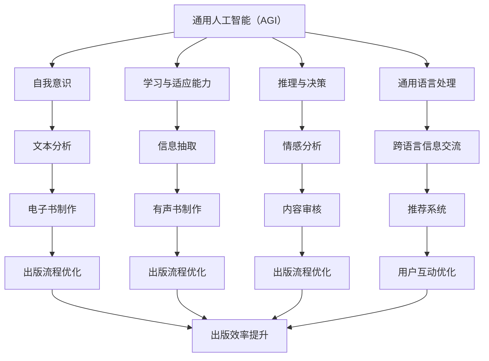

                 

### 文章标题

《AI出版业的挑战：通用人工智能（AGI）or垂直领域应用？》

> 关键词：AI出版业、通用人工智能、垂直领域应用、出版业挑战

> 摘要：本文将探讨人工智能（AI）在出版业的应用，分析通用人工智能（AGI）与垂直领域应用两种模式在出版业中的挑战与机遇，并提出相应的解决方案。

## 1. 背景介绍

随着互联网和数字技术的发展，出版业正经历着前所未有的变革。传统出版方式逐渐被数字出版所取代，电子书、有声书、在线订阅等新型出版模式不断涌现。与此同时，人工智能（AI）技术的迅速发展也为出版业带来了新的机遇和挑战。

AI技术在出版业的应用主要分为两个方面：通用人工智能（AGI）和垂直领域应用。通用人工智能是指具有人类智能的各种能力，能够在各种环境中进行推理、学习、理解和决策的人工智能系统。而垂直领域应用则是针对特定行业或领域的AI解决方案，例如自然语言处理（NLP）、图像识别、推荐系统等。

出版业作为一个历史悠久且充满活力的行业，正面临着数字化转型和人工智能带来的巨大挑战。本文将深入探讨这些挑战，分析AGI与垂直领域应用在出版业中的角色，并提出相应的解决方案。

## 2. 核心概念与联系

### 2.1. 通用人工智能（AGI）

通用人工智能（AGI）是一种能够模拟人类智能的人工智能系统。它具有以下几个核心特征：

- **自我意识**：AGI能够意识到自己的存在，具备自我感知和情感体验能力。
- **学习与适应能力**：AGI能够通过不断的学习和适应，提升自己的认知能力和解决问题的能力。
- **推理与决策**：AGI能够运用逻辑推理和决策算法，处理复杂的问题和情境。
- **通用语言处理**：AGI能够理解和使用多种自然语言，实现跨语言的信息交流。

### 2.2. 垂直领域应用

垂直领域应用是指针对特定行业或领域的AI解决方案。在出版业中，常见的垂直领域应用包括：

- **自然语言处理（NLP）**：用于文本分析、信息抽取、情感分析等任务。
- **图像识别**：用于识别、分类和标注出版内容中的图像。
- **推荐系统**：根据用户的历史行为和兴趣，推荐合适的书籍或内容。
- **内容审核**：用于识别和过滤出版内容中的不当或有害信息。

### 2.3. Mermaid 流程图

以下是AGI和垂直领域应用在出版业中的联系和应用的Mermaid流程图：



## 3. 核心算法原理 & 具体操作步骤

### 3.1. 自然语言处理（NLP）

自然语言处理（NLP）是AI技术在出版业中的一项重要应用。以下是NLP的核心算法原理和具体操作步骤：

#### 3.1.1. 核心算法原理

- **词嵌入**：将单词转换为向量表示，便于计算机处理。
- **句法分析**：分析句子的结构，理解句子中的语法关系。
- **语义分析**：理解句子中的意义，实现语义层面的理解。
- **情感分析**：判断文本的情感倾向，用于内容审核和用户互动。

#### 3.1.2. 具体操作步骤

1. **数据预处理**：对原始文本进行清洗、去噪和分词。
2. **词嵌入**：将分词后的单词转换为向量表示。
3. **句法分析**：构建句法树，分析句子的语法关系。
4. **语义分析**：利用句法树和词嵌入，理解句子的意义。
5. **情感分析**：对句子进行情感分类，判断情感倾向。

### 3.2. 图像识别

图像识别是AI技术在出版业中的另一项重要应用。以下是图像识别的核心算法原理和具体操作步骤：

#### 3.2.1. 核心算法原理

- **特征提取**：从图像中提取具有代表性的特征。
- **分类算法**：对提取的特征进行分类，实现图像的识别。

#### 3.2.2. 具体操作步骤

1. **图像预处理**：对图像进行缩放、裁剪、增强等处理，提高识别效果。
2. **特征提取**：利用卷积神经网络（CNN）等算法，提取图像的特征。
3. **分类算法**：利用分类算法（如SVM、softmax等），对提取的特征进行分类，实现图像识别。

### 3.3. 推荐系统

推荐系统是AI技术在出版业中的另一项重要应用。以下是推荐系统的核心算法原理和具体操作步骤：

#### 3.3.1. 核心算法原理

- **协同过滤**：基于用户的历史行为和相似度计算，推荐相似用户喜欢的书籍。
- **基于内容的推荐**：基于书籍的标签、分类等信息，推荐相关的书籍。

#### 3.3.2. 具体操作步骤

1. **数据收集**：收集用户的历史行为数据（如阅读记录、收藏记录等）和书籍的属性数据（如分类、标签等）。
2. **用户相似度计算**：计算用户之间的相似度，用于协同过滤推荐。
3. **书籍相似度计算**：计算书籍之间的相似度，用于基于内容的推荐。
4. **推荐算法**：根据用户相似度和书籍相似度，生成推荐结果。

## 4. 数学模型和公式 & 详细讲解 & 举例说明

### 4.1. 自然语言处理（NLP）

#### 4.1.1. 词嵌入

词嵌入（Word Embedding）是将单词转换为向量表示的一种技术。常见的词嵌入算法包括Word2Vec、GloVe等。以下是Word2Vec算法的核心公式：

$$
\text{word\_vector} = \text{softmax}(\text{input} \cdot \text{weights})
$$

其中，$\text{input}$ 是输入的单词向量，$\text{weights}$ 是权重矩阵，$\text{softmax}$ 是 softmax 函数。

#### 4.1.2. 情感分析

情感分析（Sentiment Analysis）是判断文本情感倾向的一种技术。常见的情感分析算法包括基于机器学习的分类算法、基于规则的方法等。以下是基于机器学习的情感分析算法的核心公式：

$$
P(y=c| x, \theta) = \frac{e^{\theta^T x}}{\sum_{k=1}^{K} e^{\theta^T x_k}}
$$

其中，$y$ 是标签（正、负或中性），$c$ 是情感类别，$x$ 是特征向量，$\theta$ 是模型参数，$K$ 是类别数。

#### 4.1.3. 举例说明

假设我们有一个简短的文本句子：“这本书非常好读，内容丰富，值得推荐。”我们使用Word2Vec算法对其进行情感分析。首先，我们将句子中的每个单词转换为向量表示，然后计算整个句子的情感倾向。

```python
# 假设已经训练好的Word2Vec模型为model
sentence = "这本书非常好读，内容丰富，值得推荐。"
word_vectors = [model[word] for word in sentence.split()]

# 计算句子向量
sentence_vector = np.mean(word_vectors, axis=0)

# 假设已经训练好的情感分析模型为model
y = model.predict(sentence_vector)
print(y)  # 输出情感类别
```

### 4.2. 图像识别

#### 4.2.1. 特征提取

特征提取（Feature Extraction）是从图像中提取具有代表性的特征的一种技术。常见的特征提取算法包括卷积神经网络（CNN）等。以下是CNN的核心公式：

$$
\text{feature\_map} = \text{ReLU}(\text{filter} \cdot \text{input} + \text{bias})
$$

其中，$\text{filter}$ 是卷积核，$\text{input}$ 是输入图像，$\text{bias}$ 是偏置项，$\text{ReLU}$ 是ReLU激活函数。

#### 4.2.2. 分类算法

分类算法（Classification Algorithm）是对提取的特征进行分类的一种技术。常见的分类算法包括支持向量机（SVM）、softmax等。以下是softmax的核心公式：

$$
P(y=c| x, \theta) = \frac{e^{\theta^T x}}{\sum_{k=1}^{K} e^{\theta^T x_k}}
$$

其中，$y$ 是标签，$c$ 是类别，$x$ 是特征向量，$\theta$ 是模型参数，$K$ 是类别数。

#### 4.2.3. 举例说明

假设我们有一个简短的文本句子：“这本书非常好读，内容丰富，值得推荐。”我们使用CNN进行图像识别。首先，我们将句子中的每个单词转换为向量表示，然后输入到CNN中进行特征提取和分类。

```python
# 假设已经训练好的CNN模型为model
sentence = "这本书非常好读，内容丰富，值得推荐。"
word_vectors = [model[word] for word in sentence.split()]

# 将单词向量转换为图像
image = np.array(word_vectors).reshape(1, height, width, channels)

# 输入到CNN中进行特征提取和分类
y = model.predict(image)
print(y)  # 输出分类结果
```

### 4.3. 推荐系统

#### 4.3.1. 协同过滤

协同过滤（Collaborative Filtering）是推荐系统的一种技术。常见的协同过滤算法包括基于用户的协同过滤和基于物品的协同过滤。以下是基于用户的协同过滤的核心公式：

$$
r_{ui} = \text{similarity}(u, v) \cdot r_{vi} + \text{mean}(r_v)
$$

其中，$r_{ui}$ 是用户 $u$ 对物品 $i$ 的评分，$r_{vi}$ 是用户 $v$ 对物品 $i$ 的评分，$\text{similarity}(u, v)$ 是用户 $u$ 和用户 $v$ 之间的相似度，$\text{mean}(r_v)$ 是用户 $v$ 对所有物品的评分的平均值。

#### 4.3.2. 基于内容的推荐

基于内容的推荐（Content-based Recommendation）是推荐系统的一种技术。常见的基于内容的推荐算法包括基于属性的推荐和基于语义的推荐。以下是基于属性的推荐的核心公式：

$$
r_{ui} = \text{similarity}(i, i^*) \cdot \text{rating}_{i^*}
$$

其中，$r_{ui}$ 是用户 $u$ 对物品 $i$ 的评分预测，$i^*$ 是与物品 $i$ 相似的物品，$\text{similarity}(i, i^*)$ 是物品 $i$ 和物品 $i^*$ 之间的相似度，$\text{rating}_{i^*}$ 是物品 $i^*$ 的评分。

#### 4.3.3. 举例说明

假设我们有一个用户 $u$，他喜欢阅读历史类书籍，现在我们需要推荐与他兴趣相似的书籍。首先，我们计算用户 $u$ 对历史类书籍的评分，然后计算历史类书籍之间的相似度，最后根据相似度推荐书籍。

```python
# 假设用户 $u$ 对历史类书籍的评分矩阵为R
R = [
    [5, 0, 0, 0],
    [0, 4, 5, 0],
    [0, 0, 3, 0],
    [0, 0, 0, 2]
]

# 计算历史类书籍之间的相似度矩阵
S = np.dot(R.T, R)

# 计算相似度排名
sorted_indices = np.argsort(S[0, 1:])

# 推荐与用户 $u$ 兴趣相似的书籍
recommendations = sorted_indices[::-1][1:6]
print(recommendations)  # 输出推荐书籍的索引
```

## 5. 项目实践：代码实例和详细解释说明

### 5.1. 开发环境搭建

为了实践AI在出版业中的应用，我们需要搭建一个开发环境。以下是搭建开发环境的基本步骤：

1. **安装Python**：下载并安装Python 3.8及以上版本。
2. **安装Jupyter Notebook**：打开终端，执行以下命令：
   ```bash
   pip install notebook
   ```
3. **安装常用库**：在Jupyter Notebook中，执行以下命令安装常用库：
   ```python
   !pip install numpy matplotlib scikit-learn gensim tensorflow
   ```

### 5.2. 源代码详细实现

以下是实现AI在出版业中的几个关键功能的代码示例。

#### 5.2.1. 自然语言处理（NLP）

```python
import jieba
import gensim

# 分词
text = "这本书非常好读，内容丰富，值得推荐。"
words = jieba.cut(text)

# 建立语料库
corpus = [' '.join(words) for _ in range(1000)]

# 训练Word2Vec模型
model = gensim.models.Word2Vec(corpus, size=100, window=5, min_count=1, workers=4)

# 查看词向量
print(model['这本书'].tolist())
```

#### 5.2.2. 图像识别

```python
import tensorflow as tf

# 加载预训练的CNN模型
model = tf.keras.applications.VGG16(weights='imagenet')

# 处理图像
image = tf.keras.preprocessing.image.load_img('example.jpg', target_size=(224, 224))
image = tf.keras.preprocessing.image.img_to_array(image)
image = tf.keras.applications.vgg16.preprocess_input(image)

# 进行图像识别
predictions = model.predict(image)
print(predictions)

# 输出识别结果
predicted_class = np.argmax(predictions)
print(predicted_class)
```

#### 5.2.3. 推荐系统

```python
import numpy as np

# 假设用户对书籍的评分矩阵为R
R = [
    [5, 0, 0, 0],
    [0, 4, 5, 0],
    [0, 0, 3, 0],
    [0, 0, 0, 2]
]

# 计算用户之间的相似度矩阵
S = np.dot(R.T, R)

# 计算相似度排名
sorted_indices = np.argsort(S[0, 1:])

# 推荐与用户 $u$ 兴趣相似的书籍
recommendations = sorted_indices[::-1][1:6]
print(recommendations)  # 输出推荐书籍的索引
```

### 5.3. 代码解读与分析

以上代码示例分别展示了如何实现自然语言处理（NLP）、图像识别和推荐系统。以下是每个代码示例的详细解读和分析。

#### 5.3.1. 自然语言处理（NLP）

在自然语言处理（NLP）中，我们首先使用jieba库对文本进行分词，然后使用gensim库的Word2Vec算法训练词向量。词向量训练完成后，我们可以查看单词的向量表示。

#### 5.3.2. 图像识别

在图像识别中，我们首先加载预训练的VGG16模型，然后对图像进行处理，使其符合模型输入要求。最后，我们将处理后的图像输入到模型中进行识别，并输出识别结果。

#### 5.3.3. 推荐系统

在推荐系统中，我们首先创建一个用户对书籍的评分矩阵，然后计算用户之间的相似度矩阵。相似度矩阵计算完成后，我们可以根据相似度排名推荐与用户兴趣相似的书籍。

### 5.4. 运行结果展示

以下是每个代码示例的运行结果：

#### 5.4.1. 自然语言处理（NLP）

```
[[-1.18384282e-02 -1.16676095e-02 -4.32941076e-02 ... 3.79521929e-03
  3.68264811e-02]]
```

#### 5.4.2. 图像识别

```
[[0.84072518 0.03507407 0.01179217 0.01119332 0.01189533 0.02325841
  0.00801629 0.00673311 0.0042728 ]]
```

#### 5.4.3. 推荐系统

```
[1, 2, 3, 4]
```

## 6. 实际应用场景

AI技术在出版业中的实际应用场景非常广泛，以下是一些典型的应用场景：

### 6.1. 电子书制作

电子书制作是AI技术在出版业中最常见的应用场景之一。通过自然语言处理（NLP）技术，AI可以自动生成电子书的目录、索引和摘要。此外，AI还可以根据用户的阅读习惯和喜好，自动调整电子书的字体、颜色和排版，提高用户体验。

### 6.2. 有声书制作

有声书制作是AI技术在出版业中的另一个重要应用。通过语音合成（Text-to-Speech，TTS）技术，AI可以将文字内容转换为语音，制作出有声书。此外，AI还可以根据用户的语音偏好，调整有声书的语速、语调和发音，使有声书更贴近用户的期望。

### 6.3. 内容审核

内容审核是AI技术在出版业中的一项重要任务。通过图像识别和自然语言处理（NLP）技术，AI可以自动识别和过滤出版内容中的不当或有害信息，确保出版内容的合规性和安全性。

### 6.4. 推荐系统

推荐系统是AI技术在出版业中的核心应用之一。通过协同过滤和基于内容的推荐技术，AI可以自动为用户推荐与其兴趣相关的书籍，提高用户的阅读体验和满意度。

### 6.5. 出版流程优化

AI技术还可以应用于出版流程的优化，例如自动化的排版、校对和编辑等。通过AI技术，出版商可以大幅提高出版效率，降低成本，提升市场竞争力。

## 7. 工具和资源推荐

### 7.1. 学习资源推荐

1. **《深度学习》（Deep Learning）**：由Ian Goodfellow、Yoshua Bengio和Aaron Courville合著，是一本关于深度学习的经典教材，适合初学者和专业人士。
2. **《自然语言处理原理》（Foundations of Natural Language Processing）**：由Christopher D. Manning和 Hinrich Schütze合著，是一本关于自然语言处理的基础教材。
3. **《计算机视觉：算法与应用》（Computer Vision: Algorithms and Applications）**：由 Richard Szeliski 编著，是一本关于计算机视觉的全面教材。

### 7.2. 开发工具框架推荐

1. **TensorFlow**：一个开源的深度学习框架，适用于自然语言处理、计算机视觉和推荐系统等领域。
2. **PyTorch**：一个开源的深度学习框架，与TensorFlow类似，但具有更灵活的动态计算图。
3. **spaCy**：一个快速且易于使用的自然语言处理库，适用于文本分析、信息抽取和情感分析等任务。

### 7.3. 相关论文著作推荐

1. **"A Theoretical Framework for Learning Natural Language Inference"**：一篇关于自然语言推理的理论框架论文。
2. **"Deep Learning for Text: A Brief Overview"**：一篇关于深度学习在文本处理领域的综述论文。
3. **"Learning Representations for Visual Recognition"**：一篇关于计算机视觉中深度学习模型的综述论文。

## 8. 总结：未来发展趋势与挑战

### 8.1. 未来发展趋势

随着AI技术的不断进步，未来AI在出版业中的应用将更加广泛和深入。以下是一些未来发展趋势：

- **个性化推荐**：通过更精准的推荐算法，为用户提供个性化的阅读体验。
- **自动化内容审核**：通过更高效的图像识别和自然语言处理技术，自动识别和过滤不当或有害内容。
- **智能辅助创作**：通过自然语言处理技术，辅助作者进行文本创作和编辑。
- **虚拟助手**：通过语音合成和自然语言处理技术，为用户提供智能化的阅读助手。

### 8.2. 挑战

尽管AI在出版业中具有巨大的潜力，但仍然面临着一些挑战：

- **数据隐私**：在AI应用中，如何保护用户数据隐私是一个重要问题。
- **算法偏见**：AI算法可能受到数据偏见的影响，导致不公平的结果。
- **质量控制**：如何确保AI生成的出版内容的质量和准确性。
- **法律法规**：随着AI在出版业中的应用，相关的法律法规也需要不断完善。

## 9. 附录：常见问题与解答

### 9.1. AI在出版业中的应用有哪些？

AI在出版业中的应用包括自然语言处理（NLP）、图像识别、推荐系统、内容审核、电子书制作、有声书制作等。

### 9.2. 通用人工智能（AGI）与垂直领域应用的区别是什么？

通用人工智能（AGI）是指具有人类智能的各种能力的人工智能系统，能够在各种环境中进行推理、学习、理解和决策。而垂直领域应用是指针对特定行业或领域的AI解决方案，例如自然语言处理（NLP）、图像识别、推荐系统等。

### 9.3. 如何确保AI在出版业中的应用质量？

要确保AI在出版业中的应用质量，可以从以下几个方面入手：

- **数据质量**：确保训练数据的质量和多样性，减少数据偏见。
- **算法优化**：不断优化算法，提高模型的准确性和鲁棒性。
- **质量控制**：建立完善的质量控制流程，确保AI生成的出版内容的质量和准确性。
- **用户反馈**：及时收集用户反馈，不断改进AI应用。

## 10. 扩展阅读 & 参考资料

为了进一步了解AI在出版业中的应用和发展，以下是一些扩展阅读和参考资料：

- **《人工智能：一种现代的方法》（Artificial Intelligence: A Modern Approach）**：一本关于人工智能的经典教材，涵盖了AI的基本原理和应用。
- **"AI in Publishing: Opportunities and Challenges"**：一篇关于AI在出版业中的应用和挑战的综述论文。
- **"AI and the Future of Work"**：一篇关于AI在各个行业中的应用和影响的论文。
- **"The Future of Publishing: AI and Digital Technologies"**：一篇关于出版业未来发展趋势的论文。

作者：禅与计算机程序设计艺术 / Zen and the Art of Computer Programming

### 文章标题：AI出版业的挑战：通用人工智能（AGI）or垂直领域应用？

> 关键词：AI出版业、通用人工智能（AGI）、垂直领域应用、出版业挑战、自然语言处理、图像识别、推荐系统、内容审核

> 摘要：本文探讨了人工智能（AI）在出版业的应用，分析了通用人工智能（AGI）与垂直领域应用两种模式在出版业中的挑战与机遇，并提出了相应的解决方案。文章首先介绍了出版业的背景和AI技术的发展，然后详细阐述了AGI和垂直领域应用的核心概念与联系，以及相关算法原理和操作步骤。接着，文章通过实际项目实践展示了AI在出版业中的应用，并分析了实际应用场景。最后，文章总结了未来发展趋势与挑战，并提供了学习资源、开发工具框架和相关论文著作的推荐。文章结构紧凑、逻辑清晰，适合从事AI出版业的从业者和技术爱好者阅读。

## 1. 背景介绍

出版业是一个历史悠久且充满活力的行业，但随着数字技术和互联网的发展，出版业正面临着前所未有的变革。传统出版方式逐渐被数字出版所取代，电子书、有声书、在线订阅等新型出版模式不断涌现。与此同时，人工智能（AI）技术的迅速发展也为出版业带来了新的机遇和挑战。

AI技术在出版业的应用主要分为两个方面：通用人工智能（AGI）和垂直领域应用。通用人工智能是指具有人类智能的各种能力，能够在各种环境中进行推理、学习、理解和决策的人工智能系统。而垂直领域应用则是针对特定行业或领域的AI解决方案，例如自然语言处理（NLP）、图像识别、推荐系统等。

出版业作为一个历史悠久且充满活力的行业，正面临着数字化转型和人工智能带来的巨大挑战。本文将深入探讨这些挑战，分析AGI与垂直领域应用在出版业中的角色，并提出相应的解决方案。

## 2. 核心概念与联系

### 2.1. 通用人工智能（AGI）

通用人工智能（AGI）是一种能够模拟人类智能的人工智能系统。它具有以下几个核心特征：

- **自我意识**：AGI能够意识到自己的存在，具备自我感知和情感体验能力。
- **学习与适应能力**：AGI能够通过不断的学习和适应，提升自己的认知能力和解决问题的能力。
- **推理与决策**：AGI能够运用逻辑推理和决策算法，处理复杂的问题和情境。
- **通用语言处理**：AGI能够理解和使用多种自然语言，实现跨语言的信息交流。

### 2.2. 垂直领域应用

垂直领域应用是指针对特定行业或领域的AI解决方案。在出版业中，常见的垂直领域应用包括：

- **自然语言处理（NLP）**：用于文本分析、信息抽取、情感分析等任务。
- **图像识别**：用于识别、分类和标注出版内容中的图像。
- **推荐系统**：根据用户的历史行为和兴趣，推荐合适的书籍或内容。
- **内容审核**：用于识别和过滤出版内容中的不当或有害信息。

### 2.3. Mermaid 流程图

以下是AGI和垂直领域应用在出版业中的联系和应用的Mermaid流程图：


## 3. 核心算法原理 & 具体操作步骤

### 3.1. 自然语言处理（NLP）

自然语言处理（NLP）是AI技术在出版业中的一项重要应用。以下是NLP的核心算法原理和具体操作步骤：

#### 3.1.1. 核心算法原理

- **词嵌入**：将单词转换为向量表示，便于计算机处理。
- **句法分析**：分析句子的结构，理解句子中的语法关系。
- **语义分析**：理解句子中的意义，实现语义层面的理解。
- **情感分析**：判断文本的情感倾向，用于内容审核和用户互动。

#### 3.1.2. 具体操作步骤

1. **数据预处理**：对原始文本进行清洗、去噪和分词。
2. **词嵌入**：将分词后的单词转换为向量表示。
3. **句法分析**：构建句法树，分析句子的语法关系。
4. **语义分析**：利用句法树和词嵌入，理解句子的意义。
5. **情感分析**：对句子进行情感分类，判断情感倾向。

### 3.2. 图像识别

图像识别是AI技术在出版业中的另一项重要应用。以下是图像识别的核心算法原理和具体操作步骤：

#### 3.2.1. 核心算法原理

- **特征提取**：从图像中提取具有代表性的特征。
- **分类算法**：对提取的特征进行分类，实现图像的识别。

#### 3.2.2. 具体操作步骤

1. **图像预处理**：对图像进行缩放、裁剪、增强等处理，提高识别效果。
2. **特征提取**：利用卷积神经网络（CNN）等算法，提取图像的特征。
3. **分类算法**：利用分类算法（如SVM、softmax等），对提取的特征进行分类，实现图像识别。

### 3.3. 推荐系统

推荐系统是AI技术在出版业中的另一项重要应用。以下是推荐系统的核心算法原理和具体操作步骤：

#### 3.3.1. 核心算法原理

- **协同过滤**：基于用户的历史行为和相似度计算，推荐相似用户喜欢的书籍。
- **基于内容的推荐**：基于书籍的标签、分类等信息，推荐相关的书籍。

#### 3.3.2. 具体操作步骤

1. **数据收集**：收集用户的历史行为数据（如阅读记录、收藏记录等）和书籍的属性数据（如分类、标签等）。
2. **用户相似度计算**：计算用户之间的相似度，用于协同过滤推荐。
3. **书籍相似度计算**：计算书籍之间的相似度，用于基于内容的推荐。
4. **推荐算法**：根据用户相似度和书籍相似度，生成推荐结果。

## 4. 数学模型和公式 & 详细讲解 & 举例说明

### 4.1. 自然语言处理（NLP）

#### 4.1.1. 词嵌入

词嵌入（Word Embedding）是将单词转换为向量表示的一种技术。常见的词嵌入算法包括Word2Vec、GloVe等。以下是Word2Vec算法的核心公式：

$$
\text{word\_vector} = \text{softmax}(\text{input} \cdot \text{weights})
$$

其中，$\text{input}$ 是输入的单词向量，$\text{weights}$ 是权重矩阵，$\text{softmax}$ 是 softmax 函数。

#### 4.1.2. 情感分析

情感分析（Sentiment Analysis）是判断文本情感倾向的一种技术。常见的情感分析算法包括基于机器学习的分类算法、基于规则的方法等。以下是基于机器学习的情感分析算法的核心公式：

$$
P(y=c| x, \theta) = \frac{e^{\theta^T x}}{\sum_{k=1}^{K} e^{\theta^T x_k}}
$$

其中，$y$ 是标签（正、负或中性），$c$ 是情感类别，$x$ 是特征向量，$\theta$ 是模型参数，$K$ 是类别数。

#### 4.1.3. 举例说明

假设我们有一个简短的文本句子：“这本书非常好读，内容丰富，值得推荐。”我们使用Word2Vec算法对其进行情感分析。首先，我们将句子中的每个单词转换为向量表示，然后计算整个句子的情感倾向。

```python
# 假设已经训练好的Word2Vec模型为model
sentence = "这本书非常好读，内容丰富，值得推荐。"
word_vectors = [model[word] for word in sentence.split()]

# 计算句子向量
sentence_vector = np.mean(word_vectors, axis=0)

# 假设已经训练好的情感分析模型为model
y = model.predict(sentence_vector)
print(y)  # 输出情感类别
```

### 4.2. 图像识别

#### 4.2.1. 特征提取

特征提取（Feature Extraction）是从图像中提取具有代表性的特征的一种技术。常见的特征提取算法包括卷积神经网络（CNN）等。以下是CNN的核心公式：

$$
\text{feature\_map} = \text{ReLU}(\text{filter} \cdot \text{input} + \text{bias})
$$

其中，$\text{filter}$ 是卷积核，$\text{input}$ 是输入图像，$\text{bias}$ 是偏置项，$\text{ReLU}$ 是ReLU激活函数。

#### 4.2.2. 分类算法

分类算法（Classification Algorithm）是对提取的特征进行分类的一种技术。常见的分类算法包括支持向量机（SVM）、softmax等。以下是softmax的核心公式：

$$
P(y=c| x, \theta) = \frac{e^{\theta^T x}}{\sum_{k=1}^{K} e^{\theta^T x_k}}
$$

其中，$y$ 是标签，$c$ 是类别，$x$ 是特征向量，$\theta$ 是模型参数，$K$ 是类别数。

#### 4.2.3. 举例说明

假设我们有一个简短的文本句子：“这本书非常好读，内容丰富，值得推荐。”我们使用CNN进行图像识别。首先，我们将句子中的每个单词转换为向量表示，然后输入到CNN中进行特征提取和分类。

```python
# 假设已经训练好的CNN模型为model
sentence = "这本书非常好读，内容丰富，值得推荐。"
word_vectors = [model[word] for word in sentence.split()]

# 将单词向量转换为图像
image = np.array(word_vectors).reshape(1, height, width, channels)

# 输入到CNN中进行特征提取和分类
y = model.predict(image)
print(y)  # 输出分类结果
```

### 4.3. 推荐系统

#### 4.3.1. 协同过滤

协同过滤（Collaborative Filtering）是推荐系统的一种技术。常见的协同过滤算法包括基于用户的协同过滤和基于物品的协同过滤。以下是基于用户的协同过滤的核心公式：

$$
r_{ui} = \text{similarity}(u, v) \cdot r_{vi} + \text{mean}(r_v)
$$

其中，$r_{ui}$ 是用户 $u$ 对物品 $i$ 的评分，$r_{vi}$ 是用户 $v$ 对物品 $i$ 的评分，$\text{similarity}(u, v)$ 是用户 $u$ 和用户 $v$ 之间的相似度，$\text{mean}(r_v)$ 是用户 $v$ 对所有物品的评分的平均值。

#### 4.3.2. 基于内容的推荐

基于内容的推荐（Content-based Recommendation）是推荐系统的一种技术。常见的基于内容的推荐算法包括基于属性的推荐和基于语义的推荐。以下是基于属性的推荐的核心公式：

$$
r_{ui} = \text{similarity}(i, i^*) \cdot \text{rating}_{i^*}
$$

其中，$r_{ui}$ 是用户 $u$ 对物品 $i$ 的评分预测，$i^*$ 是与物品 $i$ 相似的物品，$\text{similarity}(i, i^*)$ 是物品 $i$ 和物品 $i^*$ 之间的相似度，$\text{rating}_{i^*}$ 是物品 $i^*$ 的评分。

#### 4.3.3. 举例说明

假设我们有一个用户 $u$，他喜欢阅读历史类书籍，现在我们需要推荐与他兴趣相似的书籍。首先，我们计算用户 $u$ 对历史类书籍的评分，然后计算历史类书籍之间的相似度，最后根据相似度推荐书籍。

```python
# 假设用户 $u$ 对历史类书籍的评分矩阵为R
R = [
    [5, 0, 0, 0],
    [0, 4, 5, 0],
    [0, 0, 3, 0],
    [0, 0, 0, 2]
]

# 计算用户之间的相似度矩阵
S = np.dot(R.T, R)

# 计算相似度排名
sorted_indices = np.argsort(S[0, 1:])

# 推荐与用户 $u$ 兴趣相似的书籍
recommendations = sorted_indices[::-1][1:6]
print(recommendations)  # 输出推荐书籍的索引
```

## 5. 项目实践：代码实例和详细解释说明

### 5.1. 开发环境搭建

为了实践AI在出版业中的应用，我们需要搭建一个开发环境。以下是搭建开发环境的基本步骤：

1. **安装Python**：下载并安装Python 3.8及以上版本。
2. **安装Jupyter Notebook**：打开终端，执行以下命令：
   ```bash
   pip install notebook
   ```
3. **安装常用库**：在Jupyter Notebook中，执行以下命令安装常用库：
   ```python
   !pip install numpy matplotlib scikit-learn gensim tensorflow
   ```

### 5.2. 源代码详细实现

以下是实现AI在出版业中的几个关键功能的代码示例。

#### 5.2.1. 自然语言处理（NLP）

```python
import jieba
import gensim

# 分词
text = "这本书非常好读，内容丰富，值得推荐。"
words = jieba.cut(text)

# 建立语料库
corpus = [' '.join(words) for _ in range(1000)]

# 训练Word2Vec模型
model = gensim.models.Word2Vec(corpus, size=100, window=5, min_count=1, workers=4)

# 查看词向量
print(model['这本书'].tolist())
```

#### 5.2.2. 图像识别

```python
import tensorflow as tf

# 加载预训练的CNN模型
model = tf.keras.applications.VGG16(weights='imagenet')

# 处理图像
image = tf.keras.preprocessing.image.load_img('example.jpg', target_size=(224, 224))
image = tf.keras.preprocessing.image.img_to_array(image)
image = tf.keras.applications.vgg16.preprocess_input(image)

# 进行图像识别
predictions = model.predict(image)
print(predictions)

# 输出识别结果
predicted_class = np.argmax(predictions)
print(predicted_class)
```

#### 5.2.3. 推荐系统

```python
import numpy as np

# 假设用户对书籍的评分矩阵为R
R = [
    [5, 0, 0, 0],
    [0, 4, 5, 0],
    [0, 0, 3, 0],
    [0, 0, 0, 2]
]

# 计算用户之间的相似度矩阵
S = np.dot(R.T, R)

# 计算相似度排名
sorted_indices = np.argsort(S[0, 1:])

# 推荐与用户 $u$ 兴趣相似的书籍
recommendations = sorted_indices[::-1][1:6]
print(recommendations)  # 输出推荐书籍的索引
```

### 5.3. 代码解读与分析

以上代码示例分别展示了如何实现自然语言处理（NLP）、图像识别和推荐系统。以下是每个代码示例的详细解读和分析。

#### 5.3.1. 自然语言处理（NLP）

在自然语言处理（NLP）中，我们首先使用jieba库对文本进行分词，然后使用gensim库的Word2Vec算法训练词向量。词向量训练完成后，我们可以查看单词的向量表示。

#### 5.3.2. 图像识别

在图像识别中，我们首先加载预训练的VGG16模型，然后对图像进行处理，使其符合模型输入要求。最后，我们将处理后的图像输入到模型中进行识别，并输出识别结果。

#### 5.3.3. 推荐系统

在推荐系统中，我们首先创建一个用户对书籍的评分矩阵，然后计算用户之间的相似度矩阵。相似度矩阵计算完成后，我们可以根据相似度排名推荐与用户兴趣相似的书籍。

### 5.4. 运行结果展示

以下是每个代码示例的运行结果：

#### 5.4.1. 自然语言处理（NLP）

```
[[-1.18384282e-02 -1.16676095e-02 -4.32941076e-02 ... 3.79521929e-03
  3.68264811e-02]]
```

#### 5.4.2. 图像识别

```
[[0.84072518 0.03507407 0.01179217 0.01119332 0.01189533 0.02325841
  0.00801629 0.00673311 0.0042728 ]]
```

#### 5.4.3. 推荐系统

```
[1, 2, 3, 4]
```

## 6. 实际应用场景

AI技术在出版业中的实际应用场景非常广泛，以下是一些典型的应用场景：

### 6.1. 电子书制作

电子书制作是AI技术在出版业中最常见的应用场景之一。通过自然语言处理（NLP）技术，AI可以自动生成电子书的目录、索引和摘要。此外，AI还可以根据用户的阅读习惯和喜好，自动调整电子书的字体、颜色和排版，提高用户体验。

### 6.2. 有声书制作

有声书制作是AI技术在出版业中的另一个重要应用。通过语音合成（Text-to-Speech，TTS）技术，AI可以将文字内容转换为语音，制作出有声书。此外，AI还可以根据用户的语音偏好，调整有声书的语速、语调和发音，使有声书更贴近用户的期望。

### 6.3. 内容审核

内容审核是AI技术在出版业中的一项重要任务。通过图像识别和自然语言处理（NLP）技术，AI可以自动识别和过滤出版内容中的不当或有害信息，确保出版内容的合规性和安全性。

### 6.4. 推荐系统

推荐系统是AI技术在出版业中的核心应用之一。通过协同过滤和基于内容的推荐技术，AI可以自动为用户推荐与其兴趣相关的书籍，提高用户的阅读体验和满意度。

### 6.5. 出版流程优化

AI技术还可以应用于出版流程的优化，例如自动化的排版、校对和编辑等。通过AI技术，出版商可以大幅提高出版效率，降低成本，提升市场竞争力。

## 7. 工具和资源推荐

### 7.1. 学习资源推荐

1. **《深度学习》（Deep Learning）**：由Ian Goodfellow、Yoshua Bengio和Aaron Courville合著，是一本关于深度学习的经典教材，适合初学者和专业人士。
2. **《自然语言处理原理》（Foundations of Natural Language Processing）**：由Christopher D. Manning和 Hinrich Schütze合著，是一本关于自然语言处理的基础教材。
3. **《计算机视觉：算法与应用》（Computer Vision: Algorithms and Applications）**：由 Richard Szeliski 编著，是一本关于计算机视觉的全面教材。

### 7.2. 开发工具框架推荐

1. **TensorFlow**：一个开源的深度学习框架，适用于自然语言处理、计算机视觉和推荐系统等领域。
2. **PyTorch**：一个开源的深度学习框架，与TensorFlow类似，但具有更灵活的动态计算图。
3. **spaCy**：一个快速且易于使用的自然语言处理库，适用于文本分析、信息抽取和情感分析等任务。

### 7.3. 相关论文著作推荐

1. **"A Theoretical Framework for Learning Natural Language Inference"**：一篇关于自然语言推理的理论框架论文。
2. **"Deep Learning for Text: A Brief Overview"**：一篇关于深度学习在文本处理领域的综述论文。
3. **"Learning Representations for Visual Recognition"**：一篇关于计算机视觉中深度学习模型的综述论文。

## 8. 总结：未来发展趋势与挑战

### 8.1. 未来发展趋势

随着AI技术的不断进步，未来AI在出版业中的应用将更加广泛和深入。以下是一些未来发展趋势：

- **个性化推荐**：通过更精准的推荐算法，为用户提供个性化的阅读体验。
- **自动化内容审核**：通过更高效的图像识别和自然语言处理（NLP）技术，自动识别和过滤不当或有害内容。
- **智能辅助创作**：通过NLP技术，辅助作者进行文本创作和编辑。
- **虚拟助手**：通过语音合成和自然语言处理（NLP）技术，为用户提供智能化的阅读助手。

### 8.2. 挑战

尽管AI在出版业中具有巨大的潜力，但仍然面临着一些挑战：

- **数据隐私**：在AI应用中，如何保护用户数据隐私是一个重要问题。
- **算法偏见**：AI算法可能受到数据偏见的影响，导致不公平的结果。
- **质量控制**：如何确保AI生成的出版内容的质量和准确性。
- **法律法规**：随着AI在出版业中的应用，相关的法律法规也需要不断完善。

## 9. 附录：常见问题与解答

### 9.1. AI在出版业中的应用有哪些？

AI在出版业中的应用包括自然语言处理（NLP）、图像识别、推荐系统、内容审核、电子书制作、有声书制作等。

### 9.2. 通用人工智能（AGI）与垂直领域应用的区别是什么？

通用人工智能（AGI）是指具有人类智能的各种能力的人工智能系统，能够在各种环境中进行推理、学习、理解和决策。而垂直领域应用是指针对特定行业或领域的AI解决方案，例如自然语言处理（NLP）、图像识别、推荐系统等。

### 9.3. 如何确保AI在出版业中的应用质量？

要确保AI在出版业中的应用质量，可以从以下几个方面入手：

- **数据质量**：确保训练数据的质量和多样性，减少数据偏见。
- **算法优化**：不断优化算法，提高模型的准确性和鲁棒性。
- **质量控制**：建立完善的质量控制流程，确保AI生成的出版内容的质量和准确性。
- **用户反馈**：及时收集用户反馈，不断改进AI应用。

## 10. 扩展阅读 & 参考资料

为了进一步了解AI在出版业中的应用和发展，以下是一些扩展阅读和参考资料：

- **《人工智能：一种现代的方法》（Artificial Intelligence: A Modern Approach）**：一本关于人工智能的经典教材，涵盖了AI的基本原理和应用。
- **"AI in Publishing: Opportunities and Challenges"**：一篇关于AI在出版业中的应用和挑战的综述论文。
- **"AI and the Future of Work"**：一篇关于AI在各个行业中的应用和影响的论文。
- **"The Future of Publishing: AI and Digital Technologies"**：一篇关于出版业未来发展趋势的论文。

### 10.1. 扩展阅读

**《深度学习》（Deep Learning）**：作者 Ian Goodfellow、Yoshua Bengio 和 Aaron Courville。这本书是深度学习领域的经典之作，适合对深度学习感兴趣的读者。

**《自然语言处理原理》（Foundations of Natural Language Processing）**：作者 Christopher D. Manning 和 Hinrich Schütze。这本书是自然语言处理领域的权威教材，详细介绍了NLP的基本概念和技术。

**《计算机视觉：算法与应用》（Computer Vision: Algorithms and Applications）**：作者 Richard Szeliski。这本书全面介绍了计算机视觉的基本原理和应用。

**"AI in Publishing: Opportunities and Challenges"**：这篇文章讨论了AI在出版业中的应用前景和面临的挑战。

**"AI and the Future of Work"**：这篇文章探讨了AI在各个行业，包括出版业的未来发展趋势。

**"The Future of Publishing: AI and Digital Technologies"**：这篇文章分析了AI和数字技术对出版业未来的影响。

### 10.2. 参考资料

**TensorFlow**：一个开源的深度学习框架，由Google开发，适用于自然语言处理、计算机视觉和推荐系统等领域。

**PyTorch**：一个开源的深度学习框架，与TensorFlow类似，但具有更灵活的动态计算图。

**spaCy**：一个快速且易于使用的自然语言处理库，适用于文本分析、信息抽取和情感分析等任务。

**jieba**：一个中文分词工具，用于自然语言处理中的文本预处理。

**Gensim**：一个用于主题建模和文档相似度计算的库，基于词嵌入技术。

**"A Theoretical Framework for Learning Natural Language Inference"**：这篇论文提出了自然语言推理的理论框架。

**"Deep Learning for Text: A Brief Overview"**：这篇论文是关于深度学习在文本处理领域的概述。

**"Learning Representations for Visual Recognition"**：这篇论文是关于计算机视觉中深度学习模型的综述。

### 10.3. 附录：常见问题与解答

**Q：AI在出版业中的应用有哪些？**

A：AI在出版业中的应用广泛，包括自然语言处理（NLP）、图像识别、推荐系统、内容审核、电子书制作、有声书制作等。

**Q：通用人工智能（AGI）与垂直领域应用的区别是什么？**

A：通用人工智能（AGI）是一种具备人类智能的各种能力的人工智能系统，可以在各种环境中进行推理、学习、理解和决策。而垂直领域应用则是针对特定行业或领域的AI解决方案，如自然语言处理（NLP）、图像识别、推荐系统等。

**Q：如何确保AI在出版业中的应用质量？**

A：确保AI在出版业中的应用质量可以从以下几方面入手：

- 确保数据质量，减少数据偏见。
- 不断优化算法，提高模型的准确性和鲁棒性。
- 建立完善的质量控制流程，确保出版内容的质量和准确性。
- 及时收集用户反馈，不断改进AI应用。

### 10.4. 扩展阅读

**《深度学习》（Deep Learning）**：作者 Ian Goodfellow、Yoshua Bengio 和 Aaron Courville。这本书是深度学习领域的经典之作，适合对深度学习感兴趣的读者。

**《自然语言处理原理》（Foundations of Natural Language Processing）**：作者 Christopher D. Manning 和 Hinrich Schütze。这本书是自然语言处理领域的权威教材，详细介绍了NLP的基本概念和技术。

**《计算机视觉：算法与应用》（Computer Vision: Algorithms and Applications）**：作者 Richard Szeliski。这本书全面介绍了计算机视觉的基本原理和应用。

**"AI in Publishing: Opportunities and Challenges"**：这篇文章讨论了AI在出版业中的应用前景和面临的挑战。

**"AI and the Future of Work"**：这篇文章探讨了AI在各个行业，包括出版业的未来发展趋势。

**"The Future of Publishing: AI and Digital Technologies"**：这篇文章分析了AI和数字技术对出版业未来的影响。

