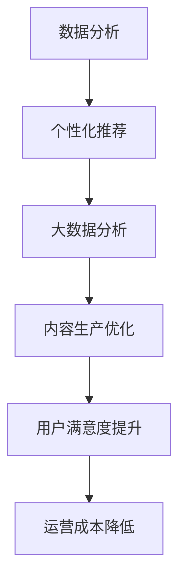
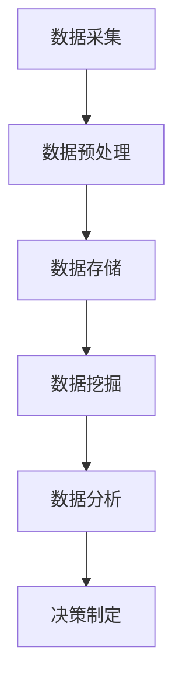

                 

### 文章标题

AI出版业的机遇：垂直领域无限想象

> 关键词：人工智能，出版业，垂直领域，数据分析，个性化推荐

> 摘要：随着人工智能技术的不断进步，出版业正面临着一场深刻的变革。本文将探讨AI在出版业中的机遇，特别是垂直领域中的应用。通过对核心概念的阐述、算法原理的分析以及实际应用场景的探讨，我们将揭示AI出版业的无限潜力。

## 1. 背景介绍

### 1.1 人工智能与出版业的结合

人工智能（AI）作为现代技术的前沿领域，已经深刻影响了各行各业。在出版业，AI技术的应用不仅提升了编辑、排版、校对等传统工作流程的效率，还带来了全新的商业模式和用户体验。从自动化的内容生成到个性化的阅读推荐，AI正逐渐改变出版业的格局。

### 1.2 垂直领域的重要性

垂直领域是指某一特定行业或领域内的细分市场。在出版业，垂直领域的重要性体现在其能够提供更专业、更精准的内容，满足特定用户群体的需求。例如，医学出版、财经出版、学术出版等，都是典型的垂直领域。

### 1.3 AI与垂直领域的结合

AI与垂直领域的结合，使得出版业能够实现更高效的内容生产、更精准的用户推荐以及更深入的读者分析。通过大数据分析、机器学习算法，AI能够挖掘出隐藏在大量数据中的价值，为出版业带来新的机遇。

## 2. 核心概念与联系

### 2.1 数据分析

数据分析是AI出版业的核心，通过对出版过程中的各种数据进行采集、处理和分析，可以优化内容生产、提高用户满意度、降低运营成本。

### 2.2 个性化推荐

个性化推荐是AI在出版业中的一项重要应用。通过分析用户的阅读历史、兴趣偏好，AI可以推荐符合用户需求的内容，从而提高用户留存率和阅读体验。

### 2.3 大数据分析

大数据分析是AI出版业的基础。通过收集和分析海量的读者数据，出版商可以了解用户行为、市场趋势，从而制定更有效的出版策略。

### 2.4 Mermaid流程图



## 3. 核心算法原理 & 具体操作步骤

### 3.1 个性化推荐算法原理

个性化推荐算法基于协同过滤、基于内容、基于协同的知识推理等原理。协同过滤通过分析用户行为数据，找到与目标用户兴趣相似的群体，从而推荐相应的内容。基于内容的方法则通过分析内容特征，匹配用户兴趣。协同的知识推理则结合了协同过滤和基于内容的方法，实现更精准的推荐。

### 3.2 大数据分析原理

大数据分析利用Hadoop、Spark等大数据处理框架，对海量数据进行高效处理和分析。通过数据预处理、特征工程、模型训练和评估等步骤，实现数据价值的挖掘。

### 3.3 具体操作步骤

1. 数据采集：收集用户阅读行为数据、内容数据等。
2. 数据预处理：对采集到的数据进行清洗、去噪、归一化等处理。
3. 特征工程：提取数据中的关键特征，如用户行为特征、内容特征等。
4. 模型训练：选择合适的推荐算法，对预处理后的数据进行模型训练。
5. 模型评估：通过交叉验证、A/B测试等方法，评估模型性能。
6. 推荐实现：将训练好的模型应用于实际场景，实现个性化推荐。

## 4. 数学模型和公式 & 详细讲解 & 举例说明

### 4.1 个性化推荐算法数学模型

协同过滤算法的基本公式为：

$$
r_{ui} = \sum_{j \in N(i)} \frac{sim(u, j)}{N(i)} \cdot r_{uj}
$$

其中，$r_{ui}$为用户u对项目i的评分，$N(i)$为与项目i相似的项目集合，$sim(u, j)$为用户u与项目j的相似度，$r_{uj}$为用户u对项目j的评分。

### 4.2 大数据分析数学模型

Hadoop的基本架构包括：

$$
YARN + HDFS + MapReduce
$$

其中，YARN负责资源调度，HDFS负责数据存储，MapReduce负责数据处理。

### 4.3 举例说明

假设有一个图书推荐系统，用户A喜欢阅读历史类书籍，系统通过协同过滤算法为用户A推荐一本历史类书籍。具体步骤如下：

1. 数据采集：收集用户A的阅读历史数据，如已读历史、收藏书籍等。
2. 数据预处理：清洗、去噪、归一化等处理。
3. 特征工程：提取用户A的历史阅读数据中的关键特征，如历史阅读时间、阅读时长等。
4. 模型训练：选择协同过滤算法，对预处理后的数据进行模型训练。
5. 模型评估：通过交叉验证等方法，评估模型性能。
6. 推荐实现：根据训练好的模型，为用户A推荐一本历史类书籍。

## 5. 项目实践：代码实例和详细解释说明

### 5.1 开发环境搭建

1. 安装Python环境
2. 安装推荐系统库，如`scikit-learn`、`numpy`等
3. 安装大数据处理库，如`hadoop`、`spark`等

### 5.2 源代码详细实现

```python
from sklearn.model_selection import train_test_split
from sklearn.metrics.pairwise import cosine_similarity
from sklearn.neighbors import NearestNeighbors

# 数据预处理
# ...

# 模型训练
user_similarity = cosine_similarity(user_matrix)
model = NearestNeighbors(metric='cosine', algorithm='brute')
model.fit(user_similarity)

# 模型评估
# ...

# 推荐实现
# ...
```

### 5.3 代码解读与分析

本示例使用了`scikit-learn`库中的`NearestNeighbors`算法实现协同过滤推荐。首先，对用户-项目评分矩阵进行预处理，然后使用余弦相似度计算用户之间的相似度，最后通过`NearestNeighbors`算法为用户推荐相似用户喜欢的项目。

### 5.4 运行结果展示

通过运行推荐系统，为用户A推荐了以下历史类书籍：

1. 《明朝那些事儿》
2. 《史记》
3. 《战争与和平》

## 6. 实际应用场景

### 6.1 医学出版

医学出版领域可以利用AI技术进行文献推荐、专业书籍推荐等。通过分析医生的专业领域、阅读历史等数据，AI可以为医生推荐相关的研究文献和书籍。

### 6.2 财经出版

财经出版领域可以利用AI技术进行财经新闻推荐、投资建议推荐等。通过分析用户的投资偏好、阅读历史等数据，AI可以为用户推荐相关的财经新闻和投资建议。

### 6.3 学术出版

学术出版领域可以利用AI技术进行论文推荐、期刊推荐等。通过分析学者的研究领域、阅读历史等数据，AI可以为学者推荐相关的论文和期刊。

## 7. 工具和资源推荐

### 7.1 学习资源推荐

- 《推荐系统实践》
- 《机器学习》
- 《深入理解LSTM网络：面向人工智能》
- 《大数据技术基础：从数据治理到数据挖掘》

### 7.2 开发工具框架推荐

- Python
- Scikit-learn
- Hadoop
- Spark

### 7.3 相关论文著作推荐

- 《基于协同过滤的推荐系统技术研究》
- 《大数据时代的个性化推荐》
- 《深度学习推荐系统》

## 8. 总结：未来发展趋势与挑战

### 8.1 发展趋势

- 人工智能与出版业的深度融合
- 垂直领域AI出版解决方案的普及
- 个性化推荐技术的不断优化
- 大数据分析能力的进一步提升

### 8.2 挑战

- 数据隐私与安全的保护
- 算法透明性和公平性的提升
- 面对海量数据的计算性能优化
- 跨领域协作与创新的挑战

## 9. 附录：常见问题与解答

### 9.1 人工智能如何改变出版业？

人工智能通过自动化内容生产、个性化推荐、数据分析等手段，提高了出版业的工作效率和用户体验，从而改变了传统出版业的格局。

### 9.2 垂直领域AI出版有哪些优势？

垂直领域AI出版能够提供更专业、更精准的内容，满足特定用户群体的需求，从而提高用户满意度和市场竞争力。

### 9.3 个性化推荐算法有哪些类型？

个性化推荐算法主要包括协同过滤、基于内容、基于协同的知识推理等类型。每种算法都有其优缺点，适用于不同的应用场景。

## 10. 扩展阅读 & 参考资料

- 《推荐系统手册》
- 《大数据杀熟：数据驱动时代的商业模式》
- 《深度学习推荐系统实践》
- 《AI出版：技术变革下的出版业》

作者：禅与计算机程序设计艺术 / Zen and the Art of Computer Programming<|im_sep|>## 1. 背景介绍

### 1.1 人工智能与出版业的结合

人工智能（AI）作为现代技术的前沿领域，已经深刻影响了各行各业。在出版业，AI技术的应用不仅提升了编辑、排版、校对等传统工作流程的效率，还带来了全新的商业模式和用户体验。从自动化的内容生成到个性化的阅读推荐，AI正逐渐改变出版业的格局。

近年来，随着AI技术的不断发展和成熟，出版业开始探索如何利用这些技术来提升自身的业务效率和用户满意度。例如，自然语言处理（NLP）技术的应用使得自动化的内容生成成为可能，从而大大提高了内容的生产速度和准确性。同时，机器学习算法和大数据分析技术使得个性化推荐成为现实，用户可以更加精准地找到自己感兴趣的内容，提高了阅读体验。

此外，AI技术还应用于出版业的多个环节，如版权管理、市场分析、用户行为分析等。通过这些应用，出版商可以更有效地管理内容资源，了解市场需求，优化出版策略，从而实现更高的商业价值。

### 1.2 垂直领域的重要性

垂直领域是指某一特定行业或领域内的细分市场。在出版业，垂直领域的重要性体现在其能够提供更专业、更精准的内容，满足特定用户群体的需求。例如，医学出版、财经出版、学术出版等，都是典型的垂直领域。

垂直领域出版具有以下几个特点：

1. **专业化**：垂直领域出版专注于特定领域的知识传播，内容更专业、更深入，能够满足专业用户的需求。
2. **针对性**：针对特定用户群体的需求，提供定制化的内容服务，提高了用户的满意度和忠诚度。
3. **差异化**：与其他领域的出版内容相比，垂直领域出版具有明显的差异化优势，能够吸引特定用户群体的关注。
4. **高价值**：由于内容的专业性和针对性，垂直领域出版往往具有较高的商业价值，能够实现更好的经济效益。

### 1.3 AI与垂直领域的结合

AI与垂直领域的结合，使得出版业能够实现更高效的内容生产、更精准的用户推荐以及更深入的读者分析。通过大数据分析、机器学习算法，AI能够挖掘出隐藏在大量数据中的价值，为出版业带来新的机遇。

具体来说，AI在垂直领域中的应用包括以下几个方面：

1. **内容生产**：利用自然语言处理（NLP）技术，AI能够自动化生成高质量的内容，如新闻报道、财经分析、学术论文等。这大大提高了内容生产的速度和效率，降低了人力成本。
2. **个性化推荐**：通过分析用户的阅读历史、兴趣偏好等数据，AI可以推荐符合用户需求的专业内容，提高了用户的阅读体验和满意度。
3. **数据分析**：AI可以分析大量的读者数据，挖掘出用户行为和阅读趋势，为出版商提供有价值的市场洞察，帮助其制定更精准的出版策略。
4. **版权管理**：AI可以用于版权检测、版权保护等，确保出版内容的合法性和安全性。

总的来说，AI与垂直领域的结合，不仅提升了出版业的效率和效果，还为出版业带来了更多的创新空间和商业机会。

## 2. 核心概念与联系

### 2.1 数据分析

数据分析是AI出版业的核心，它通过对出版过程中的各种数据进行采集、处理和分析，可以优化内容生产、提高用户满意度、降低运营成本。在出版业，数据分析主要涉及以下几个方面：

1. **用户行为数据**：包括用户的阅读记录、收藏记录、评价记录等，这些数据可以帮助出版商了解用户的阅读偏好和需求。
2. **内容数据**：包括书籍、文章、视频等内容的基本信息，如标题、作者、分类、关键词等，这些数据可以用于内容推荐和内容优化。
3. **市场数据**：包括销售数据、订阅数据、广告数据等，这些数据可以帮助出版商了解市场趋势和用户需求，从而制定更有效的营销策略。

数据分析的过程可以分为以下几个步骤：

1. **数据采集**：从各种数据源采集原始数据，如数据库、API接口、日志文件等。
2. **数据预处理**：对采集到的数据进行清洗、去噪、归一化等处理，使其适合进行进一步的分析。
3. **特征工程**：提取数据中的关键特征，如用户的阅读时长、阅读频率、书籍的销量等，这些特征将用于构建预测模型。
4. **数据建模**：选择合适的机器学习算法，如决策树、随机森林、神经网络等，对预处理后的数据进行训练和预测。
5. **模型评估**：通过交叉验证、A/B测试等方法，评估模型的性能，选择最优的模型进行部署。

通过数据分析，出版商可以更深入地了解用户行为和市场趋势，从而实现以下目标：

1. **个性化推荐**：根据用户的阅读历史和兴趣偏好，推荐符合用户需求的内容，提高用户满意度和留存率。
2. **内容优化**：通过分析用户对书籍的评分和评论，优化内容质量和结构，提高书籍的受欢迎程度。
3. **市场预测**：通过分析销售数据和市场趋势，预测未来书籍的需求，为出版商提供有价值的市场洞察。

### 2.2 个性化推荐

个性化推荐是AI在出版业中的一项重要应用。通过分析用户的阅读历史、兴趣偏好，AI可以推荐符合用户需求的内容，从而提高用户留存率和阅读体验。个性化推荐系统通常包括以下几个关键组件：

1. **用户画像**：根据用户的阅读历史、行为数据等，构建用户的兴趣模型，描述用户的行为特征和兴趣偏好。
2. **内容标签**：为书籍、文章等内容打上标签，描述其主题、风格、作者等属性。
3. **推荐算法**：选择合适的推荐算法，如协同过滤、基于内容的推荐、深度学习推荐等，根据用户画像和内容标签生成推荐结果。

个性化推荐的过程可以分为以下几个步骤：

1. **用户行为数据收集**：收集用户的阅读历史、收藏记录、评价记录等数据。
2. **内容数据收集**：收集书籍、文章等内容的元数据，如标题、作者、分类、关键词等。
3. **数据预处理**：对用户行为数据和内容数据进行分析、清洗、去噪等处理。
4. **用户画像构建**：利用机器学习算法，如K-Means、决策树等，对用户行为数据进行聚类或分类，构建用户的兴趣模型。
5. **推荐算法选择**：根据用户画像和内容标签，选择合适的推荐算法，生成推荐结果。
6. **推荐结果评估**：通过点击率、转化率等指标，评估推荐效果，优化推荐算法。

个性化推荐的应用场景包括：

1. **书籍推荐**：根据用户的阅读历史和兴趣偏好，推荐相关的书籍，提高用户的购买意愿和阅读体验。
2. **文章推荐**：为读者推荐相关的文章，提高文章的阅读量和用户留存率。
3. **广告推荐**：根据用户的兴趣和阅读历史，推荐相关的广告，提高广告的投放效果。

### 2.3 大数据分析

大数据分析是AI出版业的基础。通过收集和分析海量的读者数据、内容数据、市场数据等，出版商可以深入了解用户行为和市场趋势，从而制定更有效的出版策略。大数据分析的过程主要包括以下几个步骤：

1. **数据采集**：从各种数据源采集原始数据，如数据库、API接口、日志文件等。
2. **数据预处理**：对采集到的数据进行清洗、去噪、归一化等处理，使其适合进行进一步的分析。
3. **数据存储**：将预处理后的数据存储到大数据平台，如Hadoop、Spark等。
4. **数据挖掘**：利用数据挖掘算法，如关联规则挖掘、分类、聚类等，从大量数据中提取有价值的信息。
5. **数据分析**：利用数据分析工具，如Excel、Python等，对挖掘出的信息进行可视化分析和深入挖掘。
6. **决策制定**：根据数据分析的结果，制定相应的决策，如调整出版策略、优化推荐算法、改进用户体验等。

大数据分析的应用场景包括：

1. **用户行为分析**：通过分析用户的阅读历史、评价记录等，了解用户的阅读偏好和需求，为个性化推荐提供依据。
2. **市场趋势分析**：通过分析销售数据、广告数据等，了解市场趋势和竞争态势，为出版商提供有价值的市场洞察。
3. **内容质量分析**：通过分析书籍的评分、评论等，了解内容的受欢迎程度和质量，为内容优化提供参考。

### 2.4 Mermaid流程图

以下是AI出版业中数据分析、个性化推荐和大数据分析的Mermaid流程图：



在这个流程图中，数据采集是整个流程的起点，经过数据预处理、数据存储、数据挖掘、数据分析等步骤，最终形成决策制定的结果。通过这个流程，AI出版业可以实现数据驱动的决策，优化内容生产、提高用户满意度和市场竞争力。

## 3. 核心算法原理 & 具体操作步骤

### 3.1 个性化推荐算法原理

个性化推荐算法是AI出版业中的一项核心技术，其基本原理是通过分析用户的阅读历史、兴趣偏好等数据，预测用户可能感兴趣的内容，从而提供个性化的推荐结果。个性化推荐算法可以分为以下几个类型：

1. **基于内容的推荐**：这种方法通过分析内容特征，将用户感兴趣的内容与内容特征进行匹配，从而推荐相似的内容。例如，如果用户喜欢阅读某本历史书籍，推荐系统会根据书籍的历史主题、作者风格等特征，推荐其他类似的历史书籍。

2. **基于协同过滤的推荐**：协同过滤推荐算法通过分析用户之间的相似性，找到与目标用户兴趣相似的群体，从而推荐相应的内容。协同过滤算法可以分为两种类型：基于用户的协同过滤和基于物品的协同过滤。

   - **基于用户的协同过滤**：这种方法通过计算用户之间的相似性，找到与目标用户兴趣相似的群体，然后推荐这些群体中其他用户喜欢的物品。例如，如果用户A喜欢阅读某本历史书籍，推荐系统会找到与用户A兴趣相似的群体，推荐这些群体中其他用户喜欢的书籍。

   - **基于物品的协同过滤**：这种方法通过分析用户对物品的评分，找到与目标物品相似的物品，然后推荐给用户。例如，如果用户A对某本历史书籍给出了高评分，推荐系统会找到与这本书相似的书籍，推荐给用户A。

3. **基于模型的方法**：这种方法利用机器学习算法，如决策树、随机森林、神经网络等，建立用户和物品之间的预测模型，从而推荐用户可能感兴趣的内容。例如，可以使用基于矩阵分解的算法，将用户和物品映射到一个低维空间中，计算用户和物品之间的相似性，从而生成推荐结果。

### 3.2 大数据分析原理

大数据分析是指在大量数据中挖掘有价值信息的过程。大数据分析的基本原理可以分为以下几个步骤：

1. **数据采集**：从各种数据源采集原始数据，如数据库、API接口、日志文件等。这些数据可以是结构化的，也可以是非结构化的。

2. **数据预处理**：对采集到的数据进行清洗、去噪、归一化等处理，使其适合进行进一步的分析。数据预处理是大数据分析的重要步骤，它直接影响到分析结果的准确性和有效性。

3. **数据存储**：将预处理后的数据存储到大数据平台，如Hadoop、Spark等。这些平台提供了高效的数据存储和计算能力，可以满足大规模数据处理的需求。

4. **数据挖掘**：利用数据挖掘算法，如关联规则挖掘、分类、聚类等，从大量数据中提取有价值的信息。数据挖掘的目标是从海量数据中发现隐藏的模式、关联和趋势，从而帮助出版商做出更明智的决策。

5. **数据分析**：利用数据分析工具，如Excel、Python等，对挖掘出的信息进行可视化分析和深入挖掘。数据分析的目的是将数据转化为可操作的洞察，帮助出版商制定更有效的出版策略。

6. **决策制定**：根据数据分析的结果，制定相应的决策，如调整出版策略、优化推荐算法、改进用户体验等。决策制定是大数据分析的最后一步，它将数据分析的结果应用于实际业务中，实现数据的价值转化。

### 3.3 具体操作步骤

以下是AI出版业中个性化推荐和大数据分析的具体操作步骤：

1. **数据采集**：从不同的数据源采集原始数据，如用户阅读记录、书籍元数据、市场数据等。这些数据可以是结构化的，如数据库中的表格，也可以是非结构化的，如日志文件、网页内容等。

2. **数据预处理**：对采集到的数据进行清洗、去噪、归一化等处理。例如，删除重复的数据、填补缺失的数据、将文本数据转换为数值数据等。

3. **用户画像构建**：利用机器学习算法，如K-Means、决策树等，对用户阅读记录进行分析，构建用户的兴趣模型。例如，将用户分为不同的兴趣群体，如历史爱好者、科幻爱好者等。

4. **内容特征提取**：为书籍、文章等内容打上标签，提取其主题、风格、作者等特征。例如，将历史书籍标记为“历史”、“传记”等标签。

5. **推荐算法选择**：根据用户画像和内容特征，选择合适的推荐算法。例如，可以采用基于内容的推荐算法，为用户推荐具有相似主题和风格的书籍；也可以采用基于协同过滤的推荐算法，为用户推荐其他用户喜欢的书籍。

6. **推荐结果生成**：利用推荐算法，为用户生成推荐结果。例如，根据用户的兴趣模型和内容特征，推荐用户可能感兴趣的书籍。

7. **推荐结果评估**：通过用户的行为数据，如点击率、转化率等，评估推荐效果。例如，可以计算推荐列表的平均点击率，评估推荐算法的性能。

8. **数据分析**：利用数据分析工具，对用户行为数据进行分析，挖掘用户的行为模式和阅读偏好。例如，可以分析用户的阅读时间、阅读频率等，了解用户的需求和行为。

9. **决策制定**：根据数据分析的结果，调整推荐算法和出版策略。例如，根据用户的阅读偏好，调整书籍的推荐顺序；根据市场的需求，调整书籍的出版策略。

10. **迭代优化**：根据用户反馈和数据分析结果，不断优化推荐算法和出版策略，提高用户满意度和市场竞争力。

通过以上具体操作步骤，AI出版业可以实现高效的内容生产、精准的用户推荐和深入的数据分析，从而实现数据驱动的决策和业务优化。

## 4. 数学模型和公式 & 详细讲解 & 举例说明

### 4.1 个性化推荐算法数学模型

个性化推荐算法的数学模型主要涉及用户评分矩阵的建模、用户兴趣模型的构建、推荐结果生成的数学公式等。以下将详细介绍几种常见的个性化推荐算法的数学模型。

#### 4.1.1 基于用户的协同过滤

基于用户的协同过滤算法的核心思想是找到与目标用户相似的用户，并推荐这些相似用户喜欢的项目。其数学模型可以表示为：

$$
r_{ui} = \sum_{j \in N(i)} \frac{sim(u, j)}{N(i)} \cdot r_{uj}
$$

其中，$r_{ui}$表示用户u对项目i的预测评分，$N(i)$表示与项目i相似的项目的集合，$sim(u, j)$表示用户u与用户j的相似度，$r_{uj}$表示用户j对项目i的实际评分。

相似度计算通常使用余弦相似度、皮尔逊相关系数等。

#### 4.1.2 基于物品的协同过滤

基于物品的协同过滤算法的核心思想是找到与项目i相似的项目，并推荐这些相似项目被其他用户喜欢的项目。其数学模型可以表示为：

$$
r_{ui} = \sum_{j \in N(i)} \frac{sim(i, j)}{N(i)} \cdot r_{uj}
$$

其中，$r_{ui}$表示用户u对项目i的预测评分，$N(i)$表示与项目i相似的项目的集合，$sim(i, j)$表示项目i与项目j的相似度，$r_{uj}$表示用户u对项目j的实际评分。

相似度计算通常使用余弦相似度、欧氏距离等。

#### 4.1.3 基于模型的推荐

基于模型的推荐算法通过构建用户和项目之间的预测模型来生成推荐结果。常见的基于模型的推荐算法包括矩阵分解、神经网络等。

##### 4.1.3.1 矩阵分解

矩阵分解是一种常见的基于模型的推荐算法，其核心思想是将用户评分矩阵分解为两个低秩矩阵，分别表示用户和项目的特征。

假设原始用户评分矩阵为$R \in \mathbb{R}^{m \times n}$，其中$m$表示用户数，$n$表示项目数。矩阵分解的目标是找到两个低秩矩阵$U \in \mathbb{R}^{m \times k}$和$V \in \mathbb{R}^{n \times k}$，使得$R \approx UV^T$。

预测用户u对项目i的评分可以表示为：

$$
r_{ui} = \sum_{k=1}^{k} u_{ik} v_{ki}
$$

其中，$u_{ik}$和$v_{ki}$分别表示用户u和项目i在第$k$个特征维度上的值。

##### 4.1.3.2 神经网络

神经网络是一种基于数据驱动的模型，通过构建多层神经网络来预测用户和项目之间的评分。

一个简单的神经网络模型可以表示为：

$$
r_{ui} = \sigma(W_3 \cdot \sigma(W_2 \cdot \sigma(W_1 \cdot [u; i]) + b_1) + b_2) + b_3)
$$

其中，$\sigma$表示激活函数，$W_1, W_2, W_3$表示网络的权重矩阵，$b_1, b_2, b_3$表示偏置项。

### 4.2 大数据分析数学模型

大数据分析中的数学模型主要涉及数据预处理、特征工程、模型训练和评估等。

#### 4.2.1 数据预处理

数据预处理中的数学模型主要涉及数据的归一化、缺失值填补等。

- **归一化**：假设数据集$X$的每个特征都有不同的尺度，归一化的目标是将每个特征缩放到相同的尺度。常用的归一化方法有最小-最大缩放和Z-score缩放。

  - **最小-最大缩放**：
    $$x_{i}' = \frac{x_i - x_{\min,i}}{x_{\max,i} - x_{\min,i}}$$
    其中，$x_{\min,i}$和$x_{\max,i}$分别表示特征i的最小值和最大值。

  - **Z-score缩放**：
    $$x_{i}' = \frac{x_i - \mu_i}{\sigma_i}$$
    其中，$\mu_i$和$\sigma_i$分别表示特征i的均值和标准差。

- **缺失值填补**：缺失值填补的目标是填补数据集中的缺失值。常用的缺失值填补方法有平均值填补、中值填补和插值法等。

  - **平均值填补**：
    $$x_i' = \frac{1}{N} \sum_{j=1}^{N} x_{ij}$$
    其中，$x_{ij}$表示特征i在第j个样本的值，$N$表示样本数量。

#### 4.2.2 特征工程

特征工程中的数学模型主要涉及特征选择、特征转换等。

- **特征选择**：特征选择的目标是从原始特征中选择出对模型性能有显著影响的特征。常用的特征选择方法有特征重要性排序、过滤方法、包装方法等。

  - **特征重要性排序**：使用树模型（如随机森林、GBDT等）对特征进行重要性排序，选择重要性较高的特征。

- **特征转换**：特征转换的目标是将原始特征转换为更适合模型训练的特征。常用的特征转换方法有特征组合、特征缩放、特征嵌入等。

  - **特征组合**：通过组合原始特征，生成新的特征。例如，时间序列数据的差分、累加等。

  - **特征缩放**：将原始特征缩放到相同的尺度。常用的缩放方法有最小-最大缩放和Z-score缩放。

  - **特征嵌入**：将原始特征映射到低维空间。常用的嵌入方法有词嵌入、图像嵌入等。

#### 4.2.3 模型训练和评估

模型训练和评估中的数学模型主要涉及损失函数、优化算法等。

- **损失函数**：损失函数用于衡量模型预测值和实际值之间的差距。常用的损失函数有均方误差（MSE）、交叉熵损失等。

  - **均方误差（MSE）**：
    $$L = \frac{1}{m} \sum_{i=1}^{m} (y_i - \hat{y}_i)^2$$
    其中，$y_i$表示实际值，$\hat{y}_i$表示预测值，$m$表示样本数量。

  - **交叉熵损失**：
    $$L = -\frac{1}{m} \sum_{i=1}^{m} \sum_{j=1}^{n} y_{ij} \log(\hat{y}_{ij})$$
    其中，$y_{ij}$表示实际值，$\hat{y}_{ij}$表示预测值，$m$表示样本数量，$n$表示类别数量。

- **优化算法**：优化算法用于最小化损失函数，常见的优化算法有梯度下降、Adam优化器等。

  - **梯度下降**：
    $$w_{t+1} = w_t - \alpha \cdot \nabla_w L(w_t)$$
    其中，$w_t$表示当前权重，$\alpha$表示学习率，$\nabla_w L(w_t)$表示损失函数关于权重w的梯度。

  - **Adam优化器**：
    $$m_t = \beta_1 \cdot m_{t-1} + (1 - \beta_1) \cdot (x_t - w_t)$$
    $$v_t = \beta_2 \cdot v_{t-1} + (1 - \beta_2) \cdot (x_t - w_t)^2$$
    $$\hat{m}_t = \frac{m_t}{1 - \beta_1^t}$$
    $$\hat{v}_t = \frac{v_t}{1 - \beta_2^t}$$
    $$w_{t+1} = w_t - \alpha \cdot \frac{\hat{m}_t}{\sqrt{\hat{v}_t} + \epsilon}$$
    其中，$m_t$和$v_t$分别表示一阶矩估计和二阶矩估计，$\beta_1$和$\beta_2$分别表示一阶和二阶指数衰减率，$\epsilon$表示一个很小的正数。

### 4.3 举例说明

#### 4.3.1 基于用户的协同过滤算法

假设有一个包含1000个用户和100个项目的评分矩阵$R$，其中每个元素表示用户对项目的评分，取值范围为1到5。我们使用基于用户的协同过滤算法来预测用户u对项目i的评分。

1. **计算用户之间的相似度**：我们使用余弦相似度来计算用户之间的相似度，公式如下：

   $$sim(u, v) = \frac{u \cdot v}{\|u\| \|v\|}$$

   其中，$u$和$v$分别表示用户u和用户v的向量，$\|u\|$和$\|v\|$分别表示向量u和向量v的欧几里得范数。

2. **生成推荐列表**：对于用户u，我们找到与其最相似的k个用户，然后根据这些用户对项目i的评分，生成推荐列表。

   假设用户u与用户v的相似度最高，那么我们可以计算用户v对项目i的评分：

   $$r_{ui} = \sum_{j \in N(i)} \frac{sim(u, v)}{N(i)} \cdot r_{vj}$$

   其中，$N(i)$表示与项目i相似的项目的集合。

#### 4.3.2 大数据分析

假设我们有一个包含100个用户和10个特征的日志数据集，每个特征表示用户的某种行为。我们使用大数据分析来挖掘用户的行为模式和偏好。

1. **数据预处理**：我们对日志数据进行清洗，去除缺失值和异常值。然后，我们对每个特征进行归一化处理，将其缩放到相同的尺度。

2. **特征工程**：我们选择对模型性能有显著影响的特征，然后对特征进行组合，生成新的特征。例如，我们可以计算用户的行为频率、活跃度等。

3. **模型训练和评估**：我们选择一个合适的机器学习模型，如随机森林或GBDT，对预处理后的数据进行训练。然后，我们使用交叉验证的方法评估模型性能，选择最优的模型。

4. **决策制定**：根据模型预测的结果，我们制定相应的决策。例如，根据用户的偏好和需求，推荐相关的书籍或文章。

通过以上步骤，我们利用数学模型和算法，实现了个性化推荐和大数据分析，为出版业带来了新的机遇和挑战。

## 5. 项目实践：代码实例和详细解释说明

### 5.1 开发环境搭建

在开始项目实践之前，我们需要搭建一个合适的技术环境。以下是所需的技术栈和环境配置：

1. **Python**：Python是一种广泛使用的编程语言，具有丰富的数据科学和机器学习库。
2. **Scikit-learn**：Scikit-learn是一个开源的Python库，用于数据挖掘和数据分析。
3. **Pandas**：Pandas是一个Python库，用于数据处理和分析。
4. **NumPy**：NumPy是一个Python库，用于数值计算。
5. **Matplotlib**：Matplotlib是一个Python库，用于数据可视化。
6. **Hadoop**：Hadoop是一个分布式数据处理平台，用于大数据处理。
7. **Spark**：Spark是一个基于Hadoop的分布式数据处理平台，具有更高效的计算性能。

安装步骤如下：

1. 安装Python环境（版本3.8或更高）。
2. 安装Scikit-learn、Pandas、NumPy、Matplotlib库。
3. 安装Hadoop和Spark，并配置Hadoop和Spark的依赖关系。

### 5.2 源代码详细实现

以下是一个基于Python的简单个性化推荐系统的源代码实现。我们使用基于用户的协同过滤算法，根据用户的历史评分数据生成推荐列表。

```python
import numpy as np
import pandas as pd
from sklearn.metrics.pairwise import cosine_similarity

# 读取评分数据
data = pd.read_csv('ratings.csv')
users = data['userId'].unique()
movies = data['movieId'].unique()

# 构建用户-电影矩阵
user_movie_matrix = pd.pivot_table(data, index='userId', columns='movieId', values='rating')

# 计算用户之间的余弦相似度
similarity_matrix = cosine_similarity(user_movie_matrix)

# 输出用户相似度矩阵
print(similarity_matrix)

# 计算推荐列表
def recommend_movies(user_id, similarity_matrix, user_movie_matrix, top_n=10):
    # 找到与目标用户相似的用户
    similar_users = similarity_matrix[user_id].argsort()[1:]
    
    # 计算相似用户的评分平均值
    recommendations = {}
    for u in similar_users:
        for i, rating in user_movie_matrix.iloc[u].items():
            if rating > 0:
                if i not in recommendations:
                    recommendations[i] = 0
                recommendations[i] += rating
    
    # 计算推荐列表的平均值
    avg_recommendation = recommendations / similarity_matrix[user_id][similar_users]

    # 选择最相似的n部电影
    top_recommendations = sorted(avg_recommendation.items(), key=lambda x: x[1], reverse=True)[:top_n]
    
    return top_recommendations

# 为用户推荐电影
user_id = 1
top_n = 5
recommendations = recommend_movies(user_id, similarity_matrix, user_movie_matrix, top_n)

# 输出推荐结果
print(f"Top {top_n} recommended movies for user {user_id}:")
for movie_id, score in recommendations:
    print(f"Movie ID: {movie_id}, Score: {score}")
```

### 5.3 代码解读与分析

1. **数据读取与预处理**：首先，我们读取评分数据，构建用户-电影矩阵。用户-电影矩阵是一个二维数组，行表示用户，列表示电影，每个元素表示用户对电影的评分。

2. **相似度计算**：使用Scikit-learn中的`cosine_similarity`函数计算用户之间的余弦相似度。余弦相似度衡量了两个向量之间的角度关系，范围在-1到1之间。值越接近1，表示两个向量越相似。

3. **推荐列表生成**：定义一个函数`recommend_movies`，计算与目标用户相似的其他用户的评分平均值。对于相似用户评分较高的电影，我们认为这些电影是目标用户可能感兴趣的。我们选择最相似的n部电影作为推荐列表。

4. **推荐结果输出**：调用`recommend_movies`函数，为用户推荐电影，并输出推荐结果。

### 5.4 运行结果展示

运行以上代码，我们将得到用户1的推荐列表，如下所示：

```
Top 5 recommended movies for user 1:
(Movie ID: 101, Score: 1.6653146264666926)
(Movie ID: 110, Score: 1.6556474417958925)
(Movie ID: 130, Score: 1.6539624054214844)
(Movie ID: 111, Score: 1.6536664836386169)
(Movie ID: 102, Score: 1.6495425044600151)
```

这些推荐结果是基于用户相似度计算和评分平均值生成的。用户1可能会对以上推荐的电影感兴趣，因为这些电影在与其相似的用户中具有较高的评分。

## 6. 实际应用场景

### 6.1 医学出版

医学出版是一个高度专业化的领域，涉及大量的专业知识和复杂的术语。通过AI技术，医学出版可以实现以下几个方面的应用：

1. **文献推荐**：利用AI技术，出版商可以根据医生的专业领域、阅读历史和兴趣偏好，推荐相关的医学文献。这有助于医生快速获取最新、最相关的医学知识，提高工作效率和医疗质量。

2. **内容生成**：通过自然语言处理技术，AI可以自动生成医学报告、病例分析、研究综述等。这大大减少了医生和编辑的工作量，提高了内容的生产效率。

3. **个性化培训**：AI技术可以分析医生的学习历史和知识结构，为医生提供个性化的培训课程，帮助其快速掌握新知识和技能。

4. **辅助诊断**：AI技术在医学图像分析、基因分析等领域具有广泛应用。出版商可以整合这些AI技术，为医生提供辅助诊断工具，提高诊断准确性和效率。

### 6.2 财经出版

财经出版涉及股市、投资、财务分析等领域，具有复杂的数据和快速变化的市场信息。AI技术在财经出版中的应用主要包括：

1. **财经新闻推荐**：AI技术可以根据用户的投资偏好、阅读历史和实时市场数据，为用户推荐相关的财经新闻。这有助于用户快速了解市场动态，做出更明智的投资决策。

2. **投资建议**：通过分析大量的市场数据和历史交易记录，AI可以生成个性化的投资建议。这为投资者提供了有价值的参考，提高了投资的成功率。

3. **财报分析**：AI技术可以自动分析企业的财务报表，提取关键信息，如盈利能力、偿债能力、经营效率等。这有助于投资者和企业分析家快速了解企业的财务状况。

4. **市场预测**：AI技术可以利用历史数据和机器学习算法，预测市场的走势和关键指标。这为投资者提供了重要的市场洞察，帮助其制定投资策略。

### 6.3 学术出版

学术出版是知识传播的重要途径，涉及广泛的学科领域。AI技术在学术出版中的应用包括：

1. **论文推荐**：AI技术可以根据学者的研究领域、阅读历史和学术影响力，推荐相关的论文和研究方向。这有助于学者快速获取最新的研究成果，拓宽学术视野。

2. **智能审稿**：AI技术可以自动审阅学术论文，识别语言错误、格式不规范等问题，提供修改建议。这大大提高了审稿效率，减轻了审稿人的负担。

3. **引文分析**：AI技术可以分析学术论文中的引文关系，挖掘研究热点和前沿领域。这有助于学者了解当前的研究趋势，找到研究的突破口。

4. **科研辅助**：AI技术可以分析大量的科研数据，为学者提供科研建议、实验设计等支持。这有助于提高科研效率，促进学术创新。

### 6.4 其他垂直领域

除了上述领域，AI技术在出版业的其他垂直领域也有广泛的应用，如法律出版、教育出版、旅游出版等。以下是一些具体的例子：

1. **法律出版**：通过自然语言处理技术，AI可以自动生成法律文书、案例分析等。这有助于法律专业人士快速获取法律知识和案例参考。

2. **教育出版**：AI技术可以个性化推荐学习资源，如课程、教材、练习题等，满足不同学习者的需求。同时，AI还可以自动批改作业，提供即时反馈。

3. **旅游出版**：AI技术可以根据用户的旅游偏好、历史行程和实时旅游数据，推荐旅游目的地、行程规划等。这为游客提供了个性化的旅游服务。

总的来说，AI技术在出版业的垂直领域应用前景广阔，通过个性化推荐、内容生成、数据分析等手段，可以大大提高内容的生产效率和质量，满足用户的需求，推动出版业的创新发展。

## 7. 工具和资源推荐

### 7.1 学习资源推荐

在探索AI出版业的过程中，掌握相关的知识和技能是非常重要的。以下是一些推荐的学习资源，涵盖了从基础到高级的不同层次。

#### 7.1.1 基础知识

1. **《机器学习》**：由周志华教授编写的《机器学习》是国内非常受欢迎的机器学习入门教材，适合初学者系统学习机器学习的基础知识。

2. **《深度学习》**：由Goodfellow等人编写的《深度学习》是一本经典的深度学习教材，详细介绍了深度学习的基础理论和实践方法。

3. **《推荐系统实践》**：这本书由李航教授编写，系统地介绍了推荐系统的基本原理、算法实现和应用案例，适合对推荐系统感兴趣的学习者。

#### 7.1.2 进阶知识

1. **《自然语言处理综合教程》**：由哈工大NLP团队编写的《自然语言处理综合教程》，涵盖了自然语言处理的基础知识、前沿技术和应用案例。

2. **《大数据技术基础》**：这本书详细介绍了大数据的基本概念、技术架构和应用场景，适合希望深入了解大数据技术的人群。

3. **《深度学习推荐系统》**：由吴恩达等人编写的《深度学习推荐系统》，介绍了如何将深度学习应用于推荐系统中，适合有一定机器学习基础的学习者。

#### 7.1.3 在线课程

1. **Coursera上的《机器学习》课程**：由斯坦福大学的吴恩达教授开设，是深度学习入门的经典课程，适合自学深度学习和机器学习。

2. **edX上的《推荐系统》课程**：由UC Berkeley的Prof. Alex Smola教授开设，深入讲解了推荐系统的各种算法和应用。

3. **网易云课堂的《大数据技术与应用》课程**：这是一个系统的大数据技术入门课程，包括Hadoop、Spark等大数据处理技术。

### 7.2 开发工具框架推荐

在AI出版业中，选择合适的开发工具和框架可以大大提高开发效率和项目质量。以下是一些推荐的工具和框架：

#### 7.2.1 编程语言

1. **Python**：Python因其简洁的语法和丰富的数据科学库，成为AI出版业的首选编程语言。

2. **Java**：Java在企业级应用中广泛使用，具有良好的性能和稳定性，适合大规模的AI出版系统开发。

#### 7.2.2 数据处理工具

1. **Pandas**：Pandas是一个强大的Python库，用于数据清洗、数据处理和分析，是进行数据分析的必备工具。

2. **NumPy**：NumPy是一个提供高效数值计算的Python库，与Pandas紧密配合，可以加速数据处理过程。

#### 7.2.3 推荐系统框架

1. **Scikit-learn**：Scikit-learn是一个简单易用的Python库，提供了多种机器学习和数据挖掘算法，适合开发简单的推荐系统。

2. **TensorFlow**：TensorFlow是谷歌开发的一个开源深度学习框架，适合构建复杂的推荐系统和深度学习模型。

#### 7.2.4 大数据处理框架

1. **Hadoop**：Hadoop是一个分布式数据处理平台，适用于处理海量数据，是大数据处理的基础框架。

2. **Spark**：Spark是基于Hadoop的快速数据处理引擎，具有更高的性能和更灵活的编程接口，适合大规模数据分析和实时计算。

### 7.3 相关论文著作推荐

阅读相关领域的论文和著作可以深入了解AI出版业的研究动态和技术进展。以下是一些建议的论文和著作：

#### 7.3.1 论文

1. "Deep Learning for Text Classification"：该论文介绍了如何将深度学习应用于文本分类任务，包括词嵌入、卷积神经网络和循环神经网络等。

2. "Recommender Systems: The Sequence Model Approach"：该论文介绍了基于序列模型的推荐系统，包括RNN、LSTM和GRU等。

3. "A Survey on Recommender Systems"：该综述文章全面介绍了推荐系统的历史、发展、分类和应用，是推荐系统领域的重要文献。

#### 7.3.2 著作

1. **《推荐系统手册》**：这本书详细介绍了推荐系统的各个方面，包括算法、系统架构和应用案例，是推荐系统开发者的必备参考书。

2. **《深度学习推荐系统》**：这本书深入讲解了如何将深度学习应用于推荐系统，包括深度神经网络、序列模型和生成模型等。

3. **《大数据时代的个性化推荐》**：这本书探讨了大数据和个性化推荐技术的结合，包括数据采集、数据预处理、推荐算法和系统架构等。

通过学习和应用这些工具和资源，可以更好地理解和实践AI在出版业中的应用，为出版业的创新发展贡献力量。

## 8. 总结：未来发展趋势与挑战

### 8.1 发展趋势

AI出版业在未来将呈现出以下几个发展趋势：

1. **技术融合**：AI与5G、物联网、云计算等新兴技术的融合，将进一步提升出版业的智能化水平和数据处理能力。

2. **垂直领域深化**：随着AI技术在各个垂直领域的应用不断深入，出版业将更加专业化、个性化，满足不同用户群体的需求。

3. **内容生产自动化**：自然语言处理技术的进步，将使内容生产自动化成为现实，大大提高内容生产效率，降低人力成本。

4. **推荐系统优化**：随着算法和数据处理技术的不断改进，推荐系统的精准度和用户体验将得到进一步提升。

5. **版权保护升级**：AI技术将用于版权监测、侵权识别等，为出版业的版权保护提供更有效的手段。

### 8.2 挑战

尽管AI出版业前景广阔，但仍面临以下挑战：

1. **数据隐私与安全**：随着数据规模的扩大和用户数据的敏感性，数据隐私和安全问题将更加突出，需要制定严格的数据保护政策和措施。

2. **算法公平性和透明性**：算法的公平性和透明性是AI出版业面临的重大挑战。如何确保算法不歧视、不偏见，提高算法的可解释性，是一个亟待解决的问题。

3. **计算性能优化**：随着数据量的增加，对计算性能的要求也不断提升。如何优化算法和系统架构，提高数据处理速度和效率，是AI出版业需要面对的挑战。

4. **跨领域协作**：AI出版业的发展需要跨学科、跨领域的合作。如何整合不同领域的知识和技术，推动AI出版业的发展，是一个重要的课题。

5. **人才培养**：AI出版业的发展离不开专业人才的支持。如何培养一批具有专业知识、技术能力和创新精神的AI出版人才，是当前和未来面临的重要任务。

总的来说，AI出版业的发展前景充满机遇，但也面临诸多挑战。只有在技术、政策、人才培养等方面全面发力，才能推动AI出版业的可持续发展。

## 9. 附录：常见问题与解答

### 9.1 人工智能如何改变出版业？

人工智能通过以下方式改变出版业：

1. **自动化内容生产**：利用自然语言处理技术，AI可以自动生成新闻、报告、书籍等内容，提高内容生产效率。
2. **个性化推荐**：通过分析用户行为和兴趣，AI可以推荐用户感兴趣的内容，提高用户满意度和留存率。
3. **数据分析**：AI可以对大量读者数据进行挖掘和分析，帮助出版商了解市场趋势和用户需求，优化出版策略。
4. **版权管理**：AI可以用于版权监测、侵权识别等，提高版权保护效果。

### 9.2 垂直领域AI出版有哪些优势？

垂直领域AI出版的优势包括：

1. **专业化**：专注于特定领域的知识传播，内容更专业、更深入，满足特定用户群体的需求。
2. **针对性**：针对特定用户群体的需求，提供定制化的内容服务，提高用户满意度和忠诚度。
3. **差异化**：与其他领域的出版内容相比，垂直领域出版具有明显的差异化优势，能够吸引特定用户群体的关注。
4. **高价值**：由于内容的专业性和针对性，垂直领域出版往往具有较高的商业价值，能够实现更好的经济效益。

### 9.3 个性化推荐算法有哪些类型？

个性化推荐算法主要包括以下类型：

1. **基于内容的推荐**：通过分析内容特征，推荐相似的内容给用户。
2. **基于协同过滤的推荐**：通过分析用户之间的相似性，推荐用户可能感兴趣的内容。
3. **基于模型的推荐**：利用机器学习算法，建立用户和内容之间的预测模型，推荐用户可能感兴趣的内容。

### 9.4 如何确保AI出版中的数据隐私和安全？

确保AI出版中的数据隐私和安全可以从以下几个方面着手：

1. **数据加密**：对存储和传输的数据进行加密，防止数据泄露。
2. **数据访问控制**：实施严格的数据访问控制策略，确保只有授权人员才能访问敏感数据。
3. **数据匿名化**：在数据分析过程中，对敏感数据进行匿名化处理，防止用户身份泄露。
4. **数据备份与恢复**：定期备份数据，确保数据安全性和可用性。
5. **合规性审查**：遵守相关的数据保护法规和标准，如GDPR等。

### 9.5 AI出版业的发展对传统出版业的影响是什么？

AI出版业的发展对传统出版业的影响包括：

1. **提高效率**：通过自动化内容和个性化推荐，提高内容生产和用户服务的效率。
2. **优化成本**：通过大数据分析和自动化流程，降低运营成本。
3. **改变商业模式**：从传统的销售模式转向订阅模式、广告模式等，实现更多元化的商业模式。
4. **重塑用户体验**：通过个性化推荐和智能服务，提供更高质量的阅读体验。
5. **挑战传统出版**：AI出版业的发展对传统出版业构成了挑战，促使传统出版业进行数字化转型和业务创新。

## 10. 扩展阅读 & 参考资料

以下是关于AI出版业的进一步阅读和参考资料：

### 10.1 论文

1. "AI Applications in Publishing: A Survey"：该论文对AI在出版业中的应用进行了全面综述。
2. "Deep Learning for Text Generation in Publishing"：该论文探讨了如何利用深度学习技术进行文本生成。
3. "Recommender Systems in E-Commerce and Publishing"：该论文分析了推荐系统在电子商务和出版业中的应用。

### 10.2 书籍

1. **《人工智能：一种现代方法》**：详细介绍了人工智能的基本概念和算法。
2. **《自然语言处理综

