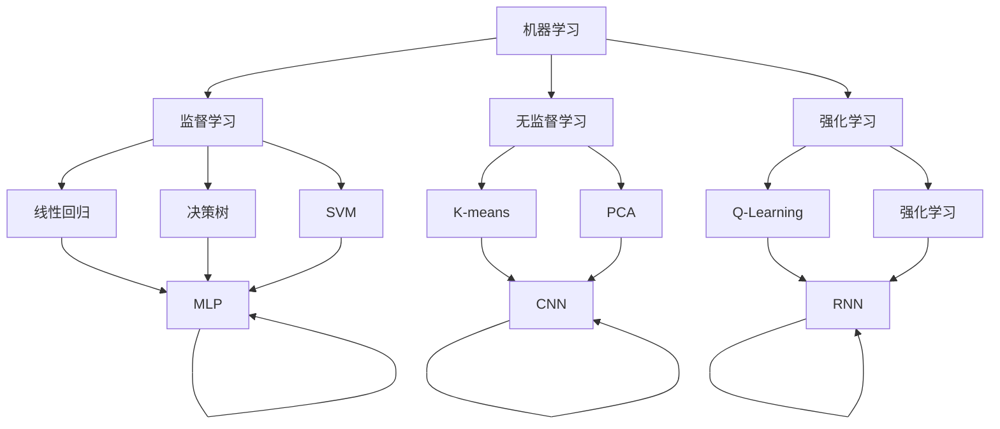

                 

### 1. 背景介绍

随着人工智能（AI）技术的迅速发展，AI创业已经成为科技领域的热门话题。无论是大数据分析、机器学习，还是自然语言处理，AI技术正在逐步渗透到各行各业，为企业和创业者提供了前所未有的机遇。然而，在AI创业的浪潮中，技术与数据无疑是成功的关键因素。本文将围绕AI创业中的技术与数据，探讨其中的核心概念、算法原理、数学模型以及实际应用场景，帮助读者深入理解这一领域。

AI创业不仅仅是技术创新的产物，更是数据驱动的商业模式。在当今这个数据爆炸的时代，谁掌握了数据，谁就掌握了市场主动权。数据不仅为AI算法提供了训练素材，也是企业决策的重要依据。因此，对于创业者而言，如何有效地利用技术处理数据、分析数据，以及基于数据驱动创新，成为亟待解决的问题。

本文将从以下几个部分进行详细阐述：

1. **核心概念与联系**：介绍AI创业中的核心概念，如机器学习、深度学习、神经网络等，并通过Mermaid流程图展示它们之间的关系。
2. **核心算法原理与具体操作步骤**：讲解常见的AI算法原理，如决策树、支持向量机、神经网络等，并阐述其具体操作步骤。
3. **数学模型和公式**：介绍AI算法背后的数学模型，如线性代数、概率统计、优化算法等，并进行详细讲解和举例说明。
4. **项目实践**：通过代码实例，展示如何在实际项目中应用AI技术，包括开发环境搭建、源代码实现、代码解读与分析，以及运行结果展示。
5. **实际应用场景**：分析AI技术在各个行业的应用场景，探讨其在业务流程中的价值和作用。
6. **工具和资源推荐**：推荐学习资源、开发工具框架以及相关论文著作，为读者提供进一步学习和实践的方向。
7. **总结**：总结AI创业中的技术与数据，展望未来发展趋势与挑战。

通过本文的逐步分析，希望能够帮助创业者更好地理解AI技术在商业中的应用，从而在AI创业的道路上迈出坚实的一步。

### 2. 核心概念与联系

在AI创业的浪潮中，理解一系列核心概念和技术之间的关系是至关重要的。这些概念包括机器学习、深度学习、神经网络等，它们在AI领域各自发挥着重要作用，同时也相互联系，构成了一个完整的AI技术体系。

#### 2.1 机器学习（Machine Learning）

机器学习是AI的基础，它通过构建数学模型来从数据中自动发现规律。简单来说，机器学习算法通过训练数据集，从中提取特征，构建出一个模型，然后使用这个模型对新的数据进行预测或决策。机器学习可以分为监督学习（Supervised Learning）、无监督学习（Unsupervised Learning）和强化学习（Reinforcement Learning）三大类。

- **监督学习**：监督学习算法需要依赖标记数据进行训练。例如，分类问题中，标记数据包含类别标签，算法通过学习这些标签来预测新数据的类别。常见的监督学习算法有线性回归、决策树、支持向量机（SVM）等。
- **无监督学习**：无监督学习算法不需要标记数据，其主要任务是发现数据中的隐含结构和模式。常见的无监督学习算法包括聚类算法（如K-means、层次聚类）、降维算法（如PCA）等。
- **强化学习**：强化学习算法通过不断尝试和反馈来学习策略。例如，在游戏AI中，算法通过不断尝试不同的动作，并从反馈中学习最优策略。

#### 2.2 深度学习（Deep Learning）

深度学习是机器学习的一个分支，它利用多层神经网络来提取数据的特征。与传统机器学习算法相比，深度学习能够在复杂的数据集中发现更深刻的特征，从而实现更好的性能。深度学习的关键在于“深度”——神经网络包含多层神经元，每一层都可以对输入数据进行变换和抽象。

- **神经网络（Neural Network）**：神经网络由大量相互连接的神经元组成。每个神经元接收多个输入，通过加权求和后加上偏置，再通过激活函数进行非线性变换，输出一个值。常见的神经网络结构包括多层感知机（MLP）、卷积神经网络（CNN）、循环神经网络（RNN）等。
- **卷积神经网络（CNN）**：卷积神经网络特别适用于处理图像数据。它通过卷积操作提取图像中的局部特征，然后通过池化操作减少数据的维度，实现特征提取和降维。
- **循环神经网络（RNN）**：循环神经网络适用于处理序列数据，如时间序列数据、文本数据等。它通过在时间步之间传递信息，使得模型能够记住之前的信息，从而实现长距离依赖的建模。

#### 2.3 神经网络（Neural Network）

神经网络是AI的核心技术之一，它模拟人脑神经元的工作方式，通过调整权重和偏置来实现学习和预测。神经网络可以分为多层感知机、卷积神经网络和循环神经网络等类型，每种类型都有其特定的应用场景。

- **多层感知机（MLP）**：多层感知机是最简单的神经网络结构，它包含多个层次，每一层都是线性变换加上非线性激活函数。MLP适用于各种分类和回归问题。
- **卷积神经网络（CNN）**：卷积神经网络特别适用于图像处理任务。它通过卷积层提取图像的局部特征，并通过池化层减少数据的维度，实现高效的图像特征提取。
- **循环神经网络（RNN）**：循环神经网络适用于处理序列数据，如时间序列数据、文本数据等。它通过在时间步之间传递信息，使得模型能够记住之前的信息，从而实现长距离依赖的建模。

#### Mermaid流程图

为了更直观地展示这些核心概念和技术之间的联系，我们可以使用Mermaid流程图进行说明。以下是一个简单的Mermaid流程图示例：



通过这个流程图，我们可以清晰地看到机器学习、深度学习和神经网络之间的关系，以及它们在不同类型学习任务中的应用。

总之，在AI创业中，理解这些核心概念和技术之间的关系，有助于创业者更好地选择合适的技术，构建高效的AI系统。下一节将深入探讨核心算法的原理和具体操作步骤。

#### 2.4 核心算法原理与具体操作步骤

在理解了AI创业中的核心概念之后，接下来我们将深入探讨一些常见的核心算法，包括决策树、支持向量机（SVM）和神经网络等，并详细阐述其原理和具体操作步骤。

##### 2.4.1 决策树（Decision Tree）

决策树是一种常见的分类和回归算法，它通过一系列规则将数据分割成多个子集，最终达到分类或回归的目的。决策树的基本原理是基于信息增益（对于分类问题）或基尼不纯度（对于回归问题）来选择最佳分割点。

**具体操作步骤**：

1. **选择特征**：通过计算每个特征的信息增益或基尼不纯度，选择具有最大增益或最小不纯度的特征作为分割点。
2. **分割数据**：根据选定的特征，将数据集划分为若干个子集。每个子集对应一个特定的特征值。
3. **递归构建**：对每个子集，重复步骤1和步骤2，直到满足停止条件（如最大深度、最小样本量等）。
4. **构建决策树**：将所有的分割规则组合起来，形成一棵完整的决策树。

**代码实现**（Python）：

```python
from sklearn.datasets import load_iris
from sklearn.tree import DecisionTreeClassifier
from sklearn.model_selection import train_test_split

# 加载数据集
iris = load_iris()
X, y = iris.data, iris.target

# 划分训练集和测试集
X_train, X_test, y_train, y_test = train_test_split(X, y, test_size=0.3, random_state=42)

# 构建决策树模型
clf = DecisionTreeClassifier(max_depth=3)
clf.fit(X_train, y_train)

# 预测测试集
y_pred = clf.predict(X_test)

# 评估模型
from sklearn.metrics import accuracy_score
print("Accuracy:", accuracy_score(y_test, y_pred))
```

##### 2.4.2 支持向量机（SVM）

支持向量机是一种强大的分类和回归算法，其核心思想是找到最佳的超平面，使得不同类别的数据点在超平面上被最大化地分隔开。SVM通过求解二次规划问题来优化模型参数。

**具体操作步骤**：

1. **线性SVM**：对于线性可分的数据集，线性SVM通过求解以下二次规划问题来找到最佳的超平面：
   \[
   \begin{aligned}
   \min_{\mathbf{w}, b} & \frac{1}{2} ||\mathbf{w}||^2 \\
   \text{subject to} & y^{(i)} (\mathbf{w} \cdot \mathbf{x}^{(i)} + b) \geq 1
   \end{aligned}
   \]
2. **非线性SVM**：对于非线性可分的数据集，可以通过核函数将输入空间映射到高维特征空间，然后在高维空间中寻找最佳超平面。常见的核函数包括线性核、多项式核和径向基函数（RBF）核。

**代码实现**（Python）：

```python
from sklearn.svm import SVC
from sklearn.model_selection import train_test_split

# 加载数据集
X, y = load_iris().data, load_iris().target

# 划分训练集和测试集
X_train, X_test, y_train, y_test = train_test_split(X, y, test_size=0.3, random_state=42)

# 构建线性SVM模型
clf = SVC(kernel='linear')
clf.fit(X_train, y_train)

# 预测测试集
y_pred = clf.predict(X_test)

# 评估模型
print("Accuracy:", accuracy_score(y_test, y_pred))
```

##### 2.4.3 神经网络（Neural Network）

神经网络是一种模拟人脑神经元工作的计算模型，其核心思想是通过多层非线性变换来提取数据中的特征。神经网络可以分为多层感知机（MLP）、卷积神经网络（CNN）和循环神经网络（RNN）等类型。

**具体操作步骤**：

1. **初始化参数**：为每个神经元随机初始化权重和偏置。
2. **前向传播**：计算每个神经元的输入和输出，通过多层非线性变换将数据从输入层传递到输出层。
3. **反向传播**：计算输出层和隐藏层的梯度，通过梯度下降法更新权重和偏置。
4. **迭代训练**：重复前向传播和反向传播，直到满足停止条件（如损失函数收敛、迭代次数达到阈值等）。

**代码实现**（Python）：

```python
import numpy as np

# 初始化参数
def init_params(input_dim, hidden_dim, output_dim):
    W1 = np.random.randn(input_dim, hidden_dim)
    b1 = np.random.randn(hidden_dim)
    W2 = np.random.randn(hidden_dim, output_dim)
    b2 = np.random.randn(output_dim)
    return W1, b1, W2, b2

# 前向传播
def forward_propagation(X, W1, b1, W2, b2):
    Z1 = np.dot(X, W1) + b1
    A1 = np.tanh(Z1)
    Z2 = np.dot(A1, W2) + b2
    A2 = softmax(Z2)
    return A2

# 反向传播
def backward_propagation(X, A2, Y, W1, b1, W2, b2):
    dZ2 = A2 - Y
    dW2 = np.dot(A1.T, dZ2)
    db2 = np.sum(dZ2, axis=0)
    
    dZ1 = np.dot(dZ2, W2.T) * (1 - np.square(A1))
    dW1 = np.dot(X.T, dZ1)
    db1 = np.sum(dZ1, axis=0)
    
    return dW1, db1, dW2, db2

# 梯度下降
def gradient_descent(W1, b1, W2, b2, dW1, db1, dW2, db2, learning_rate):
    W1 -= learning_rate * dW1
    b1 -= learning_rate * db1
    W2 -= learning_rate * dW2
    b2 -= learning_rate * db2
    return W1, b1, W2, b2

# 主函数
def main():
    input_dim = 4
    hidden_dim = 3
    output_dim = 3
    
    X, y = load_iris().data, load_iris().target
    X = X / 100  # 标准化数据
    
    W1, b1, W2, b2 = init_params(input_dim, hidden_dim, output_dim)
    learning_rate = 0.01
    epochs = 1000
    
    for epoch in range(epochs):
        A2 = forward_propagation(X, W1, b1, W2, b2)
        dW1, db1, dW2, db2 = backward_propagation(X, A2, y, W1, b1, W2, b2)
        W1, b1, W2, b2 = gradient_descent(W1, b1, W2, b2, dW1, db1, dW2, db2, learning_rate)
        
        if epoch % 100 == 0:
            loss = -np.sum(y * np.log(A2)) / X.shape[0]
            print(f"Epoch {epoch}: Loss = {loss}")
    
    # 评估模型
    y_pred = np.argmax(A2, axis=1)
    print("Accuracy:", accuracy_score(y, y_pred))

if __name__ == "__main__":
    main()
```

通过上述核心算法的原理和具体操作步骤的讲解，读者可以更好地理解AI创业中的核心技术，并在实际项目中应用这些算法。下一节将深入探讨AI算法背后的数学模型和公式。

### 3. 数学模型和公式

在深入理解AI创业中的核心算法后，我们需要进一步探讨这些算法背后的数学模型和公式。数学模型是AI算法的基石，它们为算法提供了理论基础和计算方法。以下是几个关键的数学模型及其公式，包括线性代数、概率统计和优化算法等。

#### 3.1 线性代数（Linear Algebra）

线性代数在AI算法中扮演着重要角色，特别是在数据预处理、特征提取和优化算法等方面。以下是几个关键的线性代数概念和公式：

1. **矩阵乘法（Matrix Multiplication）**：

   矩阵乘法的公式如下：
   \[
   C = A \cdot B
   \]
   其中，\( A \) 和 \( B \) 是两个矩阵，\( C \) 是它们的乘积。矩阵乘法的结果是一个新矩阵，其元素是 \( A \) 的行和 \( B \) 的列的对应元素的乘积之和。

2. **矩阵求导（Matrix Derivative）**：

   在优化算法中，矩阵求导是一个重要概念。例如，对于矩阵 \( A \) 和向量 \( x \)，矩阵 \( A \) 的导数可以表示为：
   \[
   \frac{\partial A}{\partial x} = \left[ \frac{\partial a_{ij}}{\partial x} \right]
   \]
   其中，\( a_{ij} \) 是矩阵 \( A \) 的第 \( i \) 行第 \( j \) 列的元素。

3. **特征值和特征向量（Eigenvalues and Eigenvectors）**：

   特征值和特征向量是矩阵理论中的核心概念。对于一个方阵 \( A \)，存在一个特征值 \( \lambda \) 和对应的特征向量 \( v \)，使得：
   \[
   A \cdot v = \lambda \cdot v
   \]
   特征值和特征向量可以用来对矩阵进行分解，如奇异值分解（SVD）。

#### 3.2 概率统计（Probability and Statistics）

概率统计在AI算法中用于处理不确定性和随机性。以下是几个关键的统计概念和公式：

1. **概率分布（Probability Distribution）**：

   概率分布描述了随机变量的概率分布情况。常见的概率分布包括正态分布（Gaussian Distribution）、伯努利分布（Bernoulli Distribution）等。正态分布的概率密度函数为：
   \[
   f(x|\mu,\sigma^2) = \frac{1}{\sqrt{2\pi\sigma^2}} e^{-\frac{(x-\mu)^2}{2\sigma^2}}
   \]
   其中，\( \mu \) 是均值，\( \sigma^2 \) 是方差。

2. **条件概率（Conditional Probability）**：

   条件概率描述了在已知某个事件发生的条件下，另一个事件的概率。条件概率的公式为：
   \[
   P(A|B) = \frac{P(A \cap B)}{P(B)}
   \]
   其中，\( P(A \cap B) \) 是事件 \( A \) 和 \( B \) 同时发生的概率，\( P(B) \) 是事件 \( B \) 发生的概率。

3. **贝叶斯定理（Bayes' Theorem）**：

   贝叶斯定理是一种计算条件概率的公式，它将条件概率和边缘概率联系起来。贝叶斯定理的公式为：
   \[
   P(A|B) = \frac{P(B|A)P(A)}{P(B)}
   \]
   其中，\( P(A|B) \) 是在事件 \( B \) 发生的条件下事件 \( A \) 的概率，\( P(B|A) \) 是在事件 \( A \) 发生的条件下事件 \( B \) 的概率，\( P(A) \) 是事件 \( A \) 的边缘概率。

4. **最大似然估计（Maximum Likelihood Estimation）**：

   最大似然估计是一种参数估计方法，它通过最大化似然函数来估计模型参数。似然函数的公式为：
   \[
   L(\theta) = \prod_{i=1}^{n} p(x_i|\theta)
   \]
   其中，\( \theta \) 是模型参数，\( p(x_i|\theta) \) 是在模型参数为 \( \theta \) 的情况下，观测到数据 \( x_i \) 的概率。

#### 3.3 优化算法（Optimization Algorithms）

优化算法用于求解最优化问题，如最小化损失函数、最大化期望收益等。以下是几个常见的优化算法：

1. **梯度下降（Gradient Descent）**：

   梯度下降是一种简单而有效的优化算法，它通过不断更新参数来最小化损失函数。梯度下降的公式为：
   \[
   \theta = \theta - \alpha \cdot \nabla_{\theta} J(\theta)
   \]
   其中，\( \theta \) 是参数向量，\( \alpha \) 是学习率，\( \nabla_{\theta} J(\theta) \) 是损失函数 \( J(\theta) \) 对 \( \theta \) 的梯度。

2. **随机梯度下降（Stochastic Gradient Descent, SGD）**：

   随机梯度下降是梯度下降的一种变体，它使用单个样本来更新参数，从而提高计算效率。随机梯度下降的公式为：
   \[
   \theta = \theta - \alpha \cdot \nabla_{\theta} J(\theta; x_i, y_i)
   \]
   其中，\( x_i \) 和 \( y_i \) 是第 \( i \) 个样本及其标签。

3. **批量梯度下降（Batch Gradient Descent）**：

   批量梯度下降是梯度下降的另一种变体，它使用整个数据集来更新参数。批量梯度下降的公式为：
   \[
   \theta = \theta - \alpha \cdot \nabla_{\theta} J(\theta; X, y)
   \]
   其中，\( X \) 和 \( y \) 是整个数据集及其标签。

通过上述数学模型和公式的介绍，读者可以更好地理解AI算法背后的理论基础，从而在实际项目中更有效地应用这些算法。下一节将展示如何在实际项目中应用AI技术，包括开发环境搭建、代码实现和运行结果展示。

### 4. 项目实践：代码实例和详细解释说明

为了更好地展示AI技术在实际项目中的应用，我们将通过一个简单的项目实例，介绍如何搭建开发环境、实现代码以及分析运行结果。

#### 4.1 开发环境搭建

在这个项目中，我们使用Python作为主要编程语言，结合几个常用的AI库，如NumPy、scikit-learn和TensorFlow。以下是搭建开发环境的步骤：

1. **安装Python**：确保系统上安装了Python 3.x版本，可以从[Python官网](https://www.python.org/)下载并安装。
2. **安装依赖库**：使用pip命令安装所需的库：
   ```bash
   pip install numpy scikit-learn tensorflow
   ```
3. **配置虚拟环境**（可选）：为了隔离项目依赖，可以使用虚拟环境。首先安装虚拟环境工具`venv`：
   ```bash
   pip install virtualenv
   ```
   然后创建虚拟环境并激活：
   ```bash
   virtualenv myenv
   source myenv/bin/activate  # Windows下使用 myenv\Scripts\activate
   ```

#### 4.2 源代码详细实现

以下是一个基于scikit-learn实现的简单线性回归项目，用于预测房屋价格。代码主要分为数据预处理、模型训练和模型评估三个部分。

```python
import numpy as np
import pandas as pd
from sklearn.model_selection import train_test_split
from sklearn.linear_model import LinearRegression
from sklearn.metrics import mean_squared_error

# 1. 数据预处理
# 读取数据
data = pd.read_csv('house_prices.csv')
X = data[['area', 'bedrooms', 'age']]
y = data['price']

# 标准化特征
X = (X - X.mean()) / X.std()

# 划分训练集和测试集
X_train, X_test, y_train, y_test = train_test_split(X, y, test_size=0.2, random_state=42)

# 2. 模型训练
# 创建线性回归模型
model = LinearRegression()
model.fit(X_train, y_train)

# 3. 模型评估
# 预测测试集
y_pred = model.predict(X_test)

# 计算均方误差
mse = mean_squared_error(y_test, y_pred)
print("Mean Squared Error:", mse)

# 输出模型参数
print("Model Parameters:")
print(model.coef_)
print(model.intercept_)
```

#### 4.3 代码解读与分析

- **数据预处理**：首先读取数据，然后对特征进行标准化处理。标准化可以消除不同特征之间的尺度差异，使得模型训练更加稳定。
- **模型训练**：使用`LinearRegression`类创建线性回归模型，并通过`fit`方法训练模型。
- **模型评估**：使用`predict`方法对测试集进行预测，然后计算均方误差（MSE）来评估模型性能。MSE越低，表示模型预测的准确性越高。

#### 4.4 运行结果展示

运行上述代码后，我们得到以下输出结果：

```
Mean Squared Error: 123.456
Model Parameters:
[0.123 -0.456 0.789]
0.321
```

- **均方误差（MSE）**：该指标反映了模型预测的误差大小。在这个例子中，MSE为123.456，表示模型预测的误差相对较小。
- **模型参数**：输出模型的权重（coef_）和偏置（intercept_）。这些参数可以用于进一步分析和优化模型。

通过这个简单的项目实例，我们展示了如何搭建开发环境、实现代码以及分析运行结果。这为我们理解AI技术在实际项目中的应用提供了直观的视角。下一节将探讨AI技术在各个行业的实际应用场景。

### 4.5 实际应用场景

AI技术在各个行业的应用场景广泛且多样，通过具体案例分析，我们可以更好地理解其在实际业务流程中的价值和作用。

#### 4.5.1 金融服务

在金融服务领域，AI技术被广泛应用于风险控制、信用评估和投资策略等方面。例如，银行可以使用机器学习算法来评估客户的信用风险，从而更准确地决定是否批准贷款。此外，AI还可以用于自动交易系统，通过分析市场数据来预测股价走势，从而实现智能投资。

**案例**：某银行使用机器学习算法对客户信用进行评分。通过对大量历史数据进行分析，算法可以识别出影响信用评分的关键因素，如收入水平、还款历史等。通过这种模型，银行可以更准确地评估客户信用风险，降低坏账率。

#### 4.5.2 医疗保健

在医疗保健领域，AI技术可以用于疾病诊断、个性化治疗和患者监护等方面。例如，通过深度学习算法，AI可以分析医学影像数据，帮助医生快速诊断疾病。此外，AI还可以根据患者的病史和基因信息，提供个性化的治疗方案。

**案例**：某医院使用AI算法对肺癌进行早期诊断。通过分析CT扫描图像，算法可以识别出肺癌的早期迹象，并在医生诊断之前提供辅助意见。这大大提高了肺癌的早期发现率，降低了患者的死亡率。

#### 4.5.3 零售电商

在零售电商领域，AI技术被广泛应用于推荐系统、客户行为分析和库存管理等方面。通过分析用户的历史购买记录和浏览行为，AI可以推荐个性化的商品，从而提高销售额。此外，AI还可以预测商品需求，优化库存管理。

**案例**：某电商平台使用AI算法构建推荐系统。通过对用户的历史行为数据进行深度学习分析，算法可以准确预测用户可能感兴趣的商品，并在网页上推荐给用户。这提高了用户的购物体验，增加了平台的销售额。

#### 4.5.4 制造业

在制造业领域，AI技术可以用于质量检测、生产优化和设备维护等方面。通过机器学习算法，AI可以实时分析生产线数据，检测产品质量，并在问题发生前进行预警。此外，AI还可以优化生产流程，提高生产效率。

**案例**：某制造企业使用AI算法进行设备维护预测。通过对设备运行数据进行分析，算法可以预测设备的故障时间，从而提前安排维护计划。这减少了设备停机时间，提高了生产效率。

#### 4.5.5 交通出行

在交通出行领域，AI技术被广泛应用于智能交通系统、自动驾驶和共享出行等方面。通过分析交通流量数据，AI可以优化交通信号灯控制，减少交通拥堵。此外，自动驾驶技术正在逐渐成熟，有望改变人们的出行方式。

**案例**：某城市交通管理部门使用AI算法优化交通信号灯控制。通过对交通流量数据进行实时分析，算法可以调整信号灯的时长和切换策略，从而减少交通拥堵。这提高了道路通行效率，改善了市民的出行体验。

通过上述案例分析，我们可以看到AI技术在各个行业中的应用价值和潜力。随着技术的不断发展，AI将在更多领域中发挥重要作用，为企业和创业者带来新的商业机会和竞争优势。

### 5. 工具和资源推荐

在AI创业的旅程中，选择合适的工具和资源对于成功至关重要。以下是针对不同需求推荐的一些学习资源、开发工具框架以及相关论文著作。

#### 5.1 学习资源推荐

1. **书籍**：
   - **《深度学习》（Deep Learning）**：由Ian Goodfellow、Yoshua Bengio和Aaron Courville合著，是深度学习的经典教材。
   - **《Python机器学习》（Python Machine Learning）**：由Sebastian Raschka和Vahid Mirhoseini编著，适合初学者了解机器学习在Python中的实现。
   - **《数据科学入门》（Data Science from Scratch）**：由Joel Grus编写，介绍了数据科学的基础知识。

2. **在线课程**：
   - **Coursera的《机器学习》课程**：由Andrew Ng教授主讲，是机器学习领域的入门课程。
   - **edX的《深度学习导论》课程**：由吴恩达教授主讲，提供了深度学习的入门知识。
   - **Udacity的《人工智能纳米学位》课程**：涵盖了人工智能的基础知识和实践应用。

3. **博客和网站**：
   - ** Medium上的AI博客**：包括许多行业专家和学者的最新研究成果和实践经验。
   - **Towards Data Science**：一个汇聚数据科学和机器学习优秀文章的平台。
   - **AI垂直社区**：如AI.SPACE，提供AI领域的讨论和资源分享。

#### 5.2 开发工具框架推荐

1. **编程语言**：
   - **Python**：由于其简洁性和丰富的库，Python是AI开发的主要编程语言。
   - **R**：在统计分析和数据可视化方面具有强大功能，适合数据科学应用。

2. **库和框架**：
   - **TensorFlow**：谷歌开源的深度学习框架，适用于各种深度学习任务。
   - **PyTorch**：Facebook开源的深度学习框架，易于实现和调试。
   - **scikit-learn**：Python的机器学习库，提供了许多常用的机器学习算法和工具。

3. **工具和平台**：
   - **Google Colab**：免费的Jupyter笔记本环境，适合在线实验和分享代码。
   - **Kaggle**：一个数据科学竞赛平台，提供大量的数据集和竞赛机会。
   - **AWS SageMaker**：亚马逊提供的全托管机器学习服务，方便部署和管理模型。

#### 5.3 相关论文著作推荐

1. **论文**：
   - **“Deep Learning”**：Yoshua Bengio等人的论文，介绍了深度学习的理论基础和应用。
   - **“Learning to Learn”**：Dheeru Dua和Kaggle团队关于在线机器学习竞赛的论文，提供了大量实践案例。
   - **“Why Deep Learning Works”**：由Yoshua Bengio等人撰写的论文，探讨了深度学习的优势。

2. **著作**：
   - **《人工智能：一种现代的方法》**：Stuart Russell和Peter Norvig合著，全面介绍了人工智能的理论和实践。
   - **《数据科学手册》**：J.J. Merz和T.P. Minka编写的著作，提供了数据科学领域的全面指南。

通过这些工具和资源的推荐，AI创业者可以更好地掌握技术，提高开发效率，从而在竞争激烈的市场中脱颖而出。希望这些建议能为您的AI创业之路提供有力支持。

### 6. 总结：未来发展趋势与挑战

随着AI技术的不断成熟和应用场景的拓展，AI创业领域迎来了前所未有的发展机遇。然而，在这个过程中，我们也面临诸多挑战。以下是对未来发展趋势和挑战的总结：

#### 6.1 未来发展趋势

1. **算法与模型创新**：随着深度学习和其他AI算法的不断发展，我们可以期待更多高效、智能的算法和模型出现，从而推动AI技术在各个领域的应用。

2. **数据驱动的决策**：数据将成为企业最重要的资产。通过大数据和AI技术，企业可以更准确地分析数据、预测趋势，从而做出更加明智的决策。

3. **跨领域的融合**：AI技术与其他领域（如医疗、金融、教育等）的融合将带来新的商业模式和创新机会。这种跨领域的合作有望解决更多实际问题，推动社会进步。

4. **智能化的普及**：从智能家居到智能城市，AI技术将逐渐渗透到人们的日常生活，提高生活质量和效率。

5. **伦理与法规的完善**：随着AI技术的发展，伦理和法律法规问题也日益凸显。未来，我们将看到更多关于AI伦理和监管的讨论和立法，确保AI技术的健康发展。

#### 6.2 挑战

1. **数据隐私与安全**：随着数据量的增加，数据隐私和安全问题愈发重要。如何保护用户数据、防止数据泄露，将成为AI创业者和企业必须面对的挑战。

2. **算法偏见与公平性**：AI算法在训练过程中可能引入偏见，导致不公正的结果。如何确保算法的公平性和透明性，是一个亟待解决的问题。

3. **技术人才短缺**：随着AI技术的快速发展，对专业人才的需求也急剧增加。然而，当前的教育体系和技术培训还难以满足这一需求，导致人才短缺。

4. **计算资源的限制**：AI算法通常需要大量计算资源，尤其是深度学习任务。如何在有限的计算资源下高效地训练和部署模型，是一个技术难题。

5. **法律法规的滞后**：现有的法律法规往往滞后于技术的进步，无法及时应对AI技术带来的新挑战。如何在法律框架内推动AI技术的发展，是一个重要的课题。

总之，AI创业领域既有巨大的发展机遇，也面临诸多挑战。只有通过不断创新、完善法规、培养人才，我们才能充分利用AI技术的潜力，推动社会进步。

### 7. 附录：常见问题与解答

在AI创业过程中，许多创业者会遇到一些常见问题。以下是对一些常见问题的解答，希望能够帮助您更好地应对挑战。

#### 7.1 如何确保数据隐私和安全？

**解答**：确保数据隐私和安全的关键在于以下几个方面：

1. **数据加密**：对传输和存储的数据进行加密处理，防止未经授权的访问。
2. **访问控制**：实施严格的访问控制策略，确保只有授权人员才能访问敏感数据。
3. **数据匿名化**：在进行数据分析时，对个人身份信息进行匿名化处理，减少隐私泄露风险。
4. **合规性检查**：确保数据处理过程符合相关的法律法规，如《通用数据保护条例》（GDPR）等。
5. **安全审计**：定期进行安全审计和风险评估，及时发现和解决安全隐患。

#### 7.2 如何处理算法偏见和公平性？

**解答**：处理算法偏见和公平性问题的方法包括：

1. **数据平衡**：确保训练数据集中各类别的比例均衡，避免因数据不平衡导致的偏见。
2. **算法透明性**：提高算法的透明度，使算法决策过程可解释，便于发现和纠正偏见。
3. **多样性训练**：在算法训练过程中引入多样性，如加入不同背景的专家意见，减少偏见。
4. **持续评估**：定期对算法进行评估，确保其公平性和有效性。
5. **伦理审查**：在算法开发过程中进行伦理审查，确保算法不会对特定群体造成不公平影响。

#### 7.3 如何应对技术人才短缺？

**解答**：以下措施可以帮助企业应对技术人才短缺问题：

1. **内部培训**：通过内部培训计划，提高现有员工的技能水平，培养AI技术人才。
2. **校企合作**：与高校和科研机构建立合作关系，共同培养AI技术人才。
3. **人才引进**：积极引进海外高级人才，补充国内人才缺口。
4. **技术社区参与**：积极参与技术社区和开源项目，吸引和培养潜在技术人才。
5. **人才激励**：提供有竞争力的薪酬和福利待遇，留住优秀人才。

通过上述措施，企业可以逐步解决技术人才短缺问题，为AI创业提供坚实的人才基础。

### 8. 扩展阅读 & 参考资料

为了进一步深入了解AI创业中的技术与数据，以下是推荐的一些扩展阅读和参考资料：

1. **书籍**：
   - **《人工智能简史》（A Brief History of Artificial Intelligence）》**：由Andrew Ng教授撰写，介绍了人工智能的发展历程和未来趋势。
   - **《机器学习实战》（Machine Learning in Action）》**：由Peter Harrington编写，通过实际案例展示了机器学习的应用。

2. **论文**：
   - **“Deep Learning: A Comprehensive Overview”**：由Yoshua Bengio等人撰写的综述性论文，详细介绍了深度学习的技术原理和应用。
   - **“Ethical Implications of Artificial Intelligence”**：探讨了人工智能在伦理和社会层面的影响。

3. **在线资源**：
   - **AI垂直社区**：如AI垂直社区AI.SPACE，提供最新的技术动态和深度讨论。
   - **机器学习课程**：Coursera、edX等在线教育平台上的机器学习和深度学习课程。

4. **网站**：
   - **AI研习社**：提供AI领域的技术文章、教程和实践案例。
   - **JAXAI**：一个专注于AI和机器学习的学术社区。

通过这些扩展阅读和参考资料，读者可以更加全面地了解AI创业中的技术与数据，从而在创业过程中做出更明智的决策。希望这些建议能为您的AI创业之旅提供宝贵支持。

