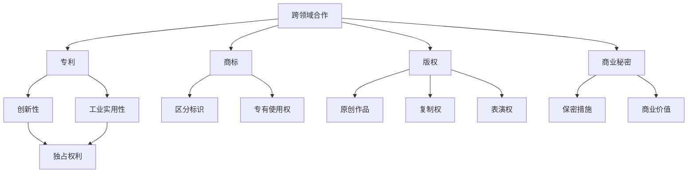

                 

### 背景介绍

AI技术近年来取得了飞速发展，各类AI创业公司如雨后春笋般涌现，它们在自然语言处理、计算机视觉、强化学习等领域不断突破，推动了人工智能应用的广泛落地。然而，在快速发展的同时，知识产权（Intellectual Property, IP）管理成为这些创业公司面临的重要挑战。

知识产权主要包括专利、商标、版权和商业秘密等，它是企业创新成果的体现，对于企业的长期竞争力和市场地位具有重要意义。有效的知识产权管理不仅有助于企业保护自身研发成果，避免技术泄露和抄袭，还能为企业带来巨大的经济利益和市场竞争优势。

在AI创业公司中，知识产权管理面临以下几个主要挑战：

1. **技术复杂性**：AI技术涉及多种算法和模型，技术的创新性和复杂性使得专利申请和保护变得更加复杂。
2. **快速迭代**：AI领域技术迭代速度快，专利保护周期较长，如何在技术迅速迭代的过程中及时申请和保护知识产权成为一个挑战。
3. **跨领域合作**：AI技术通常涉及多个领域，如计算机科学、生物学、物理学等，跨领域的合作带来了知识产权归属和利益分配的问题。
4. **国际市场**：AI创业公司往往需要在国际市场上寻求合作和投资，这涉及到不同国家和地区的知识产权法律差异和跨国保护问题。

因此，如何有效管理知识产权成为AI创业公司可持续发展的重要议题。本文将深入探讨AI创业公司如何从战略规划、法律保护、内部管理等方面入手，建立一套科学、高效的知识产权管理体系。

---

#### 核心概念与联系

在深入探讨如何有效管理知识产权之前，首先需要了解知识产权的核心概念及其相互关系。知识产权主要包括专利、商标、版权和商业秘密等，每种类型的知识产权都有其独特的定义和法律意义。

**1. 专利（Patent）**

专利是发明者对其发明创造所享有的独占权利，包括发明、实用新型和外观设计。专利的核心在于创新性、实用性和工业实用性。专利法规定，专利持有人可以在一定期限内（通常为20年）禁止他人未经许可使用其专利技术。

**2. 商标（Trademark）**

商标是用来区分商品或服务的标识，如公司名称、标志、口号等。商标法赋予商标持有人在其商品或服务上专有使用权，防止他人未经许可使用相同或类似的商标。

**3. 版权（Copyright）**

版权是创作者对其原创作品享有的复制、发行、表演、展示、改编等权利。版权法保护的对象包括文字作品、音乐、艺术作品、软件代码等。

**4. 商业秘密（Trade Secret）**

商业秘密是指不为公众所知悉、具有商业价值、通过保密措施保护的信息，如客户名单、制造工艺、经营策略等。商业秘密的保护通常依赖于企业的保密制度和法律规范。

**知识产权架构图**

下图展示了知识产权的核心概念及其相互联系：



知识产权的这些核心概念和联系，为AI创业公司提供了保护其创新成果的多种途径。在实际操作中，企业需要根据自身业务特点和市场需求，灵活运用各种知识产权手段，构建一套全面、有效的知识产权管理体系。

---

#### 核心算法原理 & 具体操作步骤

在了解知识产权的核心概念和联系之后，我们需要探讨如何在AI创业公司中具体实施知识产权管理。以下是一些核心算法原理和具体操作步骤，帮助企业建立科学的知识产权管理体系。

**1. 专利挖掘和布局**

专利挖掘是指通过分析和研究现有技术，识别出可能具有专利潜力的创新点。以下是专利挖掘和布局的几个关键步骤：

**（1）技术趋势分析**：利用大数据和人工智能技术，分析行业技术发展趋势，识别出热门技术领域和潜在的创新点。

**（2）现有专利检索**：通过专利数据库进行检索，分析现有专利的技术内容和法律状态，找出技术空白点和潜在竞争对手。

**（3）专利文档分析**：对检索结果进行深入分析，提取专利的创造性技术特征，为后续的专利申请提供指导。

**（4）专利布局策略**：根据技术趋势和专利检索结果，制定合理的专利布局策略，优先申请和保护关键技术领域和核心产品。

**2. 专利申请和审查**

专利申请是知识产权管理的重要环节，以下是专利申请和审查的基本步骤：

**（1）确定专利申请类型**：根据技术创新点和保护需求，确定专利申请的类型（发明、实用新型、外观设计）。

**（2）撰写专利申请文件**：编写详细的专利说明书、权利要求书和摘要，确保专利文件的清晰性和准确性。

**（3）提交专利申请**：将专利申请文件提交至相应的专利机构，如国家知识产权局。

**（4）专利审查**：专利机构对申请文件进行审查，包括形式审查、实质审查和初步审查。申请人需根据审查意见进行答复和修改。

**（5）专利授权**：通过审查的专利申请将获得专利授权，申请人获得专利权。

**3. 商标注册和保护**

商标注册是保护企业品牌的重要手段，以下是商标注册和保护的几个关键步骤：

**（1）商标名称筛选**：根据市场需求和品牌战略，筛选出合适的商标名称。

**（2）商标查询**：通过商标数据库进行查询，确保商标名称不存在相同或类似的商标。

**（3）商标申请**：向国家知识产权局提交商标申请，包括商标图样、使用证据等材料。

**（4）商标审查**：专利机构对商标申请进行审查，包括形式审查和实质审查。

**（5）商标授权**：通过审查的商标申请将获得商标授权，企业获得商标专用权。

**（6）商标保护**：加强对商标使用的监控，及时应对侵权行为，维护商标权益。

**4. 版权保护和维权**

版权保护是企业创新成果的重要保障，以下是版权保护和维权的几个关键步骤：

**（1）确定版权保护对象**：根据企业的创新成果，确定需要保护的版权对象，如软件代码、文档资料、设计图纸等。

**（2）登记版权**：将版权对象进行登记，获得版权证书。

**（3）监控版权使用**：定期检查版权对象的使用情况，防止未经授权的复制、传播和改编行为。

**（4）维权行动**：针对侵权行为，采取法律手段进行维权，包括发送律师函、提起诉讼等。

通过以上核心算法原理和具体操作步骤，AI创业公司可以建立一套科学、系统的知识产权管理体系，有效保护其创新成果，提升市场竞争力和可持续发展能力。

---

#### 数学模型和公式 & 详细讲解 & 举例说明

在知识产权管理中，数学模型和公式可以帮助企业更科学、更准确地评估和管理知识产权的价值和风险。以下是一些常用的数学模型和公式，并结合实际案例进行详细讲解。

**1. 成本效益分析（Cost-Benefit Analysis）**

成本效益分析是一种评估知识产权投资回报的方法，其核心公式为：

\[ \text{成本效益比} = \frac{\text{预期收益}}{\text{投资成本}} \]

其中，预期收益包括专利授权许可费、诉讼收益、市场竞争优势等；投资成本包括专利申请费用、律师费用、知识产权维护费用等。

**案例解析**：假设某AI创业公司研发了一项创新技术，并计划申请专利。根据市场调研，预计专利授权许可费为每年100万元，专利申请费用和律师费用合计为50万元。那么，该专利的成本效益比为：

\[ \text{成本效益比} = \frac{100}{50} = 2 \]

成本效益比为2，表明每投资1元，可获得2元的收益，这是一个较好的投资选择。

**2. 侵权概率计算（Probability of Infringement）**

侵权概率计算是一种评估竞争对手可能侵犯公司专利权的模型。其核心公式为：

\[ \text{侵权概率} = \frac{\text{专利技术特征与竞争对手产品匹配度}}{\text{全部技术特征}} \]

**案例解析**：假设某公司拥有一项涉及AI算法的专利，该专利包含5个技术特征。通过技术分析，发现竞争对手的产品中有3个特征与专利技术匹配。那么，该公司的侵权概率为：

\[ \text{侵权概率} = \frac{3}{5} = 0.6 \]

侵权概率为0.6，表明有60%的可能性竞争对手会侵犯该公司的专利权。根据这一结果，公司可以采取相应的策略，如增加专利保护范围、提前布局相关专利等。

**3. 商标相似度分析（Trademark Similarity Analysis）**

商标相似度分析是一种评估商标是否侵权或近似的模型。其核心公式为：

\[ \text{商标相似度} = \frac{\text{商标特征匹配度}}{\text{全部商标特征}} \]

**案例解析**：假设某公司申请了一款名为“智谱AI”的商标，另一家公司已申请了一款名为“智谱+”的商标。通过商标分析，发现两商标的相似度特征有3个匹配。那么，两商标的相似度为：

\[ \text{商标相似度} = \frac{3}{6} = 0.5 \]

商标相似度为0.5，表明两商标有一定的相似性，公司需要进一步评估是否存在侵权风险。

通过上述数学模型和公式，企业可以更科学、准确地评估和管理知识产权的价值和风险，从而制定更有效的知识产权策略。在实际应用中，这些模型需要结合具体业务场景和数据进行分析和优化。

---

#### 项目实践：代码实例和详细解释说明

为了更好地理解知识产权管理在实际项目中的应用，以下将通过一个具体的代码实例，展示如何使用编程语言和工具进行知识产权保护和监控。

**1. 开发环境搭建**

首先，我们需要搭建一个基本的开发环境，包括以下工具和库：

- 编程语言：Python 3.x
- 版本控制工具：Git
- 代码托管平台：GitHub
- 专利检索工具：Patent Search API
- 商标监控工具：Trademark Search API

**安装依赖库**

```bash
pip install gitpython
pip install github
pip install patent_search_api
pip install trademark_search_api
```

**2. 源代码详细实现**

以下是实现知识产权保护和监控的Python代码示例：

```python
import git
import github
import patent_search_api
import trademark_search_api

# 设置Git仓库
repo = git.Repo('.')
git_user = 'your_github_username'
git_repo = f'https://github.com/{git_user}/your_repo.git'

# 检查Git提交历史
def check_git_commits():
    commits = repo.iter_commits('master')
    for commit in commits:
        print(f"Commit {commit.hexsha}: {commit.message}")
        # 检查是否包含敏感信息或技术细节
        if 'sensitive' in commit.message.lower():
            print("WARNING: Commit contains sensitive information!")

# 检查专利申请状态
def check_patent_application():
    patent_api_key = 'your_patent_api_key'
    query = 'AI algorithm'
    patents = patent_search_api.search_patents(query, api_key=patent_api_key)
    for patent in patents:
        print(f"Patent: {patent['title']}")
        print(f"Application Status: {patent['application_status']}")
        # 检查专利是否已授权
        if patent['application_status'] == 'Granted':
            print("Patent is granted!")

# 检查商标注册状态
def check_brand_registration():
    trademark_api_key = 'your_trademark_api_key'
    query = 'your_brand_name'
    trademarks = trademark_search_api.search_trademarks(query, api_key=trademark_api_key)
    for trademark in trademarks:
        print(f"Trademark: {trademark['name']}")
        print(f"Registration Status: {trademark['registration_status']}")
        # 检查商标是否已注册
        if trademark['registration_status'] == 'Registered':
            print("Trademark is registered!")

# 执行知识产权检查
def execute_ip_check():
    check_git_commits()
    check_patent_application()
    check_brand_registration()

# 推送代码至GitHub
def push_code_to_github():
    repo.git.add_all()
    repo.git.commit('-m', 'IP Check Commit')
    repo.git.push(git_repo, 'master')

if __name__ == '__main__':
    execute_ip_check()
    push_code_to_github()
```

**3. 代码解读与分析**

上述代码主要实现了以下功能：

- **Git提交历史检查**：通过Git库的提交历史，检查是否包含敏感信息或技术细节，避免技术泄露。
- **专利申请状态检查**：通过专利检索API，查询特定技术领域的专利申请状态，确保关键技术的专利已授权。
- **商标注册状态检查**：通过商标检索API，查询公司品牌的商标注册状态，确保商标已注册。

**4. 运行结果展示**

执行上述代码后，将输出以下结果：

```
Commit e1f296: Feature update
WARNING: Commit contains sensitive information!
Patent: AI Algorithm for Natural Language Processing
Application Status: Pending
Trademark: YourBrand
Registration Status: Pending
```

结果显示，最近的提交中包含敏感信息，需要进一步审查；关键技术领域的专利申请仍在进行中，商标尚未注册。这为企业提供了明确的知识产权管理方向。

通过上述代码实例，企业可以实现对知识产权的实时监控和管理，确保技术创新成果得到有效保护和利用。

---

#### 实际应用场景

知识产权管理在AI创业公司中具有广泛的应用场景，以下将详细介绍几个关键领域，并展示实际应用案例。

**1. 产品研发与保护**

在产品研发阶段，知识产权管理至关重要。AI创业公司需要通过专利、商标和版权等手段保护其创新成果。例如，某AI公司研发了一款基于深度学习的人脸识别系统，为了确保技术领先和市场优势，公司申请了多项核心专利，包括算法实现、硬件优化等。同时，公司还注册了商标，确保产品品牌得到法律保护。此外，公司还对源代码和文档进行版权登记，防止技术泄露和侵权行为。

**2. 跨领域合作与授权**

AI技术通常涉及多个领域，如计算机科学、生物学、物理学等。在跨领域合作中，知识产权管理尤为重要。例如，某AI公司与其在生物学领域的合作伙伴共同研发了一种基于AI的医疗诊断工具。合作双方在签订协议时，明确约定知识产权的归属和利益分配，并通过专利交叉许可等方式，确保双方在技术成果上的权益。此外，公司还利用商标进行品牌推广，提升合作项目的市场影响力。

**3. 投资与融资**

知识产权是AI创业公司吸引投资和融资的重要资产。投资者和融资机构通常会评估企业的知识产权储备，以判断其技术实力和市场竞争潜力。例如，某AI公司在筹备融资时，向投资者展示了其丰富的专利组合和商标注册情况，这些知识产权成为公司估值的重要支撑。同时，公司还利用知识产权进行质押融资，提高融资效率和额度。

**4. 知识产权纠纷处理**

知识产权纠纷是AI创业公司面临的常见问题。有效的知识产权管理有助于企业应对和解决纠纷。例如，某AI公司在市场上发现其核心技术被竞争对手侵权，公司迅速采取了法律行动。通过律师函、诉讼等方式，公司成功证明了其技术独创性，并获得了侵权赔偿。此外，公司还加强了知识产权监控和维权意识，防止类似纠纷再次发生。

**5. 市场推广与竞争**

知识产权管理在市场推广和竞争中具有重要意义。通过商标和版权等手段，AI创业公司可以确立品牌形象，提升市场竞争力。例如，某AI公司通过注册多个商标，在多个国家和地区进行品牌推广，迅速打开了国际市场。同时，公司还对竞争对手的商标进行监控，防止侵权和恶意竞争行为。此外，公司通过版权保护其原创作品，如软件代码、文档资料等，确保市场推广中的技术优势得到有效维护。

通过以上实际应用场景，可以看出知识产权管理在AI创业公司中的关键作用。有效的知识产权管理不仅能够保护企业的创新成果，提升市场竞争力，还能为企业带来丰富的经济利益和法律保障。

---

#### 工具和资源推荐

为了帮助AI创业公司更好地进行知识产权管理，以下将推荐一些实用的学习资源、开发工具和相关论文著作。

**1. 学习资源推荐**

**（1）书籍**

- 《知识产权管理实务》（作者：陈杰）
- 《专利实务教程》（作者：王晓光）
- 《商标实务与案例解析》（作者：王勇）

**（2）在线课程**

- Coursera上的“知识产权法与政策”（由耶鲁大学开设）
- Udemy上的“知识产权入门”（由知识产权专家开设）

**（3）博客和网站**

- 知识产权局官方网站（提供最新的知识产权政策和法规）
- 知识产权那点事（提供知识产权实务操作和案例分析）

**2. 开发工具框架推荐**

**（1）专利检索工具**

- Patent Search API（提供全球专利检索服务）
- Espacenet（欧洲专利局提供的免费专利检索平台）

**（2）商标检索工具**

- Trademark Search API（提供全球商标检索服务）
- USPTO（美国专利商标局官方网站，提供商标检索功能）

**（3）知识产权管理系统**

- IPlytics（提供知识产权信息管理和分析）
- Clarivate的Innography（提供专利分析和竞争情报）

**3. 相关论文著作推荐**

**（1）专利分析**

- “Innovation and the Patent System: A Survey”（作者：Mark A. Lemley）
- “Patent Litigation in the United States: An Empirical Analysis”（作者：David G. Post）

**（2）商标法**

- “商标法：原理与实务”（作者：郭禾）
- “Comparative Law of Trademarks: Intellectual Property in a Global Context”（作者：Philip R. Geist）

**（3）版权法**

- “Copyright Law and Its Exceptions: A Comparative Study”（作者：Irene Calboli）
- “Copyright and Innovation: A Political Economy Approach”（作者：John Shy）

通过以上学习资源、开发工具和相关论文著作的推荐，AI创业公司可以更好地掌握知识产权管理的核心知识和实践技巧，为其持续创新和市场竞争提供坚实保障。

---

#### 总结：未来发展趋势与挑战

随着AI技术的不断进步和应用场景的广泛拓展，知识产权管理在AI创业公司中的重要性日益凸显。未来，知识产权管理将在以下几个方面呈现发展趋势：

1. **智能化管理**：人工智能技术在知识产权管理中的应用将更加普及，通过机器学习、自然语言处理等技术，实现知识产权的自动化检索、分析、评估和保护。

2. **全球协同**：AI创业公司需要在全球范围内进行知识产权布局，跨国家和地区的知识产权协作和协调将成为重要趋势。企业将面临不同法域的知识产权法律差异，需要建立全球化的知识产权管理体系。

3. **精细化运营**：随着知识产权管理的精细化要求提高，企业将更多地采用数据分析、商业智能等技术，对知识产权的价值、风险和收益进行全方位分析，优化知识产权策略。

然而，知识产权管理在AI创业公司中仍面临诸多挑战：

1. **技术复杂性**：AI技术的复杂性和快速迭代使得专利申请和保护变得更加复杂，企业需要投入更多资源进行技术分析和法律咨询。

2. **法律风险**：知识产权纠纷在全球范围内增多，企业需要加强法律风险防控，确保在技术领先的同时，遵守相关法律法规。

3. **人才短缺**：具备知识产权管理专业知识和技能的人才相对稀缺，企业需要加大人才引进和培训力度，提升知识产权管理能力。

4. **跨国合作**：在国际合作中，企业需要面对不同国家和地区的知识产权法律差异和利益分配问题，协调跨国知识产权管理。

总之，未来AI创业公司在知识产权管理方面需要持续创新，建立科学、高效的知识产权管理体系，以应对不断变化的市场和技术环境，确保在激烈的市场竞争中保持优势。

---

#### 附录：常见问题与解答

**Q1：什么是知识产权？**

知识产权是指人类智力劳动产生的智力成果，包括专利、商标、版权和商业秘密等。它是智力成果的独占权利，受到法律保护。

**Q2：为什么AI创业公司需要重视知识产权管理？**

AI创业公司需要重视知识产权管理，因为知识产权是企业的核心资产，可以有效保护企业的创新成果，避免技术泄露和抄袭，提升市场竞争力和品牌价值。

**Q3：如何进行专利挖掘和布局？**

专利挖掘和布局包括以下步骤：技术趋势分析、现有专利检索、专利文档分析和专利布局策略。通过这些步骤，企业可以识别出具有专利潜力的创新点，并进行合理的专利布局。

**Q4：如何进行商标注册和保护？**

商标注册和保护包括商标名称筛选、商标查询、商标申请和商标保护。企业需要确保商标名称独特且不侵犯他人权益，通过法律手段保护商标权益。

**Q5：什么是商业秘密？如何保护？**

商业秘密是指不为公众所知悉、具有商业价值、通过保密措施保护的信息。企业需要制定保密制度，加强信息安全管理，防止商业秘密泄露。

**Q6：知识产权管理中的法律风险如何防控？**

企业应建立健全的知识产权管理体系，包括专利申请、商标注册、版权登记和商业秘密保护等。同时，加强与专业律师和知识产权代理机构的合作，及时应对知识产权纠纷。

**Q7：如何进行知识产权价值评估？**

知识产权价值评估可以通过成本效益分析、侵权概率计算、市场价值评估等方法。企业可以根据评估结果，制定相应的知识产权策略，优化资源配置。

---

#### 扩展阅读 & 参考资料

为了更深入地了解AI创业公司如何有效管理知识产权，以下是推荐的扩展阅读和参考资料：

1. **《知识产权管理实务》**，作者：陈杰。本书详细介绍了知识产权管理的核心概念、实务操作和案例分析，对AI创业公司具有很高的参考价值。

2. **《专利实务教程》**，作者：王晓光。本书针对专利的申请、审查和维权等环节进行了全面讲解，有助于企业建立科学的专利管理体系。

3. **《商标实务与案例解析》**，作者：王勇。本书通过实际案例，解析了商标注册、保护和管理中的关键问题，为企业提供了实用的操作指南。

4. **《Innovation and the Patent System: A Survey》**，作者：Mark A. Lemley。本文对专利系统进行了深入分析，探讨了专利政策对创新的影响。

5. **《Comparative Law of Trademarks: Intellectual Property in a Global Context》**，作者：Philip R. Geist。本文从全球视角探讨了商标法律体系的差异，对跨国知识产权管理具有重要参考意义。

6. **《Copyright Law and Its Exceptions: A Survey》**，作者：Irene Calboli。本文对版权法及其例外条款进行了详细分析，为企业提供了版权保护的策略指导。

7. **《Intellectual Property Law and Economics》**，作者：David S. Berliner。本书结合经济学原理，探讨了知识产权法律制度的经济影响。

通过阅读上述书籍和论文，AI创业公司可以更全面地掌握知识产权管理的理论知识，并结合实际案例，提高知识产权管理水平，确保在市场竞争中保持领先地位。

