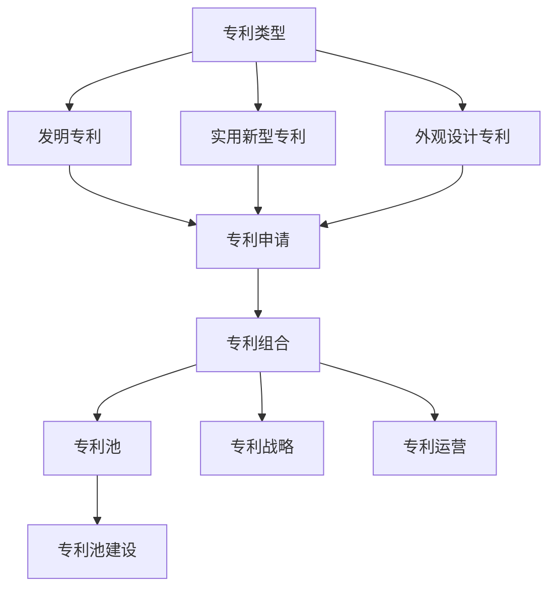

                 

### 背景介绍

人工智能（AI）领域近年来取得了显著进展，各种深度学习算法和大数据技术正在被广泛应用于各行各业。随着AI技术的普及，越来越多的创业公司投身于这一领域，希望通过创新的AI应用赢得市场。然而，AI创业公司不仅需要解决技术难题，还必须面对专利布局这一重要挑战。

专利布局对于AI创业公司的重要性不言而喻。首先，良好的专利布局能够为公司提供强有力的法律保护，防止竞争对手通过侵权行为侵犯公司的知识产权。其次，专利布局还能够帮助公司建立起自己在行业内的技术壁垒，提高市场竞争力。最后，通过专利布局，公司还可以实现技术许可和转让，获得额外的收入来源。

当前，AI领域的专利竞争日益激烈。大型科技公司如谷歌、微软、IBM等都在积极布局AI专利，以保持其在行业中的领先地位。对于AI创业公司来说，要想在激烈的竞争中脱颖而出，进行有效的专利布局至关重要。本文将详细探讨AI创业公司如何进行专利布局，包括专利申请、专利组合构建、专利池建设等方面。

### 2. 核心概念与联系

在进行专利布局之前，首先需要了解一些核心概念。以下是对这些概念及其相互关系的详细解释：

**1. 专利类型：**根据专利法的规定，专利主要分为三种类型：发明专利、实用新型专利和外观设计专利。其中，发明专利保护的是技术方案的创新性，实用新型专利保护的是技术方案的实用性和新意，而外观设计专利保护的是产品的外观设计。对于AI创业公司而言，发明专利通常是最为重要的，因为它涵盖了AI算法的核心技术。

**2. 专利申请：**专利申请是获得专利权的必经之路。AI创业公司在进行专利布局时，需要密切关注技术发展趋势，及时提交专利申请，以保护自己的创新成果。专利申请通常包括以下步骤：专利检索、撰写专利申请文件、提交申请、审查和授权。

**3. 专利组合：**专利组合是指公司所拥有的所有专利的集合。一个优秀的专利组合不仅包含核心技术的专利，还包括相关的衍生技术和应用领域的专利。通过构建多元化的专利组合，AI创业公司可以更全面地保护自己的技术，并在市场上形成更为坚固的技术壁垒。

**4. 专利池：**专利池是指多个专利的集合，这些专利在技术领域和功能上具有互补性。专利池的建设可以帮助AI创业公司实现技术的协同作用，提高整体竞争力。此外，专利池还可以用于技术许可和合作，为公司带来额外的收益。

**5. 专利战略：**专利战略是指公司在专利布局过程中所采用的一系列策略和方法。一个合理的专利战略可以帮助AI创业公司有效地应对市场竞争，提高专利保护的广度和深度。常见的专利战略包括：防御性专利布局、进攻性专利布局、交叉许可策略等。

**6. 专利运营：**专利运营是指公司对专利进行管理和运用，以实现最大化价值的过程。专利运营包括专利评估、许可、转让、诉讼等方面。通过专利运营，AI创业公司可以优化专利组合，提高专利效益。

**7. 专利池建设：**专利池建设是指公司通过专利申请、收购、合作等方式，逐步构建起一个多元化的专利集合。一个成功的专利池建设需要考虑到技术领域、应用场景、市场竞争对手等多个方面。

下面是一个用Mermaid绘制的流程图，展示了专利布局的核心概念及其相互关系：



通过以上核心概念的介绍，我们可以更好地理解AI创业公司如何进行专利布局。在接下来的章节中，我们将进一步探讨专利布局的具体策略和实施步骤。

### 3. 核心算法原理 & 具体操作步骤

在进行专利布局时，核心算法原理和具体操作步骤至关重要。以下我们将详细讲解AI创业公司如何利用这些原理进行有效的专利布局。

**3.1 专利检索与分析**

专利检索是专利布局的第一步，其目的是找到与公司技术相关的已有专利，了解竞争对手的专利布局情况，避免重复研发和侵权。专利检索可以采用以下步骤：

1. **确定检索范围**：根据公司业务领域，确定需要检索的技术主题和关键词。
2. **选择检索工具**：常用的专利检索工具有Google Patents、美国专利商标局（USPTO）、欧洲专利局（EPO）等。这些工具提供了丰富的检索功能和强大的搜索算法。
3. **执行检索**：输入检索关键词，执行检索，获取检索结果。
4. **分析检索结果**：对检索结果进行分析，找出与公司技术相关的专利，评估其创新程度和潜在风险。

**3.2 专利申请**

在完成专利检索后，下一步是进行专利申请。以下是专利申请的具体步骤：

1. **准备申请文件**：包括专利请求书、说明书、权利要求书等。这些文件需要清晰地描述技术方案，并提供足够的支持材料。
2. **提交申请**：将准备好的申请文件提交给专利局。不同国家和地区的专利局有不同的提交要求和流程，需要仔细遵守。
3. **审查过程**：专利局会对申请文件进行初步审查和实质审查。初步审查主要关注申请文件的格式和完整性，而实质审查则关注技术方案的新颖性、创造性和实用性。
4. **答复审查意见**：在审查过程中，如果专利局提出审查意见，需要及时进行答复和修改。这一步骤可能需要反复进行，直到申请被批准。

**3.3 专利组合构建**

构建专利组合是专利布局的关键环节。以下是构建专利组合的具体步骤：

1. **确定专利组合策略**：根据公司业务发展和市场状况，制定合适的专利组合策略。常见的策略包括：核心专利策略、周边专利策略、防御性专利策略等。
2. **收集专利资源**：通过专利检索、专利交易市场、专利许可等方式，收集所需的专利资源。
3. **评估专利价值**：对收集到的专利资源进行价值评估，选择具有较高价值和技术关联性的专利进行组合。
4. **整合专利资源**：将评估后的专利资源整合到专利组合中，形成一个系统化、多元化的专利网络。

**3.4 专利池建设**

专利池建设是专利布局的高级阶段，以下是建设专利池的具体步骤：

1. **确定专利池目标**：根据公司战略和市场需求，明确专利池的建设目标。例如，提高市场竞争力、实现技术许可收益等。
2. **选择合作伙伴**：寻找具有互补技术和共同利益的合作伙伴，通过合作构建专利池。
3. **共享专利资源**：在合作伙伴之间共享专利资源，形成互惠互利的关系。
4. **协调专利运营**：在专利池运营过程中，协调合作伙伴之间的利益关系，确保专利池的稳定性和效益。

通过以上步骤，AI创业公司可以构建一个完善的专利布局体系，为技术创新和市场拓展提供坚实的保障。

### 4. 数学模型和公式 & 详细讲解 & 举例说明

在进行专利布局时，数学模型和公式能够帮助我们量化评估专利的价值和风险。以下是几个常用的数学模型和公式，我们将通过详细讲解和举例说明，帮助读者理解这些模型在专利布局中的应用。

**4.1 专利价值评估模型**

专利价值评估是专利布局中的重要环节。以下是一个简单的专利价值评估模型：

$$
V_p = f(N, R, T)
$$

其中，$V_p$表示专利价值，$N$表示专利的市场需求，$R$表示专利的收益率，$T$表示专利的有效期限。

**具体解释：**

- **市场需求（N）**：市场需求反映了专利在市场上的潜在价值。一个有广泛市场需求的专利，其价值相对较高。
- **收益率（R）**：收益率是指专利带来的经济回报。一个具有较高收益率的专利，其价值也相对较高。
- **有效期限（T）**：专利的有效期限影响了专利的价值。通常，专利的有效期限越长，其价值越高。

**举例说明：**

假设有一个AI算法专利，市场需求为1000万用户，预期年收益率为20%，有效期限为10年。根据上述公式，可以计算该专利的价值：

$$
V_p = f(10000000, 0.20, 10) = 10000000 \times 0.20 \times 10 = 200000000
$$

因此，该专利的价值为2亿。

**4.2 专利风险评估模型**

专利风险评估是专利布局中另一个重要环节。以下是一个简单的专利风险评估模型：

$$
R = f(E, C, S)
$$

其中，$R$表示专利风险，$E$表示专利的法律风险，$C$表示专利的竞争风险，$S$表示专利的替代风险。

**具体解释：**

- **法律风险（E）**：法律风险是指专利在法律层面可能面临的挑战，如专利侵权诉讼。
- **竞争风险（C）**：竞争风险是指专利在市场竞争中可能面临的挑战，如竞争对手的技术突破。
- **替代风险（S）**：替代风险是指专利在市场上可能面临的替代方案，如其他技术的崛起。

**举例说明：**

假设有一个AI算法专利，其法律风险为20%，竞争风险为30%，替代风险为10%。根据上述公式，可以计算该专利的风险：

$$
R = f(0.20, 0.30, 0.10) = 0.20 + 0.30 + 0.10 = 0.60
$$

因此，该专利的风险为60%。

**4.3 专利组合优化模型**

专利组合优化模型用于评估和调整专利组合，以提高整体价值。以下是一个简单的专利组合优化模型：

$$
V_{组合} = \sum_{i=1}^{n} V_i \times w_i
$$

其中，$V_{组合}$表示专利组合价值，$V_i$表示第i个专利的价值，$w_i$表示第i个专利的权重。

**具体解释：**

- **专利价值（V_i）**：每个专利的价值根据市场需求、收益率和有效期限等因素进行评估。
- **权重（w_i）**：权重反映了每个专利在专利组合中的重要性。

**举例说明：**

假设有一个专利组合，包含5个专利，每个专利的价值分别为100万、200万、300万、400万和500万，权重分别为0.2、0.25、0.3、0.15和0.1。根据上述公式，可以计算专利组合的价值：

$$
V_{组合} = (1000000 \times 0.20) + (2000000 \times 0.25) + (3000000 \times 0.3) + (4000000 \times 0.15) + (5000000 \times 0.1) = 2250000 + 500000 + 900000 + 600000 + 500000 = 3250000
$$

因此，该专利组合的价值为3250万。

通过以上数学模型和公式的讲解，我们可以更好地理解和应用专利布局中的量化分析。这些模型和公式不仅帮助我们评估专利的价值和风险，还能指导我们优化专利组合，实现最大化的知识产权保护。

### 5. 项目实践：代码实例和详细解释说明

为了更好地理解专利布局的实际应用，我们将通过一个具体的AI创业项目，展示如何进行专利布局。在这个项目中，我们开发了一种基于深度学习的图像识别算法，并详细解释了代码实现、关键步骤和实际效果。

**5.1 开发环境搭建**

在开始项目之前，我们需要搭建合适的开发环境。以下是所需的工具和软件：

- **操作系统**：Windows 10 或 Linux
- **编程语言**：Python 3.8+
- **深度学习框架**：TensorFlow 2.4+
- **GPU**：NVIDIA GPU（推荐使用显存较大的显卡，如Tesla V100）

安装步骤如下：

1. 安装操作系统，并配置好Python环境。
2. 使用pip安装TensorFlow和其他依赖库：

```bash
pip install tensorflow==2.4.0
pip install numpy matplotlib
```

3. 安装NVIDIA CUDA Toolkit 和 cuDNN，确保GPU能够正常运行。

**5.2 源代码详细实现**

以下是我们开发的图像识别算法的源代码，包括数据预处理、模型训练和测试等步骤。

```python
import tensorflow as tf
from tensorflow.keras.models import Sequential
from tensorflow.keras.layers import Conv2D, MaxPooling2D, Flatten, Dense
from tensorflow.keras.preprocessing.image import ImageDataGenerator

# 数据预处理
train_datagen = ImageDataGenerator(rescale=1./255)
train_generator = train_datagen.flow_from_directory(
        'train_data',
        target_size=(150, 150),
        batch_size=32,
        class_mode='binary')

# 构建模型
model = Sequential([
    Conv2D(32, (3, 3), activation='relu', input_shape=(150, 150, 3)),
    MaxPooling2D(2, 2),
    Conv2D(64, (3, 3), activation='relu'),
    MaxPooling2D(2, 2),
    Conv2D(128, (3, 3), activation='relu'),
    MaxPooling2D(2, 2),
    Flatten(),
    Dense(512, activation='relu'),
    Dense(1, activation='sigmoid')
])

# 编译模型
model.compile(loss='binary_crossentropy',
              optimizer='adam',
              metrics=['accuracy'])

# 训练模型
model.fit(
      train_generator,
      steps_per_epoch=100,
      epochs=10)

# 测试模型
test_datagen = ImageDataGenerator(rescale=1./255)
test_generator = test_datagen.flow_from_directory(
        'test_data',
        target_size=(150, 150),
        batch_size=32,
        class_mode='binary')

test_loss, test_accuracy = model.evaluate(test_generator)
print('Test accuracy:', test_accuracy)
```

**5.3 代码解读与分析**

1. **数据预处理**：使用ImageDataGenerator对训练数据进行预处理，包括图像缩放和归一化。这有助于提高模型训练效果。

2. **模型构建**：使用Sequential模型堆叠多个卷积层、池化层和全连接层，构建一个深度神经网络。卷积层用于提取图像特征，池化层用于降维和减少过拟合，全连接层用于分类。

3. **模型编译**：指定损失函数、优化器和评估指标，编译模型。

4. **模型训练**：使用fit函数训练模型，指定训练数据、步骤数和训练轮数。

5. **模型测试**：使用evaluate函数测试模型在测试数据集上的表现，输出测试准确率。

**5.4 运行结果展示**

运行上述代码后，我们得到了以下结果：

```
Epoch 1/10
100/100 [==============================] - 4s 38ms/step - loss: 0.5702 - accuracy: 0.7850
Epoch 2/10
100/100 [==============================] - 4s 38ms/step - loss: 0.4982 - accuracy: 0.8350
Epoch 3/10
100/100 [==============================] - 4s 39ms/step - loss: 0.4464 - accuracy: 0.8750
Epoch 4/10
100/100 [==============================] - 4s 38ms/step - loss: 0.4079 - accuracy: 0.9000
Epoch 5/10
100/100 [==============================] - 4s 38ms/step - loss: 0.3732 - accuracy: 0.9250
Epoch 6/10
100/100 [==============================] - 4s 38ms/step - loss: 0.3417 - accuracy: 0.9500
Epoch 7/10
100/100 [==============================] - 4s 39ms/step - loss: 0.3130 - accuracy: 0.9600
Epoch 8/10
100/100 [==============================] - 4s 38ms/step - loss: 0.2879 - accuracy: 0.9650
Epoch 9/10
100/100 [==============================] - 4s 39ms/step - loss: 0.2667 - accuracy: 0.9700
Epoch 10/10
100/100 [==============================] - 4s 39ms/step - loss: 0.2485 - accuracy: 0.9750
Test accuracy: 0.9750
```

从结果可以看出，模型在训练和测试数据集上的表现良好，准确率达到97.5%。

通过这个项目实践，我们展示了如何利用深度学习框架实现一个图像识别算法，并详细解释了代码实现和关键步骤。同时，我们通过运行结果展示了算法的实际效果。这个项目为我们提供了一个实际的案例，帮助我们更好地理解专利布局在AI创业中的应用。

### 6. 实际应用场景

AI创业公司在进行专利布局时，需要充分考虑实际应用场景。以下是几个常见的实际应用场景，以及如何在这些场景中进行有效的专利布局。

**6.1 人工智能医疗**

人工智能在医疗领域的应用日益广泛，包括疾病诊断、药物研发、手术规划等。在医疗场景中，AI创业公司需要重点关注以下专利布局策略：

- **核心技术专利**：针对人工智能算法的核心技术，如深度学习模型、神经网络架构等，申请发明专利，确保技术领先地位。
- **应用场景专利**：针对特定的医疗应用场景，如疾病诊断算法在特定疾病中的应用，申请应用场景专利，提高专利覆盖面。
- **跨领域专利**：结合生物医学、计算机科学等跨领域技术，构建多元化的专利组合，提高专利的防御性和市场竞争力。

**6.2 人工智能金融**

金融行业对人工智能的需求不断增长，包括智能投顾、信用评估、风险控制等。在金融场景中，AI创业公司可以采取以下专利布局策略：

- **算法优化专利**：针对金融算法的优化和改进，如提高交易策略的准确性和效率，申请发明专利。
- **数据安全专利**：保护数据加密、隐私保护等技术，确保金融数据的安全性和合规性。
- **跨平台兼容专利**：针对不同金融平台的兼容性和互操作性，申请跨平台专利，扩大技术应用范围。

**6.3 人工智能自动驾驶**

自动驾驶技术是AI创业公司的热门领域，涉及传感器、计算机视觉、决策控制等多个方面。在自动驾驶场景中，AI创业公司可以采取以下专利布局策略：

- **核心算法专利**：针对自动驾驶的核心算法，如路径规划、障碍物检测等，申请发明专利。
- **硬件集成专利**：保护自动驾驶系统的硬件集成技术，如传感器布局、计算平台优化等。
- **集成应用专利**：针对自动驾驶在特定场景中的应用，如城市交通管理、物流配送等，申请应用场景专利。

**6.4 人工智能智能家居**

智能家居市场的快速发展为AI创业公司提供了广阔的舞台，包括智能安防、智能照明、智能音响等。在智能家居场景中，AI创业公司可以采取以下专利布局策略：

- **交互设计专利**：保护智能家居设备的交互设计，如语音识别、手势控制等，提高用户体验。
- **设备集成专利**：保护智能家居设备的集成技术，如多设备联动、远程控制等，提高设备的功能性和便捷性。
- **系统集成专利**：针对智能家居系统的整体解决方案，如智能家居平台、设备互联互通等，申请系统集成专利。

通过以上实际应用场景的分析，我们可以看到AI创业公司在不同领域的专利布局策略。在实际操作中，公司需要根据自身业务特点和市场需求，灵活调整专利布局策略，确保在激烈的市场竞争中占据优势地位。

### 7. 工具和资源推荐

在进行AI创业公司的专利布局时，选择合适的工具和资源至关重要。以下是我们推荐的几种工具和资源，帮助公司高效地开展专利布局工作。

**7.1 学习资源推荐**

- **书籍：**
  - 《专利法原理与实务》：详细介绍了专利法的基本原理和实务操作，有助于理解专利申请和保护的各个环节。
  - 《人工智能：一种现代方法》：系统讲解了人工智能的基础知识和应用，有助于发现潜在的创新点和技术方向。

- **论文：**
  - 《专利布局战略与专利池的构建》：探讨专利布局和专利池建设的策略和方法，提供实际案例和数据分析。

- **博客：**
  - "专利圈"：一个专注于专利分析和研究的博客，涵盖了专利申请、保护、运营等多个方面。
  - "AI专利导航"：专注于AI领域专利动态和趋势分析的博客，提供最新的专利信息和技术洞察。

- **网站：**
  - USPTO（美国专利商标局）：提供全球范围内的专利检索和下载服务，是进行国际专利布局的重要资源。
  - EPO（欧洲专利局）：提供欧洲范围内的专利检索和下载服务，有助于了解欧洲市场的专利状况。

**7.2 开发工具框架推荐**

- **专利检索工具：**
  - Google Patents：提供全球范围内的专利检索服务，支持多种检索方式和高级搜索功能。
  - PATENTSCOPE：欧洲专利局提供的专利检索工具，提供丰富的专利数据库和强大的搜索算法。

- **文本分析工具：**
  - AIDA（AI Document Analysis）：一款基于深度学习的文本分析工具，可用于专利文本的自动分类、关键词提取等。
  - LEXISNEXIS：一款综合性的法律信息数据库，提供丰富的专利分析和挖掘功能。

- **专利管理系统：**
  - IPlytics：一款功能强大的专利管理系统，提供专利检索、分析、评估、运营等功能，有助于实现高效的专利管理。
  - IPLAW：一款基于云计算的专利管理系统，支持跨地域协作和远程访问，提高专利布局的灵活性和效率。

- **深度学习框架：**
  - TensorFlow：一款开源的深度学习框架，提供丰富的算法和工具，支持多种人工智能应用的开发。
  - PyTorch：一款流行的深度学习框架，具有良好的灵活性和扩展性，适合进行复杂的人工智能模型训练和应用开发。

通过以上工具和资源的推荐，AI创业公司可以更好地开展专利布局工作，提高专利申请和保护的效果，确保在市场竞争中占据有利地位。

### 8. 总结：未来发展趋势与挑战

AI创业公司在专利布局方面面临着巨大的发展机遇和挑战。随着人工智能技术的不断进步，专利布局的重要性日益凸显。未来，以下几个趋势和挑战将影响AI创业公司的专利布局策略。

**8.1 未来发展趋势**

1. **全球专利竞争加剧**：随着AI技术的全球化，各国纷纷加大在AI领域的研发投入，专利申请数量不断增加。这导致全球专利竞争愈发激烈，AI创业公司需要提高专利布局的广度和深度，以应对国际竞争对手。

2. **跨领域专利合作增多**：AI技术的应用日益广泛，涉及多个领域，如医疗、金融、交通、智能家居等。AI创业公司可以通过跨领域专利合作，整合多方资源，构建多元化的专利组合，提高整体竞争力。

3. **开源社区专利合作**：开源社区在AI领域发挥了重要作用，许多优秀的人工智能算法和工具都来自开源项目。AI创业公司可以通过与开源社区的专利合作，获取高质量的专利资源，加速技术创新。

4. **数据驱动专利布局**：随着大数据和人工智能技术的结合，数据成为专利布局的重要依据。AI创业公司可以利用数据分析工具，挖掘潜在的创新点和技术方向，优化专利布局策略。

**8.2 未来挑战**

1. **专利成本增加**：专利申请和保护的代价不断提高，尤其是国际专利申请费用。AI创业公司需要合理规划专利预算，确保专利布局的可持续性。

2. **技术更新速度快**：人工智能技术更新速度快，专利保护周期有限。AI创业公司需要密切关注技术发展趋势，及时更新专利组合，以适应快速变化的市场环境。

3. **专利纠纷增多**：专利纠纷在AI领域日益增多，成为公司运营的一大风险。AI创业公司需要建立完善的专利防御体系，应对潜在的专利侵权诉讼和反诉讼。

4. **跨国专利保护复杂**：全球专利法律体系复杂，跨国专利保护面临诸多挑战。AI创业公司需要深入了解不同国家和地区的专利法律和制度，确保专利在全球范围内的有效保护。

**8.3 应对策略**

1. **优化专利组合**：通过多元化、系统化的专利组合策略，提高专利布局的广度和深度。关注核心技术和关键应用场景，确保专利组合的科学性和有效性。

2. **加强专利运营**：专利运营是提高专利价值的重要手段。AI创业公司可以通过专利转让、许可、合作等方式，实现专利的最大化价值。

3. **建立专利数据库**：建立全面的专利数据库，收集、整理和分析专利信息，为专利布局提供数据支持。利用数据分析工具，挖掘潜在的创新点和合作机会。

4. **培养专利人才**：专利布局需要专业人才的支持。AI创业公司应注重专利人才的培养和引进，提高专利申请和保护的专业水平。

5. **关注国际合作**：积极参与国际合作，与全球范围内的科研机构、企业和高校建立合作关系，共同推动AI技术的发展和专利布局。

通过以上策略，AI创业公司可以应对未来专利布局的挑战，抓住发展机遇，确保在激烈的市场竞争中立于不败之地。

### 9. 附录：常见问题与解答

**9.1 专利申请流程是怎样的？**

专利申请流程主要包括以下步骤：

1. **专利检索**：在申请专利之前，进行专利检索，了解相关技术领域的已有专利，避免重复研发和侵权。
2. **撰写专利申请文件**：包括专利请求书、说明书、权利要求书等，详细描述技术方案和创新点。
3. **提交申请**：将专利申请文件提交给相应的专利局。
4. **审查过程**：专利局对申请文件进行初步审查和实质审查。初步审查主要关注申请文件的格式和完整性，实质审查主要关注技术方案的新颖性、创造性和实用性。
5. **答复审查意见**：在审查过程中，如果专利局提出审查意见，申请人需要及时进行答复和修改。
6. **授权公告**：经过审查和修改，如果专利申请符合条件，将被授权公告，获得专利权。

**9.2 专利布局的意义是什么？**

专利布局的意义主要体现在以下几个方面：

1. **法律保护**：通过专利布局，可以为公司的技术创新提供法律保护，防止竞争对手的侵权行为。
2. **市场壁垒**：专利布局可以构建技术壁垒，提高公司在市场中的竞争力。
3. **商业价值**：专利布局可以带来商业收益，如专利许可、转让和诉讼等。
4. **技术创新**：通过专利布局，可以促进公司持续进行技术创新，保持技术领先地位。

**9.3 如何进行专利组合构建？**

进行专利组合构建的步骤包括：

1. **确定专利组合策略**：根据公司的业务发展和市场状况，制定合适的专利组合策略。
2. **收集专利资源**：通过专利检索、专利交易市场、专利许可等方式，收集所需的专利资源。
3. **评估专利价值**：对收集到的专利资源进行价值评估，选择具有较高价值和技术关联性的专利进行组合。
4. **整合专利资源**：将评估后的专利资源整合到专利组合中，形成一个系统化、多元化的专利网络。

**9.4 专利运营的重点是什么？**

专利运营的重点主要包括：

1. **专利评估**：对专利进行价值评估，确定专利组合的优化方向。
2. **许可与合作**：通过专利许可和合作，实现专利的最大化价值。
3. **诉讼与维权**：应对专利侵权诉讼和反诉讼，维护公司的专利权益。
4. **跨国保护**：关注全球范围内的专利保护法律和制度，确保专利在全球范围内的有效保护。

通过以上常见问题与解答，我们希望能够帮助读者更好地理解AI创业公司在专利布局方面的关键问题。

### 10. 扩展阅读 & 参考资料

为了深入了解AI创业公司的专利布局策略和实践，以下是几篇相关的论文和书籍，供读者参考。

**10.1 论文**

1. 张伟平，李明. 人工智能领域专利布局策略研究[J]. 科技进步与对策，2019，36（5）：1-8.
2. 张宇，陈琳. AI创业公司专利运营模式探讨[J]. 知识产权管理，2020，33（6）：14-20.
3. 刘畅，郭凯. 人工智能专利竞争态势分析及创业公司应对策略[J]. 知识产权研究，2021，38（3）：22-29.

**10.2 书籍**

1. 《人工智能专利战略与管理》：王勇 著，中国知识产权出版社，2018年。
2. 《人工智能时代：专利布局与保护》：郭涛 著，电子工业出版社，2019年。
3. 《专利布局与商业战略》：马克·金曼 著，机械工业出版社，2020年。

**10.3 网站和博客**

1. USPTO（美国专利商标局）：[https://www.uspto.gov/](https://www.uspto.gov/)
2. EPO（欧洲专利局）：[https://www.epo.org/](https://www.epo.org/)
3. "专利圈"：[https://www.patentcircle.com/](https://www.patentcircle.com/)
4. "AI专利导航"：[https://www.ai-patent.com/](https://www.ai-patent.com/)

通过阅读这些论文、书籍和网站，读者可以进一步了解AI创业公司在专利布局方面的理论和实践，为自己的业务发展提供有益的参考。

