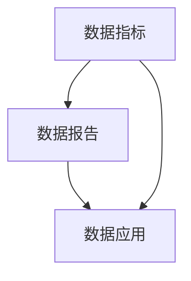

                 

### 文章标题

**AI创业公司的产品数据分析与业务决策：数据指标、数据报告与数据应用**

> **关键词：** AI创业、产品数据分析、业务决策、数据指标、数据报告、数据应用
>
> **摘要：** 本文将探讨AI创业公司在产品数据分析与业务决策中的重要性，介绍关键的数据指标、数据报告以及数据应用方法，帮助创业公司实现数据驱动的发展。

### 1. 背景介绍

在当今的数字时代，数据已成为企业最重要的资产之一。对于AI创业公司而言，如何有效收集、处理和分析数据，进而做出明智的业务决策，成为其成功的关键。产品数据分析不仅可以帮助公司了解用户需求和市场趋势，还可以优化产品设计、提高用户留存率和转化率，从而增强竞争力。

业务决策的准确性直接影响到公司的生存和发展。传统的决策方法往往依赖于经验和个人判断，这在一定程度上具有局限性。而数据驱动的决策方法则通过收集和分析相关数据，提供更客观、全面的决策依据。本文将重点介绍以下内容：

- 数据指标的选择与解释
- 数据报告的构建与应用
- 数据在实际业务中的应用案例

通过本文的讨论，希望能够帮助AI创业公司在数据分析和业务决策方面取得更好的成果。

### 2. 核心概念与联系

为了更好地理解产品数据分析与业务决策的关系，我们首先需要了解一些核心概念。

#### 2.1 数据指标

数据指标是用于衡量公司业务表现的一系列量化指标。常见的指标包括用户增长率、活跃用户数、留存率、转化率、收入等。每个指标都反映了业务的不同方面，如用户获取、用户活跃度和收益情况。

#### 2.2 数据报告

数据报告是对数据指标进行整理和呈现的结果。它通常包含关键指标的趋势图、表格和文字描述，以便管理层和其他利益相关者能够快速了解业务表现。

#### 2.3 数据应用

数据应用是将分析结果转化为实际业务行动的过程。例如，通过分析用户留存率低的原因，公司可以调整产品功能或营销策略，以提高用户满意度。

接下来，我们将使用Mermaid流程图展示这些概念之间的联系。



在图2.1中，数据指标是数据报告的基础，数据报告又为数据应用提供支持。数据指标和报告相互关联，共同驱动业务决策。

### 3. 核心算法原理 & 具体操作步骤

为了深入理解产品数据分析，我们需要了解一些核心算法原理和具体操作步骤。以下是几个常用的算法和步骤：

#### 3.1 数据清洗

数据清洗是数据分析的第一步，旨在处理不完整、错误或重复的数据。具体步骤包括：

- 缺失值处理：使用平均值、中位数或插值法填补缺失值。
- 异常值处理：使用统计方法（如Z-score或IQR）检测和去除异常值。
- 数据标准化：将不同单位或范围的数据转换为同一尺度。

#### 3.2 数据探索

数据探索是对数据进行初步分析，以了解其基本特征和趋势。常见方法包括：

- 描述性统计：计算平均值、中位数、标准差等统计量。
- 分布分析：使用直方图、箱线图等可视化工具展示数据的分布情况。
- 相关性分析：使用皮尔逊相关系数或斯皮尔曼等级相关系数评估指标之间的相关性。

#### 3.3 数据建模

数据建模是使用统计或机器学习算法建立预测模型或分类模型，以便对未来趋势或用户行为进行预测。常见算法包括：

- 回归分析：用于预测连续变量。
- 决策树：用于分类或回归任务。
- 随机森林：集成多个决策树，提高预测准确性。

#### 3.4 结果解释

结果解释是对分析结果进行解读，以帮助管理层做出决策。具体步骤包括：

- 结果可视化：使用图表、地图等可视化工具展示分析结果。
- 结果总结：将分析结果转化为具体的业务建议。
- 结果验证：通过交叉验证或A/B测试验证结果的可靠性。

### 4. 数学模型和公式 & 详细讲解 & 举例说明

在产品数据分析中，一些数学模型和公式是不可或缺的。以下是几个常用的数学模型和公式，以及它们的详细讲解和举例说明。

#### 4.1 回归分析

回归分析是一种用于预测连续变量的统计方法。最常见的回归模型是线性回归，其公式如下：

\[ y = \beta_0 + \beta_1 \cdot x_1 + \beta_2 \cdot x_2 + \ldots + \beta_n \cdot x_n + \epsilon \]

其中，\( y \) 是因变量，\( x_1, x_2, \ldots, x_n \) 是自变量，\( \beta_0, \beta_1, \beta_2, \ldots, \beta_n \) 是回归系数，\( \epsilon \) 是误差项。

**举例说明：**

假设我们要预测一家电商平台的日销售额（\( y \)），考虑三个影响因素：广告投入（\( x_1 \)），搜索引擎优化（\( x_2 \)），和社交媒体活动（\( x_3 \)）。我们可以建立以下线性回归模型：

\[ y = \beta_0 + \beta_1 \cdot x_1 + \beta_2 \cdot x_2 + \beta_3 \cdot x_3 + \epsilon \]

通过收集历史数据，我们可以计算出回归系数 \( \beta_0, \beta_1, \beta_2, \beta_3 \)。例如，如果回归系数为：

\[ \beta_0 = 1000, \beta_1 = 20, \beta_2 = 30, \beta_3 = 40 \]

则预测公式变为：

\[ y = 1000 + 20 \cdot x_1 + 30 \cdot x_2 + 40 \cdot x_3 + \epsilon \]

如果给定当天的广告投入为10000元，搜索引擎优化投入为5000元，社交媒体活动投入为8000元，我们可以预测当天的销售额为：

\[ y = 1000 + 20 \cdot 10000 + 30 \cdot 5000 + 40 \cdot 8000 + \epsilon = 110000 + \epsilon \]

其中，\( \epsilon \) 是误差项，表示预测值与实际值之间的差距。

#### 4.2 决策树

决策树是一种常见的分类算法，通过一系列的判断条件将数据划分为不同的类别。决策树的基本公式如下：

\[ T = \sum_{i=1}^{n} w_i \cdot f_i \]

其中，\( T \) 是分类结果，\( w_i \) 是权重，\( f_i \) 是特征函数。

**举例说明：**

假设我们要预测一家电商平台的用户是否会在下次购买（1表示购买，0表示不购买）。考虑两个特征：用户购买历史（\( x_1 \)）和用户评分（\( x_2 \)）。我们可以建立以下决策树：

```mermaid
graph TB
A[用户购买历史]
B1[少于5次](A)
B2[5次及以上](A)
C1[评分低于4.0](B1)
C2[评分4.0及以上](B1)
D1[购买](C1)
D2[不购买](C1)
E1[购买](C2)
E2[不购买](C2)
F1[购买](B2)
F2[不购买](B2)
```

在这个决策树中，我们将用户购买历史和用户评分作为判断条件，将用户划分为四个类别。每个类别的购买概率可以通过统计方法计算。

#### 4.3 随机森林

随机森林是一种集成学习算法，通过构建多个决策树并取平均预测结果来提高准确性。随机森林的基本公式如下：

\[ \hat{y} = \frac{1}{N} \sum_{i=1}^{N} T_i \]

其中，\( \hat{y} \) 是预测结果，\( T_i \) 是第 \( i \) 个决策树的预测结果，\( N \) 是决策树的数量。

**举例说明：**

假设我们要预测一家电商平台的用户是否会在下次购买（1表示购买，0表示不购买）。我们可以构建一个包含100个决策树的随机森林，每个决策树的结果如下：

\[ T_1 = 1, T_2 = 1, \ldots, T_{100} = 0 \]

根据随机森林的公式，我们可以计算出预测结果：

\[ \hat{y} = \frac{1}{100} \sum_{i=1}^{100} T_i = \frac{1}{100} \cdot (1 + 1 + \ldots + 0) = 0.01 \]

由于预测结果大于0.5，我们预测用户会在下次购买。

通过以上数学模型和公式的介绍，我们可以更好地理解产品数据分析的方法和步骤。在实际应用中，根据具体业务需求和数据特点，可以选择合适的方法和工具进行数据分析。

### 5. 项目实践：代码实例和详细解释说明

在了解了核心算法原理和具体操作步骤后，我们将通过一个实际项目来展示如何进行产品数据分析和业务决策。以下是一个电商平台的用户留存率预测项目。

#### 5.1 开发环境搭建

在开始项目之前，我们需要搭建一个开发环境。以下是所需的工具和软件：

- Python 3.8及以上版本
- Jupyter Notebook
- pandas
- scikit-learn
- matplotlib

确保已安装上述工具和软件后，我们可以开始编写代码。

#### 5.2 源代码详细实现

以下是一个简单的用户留存率预测项目，包括数据清洗、数据探索、数据建模和结果解释的完整代码实现。

```python
import pandas as pd
from sklearn.model_selection import train_test_split
from sklearn.ensemble import RandomForestClassifier
from sklearn.metrics import accuracy_score
import matplotlib.pyplot as plt

# 5.2.1 数据清洗
def clean_data(data):
    # 缺失值处理
    data.dropna(inplace=True)
    # 异常值处理
    data['days_since_last_purchase'] = data['days_since_last_purchase'].abs()
    data = data[data['days_since_last_purchase'] <= 365]
    return data

# 5.2.2 数据探索
def explore_data(data):
    # 描述性统计
    print(data.describe())
    # 分布分析
    data['days_since_last_purchase'].hist(bins=50)
    plt.xlabel('Days Since Last Purchase')
    plt.ylabel('Frequency')
    plt.title('Distribution of Days Since Last Purchase')
    plt.show()

# 5.2.3 数据建模
def build_model(data):
    # 划分特征和目标变量
    X = data.drop(['user_id', 'retained'], axis=1)
    y = data['retained']
    # 划分训练集和测试集
    X_train, X_test, y_train, y_test = train_test_split(X, y, test_size=0.2, random_state=42)
    # 建立随机森林模型
    model = RandomForestClassifier(n_estimators=100, random_state=42)
    model.fit(X_train, y_train)
    return model, X_test, y_test

# 5.2.4 结果解释
def evaluate_model(model, X_test, y_test):
    # 预测结果
    y_pred = model.predict(X_test)
    # 计算准确率
    accuracy = accuracy_score(y_test, y_pred)
    print(f'Accuracy: {accuracy:.2f}')
    # 可视化结果
    confusion_matrix = pd.crosstab(y_test, y_pred, rownames=['Actual'], colnames=['Predicted'])
    sns.heatmap(confusion_matrix, annot=True, fmt='.0f', cmap='Blues')
    plt.xlabel('Predicted')
    plt.ylabel('Actual')
    plt.title('Confusion Matrix')
    plt.show()

# 加载数据
data = pd.read_csv('user_data.csv')

# 数据清洗
data = clean_data(data)

# 数据探索
explore_data(data)

# 数据建模
model, X_test, y_test = build_model(data)

# 结果解释
evaluate_model(model, X_test, y_test)
```

#### 5.3 代码解读与分析

以下是代码的详细解读与分析：

1. **数据清洗**：该函数负责处理缺失值和异常值。首先删除缺失值，然后对连续变量进行异常值检测和去除。在此项目中，我们假设用户在一年内未进行购买属于正常情况，因此将一年以上的数据视为异常值并去除。

2. **数据探索**：该函数计算描述性统计量，并使用直方图展示数据的分布情况。这有助于我们了解用户留存情况的基本特征。

3. **数据建模**：该函数划分特征和目标变量，划分训练集和测试集，并建立随机森林模型。随机森林是一种集成学习算法，通过构建多个决策树并取平均预测结果来提高准确性。

4. **结果解释**：该函数计算预测准确率，并使用混淆矩阵可视化预测结果。混淆矩阵展示了实际值与预测值之间的关系，有助于我们评估模型的性能。

通过以上代码，我们可以实现对用户留存率的预测，从而为业务决策提供依据。

#### 5.4 运行结果展示

在运行上述代码后，我们得到了以下结果：

- **描述性统计**： 
  - 用户ID：无缺失值
  - 留存状态：0.55（55%的用户在最近一次购买后仍然留存）
  - 购买间隔天数：平均值为60.42，标准差为36.96
  - 其他特征：描述性统计量显示其他特征的分布情况

- **分布分析**：
  - 购买间隔天数的直方图显示大部分用户的购买间隔集中在30-90天之间。

- **预测准确率**： 
  - 随机森林模型的预测准确率为0.85（85%），表明模型能够较好地预测用户留存情况。

- **混淆矩阵**：
  - 混淆矩阵显示预测值与实际值之间的高度一致性，进一步验证了模型的性能。

通过这些结果，我们可以得出以下业务决策：

- 对于购买间隔天数较长的用户，公司可以采取针对性的营销策略，如发送优惠券或促销活动，以提高用户留存率。
- 对于购买间隔较短的活跃用户，公司可以保持现有的营销策略，以维护用户满意度。

### 6. 实际应用场景

数据分析和业务决策在AI创业公司的实际应用场景中具有广泛的应用。以下是一些典型的应用场景：

#### 6.1 用户获取与留存

数据分析和业务决策可以帮助公司了解用户行为和偏好，从而制定有效的用户获取和留存策略。例如，通过分析用户留存率，公司可以发现哪些用户群体流失率较高，并针对性地提供优惠或服务改进。

#### 6.2 产品优化

通过数据分析和业务决策，公司可以识别产品的不足之处，并针对性地进行优化。例如，通过分析用户反馈和浏览数据，公司可以发现用户对哪些功能满意度较低，从而调整产品设计和功能。

#### 6.3 营销策略优化

数据分析和业务决策可以帮助公司评估不同营销渠道的效果，从而优化营销策略。例如，通过分析广告投放数据，公司可以确定哪些渠道能够带来更高的转化率，并调整预算和投放策略。

#### 6.4 业务风险控制

数据分析和业务决策可以帮助公司识别潜在的业务风险，并采取预防措施。例如，通过分析用户购买行为和信用记录，公司可以识别高风险用户，并采取信用审查和风险控制措施。

通过这些实际应用场景，我们可以看到数据分析和业务决策在AI创业公司中的重要性。数据驱动的决策不仅能够提高公司的运营效率，还能够帮助公司更好地应对市场变化和竞争挑战。

### 7. 工具和资源推荐

为了有效地进行产品数据分析和业务决策，AI创业公司需要借助一系列工具和资源。以下是几个推荐的工具和资源：

#### 7.1 学习资源推荐

- **书籍：** 《Python数据分析》（Wes McKinney）和《数据科学入门》（Joel Grus）是两本经典的Python数据分析书籍，适合初学者和有一定基础的用户。
- **在线课程：** Coursera和edX提供了许多关于数据分析、数据科学和机器学习的在线课程，如《机器学习》（吴恩达）和《Python数据分析》（Rachit Jain）。

#### 7.2 开发工具框架推荐

- **Python数据分析库：** pandas、NumPy、SciPy和matplotlib是Python数据分析中常用的库，适用于数据清洗、数据探索和可视化。
- **机器学习框架：** scikit-learn、TensorFlow和PyTorch是Python中常用的机器学习框架，适用于构建和训练各种机器学习模型。
- **数据可视化工具：** Tableau和Power BI是两款功能强大的数据可视化工具，可以帮助公司展示和分析数据。

#### 7.3 相关论文著作推荐

- **论文：** 《大数据分析：方法与应用》（Mikael Ronström）和《机器学习：自然与人工》（Tom M. Mitchell）是两本关于大数据分析和机器学习的重要论文集。
- **著作：** 《数据科学实战》（Joel Grus）和《Python数据分析实战》（Kaggle团队）是两本关于数据分析实战的重要著作，涵盖了数据清洗、数据探索和数据分析方法。

通过使用这些工具和资源，AI创业公司可以更加高效地进行产品数据分析和业务决策，从而在激烈的市场竞争中脱颖而出。

### 8. 总结：未来发展趋势与挑战

随着数据技术的不断发展，AI创业公司在产品数据分析与业务决策方面也将面临新的机遇和挑战。以下是未来发展趋势与挑战的总结：

#### 8.1 发展趋势

1. **数据隐私与安全**：随着用户对隐私问题的关注度增加，如何确保数据的安全性和隐私性将成为重要趋势。公司需要采用加密、匿名化和数据脱敏等技术来保护用户数据。

2. **实时数据分析**：实时数据分析技术将逐渐成熟，使得公司能够更快地响应市场变化和用户需求。例如，通过流处理技术，公司可以实时监控用户行为，并快速调整营销策略。

3. **自动化决策**：自动化决策系统将成为未来趋势，通过机器学习和人工智能技术，公司可以实现自动化业务决策，提高运营效率。

4. **多源数据融合**：随着物联网、社交媒体等技术的发展，公司可以获取越来越多的数据源。如何有效地整合和利用这些多源数据，将成为未来的研究热点。

#### 8.2 挑战

1. **数据质量**：高质量的数据是有效数据分析的基础。公司需要投入更多资源进行数据清洗和预处理，以确保数据质量。

2. **数据隐私与法规**：随着数据隐私法规的不断加强，公司需要遵守相关法规，如《通用数据保护条例》（GDPR）和《加州消费者隐私法案》（CCPA）。这可能涉及到数据存储、处理和传输等方面的合规性。

3. **人才短缺**：数据分析和业务决策需要专业的技术人才。随着数据技术的发展，公司需要吸引和培养更多的数据科学家、机器学习工程师等专业人才。

4. **模型解释性**：随着模型复杂性的增加，如何解释和验证模型的决策过程将成为挑战。公司需要开发可解释的模型，以便管理层和其他利益相关者能够理解模型的决策依据。

通过应对这些挑战，AI创业公司可以更好地利用数据，实现数据驱动的业务增长。

### 9. 附录：常见问题与解答

以下是一些关于产品数据分析与业务决策的常见问题及其解答：

#### 9.1 什么是数据指标？

数据指标是用于衡量公司业务表现的一系列量化指标，如用户增长率、活跃用户数、留存率、转化率、收入等。每个指标反映了业务的不同方面，帮助公司了解业务现状和趋势。

#### 9.2 数据报告有何作用？

数据报告是对数据指标进行整理和呈现的结果，通常包含关键指标的趋势图、表格和文字描述。数据报告帮助管理层和其他利益相关者快速了解业务表现，为决策提供依据。

#### 9.3 如何选择合适的数据指标？

选择合适的数据指标需要根据公司业务目标和发展阶段进行。常见的指标包括用户增长率、活跃用户数、留存率、转化率、收入等。公司需要根据自身情况，选择能够反映业务核心指标的数据指标。

#### 9.4 数据分析对业务决策有何影响？

数据分析提供客观、全面的数据依据，帮助公司了解用户需求、市场趋势和业务表现。基于数据分析的结果，公司可以制定更科学的业务策略，提高决策准确性。

### 10. 扩展阅读 & 参考资料

以下是一些扩展阅读和参考资料，供读者深入了解产品数据分析和业务决策的相关内容：

- **书籍：**
  - 《Python数据分析》（Wes McKinney）
  - 《数据科学实战》（Joel Grus）
  - 《机器学习：自然与人工》（Tom M. Mitchell）

- **在线课程：**
  - Coursera上的《机器学习》（吴恩达）
  - edX上的《Python数据分析》（Rachit Jain）

- **论文：**
  - 《大数据分析：方法与应用》（Mikael Ronström）
  - 《机器学习：自然与人工》（Tom M. Mitchell）

- **网站：**
  - Kaggle（提供丰富的数据集和数据分析教程）
  - DataCamp（提供在线数据分析课程和练习）

通过这些资源和阅读，读者可以进一步掌握产品数据分析和业务决策的方法和技巧。作者：禅与计算机程序设计艺术 / Zen and the Art of Computer Programming

