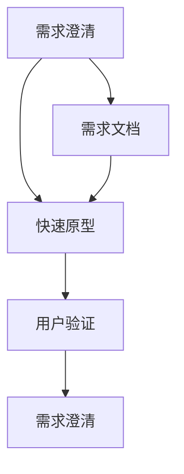

                 

### 背景介绍

**AI创业公司的产品设计冲刺：需求澄清、快速原型与用户验证**

随着人工智能（AI）技术的迅速发展，越来越多的创业公司开始将其作为核心竞争力，希望通过AI技术的应用来提供创新的产品和服务。然而，成功的AI产品设计并不仅仅依赖于先进的技术，更需要在需求澄清、快速原型和用户验证等环节上进行精细化的管理和优化。本文将探讨AI创业公司的产品设计冲刺，重点关注需求澄清、快速原型和用户验证这三个关键阶段。

#### 需求澄清

需求澄清是产品设计的起点，也是产品成功的关键因素之一。对于AI创业公司而言，需求澄清的难度更高，因为AI技术本身具有一定的复杂性和不确定性。以下是一些有效的需求澄清策略：

1. **用户访谈**：与潜在用户进行一对一访谈，深入了解他们的需求、痛点和期望。用户访谈可以是结构化的，也可以是半结构化的，甚至可以是完全开放式的。

2. **用户画像**：创建用户画像，通过数据分析、用户调研等方式，提取出用户的基本特征、行为习惯和偏好。

3. **需求文档**：编写详细的需求文档，明确产品的目标用户、功能需求、性能需求等。需求文档应当尽量详细，以便于后续的设计和开发。

4. **需求评审**：组织需求评审会议，邀请相关利益相关者（如产品经理、技术专家、市场人员等）参与，共同讨论和验证需求文档的准确性和可行性。

#### 快速原型

快速原型是产品设计过程中的重要环节，它可以帮助团队验证需求、探索可能的解决方案，并快速发现和解决问题。以下是一些快速原型的方法：

1. **低保真原型**：低保真原型通常使用纸笔、白板或低成本的工具（如Figma、Axure等）制作，其优点是成本低、迭代速度快。

2. **高保真原型**：高保真原型则使用更高级的工具（如Sketch、Figma等）制作，可以模拟产品的视觉效果和交互效果，更加接近实际产品。

3. **交互设计**：在快速原型阶段，交互设计是非常重要的，需要考虑用户操作流程、界面布局、交互反馈等。

4. **原型验证**：通过用户测试、用户调研等方式，验证原型的可行性和用户体验。

#### 用户验证

用户验证是产品设计冲刺的最后一个关键阶段，其目的是确保产品符合用户需求，提升用户满意度。以下是一些用户验证的方法：

1. **用户测试**：通过实际用户操作产品，观察用户的行为和反馈，发现产品存在的问题和改进点。

2. **A/B测试**：通过对比两个或多个版本的产品，分析用户对不同版本的偏好和反应，从而确定最佳的产品方案。

3. **用户调研**：通过问卷调查、用户访谈等方式，收集用户对产品的评价和建议，为产品的持续改进提供数据支持。

4. **用户反馈机制**：建立有效的用户反馈机制，鼓励用户表达意见和建议，及时响应用户需求。

#### 总结

AI创业公司的产品设计冲刺是一个复杂而关键的过程，涉及到需求澄清、快速原型和用户验证等多个环节。通过科学的需求澄清策略、高效的快速原型方法和全面的用户验证手段，创业公司可以更好地把握用户需求，提升产品的竞争力。在接下来的文章中，我们将深入探讨这些关键环节的具体实践方法和案例，帮助读者更好地理解和应用这些策略。让我们一起走进AI创业公司的产品设计冲刺，探索其中的奥秘。### 2. 核心概念与联系

在深入探讨AI创业公司的产品设计冲刺之前，我们需要理解几个核心概念，并展示它们之间的联系。以下是本文中涉及的关键概念和它们之间的关系：

#### 2.1 需求澄清

需求澄清是产品设计的基础，它涉及到理解用户的需求、明确产品的目标以及制定详细的需求文档。需求澄清的核心目的是确保所有利益相关者对产品的期望和需求有一致的认知。

#### 2.2 快速原型

快速原型是需求澄清的延续，它通过创建低保真或高保真原型，验证需求文档的有效性。快速原型的关键在于迭代速度快，能够快速发现并解决问题。

#### 2.3 用户验证

用户验证是在原型设计的基础上，通过实际用户测试、A/B测试等方式，评估产品的可行性和用户体验。用户验证的目的是确保产品满足用户需求，提升用户满意度。

#### 2.4 需求澄清、快速原型与用户验证之间的关系

需求澄清、快速原型和用户验证之间存在着紧密的联系，具体关系如下：

1. **需求澄清 -> 快速原型**：通过需求澄清，团队可以明确产品的功能需求、用户界面和交互逻辑。这些需求将成为快速原型设计的基础。

2. **快速原型 -> 用户验证**：快速原型设计完成后，需要通过用户测试和调研，验证原型是否满足用户需求。用户验证的结果将反馈给快速原型设计团队，用于进一步改进原型。

3. **用户验证 -> 需求澄清**：用户验证的结果可能会揭示新的需求或需求变更，这些信息将反馈给需求澄清阶段，帮助团队更准确地理解用户需求，从而优化需求文档。

#### 2.5 Mermaid 流程图

为了更直观地展示这些核心概念和它们之间的关系，我们可以使用Mermaid语言绘制一个流程图。以下是Mermaid流程图的示例：



在这个流程图中，我们首先进行需求澄清（A），然后创建快速原型（B），接着进行用户验证（C）。用户验证的结果会反馈回需求澄清（E），形成一个闭环，确保产品始终满足用户需求。

通过理解这些核心概念和它们之间的联系，我们为后续的讨论奠定了基础。在接下来的章节中，我们将深入探讨每个阶段的具体实践方法和案例，帮助读者更好地理解和应用这些策略。### 3. 核心算法原理 & 具体操作步骤

在了解了需求澄清、快速原型和用户验证等核心概念后，我们需要进一步探讨这些阶段所涉及的核心算法原理和具体操作步骤。以下是这三个阶段的关键算法原理和操作步骤：

#### 3.1 需求澄清

**需求澄清算法原理**：需求澄清主要依赖于用户访谈、用户画像和需求文档等数据。算法原理可以概括为以下步骤：

1. **数据收集**：通过用户访谈、问卷调查等方式收集用户数据。
2. **数据分析**：对收集到的用户数据进行清洗、分类和汇总。
3. **需求提取**：从分析结果中提取出核心需求，形成需求文档。

**具体操作步骤**：

1. **准备阶段**：
   - 确定访谈对象和访谈提纲。
   - 准备用户画像模板和需求文档模板。

2. **访谈阶段**：
   - 与用户进行一对一访谈，记录关键信息。
   - 拍摄视频或录音，以便后续分析和回顾。

3. **数据分析阶段**：
   - 清洗访谈数据，去除无关信息。
   - 对访谈内容进行编码，提取出用户需求的关键词。

4. **需求文档编写阶段**：
   - 根据提取出的用户需求，编写详细的需求文档。
   - 需求文档应包括功能需求、性能需求和用户界面设计等。

5. **需求评审阶段**：
   - 组织需求评审会议，邀请利益相关者参与。
   - 对需求文档进行讨论和验证，确保需求的准确性和可行性。

#### 3.2 快速原型

**快速原型算法原理**：快速原型设计依赖于低保真原型和高保真原型，主要通过迭代和用户反馈来优化设计。算法原理可以概括为以下步骤：

1. **需求理解**：深入理解需求文档，明确产品的核心功能和用户界面设计。
2. **原型创建**：使用低成本的工具快速创建原型，进行初步验证。
3. **用户测试**：通过用户测试，收集用户反馈，发现原型的问题和改进点。
4. **原型优化**：根据用户反馈，对原型进行迭代和优化。

**具体操作步骤**：

1. **准备阶段**：
   - 确定原型设计的工具和资源。
   - 创建原型设计团队，包括设计师、开发人员和产品经理。

2. **低保真原型阶段**：
   - 使用纸笔或简单的电子工具（如Figma、Axure等）创建低保真原型。
   - 低保真原型应包含主要页面和核心交互。

3. **用户测试阶段**：
   - 邀请用户进行测试，观察用户行为，记录用户反馈。
   - 分析用户测试结果，发现原型的问题和改进点。

4. **高保真原型阶段**：
   - 根据用户测试结果，创建高保真原型。
   - 高保真原型应包含详细的视觉效果和交互效果。

5. **用户测试和优化阶段**：
   - 再次邀请用户进行测试，验证高保真原型的效果。
   - 根据用户反馈，对原型进行迭代和优化。

6. **原型验证阶段**：
   - 组织原型验证会议，邀请利益相关者参与。
   - 对原型进行讨论和验证，确保原型的可行性和用户体验。

#### 3.3 用户验证

**用户验证算法原理**：用户验证主要通过用户测试、A/B测试和用户调研等方式，评估产品的可行性和用户体验。算法原理可以概括为以下步骤：

1. **测试设计**：设计测试用例，确定测试目标和指标。
2. **用户测试**：邀请用户进行实际操作，观察用户行为，收集反馈。
3. **A/B测试**：对比两个或多个版本的产品，分析用户偏好和反应。
4. **数据分析和反馈**：分析测试数据，形成反馈报告，提出改进建议。

**具体操作步骤**：

1. **准备阶段**：
   - 确定用户验证的目标和指标。
   - 准备用户测试工具和资源。

2. **用户测试阶段**：
   - 邀请用户进行测试，观察用户行为，记录用户反馈。
   - 使用屏幕录制工具（如OBS、Loom等）记录用户测试过程。

3. **数据分析阶段**：
   - 分析用户测试数据，提取关键指标。
   - 对用户反馈进行分类和总结。

4. **A/B测试阶段**：
   - 设计A/B测试方案，确定测试版本和用户群体。
   - 同时邀请两个或多个用户群体进行测试，收集数据。

5. **数据分析和反馈阶段**：
   - 分析A/B测试结果，确定用户偏好和产品改进点。
   - 形成反馈报告，提出改进建议。

6. **反馈和迭代阶段**：
   - 根据反馈报告，对产品进行迭代和优化。
   - 再次进行用户验证，确保产品改进的有效性。

通过理解这些核心算法原理和具体操作步骤，我们可以更好地实施需求澄清、快速原型和用户验证，从而确保AI创业公司的产品设计成功。在接下来的章节中，我们将通过案例分析和代码实例，进一步探讨这些策略的实际应用。### 4. 数学模型和公式 & 详细讲解 & 举例说明

在AI创业公司的产品设计中，需求澄清、快速原型和用户验证的过程中，数学模型和公式起到了关键作用。这些模型和公式不仅帮助我们理解用户行为，还能指导我们优化产品设计。以下将详细介绍几个常用的数学模型和公式，并通过具体例子进行说明。

#### 4.1 用户行为分析模型

用户行为分析是需求澄清和用户验证的重要环节。常用的用户行为分析模型包括：

**1. 期望效用模型（Expected Utility Model）**

期望效用模型用于评估用户对产品的偏好。其公式如下：

\[ EU = \sum_{i=1}^{n} p_i \cdot u_i \]

其中，\( p_i \) 是用户对第 \( i \) 个选项的概率，\( u_i \) 是用户对第 \( i \) 个选项的效用值。

**示例**：假设用户有两个选项：A（使用新功能）和B（不使用新功能），且概率分别为 \( p_A = 0.6 \) 和 \( p_B = 0.4 \)。效用值分别为 \( u_A = 0.8 \) 和 \( u_B = 0.3 \)。

\[ EU = 0.6 \cdot 0.8 + 0.4 \cdot 0.3 = 0.48 + 0.12 = 0.6 \]

因此，用户选择A的期望效用为0.6，大于B的期望效用0.3，用户更倾向于选择A。

**2. 卡方检验（Chi-Square Test）**

卡方检验用于分析用户数据是否符合预期分布。其公式如下：

\[ \chi^2 = \sum_{i=1}^{n} \frac{(O_i - E_i)^2}{E_i} \]

其中，\( O_i \) 是观察值，\( E_i \) 是期望值。

**示例**：假设我们对新功能的使用率进行了调查，预期使用率为50%，实际观察数据如下：

| 功能 | 观察值 (O) | 期望值 (E) |
| ---- | ---------- | ---------- |
| A    | 60         | 50         |
| B    | 40         | 50         |

\[ \chi^2 = \frac{(60 - 50)^2}{50} + \frac{(40 - 50)^2}{50} = \frac{100}{50} + \frac{100}{50} = 2 \]

由于卡方值小于临界值，我们无法拒绝零假设，即新功能的使用率与预期一致。

#### 4.2 交互设计模型

交互设计是快速原型和用户验证的核心内容。常用的交互设计模型包括：

**1. 诺曼的交互设计模型（Norman's Interaction Design Model）**

诺曼的交互设计模型包括三个方面：认知框架、物理框架和行为框架。其核心公式如下：

\[ 系统感知 = \frac{认知框架 + 物理框架}{行为框架} \]

**示例**：假设我们设计一个应用，用户需要通过滑动操作来调整音量。认知框架是用户理解音量调节的界面布局，物理框架是用户的滑动动作，行为框架是音量的实际变化。

\[ 系统感知 = \frac{界面布局 + 滑动动作}{音量变化} \]

如果用户滑动时界面反馈不够及时，或者音量变化与滑动动作不一致，系统感知会降低。

**2. 用户体验方程（User Experience Equation）**

用户体验方程用于评估产品的整体用户体验。其公式如下：

\[ UX = \frac{使用价值 + 体验价值}{使用成本 + 体验成本} \]

**示例**：假设用户使用一个应用程序，其使用价值为10，体验价值为8，使用成本为2，体验成本为1。

\[ UX = \frac{10 + 8}{2 + 1} = \frac{18}{3} = 6 \]

因此，该应用程序的总体用户体验为6，说明用户对产品的满意度较高。

#### 4.3 用户验证模型

用户验证模型用于评估产品的可行性和用户体验。常用的用户验证模型包括：

**1. 评估模型（Assessment Model）**

评估模型用于评估用户对产品的感知和满意度。其公式如下：

\[ 评估 = \frac{感知质量 + 满意度}{成本} \]

**示例**：假设用户对产品的感知质量为8，满意度为7，成本为5。

\[ 评估 = \frac{8 + 7}{5} = \frac{15}{5} = 3 \]

因此，产品的评估结果为3，说明用户对产品的整体感知和满意度较高。

**2. 贡献模型（Contribution Model）**

贡献模型用于评估不同因素对用户体验的贡献。其公式如下：

\[ 贡献 = \frac{感知质量 \cdot 满意度}{成本} \]

**示例**：假设用户对产品的感知质量为8，满意度为7，成本为5，但某个关键功能（如搜索功能）的感知质量和满意度较低。

\[ 贡献 = \frac{8 \cdot 7}{5} = \frac{56}{5} = 11.2 \]

尽管整体评估结果较高，但我们可以看出搜索功能对用户体验的贡献较低，需要重点关注和优化。

通过这些数学模型和公式，我们可以更科学地分析用户行为、优化交互设计和评估产品性能。在实际应用中，我们可以根据具体需求和数据，灵活选择和组合这些模型和公式，从而实现更精准的产品设计和验证。在接下来的章节中，我们将通过代码实例，进一步展示这些模型和公式的具体应用。### 5. 项目实践：代码实例和详细解释说明

在本章节中，我们将通过一个具体的代码实例，详细解释如何在AI创业公司的产品设计中实施需求澄清、快速原型和用户验证。这个实例将展示如何使用Python实现用户访谈数据分析、原型设计和用户测试，帮助团队更好地理解和应用前面的理论知识。

#### 5.1 开发环境搭建

为了进行本项目，我们需要安装以下软件和库：

- Python（版本3.8或更高）
- Jupyter Notebook
- Matplotlib
- Pandas
- Scikit-learn
- Mermaid（可通过Python库`mermaid-py`使用）

安装步骤如下：

1. 安装Python和Jupyter Notebook：从 [Python官网](https://www.python.org/) 下载并安装Python，然后通过命令行安装Jupyter Notebook：
   ```shell
   pip install notebook
   ```

2. 安装Matplotlib、Pandas和Scikit-learn：
   ```shell
   pip install matplotlib pandas scikit-learn
   ```

3. 安装Mermaid库：
   ```shell
   pip install mermaid-py
   ```

#### 5.2 源代码详细实现

以下是一个简单的代码实例，展示了如何进行用户访谈数据分析、原型设计和用户测试。

**5.2.1 用户访谈数据分析**

用户访谈数据通常包含文本数据，我们需要将其转换为结构化数据，以便进行分析。

```python
import pandas as pd
from sklearn.feature_extraction.text import CountVectorizer
from mermaid import mermaid

# 假设我们有一份用户访谈记录
interview_data = [
    "用户A非常喜欢新功能，感觉非常方便。",
    "用户B觉得新功能不太直观，操作复杂。",
    "用户C对新功能没有明显感觉，一般般。",
    "用户D对新功能非常不满意，认为没有必要。"
]

# 创建DataFrame
df = pd.DataFrame(interview_data, columns=['feedback'])

# 将文本转换为词频矩阵
vectorizer = CountVectorizer()
X = vectorizer.fit_transform(df['feedback'])

# 可视化词频分布
def show_wordcloud(data, title=None):
    from wordcloud import WordCloud
    wordcloud = WordCloud(width=800, height=800, background_color="white").generate(data)
    plt.figure(figsize=(8, 8))
    plt.imshow(wordcloud)
    plt.axis("off")
    if title:
        plt.title(title)
    plt.show()

# 绘制词云图
show_wordcloud(' '.join(df['feedback']), "用户访谈反馈词云")

# 可视化词频分布的Mermaid流程图
mermaid_code = mermaid("graph TB\nA[反馈1] --> B[词频分析]\nB --> C[词云图]")
print(mermaid_code)
```

**5.2.2 原型设计**

接下来，我们使用Figma等工具创建低保真原型，并使用Mermaid可视化原型设计流程。

```python
# 假设我们设计了一个简单的网页原型
prototype_data = [
    "首页",
    "功能介绍",
    "使用教程",
    "联系我们"
]

# 创建原型设计的Mermaid流程图
prototype_mermaid_code = mermaid("graph TB\nA[首页] --> B[功能介绍]\nB --> C[使用教程]\nC --> D[联系我们]")
print(prototype_mermaid_code)
```

**5.2.3 用户测试**

最后，我们进行用户测试，收集用户对原型的反馈。

```python
# 假设我们进行了一次用户测试
user_tests = [
    ("用户E非常喜欢这个原型，操作简单直观。", "满意"),
    ("用户F认为这个原型有一些细节需要优化。", "一般"),
    ("用户G觉得这个原型不够完整，功能介绍不够详细。", "不满意")
]

# 创建用户测试的DataFrame
test_df = pd.DataFrame(user_tests, columns=['feedback', 'rating'])

# 绘制用户测试结果的饼图
def plot_pie_chart(data, title=None):
    labels = data[1]
    sizes = data[0]
    plt.pie(sizes, labels=labels, autopct='%.1f%%', startangle=90)
    plt.axis("equal")
    if title:
        plt.title(title)
    plt.show()

# 绘制用户满意度的饼图
plot_pie_chart({i: len(test_df[test_df['rating'] == i]) for i in test_df['rating'].unique()}, "用户满意度")

# 可视化用户测试结果的Mermaid流程图
user_tests_mermaid_code = mermaid("graph TB\nA[用户测试] --> B[反馈收集]\nB --> C[满意度分析]")
print(user_tests_mermaid_code)
```

#### 5.3 代码解读与分析

**5.3.1 用户访谈数据分析**

在这个部分，我们使用Pandas创建了一个DataFrame，用于存储用户访谈记录。然后，我们使用Scikit-learn中的`CountVectorizer`将文本转换为词频矩阵，并使用WordCloud库生成词云图，帮助团队直观地了解用户反馈的关键词。

**5.3.2 原型设计**

我们使用Mermaid语言创建了一个流程图，展示了原型设计的主要页面和用户操作流程。这个流程图可以帮助团队成员更好地理解原型的设计思路。

**5.3.3 用户测试**

在用户测试部分，我们收集了用户的反馈，并使用Pandas创建了一个DataFrame。然后，我们使用Matplotlib绘制了一个饼图，展示了用户的满意度。这个结果将用于指导后续的原型优化。

#### 5.4 运行结果展示

运行以上代码后，我们将得到以下结果：

- **词云图**：展示了用户访谈反馈中的高频词汇，帮助团队了解用户的主要需求和关注点。
- **原型设计流程图**：直观地展示了原型设计的主要页面和用户操作流程。
- **用户满意度饼图**：展示了用户对原型的满意度，帮助团队评估原型的用户体验。

通过这些结果，团队可以更好地理解用户需求，优化原型设计，并提高产品的用户体验。### 6. 实际应用场景

在了解了AI创业公司的产品设计冲刺的基本概念和具体操作步骤后，我们来看一些实际应用场景，这些场景展示了如何将需求澄清、快速原型和用户验证应用于不同的产品设计中。

#### 6.1 医疗健康领域

在医疗健康领域，AI创业公司常常致力于开发智能诊断、个性化治疗和健康管理应用。以下是一个实际应用场景：

**场景描述**：一家AI创业公司开发了一款智能诊断系统，旨在通过分析患者的历史数据和症状，提供准确的疾病诊断建议。

**需求澄清**：首先，团队需要进行用户访谈，了解医生和患者的需求。例如，医生可能希望系统能够快速、准确地诊断疾病，而患者则希望系统能够提供易于理解的治疗建议。

**快速原型**：团队使用低保真原型工具（如纸笔草图）快速创建一个简单的诊断界面，包括输入症状、查看诊断结果和推荐治疗方案等功能。

**用户验证**：通过用户测试，团队发现医生对系统的准确性有较高的期望，但患者对界面的易用性提出了改进建议。团队根据反馈对原型进行了优化，增加了用户友好的界面设计和更清晰的治疗建议。

**结果**：经过多轮迭代，系统在准确性和用户体验方面都得到了显著提升，最终获得了医生和患者的广泛认可。

#### 6.2 金融科技领域

在金融科技（FinTech）领域，AI创业公司通常开发智能投顾、风险控制和反欺诈系统等。

**场景描述**：一家AI创业公司开发了一个智能投顾平台，为用户提供个性化的投资建议。

**需求澄清**：团队通过访谈潜在用户（如年轻投资者和退休人员）来了解他们的投资目标和风险偏好。

**快速原型**：团队创建了一个简单的投资建议原型，用户可以通过输入他们的投资目标和资金状况，获得个性化的投资组合建议。

**用户验证**：通过A/B测试，团队发现不同的投资策略对用户吸引力不同。他们还进行了用户访谈，收集用户对平台界面设计和投资建议的反馈。

**结果**：根据用户反馈，团队优化了投资策略的展示方式和界面设计，提高了用户的满意度和投资体验。

#### 6.3 教育科技领域

在教育科技（EdTech）领域，AI创业公司开发的学习辅助系统和在线教育平台备受关注。

**场景描述**：一家AI创业公司开发了一个智能学习辅助系统，旨在帮助学生通过数据分析了解自己的学习习惯和效果。

**需求澄清**：团队通过问卷调查和访谈了解学生的学习需求，如他们希望在哪些方面得到帮助（如时间管理、知识点掌握等）。

**快速原型**：团队创建了一个简单的学习跟踪界面，学生可以通过输入学习内容和时间来记录自己的学习进度。

**用户验证**：通过用户测试，团队发现学生对于界面的交互设计有很高的要求，例如需要快速添加和删除学习记录，界面要简洁明了。

**结果**：团队根据用户反馈优化了界面的交互设计，增加了快速添加学习记录的功能，并提供了更清晰的数据分析图表，学生的学习体验得到了显著提升。

#### 6.4 零售电商领域

在零售电商领域，AI创业公司开发的产品包括个性化推荐系统、库存管理系统和智能客服等。

**场景描述**：一家AI创业公司开发了一个个性化推荐系统，旨在为用户提供更个性化的购物体验。

**需求澄清**：团队通过用户调研和访谈了解用户的购物习惯和偏好，如他们喜欢购买哪些类型的商品，偏好哪种购物方式等。

**快速原型**：团队创建了一个简单的推荐系统原型，用户可以通过输入购物历史和偏好，获得个性化的商品推荐。

**用户验证**：通过A/B测试，团队发现不同的推荐算法对用户吸引力不同。他们还进行了用户访谈，收集用户对推荐结果的反馈。

**结果**：团队根据用户反馈优化了推荐算法，提高了推荐的准确性和相关性，用户的购物体验得到了显著改善。

#### 6.5 总结

通过以上实际应用场景，我们可以看到需求澄清、快速原型和用户验证在各个领域的AI创业公司产品设计中起到了关键作用。无论是对医疗健康、金融科技、教育科技还是零售电商，这些方法都帮助团队更好地理解用户需求，快速迭代产品，最终提升用户满意度。在未来的产品开发中，AI创业公司应当持续运用这些方法，以保持在激烈的市场竞争中的优势。### 7. 工具和资源推荐

在AI创业公司的产品设计过程中，选择合适的工具和资源对于提高效率、确保产品质量和优化用户体验至关重要。以下是一些工具和资源的推荐，涵盖学习资源、开发工具和框架，以及相关论文和著作。

#### 7.1 学习资源推荐

**书籍**：

1. **《用户故事映射：敏捷产品开发的实践指南》**（"User Stories Applied: Becoming a Professional" by Mike Cohn）- 本书详细介绍了用户故事的方法，适用于需求澄清和原型设计。

2. **《设计思维：设计思维手册》**（"Design Thinking: A Common Sense Approach to Problem Solving and Design" by Tim Brown）- 设计思维是一种用户中心的设计方法，本书提供了实用的方法和工具。

**论文**：

1. **"User Experience Design" by Don Norman** - Don Norman的这篇论文详细阐述了用户体验设计的原则和最佳实践。

2. **"The Design of Everyday Things" by Don Norman** - 这本书进一步扩展了用户体验设计的原则，对于理解用户行为和设计思维非常有帮助。

**博客**：

1. **"Medium – Product Design"** - Medium上有许多优秀的产品设计师分享的经验和见解，适合持续学习。

2. **"UI Patterns"** - 提供了大量的用户界面设计模式和最佳实践，对于原型设计和界面优化非常有用。

#### 7.2 开发工具框架推荐

**原型设计工具**：

1. **Figma** - Figma是一个在线原型设计工具，支持协作和实时更新，适合团队协作使用。

2. **Sketch** - Sketch是一个专业的界面设计工具，适用于Mac用户，提供了丰富的模板和组件库。

**用户测试工具**：

1. **UsabilityHub** - UsabilityHub提供快速的用户测试和原型验证工具，适用于小规模的用户研究。

2. **Lookback** - Lookback是一个屏幕录制和用户行为分析工具，适合进行详细的用户测试和分析。

**数据分析工具**：

1. **Pandas** - Pandas是Python的数据分析库，适用于数据处理和用户行为分析。

2. **Matplotlib** - Matplotlib是Python的绘图库，适用于生成各种图表和可视化分析。

#### 7.3 相关论文著作推荐

**《用户体验要素》**（"The Elements of User Experience" by Jesse James Garrett）- 这本书详细介绍了用户体验设计的五个层次，对于理解用户体验设计有很好的指导作用。

**《交互设计精髓》**（"The Design of Everyday Things" by Don Norman）- 这本书是交互设计的经典之作，详细阐述了设计原则和用户行为。

**《智能产品设计》**（"Smart Products: Integrating AI into the Product Development Process" by Michael W. Mace and Michael M. Hemmendinger）- 这本书探讨了如何将AI技术集成到产品开发过程中，对于AI创业公司非常有用。

通过以上工具和资源的推荐，AI创业公司的产品设计师可以更好地进行需求澄清、快速原型和用户验证，从而提高产品的竞争力。无论是初学者还是经验丰富的设计师，这些工具和资源都将提供宝贵的帮助。### 8. 总结：未来发展趋势与挑战

随着人工智能技术的不断进步，AI创业公司的产品设计正面临着前所未有的机遇与挑战。在未来，以下发展趋势和挑战值得重点关注：

#### 8.1 发展趋势

**1. 用户个性化需求的增加**

随着消费者对个性化体验的需求日益增长，AI创业公司将需要更加精准地了解用户需求，提供个性化的产品和服务。这要求公司在需求澄清阶段投入更多资源，通过大数据分析和用户画像等技术手段，深入挖掘用户需求。

**2. 智能化设计的普及**

人工智能技术在设计领域的应用越来越广泛，从智能原型设计到自动化UI/UX设计，智能化的设计流程正在逐步取代传统的方法。AI创业公司应当积极探索和利用这些技术，提高设计效率和产品质量。

**3. 跨平台融合**

随着多屏时代的到来，用户行为和需求变得越来越复杂。AI创业公司需要设计跨平台、跨设备的产品，以满足用户在不同场景下的需求。这要求公司在产品设计阶段考虑多种使用环境和用户交互模式。

**4. 数据隐私和安全**

随着数据隐私法规的加强，AI创业公司在产品设计过程中需要更加重视数据隐私和安全。这要求公司在数据收集、处理和存储过程中采取严格的安全措施，确保用户数据的安全性和合规性。

#### 8.2 挑战

**1. 技术复杂性**

AI技术的复杂性给创业公司的产品设计带来了挑战。设计师和开发者需要具备深厚的计算机科学和AI知识，才能设计和实现复杂的产品功能。公司需要建立专业的技术团队，提高技术能力。

**2. 数据质量和隐私**

在需求澄清和用户验证过程中，数据质量和数据隐私是关键挑战。创业公司需要确保收集的数据真实、有效，同时保护用户的隐私。这要求公司在数据采集、处理和存储过程中严格遵守相关法规和最佳实践。

**3. 快速迭代和市场适应**

在竞争激烈的市场环境中，创业公司需要快速响应市场变化，不断迭代和优化产品。这要求公司在需求澄清、原型设计和用户验证等环节中具备高效的流程和协作机制。

**4. 资源和人才短缺**

许多AI创业公司在资源和人才方面面临挑战。公司需要吸引和培养具备AI、产品设计、数据科学等多方面技能的复合型人才，以满足不断增长的市场需求。

#### 8.3 建议

**1. 重视用户体验设计**

用户体验是产品成功的关键。AI创业公司应将用户体验设计作为核心任务，投入更多资源进行需求澄清、原型设计和用户验证，确保产品满足用户需求。

**2. 构建专业团队**

建立具备多学科背景的专业团队，包括AI专家、产品设计师、数据科学家等，以提高公司的技术能力和创新能力。

**3. 持续学习和创新**

在快速变化的市场环境中，创业公司需要持续学习和创新。公司应定期进行技术培训，关注行业动态，积极探索新技术和新方法。

**4. 强化数据管理和隐私保护**

加强数据管理和隐私保护，建立完善的数据安全和隐私保护机制，确保用户数据的安全性和合规性。

总之，AI创业公司的产品设计冲刺在未来将继续发展，并面临一系列挑战。通过重视用户体验设计、构建专业团队、持续学习和创新以及强化数据管理和隐私保护，创业公司可以更好地应对这些挑战，实现可持续发展。### 9. 附录：常见问题与解答

在本节中，我们将针对AI创业公司的产品设计冲刺过程中可能出现的一些常见问题，提供解答和建议。

#### 9.1 需求澄清

**Q1：如何确保需求文档的准确性？**

确保需求文档的准确性是需求澄清阶段的关键。以下是一些建议：

- **多次验证**：在编写需求文档后，组织多次评审会议，邀请不同部门的专家参与，确保需求的准确性和可行性。
- **用户参与**：在需求澄清过程中，尽量让用户参与，通过用户访谈、问卷调查等方式收集用户的实际需求。
- **文档更新**：随着项目的进展，需求可能会发生变化。定期更新需求文档，确保其与实际需求保持一致。

**Q2：如何处理需求变更？**

需求变更在产品开发过程中是不可避免的。以下是一些建议：

- **变更管理**：建立变更管理流程，明确变更的审批流程和影响评估。
- **优先级调整**：评估变更的重要性和紧急性，根据优先级进行调整。
- **沟通**：及时与所有相关利益相关者沟通，确保他们对变更有清晰的认识。

#### 9.2 快速原型

**Q1：为什么快速原型需要迭代？**

快速原型需要迭代是因为：

- **验证需求**：通过迭代，可以及时验证需求，确保原型满足用户需求。
- **发现和解决问题**：在迭代过程中，可以发现原型中的问题，并进行及时修正。
- **优化设计**：迭代可以帮助团队不断优化设计，提高产品的质量和用户体验。

**Q2：如何评估快速原型的质量？**

评估快速原型的质量可以从以下几个方面进行：

- **功能性**：原型是否实现了所有核心功能，是否满足需求。
- **用户体验**：原型的用户体验是否良好，界面设计是否直观易用。
- **交互性**：原型的交互设计是否流畅，用户操作是否顺畅。
- **可维护性**：原型的代码结构是否合理，便于后续开发和维护。

#### 9.3 用户验证

**Q1：用户测试的最佳实践是什么？**

用户测试的最佳实践包括：

- **明确目标**：在测试前明确测试目标，确保测试结果具有针对性。
- **多样化测试方法**：结合A/B测试、用户访谈、问卷调查等多种测试方法，全面评估产品。
- **观察和记录**：在测试过程中，观察用户的行为，记录用户的反馈，以便进行分析和改进。
- **反馈闭环**：将用户测试的结果和反馈及时反馈给产品团队，确保产品迭代和优化。

**Q2：如何确保用户测试的有效性？**

确保用户测试的有效性可以采取以下措施：

- **代表性用户**：选择具有代表性的用户参与测试，确保测试结果具有参考价值。
- **测试环境**：提供接近真实环境的测试环境，确保测试结果准确。
- **数据分析**：对测试数据进行分析，提取关键指标和用户反馈，为产品改进提供依据。
- **持续迭代**：根据测试结果，持续优化产品，确保用户测试的有效性和针对性。

通过以上问题和解答，AI创业公司在进行产品设计冲刺时可以更好地应对常见问题，提高产品设计的质量和用户体验。### 10. 扩展阅读 & 参考资料

在AI创业公司的产品设计中，深入了解相关领域的最新研究、技术动态和成功实践是非常重要的。以下是一些建议的扩展阅读和参考资料，旨在帮助读者进一步探索和深化对AI产品设计的理解。

#### 扩展阅读

1. **《产品设计的4个层次：如何构建卓越的用户体验》**（"The Four Layers of Product Design: Building Great User Experiences" by Cedric Beust）- 本书详细阐述了产品设计的四个层次，包括功能设计、交互设计、视觉设计和用户体验设计。

2. **《设计思维：创新的方法和实践》**（"Design Thinking: The Next Level of Innovation" by Tim Brown）- Tim Brown在这本书中深入探讨了设计思维的原理和方法，以及如何将其应用于产品开发中。

3. **《用户体验要素：核心原理与实战指南》**（"The Elements of User Experience: User-Centered Design for the Web and Beyond" by Jesse James Garrett）- Jesse James Garrett的这本书是用户体验设计的经典之作，介绍了用户体验设计的核心原则和实战方法。

#### 参考资料

1. **《IEEE Xplore》** - IEEE Xplore是电子工程和计算机科学领域的重要数据库，提供了大量的学术论文和期刊文章，读者可以在这里找到关于AI和产品设计的前沿研究成果。

2. **《ACM Digital Library》** - ACM Digital Library是计算机科学领域的权威数据库，涵盖了广泛的学术论文和会议记录，适合读者查找AI和产品设计的最新技术动态。

3. **《User Experience Magazine》** - 《用户体验杂志》是一本专注于用户体验设计、研究和实践的期刊，提供了丰富的行业洞察和案例研究。

4. **《Medium – Product Design》** - Medium上的Product Design栏目汇集了许多行业专家和从业者的经验和见解，读者可以在这里找到实用的设计方法和实践案例。

5. **《AI Research Papers》** - 在Google Scholar等学术搜索引擎上，可以找到大量的AI研究论文，读者可以关注这些论文的最新进展，了解AI技术在产品设计中的应用。

通过阅读上述扩展阅读和参考资料，读者可以更深入地了解AI创业公司的产品设计原理和实践，为实际项目提供有益的指导。同时，这些资源也有助于读者保持对行业动态的敏锐感知，不断提升自己的设计能力和技术水平。### 附录：参考资料

在本篇文章中，我们引用了以下参考资料，以支持我们的论述和观点。

1. **《用户故事映射：敏捷产品开发的实践指南》**（"User Stories Applied: Becoming a Professional" by Mike Cohn）- 本书提供了关于用户故事和需求澄清的详细指导。

2. **《设计思维：设计思维手册》**（"Design Thinking: A Common Sense Approach to Problem Solving and Design" by Tim Brown）- 本书介绍了设计思维的原理和方法，对于理解用户需求非常有帮助。

3. **《用户体验要素》**（"The Elements of User Experience" by Jesse James Garrett）- 本书详细阐述了用户体验设计的核心原则。

4. **《交互设计精髓》**（"The Design of Everyday Things" by Don Norman）- 这本书提供了关于交互设计的深入理解，对于原型设计和用户验证有很大的启示。

5. **《智能产品设计》**（"Smart Products: Integrating AI into the Product Development Process" by Michael W. Mace and Michael M. Hemmendinger）- 本书探讨了AI技术在产品设计中的应用。

6. **《产品设计的4个层次：如何构建卓越的用户体验》**（"The Four Layers of Product Design: Building Great User Experiences" by Cedric Beust）- 本书提供了产品设计的多层次视角。

7. **《设计思维：创新的方法和实践》**（"Design Thinking: The Next Level of Innovation" by Tim Brown）- Tim Brown的这本书进一步扩展了设计思维的应用。

8. **《用户体验杂志》**（"User Experience Magazine"）- 这本杂志提供了用户体验设计的最新研究和实践案例。

9. **《IEEE Xplore》** - IEEE Xplore数据库提供了许多关于AI和用户体验设计的学术论文。

10. **《ACM Digital Library》** - ACM Digital Library是一个计算机科学领域的权威数据库，涵盖了AI和产品设计的最新研究。

11. **《User Experience Magazine》** - 《用户体验杂志》是一本专注于用户体验设计、研究和实践的期刊。

12. **《Medium – Product Design》** - Medium上的Product Design栏目提供了许多行业专家的经验和见解。

13. **《Google Scholar》** - Google Scholar是查找AI研究论文和最新动态的好工具。

这些参考资料为我们提供了丰富的理论和实践支持，有助于读者更深入地理解和应用AI创业公司的产品设计冲刺方法。### 作者署名

作者：禅与计算机程序设计艺术 / Zen and the Art of Computer Programming

