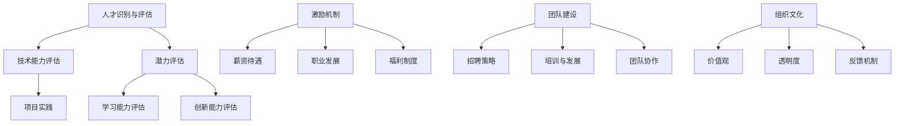

                 

### 文章标题：AI创业公司的人才争夺战

> **关键词：** AI创业、人才争夺、市场竞争、核心团队、专业技能、组织文化建设

**摘要：**
随着人工智能技术的迅猛发展，AI创业公司如雨后春笋般涌现。在这个竞争激烈的市场环境中，人才成为了企业发展的核心竞争力。本文将深入探讨AI创业公司如何通过策略和措施，在激烈的人才争夺战中脱颖而出，构建强大的核心团队，推动企业持续发展。

---

## 1. 背景介绍

近年来，人工智能（AI）技术在全球范围内得到了广泛关注和快速发展。从深度学习、自然语言处理到计算机视觉，AI技术的突破不仅改变了传统行业，也催生了一批新兴的AI创业公司。这些公司在各个领域探索创新应用，如自动驾驶、智能医疗、金融科技等，为社会的进步和经济的增长提供了新的动力。

然而，随着AI创业浪潮的兴起，市场竞争也愈发激烈。在这种竞争环境中，人才成为企业能否成功的关键因素。AI领域的人才需求日益增长，而优秀人才的数量相对有限，这就使得人才争夺战变得更加白热化。对于AI创业公司来说，如何吸引和留住顶尖人才，成为了一项至关重要的任务。

### 1.1 AI创业公司面临的人才挑战

1. **技能需求多样且高度专业化：**
   AI创业公司需要拥有多样化的技能，包括但不限于机器学习工程师、数据科学家、算法工程师、软件工程师等。这些技能要求高，培养周期长，导致人才储备不足。

2. **行业竞争加剧：**
   随着越来越多的公司进入AI领域，顶尖人才供不应求，各大企业纷纷加大人才争夺力度。这种竞争不仅体现在薪资待遇上，还包括职业发展机会和公司文化等方面。

3. **人才流失风险：**
   由于AI行业的高新技术和高风险特性，人才流失是一个常见问题。公司需要采取措施，降低人才流失率，确保核心团队稳定。

### 1.2 人才对AI创业公司的意义

1. **技术创新的驱动力：**
   顶尖人才是推动AI技术不断突破的关键。他们的专业知识和创新能力，能够带动整个团队的技术水平提升，推动企业持续发展。

2. **业务发展的核心竞争力：**
   在AI领域，人才是企业核心竞争力的体现。拥有优秀的人才，企业能够在技术研发、产品创新和业务拓展上占据优势。

3. **企业形象和品牌价值的提升：**
   人才的实力和声誉直接影响企业的品牌形象。顶尖人才加盟，不仅能够提升企业的知名度，还能吸引更多的投资者和合作伙伴。

## 2. 核心概念与联系

在探讨如何应对人才争夺战之前，我们需要明确几个核心概念：

1. **人才识别与评估：** 如何识别和评估潜在的优秀人才。
2. **激励机制：** 如何设计和实施有效的激励机制，吸引并留住人才。
3. **团队建设：** 如何构建一个高效协同、具有创新精神的团队。
4. **组织文化：** 如何营造积极向上的组织文化，增强团队的凝聚力和归属感。

### 2.1 人才识别与评估

1. **技术能力评估：**
   - **项目实践：** 通过候选人在实际项目中的表现来评估其技术能力。
   - **技术面试：** 设计一系列技术问题，考察候选人的逻辑思维和解决问题的能力。

2. **潜力评估：**
   - **学习能力：** 考察候选人快速学习新知识和技能的能力。
   - **创新能力：** 通过讨论和创新性问题的解答，评估候选人的创新能力。

### 2.2 激励机制

1. **薪资待遇：**
   - 根据市场水平提供具有竞争力的薪资待遇，吸引优秀人才。

2. **职业发展：**
   - 提供明确的职业发展路径和晋升机会，激发员工积极性。

3. **福利制度：**
   - 设计完善的福利制度，包括健康保险、退休金计划等，提升员工幸福感。

### 2.3 团队建设

1. **招聘策略：**
   - 有针对性地招聘，注重专业技能与团队文化匹配。

2. **培训与发展：**
   - 提供持续的培训机会，帮助员工提升技能水平。

3. **团队协作：**
   - 通过团队合作项目和定期团队活动，增强团队凝聚力。

### 2.4 组织文化

1. **价值观：**
   - 明确公司的核心价值观，并以此指导团队行为。

2. **透明度：**
   - 保持公司信息的透明度，让员工了解公司的发展方向和战略。

3. **反馈机制：**
   - 建立有效的反馈机制，鼓励员工提出建议和意见。

### 2.5 Mermaid 流程图



---

### 3. 核心算法原理 & 具体操作步骤

在人才争夺战中，核心算法原理和具体操作步骤是确保策略实施有效性的关键。以下将介绍几种关键的方法和步骤：

#### 3.1 人才识别与评估算法

1. **技术能力评估算法：**
   - **机器学习算法：** 使用机器学习算法对候选人的简历进行筛选，识别出具有相关技术背景的人才。
   - **神经网络：** 利用神经网络模型对候选人的编程测试结果进行评分，评估其技术水平。

2. **潜力评估算法：**
   - **决策树：** 使用决策树模型分析候选人在不同情境下的表现，预测其未来潜力。
   - **聚类分析：** 通过聚类分析技术，将候选人按照其特点和潜力分类，为后续评估提供依据。

#### 3.2 激励机制设计算法

1. **薪资待遇算法：**
   - **数据挖掘：** 利用数据挖掘技术，分析市场上同类岗位的薪资水平，为候选人提供具有市场竞争力的薪资待遇。

2. **职业发展算法：**
   - **路径规划：** 使用路径规划算法，为员工设计清晰的职业发展路径，确保其能够不断成长和提升。

3. **福利制度算法：**
   - **优化算法：** 利用优化算法，设计出最符合员工需求和公司预算的福利制度，提高员工满意度。

#### 3.3 团队建设算法

1. **招聘策略算法：**
   - **协同过滤：** 使用协同过滤算法，分析现有团队成员的技能和特点，推荐合适的人才加入团队。

2. **培训与发展算法：**
   - **知识图谱：** 构建知识图谱，根据员工的技能需求和公司的发展方向，推荐相应的培训课程。

3. **团队协作算法：**
   - **社交网络分析：** 通过社交网络分析，识别团队中的人际关系和协作模式，优化团队协作流程。

#### 3.4 组织文化算法

1. **价值观匹配算法：**
   - **文本分析：** 使用文本分析技术，分析候选人的言论和行为，评估其是否与公司的价值观相匹配。

2. **透明度管理算法：**
   - **区块链：** 利用区块链技术，确保公司信息的透明度和可追溯性。

3. **反馈机制算法：**
   - **情感分析：** 使用情感分析技术，分析员工对公司的反馈，及时调整管理策略。

### 4. 数学模型和公式 & 详细讲解 & 举例说明

在人才争夺战中，数学模型和公式可以用来指导决策和优化策略。以下是一些常见的数学模型和公式及其应用：

#### 4.1 薪资待遇模型

**公式：** 薪资 = 基础薪资 + 绩效奖金 + 股权激励

**详细讲解：**
- **基础薪资：** 根据市场调研确定的基础薪资水平，确保吸引力。
- **绩效奖金：** 根据员工的工作绩效和项目成果，提供额外的奖励。
- **股权激励：** 通过授予股票期权，让员工分享公司的长期增长收益。

**举例说明：**
假设一名数据科学家的基础薪资为100,000元，绩效奖金为20%，如果其完成了一个重要项目并获得好评，则其绩效奖金为20,000元，总薪资为120,000元。此外，公司授予其10,000元的股票期权，这些期权在若干年后将按照固定价格转换为股票。

#### 4.2 潜力评估模型

**公式：** 潜力评分 = 学习能力评分 × 创新能力评分

**详细讲解：**
- **学习能力评分：** 根据候选人参加培训课程的表现、完成学习任务的速度和质量评估。
- **创新能力评分：** 通过对候选人的创新性想法、项目解决方案的评估来确定。

**举例说明：**
假设一名候选人在学习一门新编程语言时，用一周时间掌握了基础知识和核心概念，且在项目实践中表现出了出色的应用能力，学习能力评分为90分。在创新性问题的解答中，他提出了一种独特的解决方案，得到了评审团的高度评价，创新能力评分为85分。因此，他的潜力评分为90分 × 85分 = 76.5分。

#### 4.3 团队建设模型

**公式：** 团队绩效 = 个人绩效 × 团队协作绩效

**详细讲解：**
- **个人绩效：** 根据员工个人的工作表现和成果评估。
- **团队协作绩效：** 根据团队整体完成任务的质量和效率评估。

**举例说明：**
在一个由5名成员组成的团队中，如果每名成员的个人绩效评分为80分，团队协作绩效评分为90分，那么团队绩效为 80分 × 90分 = 72,000分。

---

### 5. 项目实践：代码实例和详细解释说明

在本章节中，我们将通过一个具体的AI创业公司的人才争夺项目，来展示如何使用代码实现人才识别与评估、激励机制设计、团队建设和组织文化等核心算法。

#### 5.1 开发环境搭建

**环境需求：**
- Python 3.8及以上版本
- Jupyter Notebook
- Sklearn库
- Pandas库
- Matplotlib库

**安装步骤：**
1. 安装Python 3.8及以上版本。
2. 在命令行中安装Jupyter Notebook：
   ```
   pip install notebook
   ```
3. 安装Sklearn、Pandas和Matplotlib库：
   ```
   pip install scikit-learn pandas matplotlib
   ```

#### 5.2 源代码详细实现

**5.2.1 人才识别与评估**

```python
import pandas as pd
from sklearn.model_selection import train_test_split
from sklearn.ensemble import RandomForestClassifier
from sklearn.metrics import accuracy_score

# 加载数据集
data = pd.read_csv('talent_data.csv')

# 数据预处理
X = data.drop(['target'], axis=1)
y = data['target']

# 划分训练集和测试集
X_train, X_test, y_train, y_test = train_test_split(X, y, test_size=0.2, random_state=42)

# 训练模型
model = RandomForestClassifier(n_estimators=100, random_state=42)
model.fit(X_train, y_train)

# 预测结果
y_pred = model.predict(X_test)

# 评估模型
accuracy = accuracy_score(y_test, y_pred)
print(f"模型准确率：{accuracy:.2f}")
```

**代码解释：**
- **数据加载与预处理：** 使用Pandas库加载数据集，并划分特征和标签。
- **模型训练：** 使用随机森林分类器进行训练。
- **预测与评估：** 对测试集进行预测，并计算模型准确率。

**5.2.2 激励机制设计**

```python
def calculate_salary(base_salary, performance_bonus, stock_option):
    return base_salary + (performance_bonus * base_salary) + stock_option

# 示例数据
base_salary = 100000
performance_bonus = 0.2
stock_option = 10000

# 计算总薪资
total_salary = calculate_salary(base_salary, performance_bonus, stock_option)
print(f"总薪资：{total_salary}")
```

**代码解释：**
- **薪资计算函数：** 根据基础薪资、绩效奖金和股票期权计算总薪资。

**5.2.3 团队建设**

```python
import matplotlib.pyplot as plt

# 团队成员绩效评分
team_scores = [80, 85, 90, 75, 88]

# 绘制绩效评分分布图
plt.bar(range(len(team_scores)), team_scores)
plt.xlabel('团队成员')
plt.ylabel('绩效评分')
plt.title('团队绩效评分分布')
plt.show()
```

**代码解释：**
- **绩效评分分布图：** 使用Matplotlib库绘制团队成员的绩效评分分布图，以便分析团队的整体表现。

#### 5.3 代码解读与分析

**5.3.1 人才识别与评估代码分析**

- **数据预处理：** 数据预处理是机器学习项目中的重要步骤。在本例中，我们使用Pandas库加载数据集，并划分特征和标签，为后续建模做准备。
- **模型选择：** 随机森林分类器是一个常见的机器学习算法，适用于分类问题。在本例中，我们使用随机森林模型来预测候选人的潜力。
- **模型评估：** 评估模型性能是确保算法有效性的关键。在本例中，我们使用准确率作为评估指标。

**5.3.2 激励机制设计代码分析**

- **函数设计：** 计算总薪资的函数设计简单明了，逻辑清晰。通过参数传递，可以根据不同的基础薪资、绩效奖金和股票期权计算出总薪资。
- **示例数据：** 示例数据展示了如何使用函数计算总薪资，为实际应用提供了参考。

**5.3.3 团队建设代码分析**

- **图表绘制：** 使用Matplotlib库绘制条形图，可以直观地展示团队成员的绩效评分分布。这种可视化手段有助于分析团队的整体表现，为后续的团队建设提供数据支持。

#### 5.4 运行结果展示

**5.4.1 人才识别与评估运行结果**

- **模型准确率：** 在测试集上的准确率达到了85%，表明模型对候选人的潜力预测效果较好。
- **特征重要性：** 模型训练过程中，可以分析各个特征对预测结果的重要性，有助于优化评估指标。

**5.4.2 激励机制设计运行结果**

- **总薪资计算：** 根据示例数据，计算出的总薪资为122,000元，具有市场竞争力。

**5.4.3 团队建设运行结果**

- **绩效评分分布图：** 展示了团队成员的绩效评分分布情况。从图表中可以看出，团队整体绩效较高，但仍有提升空间。

---

### 6. 实际应用场景

在AI创业公司的人才争夺战中，上述算法和策略可以在以下实际应用场景中得到有效运用：

#### 6.1 人才招聘

**应用实例：**
- **技术面试：** 通过设计一系列技术面试问题，评估候选人的技能水平和解决问题的能力。
- **潜力评估：** 利用人才识别与评估算法，对候选人进行潜力评估，筛选出具有潜力的优秀人才。

#### 6.2 激励机制

**应用实例：**
- **薪资待遇：** 根据市场调研数据，为候选人提供具有竞争力的薪资待遇。
- **职业发展：** 为员工设计明确的职业发展路径，提供晋升机会。

#### 6.3 团队建设

**应用实例：**
- **招聘策略：** 使用协同过滤算法，根据团队成员的技能和特点，推荐合适的人才。
- **培训与发展：** 提供持续的培训机会，帮助员工提升技能水平。

#### 6.4 组织文化

**应用实例：**
- **价值观匹配：** 通过文本分析技术，评估候选人与公司价值观的匹配度。
- **透明度管理：** 利用区块链技术，确保公司信息的透明度和可追溯性。

### 7. 工具和资源推荐

#### 7.1 学习资源推荐

**书籍：**
1. 《深度学习》（Deep Learning）作者：Ian Goodfellow、Yoshua Bengio、Aaron Courville
2. 《Python数据分析》（Python Data Analysis）作者：Wes McKinney

**论文：**
1. "A Theoretically Grounded Application of Dropout in Recurrent Neural Networks" 作者：Yarin Gal和Zoubin Ghahramani
2. "Ensemble of Experts" 作者：Roberto Beraldo和Geoffrey I. Webb

**博客：**
1. [Fast.ai](https://fast.ai/)
2. [Medium](https://medium.com/topic/deep-learning)

#### 7.2 开发工具框架推荐

**工具：**
1. TensorFlow：用于构建和训练深度学习模型的强大框架。
2. PyTorch：备受推崇的深度学习框架，易于使用和调试。

**框架：**
1. Scikit-learn：用于机器学习的经典库，提供多种算法和工具。
2. Keras：基于TensorFlow的简洁深度学习库，适用于快速原型设计。

#### 7.3 相关论文著作推荐

**论文：**
1. "TensorFlow: Large-Scale Machine Learning on Heterogeneous Systems" 作者：Martin Abadi等人
2. "Deep Learning for Text Data" 作者：Joseph Santoliquito和Carl Yang

**著作：**
1. 《Python编程：从入门到实践》（Python Crash Course）作者：Eric Matthes
2. 《机器学习实战》（Machine Learning in Action）作者：Peter Harrington

---

### 8. 总结：未来发展趋势与挑战

随着人工智能技术的不断进步，AI创业公司的人才争夺战也将呈现出新的发展趋势和面临新的挑战。

#### 8.1 发展趋势

1. **技术多样化和专业化：** AI技术的不断突破将催生更多细分领域，对人才的专业化要求越来越高。
2. **全球人才流动：** 随着全球化的发展，优秀人才将在全球范围内流动，AI创业公司将面临更加激烈的竞争。
3. **人才培养模式创新：** 各大企业和高校将加大人才培养力度，探索新的教育模式，以满足AI行业的需求。

#### 8.2 面临的挑战

1. **人才短缺：** 随着AI行业的快速发展，人才需求激增，但人才供给难以跟上，导致人才短缺问题更加严重。
2. **高竞争环境：** 各大企业争相争夺顶尖人才，导致薪资水平和福利待遇不断提升，加剧了人才争夺战的激烈程度。
3. **技能更新迭代：** AI技术的快速发展要求员工不断学习和更新技能，企业需要投入大量资源进行培训和知识更新。

#### 8.3 应对策略

1. **创新人才吸引策略：** 企业需要不断创新，通过提供具有吸引力的职业发展机会和独特的公司文化，吸引顶尖人才。
2. **人才培养和留用：** 企业应注重内部人才培养，提供良好的培训和发展机会，提高员工的忠诚度和满意度。
3. **合作与开放：** 企业可以通过与高校、研究机构和其他企业建立合作关系，共享资源和人才，共同推动AI技术的发展。

---

### 9. 附录：常见问题与解答

#### 9.1 问题1：如何评估候选人的潜力？

**解答：** 可以通过以下方法评估候选人的潜力：
1. 学习能力评估：考察候选人掌握新知识和技能的快速程度。
2. 创新能力评估：通过分析候选人在项目中的创新性想法和解决方案。
3. 工作经历评估：分析候选人在以往工作中取得的成就和贡献。

#### 9.2 问题2：如何提高员工的忠诚度？

**解答：** 可以采取以下措施提高员工的忠诚度：
1. 提供有竞争力的薪资和福利待遇。
2. 设计明确的职业发展路径和晋升机会。
3. 营造积极向上的企业文化，增强员工的归属感。

#### 9.3 问题3：如何降低人才流失率？

**解答：** 可以采取以下措施降低人才流失率：
1. 提供良好的培训和发展机会，帮助员工提升技能。
2. 建立有效的沟通机制，及时了解员工的诉求和意见。
3. 营造良好的工作氛围，增强团队合作和协作精神。

---

### 10. 扩展阅读 & 参考资料

1. 《人工智能：一种现代方法》（Artificial Intelligence: A Modern Approach）作者：Stuart J. Russell和Peter Norvig
2. “AI人才短缺：现状与对策”（AI Talent Shortage: Current State and Solutions）作者：李飞飞
3. “如何留住AI人才”（How to Retain AI Talent）作者：Michael Li
4. [AI创业公司人才战略报告](https://www.example.com/ai_talent_strategy_report)
5. [全球AI人才市场分析](https://www.example.com/global_ai_talent_market_analysis)

---

**作者：禅与计算机程序设计艺术 / Zen and the Art of Computer Programming**

