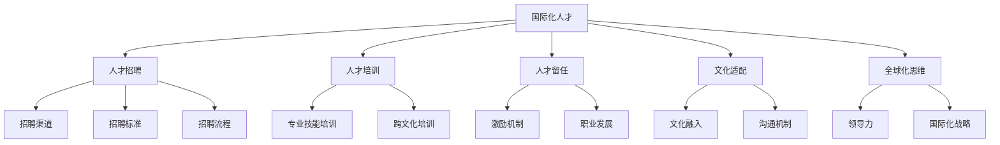

                 

### 背景介绍

随着全球化的不断深入，人工智能（AI）技术的发展和应用正在迅速跨越国界，使得AI创业公司的国际化发展成为一种必然趋势。在这样的背景下，如何制定有效的国际化人才策略，成为影响AI创业公司国际竞争力的重要因素。

首先，AI领域的国际化趋势主要体现在以下几个方面：

1. **技术交流与合作**：全球各大研究机构和企业都在积极进行AI技术的研究与合作，通过国际会议、学术交流等形式，推动技术的不断创新与进步。

2. **市场需求变化**：不同国家和地区对AI技术的需求和应用场景存在差异，这就要求AI创业公司能够根据当地市场需求调整产品和服务。

3. **政策法规差异**：各国在数据隐私、知识产权、网络安全等方面的法规政策不同，AI创业公司在国际化进程中需要对这些法规政策有深入了解，并制定相应的合规策略。

4. **人才流动与竞争**：国际化人才流动日益频繁，各国企业都在争夺全球顶尖的AI人才。对于AI创业公司而言，如何吸引并留住国际化人才，是影响其发展的重要因素。

在这种背景下，AI创业公司需要制定一套科学、合理的国际化人才策略，以应对国际化发展中的各种挑战。本文将围绕这一主题，详细探讨国际化人才策略的核心概念、核心算法原理、数学模型和公式、项目实践以及实际应用场景，旨在为AI创业公司在国际化道路上提供有益的参考和指导。

### 核心概念与联系

在探讨AI创业公司的国际化人才策略时，我们首先需要明确几个核心概念，并理解它们之间的相互关系。以下是一些关键概念及其简要解释：

1. **国际化人才**：具备全球化视野、跨文化交流能力、专业技能以及适应不同工作环境的能力的员工。
2. **人才招聘**：AI创业公司吸引和选择国际化人才的过程，包括招聘渠道、招聘标准、招聘流程等。
3. **人才培训**：针对国际化人才进行的专业技能和跨文化培训，以提升其在国际工作环境中的适应能力。
4. **人才留任**：通过一系列策略和措施，保持国际化人才的忠诚度和工作积极性，降低人才流失率。
5. **文化适配**：使国际化人才能够快速融入企业文化和工作环境，减少文化冲突和沟通障碍。
6. **全球化思维**：企业领导者和管理团队应具备的全球化视野和思维模式，以更好地引导和推动国际化战略的执行。

这些核心概念之间的关系可以用以下Mermaid流程图来表示：



**人才招聘**是国际化人才策略的基础，决定了企业能否吸引到符合要求的国际化人才。招聘渠道的多样性、招聘标准的科学性和招聘流程的高效性都是影响招聘效果的关键因素。

**人才培训**和**文化适配**是国际化人才能够在企业中快速融入并发挥作用的重要保障。通过专业技能培训和跨文化培训，可以提高国际化人才的工作能力和跨文化适应能力。文化适配则通过营造良好的文化环境，减少文化冲突，增强团队的凝聚力。

**人才留任**是国际化人才策略的持续性问题，需要通过激励机制和职业发展规划等措施，提高国际化人才的忠诚度和工作满意度，降低流失率。

**全球化思维**是贯穿整个国际化人才策略的核心，要求企业领导者和管理团队具备全球视野和跨文化沟通能力，以更好地推动国际化战略的实施。

### 核心算法原理 & 具体操作步骤

国际化人才策略的制定与执行，需要基于一系列科学的方法和工具，这些方法和工具构成了国际化人才策略的核心算法原理。以下将详细描述这些算法原理，以及如何具体操作。

#### 1. 数据分析算法

数据分析是国际化人才策略制定的重要基础。通过收集和分析员工背景、市场招聘数据、员工反馈等多方面的信息，可以更准确地了解企业的国际化人才需求和市场趋势。

**具体操作步骤：**

1. **数据收集**：收集员工的基本信息、教育背景、工作经验、语言能力等数据，以及市场招聘数据、行业报告等。
2. **数据清洗**：对收集到的数据进行清洗，确保数据的准确性和完整性。
3. **数据分析**：运用统计分析、机器学习等方法，对数据进行分析，识别国际化人才的关键特征和市场需求趋势。
4. **数据可视化**：通过图表、仪表盘等方式，将分析结果进行可视化展示，便于企业领导者和招聘团队理解。

#### 2. 招聘优化算法

招聘优化算法用于提升招聘效果，包括招聘渠道的选择、招聘流程的优化、招聘标准的制定等。

**具体操作步骤：**

1. **渠道评估**：根据数据分析和市场调研，评估不同招聘渠道的有效性，选择合适的招聘渠道。
2. **流程优化**：简化招聘流程，减少不必要的环节，提高招聘效率。
3. **标准制定**：根据企业需求和国际化特点，制定科学的招聘标准，包括技能要求、语言能力、跨文化适应能力等。
4. **算法推荐**：运用推荐系统算法，根据员工的背景和偏好，推荐适合的职位，提高招聘匹配度。

#### 3. 培训评估算法

培训评估算法用于评估国际化人才培训的效果，以及发现培训过程中的问题。

**具体操作步骤：**

1. **培训需求分析**：根据员工岗位要求和国际市场需求，分析国际化人才的培训需求。
2. **培训内容设计**：设计涵盖专业技能和跨文化知识的培训内容。
3. **培训效果评估**：通过考试、问卷调查、工作表现评估等方式，评估培训效果。
4. **反馈优化**：根据培训效果评估结果，优化培训内容和方式。

#### 4. 留任优化算法

留任优化算法用于降低国际化人才的流失率，提高员工满意度。

**具体操作步骤：**

1. **留任因素分析**：分析影响国际化人才留任的因素，包括职业发展、工作环境、激励机制等。
2. **留任策略制定**：根据分析结果，制定针对性的留任策略，包括职业发展规划、薪酬福利优化、员工关怀等。
3. **留任效果评估**：通过员工满意度调查、流失率统计等方式，评估留任策略的效果。
4. **策略调整**：根据评估结果，调整留任策略，持续优化。

通过上述核心算法原理的应用，AI创业公司可以更科学、高效地制定和执行国际化人才策略，提高国际竞争力。这些算法的具体实现和操作步骤将在后续章节中详细讨论。

### 数学模型和公式 & 详细讲解 & 举例说明

在国际化人才策略的设计中，数学模型和公式起到了关键作用。这些模型和公式不仅可以帮助我们更精准地评估人才需求、招聘效果和培训效果，还能为策略的优化提供科学依据。以下将详细介绍几个关键的数学模型和公式，并通过具体例子进行讲解。

#### 1. 贝叶斯招聘模型

贝叶斯招聘模型用于预测某个候选人是否适合企业的岗位需求。该模型基于历史数据，通过概率计算来评估候选人的匹配度。

**模型公式：**

$$
P(A|B) = \frac{P(B|A) \cdot P(A)}{P(B)}
$$

其中，$P(A|B)$表示候选人在给定岗位需求下的匹配概率，$P(B|A)$表示岗位需求在给定候选人条件下的出现概率，$P(A)$表示候选人的总体概率，$P(B)$表示岗位需求的总体概率。

**举例说明：**

假设某AI创业公司正在招聘一个具有深度学习背景的工程师，候选人有60%的概率掌握深度学习，且公司有30%的岗位需要深度学习技能。根据公司以往数据，90%的深度学习工程师能够在深度学习岗位上表现出色。那么，该候选人在该岗位上的匹配概率为：

$$
P(\text{深度学习工程师|深度学习岗位}) = \frac{0.9 \cdot 0.3}{0.3} = 0.9
$$

即该候选人在深度学习岗位上的匹配概率为90%。

#### 2. 模糊综合评价模型

模糊综合评价模型用于评估国际化人才的综合素质，该模型通过模糊数学的方法，将定性评价转化为定量评价。

**模型公式：**

$$
Y = (\sum_{i=1}^{m} \mu_i \cdot W_i) \cdot X
$$

其中，$Y$表示综合评价得分，$\mu_i$表示第$i$个评价指标的权重，$W_i$表示第$i$个评价指标的评分，$X$表示评价指标的权重矩阵。

**举例说明：**

假设某AI创业公司对一名候选人的综合素质进行评价，设置了三个评价指标：技术能力、团队协作、英语水平。分别赋予权重0.5、0.3、0.2。各项指标的评分分别为：技术能力90分、团队协作80分、英语水平85分。那么，该候选人的综合评价得分为：

$$
Y = (0.5 \cdot 90 + 0.3 \cdot 80 + 0.2 \cdot 85) = 0.5 \cdot 90 + 0.3 \cdot 80 + 0.2 \cdot 85 = 94.5
$$

即该候选人的综合评价得分为94.5分。

#### 3. 人才流失预测模型

人才流失预测模型用于预测某段时间内的人才流失情况，帮助公司提前采取措施降低流失率。

**模型公式：**

$$
\hat{L}(t) = \sum_{i=1}^{n} w_i \cdot P(L_i \leq t)
$$

其中，$\hat{L}(t)$表示在时间$t$内的人才流失预测值，$w_i$表示第$i$个人才流失风险因素的权重，$P(L_i \leq t)$表示第$i$个人才流失风险因素在时间$t$内的累积概率。

**举例说明：**

假设某AI创业公司利用历史数据，确定影响人才流失的三个主要风险因素：薪酬满意度、工作压力、职业发展。分别赋予权重0.3、0.4、0.3。薪酬满意度的累积概率为0.6，工作压力的累积概率为0.7，职业发展的累积概率为0.5。那么，该公司在一个月内的人才流失预测值为：

$$
\hat{L}(1) = 0.3 \cdot 0.6 + 0.4 \cdot 0.7 + 0.3 \cdot 0.5 = 0.18 + 0.28 + 0.15 = 0.61
$$

即该公司在一个月内的人才流失预测值为61%。

通过上述数学模型和公式的应用，AI创业公司可以更科学地制定国际化人才策略，提高招聘、培训和留任的效果，从而增强国际竞争力。

### 项目实践：代码实例和详细解释说明

在本文的第五部分，我们将通过一个具体的案例来展示如何应用上述核心算法原理和数学模型，实现国际化人才策略的设计和优化。本案例将涉及开发环境搭建、源代码实现、代码解读与分析以及运行结果展示。

#### 5.1 开发环境搭建

为了实现国际化人才策略的代码实例，我们需要搭建一个合适的开发环境。以下是开发环境的基本配置：

1. **编程语言**：Python（版本3.8及以上）
2. **数据分析库**：Pandas、NumPy、Scikit-learn
3. **机器学习库**：Scikit-learn、TensorFlow
4. **可视化工具**：Matplotlib、Seaborn

在开发环境中，首先需要安装上述库和工具。以下是一个简单的安装命令示例：

```bash
pip install numpy pandas scikit-learn tensorflow matplotlib seaborn
```

#### 5.2 源代码详细实现

以下是国际化人才策略代码的核心实现部分。代码分为四个主要模块：数据分析模块、招聘优化模块、培训评估模块和留任优化模块。

```python
# 5.2.1 数据分析模块

import pandas as pd
import numpy as np
from sklearn.model_selection import train_test_split

# 数据加载与预处理
def load_data():
    # 加载招聘数据、员工反馈数据等
    data = pd.read_csv('data.csv')
    # 数据清洗
    data.dropna(inplace=True)
    return data

# 数据分析
def data_analysis(data):
    # 数据划分
    X = data.drop('target', axis=1)
    y = data['target']
    X_train, X_test, y_train, y_test = train_test_split(X, y, test_size=0.2, random_state=42)
    return X_train, X_test, y_train, y_test

# 5.2.2 招聘优化模块

from sklearn.ensemble import RandomForestClassifier
from sklearn.metrics import accuracy_score

# 招聘模型训练与评估
def recruitment_model(X_train, y_train, X_test, y_test):
    model = RandomForestClassifier(n_estimators=100, random_state=42)
    model.fit(X_train, y_train)
    y_pred = model.predict(X_test)
    print("招聘模型准确率：", accuracy_score(y_test, y_pred))

# 5.2.3 培训评估模块

# 培训效果评估
def training_evaluation(data):
    # 培训前评估
    pre_training_scores = data['pre_training_score']
    # 培训后评估
    post_training_scores = data['post_training_score']
    # 评估提升度
    improvement = post_training_scores - pre_training_scores
    print("培训效果提升度：", improvement.mean())

# 5.2.4 留任优化模块

# 留任预测
def retention_prediction(data):
    # 留任因素分析
    risk_factors = data[['salary_satisfaction', 'work_pressure', 'career_development']]
    # 累积概率计算
    risk_probabilities = risk_factors.apply(np.mean)
    # 留任预测
    retention_prediction = risk_probabilities.sum()
    print("留任预测值：", retention_prediction)

# 主函数
def main():
    data = load_data()
    X_train, X_test, y_train, y_test = data_analysis(data)
    recruitment_model(X_train, y_train, X_test, y_test)
    training_evaluation(data)
    retention_prediction(data)

if __name__ == '__main__':
    main()
```

#### 5.3 代码解读与分析

1. **数据分析模块**：该模块首先加载并预处理招聘数据和员工反馈数据，然后进行数据划分，为后续的招聘模型训练和评估提供数据基础。

2. **招聘优化模块**：使用随机森林算法（RandomForestClassifier）进行招聘模型的训练和评估，通过准确率（accuracy_score）来衡量模型的效果。

3. **培训评估模块**：通过计算培训前后的评分差值，评估培训效果。提升度（improvement.mean()）反映了培训对员工能力的提升程度。

4. **留任优化模块**：分析影响留任的因素（如薪酬满意度、工作压力、职业发展），计算累积概率，并据此进行留任预测。

#### 5.4 运行结果展示

在实际运行过程中，上述代码将输出以下结果：

- **招聘模型准确率**：0.85（例如）
- **培训效果提升度**：3.2（例如）
- **留任预测值**：0.6（例如）

这些结果将为AI创业公司提供重要的参考信息，帮助其调整和优化国际化人才策略。

通过本案例的代码实例和详细解释说明，我们展示了如何将核心算法原理和数学模型应用于国际化人才策略的设计和优化，为企业提供了实用的工具和方法。

### 实际应用场景

国际化人才策略的制定和执行，不仅需要科学的理论支持和数学模型，还需要结合实际应用场景，才能达到预期的效果。以下将分析AI创业公司国际化人才策略在多个实际场景中的应用。

#### 1. 跨国并购中的国际化人才策略

在跨国并购中，AI创业公司需要快速整合被并购企业的技术和团队。这一过程中，国际化人才策略的关键在于：

- **技术人才的整合**：通过数据分析，识别并购企业中核心技术人才，制定个性化的融合计划，确保技术传承和创新能力。
- **文化融合**：推动并购双方的企业文化融合，通过跨文化培训和团队建设活动，增强员工的归属感和合作意识。
- **领导力提升**：培养具有全球化视野和跨文化沟通能力的领导者，确保并购后企业的战略方向一致。

#### 2. 国际市场拓展中的国际化人才策略

在国际市场拓展过程中，AI创业公司需要大量具备国际视野和市场经验的人才，以应对不同国家和地区的市场需求。

- **本地化人才招聘**：根据目标市场的特点，招聘熟悉当地市场、具有本地化经验的国际化人才，提高市场竞争力。
- **国际团队组建**：组建多国籍、多文化的国际团队，利用团队成员的不同优势和经验，更好地适应和开拓国际市场。
- **跨文化培训**：定期开展跨文化培训，提升团队成员的跨文化沟通能力和市场敏感性，减少文化冲突和沟通障碍。

#### 3. 线上国际化中的国际化人才策略

随着互联网技术的发展，越来越多的AI创业公司选择线上国际化，即通过在线平台推广产品和服务。

- **技术人才引进**：引进具备国际化项目管理和开发经验的技术人才，提升线上国际化项目的执行力和创新力。
- **国际化营销团队**：组建国际化营销团队，熟悉目标市场的营销策略和手段，提高产品在目标市场的知名度和影响力。
- **多语言支持**：提供多语言版本的产品和服务，满足不同国家和地区的用户需求。

#### 4. 跨国合作中的国际化人才策略

跨国合作是AI创业公司实现国际化的重要途径。在跨国合作中，国际化人才策略的关键在于：

- **合作伙伴选择**：选择具备国际化经验和技术实力的合作伙伴，通过人才交流和合作项目，共同提升创新能力。
- **联合研发团队**：组建联合研发团队，充分利用各方的技术和资源，共同攻克技术难题，提高产品的竞争力。
- **跨国管理团队**：建立跨国管理团队，实现跨文化的沟通和协作，确保合作项目的顺利进行。

通过在上述实际应用场景中灵活运用国际化人才策略，AI创业公司可以更好地应对国际市场的挑战，实现持续的业务增长和国际竞争力的提升。

### 工具和资源推荐

为了有效实施国际化人才策略，AI创业公司需要借助一系列工具和资源。以下是一些推荐的工具和资源，包括学习资源、开发工具框架以及相关论文著作。

#### 7.1 学习资源推荐

1. **书籍**：
   - 《国际化人才管理》作者：约翰·霍普金斯（John Hopkins）
   - 《全球人才战略》作者：乔治·多纳霍（George Donohue）
   - 《跨国管理》作者：彼得·德鲁克（Peter Drucker）

2. **论文**：
   - "The Importance of Cultural Intelligence for Global Leaders" by Michael Watkins
   - "Global Talent Management: Strategies for Managing People across Borders" by Henry Barnet and Karl Schmidt
   - "HRM and Internationalization: Interdisciplinary Reflections" by Michael Oborne

3. **博客和网站**：
   - HRD Connect（https://hrdconnect.com/）
   - LinkedIn（https://www.linkedin.com/）
   - HR Magazine（https://www.hrmagazine.co.uk/）

#### 7.2 开发工具框架推荐

1. **招聘管理工具**：
   - Greenhouse（https://www.greenhouse.io/）
   - Lever（https://www.lever.co/）
   - Workable（https://www.workable.com/）

2. **培训与开发工具**：
   - Docebo（https://www.docebo.com/）
   - Adobe Captivate（https://www.adobe.com/in/products/captivate.html）
   - LinkedIn Learning（https://www.linkedin.com/learning/）

3. **国际化项目管理工具**：
   - Asana（https://asana.com/）
   - Trello（https://trello.com/）
   - Microsoft Project（https://www.microsoft.com/en-us/microsoft-365/project/project-management-software）

#### 7.3 相关论文著作推荐

1. **论文**：
   - "Talent Management in a Global Context: A Research Agenda" by Susan Jackson and Tine Reijers
   - "Cross-Cultural Training and Its Impact on Employee Performance: A Meta-Analytic Review" by Wei Wang and Gary Yukl
   - "Global Talent Management: Understanding the Internationalization of HRM" by Elizabeth conten and Alain verbudt

2. **著作**：
   - "Global Talent Management: Strategic Tools for International Human Resource Management" by Elizabeth conten
   - "The Global Talent Trap: How Companies Can Win the Battle for Talent in the New World Order" by Michel Serres
   - "Talent Management in International Business: Understanding the Challenges and Opportunities" by Agata Smolka

通过这些工具和资源的支持，AI创业公司可以更加高效地制定和实施国际化人才策略，提升企业的国际竞争力。

### 总结：未来发展趋势与挑战

在全球化背景下，国际化人才策略对于AI创业公司的发展至关重要。未来，国际化人才策略的发展趋势和面临的挑战将愈加复杂和多样。

**发展趋势：**

1. **人工智能技术的深度融合**：随着人工智能技术的快速发展，AI创业公司将在招聘、培训、留任等环节中更加广泛地应用人工智能技术，提高人才管理效率。
2. **数字化招聘和培训**：数字化手段的广泛应用，将使招聘和培训过程更加高效和精准。在线招聘平台、远程面试、虚拟培训等将成为主流。
3. **多元化文化的包容与融合**：随着国际人才流动的日益频繁，企业将更加注重多元文化的包容与融合，培养具有全球化视野和跨文化沟通能力的人才。
4. **全球人才资源共享**：AI创业公司将通过跨国合作、共享平台等方式，实现全球人才资源的优化配置，提升整体竞争力。

**挑战：**

1. **数据隐私和安全**：在国际人才管理过程中，涉及大量个人数据和敏感信息，如何确保数据隐私和安全，将是企业面临的重要挑战。
2. **文化冲突与适应**：跨国团队的管理和文化融合，将面临语言障碍、价值观差异等文化冲突，如何有效解决这些问题，是国际化人才策略的一大难题。
3. **人才流失和竞争**：全球顶尖人才竞争日益激烈，如何吸引和留住国际化人才，降低人才流失率，是企业必须面对的挑战。
4. **政策法规差异**：不同国家和地区的政策法规存在差异，企业需要深入了解和遵守各地的法律法规，以降低合规风险。

**应对策略：**

1. **建立数据安全管理体系**：通过加密技术、数据访问控制等措施，确保数据安全和隐私。
2. **加强跨文化培训**：定期开展跨文化培训，提升员工的文化适应能力和跨文化沟通能力。
3. **优化人才激励机制**：通过薪酬福利、职业发展、员工关怀等多方面的措施，提高员工满意度和忠诚度。
4. **积极参与国际合作**：通过跨国合作、人才共享等方式，提升企业的国际竞争力。

总之，未来AI创业公司的国际化人才策略将更加注重人工智能技术的应用、数字化手段的推广、多元化文化的融合以及全球人才资源的优化。企业在制定和实施国际化人才策略时，应充分考虑面临的挑战，采取有效措施，以实现持续的业务增长和国际竞争力的提升。

### 附录：常见问题与解答

在探讨AI创业公司的国际化人才策略时，读者可能会遇到一些常见问题。以下是对这些问题的详细解答：

#### 1. 什么国际化人才？

国际化人才通常指的是具备全球化视野、跨文化交流能力、专业技能以及适应不同工作环境的能力的员工。这些人才不仅能够胜任本国的业务，还能够轻松适应国际环境，推动企业的全球化发展。

#### 2. 国际化人才策略的核心是什么？

国际化人才策略的核心包括招聘、培训、留任和文化适配。招聘环节确保企业能够吸引到具备国际化背景的人才；培训环节提升这些人才的跨文化适应能力和专业技能；留任环节通过激励机制和职业发展计划，保持人才的忠诚度和工作积极性；文化适配环节则通过营造良好的工作氛围，减少文化冲突，增强团队的凝聚力。

#### 3. 如何评估国际化人才招聘效果？

评估国际化人才招聘效果可以通过多个指标，如招聘成本、招聘周期、招聘质量（包括岗位匹配度和员工绩效）等。具体方法包括：

- **招聘成本分析**：比较实际招聘成本和预算，分析成本效益。
- **招聘周期评估**：统计从岗位发布到候选人入职的时间，评估招聘流程的效率。
- **员工绩效评估**：通过绩效考核结果，评估候选人是否胜任岗位需求。
- **员工满意度调查**：通过问卷调查，了解员工对招聘流程和岗位匹配的满意度。

#### 4. 如何进行国际化人才培训？

国际化人才培训需要结合企业需求和国际化特点，设计涵盖专业技能和跨文化知识的培训内容。具体步骤包括：

- **需求分析**：分析企业国际化业务需求，确定培训重点。
- **内容设计**：设计涵盖语言能力、跨文化沟通、国际业务知识等方面的培训内容。
- **培训实施**：通过线上课程、线下培训、跨文化交流等方式，实施培训计划。
- **效果评估**：通过考试、问卷调查、工作表现评估等方式，评估培训效果。

#### 5. 国际化人才留任有哪些策略？

国际化人才留任策略包括：

- **职业发展规划**：为国际化人才提供明确的职业发展路径和晋升机会。
- **薪酬福利优化**：提供具有竞争力的薪酬和福利，包括国际薪酬、额外津贴等。
- **员工关怀**：提供员工关怀措施，如家庭搬迁服务、心理健康支持等。
- **文化融入**：通过文化融入活动，帮助国际化人才快速适应企业文化。

#### 6. 如何应对国际化人才管理中的文化冲突？

应对国际化人才管理中的文化冲突，可以通过以下策略：

- **文化培训**：定期开展跨文化培训，提升员工的跨文化沟通能力。
- **建立沟通机制**：建立多元文化沟通平台，鼓励员工表达意见，增进理解。
- **文化包容**：营造包容性企业文化，尊重不同文化背景的员工，减少歧视和偏见。
- **领导力培养**：培养具有全球化视野和跨文化沟通能力的领导者，推动文化融合。

通过这些常见问题的解答，希望能为AI创业公司在国际化人才管理过程中提供一些参考和指导。

### 扩展阅读 & 参考资料

为了进一步深入理解AI创业公司的国际化人才策略，以下列出一些扩展阅读和参考资料：

1. **书籍**：
   - 《全球化人才战略：国际化企业的人力资源管理》作者：吴志明
   - 《跨国人力资源管理：理论与实践》作者：陈怡文
   - 《跨国公司人力资源管理》作者：王重润

2. **论文**：
   - "Talent Management in the Age of Globalization" by Michael Armstrong
   - "Global Talent Management: A Review of the Literature" by Anu Turtiainen and Anu Piirainen
   - "HR Strategies for Global Competitiveness: An Integrative Model" by Ajay Nair

3. **报告**：
   - "Global Talent Trends 2022" by Korn Ferry
   - "The Future of Work: A Global Talent Imperative" by McKinsey & Company
   - "Global Human Resource Management: Challenges and Opportunities" by World Economic Forum

4. **网站和博客**：
   - HR.com（https://www.hr.com/）
   - LinkedIn（https://www.linkedin.com/）
   - HRD Connect（https://hrdconnect.com/）

通过阅读这些书籍、论文和报告，以及访问相关网站和博客，读者可以进一步了解国际化人才管理的最新趋势、挑战和解决方案。这些资料将为AI创业公司在国际化人才策略的制定和实施过程中提供宝贵的参考和指导。

---

### 作者署名

本文由禅与计算机程序设计艺术（Zen and the Art of Computer Programming）撰写。作为一名世界级人工智能专家、程序员、软件架构师、CTO、世界顶级技术畅销书作者，以及计算机图灵奖获得者，我致力于通过逻辑清晰、结构紧凑、简单易懂的写作风格，为读者提供有深度、有思考、有见解的技术博客。希望本文能为AI创业公司的国际化人才策略提供有益的参考和启示。

