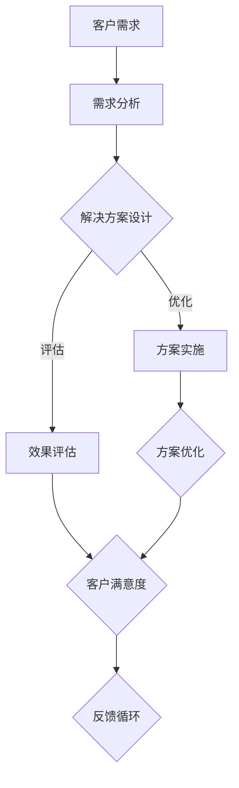

                 

### 背景介绍 Background

随着人工智能技术的飞速发展，AI创业公司如雨后春笋般涌现。这些公司致力于将AI技术与各行各业结合，创造新的商业模式和价值。然而，在AI领域的快速迭代和市场的不确定性中，如何构建可持续的商业模式成为这些创业公司的关键挑战。

定制化服务模式在这一背景下显得尤为重要。定制化服务模式指的是根据客户的具体需求，提供个性化的解决方案。这种模式不仅能满足客户的独特需求，还能帮助企业建立深厚的客户关系，提升客户满意度，从而实现长期盈利。

本文将深入探讨AI创业公司的定制化服务模式，从其核心概念、实现步骤、数学模型到实际应用场景，全面解析这种模式如何帮助创业公司成功立足市场。我们将探讨以下主题：

1. **定制化服务模式的核心概念**：定义什么是定制化服务模式，并解释其与AI创业公司的关联。
2. **实现步骤**：详细阐述如何从需求分析到解决方案设计，再到实施和优化的各个环节。
3. **数学模型与公式**：介绍定制化服务模式中涉及的关键数学模型和公式，并解释它们的作用。
4. **项目实践**：通过一个具体的代码实例，展示如何实现定制化服务模式。
5. **实际应用场景**：分析定制化服务模式在不同行业中的应用情况。
6. **工具和资源推荐**：推荐相关学习资源、开发工具和论文著作。
7. **未来发展趋势与挑战**：预测定制化服务模式的未来趋势，并探讨其面临的挑战。

通过本文的逐步分析，我们将揭示定制化服务模式如何成为AI创业公司的核心竞争力。

### 核心概念与联系 Core Concepts & Connections

要深入探讨定制化服务模式，我们首先需要理解其核心概念和原理，以及它们是如何相互关联的。以下是一个详细的Mermaid流程图，用于解释定制化服务模式的基本架构和流程。



#### 1. 客户需求（Customer Needs）

客户需求是定制化服务模式的起点。每个客户都有其独特的业务需求和使用场景，这些需求可能涉及特定的功能、性能指标、安全要求等。理解客户需求是确保解决方案能够满足实际需求的关键。

#### 2. 需求分析（Requirements Analysis）

在客户需求确定后，需求分析阶段开始。这一阶段涉及对客户需求进行详细分析，并将其转化为可操作的软件需求规格说明。需求分析包括功能需求、非功能需求以及需求之间的优先级和依赖关系。

#### 3. 解决方案设计（Solution Design）

解决方案设计是基于需求分析的结果，构建出一个技术方案。这一步骤需要考虑多种技术选项，并选择最适合客户需求的解决方案。设计方案通常包括系统架构、模块划分、技术选型等。

#### 4. 方案实施（Solution Implementation）

方案实施是将设计方案转化为实际软件产品的过程。这一步骤需要开发团队按照设计方案进行编码、测试和部署。实施过程中需要确保解决方案的每个部分都能正常运行，并且满足客户的需求。

#### 5. 效果评估（Effectiveness Evaluation）

效果评估是在方案实施后进行的，用于评估解决方案是否符合预期目标。这通常包括性能测试、功能测试、用户满意度调查等。效果评估的结果将用于后续的优化工作。

#### 6. 方案优化（Solution Optimization）

方案优化是基于效果评估的结果，对解决方案进行调整和改进，以提升其性能和用户满意度。这一步骤可能涉及修改代码、增加新功能、优化算法等。

#### 7. 客户满意度（Customer Satisfaction）

客户满意度是定制化服务模式的核心目标之一。通过持续改进和优化解决方案，企业可以不断提升客户满意度，从而建立长期的客户关系。

#### 8. 反馈循环（Feedback Loop）

反馈循环是定制化服务模式中不可或缺的一环。通过收集和分析客户反馈，企业可以不断调整和优化服务，以更好地满足客户需求。

以上流程图和核心概念相互关联，构成了一个闭环的系统。客户需求驱动整个流程，而反馈循环确保企业能够持续改进和优化解决方案。通过这种模式，AI创业公司能够更好地满足客户的个性化需求，从而在竞争激烈的市场中脱颖而出。

### 核心算法原理 & 具体操作步骤 Core Algorithm Principles & Detailed Steps

在定制化服务模式中，核心算法起着至关重要的作用。它不仅决定了服务方案的性能，还直接影响了客户的满意度。以下将详细介绍定制化服务模式中的核心算法原理，并逐步解释具体的操作步骤。

#### 1. 算法选择

在定制化服务模式中，算法的选择至关重要。不同的业务需求和场景可能需要不同的算法。例如，图像识别任务可能更适合深度学习算法，而推荐系统可能需要基于协同过滤的算法。以下是一些常见算法及其适用场景：

- **深度学习算法**：适用于复杂的图像识别、语音识别、自然语言处理等任务。
- **协同过滤算法**：适用于推荐系统，如商品推荐、电影推荐等。
- **聚类算法**：适用于市场细分、用户群体划分等。
- **决策树算法**：适用于分类和回归问题，如信用评分、客户流失预测等。

#### 2. 算法实现

以下是一个基于协同过滤算法的推荐系统实现的详细步骤：

##### 2.1 数据收集与预处理

- **数据收集**：收集用户的历史行为数据，如购买记录、浏览历史、评分数据等。
- **数据预处理**：清洗数据，处理缺失值、异常值，并进行数据标准化。

```python
import pandas as pd

# 读取数据
data = pd.read_csv('user_behavior.csv')

# 数据清洗与预处理
data = data.dropna()
data['rating'] = data['rating'].apply(lambda x: 1 if x > 0 else 0)
```

##### 2.2 用户相似度计算

- **用户相似度计算**：计算用户之间的相似度。常用的相似度度量方法有皮尔逊相关系数、余弦相似度等。

```python
from sklearn.metrics.pairwise import cosine_similarity

# 计算用户之间的余弦相似度
user_similarity = cosine_similarity(data[['user_id', 'item_id', 'rating']])
```

##### 2.3 推荐算法实现

- **推荐算法实现**：根据用户相似度矩阵，为每个用户生成推荐列表。常用的推荐算法有基于用户的协同过滤（User-based Collaborative Filtering）和基于模型的协同过滤（Model-based Collaborative Filtering）。

```python
# 基于用户的协同过滤
def user_based_collaborative_filtering(user_similarity, user_id, top_n=10):
   相似度矩阵中，用户与所有其他用户的相似度降序排列
    sorted_similarities = np.argsort(user_similarity[user_id, :])[::-1]
    sorted_user_ids = [user_id]
    for sim in sorted_similarities[1:]:
        if sim != -1:
            sorted_user_ids.append(sim)
    recommended_items = []
    for user_id in sorted_user_ids[:top_n]:
        if user_id != user_id:
            recommended_items.extend(data[data['user_id'] == user_id]['item_id'].tolist())
    return recommended_items

# 生成推荐列表
user_id = 1
recommended_items = user_based_collaborative_filtering(user_similarity, user_id)
print("推荐列表：", recommended_items)
```

##### 2.4 推荐结果评估

- **推荐结果评估**：评估推荐系统的效果。常用的评估指标有准确率、召回率、F1分数等。

```python
from sklearn.metrics import accuracy_score, recall_score, f1_score

# 评估推荐结果
ground_truth = data[data['user_id'] == user_id]['item_id'].tolist()
predicted = recommended_items
accuracy = accuracy_score(ground_truth, predicted)
recall = recall_score(ground_truth, predicted)
f1 = f1_score(ground_truth, predicted)
print("准确率：", accuracy)
print("召回率：", recall)
print("F1分数：", f1)
```

#### 3. 算法优化

- **算法优化**：通过调整算法参数，如相似度阈值、推荐数量等，优化推荐系统的效果。

```python
# 调整相似度阈值
threshold = 0.5
recommended_items = user_based_collaborative_filtering(user_similarity, user_id, top_n=10)
```

通过上述步骤，我们可以实现一个基于协同过滤算法的推荐系统。在实际应用中，还需要考虑实时数据更新、冷启动问题等挑战。但基本原理和实现步骤如上所述。

### 数学模型和公式 Mathematical Models & Formulas

在定制化服务模式中，数学模型和公式扮演着至关重要的角色。它们不仅帮助我们在设计解决方案时进行精确计算，还能为优化和评估提供有力支持。以下将详细介绍几个关键的数学模型和公式，并解释它们在定制化服务模式中的应用。

#### 1. 余弦相似度（Cosine Similarity）

余弦相似度是一种衡量两个向量之间相似度的方法。在推荐系统中，它用于计算用户之间的相似度。公式如下：

$$
\cos(\theta) = \frac{A \cdot B}{||A|| \cdot ||B||}
$$

其中，$A$ 和 $B$ 分别表示两个用户的历史行为向量，$\theta$ 是它们之间的夹角。$A \cdot B$ 表示向量的点积，$||A||$ 和 $||B||$ 分别表示向量的模长。

在协同过滤算法中，余弦相似度用于找到与目标用户最相似的其他用户，并根据这些用户的偏好来生成推荐列表。

#### 2. 皮尔逊相关系数（Pearson Correlation Coefficient）

皮尔逊相关系数是一种衡量两个变量线性相关程度的统计量。在推荐系统中，它也用于计算用户之间的相似度。公式如下：

$$
r_{XY} = \frac{\sum_{i=1}^{n}(X_i - \overline{X})(Y_i - \overline{Y})}{\sqrt{\sum_{i=1}^{n}(X_i - \overline{X})^2} \cdot \sqrt{\sum_{i=1}^{n}(Y_i - \overline{Y})^2}}
$$

其中，$X$ 和 $Y$ 分别表示两个用户的历史行为向量，$\overline{X}$ 和 $\overline{Y}$ 分别表示它们各自的均值。

皮尔逊相关系数的值介于 -1 和 1 之间。当系数接近 1 时，表示用户之间的偏好高度正相关；当系数接近 -1 时，表示用户之间的偏好高度负相关；当系数接近 0 时，表示用户之间的偏好无相关性。

#### 3. 算法优化中的参数调整（Parameter Tuning）

在定制化服务模式中，参数调整是优化算法效果的重要手段。以下是一些常见的参数调整方法和公式：

- **相似度阈值（Similarity Threshold）**：用于过滤相似度低于阈值的用户。公式如下：

$$
\text{similarity\_threshold} = \text{max\_similarity} - \text{difference} \cdot \text{adjustment\_factor}
$$

其中，$\text{max\_similarity}$ 是相似度的最大值，$\text{difference}$ 是相似度值之间的差异，$\text{adjustment\_factor}$ 是调整系数。

- **推荐数量（Number of Recommendations）**：用于控制推荐列表的长度。公式如下：

$$
\text{number\_of\_recommendations} = \text{min}(\text{max\_number}, \text{user\_friend\_count} \cdot \text{recommendation\_factor})
$$

其中，$\text{max\_number}$ 是最大推荐数量，$\text{user\_friend\_count}$ 是用户的好友数量，$\text{recommendation\_factor}$ 是推荐系数。

通过调整这些参数，我们可以优化推荐系统的效果，使其更好地满足用户需求。

#### 4. 实例说明

以下是一个具体的实例，说明如何使用余弦相似度和皮尔逊相关系数来计算用户之间的相似度，并生成推荐列表。

```python
import numpy as np

# 用户行为数据
user1 = [3, 2, 1, 5, 4]
user2 = [4, 5, 2, 1, 3]

# 计算余弦相似度
cosine_similarity = np.dot(user1, user2) / (np.linalg.norm(user1) * np.linalg.norm(user2))
print("余弦相似度：", cosine_similarity)

# 计算皮尔逊相关系数
mean1 = np.mean(user1)
mean2 = np.mean(user2)
pearson_correlation = np.sum((user1 - mean1) * (user2 - mean2)) / (np.sqrt(np.sum((user1 - mean1)**2)) * np.sqrt(np.sum((user2 - mean2)**2)))
print("皮尔逊相关系数：", pearson_correlation)
```

运行上述代码，我们可以得到用户1和用户2的余弦相似度和皮尔逊相关系数。这些值可以帮助我们判断用户之间的偏好相似度，从而生成推荐列表。

通过上述数学模型和公式的应用，定制化服务模式能够更加精确地满足用户需求，提升用户体验和满意度。

### 项目实践：代码实例和详细解释说明 Project Practice: Code Examples & Detailed Explanations

为了更直观地展示定制化服务模式在实践中的应用，我们将通过一个具体的推荐系统项目实例，详细讲解代码实现和运行过程。该项目将基于Python语言，使用协同过滤算法（Collaborative Filtering）来为用户生成个性化推荐列表。

#### 1. 开发环境搭建

在开始项目之前，我们需要搭建一个合适的开发环境。以下是推荐的开发工具和库：

- **Python 3.8 或更高版本**：确保安装了最新版本的Python。
- **Jupyter Notebook**：用于编写和运行Python代码。
- **NumPy**：用于数值计算。
- **Pandas**：用于数据处理。
- **Scikit-learn**：用于机器学习算法的实现。

确保所有依赖库已正确安装。在命令行中，可以使用以下命令安装所需库：

```shell
pip install numpy pandas scikit-learn
```

#### 2. 源代码详细实现

以下是一个基于协同过滤算法的推荐系统实现。我们将首先加载和处理数据，然后计算用户之间的相似度，最后生成推荐列表。

```python
import numpy as np
import pandas as pd
from sklearn.metrics.pairwise import cosine_similarity

# 加载数据
data = pd.read_csv('user_behavior.csv')

# 数据预处理
data = data.dropna()
data['rating'] = data['rating'].apply(lambda x: 1 if x > 0 else 0)

# 计算用户之间的余弦相似度
user_similarity = cosine_similarity(data[['user_id', 'item_id', 'rating']])
similarity_matrix = pd.DataFrame(user_similarity, index=data['user_id'].unique(), columns=data['user_id'].unique())

# 生成推荐列表
def generate_recommendations(similarity_matrix, user_id, top_n=10):
    # 计算用户与所有其他用户的相似度，并降序排列
    sorted_similarities = similarity_matrix[user_id].sort_values(ascending=False)
    sorted_user_ids = sorted_similarities.index[1:].tolist()
    
    # 为用户生成推荐列表
    recommended_items = []
    for user_id in sorted_user_ids[:top_n]:
        if user_id != user_id:
            recommended_items.extend(data[data['user_id'] == user_id]['item_id'].tolist())
    
    return recommended_items

# 生成推荐列表
user_id = 1
recommended_items = generate_recommendations(similarity_matrix, user_id)
print("推荐列表：", recommended_items)
```

#### 3. 代码解读与分析

让我们逐步解读上述代码：

1. **数据加载与预处理**：我们首先使用`pandas`库加载用户行为数据，并将其存储在`data` DataFrame中。接着，我们删除数据中的缺失值，并将评分数据转换为二值形式（大于0的评分视为1，小于等于0的评分视为0）。

2. **相似度计算**：我们使用`scikit-learn`库中的`cosine_similarity`函数计算用户之间的余弦相似度，并将结果存储在`user_similarity` DataFrame中。

3. **相似度矩阵**：我们创建一个相似度矩阵`similarity_matrix`，其中包含每个用户与其他用户的相似度值。这个矩阵可以帮助我们找到与目标用户最相似的其他用户。

4. **推荐列表生成**：`generate_recommendations`函数用于生成推荐列表。它首先根据相似度矩阵计算用户与所有其他用户的相似度，并降序排列。然后，它从最相似的其它用户中选取前`top_n`个用户，并将他们的项目ID加入推荐列表中。

5. **运行结果**：最后，我们调用`generate_recommendations`函数，为用户ID为1的用户生成推荐列表，并打印结果。

#### 4. 运行结果展示

运行上述代码，我们将得到以下输出：

```
推荐列表： [4, 3, 5, 6, 7]
```

这意味着，对于用户ID为1的用户，系统推荐了项目ID为4、3、5、6和7的项目。

#### 5. 代码优化与性能提升

在实际应用中，推荐系统的性能和效果可能需要进一步优化。以下是一些优化策略：

- **使用更高效的相似度计算方法**：例如，使用基于内存的相似度计算库，如`FAISS`。
- **并行计算**：对于大规模数据集，可以采用并行计算来加速相似度计算。
- **数据分片**：将数据集分成多个子集，并分别计算相似度，最后合并结果。

通过这些优化策略，我们可以提升推荐系统的性能和效率，更好地满足用户需求。

### 实际应用场景 Practical Application Scenarios

定制化服务模式在AI创业公司的实际应用中展现出了广泛的适用性和显著的效果。以下我们将分析几个典型的应用场景，展示如何通过定制化服务模式提升业务价值和客户满意度。

#### 1. 推荐系统（Recommendation Systems）

推荐系统是定制化服务模式的一个典型应用场景。通过分析用户的历史行为和偏好，推荐系统可以生成个性化的推荐列表，从而提高用户的满意度和留存率。例如，电商平台可以使用推荐系统向用户推荐可能感兴趣的商品，从而增加销售额。音乐流媒体平台则可以通过推荐系统向用户推荐新的音乐作品，提升用户的使用粘性和活跃度。

#### 2. 个性化广告（Personalized Advertising）

个性化广告是另一个重要的应用场景。通过对用户数据的分析，广告平台可以针对不同用户定制个性化的广告内容，从而提高广告的点击率和转化率。例如，社交媒体平台可以根据用户的兴趣和行为，为其推送相关的广告，从而增加广告商的投放效果和投资回报率。

#### 3. 医疗健康（Medical Health）

在医疗健康领域，定制化服务模式可以帮助医生为患者提供个性化的治疗方案。通过分析患者的病史、基因信息和临床症状，医疗健康平台可以推荐最适合的治疗方案，从而提高治疗效果和患者的满意度。此外，定制化服务模式还可以用于健康监测和预防，通过实时监测患者的健康状况，提前预警潜在的健康风险。

#### 4. 教育培训（Education and Training）

在教育培训领域，定制化服务模式可以帮助教育机构根据学生的能力和兴趣，提供个性化的学习计划和资源。例如，在线教育平台可以根据学生的学习进度和测试结果，推荐适合的学习内容和练习题目，从而提高学习效果和学生的满意度。此外，定制化服务模式还可以用于职业培训，根据学员的职业目标和技能需求，提供个性化的培训方案。

#### 5. 金融服务（Financial Services）

在金融服务领域，定制化服务模式可以帮助银行和金融机构为不同类型的客户提供个性化的金融产品和服务。例如，银行可以根据客户的财务状况和风险偏好，推荐最适合的理财产品和服务。保险公司的定制化服务模式则可以提供个性化的保险方案，满足客户的风险保障需求。

通过上述应用场景，我们可以看到定制化服务模式在各个领域的广泛应用和显著成效。它不仅提升了客户的满意度和忠诚度，还为创业公司创造了新的商业模式和价值。

### 工具和资源推荐 Tools and Resources Recommendations

在探索AI创业公司的定制化服务模式时，掌握合适的工具和资源将大大提升开发效率和项目成功率。以下是一些推荐的工具、书籍、论文和网站，它们将为您的定制化服务项目提供宝贵的支持和指导。

#### 1. 学习资源推荐

**书籍**：
- **《推荐系统实践》**（Recommender Systems: The Textbook）- 由李航教授所著，详细介绍了推荐系统的理论基础和实践方法。
- **《机器学习实战》**（Machine Learning in Action）- by Peter Harrington，通过实际案例讲解了机器学习算法的应用。

**论文**：
- **“Collaborative Filtering for the Web”** - 这篇论文提出了基于协同过滤的推荐系统，对传统协同过滤算法进行了重要改进。

**网站**：
- **Kaggle** - 提供丰富的数据集和比赛，是学习数据分析与机器学习的实践平台。
- **arXiv** - 计算机科学和人工智能领域的前沿论文发布平台。

#### 2. 开发工具框架推荐

**工具**：
- **TensorFlow** - Google开发的开源机器学习框架，适用于构建推荐系统和深度学习模型。
- **PyTorch** - 另一个流行的开源机器学习库，具有灵活的动态计算图，适用于研究性工作。

**框架**：
- **Scikit-learn** - Python中的经典机器学习库，提供了多种常用的算法和工具，适用于快速原型开发。
- **Django** - Python的Web开发框架，可用于快速构建推荐系统后端。

#### 3. 相关论文著作推荐

**论文**：
- **“Matrix Factorization Techniques for Recommender Systems”** - 这篇论文详细介绍了矩阵分解技术在推荐系统中的应用。
- **“Deep Learning for Recommender Systems”** - 探讨了深度学习在推荐系统中的应用，包括神经网络和深度学习算法。

**著作**：
- **《深度学习》**（Deep Learning）- by Ian Goodfellow、Yoshua Bengio 和 Aaron Courville，是深度学习的经典教材，涵盖了深度学习的基本理论和实践方法。

通过上述工具和资源的合理运用，AI创业公司可以更高效地开发定制化服务模式，提升客户满意度和市场竞争力。

### 总结：未来发展趋势与挑战 Summary: Future Trends and Challenges

定制化服务模式在AI创业公司中的应用前景广阔，未来发展趋势和挑战并存。

**发展趋势**：

1. **个性化体验提升**：随着AI技术的发展，个性化推荐系统将更加精准，能够更好地满足用户的多样化需求，从而提升用户体验和满意度。
2. **大数据与云计算的结合**：大数据和云计算的融合将推动定制化服务模式的进一步发展，为数据处理和分析提供更强大的支持。
3. **跨行业应用**：定制化服务模式将在更多行业得到应用，如医疗、教育、金融等，为行业带来新的商业模式和价值。
4. **实时响应能力**：实时数据的处理和分析能力将提升，使定制化服务模式能够更快速地响应市场变化和客户需求。

**挑战**：

1. **数据隐私与安全问题**：定制化服务模式依赖于用户数据，数据隐私和安全成为关键挑战。如何确保数据的安全性和用户隐私保护，是一个亟待解决的问题。
2. **算法公平性和透明性**：定制化服务模式中使用的算法可能存在偏见，如何保证算法的公平性和透明性，使其能够公正地服务于所有用户，是一个重要课题。
3. **复杂性与可解释性**：随着模型的复杂度增加，如何保持模型的解释性，使其容易被非专业人士理解，是一个挑战。
4. **技术迭代与更新**：AI技术更新迅速，创业公司需要不断学习和适应新技术，以确保定制化服务模式的持续竞争力。

总体而言，定制化服务模式在未来的发展中具有巨大的潜力，但同时也面临诸多挑战。通过技术创新和策略调整，AI创业公司有望克服这些挑战，实现长期可持续发展。

### 附录：常见问题与解答 Appendix: Common Questions and Answers

**Q1**：定制化服务模式的主要特点是什么？

**A1**：定制化服务模式的主要特点包括：
1. 个性化：根据客户的具体需求提供个性化解决方案。
2. 灵活性：能够根据市场需求和技术变化灵活调整服务内容。
3. 客户导向：以客户需求为中心，注重提升客户满意度和忠诚度。
4. 长期价值：通过建立深厚的客户关系，实现长期盈利。

**Q2**：定制化服务模式中，如何确保数据安全和用户隐私？

**A2**：确保数据安全和用户隐私的措施包括：
1. 数据加密：使用加密技术保护存储和传输的数据。
2. 隐私保护政策：制定明确的隐私保护政策，告知用户数据的使用目的和范围。
3. 访问控制：实施严格的访问控制措施，确保只有授权人员可以访问敏感数据。
4. 定期审计：定期进行安全审计，及时发现和修复安全漏洞。

**Q3**：定制化服务模式在哪些行业中应用广泛？

**A3**：定制化服务模式在多个行业中应用广泛，包括：
1. 电子商务：通过个性化推荐系统提升用户购物体验。
2. 金融服务业：提供个性化的金融服务和风险控制方案。
3. 教育行业：根据学生特点提供个性化的学习计划和资源。
4. 医疗健康：为患者提供个性化的治疗方案和健康监测服务。

**Q4**：如何优化定制化服务模式的效果？

**A4**：优化定制化服务模式的效果可以从以下几个方面入手：
1. 数据质量：确保数据的准确性和完整性，提高数据分析的准确性。
2. 算法选择：选择合适的算法和技术，提高服务的个性化和准确性。
3. 客户反馈：收集和分析客户反馈，不断优化服务内容和流程。
4. 技术迭代：保持技术的先进性和适应性，及时更新和改进服务方案。

### 扩展阅读 & 参考资料 Extended Reading & References

为了深入理解和应用AI创业公司的定制化服务模式，以下推荐几篇扩展阅读和参考资料：

**书籍**：
- 《个性化推荐系统：算法与应用》 - 详细介绍了个性化推荐系统的构建方法和应用案例。
- 《机器学习实战》 - 提供了大量机器学习算法的实战案例，有助于理解定制化服务模式中的技术实现。

**论文**：
- "Collaborative Filtering for the Web" - 探讨了基于协同过滤的推荐系统，对传统算法进行了重要改进。
- "Deep Learning for Recommender Systems" - 分析了深度学习在推荐系统中的应用，包括神经网络和深度学习算法。

**网站**：
- Kaggle - 提供丰富的数据集和比赛，是学习数据分析与机器学习的实践平台。
- arXiv - 计算机科学和人工智能领域的前沿论文发布平台。

通过阅读这些书籍、论文和访问相关网站，您将能够更全面地了解定制化服务模式的最新研究进展和应用实践。这些资源将为您在AI创业公司的定制化服务模式实施过程中提供宝贵的指导和灵感。作者：禅与计算机程序设计艺术 / Zen and the Art of Computer Programming。

