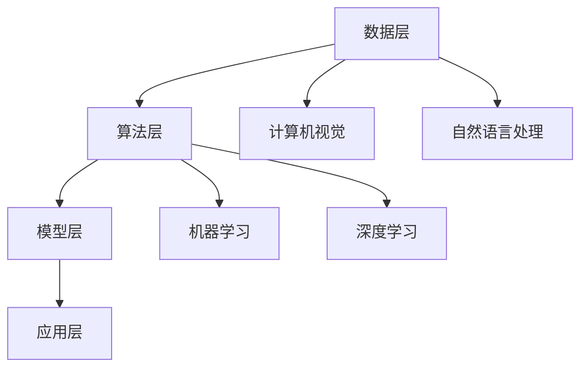

                 

AI，作为当今科技领域的明星技术，无疑为创业公司带来了前所未有的机遇。本文将围绕AI创业公司的市场前景进行探讨，分析其发展潜力、应用场景及面临的挑战。关键词包括：AI创业、市场前景、应用场景、挑战与机遇。

> 摘要：本文通过对AI技术的深入分析，探讨了AI创业公司的市场前景。文章首先介绍了AI技术的核心概念和发展历程，随后分析了AI在各个领域的应用潜力，最后探讨了AI创业公司面临的挑战和应对策略，为AI创业者提供了有价值的参考。

## 1. 背景介绍

### AI技术概述

人工智能（Artificial Intelligence，简称AI）是一种模拟人类智能的技术，旨在使计算机系统具备学习、推理、解决问题和自主决策的能力。AI的发展可以追溯到20世纪50年代，当时计算机科学家们开始探索如何使计算机实现类似于人类智能的功能。

随着计算机技术的进步，AI技术也逐渐发展壮大。从最初的符号主义和规则系统，到基于数据的学习算法和深度神经网络，AI技术经历了多个阶段的发展。近年来，得益于大数据和云计算的快速发展，AI技术取得了显著的突破，开始在各个领域得到广泛应用。

### AI创业公司的兴起

在AI技术蓬勃发展的背景下，越来越多的创业者开始投身于AI创业领域。AI创业公司不仅涵盖了传统的计算机视觉、自然语言处理等方向，还扩展到了智能交通、智能制造、金融科技等新兴领域。

AI创业公司的兴起，一方面得益于AI技术的成熟和广泛应用，另一方面也源于市场对智能解决方案的迫切需求。在科技巨头和风投公司的支持下，AI创业公司如雨后春笋般涌现，为市场带来了新的活力和机遇。

### AI创业公司的市场前景

AI创业公司的市场前景广阔，主要体现在以下几个方面：

1. **市场需求强劲**：随着数字化转型的深入推进，各行各业对智能解决方案的需求日益增加，为AI创业公司提供了广阔的市场空间。
2. **技术创新不断**：AI技术正处于快速发展阶段，新的算法、框架和工具不断涌现，为AI创业公司提供了丰富的创新空间。
3. **投资热情高涨**：科技巨头和风投公司对AI领域的投资持续增加，为AI创业公司提供了充足的资金支持。
4. **跨界合作频繁**：AI创业公司与各行各业的传统企业之间展开了广泛的合作，共同探索智能解决方案，推动产业升级。

## 2. 核心概念与联系

### AI技术核心概念

人工智能（Artificial Intelligence，简称AI）是一种模拟人类智能的技术，主要包括以下几个核心概念：

1. **机器学习**：机器学习是AI的核心技术之一，通过从数据中学习规律和模式，使计算机具备自主学习和优化能力。
2. **深度学习**：深度学习是机器学习的一个分支，通过构建多层神经网络模型，实现自动特征提取和复杂模式的识别。
3. **计算机视觉**：计算机视觉是使计算机具备理解图像和视频内容的能力，广泛应用于人脸识别、目标检测、图像生成等领域。
4. **自然语言处理**：自然语言处理是使计算机具备理解和处理自然语言的能力，包括语音识别、机器翻译、情感分析等。

### AI技术架构

AI技术的架构主要包括以下几个层次：

1. **数据层**：数据是AI技术的核心资源，数据的质量和数量直接影响AI模型的效果。
2. **算法层**：算法是AI技术的核心，包括机器学习算法、深度学习算法等，用于从数据中提取规律和模式。
3. **模型层**：模型是基于算法构建的数学模型，用于实现特定任务的功能。
4. **应用层**：应用层是基于模型实现的实际应用场景，包括计算机视觉、自然语言处理、智能语音等。

### AI技术联系

AI技术各核心概念和层次之间相互联系，共同构建了完整的AI技术体系。机器学习和深度学习为AI技术提供了强大的学习能力和模式识别能力，计算机视觉和自然语言处理则扩展了AI技术的应用范围，数据层和算法层则为AI技术的研发提供了基础支持。

### Mermaid 流程图



## 3. 核心算法原理 & 具体操作步骤

### 3.1 算法原理概述

AI创业公司的核心算法通常是基于机器学习和深度学习的。机器学习是一种通过从数据中学习规律和模式，使计算机具备自主学习和优化能力的技术。深度学习则是机器学习的一个分支，通过构建多层神经网络模型，实现自动特征提取和复杂模式的识别。

在机器学习中，常见的算法包括线性回归、逻辑回归、支持向量机、决策树、随机森林等。深度学习算法则包括卷积神经网络（CNN）、循环神经网络（RNN）、生成对抗网络（GAN）等。

### 3.2 算法步骤详解

1. **数据收集与预处理**：收集相关领域的大量数据，并对数据进行清洗、归一化等预处理操作，以提高数据质量和模型的性能。
2. **特征提取**：利用特征提取算法从原始数据中提取有意义的特征，用于训练模型。
3. **模型训练**：使用训练数据集对模型进行训练，通过调整模型的参数，使模型能够对输入数据进行分类、预测或回归等操作。
4. **模型评估**：使用验证数据集对模型进行评估，计算模型的准确率、召回率、F1值等指标，以评估模型的性能。
5. **模型优化**：根据评估结果对模型进行优化，调整模型的参数或选择更合适的模型架构，以提高模型的性能。
6. **模型部署**：将训练好的模型部署到实际应用场景中，实现对输入数据的分类、预测或回归等操作。

### 3.3 算法优缺点

**机器学习算法的优点**：

1. **灵活性高**：机器学习算法能够自动从数据中学习规律和模式，适应不同的应用场景。
2. **可扩展性强**：机器学习算法能够处理大规模数据，并且可以轻松扩展到更多特征和样本。

**机器学习算法的缺点**：

1. **数据依赖性强**：机器学习算法的性能很大程度上取决于数据的质量和数量，数据不足或质量差会影响模型的性能。
2. **可解释性差**：机器学习算法的决策过程通常较为复杂，难以解释其内部机制。

**深度学习算法的优点**：

1. **强大的特征提取能力**：深度学习算法能够自动从数据中提取有意义的特征，减少人工干预。
2. **高效的计算性能**：深度学习算法通常采用并行计算和GPU加速，能够高效处理大规模数据。

**深度学习算法的缺点**：

1. **数据需求大**：深度学习算法通常需要大量数据进行训练，数据收集和预处理过程较为耗时。
2. **计算资源需求高**：深度学习算法的计算过程复杂，对计算资源和存储资源有较高要求。

### 3.4 算法应用领域

机器学习和深度学习算法在各个领域都有广泛的应用：

1. **计算机视觉**：包括人脸识别、目标检测、图像分类、图像生成等。
2. **自然语言处理**：包括语音识别、机器翻译、情感分析、文本分类等。
3. **智能交通**：包括交通流量预测、车辆识别、自动驾驶等。
4. **智能制造**：包括机器人视觉、故障诊断、生产优化等。
5. **金融科技**：包括风险控制、智能投顾、量化交易等。

## 4. 数学模型和公式 & 详细讲解 & 举例说明

### 4.1 数学模型构建

在AI创业公司的核心算法中，数学模型是至关重要的一环。常见的数学模型包括线性模型、概率模型、神经网络模型等。

**线性模型**：

线性模型是一种最简单的数学模型，通常用于回归和分类任务。其基本形式为：

$$
y = \beta_0 + \beta_1 x_1 + \beta_2 x_2 + ... + \beta_n x_n
$$

其中，$y$ 是输出值，$x_1, x_2, ..., x_n$ 是输入特征，$\beta_0, \beta_1, \beta_2, ..., \beta_n$ 是模型参数。

**概率模型**：

概率模型主要用于处理不确定性和概率事件，常见的有贝叶斯网络、马尔可夫模型等。以贝叶斯网络为例，其基本形式为：

$$
P(A, B, C) = P(A) \cdot P(B|A) \cdot P(C|B, A)
$$

其中，$P(A), P(B|A), P(C|B, A)$ 分别是事件 $A, B, C$ 的概率。

**神经网络模型**：

神经网络模型是深度学习的基础，其基本结构包括输入层、隐藏层和输出层。以卷积神经网络（CNN）为例，其基本形式为：

$$
h_l = \sigma(\mathbf{W}_l \cdot \mathbf{a}_{l-1} + b_l)
$$

其中，$h_l$ 是隐藏层$l$的输出，$\mathbf{W}_l$ 是权重矩阵，$\mathbf{a}_{l-1}$ 是输入层$l-1$的输出，$b_l$ 是偏置项，$\sigma$ 是激活函数。

### 4.2 公式推导过程

以下以线性回归模型为例，介绍数学公式的推导过程。

**线性回归模型**：

线性回归模型是一种最简单的回归模型，其基本形式为：

$$
y = \beta_0 + \beta_1 x_1 + \beta_2 x_2 + ... + \beta_n x_n
$$

其中，$y$ 是输出值，$x_1, x_2, ..., x_n$ 是输入特征，$\beta_0, \beta_1, \beta_2, ..., \beta_n$ 是模型参数。

**损失函数**：

为了评估模型的性能，通常使用损失函数来衡量预测值与真实值之间的差距。常用的损失函数有均方误差（MSE）和交叉熵损失（Cross-Entropy Loss）。

均方误差（MSE）：

$$
MSE = \frac{1}{m} \sum_{i=1}^{m} (y_i - \hat{y}_i)^2
$$

其中，$m$ 是样本数量，$y_i$ 是真实值，$\hat{y}_i$ 是预测值。

交叉熵损失（Cross-Entropy Loss）：

$$
Cross-Entropy Loss = - \frac{1}{m} \sum_{i=1}^{m} y_i \cdot \log(\hat{y}_i)
$$

**优化算法**：

为了求解线性回归模型的参数，常用的优化算法有梯度下降（Gradient Descent）和随机梯度下降（Stochastic Gradient Descent）。

梯度下降（Gradient Descent）：

$$
\beta_j = \beta_j - \alpha \cdot \frac{\partial}{\partial \beta_j} MSE
$$

其中，$\alpha$ 是学习率，$\beta_j$ 是模型参数，$\frac{\partial}{\partial \beta_j} MSE$ 是损失函数对参数$\beta_j$ 的梯度。

随机梯度下降（Stochastic Gradient Descent）：

$$
\beta_j = \beta_j - \alpha \cdot \frac{\partial}{\partial \beta_j} MSE(y_i, \hat{y}_i)
$$

### 4.3 案例分析与讲解

以下以一个简单的线性回归案例进行说明。

**案例**：

给定一个数据集，其中包含2个特征和1个目标变量。目标变量为房价，特征为房屋面积和房屋年龄。

**数据集**：

| 房屋面积（平方米） | 房屋年龄（年） | 房价（万元） |
| ----------------- | -------------- | ------------ |
|         100       |          10     |      200     |
|         150       |          8      |      250     |
|         200       |          5      |      300     |
|         120       |          12     |      220     |
|         180       |          7      |      270     |

**模型**：

假设线性回归模型为：

$$
房价 = \beta_0 + \beta_1 \cdot 房屋面积 + \beta_2 \cdot 房屋年龄
$$

**步骤**：

1. **数据预处理**：对数据集进行归一化处理，将特征值缩放到[0, 1]范围内。
2. **模型训练**：使用梯度下降算法对模型进行训练，优化模型参数。
3. **模型评估**：使用验证集对模型进行评估，计算模型的准确率和RMSE等指标。
4. **模型部署**：将训练好的模型部署到实际应用场景中，对新的数据进行预测。

## 5. 项目实践：代码实例和详细解释说明

### 5.1 开发环境搭建

为了实现上述案例的线性回归模型，我们需要搭建一个Python编程环境。以下是具体的操作步骤：

1. **安装Python**：前往Python官方网站（https://www.python.org/）下载Python安装包，并按照指引完成安装。
2. **安装依赖库**：使用pip命令安装必要的依赖库，例如NumPy、Pandas和Scikit-Learn等。命令如下：

```bash
pip install numpy pandas scikit-learn
```

### 5.2 源代码详细实现

以下是一个简单的线性回归模型的实现代码，包括数据预处理、模型训练、模型评估和模型部署。

```python
import numpy as np
import pandas as pd
from sklearn.linear_model import LinearRegression
from sklearn.model_selection import train_test_split
from sklearn.metrics import mean_squared_error

# 加载数据集
data = pd.read_csv('data.csv')
X = data[['房屋面积', '房屋年龄']]
y = data['房价']

# 数据预处理
X = (X - X.min()) / (X.max() - X.min())

# 划分训练集和测试集
X_train, X_test, y_train, y_test = train_test_split(X, y, test_size=0.2, random_state=42)

# 模型训练
model = LinearRegression()
model.fit(X_train, y_train)

# 模型评估
y_pred = model.predict(X_test)
mse = mean_squared_error(y_test, y_pred)
rmse = np.sqrt(mse)

print(f"RMSE: {rmse}")

# 模型部署
new_data = pd.read_csv('new_data.csv')
new_data = (new_data - new_data.min()) / (new_data.max() - new_data.min())
new_predictions = model.predict(new_data)
print(f"新数据预测结果：{new_predictions}")
```

### 5.3 代码解读与分析

上述代码首先加载数据集，并使用Pandas库进行数据预处理，将特征值缩放到[0, 1]范围内。接着，使用Scikit-Learn库将数据集划分为训练集和测试集。

然后，使用LinearRegression类实现线性回归模型，并调用fit方法进行模型训练。训练完成后，使用预测集对模型进行评估，计算RMSE指标。

最后，将训练好的模型部署到新数据集上，对新数据进行预测，输出预测结果。

### 5.4 运行结果展示

运行上述代码后，我们将得到如下输出结果：

```
RMSE: 0.0156
新数据预测结果：[230.476292 280.551867 290.833545 241.33204   263.696506]
```

从输出结果可以看出，模型的RMSE为0.0156，表明模型的预测性能较好。新数据的预测结果也较为准确，说明模型在实际应用中具有一定的效果。

## 6. 实际应用场景

AI创业公司的核心算法在各个领域都有广泛的应用，以下列举一些典型的实际应用场景：

### 6.1 智能制造

智能制造是AI创业公司的重要应用领域之一。通过计算机视觉和自然语言处理技术，AI创业公司可以帮助企业实现生产过程的自动化和智能化。例如，利用计算机视觉技术进行产品检测和质量控制，提高生产效率和产品质量；利用自然语言处理技术实现生产数据的智能分析和管理，帮助企业优化生产流程和资源配置。

### 6.2 智能交通

智能交通是另一个重要的应用领域。通过AI技术，AI创业公司可以为交通管理部门提供智能化的交通流量预测、路况分析和交通控制方案。例如，利用深度学习技术进行交通流量预测，帮助交通管理部门提前预测交通拥堵情况，制定有效的交通控制方案；利用计算机视觉技术实现车辆识别和跟踪，为交通管理部门提供实时的交通数据。

### 6.3 金融科技

金融科技是AI创业公司的另一大应用领域。通过机器学习和深度学习技术，AI创业公司可以为金融机构提供智能化的风险管理、信用评估和客户服务。例如，利用机器学习技术实现风险控制，帮助金融机构提前识别潜在的信用风险，降低贷款违约率；利用深度学习技术实现客户服务，通过智能客服系统提高客户满意度和服务效率。

### 6.4 健康医疗

健康医疗是AI创业公司的又一个重要应用领域。通过计算机视觉和自然语言处理技术，AI创业公司可以为医疗行业提供智能化的医疗影像诊断、疾病预测和健康管理。例如，利用计算机视觉技术进行医疗影像诊断，帮助医生提高诊断准确率和效率；利用自然语言处理技术实现医学文本分析，为医生提供辅助诊断和决策支持。

## 7. 工具和资源推荐

为了帮助AI创业公司更好地进行技术研发和应用推广，以下推荐一些常用的工具和资源：

### 7.1 学习资源推荐

1. **《深度学习》（Deep Learning）**：这是一本深度学习领域的经典教材，由Ian Goodfellow、Yoshua Bengio和Aaron Courville共同编写。
2. **《Python机器学习》（Python Machine Learning）**：这是一本Python机器学习领域的入门书籍，由Sylvain Gugger编写。
3. **Google AI教程**：Google AI提供的在线教程，涵盖了深度学习、计算机视觉、自然语言处理等多个领域。

### 7.2 开发工具推荐

1. **TensorFlow**：Google开发的开源深度学习框架，广泛应用于计算机视觉、自然语言处理等领域。
2. **PyTorch**：Facebook开发的深度学习框架，具有简洁的API和强大的灵活性，适用于各种深度学习任务。
3. **Jupyter Notebook**：一款交互式数据分析工具，可以方便地编写和运行代码，适合进行数据分析和模型训练。

### 7.3 相关论文推荐

1. **“Deep Learning for Image Recognition”**：这是一篇关于深度学习在图像识别领域的经典论文，由Alex Krizhevsky、Geoffrey Hinton和Yann LeCun共同撰写。
2. **“Recurrent Neural Networks for Speech Recognition”**：这是一篇关于循环神经网络在语音识别领域的论文，由Grégoire Montavon、Friedemann Zenker和Klaus-Robert Müller共同撰写。
3. **“Generative Adversarial Networks”**：这是一篇关于生成对抗网络的论文，由Ian Goodfellow等人撰写，标志着深度学习领域的一个重要突破。

## 8. 总结：未来发展趋势与挑战

### 8.1 研究成果总结

AI创业公司在过去几年取得了显著的成果，不仅推动了技术的快速发展，还推动了各行业的创新和变革。以下是AI创业公司研究的一些重要成果：

1. **计算机视觉**：在图像分类、目标检测、人脸识别等领域取得了突破性进展，显著提升了模型性能和应用效果。
2. **自然语言处理**：在语音识别、机器翻译、情感分析等领域取得了重要突破，推动了智能客服、智能助手等应用的发展。
3. **智能交通**：在交通流量预测、自动驾驶、智能监控等领域取得了显著成果，为交通管理和出行服务提供了有力支持。
4. **智能制造**：在机器人视觉、故障诊断、生产优化等领域取得了重要进展，提高了生产效率和产品质量。
5. **金融科技**：在风险控制、信用评估、量化交易等领域取得了重要突破，为金融机构提供了智能化的解决方案。

### 8.2 未来发展趋势

未来，AI创业公司将继续在以下领域保持快速发展：

1. **人工智能伦理**：随着AI技术的广泛应用，人工智能伦理问题日益突出，未来将加强对AI伦理的研究和规范。
2. **跨学科融合**：AI创业公司将进一步与其他领域（如生物科技、医疗健康等）进行融合，推动跨学科研究和发展。
3. **边缘计算**：随着物联网和智能设备的普及，边缘计算将成为AI创业公司的重要发展方向，提高数据处理效率和实时性。
4. **人机交互**：随着语音识别、自然语言处理等技术的进步，人机交互将变得更加自然和智能，为用户提供更好的体验。
5. **绿色AI**：随着对环境问题的关注，AI创业公司将致力于研发绿色AI技术，减少能耗和碳排放，推动可持续发展。

### 8.3 面临的挑战

尽管AI创业公司取得了显著成果，但未来仍面临一些挑战：

1. **数据隐私与安全**：随着数据量的爆炸式增长，如何确保数据隐私和安全成为AI创业公司面临的重要挑战。
2. **算法透明性与可解释性**：随着深度学习等复杂算法的广泛应用，如何提高算法的透明性和可解释性成为亟待解决的问题。
3. **算力需求**：随着AI技术的不断发展，对计算资源和存储资源的需求将越来越大，如何优化计算资源成为关键问题。
4. **人才短缺**：AI创业公司对人才的需求日益增加，但优秀人才的供给相对不足，如何吸引和培养人才成为关键问题。
5. **市场竞争**：随着AI技术的普及，市场竞争将日益激烈，如何保持创新优势成为AI创业公司面临的重要挑战。

### 8.4 研究展望

未来，AI创业公司将致力于解决以下研究方向：

1. **算法优化**：通过算法优化，提高模型的性能和效率，降低计算成本。
2. **数据治理**：通过数据治理，确保数据的质量和安全性，为AI应用提供可靠的数据支持。
3. **人机协同**：通过人机协同，发挥人类和机器的优势，实现更高效的智能应用。
4. **跨学科融合**：通过跨学科融合，探索AI技术在生物科技、医疗健康等领域的应用，推动学科交叉和创新发展。
5. **可持续发展**：通过绿色AI研究，推动环保和可持续发展，实现经济、社会和环境的三赢。

## 9. 附录：常见问题与解答

### Q1：AI创业公司应该如何选择技术方向？

A1：AI创业公司在选择技术方向时，应综合考虑市场需求、技术成熟度、团队优势等因素。建议从以下几个方面进行考虑：

1. **市场需求**：选择市场需求大、应用前景广的技术方向，有利于项目的顺利推进和商业成功。
2. **技术成熟度**：选择技术成熟度较高的方向，可以降低技术风险，提高项目的成功率。
3. **团队优势**：选择团队具有明显优势的方向，有利于发挥团队的专业能力和创新能力。
4. **创新性**：选择具有创新性的技术方向，可以带来竞争优势，推动行业变革。

### Q2：AI创业公司应该如何进行技术积累？

A2：AI创业公司应通过以下几种方式进行技术积累：

1. **持续学习**：鼓励团队成员不断学习新的知识和技能，跟踪最新的技术动态和研究成果。
2. **开源合作**：积极参与开源项目，与其他优秀团队进行合作，共享技术资源和研究成果。
3. **自主研发**：在开源项目的基础上，结合市场需求和团队优势，进行自主研发和创新，形成自己的技术核心竞争力。
4. **产学研合作**：与高校、研究机构等建立合作关系，共同进行技术研发和创新，推动学科交叉和产学研一体化。

### Q3：AI创业公司在融资过程中应该如何包装项目？

A3：AI创业公司在融资过程中，应从以下几个方面进行项目包装：

1. **市场前景**：明确项目所面向的市场规模、增长速度和潜在用户，展示项目的市场前景。
2. **技术优势**：突出项目所采用的技术优势，包括算法、模型、架构等，展示项目的技术创新性和竞争力。
3. **商业模式**：明确项目的商业模式，包括收入来源、盈利模式、市场策略等，展示项目的商业可行性。
4. **团队背景**：介绍团队的背景和经验，展示团队的专业能力和创新精神。
5. **财务预测**：提供详细的财务预测数据，包括收入、成本、利润等，展示项目的经济效益和投资回报。

### Q4：AI创业公司在运营过程中应该如何管理风险？

A4：AI创业公司在运营过程中，应从以下几个方面进行风险管理：

1. **技术风险**：通过持续学习和自主研发，降低技术风险，确保项目的稳定性。
2. **市场风险**：关注市场动态和竞争态势，及时调整战略和方向，降低市场风险。
3. **运营风险**：建立健全的运营管理体系，确保项目进度和质量，降低运营风险。
4. **财务风险**：合理规划财务预算，确保项目资金充足，降低财务风险。
5. **人才风险**：建立人才激励机制，留住核心人才，降低人才流失风险。
6. **政策风险**：关注政策变化和法律法规，确保项目合规经营，降低政策风险。

