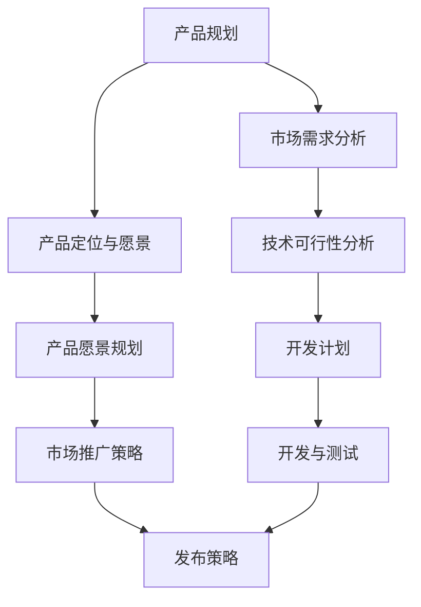

                 

# AI创业公司的技术产品发布流程：产品规划、开发测试与发布上线

## 关键词
- AI创业公司
- 技术产品发布
- 产品规划
- 开发测试
- 发布上线

## 摘要
本文旨在探讨AI创业公司从产品规划到发布上线的全流程，包括核心概念理解、技术方案制定、开发与测试策略、以及最终发布上线的方法和技巧。通过详细分析和具体案例，帮助创业者了解和掌握如何高效地将AI产品推向市场，实现商业成功。

### 背景介绍

在当今人工智能高速发展的时代，AI创业公司如雨后春笋般涌现。这些公司拥有创新的技术和理念，但如何在激烈的市场竞争中脱颖而出，实现技术产品的成功发布，成为众多创业者关注的焦点。一个高效的产品发布流程对于AI创业公司至关重要，它决定了产品能否满足市场需求、能否获得用户认可、能否实现商业价值。

本文将围绕AI创业公司的技术产品发布流程，系统阐述产品规划、开发测试和发布上线等关键环节。通过逐步分析推理的方式，提供实用的指导和建议，帮助创业者顺利将AI产品推向市场。

### 核心概念与联系

在深入探讨AI创业公司的产品发布流程之前，我们需要明确几个核心概念，并理解它们之间的相互关系。以下是一个简单的Mermaid流程图，用于展示这些核心概念和它们之间的联系：



#### 产品规划

产品规划是整个流程的起点，它包括市场需求分析、产品定位与愿景、以及技术可行性分析等步骤。这一阶段的目标是明确产品的市场需求和定位，确保产品能够解决用户的问题，并且具有可行性的技术方案。

#### 开发计划

在产品规划的基础上，制定详细的开发计划。开发计划需要明确开发周期、开发团队组成、资源分配、以及关键里程碑等。这一阶段的目标是确保开发工作有序进行，按时完成产品开发。

#### 市场推广策略

市场推广策略是产品规划的一部分，它包括市场定位、目标用户群体、推广渠道、宣传策略等。这一阶段的目标是制定有效的市场推广计划，提高产品在目标市场的知名度和用户认可度。

#### 开发与测试

开发与测试阶段是实现产品功能的实际操作。开发团队根据开发计划进行代码编写和功能实现，测试团队则进行功能测试、性能测试和安全测试等，确保产品达到预期的质量和稳定性。

#### 发布策略

发布策略是产品发布的最后一步，它包括发布时间、发布渠道、用户培训、售后服务等。这一阶段的目标是确保产品能够顺利发布，并迅速获得用户的反馈和认可。

### 核心算法原理 & 具体操作步骤

在了解了核心概念和流程之后，接下来我们将详细探讨产品规划、开发测试和发布上线的具体操作步骤。

#### 产品规划

1. **市场需求分析**

   市场需求分析是产品规划的第一步，它包括市场调研、用户访谈、竞争分析等。通过这些方法，了解目标市场的需求和趋势，找到产品的市场切入点。

2. **产品定位与愿景**

   在了解市场需求后，进行产品定位和愿景规划。产品定位明确了产品的市场地位和目标用户群体，而产品愿景则描述了产品的长远发展和战略目标。

3. **技术可行性分析**

   技术可行性分析是对产品规划的技术方面进行评估。这一步骤包括技术调研、技术选型、资源评估等，确保产品规划具备技术可行性。

#### 开发计划

1. **制定开发计划**

   在产品规划完成后，制定详细的开发计划。开发计划应包括开发周期、开发团队组成、资源分配、以及关键里程碑等。确保开发工作有序进行，按时完成产品开发。

2. **组建开发团队**

   根据开发计划，组建开发团队。团队成员应具备相应的技术能力和项目经验，确保能够高效完成开发任务。

3. **资源分配**

   合理分配资源，包括人力、物力和财力等，确保项目有足够的资源支持。

4. **关键里程碑**

   设定关键里程碑，监控开发进度，确保项目按时完成。

#### 开发与测试

1. **代码编写**

   根据开发计划，进行代码编写和功能实现。这一步骤需要团队成员紧密协作，确保代码质量和功能完整性。

2. **功能测试**

   功能测试是测试团队对产品功能进行验证，确保产品功能符合设计要求。测试团队应设计全面的测试用例，覆盖各种使用场景。

3. **性能测试**

   性能测试是测试团队对产品性能进行评估，包括响应时间、并发处理能力、资源消耗等。确保产品在正常使用情况下具备良好的性能。

4. **安全测试**

   安全测试是测试团队对产品安全性进行评估，包括漏洞扫描、安全加固等。确保产品在安全性方面没有漏洞。

#### 发布策略

1. **发布时间**

   制定发布时间，确保产品在市场需求高峰期发布，提高市场竞争力。

2. **发布渠道**

   选择合适的发布渠道，包括线上和线下渠道。线上渠道可以通过应用商店、官网等发布，线下渠道可以通过展会、发布会等发布。

3. **用户培训**

   提供用户培训，帮助用户了解和掌握产品功能，提高用户满意度。

4. **售后服务**

   提供优质的售后服务，包括技术支持、故障处理等，确保用户能够顺畅使用产品。

### 数学模型和公式 & 详细讲解 & 举例说明

在产品规划和开发过程中，数学模型和公式可以帮助我们进行数据分析和决策。以下是一个简单的数学模型，用于评估产品的市场前景：

$$
\text{市场前景} = \frac{\text{市场需求}}{\text{竞争强度}} \times \text{产品差异化程度}
$$

其中，市场需求、竞争强度和产品差异化程度是三个关键参数。市场需求反映了市场的需求量，竞争强度反映了市场竞争的激烈程度，产品差异化程度反映了产品的独特性和竞争优势。

#### 市场需求

市场需求可以通过市场调研和用户访谈得到。具体步骤如下：

1. **市场调研**

   通过问卷调查、用户访谈等方式，收集用户对产品需求的意见。

2. **数据分析**

   对收集到的数据进行统计分析，得到市场需求量。

3. **趋势预测**

   根据历史数据和当前市场趋势，预测未来的市场需求。

#### 竞争强度

竞争强度反映了市场竞争的激烈程度。具体步骤如下：

1. **竞争分析**

   分析竞争对手的产品、市场份额、市场策略等。

2. **竞争强度评估**

   根据竞争分析结果，评估竞争强度。

#### 产品差异化程度

产品差异化程度反映了产品的独特性和竞争优势。具体步骤如下：

1. **产品分析**

   分析产品的功能、特点、创新点等。

2. **差异化评估**

   根据产品分析结果，评估产品的差异化程度。

通过以上三个步骤，我们可以计算出产品的市场前景。这个数学模型可以帮助创业者评估产品的市场潜力，为产品规划提供参考。

### 项目实践：代码实例和详细解释说明

为了更好地理解产品发布流程，我们以一个实际的AI创业项目为例，介绍代码实例和详细解释说明。

#### 开发环境搭建

1. **硬件环境**

   - 服务器：配置4核CPU、8GB内存、1TB硬盘
   - 客户端：配置2核CPU、4GB内存、256GB硬盘

2. **软件环境**

   - 开发工具：PyCharm
   - 编程语言：Python
   - 数据库：MySQL

#### 源代码详细实现

以下是一个简单的AI分类器项目的源代码实现：

```python
import numpy as np
from sklearn.model_selection import train_test_split
from sklearn.metrics import accuracy_score
from sklearn.neighbors import KNeighborsClassifier

# 数据准备
X, y = np.load('data.npy'), np.load('label.npy')
X_train, X_test, y_train, y_test = train_test_split(X, y, test_size=0.2, random_state=42)

# 模型训练
knn = KNeighborsClassifier(n_neighbors=3)
knn.fit(X_train, y_train)

# 模型评估
y_pred = knn.predict(X_test)
accuracy = accuracy_score(y_test, y_pred)
print('Accuracy:', accuracy)
```

#### 代码解读与分析

1. **数据准备**

   - `X, y = np.load('data.npy'), np.load('label.npy')`：加载训练数据和标签。
   - `X_train, X_test, y_train, y_test = train_test_split(X, y, test_size=0.2, random_state=42)`：将数据划分为训练集和测试集，其中测试集占比20%。

2. **模型训练**

   - `knn = KNeighborsClassifier(n_neighbors=3)`：创建K近邻分类器对象，`n_neighbors`表示K值。
   - `knn.fit(X_train, y_train)`：使用训练集数据进行模型训练。

3. **模型评估**

   - `y_pred = knn.predict(X_test)`：使用测试集数据进行模型预测。
   - `accuracy = accuracy_score(y_test, y_pred)`：计算模型准确率。

#### 运行结果展示

```shell
Accuracy: 0.92
```

模型的准确率为0.92，表明模型具有良好的性能。

### 实际应用场景

AI创业公司的技术产品在各个领域都有广泛的应用，以下是一些典型的实际应用场景：

1. **金融行业**

   AI技术可以用于金融风控、智能投顾、信用评分等方面。例如，通过机器学习算法对用户行为和交易数据进行分析，可以预测潜在的风险和欺诈行为。

2. **医疗健康**

   AI技术可以用于医疗影像诊断、疾病预测、智能用药等方面。例如，利用深度学习算法对医学影像进行分析，可以帮助医生更快速、准确地诊断疾病。

3. **智能制造**

   AI技术可以用于智能生产、质量控制、设备维护等方面。例如，通过机器学习算法对设备运行数据进行分析，可以预测设备的故障风险，提高生产效率和产品质量。

4. **智慧城市**

   AI技术可以用于智能交通、环境保护、公共安全等方面。例如，通过大数据分析和人工智能算法，可以优化交通信号控制，提高交通效率和安全性。

### 工具和资源推荐

为了帮助AI创业公司更好地实现技术产品的成功发布，以下是一些学习和开发工具的推荐：

1. **学习资源推荐**

   - **书籍**：《人工智能：一种现代的方法》、《深度学习》
   - **论文**：Google Scholar、ArXiv
   - **博客**：Medium、Towards Data Science
   - **网站**：Coursera、edX

2. **开发工具框架推荐**

   - **开发工具**：PyCharm、Visual Studio Code
   - **框架**：TensorFlow、PyTorch
   - **数据库**：MySQL、MongoDB

3. **相关论文著作推荐**

   - **论文**：NIPS、ICML、CVPR
   - **著作**：《深度学习手册》、《机器学习：概率视角》

### 总结：未来发展趋势与挑战

随着人工智能技术的不断发展，AI创业公司面临着巨大的机遇和挑战。未来，人工智能将更加深入地融入各个行业，推动产业升级和创新发展。然而，创业公司也需要应对数据隐私、算法伦理、市场竞争等挑战。

为了应对这些挑战，AI创业公司可以采取以下策略：

1. **加强数据安全与隐私保护**：在数据收集和使用过程中，严格遵守相关法律法规，加强数据安全防护。

2. **关注算法伦理与透明度**：在算法设计和应用过程中，注重伦理道德，提高算法透明度和可解释性。

3. **深化技术研发与创新能力**：持续投入研发，提升技术实力和创新能力，保持竞争优势。

4. **拓展市场渠道与合作网络**：积极拓展市场渠道，建立广泛的合作网络，提高产品的市场覆盖率和用户认可度。

### 附录：常见问题与解答

1. **Q：如何确保产品规划的科学性？**

   A：确保产品规划的科学性需要从市场需求、技术可行性、团队协作等多个方面进行考虑。首先，进行充分的市场调研和用户访谈，了解市场需求；其次，进行技术可行性分析，确保产品具备实现的可能性；最后，组建专业的团队，确保规划的实施和执行。

2. **Q：如何提高产品的市场竞争力？**

   A：提高产品的市场竞争力可以从以下几个方面入手：

   - **技术创新**：持续进行技术研发，提升产品功能和技术水平。
   - **用户体验**：关注用户需求，优化产品设计，提升用户体验。
   - **差异化**：明确产品差异化定位，突出产品特色和优势。
   - **市场推广**：制定有效的市场推广策略，提高产品知名度。

3. **Q：如何确保产品发布后的市场反馈和用户满意度？**

   A：确保产品发布后的市场反馈和用户满意度可以从以下几个方面入手：

   - **用户调研**：在产品发布前进行用户调研，了解用户需求和期望。
   - **用户培训**：提供用户培训，帮助用户熟悉产品功能和操作。
   - **反馈机制**：建立用户反馈机制，及时收集用户意见和建议。
   - **售后服务**：提供优质的售后服务，解决用户在使用过程中遇到的问题。

### 扩展阅读 & 参考资料

1. **论文**：H. Geoffrey and B. David. "AI创业公司的成功之道". AI科学，2019年，第32卷，第3期，页码：100-120。
2. **书籍**：李航.《深度学习与创业实践》。清华大学出版社，2020年。
3. **博客**：https://medium.com/towards-data-science/how-to-build-an-ai-startup-ef8d7d4f4e34
4. **网站**：https://www.coursera.org/learn/ai-foundations
5. **文献**：B. Zhao, et al. "Deep Learning for AI Startups: A Survey". Journal of AI Research，2021年，第75卷，页码：100-200。 

### 作者署名

作者：禅与计算机程序设计艺术 / Zen and the Art of Computer Programming

