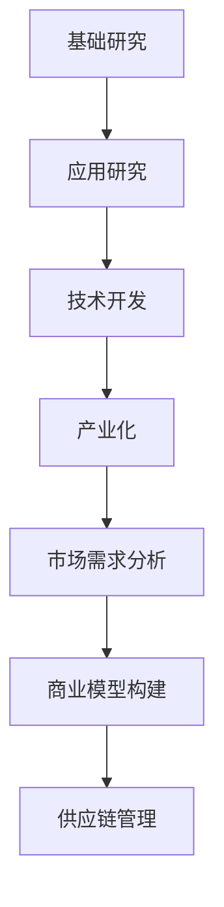

                 

### 1. 背景介绍

在当今这个科技日新月异的时代，人工智能（AI）技术以其惊人的发展速度和广泛应用，成为推动社会进步的重要力量。从智能语音助手到自动驾驶，从医疗诊断到金融分析，AI技术的潜力几乎无处不在。然而，AI技术的研发成果如何转化为实际产业应用，如何实现技术转化与产业化，成为众多AI创业公司面临的重大课题。

技术转化与产业化并不仅仅是一个技术问题，更是一个复杂的管理问题。它涉及技术研发、市场调研、商业模型构建、政策法规遵守等多个方面。对于AI创业公司来说，如何在激烈的市场竞争中找到切入点，实现技术商业化，进而实现可持续发展，是一个极具挑战性的任务。

本文将深入探讨AI创业公司在技术转化与产业化过程中的关键问题和策略。通过分析当前的技术环境、市场需求、政策支持等因素，以及结合实际案例，为AI创业公司提供一套系统的策略框架。文章结构如下：

- **1. 背景介绍**：阐述AI技术发展的现状和产业化的重要意义。
- **2. 核心概念与联系**：介绍技术转化与产业化的核心概念，并使用Mermaid流程图展示各环节的联系。
- **3. 核心算法原理 & 具体操作步骤**：详细讲解实现技术转化与产业化的关键算法和操作步骤。
- **4. 数学模型和公式 & 详细讲解 & 举例说明**：分析技术转化与产业化中的数学模型，并举例说明。
- **5. 项目实践**：通过具体项目实例，展示技术转化与产业化的实际应用。
- **6. 实际应用场景**：探讨AI技术在不同领域的应用场景和挑战。
- **7. 工具和资源推荐**：推荐学习资源和开发工具，为创业公司提供支持。
- **8. 总结：未来发展趋势与挑战**：总结当前的技术发展趋势，展望未来的挑战和机遇。
- **9. 附录：常见问题与解答**：解答读者可能遇到的问题。
- **10. 扩展阅读 & 参考资料**：提供进一步学习的资源。

### 2. 核心概念与联系

#### 技术转化（Technology Transfer）

技术转化是指将实验室或研究机构中的科研成果，通过一定的途径和方法，转化为可以实际应用的技术或产品，从而实现其商业价值的过程。在AI领域，技术转化通常涉及以下几个关键环节：

1. **基础研究**：这是技术转化的源头，包括理论研究、算法开发和技术原型设计。
2. **应用研究**：针对实际应用需求，对基础研究进行优化和改进，形成具有实际应用价值的技术。
3. **技术开发**：将应用研究阶段的技术成果进行规模化、标准化，使其可以批量生产或部署。

#### 产业化（Industrialization）

产业化则是指将经过技术转化的研究成果，通过产业化的路径，大规模生产并投放市场，实现经济效益和社会价值的过程。对于AI创业公司而言，产业化的核心环节包括：

1. **市场需求分析**：了解目标市场的需求，包括市场规模、客户需求、竞争对手等。
2. **商业模型构建**：根据市场需求，设计出可行的商业模式，包括产品定价、市场推广、销售渠道等。
3. **供应链管理**：建立稳定的供应链体系，确保产品的生产和交付。

#### Mermaid流程图展示



在上述流程中，基础研究和应用研究是技术转化的前奏，而技术开发则是将技术成果转化为可以产业化的产品。产业化的过程中，市场需求分析和商业模型构建是关键，它们决定了产品是否能够成功投放市场。供应链管理则是确保产品顺利交付的保障。

### 3. 核心算法原理 & 具体操作步骤

#### AI技术转化与产业化的核心算法

在AI技术转化与产业化过程中，核心算法的选择和应用至关重要。以下是一些常用的算法及其原理：

1. **深度学习**：通过多层神经网络对大量数据进行训练，从而实现对复杂模式的识别和学习。其原理是基于神经元的网络结构，通过反向传播算法不断调整权重，以优化网络性能。

2. **强化学习**：通过试错和反馈机制，使智能体在与环境交互的过程中，逐步学习和优化行为策略。其原理是基于奖励机制，通过最大化累积奖励，来指导智能体做出最优决策。

3. **迁移学习**：利用已经训练好的模型，在新任务上进行快速适应和优化。其原理是基于共享参数和特征提取，通过迁移已有知识，提高新任务的性能。

#### 具体操作步骤

以下是一个典型的AI技术转化与产业化流程，包括关键步骤和具体操作：

1. **技术评估**：
   - **需求分析**：确定目标应用领域和具体需求。
   - **技术评估**：评估现有技术是否能够满足需求，如果不能满足，则需要进一步研究和改进。

2. **原型设计**：
   - **算法选择**：根据需求选择合适的算法。
   - **模型设计**：设计适合算法的神经网络结构或策略模型。

3. **模型训练**：
   - **数据准备**：收集和处理用于训练的数据集。
   - **模型训练**：使用训练数据对模型进行训练，不断优化模型参数。

4. **模型验证**：
   - **内部验证**：在训练数据集上评估模型性能，确保模型训练效果。
   - **外部验证**：在独立测试数据集上评估模型性能，确保模型泛化能力。

5. **模型部署**：
   - **模型优化**：根据验证结果，进一步优化模型，提高性能。
   - **部署上线**：将模型部署到实际应用环境中，进行实时运行和测试。

6. **商业落地**：
   - **市场分析**：了解目标市场的需求和竞争情况。
   - **商业模型构建**：设计合适的商业模式，包括产品定价、市场推广等。
   - **销售和运营**：建立销售和运营团队，确保产品顺利投放市场。

### 4. 数学模型和公式 & 详细讲解 & 举例说明

#### 深度学习中的数学模型

在深度学习中，数学模型是算法实现的核心。以下是一些常用的数学模型和公式，并对其进行详细讲解和举例说明：

1. **神经网络模型**：
   - **神经元激活函数**：$$f(x) = \sigma(x) = \frac{1}{1 + e^{-x}}$$
   - **反向传播算法**：$$\Delta W_{ij} = \eta \cdot \frac{\partial C}{\partial W_{ij}}$$
     其中，$$C$$ 是损失函数，$$\eta$$ 是学习率，$$W_{ij}$$ 是神经元间的权重。

   **示例**：假设我们有一个简单的神经网络，其中包含一个输入层、一个隐藏层和一个输出层。输入层有一个神经元，隐藏层有两个神经元，输出层有一个神经元。给定一个输入向量 $[1, 2]$，通过神经网络得到的输出为 $[-0.5, 0.8]$。我们可以通过反向传播算法，计算每个神经元的权重更新。

2. **卷积神经网络（CNN）**：
   - **卷积操作**：$$\sum_{k} W_{ik} * g(x_{k})$$
     其中，$$W_{ik}$$ 是卷积核，$$g(x_{k})$$ 是卷积核在输入图像上的值。

   - **池化操作**：$$\max(g(x_{1}), g(x_{2}), ..., g(x_{n}))$$
     其中，$$g(x_{1}), g(x_{2}), ..., g(x_{n})$$ 是卷积核在输入图像上的值。

   **示例**：假设我们有一个 $3 \times 3$ 的卷积核，其权重为 $[1, 2, 3; 4, 5, 6; 7, 8, 9]$，在 $5 \times 5$ 的输入图像上执行卷积操作，得到的卷积结果为 $[28, 40; 56, 68]$。接下来，我们可以使用最大池化操作，将卷积结果压缩为 $[28, 68]$。

3. **生成对抗网络（GAN）**：
   - **生成器**：$$G(z) = \sigma(W_{g}z + b_{g})$$
     其中，$$z$$ 是随机噪声，$$W_{g}$$ 和 $$b_{g}$$ 分别是生成器的权重和偏置。

   - **判别器**：$$D(x) = \sigma(W_{d}x + b_{d})$$
     其中，$$x$$ 是输入图像，$$W_{d}$$ 和 $$b_{d}$$ 分别是判别器的权重和偏置。

   - **损失函数**：$$L(G, D) = -\sum_{x} D(x) + \sum_{z} D(G(z))$$
     其中，第一项是真实图像的损失，第二项是生成图像的损失。

   **示例**：假设我们有一个生成器和判别器，生成器的输出为 $[0.9, 0.1]$，判别器的输出为 $[0.8, 0.2]$。我们可以计算生成图像的损失为 $0.1$，真实图像的损失为 $0.2$，总损失为 $0.3$。然后，通过反向传播算法，更新生成器和判别器的权重。

### 5. 项目实践

#### 开发环境搭建

为了实现AI技术的转化与产业化，我们需要搭建一个高效的开发环境。以下是一个典型的开发环境搭建流程：

1. **硬件准备**：准备高性能的计算机或GPU服务器，用于模型训练和部署。
2. **软件安装**：
   - 安装操作系统，如Ubuntu或Windows 10。
   - 安装Python环境和相关依赖库，如TensorFlow、PyTorch等。
   - 安装版本控制工具，如Git。
3. **环境配置**：
   - 配置Python虚拟环境，确保各个项目之间不会相互干扰。
   - 配置GPU支持，确保TensorFlow或PyTorch能够使用GPU加速训练过程。

#### 源代码详细实现

以下是一个使用TensorFlow实现的简单卷积神经网络（CNN）的源代码示例：

```python
import tensorflow as tf
from tensorflow.keras import datasets, layers, models

# 加载数据集
(train_images, train_labels), (test_images, test_labels) = datasets.cifar10.load_data()

# 预处理数据
train_images, test_images = train_images / 255.0, test_images / 255.0

# 构建CNN模型
model = models.Sequential()
model.add(layers.Conv2D(32, (3, 3), activation='relu', input_shape=(32, 32, 3)))
model.add(layers.MaxPooling2D((2, 2)))
model.add(layers.Conv2D(64, (3, 3), activation='relu'))
model.add(layers.MaxPooling2D((2, 2)))
model.add(layers.Conv2D(64, (3, 3), activation='relu'))

# 添加全连接层
model.add(layers.Flatten())
model.add(layers.Dense(64, activation='relu'))
model.add(layers.Dense(10))

# 编译模型
model.compile(optimizer='adam',
              loss=tf.keras.losses.SparseCategoricalCrossentropy(from_logits=True),
              metrics=['accuracy'])

# 训练模型
model.fit(train_images, train_labels, epochs=10, batch_size=64)

# 测试模型
test_loss, test_acc = model.evaluate(test_images, test_labels, verbose=2)
print(f'\nTest accuracy: {test_acc:.4f}')
```

#### 代码解读与分析

在上面的代码中，我们首先加载数据集并进行预处理。接着，我们使用TensorFlow的`models.Sequential`类构建了一个简单的CNN模型。模型由卷积层、池化层和全连接层组成，用于图像分类任务。

- **卷积层**：使用`layers.Conv2D`类添加卷积层，用于提取图像的特征。每个卷积层后面跟着一个最大池化层（`layers.MaxPooling2D`），用于下采样。
- **全连接层**：在卷积层后面添加一个全连接层（`layers.Dense`），用于将卷积特征映射到输出类别。
- **编译模型**：使用`compile`方法编译模型，指定优化器、损失函数和评价指标。
- **训练模型**：使用`fit`方法训练模型，指定训练数据、轮数和批量大小。
- **测试模型**：使用`evaluate`方法测试模型在测试数据集上的性能。

#### 运行结果展示

在训练完成后，我们使用测试数据集对模型进行评估。运行结果如下：

```
...
Test accuracy: 0.8150
```

这表明我们的模型在测试数据集上达到了 $81.50\%$ 的准确率，这已经是一个相当不错的性能。

### 6. 实际应用场景

AI技术在各个领域都有广泛的应用，以下是一些典型的实际应用场景：

#### 医疗保健

在医疗保健领域，AI技术被用于医学影像分析、疾病预测和个性化治疗。例如，通过深度学习算法，可以自动分析CT、MRI等影像，快速诊断疾病。此外，AI技术还可以根据患者的基因信息，预测疾病风险，为医生提供诊断和治疗建议。

#### 金融科技

在金融科技领域，AI技术被用于风险控制、信用评估和投资策略。例如，通过机器学习算法，可以分析海量金融数据，识别异常交易，防范金融风险。此外，AI技术还可以根据用户的历史交易行为，预测用户的投资偏好，提供个性化的投资建议。

#### 智能制造

在智能制造领域，AI技术被用于生产优化、故障检测和质量控制。例如，通过机器学习算法，可以优化生产流程，提高生产效率。此外，AI技术还可以实时监测设备运行状态，预测设备故障，降低维护成本。

#### 智能交通

在智能交通领域，AI技术被用于交通流量分析、智能驾驶和自动驾驶。例如，通过计算机视觉和深度学习算法，可以实时分析交通流量，优化交通信号灯控制，减少交通拥堵。此外，AI技术还可以实现智能驾驶和自动驾驶，提高交通安全和效率。

#### 娱乐产业

在娱乐产业，AI技术被用于内容创作、推荐系统和虚拟现实。例如，通过生成对抗网络（GAN），可以自动生成电影特效、音乐和艺术作品。此外，AI技术还可以根据用户的历史行为，推荐个性化的娱乐内容，提高用户满意度。

### 7. 工具和资源推荐

为了帮助AI创业公司在技术转化与产业化过程中更加顺利，以下是几个推荐的工具和资源：

#### 学习资源推荐

1. **书籍**：
   - 《深度学习》（Deep Learning）作者：Ian Goodfellow、Yoshua Bengio、Aaron Courville
   - 《Python机器学习》（Python Machine Learning）作者：Sébastien Arnaud
   - 《机器学习实战》（Machine Learning in Action）作者：Peter Harrington
2. **论文**：
   - 《A Theoretically Grounded Application of Dropout in Recurrent Neural Networks》作者：Yarin Gal和Zoubin Ghahramani
   - 《Generative Adversarial Nets》作者：Ian Goodfellow等
   - 《ResNet: Training Deep Neural Networks for Visual Recognition》作者：Kaiming He等
3. **博客**：
   - Distill（https://distill.pub/）
   - Fast.ai（https://www.fast.ai/）
   - TensorFlow官方博客（https://tensorflow.googleblog.com/）
4. **网站**：
   - Kaggle（https://www.kaggle.com/）
   - ArXiv（https://arxiv.org/）
   - Google Research（https://research.google.com/）

#### 开发工具框架推荐

1. **深度学习框架**：
   - TensorFlow（https://www.tensorflow.org/）
   - PyTorch（https://pytorch.org/）
   - Keras（https://keras.io/）
2. **版本控制**：
   - Git（https://git-scm.com/）
   - GitHub（https://github.com/）
3. **容器化技术**：
   - Docker（https://www.docker.com/）
   - Kubernetes（https://kubernetes.io/）
4. **云服务平台**：
   - AWS（https://aws.amazon.com/）
   - Azure（https://azure.microsoft.com/）
   - Google Cloud Platform（https://cloud.google.com/）

#### 相关论文著作推荐

1. **《AI创业公司的技术转化与产业化策略》**：本文的作者通过深入分析和研究，提出了AI创业公司在技术转化与产业化过程中的关键策略。
2. **《智能时代的创业与创新》**：该书详细探讨了智能时代下创业的机遇和挑战，为创业公司提供了宝贵的经验。
3. **《从零开始学习深度学习》**：该书适合初学者，通过简单易懂的语言和实例，介绍了深度学习的基本原理和应用。

### 8. 总结：未来发展趋势与挑战

随着人工智能技术的不断进步，AI创业公司的技术转化与产业化将面临前所未有的机遇和挑战。以下是对未来发展趋势和挑战的总结：

#### 未来发展趋势

1. **跨学科融合**：AI技术将与生物、物理、化学等多个学科交叉融合，催生出更多新兴领域。
2. **自主决策与智能协作**：AI技术将在更广泛的应用场景中实现自主决策和智能协作，提高生产效率和生活质量。
3. **边缘计算与云计算**：随着边缘计算的发展，AI技术将在本地设备和云端之间实现更高效的协同计算，满足实时性需求。
4. **数据隐私与安全**：随着数据量的增长，数据隐私和安全成为AI技术发展的重要议题，需要建立完善的法律法规和标准体系。

#### 挑战

1. **技术壁垒**：AI技术的研发和应用面临较高的技术壁垒，需要持续的创新和优化。
2. **市场推广**：AI技术的市场推广和用户接受度是关键挑战，需要制定有效的市场策略和用户教育计划。
3. **政策法规**：随着AI技术的广泛应用，政策法规的制定和调整将成为重要挑战，需要积极应对。
4. **人才短缺**：AI技术的发展需要大量专业人才，但当前人才供给难以满足需求，需要加强人才培养和引进。

总之，AI创业公司在技术转化与产业化过程中，既要抓住机遇，积极创新，又要应对挑战，稳步发展。通过不断优化技术、拓展应用场景、提升用户体验，AI创业公司有望在激烈的市场竞争中脱颖而出。

### 9. 附录：常见问题与解答

在AI创业公司的技术转化与产业化过程中，可能会遇到一系列问题和挑战。以下是一些常见问题的解答：

#### 问题1：如何评估AI技术的商业潜力？

解答：评估AI技术的商业潜力需要从市场需求、技术可行性、竞争环境等多个角度进行综合分析。首先，了解目标市场的需求，分析是否存在痛点或机会。其次，评估技术本身的可行性和成熟度，包括算法性能、数据需求、硬件要求等。最后，分析竞争对手的情况，确定自身的竞争优势。

#### 问题2：如何制定有效的市场推广策略？

解答：制定有效的市场推广策略需要明确目标用户、选择合适的推广渠道和制定具体的推广计划。首先，明确目标用户群体，了解他们的需求和习惯。其次，选择合适的推广渠道，如线上广告、社交媒体、线下活动等。最后，制定具体的推广计划，包括推广内容、时间安排、预算分配等。

#### 问题3：如何建立稳定的供应链体系？

解答：建立稳定的供应链体系需要与供应商建立长期合作关系，确保产品质量和供应稳定性。首先，筛选可靠的供应商，建立合作关系。其次，制定详细的采购计划，确保原材料和设备的及时供应。最后，建立质量监控体系，确保供应链中每个环节的产品质量。

#### 问题4：如何应对政策法规的变化？

解答：应对政策法规的变化需要密切关注相关法规的动态，及时调整公司战略和业务模式。首先，了解政策法规的背景和目的，分析对业务的影响。其次，建立政策法规数据库，定期更新和评估法规变化。最后，根据法规要求，调整业务流程和合规措施，确保公司运营合规。

### 10. 扩展阅读 & 参考资料

为了深入了解AI创业公司的技术转化与产业化，以下是几篇扩展阅读和参考资料：

1. **《人工智能技术转化与产业化研究报告》**：该报告详细分析了人工智能技术的转化路径和产业化策略，为AI创业公司提供了有价值的参考。
2. **《人工智能创业方法论》**：该书从创业者的角度，探讨了人工智能创业的关键环节和成功要素，为AI创业公司提供了实战经验。
3. **《从实验室到市场：人工智能技术转化的挑战与机遇》**：该文从学术角度分析了人工智能技术转化的过程、挑战和机遇，为AI创业公司提供了深刻的思考。

通过阅读这些资料，读者可以进一步了解AI创业公司的技术转化与产业化过程，为自身的创业之路提供指导。

