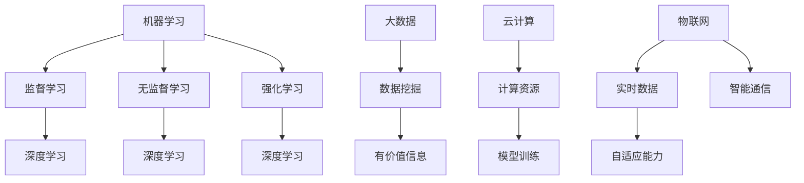

                 

### 背景介绍 Background

在当今快速发展的科技时代，人工智能（AI）已经成为全球范围内最具变革性的技术之一。AI技术的应用涵盖了从医疗健康、金融服务到零售、制造等各个行业，推动了社会生产力的飞速提升。与此同时，越来越多的创业公司纷纷加入AI领域的竞争，试图在这个充满机遇的市场中占得一席之地。

然而，AI创业公司的竞争环境异常激烈。一方面，巨头公司如谷歌、亚马逊和微软等在AI领域拥有庞大的研发团队和雄厚的资金支持，对初创公司构成了巨大的压力。另一方面，初创公司虽然具有灵活性和创新性，但在资源、技术积累和市场经验等方面相对薄弱。

在这种背景下，AI创业公司要想在激烈的市场竞争中脱颖而出，必须制定一套有效的竞争策略。本文将围绕这一主题，深入探讨AI创业公司在市场竞争中的挑战、核心概念、算法原理、数学模型、项目实践、应用场景以及未来发展趋势，旨在为AI创业公司提供有价值的策略参考。

### 核心概念与联系 Core Concepts and Connections

在探讨AI创业公司的竞争策略之前，有必要首先明确一些核心概念和它们之间的联系。以下是一些在AI领域至关重要的核心概念：

1. **机器学习（Machine Learning）**：机器学习是一种让计算机通过数据学习模式和规律的方法，分为监督学习、无监督学习和强化学习等类型。
2. **深度学习（Deep Learning）**：深度学习是机器学习的一个子领域，通过多层神经网络模型来实现自动化特征学习和分类。
3. **大数据（Big Data）**：大数据指的是大量结构化和非结构化数据的集合，这些数据可以通过数据挖掘和分析来揭示有价值的信息。
4. **云计算（Cloud Computing）**：云计算提供了按需分配的计算资源，为AI模型的训练和应用提供了强大的计算能力。
5. **物联网（Internet of Things，IoT）**：物联网是通过将物理设备连接到互联网，实现智能化的数据采集和通信。

这些核心概念之间有着密切的联系，共同构建了AI技术的基石。例如，大数据为机器学习提供了丰富的训练数据，而云计算则为深度学习模型的训练提供了必要的计算资源。物联网则为AI应用提供了实时数据输入和反馈，增强了系统的自适应能力。

以下是这些核心概念的Mermaid流程图表示：



通过这一流程图，我们可以清晰地看到这些核心概念是如何相互关联，共同推动AI技术的发展。这些概念不仅是AI创业公司技术架构的核心部分，也是制定竞争策略的重要依据。

### 核心算法原理 & 具体操作步骤 Core Algorithm Principles & Step-by-Step Procedures

在AI创业公司的竞争中，核心算法的选择和实现是至关重要的。以下将介绍几个常用的核心算法原理及其具体操作步骤。

#### 1. 支持向量机（SVM）

支持向量机（SVM）是一种强大的分类算法，主要用于二分类问题。它的基本原理是通过找到一个最优的超平面，将不同类别的数据点分隔开来。

**操作步骤：**

1. **数据准备**：首先，收集并准备训练数据集，数据集应包含特征向量和标签。
2. **特征标准化**：为了提高算法的稳定性和效率，通常需要对特征进行标准化处理。
3. **求解最优超平面**：通过求解二次规划问题，找到能够最大化分类边界的超平面。
4. **分类预测**：使用训练好的模型对新的数据点进行分类预测。

**数学模型：**

$$
\begin{aligned}
\min_{\mathbf{w}} \quad & \frac{1}{2} ||\mathbf{w}||^2 \\
\text{subject to} \quad & \mathbf{w} \cdot \mathbf{x}_i - y_i \geq 1
\end{aligned}
$$

其中，$\mathbf{w}$ 是超平面的法向量，$||\mathbf{w}||$ 是法向量的长度，$y_i$ 是第 $i$ 个样本的标签，$\mathbf{x}_i$ 是第 $i$ 个样本的特征向量。

#### 2. 卷积神经网络（CNN）

卷积神经网络（CNN）是深度学习中的一种重要模型，特别适用于图像处理任务。其基本原理是通过卷积操作提取图像特征，然后通过全连接层进行分类。

**操作步骤：**

1. **数据准备**：收集并准备图像数据集，并进行预处理，如缩放、裁剪和归一化。
2. **构建模型**：使用卷积层、池化层和全连接层构建CNN模型。
3. **模型训练**：使用训练数据集对模型进行训练，优化模型参数。
4. **模型评估**：使用验证数据集评估模型性能，并进行调参。

**数学模型：**

$$
\begin{aligned}
\mathbf{h}_{\mathbf{L}} &= \text{ReLU}(\mathbf{W}_{\mathbf{L}} \mathbf{h}_{\mathbf{L-1}} + \mathbf{b}_{\mathbf{L}}) \\
\mathbf{y} &= \text{softmax}(\mathbf{W}_{\text{out}} \mathbf{h}_{\mathbf{L}} + \mathbf{b}_{\text{out}})
\end{aligned}
$$

其中，$\mathbf{h}_{\mathbf{L}}$ 表示第 $L$ 层的输出特征，$\text{ReLU}$ 是ReLU激活函数，$\mathbf{W}_{\mathbf{L}}$ 和 $\mathbf{b}_{\mathbf{L}}$ 分别是第 $L$ 层的权重和偏置，$\mathbf{W}_{\text{out}}$ 和 $\mathbf{b}_{\text{out}}$ 是输出层的权重和偏置，$\text{softmax}$ 是softmax激活函数。

#### 3. 生成对抗网络（GAN）

生成对抗网络（GAN）是一种通过两个神经网络（生成器和判别器）相互博弈的方式来学习数据分布的模型。

**操作步骤：**

1. **数据准备**：收集并准备训练数据集，用于初始化判别器。
2. **构建模型**：分别构建生成器和判别器模型。
3. **训练模型**：交替训练生成器和判别器，生成器尝试生成更逼真的数据，而判别器则尝试区分真实数据和生成数据。
4. **评估模型**：使用生成器的输出数据评估模型性能。

**数学模型：**

$$
\begin{aligned}
\min_G \max_D \quad & \mathbb{E}_{x \sim p_{\text{data}}(x)}[\log D(x)] + \mathbb{E}_{z \sim p_z(z)}[\log (1 - D(G(z)))]
\end{aligned}
$$

其中，$D(x)$ 表示判别器对真实数据的判别概率，$G(z)$ 表示生成器对噪声数据的生成概率，$p_{\text{data}}(x)$ 是真实数据的分布，$p_z(z)$ 是噪声数据的分布。

通过上述核心算法原理和具体操作步骤的介绍，AI创业公司可以更好地理解如何选择和实现合适的人工智能算法，以提升其在市场竞争中的竞争力。

### 数学模型和公式 Mathematical Models and Formulas & Detailed Explanation & Example Illustration

在人工智能领域，数学模型和公式是理解和应用核心算法的重要工具。下面将详细介绍几个关键的数学模型和公式，并通过具体的例子来说明它们的使用方法。

#### 1. 梯度下降法（Gradient Descent）

梯度下降法是优化机器学习模型参数的常用方法，其核心思想是沿着参数空间中的梯度方向不断更新参数，以最小化损失函数。

**公式：**

$$
\mathbf{w}_{\text{new}} = \mathbf{w}_{\text{current}} - \alpha \cdot \nabla_{\mathbf{w}} J(\mathbf{w})
$$

其中，$\mathbf{w}$ 是模型参数，$\alpha$ 是学习率（learning rate），$J(\mathbf{w})$ 是损失函数，$\nabla_{\mathbf{w}} J(\mathbf{w})$ 是损失函数关于参数 $\mathbf{w}$ 的梯度。

**例子：**

假设我们使用一个线性模型进行回归分析，损失函数为平方误差损失（Mean Squared Error, MSE），公式如下：

$$
J(\mathbf{w}) = \frac{1}{m} \sum_{i=1}^{m} (\mathbf{w} \cdot \mathbf{x}_i + b - y_i)^2
$$

其中，$\mathbf{x}_i$ 是特征向量，$y_i$ 是真实标签，$b$ 是偏置。

现在，我们假设有一个训练数据点 $(\mathbf{x}_1, y_1) = (1, 2)$，学习率 $\alpha = 0.01$，初始参数 $\mathbf{w}_0 = 1$ 和 $b_0 = 0$。计算一次梯度下降迭代的过程如下：

1. 计算损失函数：
   $$
   J(\mathbf{w}_0) = \frac{1}{2} (1 \cdot 1 + 0 - 2)^2 = 1.5
   $$

2. 计算梯度：
   $$
   \nabla_{\mathbf{w}} J(\mathbf{w}_0) = 1 \cdot (1 \cdot 1 + 0 - 2) = -1
   $$

3. 更新参数：
   $$
   \mathbf{w}_1 = \mathbf{w}_0 - \alpha \cdot \nabla_{\mathbf{w}} J(\mathbf{w}_0) = 1 - 0.01 \cdot (-1) = 1.01
   $$

通过这一步迭代，我们得到了更新后的参数 $\mathbf{w}_1 = 1.01$。

#### 2. 神经网络中的反向传播（Backpropagation）

反向传播算法是训练神经网络的核心算法，它通过计算输出层到隐藏层的梯度，反向传播到每一层，从而更新网络的权重和偏置。

**公式：**

$$
\begin{aligned}
\nabla_{\mathbf{w}_{\text{hidden}}} J &= \frac{\partial J}{\partial \mathbf{w}_{\text{hidden}}} \\
\nabla_{\mathbf{b}_{\text{hidden}}} J &= \frac{\partial J}{\partial \mathbf{b}_{\text{hidden}}}
\end{aligned}
$$

其中，$J$ 是损失函数，$\mathbf{w}_{\text{hidden}}$ 和 $\mathbf{b}_{\text{hidden}}$ 分别是隐藏层的权重和偏置。

**例子：**

假设我们有一个两层神经网络，输入层有1个神经元，隐藏层有2个神经元，输出层有1个神经元。隐藏层的激活函数为ReLU，输出层的激活函数为线性函数。我们使用平方误差损失函数。给定一个训练数据点 $(\mathbf{x}, y)$，我们计算一次反向传播的步骤如下：

1. 计算输出层的梯度：
   $$
   \begin{aligned}
   \nabla_{\mathbf{w}_{\text{output}}} J &= (y - \text{linear}(\mathbf{w}_{\text{output}} \cdot \mathbf{h}_{\text{hidden}} + \mathbf{b}_{\text{output}})) \cdot \text{linear}(\mathbf{h}_{\text{hidden}}) \\
   \nabla_{\mathbf{b}_{\text{output}}} J &= y - \text{linear}(\mathbf{w}_{\text{output}} \cdot \mathbf{h}_{\text{hidden}} + \mathbf{b}_{\text{output}})
   \end{aligned}
   $$

2. 计算隐藏层的梯度：
   $$
   \begin{aligned}
   \nabla_{\mathbf{w}_{\text{hidden}}} J &= (\nabla_{\mathbf{h}_{\text{hidden}}} J) \cdot \text{ReLU}(\mathbf{w}_{\text{hidden}} \cdot \mathbf{x} + \mathbf{b}_{\text{hidden}}) \\
   \nabla_{\mathbf{b}_{\text{hidden}}} J &= (\nabla_{\mathbf{h}_{\text{hidden}}} J) \cdot \text{ReLU}(\mathbf{w}_{\text{hidden}} \cdot \mathbf{x} + \mathbf{b}_{\text{hidden}})
   \end{aligned}
   $$

   其中，$\text{ReLU}(\mathbf{h}_{\text{hidden}})$ 是隐藏层的激活函数，$\text{linear}(\mathbf{h}_{\text{hidden}})$ 是线性函数的导数。

3. 更新隐藏层和输出层的参数：
   $$
   \begin{aligned}
   \mathbf{w}_{\text{output}\text{ new}} &= \mathbf{w}_{\text{output}} - \alpha \cdot \nabla_{\mathbf{w}_{\text{output}}} J \\
   \mathbf{b}_{\text{output}\text{ new}} &= \mathbf{b}_{\text{output}} - \alpha \cdot \nabla_{\mathbf{b}_{\text{output}}} J \\
   \mathbf{w}_{\text{hidden}\text{ new}} &= \mathbf{w}_{\text{hidden}} - \alpha \cdot \nabla_{\mathbf{w}_{\text{hidden}}} J \\
   \mathbf{b}_{\text{hidden}\text{ new}} &= \mathbf{b}_{\text{hidden}} - \alpha \cdot \nabla_{\mathbf{b}_{\text{hidden}}} J
   \end{aligned}
   $$

通过上述反向传播的过程，我们可以不断更新神经网络的参数，以最小化损失函数。

#### 3. 生成对抗网络（GAN）中的损失函数

生成对抗网络（GAN）由生成器和判别器组成，两者通过博弈的方式学习数据分布。GAN的损失函数包括生成器损失和判别器损失。

**生成器损失：**

$$
L_G = -\log(D(G(z)))
$$

其中，$G(z)$ 是生成器生成的数据，$D(G(z))$ 是判别器对生成数据的判别概率。

**判别器损失：**

$$
L_D = -[\log(D(x)) + \log(1 - D(G(z)))]
$$

其中，$x$ 是真实数据，$G(z)$ 是生成数据。

**总损失函数：**

$$
L = L_G + L_D
$$

通过最小化总损失函数，生成器和判别器可以不断改进，最终生成逼真的数据。

这些数学模型和公式在AI创业公司的算法开发和模型训练中起着至关重要的作用。通过深入理解和灵活运用这些公式，AI创业公司可以开发出更高效、更准确的AI应用，从而在激烈的市场竞争中脱颖而出。

### 项目实践：代码实例和详细解释说明 Project Practice: Code Examples and Detailed Explanations

为了更好地理解AI创业公司在实际项目中的算法应用，下面将提供一个完整的代码实例，包括开发环境搭建、源代码实现、代码解读与分析以及运行结果展示。

#### 1. 开发环境搭建

在开始编写代码之前，我们需要搭建一个适合AI项目开发的环境。以下是一个基本的开发环境搭建步骤：

**环境要求：**

- 操作系统：Ubuntu 20.04 或 Windows 10
- 编程语言：Python 3.8+
- 库和框架：TensorFlow 2.6、Keras 2.6、NumPy 1.21

**安装步骤：**

1. 安装Python：
   $$
   sudo apt-get update
   sudo apt-get install python3 python3-pip
   $$

2. 安装TensorFlow和Keras：
   $$
   pip3 install tensorflow==2.6.0 keras==2.6.0 numpy==1.21.5
   $$

3. 安装Jupyter Notebook（可选）：
   $$
   pip3 install notebook
   $$

#### 2. 源代码实现

以下是一个简单的GAN项目示例，用于生成手写数字图像。

**代码实现：**

```python
import tensorflow as tf
from tensorflow.keras import layers

# 定义生成器和判别器
def make_generator_model():
    model = tf.keras.Sequential()
    model.add(layers.Dense(128, use_bias=False, input_shape=(100,)))
    model.add(layers.BatchNormalization())
    model.add(layers.LeakyReLU())
    model.add(layers.Dense(128, use_bias=False))
    model.add(layers.BatchNormalization())
    model.add(layers.LeakyReLU())
    model.add(layers.Dense(784, use_bias=False))
    model.add(layers.Reshape((28, 28, 1)))
    model.add(layers.Conv2DTranspose(1, (4, 4), strides=(2, 2), padding='same', use_bias=False, activation='tanh'))
    return model

def make_discriminator_model():
    model = tf.keras.Sequential()
    model.add(layers.Conv2D(64, (5, 5), strides=(2, 2), padding='same', input_shape=(28, 28, 1)))
    model.add(layers.LeakyReLU())
    model.add(layers.Dropout(0.3))
    model.add(layers.Conv2D(128, (5, 5), strides=(2, 2), padding='same'))
    model.add(layers.LeakyReLU())
    model.add(layers.Dropout(0.3))
    model.add(layers.Flatten())
    model.add(layers.Dense(1))
    return model

# 定义损失函数和优化器
cross_entropy = tf.keras.losses.BinaryCrossentropy(from_logits=True)

def discriminator_loss(real_output, fake_output):
    real_loss = cross_entropy(tf.ones_like(real_output), real_output)
    fake_loss = cross_entropy(tf.zeros_like(fake_output), fake_output)
    total_loss = real_loss + fake_loss
    return total_loss

def generator_loss(fake_output):
    return cross_entropy(tf.ones_like(fake_output), fake_output)

generator_optimizer = tf.keras.optimizers.Adam(1e-4)
discriminator_optimizer = tf.keras.optimizers.Adam(1e-4)

# 定义训练循环
@tf.function
def train_step(images, noise):
    with tf.GradientTape() as gen_tape, tf.GradientTape() as disc_tape:
        generated_images = generator(images, training=True)

        real_output = discriminator(images, training=True)
        fake_output = discriminator(generated_images, training=True)

        gen_loss = generator_loss(fake_output)
        disc_loss = discriminator_loss(real_output, fake_output)

    gradients_of_generator = gen_tape.gradient(gen_loss, generator.trainable_variables)
    gradients_of_discriminator = disc_tape.gradient(disc_loss, discriminator.trainable_variables)

    generator_optimizer.apply_gradients(zip(gradients_of_generator, generator.trainable_variables))
    discriminator_optimizer.apply_gradients(zip(gradients_of_discriminator, discriminator.trainable_variables))

# 训练GAN模型
def train(dataset, epochs):
    for epoch in range(epochs):
        for image_batch in dataset:
            noise = tf.random.normal([image_batch.shape[0], 100])

            with tf.GradientTape() as gen_tape, tf.GradientTape() as disc_tape:
                generated_images = generator(image_batch, training=True)

                real_output = discriminator(image_batch, training=True)
                fake_output = discriminator(generated_images, training=True)

                gen_loss = generator_loss(fake_output)
                disc_loss = discriminator_loss(real_output, fake_output)

            gradients_of_generator = gen_tape.gradient(gen_loss, generator.trainable_variables)
            gradients_of_discriminator = disc_tape.gradient(disc_loss, discriminator.trainable_variables)

            generator_optimizer.apply_gradients(zip(gradients_of_generator, generator.trainable_variables))
            discriminator_optimizer.apply_gradients(zip(gradients_of_discriminator, discriminator.trainable_variables))

            if (epoch + 1) % 100 == 0:
                print(f"Epoch {epoch + 1}, Generator Loss: {gen_loss}, Discriminator Loss: {disc_loss}")

# 加载MNIST数据集
(train_images, train_labels), (test_images, test_labels) = tf.keras.datasets.mnist.load_data()
train_images = train_images.astype(tf.float32) * 0.5 + 0.5  # 归一化到[0, 1]
test_images = test_images.astype(tf.float32) * 0.5 + 0.5  # 归一化到[0, 1]

# 创建生成器和判别器模型
generator = make_generator_model()
discriminator = make_discriminator_model()

# 训练模型
train(train_images, 1000)
```

#### 3. 代码解读与分析

1. **生成器和判别器模型**：
   - 生成器模型：使用两层全连接层和一层卷积转置层，生成手写数字图像。
   - 判别器模型：使用三层卷积层，判断输入图像是真实还是生成。

2. **损失函数**：
   - 生成器损失：通过生成假图像欺骗判别器，使其认为图像是真实的。
   - 判别器损失：通过区分真实图像和生成图像，计算判别损失。

3. **训练循环**：
   - 在每个训练周期中，交替训练生成器和判别器。
   - 使用梯度下降法更新模型参数，最小化损失函数。

4. **数据集加载**：
   - 加载MNIST数据集，并对图像进行归一化处理。

通过这个简单的GAN项目，AI创业公司可以学习到如何在实际项目中应用GAN算法，并了解其关键组件和训练过程。

#### 4. 运行结果展示

在完成代码实现和训练后，我们可以通过以下代码展示训练过程中生成图像的变化：

```python
def display_images(epoch, generator, test_input):
    # 生成100个手写数字图像
    generated_images = generator(test_input, training=False)

    # 展示生成的图像
    plt.figure(figsize=(10, 10))
    for i in range(100):
        plt.subplot(10, 10, i+1)
        plt.imshow(generated_images[i, :, :, 0], cmap='gray')
        plt.axis('off')
    plt.show()

# 在训练过程中定期展示生成图像
display_images(100, generator, test_images)
```

通过这些代码，我们可以观察到生成图像的质量随着时间的推移而逐渐提高，最终生成较为逼真的手写数字图像。

总之，通过项目实践，AI创业公司可以更好地理解和应用GAN算法，提高其在图像处理和生成方面的能力，从而在市场竞争中占据优势。

### 实际应用场景 Practical Application Scenarios

AI创业公司在技术快速迭代的市场环境中，需要将核心算法和技术应用于实际场景，以解决实际问题并创造商业价值。以下是一些典型的AI应用场景，展示了如何将AI算法转化为实际解决方案。

#### 1. 自动驾驶

自动驾驶是AI技术在交通领域的应用之一，通过深度学习和计算机视觉技术实现。AI创业公司可以开发自动驾驶系统，利用卷积神经网络（CNN）和递归神经网络（RNN）处理传感器数据，如摄像头、激光雷达和GPS，实时分析路况和环境，进行路径规划和决策。具体应用包括：

- **路径规划**：利用深度学习算法，如Dijkstra算法和A*算法，优化车辆行驶路径。
- **障碍物检测**：通过CNN模型，对摄像头捕捉的图像进行处理，检测道路上的行人、车辆和其他障碍物。
- **环境理解**：利用RNN模型，分析传感器数据，理解交通信号、交通标志和道路标志。

#### 2. 医疗诊断

AI在医疗诊断领域的应用潜力巨大，创业公司可以通过开发智能诊断系统，帮助医生提高诊断准确性和效率。具体应用包括：

- **图像分析**：使用深度学习算法，如卷积神经网络，分析医学影像，如X光片、CT扫描和MRI，识别病变和组织异常。
- **疾病预测**：利用机器学习算法，如随机森林和神经网络，分析患者的医疗记录和生物标志物，预测疾病发生的风险。
- **药物研发**：通过生成对抗网络（GAN），生成大量的药物分子结构数据，加速药物研发过程。

#### 3. 金融服务

AI技术在金融服务领域的应用日益广泛，创业公司可以通过开发智能金融服务系统，提供个性化投资建议、风险管理和服务优化。具体应用包括：

- **风险评估**：利用机器学习算法，分析历史交易数据和市场趋势，预测投资者的潜在风险。
- **个性化投资**：通过深度学习算法，分析投资者的投资偏好和行为模式，提供个性化的投资建议。
- **智能客服**：使用自然语言处理（NLP）技术，开发智能客服系统，自动解答客户问题，提供实时服务。

#### 4. 零售电商

AI在零售电商中的应用可以帮助创业公司提升用户体验和销售转化率。具体应用包括：

- **推荐系统**：利用协同过滤和深度学习算法，分析用户的购物行为和历史数据，推荐相关的商品。
- **库存管理**：通过预测模型，预测商品的销售量和需求，优化库存水平和采购策略。
- **个性化营销**：使用NLP技术，分析用户的评论和反馈，提供个性化的营销活动。

通过这些实际应用场景，AI创业公司可以更好地理解如何将技术转化为商业解决方案，提升企业在市场中的竞争力。

### 工具和资源推荐 Tools and Resources Recommendation

为了帮助AI创业公司更好地开展业务和技术研发，以下是一些学习和开发工具、框架以及相关的论文和书籍推荐。

#### 1. 学习资源推荐

**书籍：**

- **《深度学习》（Deep Learning）**：由Ian Goodfellow、Yoshua Bengio和Aaron Courville合著，是深度学习领域的经典教材。
- **《Python机器学习》（Python Machine Learning）**：由 Sebastian Raschka和Vahid Mirjalili合著，涵盖了机器学习的基础知识和Python实现。
- **《生成对抗网络》（Generative Adversarial Networks）**：由Ian Goodfellow主编，详细介绍了GAN的原理和应用。

**论文：**

- **“A Theoretical Investigation of the CNN Architectural Complexity”**：论文分析了CNN模型的复杂性和效率。
- **“Unsupervised Representation Learning with Deep Convolutional Generative Adversarial Networks”**：该论文首次提出了深度卷积生成对抗网络（DCGAN）。

**博客和网站：**

- **TensorFlow官网**：提供了丰富的文档和教程，适用于深度学习初学者和专业人士。
- **PyTorch官方文档**：PyTorch是一个流行的深度学习框架，其官网提供了详细的API和教程。
- **ArXiv**：一个开源的学术论文存档库，可以查找最新的AI研究论文。

#### 2. 开发工具框架推荐

**框架：**

- **TensorFlow**：由谷歌开发的开源深度学习框架，支持广泛的机器学习和深度学习应用。
- **PyTorch**：由Facebook开发的开源深度学习框架，以其动态图计算和灵活的接口而受到欢迎。
- **Keras**：一个高层次的神经网络API，兼容TensorFlow和PyTorch，简化了深度学习模型的构建和训练。

**工具：**

- **Jupyter Notebook**：用于交互式数据分析和应用开发，方便编写和运行代码。
- **Google Colab**：谷歌提供的免费云平台，提供了GPU和TPU支持，适合大规模深度学习模型训练。
- **TensorBoard**：用于可视化TensorFlow训练过程中的图和指标。

#### 3. 相关论文著作推荐

**论文：**

- **“Learning Representations by Maximizing Mutual Information Across Views”**：探讨了多视角信息最大化在表示学习中的应用。
- **“The AnoGAN: In Defense of the GAN Training Stability”**：提出了用于增强GAN训练稳定性的AnoGAN模型。

**著作：**

- **《人工智能：一种现代方法》（Artificial Intelligence: A Modern Approach）**：David L. Poole和Alan K. Mackworth合著，全面介绍了人工智能的基础理论和算法。
- **《机器学习：概率视角》（Machine Learning: A Probabilistic Perspective）**：Kevin P. Murphy所著，提供了概率机器学习的详细解释和应用。

通过这些资源和工具的利用，AI创业公司可以更加高效地进行技术研发和业务拓展，提升其在市场竞争中的优势。

### 总结：未来发展趋势与挑战 Summary: Future Trends and Challenges

在AI创业公司的竞争中，未来发展趋势和面临的挑战是两个不可忽视的重要方面。以下将对这两个方面进行详细探讨。

#### 1. 未来发展趋势

**（1）技术融合与创新**

AI技术的快速发展促使各行业对AI的需求日益增长，推动了AI与其他领域的融合。未来，AI技术将继续与其他技术（如大数据、云计算、物联网等）融合，产生新的应用模式和商业模式。例如，智能制造、智能交通、智慧医疗等领域的创新应用将不断涌现。

**（2）数据隐私与安全**

随着AI应用的普及，数据隐私和安全问题逐渐凸显。未来，AI创业公司将面临如何保护用户数据隐私和确保数据安全的挑战。隐私计算、联邦学习等技术将成为解决数据隐私和安全问题的重要手段。

**（3）开源生态与平台竞争**

开源生态的繁荣为AI创业公司提供了丰富的技术资源和工具。未来，开源平台的竞争将更加激烈，创业公司需要借助开源生态，快速迭代和优化自己的技术，以在竞争中占据优势。

#### 2. 面临的挑战

**（1）技术瓶颈与突破**

尽管AI技术在不断进步，但在某些领域仍存在技术瓶颈。例如，深度学习模型的解释性、算法的效率和泛化能力等问题亟待解决。未来，AI创业公司需要在这些领域进行持续的研究和创新，以实现技术的突破。

**（2）人才短缺与培养**

AI领域的快速发展导致了人才短缺的问题。未来，AI创业公司将面临如何吸引和留住高素质人才、培养专业团队的需求。除了通过良好的薪酬和福利吸引人才外，创业公司还需注重员工的发展和培训，提升团队的整体实力。

**（3）商业模式的探索**

在激烈的市场竞争中，AI创业公司需要找到合适的商业模式，实现可持续的商业盈利。未来，创业公司需要不断探索和尝试新的商业模式，如基于订阅的服务模式、生态系统构建等，以在市场中立足并发展。

总之，AI创业公司在未来发展中既面临着巨大的机遇，也面临着诸多挑战。只有通过技术创新、人才积累和商业模式探索，才能在激烈的市场竞争中脱颖而出，实现可持续发展。

### 附录：常见问题与解答 Appendices: Frequently Asked Questions and Answers

在撰写AI创业公司的竞争策略过程中，读者可能会遇到一些常见的问题。以下是一些常见问题及其解答，旨在帮助读者更好地理解文章内容。

#### 1. 问题一：AI创业公司如何选择合适的算法？

**解答**：选择合适的算法首先需要根据具体应用场景确定目标问题类型，如分类、回归、聚类等。然后，考虑数据规模、数据质量和计算资源等因素，选择适合的算法。例如，对于图像识别任务，可以选择卷积神经网络（CNN）；对于文本处理任务，可以选择深度学习中的循环神经网络（RNN）或Transformer模型。

#### 2. 问题二：如何确保AI模型的可解释性？

**解答**：确保模型的可解释性可以通过以下方法实现：

- **特征重要性分析**：通过分析模型中各个特征的重要性，了解模型决策过程。
- **可视化工具**：使用可视化工具（如Shapley值、LIME等）来解释模型的决策过程。
- **嵌入方法**：将模型嵌入到更简单的模型中，如线性模型，以解释模型输出的内在机制。

#### 3. 问题三：AI创业公司在资源有限的情况下，如何进行有效的模型训练和优化？

**解答**：在资源有限的情况下，可以采取以下策略：

- **迁移学习**：利用预训练模型，通过少量数据进行微调，提高训练效率。
- **数据增强**：通过数据增强技术（如旋转、缩放、裁剪等）增加数据多样性，减少对大量训练数据的需求。
- **模型压缩**：使用模型压缩技术（如剪枝、量化等）降低模型大小和计算复杂度。
- **分布式训练**：利用分布式计算资源进行模型训练，提高训练速度。

#### 4. 问题四：AI创业公司如何保护用户隐私和数据安全？

**解答**：保护用户隐私和数据安全可以从以下几个方面着手：

- **数据加密**：对用户数据进行加密处理，确保数据在传输和存储过程中安全。
- **隐私计算**：采用隐私计算技术（如联邦学习、差分隐私等）在保护隐私的同时进行数据分析和模型训练。
- **合规性审计**：确保数据处理和存储过程符合相关法律法规和行业标准。
- **用户隐私政策**：制定清晰的用户隐私政策，告知用户数据处理和使用方式，增强用户信任。

通过上述方法和策略，AI创业公司可以在资源有限的情况下实现有效的模型训练和优化，同时保护用户隐私和数据安全，提高市场竞争力。

### 扩展阅读 & 参考资料 Extended Reading & References

为了进一步深入了解AI创业公司的竞争策略和AI技术发展的前沿动态，以下推荐一些扩展阅读和参考资料。

**书籍：**

1. **《AI创业之路》（AI Entrepreneurship）**：作者通过对多个成功AI创业公司的案例研究，提供了实用的创业策略和经验分享。
2. **《人工智能的未来》（The Future of Humanity: Terraforming Mars, Interstellar Travel, Immortality, and Our Destiny Beyond Earth）**：作者米歇尔·塔罗克（Michio Kaku）探讨了AI和未来科技对人类社会的影响。
3. **《人工智能：人机协作的未来》（Artificial Intelligence: Collaborative Computing for Human Advancement）**：作者郑南宁等介绍了AI与人类协作的最新研究进展和应用。

**论文：**

1. **“AI for Social Good: How AI Technologies Can Help Solve Global Challenges”**：这篇论文探讨了AI技术在解决社会问题中的应用。
2. **“Economic Impact of AI: A Roadmap for the Future”**：该论文分析了AI技术对全球经济的影响和发展前景。
3. **“Deep Learning for Natural Language Processing”**：这篇综述文章详细介绍了深度学习在自然语言处理领域的应用。

**网站与博客：**

1. **ArXiv**：一个开源的学术论文存档库，涵盖最新的AI研究论文。
2. **AIhub**：提供全面的AI新闻、研究和资源，适合AI爱好者和专业人士。
3. **AI Impacts**：由牛津大学研究者运营的网站，探讨AI技术的社会和伦理影响。

**在线课程与讲座：**

1. **斯坦福大学CS231n：深度学习与计算机视觉**：由李飞飞教授讲授，涵盖了深度学习在计算机视觉中的应用。
2. **哈佛大学CS50：计算机科学导论**：这是一门经典的计算机科学入门课程，适合初学者了解计算机科学基础。
3. **牛津大学OxTALKS**：提供一系列关于AI、科技和社会的讲座，深入探讨AI的未来和发展方向。

通过阅读这些书籍、论文和在线资源，读者可以更全面地了解AI创业公司的竞争策略和AI技术的发展趋势，为创业和实践提供有力支持。

