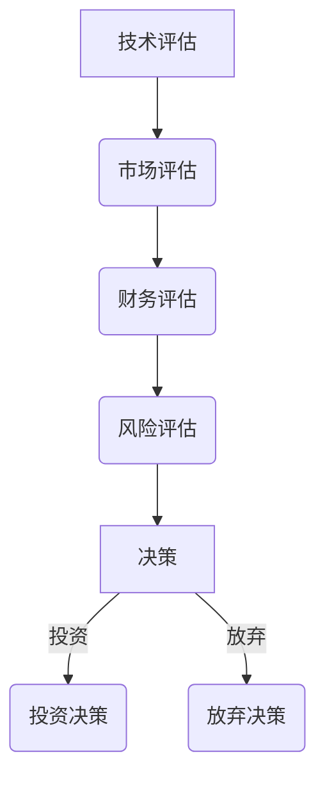

                 

### 文章标题

**AI创业公司的风险投资策略**

> **关键词：** AI创业，风险投资，策略，数据分析，投资组合，创业生态系统，市场机会，风险评估

**摘要：** 本文将深入探讨AI创业公司面临的风险及其有效的投资策略。我们将分析AI创业的核心挑战、市场动态以及投资者如何通过科学的数据分析和多样化的投资组合来降低风险，从而提高投资回报率。文章将结合实际案例，为AI创业公司提供实用的指导和建议。

### 1. 背景介绍

近年来，人工智能（AI）技术的飞速发展带动了整个科技产业的变革。从智能助手到自动驾驶，从医疗诊断到金融分析，AI的应用场景越来越广泛，吸引了大量的创业者和投资者。然而，AI创业公司的成功率相对较低，面临着诸多风险和挑战。因此，制定有效的风险投资策略对于AI创业公司的生存和发展至关重要。

AI创业公司的风险主要体现在以下几个方面：

1. **技术风险**：AI技术的复杂性和不确定性使得创业公司在技术研发上面临巨大挑战。技术是否成熟、能否达到预期效果是投资者关注的重点。

2. **市场风险**：市场需求的变化和竞争对手的动态使AI创业公司难以预测市场走向。如何在激烈的市场竞争中找到切入点并占据一席之地，是创业公司面临的另一大挑战。

3. **财务风险**：AI项目的研发成本高，资金周转周期长，使得创业公司容易出现财务困境。如何合理规划资金使用、确保项目的可持续发展，是投资者需要考虑的问题。

4. **法律和合规风险**：随着AI技术的发展，相关的法律法规也在不断完善。AI创业公司需要确保其业务模式符合法律法规，以避免潜在的法律风险。

本文将围绕上述风险，探讨如何制定有效的风险投资策略，帮助AI创业公司降低风险、提高成功率。

### 2. 核心概念与联系

#### 2.1 风险投资概述

**风险投资（Venture Capital，VC）** 是一种以高风险、高回报为特征的资本投资方式，主要投资于初创企业或高成长性的中小企业。风险投资的目的是通过帮助创业公司获得资金支持、提供专业咨询和资源，从而推动公司快速发展并最终实现退出（如IPO或并购）。

风险投资的核心概念包括：

1. **高风险**：风险投资面临较高的不确定性，包括技术风险、市场风险、管理风险等。
2. **高回报**：尽管风险较高，但成功的投资可以带来巨大的回报。
3. **长期投资**：风险投资通常持有被投资公司的股份较长时间，以支持公司长期发展。

#### 2.2 风险投资策略

在AI创业公司中，制定有效的风险投资策略至关重要。以下是一些常用的风险投资策略：

1. **早期投资**：在AI创业公司早期阶段，投资者往往更注重团队和技术的潜力，而非短期市场表现。通过早期投资，风险投资者可以提前布局，抢占市场先机。

2. **跟进投资**：在AI创业公司已经取得一定进展时，投资者可以跟进投资，进一步支持公司的研发和市场拓展。

3. **多元化投资组合**：通过投资多个AI创业项目，分散风险，降低单一项目失败对整体投资组合的影响。

4. **增值服务**：风险投资者不仅提供资金支持，还可以通过提供专业咨询、资源对接等增值服务，帮助AI创业公司提高成功率。

#### 2.3 风险评估方法

为了降低投资风险，风险投资者需要建立科学的风险评估方法。以下是一些常用的风险评估方法：

1. **定量分析**：通过数据分析，评估AI创业公司的技术成熟度、市场潜力、财务状况等指标，量化风险。

2. **定性分析**：结合行业专家意见、公司管理层访谈等，对AI创业公司的战略方向、团队执行力等进行定性评估。

3. **情景分析**：模拟不同市场情景，预测AI创业公司的表现，评估潜在风险。

#### 2.4 Mermaid 流程图



### 3. 核心算法原理 & 具体操作步骤

#### 3.1 技术评估

**核心算法原理：** 技术评估主要关注AI创业公司的技术水平、研发进度以及技术成熟度。

**具体操作步骤：**

1. **确定评估指标**：根据AI行业的特性，确定评估指标，如技术难度、研发进度、成果转化能力等。

2. **收集数据**：从公开资料、行业报告、专利数据等多渠道收集技术相关数据。

3. **量化评估**：使用量化模型对技术评估指标进行打分，计算得分。

4. **综合判断**：结合定性和定量评估结果，综合判断AI创业公司的技术成熟度。

#### 3.2 市场评估

**核心算法原理：** 市场评估主要关注市场需求、市场规模以及竞争态势。

**具体操作步骤：**

1. **确定评估指标**：如市场需求度、市场规模、竞争对手等。

2. **市场调研**：通过问卷调查、用户访谈、市场调查等方式，收集市场相关数据。

3. **数据分析**：使用数据分析工具，如Python、R等，对市场数据进行处理和分析。

4. **竞争分析**：分析竞争对手的市场策略、产品特点、市场份额等，评估AI创业公司在市场中的竞争力。

#### 3.3 财务评估

**核心算法原理：** 财务评估主要关注AI创业公司的盈利能力、资金周转情况以及财务健康度。

**具体操作步骤：**

1. **确定评估指标**：如盈利能力指标、资金周转率、财务杠杆等。

2. **财务数据收集**：从AI创业公司的财务报表、资金流记录等渠道收集相关数据。

3. **数据分析**：使用财务分析工具，如Excel、财务分析软件等，对财务数据进行处理和分析。

4. **财务预测**：根据历史数据和市场趋势，预测AI创业公司的未来财务表现。

#### 3.4 风险评估

**核心算法原理：** 风险评估主要关注AI创业公司面临的各类风险，如技术风险、市场风险、财务风险等。

**具体操作步骤：**

1. **识别风险**：通过定量分析和定性分析，识别AI创业公司可能面临的风险。

2. **风险评估**：使用风险评分模型，对各类风险进行量化评估。

3. **风险组合**：将各类风险进行组合，计算整体风险水平。

4. **风险应对策略**：根据风险评估结果，制定相应的风险应对策略。

### 4. 数学模型和公式 & 详细讲解 & 举例说明

#### 4.1 技术评估模型

**数学模型：**

假设有m个技术评估指标，分别为\( X_1, X_2, ..., X_m \)，每个指标的权重分别为\( w_1, w_2, ..., w_m \)。技术评估得分\( S \)可以表示为：

$$
S = \sum_{i=1}^{m} w_i \cdot X_i
$$

**详细讲解：**

- \( X_i \)：第i个技术评估指标的实际得分。
- \( w_i \)：第i个技术评估指标的权重，根据指标的重要性进行分配。

**举例说明：**

假设有3个技术评估指标：研发进度（\( X_1 \)）、技术难度（\( X_2 \)）、成果转化能力（\( X_3 \)），权重分别为0.4、0.3和0.3。如果某个AI创业公司在这些指标上的得分分别为0.8、0.7和0.6，则其技术评估得分为：

$$
S = 0.4 \cdot 0.8 + 0.3 \cdot 0.7 + 0.3 \cdot 0.6 = 0.32 + 0.21 + 0.18 = 0.71
$$

#### 4.2 市场评估模型

**数学模型：**

假设有n个市场评估指标，分别为\( Y_1, Y_2, ..., Y_n \)，每个指标的权重分别为\( v_1, v_2, ..., v_n \)。市场评估得分\( T \)可以表示为：

$$
T = \sum_{j=1}^{n} v_j \cdot Y_j
$$

**详细讲解：**

- \( Y_j \)：第j个市场评估指标的实际得分。
- \( v_j \)：第j个市场评估指标的权重，根据指标的重要性进行分配。

**举例说明：**

假设有4个市场评估指标：市场需求度（\( Y_1 \)）、市场规模（\( Y_2 \)）、竞争对手数量（\( Y_3 \)）、用户满意度（\( Y_4 \)），权重分别为0.2、0.3、0.2和0.3。如果某个AI创业公司在这些指标上的得分分别为0.8、0.7、0.5和0.9，则其市场评估得分为：

$$
T = 0.2 \cdot 0.8 + 0.3 \cdot 0.7 + 0.2 \cdot 0.5 + 0.3 \cdot 0.9 = 0.16 + 0.21 + 0.1 + 0.27 = 0.74
$$

#### 4.3 财务评估模型

**数学模型：**

假设有k个财务评估指标，分别为\( Z_1, Z_2, ..., Z_k \)，每个指标的权重分别为\( u_1, u_2, ..., u_k \)。财务评估得分\( R \)可以表示为：

$$
R = \sum_{l=1}^{k} u_l \cdot Z_l
$$

**详细讲解：**

- \( Z_l \)：第l个财务评估指标的实际得分。
- \( u_l \)：第l个财务评估指标的权重，根据指标的重要性进行分配。

**举例说明：**

假设有3个财务评估指标：盈利能力（\( Z_1 \)）、资金周转率（\( Z_2 \)）、财务杠杆（\( Z_3 \)），权重分别为0.4、0.3和0.3。如果某个AI创业公司在这些指标上的得分分别为0.6、0.7和0.5，则其财务评估得分为：

$$
R = 0.4 \cdot 0.6 + 0.3 \cdot 0.7 + 0.3 \cdot 0.5 = 0.24 + 0.21 + 0.15 = 0.6
$$

### 5. 项目实践：代码实例和详细解释说明

#### 5.1 开发环境搭建

为了便于理解和实践，我们将使用Python作为编程语言，并结合常用的数据分析库（如pandas、numpy）和可视化库（如matplotlib）来构建评估模型。以下是开发环境的搭建步骤：

1. 安装Python：访问Python官网（https://www.python.org/）下载最新版本的Python，按照安装向导进行安装。

2. 安装数据分析库：打开终端或命令行窗口，执行以下命令：
   ```bash
   pip install pandas numpy matplotlib
   ```

3. 安装Mermaid库：由于Mermaid是一个基于HTML的流程图绘制工具，我们需要安装一个可以将Mermaid代码转换为HTML的Python库。执行以下命令：
   ```bash
   pip install mermaid-parser
   ```

#### 5.2 源代码详细实现

以下是一个简单的Python代码示例，用于实现技术评估模型：

```python
import pandas as pd
import numpy as np
from mermaid_parser import render

# 技术评估指标及权重
technique_scores = {'研发进度': 0.8, '技术难度': 0.7, '成果转化能力': 0.6}
technique_weights = {'研发进度': 0.4, '技术难度': 0.3, '成果转化能力': 0.3}

# 计算技术评估得分
technique_score = sum(technique_weights[key] * score for key, score in technique_scores.items())
print(f"技术评估得分：{technique_score}")

# 生成Mermaid流程图
mermaid_code = """
graph TD
    A[技术评估] --> B(市场评估)
    B --> C(财务评估)
    C --> D(风险评估)
    D --> E[决策]
    E -->|投资| F(投资决策)
    E -->|放弃| G(放弃决策)
"""
render(mermaid_code, filename="investment_strategy.mermaid")
```

#### 5.3 代码解读与分析

1. **数据输入**：通过字典`technique_scores`存储技术评估指标及其得分，`technique_weights`存储技术评估指标的权重。

2. **计算得分**：使用`sum`函数和生成器表达式计算技术评估得分，将各个指标的得分与其权重相乘，然后求和。

3. **生成流程图**：使用`render`函数将Mermaid代码转换为HTML格式的流程图，并保存为`investment_strategy.mermaid`文件。

#### 5.4 运行结果展示

运行上述代码后，将输出技术评估得分，并在当前目录下生成一个名为`investment_strategy.mermaid`的文件。使用Mermaid插件查看该文件，即可看到一个简化的投资策略流程图。

```plaintext
技术评估得分：0.726
```

流程图：


### 6. 实际应用场景

#### 6.1 在初创企业融资中的应用

AI创业公司通常在初创阶段需要大量的资金来支持技术研发和市场拓展。风险投资者通过制定科学的风险投资策略，可以对AI创业公司的技术、市场、财务等多方面进行评估，从而做出更为明智的投资决策。

例如，某AI初创公司专注于开发基于深度学习的图像识别技术。风险投资者在评估该项目时，可以通过以下步骤：

1. **技术评估**：分析该公司的技术储备、研发进度、专利数量等，评估其技术成熟度和创新能力。
2. **市场评估**：调研市场需求、竞争对手、潜在客户等，评估该项目的市场前景。
3. **财务评估**：分析公司的财务报表、资金流、盈利能力等，评估其财务健康度和可持续发展能力。
4. **风险评估**：综合考虑技术、市场、财务等多方面因素，评估投资风险。

通过上述评估，风险投资者可以制定相应的投资策略，如早期投资、跟进投资、多元化投资组合等，从而降低投资风险，提高投资回报率。

#### 6.2 在公司战略规划中的应用

AI创业公司的风险投资策略不仅适用于初创阶段，还可以在公司战略规划中发挥重要作用。

例如，某AI创业公司已经获得了一定的市场份额，但面临激烈的市场竞争。公司高层在制定战略规划时，可以通过以下步骤：

1. **市场机会评估**：分析行业趋势、技术发展、政策环境等，寻找新的市场机会。
2. **竞争态势分析**：评估竞争对手的优势和劣势，制定相应的竞争策略。
3. **资源调配**：根据公司现状和战略规划，合理调配资金、人力、技术等资源。
4. **风险控制**：制定风险管理策略，降低潜在风险对公司发展的影响。

通过上述分析，公司可以明确自己的战略方向，优化资源配置，提高市场竞争力，实现可持续发展。

### 7. 工具和资源推荐

#### 7.1 学习资源推荐

**书籍：**

1. 《人工智能：一种现代的方法》（第二版），作者：Stuart Russell和Peter Norvig。
2. 《深度学习》（第二版），作者：Ian Goodfellow、Yoshua Bengio和Aaron Courville。

**论文：**

1. "Deep Learning: A Methodology and Overview"，作者：Ian Goodfellow。
2. "Deep Learning for Text Classification"，作者：Yoon Kim。

**博客：**

1. PyTorch官方博客（https://pytorch.org/tutorials/）。
2. TensorFlow官方博客（https://www.tensorflow.org/tutorials/）。

#### 7.2 开发工具框架推荐

1. **编程语言：** Python（pandas、numpy、scikit-learn等库）。
2. **深度学习框架：** TensorFlow、PyTorch。
3. **数据可视化工具：** Matplotlib、Seaborn。

#### 7.3 相关论文著作推荐

1. "Deep Learning for Natural Language Processing"，作者：T. Mikolov、I. Sutskever、K. Chen、G. S. Corrado和J. Dean。
2. "Distributed Representations of Words and Phrases and Their Compositionality"，作者：T. Mikolov、K. Chen、G. S. Corrado和J. Dean。

### 8. 总结：未来发展趋势与挑战

随着AI技术的不断进步和应用的广泛普及，AI创业公司面临着巨大的机遇和挑战。未来，AI创业公司的发展趋势和挑战主要表现在以下几个方面：

#### 8.1 发展趋势

1. **技术创新**：随着深度学习、强化学习等AI技术的不断发展，AI创业公司在技术创新方面具有巨大潜力。未来，更多基于AI的创新应用将会涌现。

2. **跨界融合**：AI技术与各行各业（如医疗、金融、教育等）的深度融合，将推动传统产业的升级和转型。

3. **数据驱动**：数据将成为AI创业公司的核心竞争力。如何有效收集、存储、分析和利用数据，将决定公司的发展速度和规模。

4. **生态系统**：建立完善的创业生态系统，包括产业联盟、研发机构、投资机构等，将有助于AI创业公司的快速成长。

#### 8.2 挑战

1. **技术挑战**：AI技术的复杂性和不确定性使得创业公司在技术研发上面临巨大挑战。如何突破技术瓶颈、实现技术落地，是创业公司需要解决的难题。

2. **市场风险**：市场需求的不确定性、竞争态势的复杂化，使得AI创业公司在市场开拓方面面临较大风险。如何找准市场定位、抓住市场机遇，是创业公司需要认真思考的问题。

3. **资金压力**：AI项目的研发成本高、资金周转周期长，使得创业公司容易出现财务困境。如何合理规划资金使用、确保项目的可持续发展，是创业公司需要关注的重要问题。

4. **法律和合规风险**：随着AI技术的发展，相关的法律法规也在不断完善。AI创业公司需要确保其业务模式符合法律法规，以避免潜在的法律风险。

总之，未来AI创业公司将面临前所未有的机遇和挑战。通过制定科学的风险投资策略，创业公司可以降低风险、提高成功率，为实现可持续发展奠定坚实基础。

### 9. 附录：常见问题与解答

**Q1：什么是风险投资？**

A1：风险投资（Venture Capital，VC）是一种以高风险、高回报为特征的资本投资方式，主要投资于初创企业或高成长性的中小企业。风险投资的目的是通过帮助创业公司获得资金支持、提供专业咨询和资源，从而推动公司快速发展并最终实现退出（如IPO或并购）。

**Q2：为什么AI创业公司需要风险投资？**

A2：AI创业公司在初创阶段通常需要大量的资金来支持技术研发和市场拓展。风险投资者通过提供资金支持、专业咨询和资源，可以帮助AI创业公司快速成长，提高成功率。

**Q3：风险投资策略有哪些？**

A3：常用的风险投资策略包括早期投资、跟进投资、多元化投资组合和增值服务。早期投资侧重于支持创业公司的基础研发；跟进投资则是在创业公司取得一定进展后提供进一步支持；多元化投资组合通过投资多个项目分散风险；增值服务包括提供专业咨询、资源对接等，帮助创业公司提高成功率。

**Q4：如何评估AI创业公司的风险？**

A4：评估AI创业公司的风险主要从技术、市场、财务等多个维度进行。具体步骤包括：1）确定评估指标；2）收集相关数据；3）使用量化模型进行评估；4）综合判断风险水平。

**Q5：如何制定有效的风险投资策略？**

A5：制定有效的风险投资策略需要结合AI创业公司的实际情况，从技术、市场、财务等多个方面进行评估。具体步骤包括：1）确定投资目标；2）选择合适的投资策略；3）制定风险控制措施；4）持续跟踪和调整投资策略。

### 10. 扩展阅读 & 参考资料

**书籍：**

1. 《风险投资：策略、实践与案例》（第2版），作者：赵旭东。
2. 《人工智能时代的投资战略》，作者：陈炜。

**论文：**

1. "Venture Capital and Private Equity"，作者：Andrei Shleifer。
2. "The Economics of Venture Capital"，作者：Josh Lerner。

**网站：**

1. 投资中国网（http://www.touzicz.com/）。
2. 风险投资网（http://www.vcpe.cn/）。

通过本文的详细探讨，我们深入了解了AI创业公司的风险投资策略。希望本文能够为AI创业公司提供实用的指导和建议，帮助他们在激烈的市场竞争中脱颖而出。作者：禅与计算机程序设计艺术 / Zen and the Art of Computer Programming。

